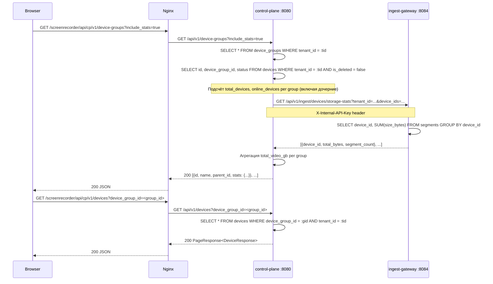
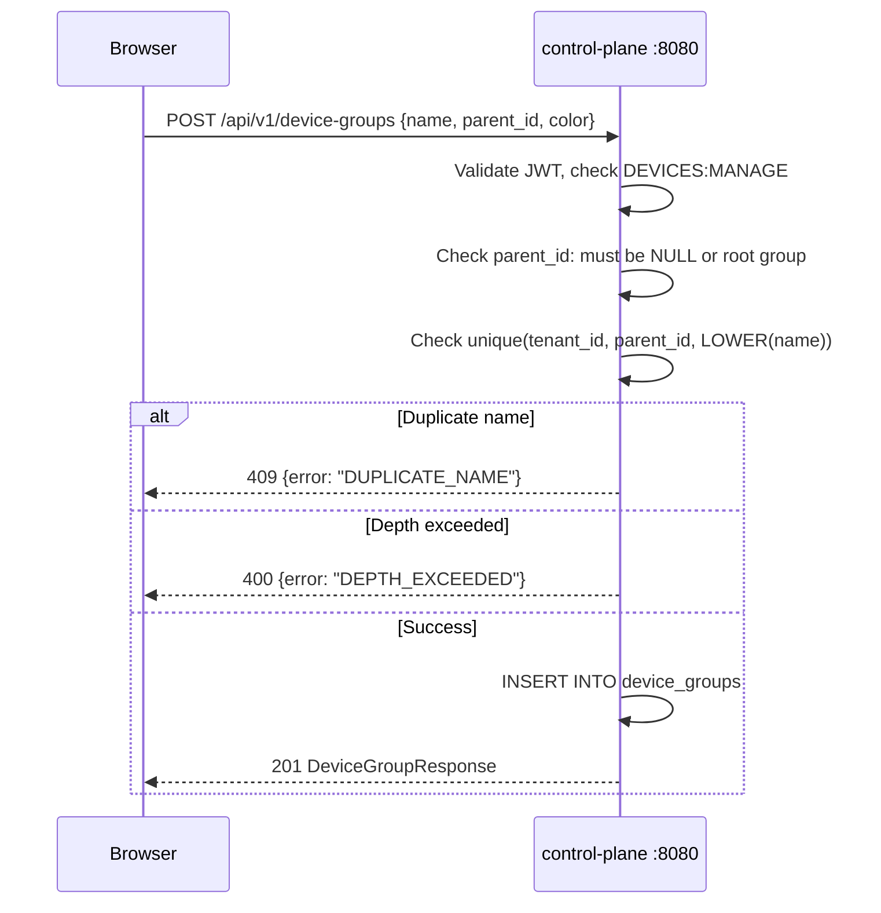
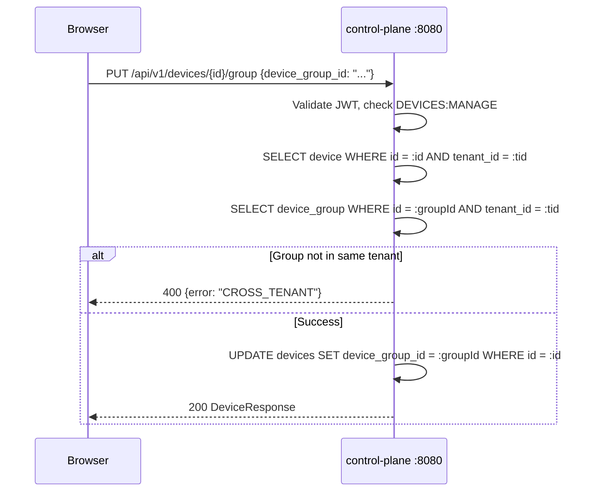

# Группы устройств с вложенностью и статистикой -- техническая спецификация

> **Версия:** 1.0
> **Дата:** 2026-03-14
> **Автор:** Системный аналитик
> **Статус:** Draft
> **Затронутые сервисы:** control-plane, ingest-gateway (readonly), web-dashboard, auth-service (миграция)
> **Миграция:** V36 (auth-service)
> **Задача:** #28

---

## Содержание

1. [Overview](#1-overview)
2. [Модель данных](#2-модель-данных)
3. [API контракты: control-plane](#3-api-контракты-control-plane)
4. [API контракты: ingest-gateway (статистика)](#4-api-контракты-ingest-gateway-статистика)
5. [Permissions](#5-permissions)
6. [Sequence Diagrams](#6-sequence-diagrams)
7. [Frontend](#7-frontend)
8. [Миграция Flyway](#8-миграция-flyway)
9. [Обратная совместимость](#9-обратная-совместимость)
10. [Производительность](#10-производительность)
11. [User Stories](#11-user-stories)
12. [Декомпозиция задач](#12-декомпозиция-задач)
13. [Открытые вопросы](#13-открытые-вопросы)

---

## 1. Overview

### 1.1 Цель

Реализовать иерархическую организацию устройств в группы с двумя уровнями вложенности (Группа уровня 1 -> Подгруппа уровня 2 -> Устройства). Над списком устройств отображать агрегированную статистику: общее количество устройств, количество активных (online/recording), суммарный объём видеозаписей в ГБ.

### 1.2 Scope

**В scope:**
- CRUD для групп устройств с вложенностью до 2 уровней
- Привязка устройства к группе (устройство принадлежит ровно одной группе или не принадлежит ни к одной)
- Статистика по группе: total_devices, online_devices, total_video_gb
- Страница управления группами + обновлённая страница устройств с деревом групп
- Миграция V36 в auth-service

**Вне scope:**
- Вложенность более 2 уровней
- Автоматическое распределение устройств по группам
- Политики записи на уровне группы (будущая задача)

### 1.3 Ключевые решения

| Решение | Обоснование |
|---------|-------------|
| Таблица `device_groups` в общей БД (миграция в auth-service) | Flyway включён только в auth-service. Таблица `devices` живёт в той же БД. control-plane читает/пишет `device_groups` напрямую. |
| `parent_id` для вложенности (adjacency list) | Два уровня -- простая модель, нет нужды в materialized path или nested sets. CHECK constraint `depth <= 2` через триггер. |
| Устройство привязывается к `device_groups` через `devices.device_group_id` FK | Минимальные изменения: добавить nullable FK в `devices`. Устройство в одной группе. |
| Статистика video_gb через cross-service запрос к ingest-gateway | Сегменты хранятся в ingest-gateway. control-plane не имеет доступа к таблице `segments`. Для статистики control-plane вызывает ingest-gateway internal API. |
| Permissions: `DEVICES:READ` для просмотра, `DEVICES:MANAGE` (новый) для CRUD групп | Переиспользуем существующий ресурс DEVICES. Новый action MANAGE для управления группами, чтобы не давать UPDATE на устройства тем, кто только управляет группами. |

---

## 2. Модель данных

### 2.1 Таблица `device_groups`

```sql
CREATE TABLE device_groups (
    id              UUID            NOT NULL DEFAULT gen_random_uuid() PRIMARY KEY,
    tenant_id       UUID            NOT NULL REFERENCES tenants(id),
    parent_id       UUID            REFERENCES device_groups(id) ON DELETE CASCADE,
    name            VARCHAR(200)    NOT NULL,
    description     VARCHAR(1000),
    color           VARCHAR(7),                -- hex color, e.g. #FF5733
    sort_order      INTEGER         NOT NULL DEFAULT 0,
    created_at      TIMESTAMPTZ     NOT NULL DEFAULT NOW(),
    updated_at      TIMESTAMPTZ     NOT NULL DEFAULT NOW(),
    created_by      UUID            REFERENCES users(id) ON DELETE SET NULL
);
```

**Constraints:**
- `UNIQUE(tenant_id, parent_id, LOWER(name))` -- уникальность имени внутри одного уровня в тенанте. Для корневых групп `parent_id IS NULL`, поэтому partial unique index.
- Вложенность ограничена 2 уровнями: корневая группа (`parent_id IS NULL`, level=1) может содержать подгруппы (`parent_id IS NOT NULL`, level=2). Подгруппа НЕ может быть родителем.

**Indexes:**

| Индекс | Столбцы | Назначение |
|--------|---------|------------|
| `idx_dg_tenant_parent` | `(tenant_id, parent_id)` | Выборка дерева групп по тенанту |
| `uq_dg_tenant_name_root` | `(tenant_id, LOWER(name)) WHERE parent_id IS NULL` | Уникальность имён корневых групп |
| `uq_dg_tenant_parent_name` | `(tenant_id, parent_id, LOWER(name)) WHERE parent_id IS NOT NULL` | Уникальность имён подгрупп внутри родителя |
| `idx_dg_tenant_sort` | `(tenant_id, sort_order)` | Сортировка при выводе |

### 2.2 Изменение таблицы `devices`

Добавить nullable FK:

```sql
ALTER TABLE devices ADD COLUMN device_group_id UUID REFERENCES device_groups(id) ON DELETE SET NULL;
CREATE INDEX idx_devices_group ON devices(device_group_id) WHERE device_group_id IS NOT NULL;
```

При удалении группы -- `ON DELETE SET NULL`: устройства становятся "без группы".

### 2.3 ER-диаграмма

```
tenants
  |
  +-- device_groups (tenant_id FK)
  |     |
  |     +-- device_groups (parent_id FK, level 2)
  |
  +-- devices (tenant_id FK, device_group_id FK -> device_groups.id)
```

### 2.4 Триггер ограничения глубины

```sql
CREATE OR REPLACE FUNCTION check_device_group_depth()
RETURNS TRIGGER AS $$
BEGIN
    IF NEW.parent_id IS NOT NULL THEN
        -- Проверяем, что parent_id указывает на корневую группу (parent_id IS NULL)
        IF EXISTS (
            SELECT 1 FROM device_groups
            WHERE id = NEW.parent_id AND parent_id IS NOT NULL
        ) THEN
            RAISE EXCEPTION 'Device group nesting depth cannot exceed 2 levels';
        END IF;
    END IF;
    RETURN NEW;
END;
$$ LANGUAGE plpgsql;

CREATE TRIGGER trg_check_device_group_depth
    BEFORE INSERT OR UPDATE ON device_groups
    FOR EACH ROW
    EXECUTE FUNCTION check_device_group_depth();
```

---

## 3. API контракты: control-plane

Базовый путь: `/api/v1/device-groups`

### 3.1 GET /api/v1/device-groups -- Дерево групп

Возвращает плоский список всех групп тенанта. Фронтенд строит дерево по `parent_id`.

**Query params:**

| Параметр | Тип | Default | Описание |
|----------|-----|---------|----------|
| `include_stats` | boolean | `false` | Включить статистику (total_devices, online_devices, total_video_gb) |

**Request:**
```
GET /api/v1/device-groups?include_stats=true
Authorization: Bearer <jwt>
```

**Response 200:**
```json
[
    {
        "id": "a1b2c3d4-...",
        "parent_id": null,
        "name": "Офис Москва",
        "description": "Устройства московского офиса",
        "color": "#4F46E5",
        "sort_order": 0,
        "stats": {
            "total_devices": 25,
            "online_devices": 18,
            "total_video_gb": 142.7
        },
        "created_at": "2026-03-14T10:00:00Z",
        "updated_at": "2026-03-14T10:00:00Z"
    },
    {
        "id": "e5f6g7h8-...",
        "parent_id": "a1b2c3d4-...",
        "name": "Этаж 2",
        "description": null,
        "color": "#10B981",
        "sort_order": 0,
        "stats": {
            "total_devices": 12,
            "online_devices": 9,
            "total_video_gb": 68.3
        },
        "created_at": "2026-03-14T10:05:00Z",
        "updated_at": "2026-03-14T10:05:00Z"
    }
]
```

**Поле `stats`:** присутствует только если `include_stats=true`. Для родительской группы `stats` включает суммарные данные по всем дочерним подгруппам + устройства, привязанные непосредственно к родительской группе.

**Permission:** `DEVICES:READ`

**Ошибки:**

| Код | Описание |
|-----|----------|
| 401 | Не авторизован |
| 403 | Нет permission `DEVICES:READ` |

### 3.2 POST /api/v1/device-groups -- Создание группы

**Request:**
```json
{
    "name": "Офис Москва",
    "description": "Устройства московского офиса",
    "color": "#4F46E5",
    "sort_order": 0,
    "parent_id": null
}
```

| Поле | Тип | Обязательное | Constraints |
|------|-----|-------------|-------------|
| `name` | string | да | 1-200 символов, trim, уникально в рамках tenant+parent |
| `description` | string | нет | до 1000 символов |
| `color` | string | нет | regex `^#[0-9A-Fa-f]{6}$` |
| `sort_order` | integer | нет | default 0 |
| `parent_id` | UUID | нет | null = корневая группа; если указан -- родитель должен быть корневой группой (parent_id IS NULL) |

**Response 201:** объект `DeviceGroupResponse` (как в GET, без `stats`).

**Ошибки:**

| Код | Code | Описание |
|-----|------|----------|
| 400 | `VALIDATION_ERROR` | Невалидные данные |
| 400 | `DEPTH_EXCEEDED` | Попытка создать группу уровня 3+ |
| 409 | `DUPLICATE_NAME` | Группа с таким именем уже существует на этом уровне |
| 403 | `INSUFFICIENT_PERMISSIONS` | Нет permission `DEVICES:MANAGE` |

**Permission:** `DEVICES:MANAGE`

### 3.3 PUT /api/v1/device-groups/{id} -- Обновление группы

**Request:**
```json
{
    "name": "Офис Москва (Центр)",
    "description": "Обновлённое описание",
    "color": "#6366F1",
    "sort_order": 1
}
```

Все поля опциональны. `parent_id` нельзя менять (перемещение группы между уровнями не поддерживается).

**Response 200:** обновлённый `DeviceGroupResponse`.

**Ошибки:**

| Код | Code | Описание |
|-----|------|----------|
| 404 | `NOT_FOUND` | Группа не найдена в тенанте |
| 409 | `DUPLICATE_NAME` | Имя уже занято |
| 403 | `INSUFFICIENT_PERMISSIONS` | Нет permission `DEVICES:MANAGE` |

**Permission:** `DEVICES:MANAGE`

### 3.4 DELETE /api/v1/device-groups/{id} -- Удаление группы

Каскадное удаление: удаляются все подгруппы (ON DELETE CASCADE). Устройства из удалённых групп получают `device_group_id = NULL` (ON DELETE SET NULL).

**Response 204:** No Content.

**Ошибки:**

| Код | Code | Описание |
|-----|------|----------|
| 404 | `NOT_FOUND` | Группа не найдена |
| 403 | `INSUFFICIENT_PERMISSIONS` | Нет permission `DEVICES:MANAGE` |

**Permission:** `DEVICES:MANAGE`

### 3.5 PUT /api/v1/devices/{id}/group -- Привязка устройства к группе

**Request:**
```json
{
    "device_group_id": "e5f6g7h8-..."
}
```

| Поле | Тип | Описание |
|------|-----|----------|
| `device_group_id` | UUID / null | UUID группы или `null` для открепления |

**Response 200:** обновлённый `DeviceResponse` с полем `device_group_id`.

**Ошибки:**

| Код | Code | Описание |
|-----|------|----------|
| 404 | `NOT_FOUND` | Устройство или группа не найдены |
| 400 | `CROSS_TENANT` | Группа принадлежит другому тенанту |
| 403 | `INSUFFICIENT_PERMISSIONS` | Нет permission `DEVICES:MANAGE` |

**Permission:** `DEVICES:MANAGE`

### 3.6 POST /api/v1/device-groups/{id}/devices -- Массовая привязка устройств

**Request:**
```json
{
    "device_ids": ["uuid-1", "uuid-2", "uuid-3"]
}
```

| Поле | Тип | Constraints |
|------|-----|-------------|
| `device_ids` | UUID[] | 1-100 элементов |

**Response 200:**
```json
{
    "assigned": 3,
    "errors": []
}
```

**Permission:** `DEVICES:MANAGE`

### 3.7 GET /api/v1/devices -- Расширение существующего endpoint

Добавить query param `device_group_id`:

| Параметр | Тип | Описание |
|----------|-----|----------|
| `device_group_id` | UUID | Фильтр по группе. Специальное значение `ungrouped` (строка) -- устройства без группы |

В `DeviceResponse` добавить поле:

```json
{
    "device_group_id": "e5f6g7h8-...",
    "device_group_name": "Этаж 2"
}
```

---

## 4. API контракты: ingest-gateway (статистика)

### 4.1 GET /api/v1/ingest/devices/storage-stats -- Объём видео по устройствам

**Internal endpoint.** Вызывается control-plane при `include_stats=true`.

**Query params:**

| Параметр | Тип | Описание |
|----------|-----|----------|
| `tenant_id` | UUID | обязательный |
| `device_ids` | string | comma-separated list of device UUIDs (до 500) |

**Request:**
```
GET /api/v1/ingest/devices/storage-stats?tenant_id=...&device_ids=uuid1,uuid2,uuid3
X-Internal-API-Key: <key>
```

**Response 200:**
```json
[
    {
        "device_id": "uuid-1",
        "total_bytes": 153247891456,
        "segment_count": 4521
    },
    {
        "device_id": "uuid-2",
        "total_bytes": 89234567890,
        "segment_count": 2134
    }
]
```

**SQL (ingest-gateway):**
```sql
SELECT device_id,
       COALESCE(SUM(size_bytes), 0) AS total_bytes,
       COUNT(*) AS segment_count
FROM segments
WHERE tenant_id = :tenantId
  AND device_id = ANY(:deviceIds)
GROUP BY device_id
```

**Permission:** Internal API key (межсервисная авторизация, `X-Internal-API-Key`).

**Ошибки:**

| Код | Описание |
|-----|----------|
| 400 | Больше 500 device_ids |
| 401 | Невалидный API key |

---

## 5. Permissions

### 5.1 Новый permission

| Code | Name | Resource | Action | Описание |
|------|------|----------|--------|----------|
| `DEVICES:MANAGE` | Manage Device Groups | DEVICES | MANAGE | CRUD групп устройств, привязка устройств к группам |

### 5.2 Назначение по ролям

| Роль | DEVICES:READ | DEVICES:MANAGE |
|------|-------------|----------------|
| SUPER_ADMIN | да | да |
| OWNER | да | да |
| TENANT_ADMIN | да | да |
| MANAGER | да | нет |
| SUPERVISOR | да | нет |
| OPERATOR | нет | нет |

---

## 6. Sequence Diagrams

### 6.1 Загрузка страницы устройств с деревом групп и статистикой



### 6.2 Создание группы



### 6.3 Привязка устройства к группе



---

## 7. Frontend

### 7.1 Обновление DevicesListPage

Текущая страница: плоская таблица устройств с фильтрами по статусу и поиском.

**Новый layout:**

```
+-----------------------------------------------------------+
|  Устройства                              [+ Группа]       |
+-----------------------------------------------------------+
|  Дерево групп (sidebar)  |  Статистика группы             |
|                          |  +-------+ +--------+ +------+ |
|  > Все устройства (47)   |  | 12    | | 9      | | 68 ГБ| |
|  v Офис Москва (25)      |  | всего | | онлайн | | видео| |
|    > Этаж 1 (13)         |  +-------+ +--------+ +------+ |
|    > Этаж 2 (12)         |                                 |
|  > Офис СПб (15)         |  Фильтры: [Поиск] [Статус]     |
|  > Без группы (7)        |                                 |
|                          |  Таблица устройств              |
|                          |  hostname | ОС | статус | ...   |
+-----------------------------------------------------------+
```

### 7.2 Компоненты

| Компонент | Файл | Описание |
|-----------|------|----------|
| `DeviceGroupTree` | `components/devices/DeviceGroupTree.tsx` | Дерево групп в sidebar. Клик = фильтрация. Drag & drop устройств (Phase 2). |
| `DeviceGroupStats` | `components/devices/DeviceGroupStats.tsx` | Три карточки статистики: total, online, video GB. |
| `DeviceGroupDialog` | `components/devices/DeviceGroupDialog.tsx` | Модальное окно создания/редактирования группы. Поля: name, description, color, parent. |
| `AssignGroupDropdown` | `components/devices/AssignGroupDropdown.tsx` | Dropdown для привязки устройства к группе (переиспользовать pattern из employee groups). |

### 7.3 Типы TypeScript

```typescript
// types/device-groups.ts

export interface DeviceGroupResponse {
    id: string;
    parent_id: string | null;
    name: string;
    description: string | null;
    color: string | null;
    sort_order: number;
    stats?: DeviceGroupStats;
    created_at: string;
    updated_at: string;
}

export interface DeviceGroupStats {
    total_devices: number;
    online_devices: number;
    total_video_gb: number;
}

export interface CreateDeviceGroupRequest {
    name: string;
    description?: string;
    color?: string;
    sort_order?: number;
    parent_id?: string | null;
}

export interface UpdateDeviceGroupRequest {
    name?: string;
    description?: string;
    color?: string;
    sort_order?: number;
}

export interface AssignDeviceGroupRequest {
    device_group_id: string | null;
}

export interface BulkAssignDevicesRequest {
    device_ids: string[];
}

export interface BulkAssignDevicesResponse {
    assigned: number;
    errors: string[];
}
```

### 7.4 API функции

```typescript
// api/device-groups.ts

import { cpApiClient } from './client';
import type {
    DeviceGroupResponse,
    CreateDeviceGroupRequest,
    UpdateDeviceGroupRequest,
    BulkAssignDevicesRequest,
    BulkAssignDevicesResponse,
} from '../types/device-groups';
import type { DeviceResponse } from '../types/device';

export async function getDeviceGroups(includeStats = false): Promise<DeviceGroupResponse[]> {
    const resp = await cpApiClient.get<DeviceGroupResponse[]>('/device-groups', {
        params: { include_stats: includeStats },
    });
    return resp.data;
}

export async function createDeviceGroup(data: CreateDeviceGroupRequest): Promise<DeviceGroupResponse> {
    const resp = await cpApiClient.post<DeviceGroupResponse>('/device-groups', data);
    return resp.data;
}

export async function updateDeviceGroup(id: string, data: UpdateDeviceGroupRequest): Promise<DeviceGroupResponse> {
    const resp = await cpApiClient.put<DeviceGroupResponse>(`/device-groups/${id}`, data);
    return resp.data;
}

export async function deleteDeviceGroup(id: string): Promise<void> {
    await cpApiClient.delete(`/device-groups/${id}`);
}

export async function assignDeviceToGroup(deviceId: string, groupId: string | null): Promise<DeviceResponse> {
    const resp = await cpApiClient.put<DeviceResponse>(`/devices/${deviceId}/group`, {
        device_group_id: groupId,
    });
    return resp.data;
}

export async function bulkAssignDevices(groupId: string, data: BulkAssignDevicesRequest): Promise<BulkAssignDevicesResponse> {
    const resp = await cpApiClient.post<BulkAssignDevicesResponse>(`/device-groups/${groupId}/devices`, data);
    return resp.data;
}
```

### 7.5 Изменения в DeviceResponse

В существующий тип `DeviceResponse` (`types/device.ts`) добавить:

```typescript
export interface DeviceResponse {
    // ... existing fields ...
    device_group_id: string | null;
    device_group_name: string | null;
}
```

### 7.6 Изменения в DevicesListParams

```typescript
export interface DevicesListParams {
    // ... existing fields ...
    device_group_id?: string;   // UUID группы или "ungrouped"
}
```

---

## 8. Миграция Flyway

### V36__create_device_groups.sql

```sql
-- V36__create_device_groups.sql
-- Device groups with 2-level nesting

-- 1. Create device_groups table
CREATE TABLE device_groups (
    id              UUID            NOT NULL DEFAULT gen_random_uuid() PRIMARY KEY,
    tenant_id       UUID            NOT NULL REFERENCES tenants(id),
    parent_id       UUID            REFERENCES device_groups(id) ON DELETE CASCADE,
    name            VARCHAR(200)    NOT NULL,
    description     VARCHAR(1000),
    color           VARCHAR(7),
    sort_order      INTEGER         NOT NULL DEFAULT 0,
    created_at      TIMESTAMPTZ     NOT NULL DEFAULT NOW(),
    updated_at      TIMESTAMPTZ     NOT NULL DEFAULT NOW(),
    created_by      UUID            REFERENCES users(id) ON DELETE SET NULL
);

-- 2. Indexes
CREATE INDEX idx_dg_tenant_parent ON device_groups (tenant_id, parent_id);
CREATE INDEX idx_dg_tenant_sort ON device_groups (tenant_id, sort_order);

-- Unique name within root groups (parent_id IS NULL)
CREATE UNIQUE INDEX uq_dg_tenant_name_root
    ON device_groups (tenant_id, LOWER(name))
    WHERE parent_id IS NULL;

-- Unique name within subgroups of the same parent
CREATE UNIQUE INDEX uq_dg_tenant_parent_name
    ON device_groups (tenant_id, parent_id, LOWER(name))
    WHERE parent_id IS NOT NULL;

-- 3. Depth constraint trigger: only 2 levels allowed
CREATE OR REPLACE FUNCTION check_device_group_depth()
RETURNS TRIGGER AS $$
BEGIN
    IF NEW.parent_id IS NOT NULL THEN
        IF EXISTS (
            SELECT 1 FROM device_groups
            WHERE id = NEW.parent_id AND parent_id IS NOT NULL
        ) THEN
            RAISE EXCEPTION 'Device group nesting depth cannot exceed 2 levels'
                USING ERRCODE = 'check_violation';
        END IF;
    END IF;
    RETURN NEW;
END;
$$ LANGUAGE plpgsql;

CREATE TRIGGER trg_check_device_group_depth
    BEFORE INSERT OR UPDATE ON device_groups
    FOR EACH ROW
    EXECUTE FUNCTION check_device_group_depth();

-- 4. Add device_group_id FK to devices
ALTER TABLE devices ADD COLUMN device_group_id UUID REFERENCES device_groups(id) ON DELETE SET NULL;
CREATE INDEX idx_devices_group ON devices (device_group_id) WHERE device_group_id IS NOT NULL;

-- 5. Add DEVICES:MANAGE permission
INSERT INTO permissions (id, code, name, resource, action, description)
VALUES (gen_random_uuid(), 'DEVICES:MANAGE', 'Manage Device Groups', 'DEVICES', 'MANAGE',
        'Create, update, delete device groups and assign devices to groups')
ON CONFLICT (code) DO NOTHING;

-- 6. Grant DEVICES:MANAGE to SUPER_ADMIN, OWNER, TENANT_ADMIN
INSERT INTO role_permissions (role_id, permission_id)
SELECT r.id, p.id
FROM roles r
CROSS JOIN permissions p
WHERE r.code IN ('SUPER_ADMIN', 'OWNER', 'TENANT_ADMIN')
  AND p.code = 'DEVICES:MANAGE'
ON CONFLICT DO NOTHING;

-- 7. updated_at trigger
CREATE OR REPLACE FUNCTION update_device_groups_updated_at()
RETURNS TRIGGER AS $$
BEGIN
    NEW.updated_at = NOW();
    RETURN NEW;
END;
$$ LANGUAGE plpgsql;

CREATE TRIGGER trg_device_groups_updated_at
    BEFORE UPDATE ON device_groups
    FOR EACH ROW
    EXECUTE FUNCTION update_device_groups_updated_at();
```

### Обратная совместимость миграции

- `device_group_id` в `devices` -- nullable, default NULL. Все существующие устройства остаются "без группы".
- Новый permission `DEVICES:MANAGE` не влияет на существующие permissions. Роли MANAGER и SUPERVISOR могут читать (DEVICES:READ), но не управлять группами.
- Новая таблица `device_groups` -- чистое дополнение, не меняет существующие таблицы (кроме ALTER TABLE devices ADD COLUMN).

---

## 9. Обратная совместимость

### 9.1 Backend

| Компонент | Влияние |
|-----------|---------|
| `GET /api/v1/devices` | Добавлены поля `device_group_id`, `device_group_name` (nullable). Старые клиенты игнорируют новые поля. Query param `device_group_id` опциональный. |
| `DeviceResponse` DTO | Добавить два nullable поля. Не breaking change. |
| `Device` entity | Добавить поле `deviceGroupId` + `@ManyToOne` к `DeviceGroup`. Hibernate validate пройдёт после миграции. |
| heartbeat, commands | Не затронуты. |

### 9.2 Frontend

| Компонент | Влияние |
|-----------|---------|
| `DevicesListPage` | Рефакторинг layout: добавление sidebar с деревом. Без sidebar работает как раньше. |
| Другие страницы | Не затронуты. |

### 9.3 Агент (Windows/macOS)

Изменения НЕ затрагивают агент. Группировка устройств -- серверная функциональность.

---

## 10. Производительность

### 10.1 Запросы

| Запрос | Ожидаемая нагрузка | Оптимизация |
|--------|-------------------|-------------|
| GET device-groups (дерево) | Редкий (при загрузке страницы) | Кэширование в памяти с TTL 30s; обычно < 100 групп на тенант |
| GET devices с фильтром group_id | Каждые 10 сек (auto-refresh) | Индекс `idx_devices_group` |
| GET storage-stats (cross-service) | При include_stats=true | Агрегация по индексу `idx_segments_device`; batching по 500 device_ids |

### 10.2 Масштаб

- Ожидаемое количество групп на тенант: 5-50
- Максимальная глубина: 2 уровня (ограничено триггером)
- Один запрос к ingest-gateway за статистикой (batch всех device_ids тенанта)

### 10.3 Кэширование статистики

Статистика `total_video_gb` может быть тяжёлой при большом количестве сегментов. Рекомендация:

- Кэшировать результат `storage-stats` на стороне control-plane с TTL = 60 секунд (Caffeine cache)
- Cache key: `tenant_id`
- Инвалидация: по TTL (данные о видео не критичны для real-time)

---

## 11. User Stories

### US-1: Просмотр групп устройств
**Как** менеджер контактного центра,
**я хочу** видеть устройства организованные в группы (например, по офисам и этажам),
**чтобы** быстро находить нужные устройства и контролировать их состояние.

**Acceptance Criteria:**
1. На странице "Устройства" слева отображается дерево групп
2. Каждая группа показывает количество устройств в скобках
3. Клик по группе фильтрует таблицу устройств
4. Пункт "Все устройства" показывает все устройства
5. Пункт "Без группы" показывает устройства без назначенной группы

### US-2: Статистика группы
**Как** менеджер контактного центра,
**я хочу** видеть сводную статистику по выбранной группе (всего устройств, онлайн, объём видео),
**чтобы** оценивать нагрузку и использование дискового пространства.

**Acceptance Criteria:**
1. Над таблицей устройств отображаются три карточки: "Всего устройств", "Онлайн", "Объём видео (ГБ)"
2. При выборе группы статистика обновляется для выбранной группы
3. Для родительской группы статистика включает все подгруппы
4. Объём видео отображается в ГБ с точностью до 1 десятичного знака

### US-3: Управление группами
**Как** администратор тенанта,
**я хочу** создавать, редактировать и удалять группы устройств с возможностью вложенности,
**чтобы** организовать устройства по структуре компании (офисы, отделы).

**Acceptance Criteria:**
1. Кнопка "+ Группа" открывает модальное окно создания
2. Можно задать имя, описание, цвет, родительскую группу
3. Максимальная вложенность: 2 уровня
4. При попытке создать 3-й уровень -- ошибка
5. При удалении группы устройства становятся "без группы"
6. При удалении корневой группы удаляются все подгруппы
7. Имена групп уникальны в рамках одного уровня

### US-4: Привязка устройства к группе
**Как** администратор тенанта,
**я хочу** назначить устройство в группу (или перенести между группами),
**чтобы** поддерживать актуальную структуру.

**Acceptance Criteria:**
1. В строке устройства доступен dropdown для выбора группы
2. Можно открепить устройство от группы (выбрать "Без группы")
3. Устройство принадлежит ровно одной группе
4. Массовое назначение: выбрать несколько устройств -> назначить группу

---

## 12. Декомпозиция задач

| # | Тип | Приоритет | Компонент | Описание |
|---|-----|-----------|-----------|----------|
| 1 | Task | High | auth-service | V36 миграция: таблица `device_groups`, FK в `devices`, permission `DEVICES:MANAGE`, триггер глубины |
| 2 | Task | High | control-plane | Entity `DeviceGroup` + Repository + Service (CRUD, дерево, привязка) |
| 3 | Task | High | control-plane | Controller `DeviceGroupController`: CRUD endpoints `/api/v1/device-groups` |
| 4 | Task | High | control-plane | Расширить `DeviceController.getDevices()`: фильтр `device_group_id`, поля `device_group_id/name` в DTO |
| 5 | Task | Medium | control-plane | Endpoint `PUT /devices/{id}/group` + `POST /device-groups/{id}/devices` (bulk assign) |
| 6 | Task | High | ingest-gateway | Internal endpoint `GET /api/v1/ingest/devices/storage-stats` (SUM(size_bytes) GROUP BY device_id) |
| 7 | Task | High | control-plane | Вызов ingest-gateway storage-stats для агрегации `total_video_gb` в GET device-groups?include_stats=true |
| 8 | Task | High | web-dashboard | Типы TypeScript + API функции для device-groups |
| 9 | Task | High | web-dashboard | Компонент `DeviceGroupTree` (дерево групп в sidebar) |
| 10 | Task | High | web-dashboard | Компонент `DeviceGroupStats` (3 карточки статистики) |
| 11 | Task | Medium | web-dashboard | Компонент `DeviceGroupDialog` (создание/редактирование группы) |
| 12 | Task | Medium | web-dashboard | Компонент `AssignGroupDropdown` (привязка устройства к группе) |
| 13 | Task | Medium | web-dashboard | Рефакторинг `DevicesListPage`: sidebar + stats + фильтр по группе |
| 14 | Task | Medium | QA | Тестирование: CRUD групп, вложенность, статистика, привязка, UI |

---

## 13. Открытые вопросы

| # | Вопрос | Статус |
|---|--------|--------|
| 1 | Нужен ли drag & drop для перемещения устройств между группами? Предлагаю Phase 2 -- пока достаточно dropdown. | Ожидает решения |
| 2 | Нужно ли показывать `total_video_gb` за всё время или за период (7 дней, 30 дней)? Предлагаю за всё время -- проще запрос. | Ожидает решения |
| 3 | Должна ли статистика auto-refresh вместе с таблицей устройств (каждые 10 сек)? Статистика тяжелее. Предлагаю refresh stats раз в 60 сек, устройства -- раз в 10 сек. | Ожидает решения |
| 4 | Нужна ли возможность перемещения группы между уровнями (`parent_id` update)? Предлагаю НЕ поддерживать в v1 для простоты. | Ожидает решения |
