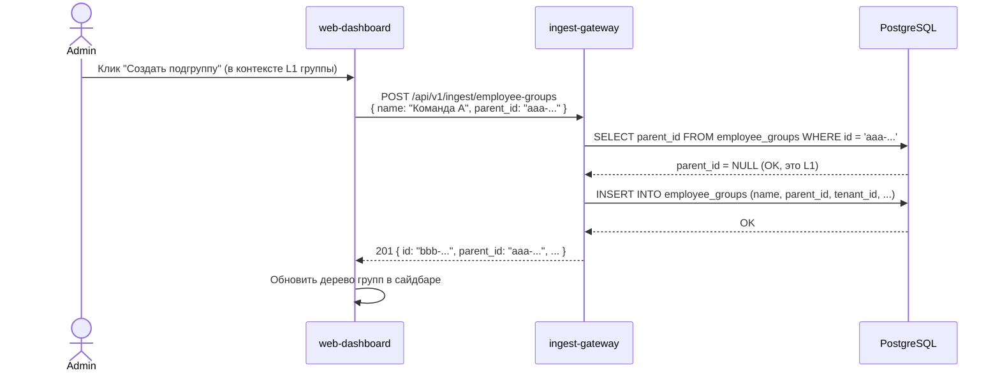
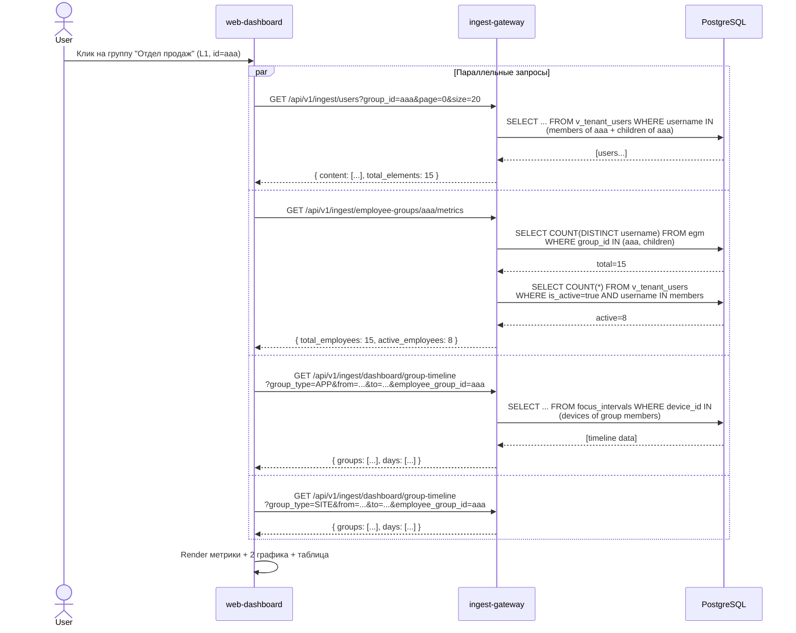

# Спецификация: Вложенные группы сотрудников + графики + метрики

**Задача:** #27  
**Дата:** 2026-03-14  
**Статус:** Draft  
**Автор:** Системный аналитик  

---

## 1. Обзор

Расширение модуля "Сотрудники" для поддержки двухуровневой иерархии групп, отображения агрегированных графиков (apps by groups, sites by groups) и метрик (общее кол-во сотрудников, активные) в области списка сотрудников при выборе группы.

### 1.1. Текущее состояние

- Таблица `employee_groups` -- плоская структура (нет `parent_id`).
- Таблица `employee_group_members` -- привязка `username` к группе. UNIQUE constraint `(tenant_id, LOWER(username))` гарантирует, что сотрудник может быть только в одной группе.
- Frontend: `EmployeeGroupSidebar` (плоский список), `EmployeeListPage` (таблица с фильтром по группе).
- Dashboard: `GroupTimelineChart` (recharts LineChart), endpoint `GET /api/v1/ingest/dashboard/group-timeline`.

### 1.2. Целевое состояние

- Группы поддерживают вложенность максимум 2 уровня: **Группа L1 -> Группа L2 -> Сотрудник**.
- Сотрудник привязывается к группе L2 (leaf). Одного сотрудника можно привязать к **нескольким** группам L2 (снять ограничение уникальности).
- В таблице сотрудников отображается, к какой группе L2 он принадлежит (если нескольким -- все перечислены).
- Над таблицей сотрудников -- метрики и 2 графика (APP timeline, SITE timeline), отфильтрованные по сотрудникам выбранной группы.

---

## 2. User Stories

### US-1: Создание вложенной группы
**Как** администратор, **я хочу** создать подгруппу внутри существующей группы, **чтобы** организовать сотрудников в двухуровневую иерархию (отдел -> команда).

**Acceptance Criteria:**
- AC-1.1: При создании группы можно указать `parent_id` (UUID родительской группы).
- AC-1.2: Если `parent_id` указан, создаваемая группа является дочерней (L2). Родительская группа -- L1.
- AC-1.3: Группа без `parent_id` -- корневая (L1).
- AC-1.4: Нельзя создать группу с `parent_id`, если родитель сам является дочерней группой (запрет 3-го уровня). Ответ: `400 Bad Request`, code `MAX_DEPTH_EXCEEDED`.
- AC-1.5: `parent_id` должен принадлежать тому же `tenant_id`. Ответ: `404 Not Found`, code `GROUP_NOT_FOUND`.

### US-2: Множественная привязка сотрудника к группам
**Как** администратор, **я хочу** привязать одного сотрудника к нескольким подгруппам, **чтобы** сотрудник мог участвовать в нескольких командах.

**Acceptance Criteria:**
- AC-2.1: Сотрудник может состоять в нескольких группах L2 одновременно.
- AC-2.2: Привязка к группе L1 (родительской) запрещена, если у неё есть дочерние. Ответ: `400 Bad Request`, code `CANNOT_ASSIGN_TO_PARENT`.
- AC-2.3: Привязка к группе L1, у которой нет дочерних, разрешена (L1 ведёт себя как leaf).
- AC-2.4: В колонке "Группа" таблицы сотрудников отображаются все группы L2, в которых сотрудник состоит (через запятую или badges).

### US-3: Графики в области списка сотрудников
**Как** менеджер, **я хочу** видеть графики использования приложений и сайтов над таблицей сотрудников, **чтобы** понимать активность группы.

**Acceptance Criteria:**
- AC-3.1: При выборе группы (L1 или L2) над таблицей отображаются 2 графика: "Приложения по группам" и "Сайты по группам".
- AC-3.2: Графики используют тот же компонент `GroupTimelineChart`, что и дашборд.
- AC-3.3: Данные графиков отфильтрованы по сотрудникам (usernames) выбранной группы.
- AC-3.4: При выборе L1 группы -- данные агрегируются по всем сотрудникам из всех дочерних L2 групп.
- AC-3.5: При выборе "Все" -- графики скрыты или показывают данные по всем сотрудникам.
- AC-3.6: Период графиков -- последние 7 дней (по умолчанию), с возможностью выбора (7 / 14 / 30 дней).

### US-4: Метрики группы
**Как** менеджер, **я хочу** видеть ключевые метрики группы (общее кол-во сотрудников, активные), **чтобы** оценивать охват и вовлечённость.

**Acceptance Criteria:**
- AC-4.1: Над графиками отображаются 2 карточки: "Всего сотрудников" и "Активных".
- AC-4.2: "Всего сотрудников" = кол-во уникальных usernames в выбранной группе (с учётом вложенных).
- AC-4.3: "Активных" = кол-во сотрудников с `is_active = true` (последняя активность < 5 мин) среди членов группы.
- AC-4.4: При выборе "Все" -- метрики показывают общие данные по тенанту.

### US-5: Отображение дерева групп в сайдбаре
**Как** пользователь, **я хочу** видеть группы в виде дерева с раскрытием/сворачиванием, **чтобы** навигация была удобной.

**Acceptance Criteria:**
- AC-5.1: Группы L1 отображаются в корне списка.
- AC-5.2: У группы L1 с дочерними -- шеврон (раскрыть/свернуть).
- AC-5.3: При раскрытии -- под L1 с отступом показываются L2 группы.
- AC-5.4: `member_count` для L1 = сумма members по всем дочерним L2 + прямые members (если L1 без дочерних).
- AC-5.5: Клик на L1 -- показывает всех сотрудников из всех дочерних L2. Клик на L2 -- только сотрудников этой L2.

---

## 3. Изменения модели данных

### 3.1. ALTER TABLE `employee_groups`

```sql
-- Добавить parent_id для иерархии
ALTER TABLE employee_groups
    ADD COLUMN parent_id UUID REFERENCES employee_groups(id) ON DELETE CASCADE;

-- Индекс для быстрого поиска дочерних групп
CREATE INDEX idx_eg_parent ON employee_groups (parent_id) WHERE parent_id IS NOT NULL;

-- CHECK constraint: parent не может иметь parent (max 2 levels)
-- Реализуется через application-level validation (триггер слишком сложен для FK self-ref)
```

### 3.2. ALTER TABLE `employee_group_members`

```sql
-- Снять ограничение уникальности username в пределах tenant
-- (сотрудник теперь может быть в нескольких группах)
DROP INDEX idx_egm_tenant_username;

-- Новый unique: (tenant_id, group_id, username) -- один сотрудник в одной группе только один раз
CREATE UNIQUE INDEX idx_egm_tenant_group_username
    ON employee_group_members (tenant_id, group_id, LOWER(username));

-- Индекс для поиска всех групп сотрудника
CREATE INDEX idx_egm_tenant_username_lookup
    ON employee_group_members (tenant_id, LOWER(username));
```

### 3.3. SQL миграция (ручное применение через psql)

Файл: `ingest-gateway/src/main/resources/db/migration/V36__nested_employee_groups.sql`

```sql
-- V36__nested_employee_groups.sql
-- Nested employee groups (2-level hierarchy) + multi-group membership

-- 1. Add parent_id to employee_groups
ALTER TABLE employee_groups
    ADD COLUMN parent_id UUID REFERENCES employee_groups(id) ON DELETE CASCADE;

CREATE INDEX idx_eg_parent
    ON employee_groups (parent_id) WHERE parent_id IS NOT NULL;

-- 2. Drop old unique constraint (one employee = one group)
DROP INDEX IF EXISTS idx_egm_tenant_username;

-- 3. New unique: one employee in one specific group only once
CREATE UNIQUE INDEX idx_egm_tenant_group_username
    ON employee_group_members (tenant_id, group_id, LOWER(username));

-- 4. Lookup index: find all groups for a given employee
CREATE INDEX idx_egm_tenant_username_lookup
    ON employee_group_members (tenant_id, LOWER(username));
```

### 3.4. Обратная совместимость

- Существующие группы без `parent_id` остаются корневыми (L1). Данные не теряются.
- Существующие привязки сотрудников остаются валидными.
- Старая логика `addMember` (перемещение сотрудника при повторном назначении) удаляется. Новая логика: просто добавляет, если нет дубликата `(tenant_id, group_id, username)`.

### 3.5. Влияние на существующие запросы

| Запрос | Изменение |
|--------|-----------|
| `getUsers(..., groupId, ungrouped)` | При `groupId` для L1 группы -- собирать usernames из всех дочерних L2 групп. Для ungrouped -- сотрудники, не состоящие ни в одной группе. |
| `getGroups(tenantId)` | Возвращать иерархию: `parent_id` + `children[]` в ответе. |
| `addMember(...)` | Убрать auto-remove из предыдущей группы. Валидировать, что целевая группа -- leaf. |

---

## 4. API контракты

### 4.1. GET `/api/v1/ingest/employee-groups` (изменение)

**Response:** `List<EmployeeGroupResponse>` (JSON array)

```json
[
  {
    "id": "aaa-...",
    "name": "Отдел продаж",
    "description": "...",
    "color": "#3B82F6",
    "sort_order": 0,
    "parent_id": null,
    "member_count": 15,
    "children": [
      {
        "id": "bbb-...",
        "name": "Команда А",
        "description": null,
        "color": "#10B981",
        "sort_order": 0,
        "parent_id": "aaa-...",
        "member_count": 8,
        "children": [],
        "created_at": "2026-03-14T10:00:00Z",
        "updated_at": "2026-03-14T10:00:00Z"
      },
      {
        "id": "ccc-...",
        "name": "Команда Б",
        "description": null,
        "color": "#F59E0B",
        "sort_order": 1,
        "parent_id": "aaa-...",
        "member_count": 7,
        "children": [],
        "created_at": "2026-03-14T10:00:00Z",
        "updated_at": "2026-03-14T10:00:00Z"
      }
    ],
    "created_at": "2026-03-14T10:00:00Z",
    "updated_at": "2026-03-14T10:00:00Z"
  }
]
```

Поле `member_count` для L1 группы с дочерними = сумма `member_count` всех children.  
Поле `children` -- массив дочерних групп (пустой для L2 или leaf L1).

### 4.2. POST `/api/v1/ingest/employee-groups` (изменение)

**Request:**

```json
{
  "name": "Команда А",
  "description": "Первая команда отдела продаж",
  "color": "#10B981",
  "sort_order": 0,
  "parent_id": "aaa-..."
}
```

| Поле | Тип | Обязательное | Constraints | Описание |
|------|-----|-------------|-------------|----------|
| `name` | string | да | max 200, not blank | Название группы |
| `description` | string | нет | max 1000 | Описание |
| `color` | string | нет | regex `^#[0-9a-fA-F]{6}$` | Цвет (hex) |
| `sort_order` | integer | нет | default 0 | Порядок сортировки |
| `parent_id` | UUID | нет | null = корневая | ID родительской группы |

**Валидация:**
- Если `parent_id` указан, родительская группа должна существовать в том же `tenant_id` --> `404 GROUP_NOT_FOUND`
- Если родительская группа сама имеет `parent_id != null` --> `400 MAX_DEPTH_EXCEEDED`
- Уникальность имени в рамках `(tenant_id, parent_id)`. Т.е. у одного родителя не может быть двух дочерних с одинаковым именем, но группы с одинаковым именем на разных уровнях допускаются.

**Response:** `EmployeeGroupResponse` (201 Created)

### 4.3. POST `/api/v1/ingest/employee-groups/{groupId}/members` (изменение)

**Новое поведение:** НЕ удаляет сотрудника из предыдущей группы. Просто добавляет.

**Валидация:**
- Если `groupId` -- это L1 группа, у которой есть дочерние -> `400 CANNOT_ASSIGN_TO_PARENT`
- Если запись `(tenant_id, groupId, username)` уже существует -> `409 ALREADY_MEMBER`

**Response:** `EmployeeGroupMemberResponse` (201 Created)

### 4.4. GET `/api/v1/ingest/users` (изменение)

Параметр `group_id` при указании L1 группы должен включать сотрудников из всех дочерних L2 групп.

Изменение SQL:
```sql
-- Было (для group_id):
AND LOWER(username) IN (
    SELECT LOWER(egm.username)
    FROM employee_group_members egm
    WHERE egm.group_id = :groupId AND egm.tenant_id = :tenantId
)

-- Стало (для group_id, с учётом дочерних):
AND LOWER(username) IN (
    SELECT LOWER(egm.username)
    FROM employee_group_members egm
    WHERE egm.tenant_id = :tenantId
      AND egm.group_id IN (
          SELECT eg.id FROM employee_groups eg
          WHERE eg.tenant_id = :tenantId
            AND (eg.id = :groupId OR eg.parent_id = :groupId)
      )
)
```

Добавить в `UserSummary` поле `groups`:

```json
{
  "username": "DOMAIN\\user1",
  "display_name": "Иван Иванов",
  "groups": [
    { "id": "bbb-...", "name": "Команда А", "color": "#10B981" },
    { "id": "ccc-...", "name": "Команда Б", "color": "#F59E0B" }
  ],
  ...
}
```

SQL для получения групп сотрудника (дополнительный запрос или JOIN):
```sql
SELECT eg.id, eg.name, eg.color
FROM employee_group_members egm
JOIN employee_groups eg ON eg.id = egm.group_id
WHERE egm.tenant_id = :tenantId AND LOWER(egm.username) = LOWER(:username)
```

### 4.5. GET `/api/v1/ingest/employee-groups/{groupId}/metrics` (новый endpoint)

Возвращает метрики для группы: общее кол-во сотрудников и кол-во активных.

**Query parameters:**

| Параметр | Тип | Обязательный | Default | Описание |
|----------|-----|-------------|---------|----------|
| `tenant_id` | UUID | для global scope | - | Тенант |

**Response:** `200 OK`

```json
{
  "group_id": "aaa-...",
  "group_name": "Отдел продаж",
  "total_employees": 15,
  "active_employees": 8
}
```

Логика:
- `total_employees` = COUNT(DISTINCT username) из `employee_group_members` для указанной группы и всех дочерних.
- `active_employees` = COUNT из `v_tenant_users` WHERE `is_active = true` AND username IN members.

**Permission:** `EMPLOYEES:READ`

### 4.6. GET `/api/v1/ingest/dashboard/group-timeline` (изменение)

Новый опциональный параметр `usernames` (comma-separated list или массив) для фильтрации данных по конкретным сотрудникам.

| Параметр | Тип | Обязательный | Описание |
|----------|-----|-------------|----------|
| `group_type` | string (APP/SITE) | да | Тип группы для графика |
| `from` | string (YYYY-MM-DD) | да | Начало периода |
| `to` | string (YYYY-MM-DD) | да | Конец периода |
| `timezone` | string | нет (default Europe/Moscow) | Часовой пояс |
| `employee_group_id` | UUID | нет | ID группы сотрудников для фильтрации |
| `tenant_id` | UUID | для global scope | Тенант |

Когда `employee_group_id` передан, данные `focus_intervals` фильтруются по usernames, принадлежащим указанной группе (и всем дочерним).

SQL фильтрация:
```sql
-- Добавить в WHERE при наличии employee_group_id:
AND fi.device_id IN (
    SELECT DISTINCT dus.device_id
    FROM device_user_sessions dus
    WHERE dus.tenant_id = :tenantId
      AND LOWER(dus.username) IN (
          SELECT LOWER(egm.username)
          FROM employee_group_members egm
          WHERE egm.tenant_id = :tenantId
            AND egm.group_id IN (
                SELECT eg.id FROM employee_groups eg
                WHERE eg.tenant_id = :tenantId
                  AND (eg.id = :employeeGroupId OR eg.parent_id = :employeeGroupId)
            )
      )
)
```

---

## 5. Изменения в Java (Backend)

### 5.1. Entity: `EmployeeGroup`

```java
// Добавить поле:
@Column(name = "parent_id")
private UUID parentId;

// Добавить связь для получения дочерних (опционально, для построения дерева):
@OneToMany(mappedBy = "parentId", fetch = FetchType.LAZY)
@Builder.Default
private List<EmployeeGroup> children = new ArrayList<>();
// ВНИМАНИЕ: self-referencing JPA relationship может быть проблемной.
// Альтернатива: строить дерево в сервисном слое по parentId.
```

Рекомендация: НЕ использовать JPA self-reference `@ManyToOne` / `@OneToMany`. Строить дерево в сервисном слое:
```java
// В EmployeeGroup entity -- только поле:
@Column(name = "parent_id")
private UUID parentId;
```

### 5.2. DTO: `EmployeeGroupResponse`

```java
@Data
@Builder
@NoArgsConstructor
@AllArgsConstructor
public class EmployeeGroupResponse {
    private UUID id;
    private String name;
    private String description;
    private String color;
    private int sortOrder;
    private UUID parentId;           // NEW
    private long memberCount;
    private List<EmployeeGroupResponse> children;  // NEW (рекурсивный)
    private Instant createdAt;
    private Instant updatedAt;
}
```

### 5.3. DTO: `EmployeeGroupCreateRequest`

```java
// Добавить поле:
private UUID parentId;
```

### 5.4. DTO: `GroupMetricsResponse` (новый)

```java
@Data
@Builder
@NoArgsConstructor
@AllArgsConstructor
public class GroupMetricsResponse {
    private UUID groupId;
    private String groupName;
    private long totalEmployees;
    private long activeEmployees;
}
```

### 5.5. DTO: `UserListResponse.UserSummary` (изменение)

```java
// Добавить поле:
private List<UserGroupInfo> groups;

@Data
@Builder
@NoArgsConstructor
@AllArgsConstructor
public static class UserGroupInfo {
    private UUID id;
    private String name;
    private String color;
}
```

### 5.6. Service: `EmployeeGroupService`

Ключевые изменения:
1. `getGroups(tenantId)` -- загрузить все группы flat, построить дерево в памяти (parent_id -> children[]), посчитать member_count рекурсивно.
2. `createGroup(...)` -- валидировать parent_id (max depth = 2).
3. `addMember(...)` -- убрать auto-remove. Валидировать, что группа -- leaf (нет дочерних).
4. Новый метод `getGroupMetrics(tenantId, groupId)`.
5. Вспомогательный метод `getGroupIdsWithChildren(tenantId, groupId)` -- возвращает set [groupId] + [childIds].

### 5.7. Repository: `EmployeeGroupRepository`

```java
// Добавить:
List<EmployeeGroup> findByParentIdAndTenantId(UUID parentId, UUID tenantId);

@Query("SELECT COUNT(g) > 0 FROM EmployeeGroup g WHERE g.parentId = :parentId AND g.tenantId = :tenantId")
boolean hasChildren(UUID parentId, UUID tenantId);

@Query("SELECT g.parentId FROM EmployeeGroup g WHERE g.id = :id AND g.tenantId = :tenantId")
Optional<UUID> findParentIdByIdAndTenantId(UUID id, UUID tenantId);
```

### 5.8. Repository: `EmployeeGroupMemberRepository`

```java
// Изменить: сотрудник может быть в нескольких группах
// Заменить findByTenantIdAndUsernameIgnoreCase (возвращал Optional) на:
@Query("SELECT m FROM EmployeeGroupMember m WHERE m.tenantId = :tenantId AND LOWER(m.username) = LOWER(:username)")
List<EmployeeGroupMember> findAllByTenantIdAndUsernameIgnoreCase(UUID tenantId, String username);

// Проверка дубликата:
@Query("SELECT COUNT(m) > 0 FROM EmployeeGroupMember m WHERE m.tenantId = :tenantId AND m.group.id = :groupId AND LOWER(m.username) = LOWER(:username)")
boolean existsByTenantIdAndGroupIdAndUsernameIgnoreCase(UUID tenantId, UUID groupId, String username);
```

---

## 6. Изменения в TypeScript (Frontend)

### 6.1. Типы: `employee-groups.ts`

```typescript
export interface EmployeeGroup {
  id: string
  name: string
  description: string | null
  color: string | null
  sort_order: number
  parent_id: string | null          // NEW
  member_count: number
  children: EmployeeGroup[]         // NEW
  created_at: string
  updated_at: string
}

export interface EmployeeGroupCreateRequest {
  name: string
  description?: string
  color?: string
  sort_order?: number
  parent_id?: string                // NEW
}

// UserSummary (в user-activity.ts) -- добавить:
export interface UserGroupInfo {
  id: string
  name: string
  color: string | null
}

// В UserSummary:
export interface UserSummary {
  // ... существующие поля ...
  groups: UserGroupInfo[]            // NEW
}
```

### 6.2. API: `employee-groups.ts`

```typescript
// Добавить:
export async function getEmployeeGroupMetrics(groupId: string): Promise<GroupMetricsResponse> {
  const { data } = await ingestApiClient.get<GroupMetricsResponse>(
    `/employee-groups/${groupId}/metrics`
  );
  return data;
}

export interface GroupMetricsResponse {
  group_id: string
  group_name: string
  total_employees: number
  active_employees: number
}
```

### 6.3. API: `catalogs.ts` (изменение `getGroupTimeline`)

```typescript
// Добавить опциональный параметр employee_group_id:
export async function getGroupTimeline(
  groupType: GroupType,
  from: string,
  to: string,
  employeeGroupId?: string
): Promise<GroupTimelineResponse> {
  const params: Record<string, string> = { group_type: groupType, from, to };
  if (employeeGroupId) params.employee_group_id = employeeGroupId;
  const { data } = await ingestApiClient.get<GroupTimelineResponse>(
    '/dashboard/group-timeline',
    { params }
  );
  return data;
}
```

### 6.4. Компонент: `EmployeeGroupSidebar` (изменение)

Изменения:
- Принимает `groups: EmployeeGroup[]` с `children[]`.
- L1 группы отображаются в корне, с шевроном раскрытия.
- При раскрытии -- дочерние L2 с отступом `pl-6`.
- Клик на L1 -- `onSelectGroup(groupId)` (бэкенд сам разворачивает children).
- `member_count` L1 уже агрегирован бэкендом.

### 6.5. Компонент: `EmployeeListPage` (изменение)

Добавить над таблицей:
1. Блок метрик (`GroupMetricsCards`): 2 карточки -- "Всего сотрудников", "Активных".
2. 2 графика: `GroupTimelineChart` с `employeeGroupId` filter.
3. В таблице: колонка "Группа" отображает badges с цветом для каждой группы сотрудника.
4. Selector периода (7 / 14 / 30 дней) для графиков.

### 6.6. Компонент: `GroupMetricsCards` (новый)

```tsx
// web-dashboard/src/components/employees/GroupMetricsCards.tsx
interface Props {
  totalEmployees: number;
  activeEmployees: number;
}
// 2 карточки в flex-row: UsersIcon + число + label
```

---

## 7. Sequence Diagrams

### 7.1. Создание подгруппы



### 7.2. Загрузка страницы сотрудников с метриками и графиками



---

## 8. Макет UI (wireframe)

```
+------------------+------------------------------------------------------------+
| ГРУППЫ           | [Всего: 15]  [Активных: 8]                                |
|                  |                                                            |
| ● Все (42)       | [7д] [14д] [30д]                                          |
| ○ Неразмеченное  | ┌─────────────────────────┐ ┌─────────────────────────┐    |
|   (5)            | │ Приложения по группам   │ │ Сайты по группам        │    |
| ─────────────────| │  ~~~LINE CHART~~~        │ │  ~~~LINE CHART~~~       │    |
| ▼ Отдел продаж   | └─────────────────────────┘ └─────────────────────────┘    |
|   (15)           |                                                            |
|   ● Команда А (8)| ┌ Поиск... ──────────────┐  [Все] [Активные] [Неактивные] |
|   ● Команда Б (7)| └────────────────────────┘                                 |
| ▶ Отдел ТП (12)  | ┌──────────────────────────────────────────────────────┐   |
| ● Прочие (10)    | │ Сотрудник  │ Домен │ Устр. │ Последняя │ Статус │Группа│ |
|                  | │ Иванов И.  │ DOM   │ 2     │ 1 мин назад│ ● Акт │ [А][Б]│ |
|                  | │ Петров П.  │ DOM   │ 1     │ 3 мин назад│ ● Акт │ [А]   │ |
|                  | └──────────────────────────────────────────────────────┘   |
+------------------+------------------------------------------------------------+
```

---

## 9. Ошибки API

| HTTP | Код | Описание |
|------|-----|----------|
| 400 | `MAX_DEPTH_EXCEEDED` | Попытка создать группу с parent_id, который сам дочерний (3-й уровень) |
| 400 | `CANNOT_ASSIGN_TO_PARENT` | Попытка добавить сотрудника в группу L1, у которой есть дочерние |
| 404 | `GROUP_NOT_FOUND` | Группа не найдена или принадлежит другому tenant |
| 409 | `ALREADY_MEMBER` | Сотрудник уже состоит в указанной группе |
| 409 | `DUPLICATE_NAME` | Группа с таким именем уже существует (в рамках parent) |

---

## 10. Декомпозиция задач

| # | Задача | Компонент | Приоритет | Зависимости |
|---|--------|-----------|-----------|-------------|
| 1 | SQL миграция V36: parent_id + новые индексы | DB (psql) | High | - |
| 2 | Entity EmployeeGroup: добавить parentId | ingest-gw | High | 1 |
| 3 | DTO: EmployeeGroupResponse + CreateRequest + GroupMetricsResponse | ingest-gw | High | 2 |
| 4 | Repository: EmployeeGroupRepository (hasChildren, findByParent) | ingest-gw | High | 2 |
| 5 | Repository: EmployeeGroupMemberRepository (multi-group) | ingest-gw | High | 2 |
| 6 | Service: EmployeeGroupService -- дерево, валидация depth, addMember без auto-remove | ingest-gw | High | 3, 4, 5 |
| 7 | Service: EmployeeGroupService.getGroupMetrics() | ingest-gw | Medium | 6 |
| 8 | Controller: EmployeeGroupController -- новый endpoint metrics, обновить create | ingest-gw | High | 6, 7 |
| 9 | Service: UserActivityService.getUsers() -- расширить group_id для иерархии, добавить groups в UserSummary | ingest-gw | High | 6 |
| 10 | Service: DashboardService.getGroupTimeline() -- фильтр employee_group_id | ingest-gw | Medium | 6 |
| 11 | Controller: DashboardController -- параметр employee_group_id | ingest-gw | Medium | 10 |
| 12 | Frontend: типы + API (employee-groups.ts, user-activity.ts, catalogs.ts) | web-dashboard | High | 8, 11 |
| 13 | Frontend: EmployeeGroupSidebar -- дерево с раскрытием | web-dashboard | High | 12 |
| 14 | Frontend: GroupMetricsCards компонент | web-dashboard | Medium | 12 |
| 15 | Frontend: EmployeeListPage -- метрики + графики + колонка групп | web-dashboard | High | 12, 13, 14 |

---

## 11. Риски и ограничения

1. **Производительность**: Subquery `group_id IN (SELECT ... WHERE parent_id = :groupId)` добавляет один nested SELECT. Для 2 уровней и десятков групп -- приемлемо. При увеличении глубины -- потребуется CTE.
2. **Множественное членство**: Снятие UNIQUE на `(tenant_id, username)` позволяет дубликаты `username` в разных группах. Нужно следить, чтобы COUNT(DISTINCT username) использовался для метрик.
3. **Обратная совместимость API**: Поле `children` и `parent_id` добавляются как nullable. Фронтенд, не знающий о них, просто игнорирует. Список групп остаётся JSON array.
4. **Удаление L1 группы**: CASCADE на `parent_id` FK удалит все дочерние L2 группы, а CASCADE на `group_id` FK в `employee_group_members` удалит привязки. Пользователю нужен confirm dialog с предупреждением.

---

## 12. Тест-кейсы

| # | Тест-кейс | Ожидаемый результат |
|---|-----------|---------------------|
| TC-1 | Создать L1 группу без parent_id | 201, parent_id = null |
| TC-2 | Создать L2 группу с parent_id = L1 | 201, parent_id = L1.id |
| TC-3 | Создать L3 группу (parent_id = L2) | 400 MAX_DEPTH_EXCEEDED |
| TC-4 | Создать группу с parent_id из другого tenant | 404 GROUP_NOT_FOUND |
| TC-5 | GET groups -- дерево с children[] | L1 содержит children[], L2 -- пустой children |
| TC-6 | Добавить сотрудника в L2 группу | 201, сотрудник привязан |
| TC-7 | Добавить того же сотрудника во вторую L2 группу | 201, обе привязки существуют |
| TC-8 | Добавить сотрудника в L1 с дочерними | 400 CANNOT_ASSIGN_TO_PARENT |
| TC-9 | Добавить сотрудника повторно в ту же группу | 409 ALREADY_MEMBER |
| TC-10 | GET users с group_id=L1 | Возвращает сотрудников из всех L2 |
| TC-11 | GET users -- поле groups[] у сотрудника | Содержит все группы сотрудника |
| TC-12 | GET metrics для L1 | total_employees = сумма уникальных по children |
| TC-13 | GET group-timeline с employee_group_id | Данные отфильтрованы по членам группы |
| TC-14 | Удалить L1 группу | Удалены L1, все L2, все member привязки |
| TC-15 | Sidebar: дерево с expand/collapse | L1 раскрывается, показывая L2 с отступом |
