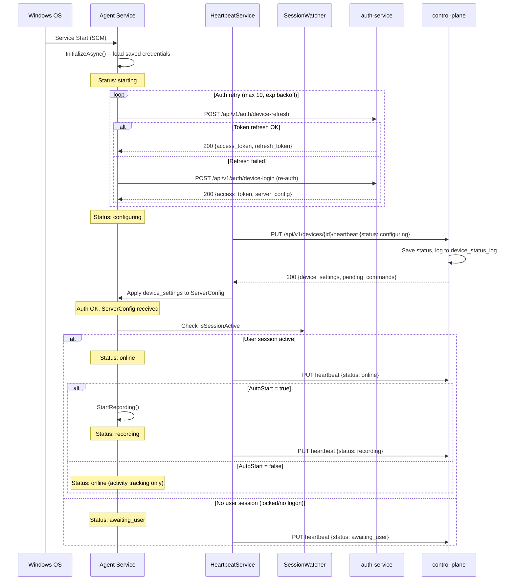
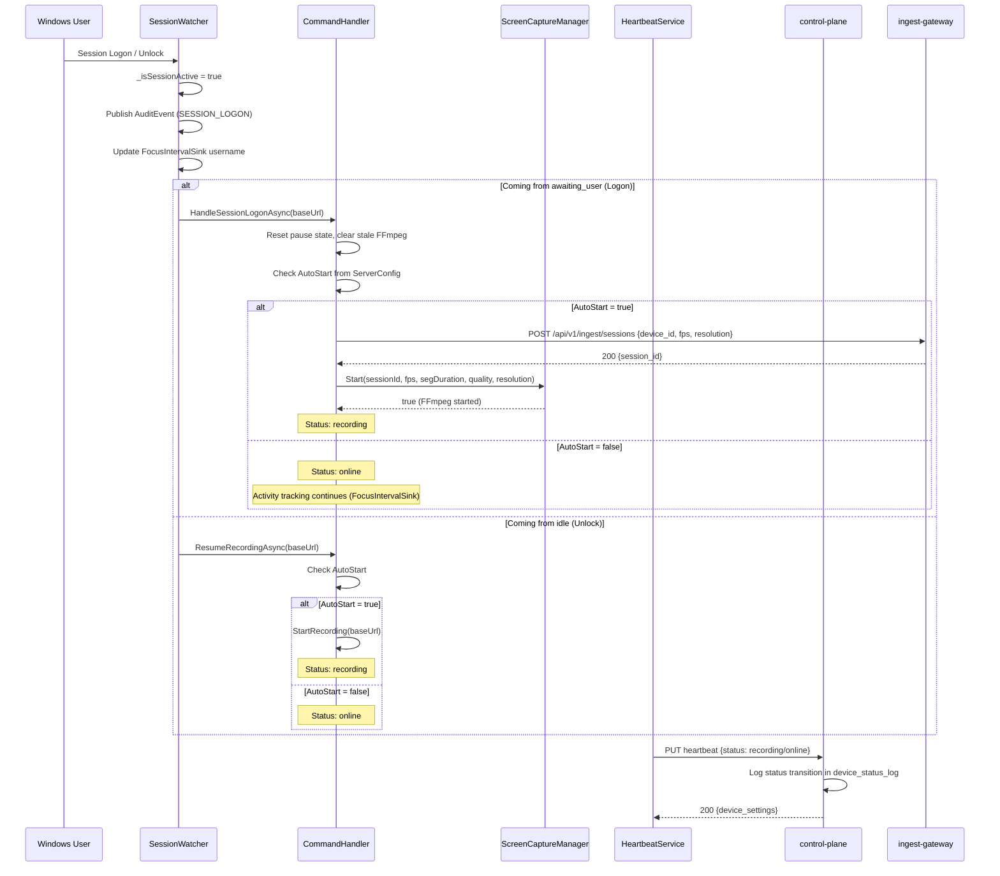
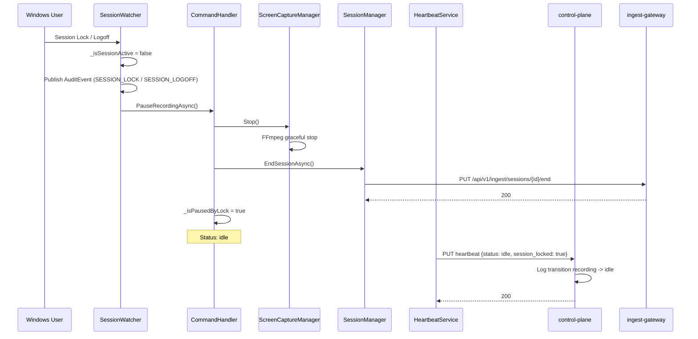
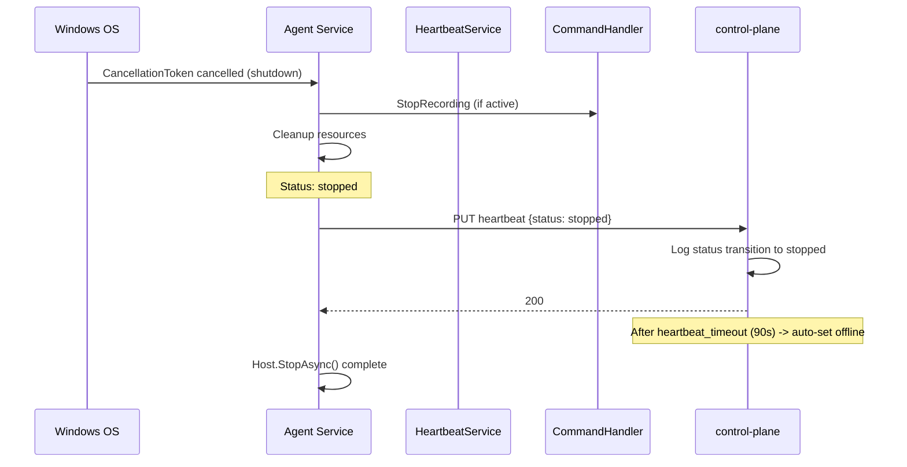
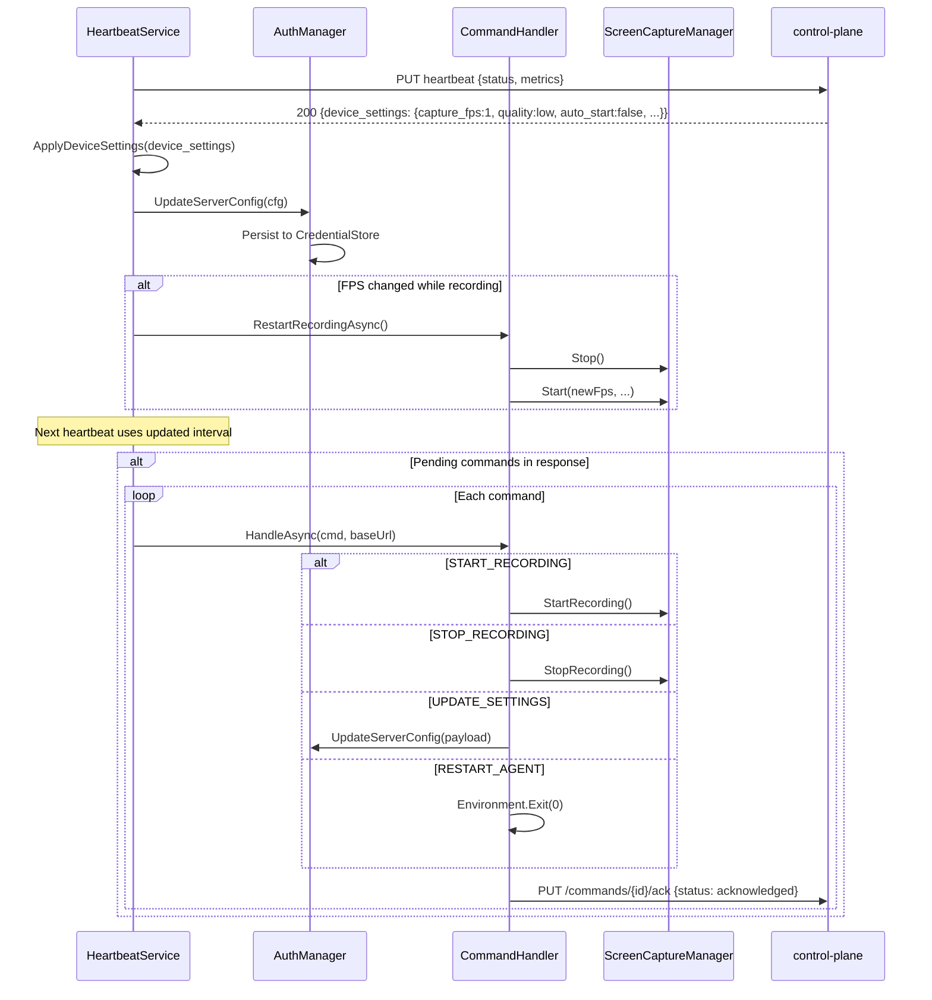

# Спецификация: Полный жизненный цикл агента Кадеро

**Версия:** 1.0  
**Дата:** 2026-03-09  
**Автор:** Системный аналитик  
**Статус:** Draft  

---

## 1. Обзор

Документ описывает полный алгоритм работы Windows-агента Кадеро от момента запуска ОС до выключения компьютера. Включает взаимодействие агента с сервером (control-plane, auth-service, ingest-gateway), управление конфигурацией, статусную модель, журнал статусов на сервере и дефолтные параметры записи.

### 1.1. Участники

| Компонент | Роль |
|-----------|------|
| **Windows Agent (Service)** | BackgroundService, запускается при старте ОС |
| **Windows Agent (Tray)** | Отдельный процесс в сессии пользователя, UI |
| **auth-service** | Аутентификация устройства, выдача JWT, ServerConfig |
| **control-plane** | Heartbeat, команды, статус устройства, журнал статусов |
| **ingest-gateway** | Приём видеосегментов, аудит-события, focus-интервалы |

---

## 2. Текущее состояние (AS-IS)

### 2.1. Что уже реализовано

| Функция | Статус | Файл / Компонент |
|---------|--------|-------------------|
| Запуск Service при старте ОС | Реализовано | `Program.cs` (--service), Windows Service registration |
| Аутентификация с retry (exponential backoff) | Реализовано | `AgentService.cs` lines 42-63 |
| Heartbeat с метриками | Реализовано | `HeartbeatService.cs` |
| Отправка статуса (online/recording/idle) | Реализовано | `HeartbeatService.cs` line 66 |
| Приём device_settings из heartbeat response | Реализовано | `HeartbeatService.cs` ApplyDeviceSettings |
| Приём pending commands из heartbeat response | Реализовано | `HeartbeatService.cs` lines 108-114 |
| Обработка SessionSwitch (Lock/Unlock/Logon/Logoff) | Реализовано | `SessionWatcher.cs` |
| Авто-старт записи после авторизации | Реализовано | `AgentService.cs` line 79, `CommandHandler.cs` AutoStartRecordingAsync |
| Pause/Resume при Lock/Unlock | Реализовано | `CommandHandler.cs` PauseRecordingAsync/ResumeRecordingAsync |
| AutoStart flag (серверный) | Реализовано | `ServerConfig.AutoStart`, проверяется в AutoStartRecordingAsync |
| Получение ServerConfig при device-login | Реализовано | `DeviceAuthService.java` lines 329-339 |
| Device settings в devices.settings (JSONB) | Реализовано | `Device.java` settings field |
| Команды: START/STOP_RECORDING, UPDATE_SETTINGS, RESTART_AGENT | Реализовано | `CommandHandler.cs` HandleAsync |
| DeviceDetailPage с командами и настройками | Реализовано | `DeviceDetailPage.tsx` |
| Crash recovery с backoff | Реализовано | `CommandHandler.cs` CheckAndRecoverAsync |
| Session rotation по max duration | Реализовано | `CommandHandler.cs` CheckSessionRotationAsync |
| Tray single-instance (Mutex) | Реализовано | `Program.cs` lines 102-107 |
| Host single-instance (Global Mutex) | Реализовано | `Program.cs` lines 329-348 |

### 2.2. Что НЕ реализовано (GAP-анализ)

| Требование | GAP | Описание |
|------------|-----|----------|
| **Статус "Получаю конфигурацию с сервера"** | Отсутствует | Агент не отправляет промежуточный статус при загрузке конфигурации. Сервер не хранит историю статусов. |
| **Статус "Ожидаю входа пользователя"** | Частично | `session_locked` отправляется в heartbeat, но нет отдельного статуса "awaiting_user". Heartbeat-статус = "idle" при lock. |
| **Журнал статусов устройства** | Отсутствует | Сервер хранит только `device.status` (текущий). Нет таблицы `device_status_log` с историей. В DeviceDetailPage нет секции "Журнал статусов". |
| **Запись НЕ стартует без информации от сервера** | Нарушено | `AgentConfig.AutoStart = true` в appsettings.json. Если ServerConfig не получен, используется локальный default = true. |
| **Регистрация активности при autostart=false** | Частично | `ActiveWindowTracker` + `FocusIntervalSink` работают всегда, но не привязаны к условию "autostart=false -> только активность". |
| **Статус "Агент остановлен"** | Отсутствует | При shutdown агент не отправляет финальный heartbeat с status="stopped". |
| **Статус "Ошибка" при сбое записи** | Частично | Heartbeat отправляет status по факту (`recording`/`online`/`idle`), но не "error". FFmpeg crash меняет _isRecording, но heartbeat не знает о типе ошибки. |
| **Дефолтные параметры: autostart=нет** | Нарушено | Текущий дефолт: `autostart=true`. Требование: `autostart=false` по умолчанию. |
| **Дефолтные параметры: качество=Низкое** | Нарушено | Текущий дефолт: `quality=medium`. Требование: `quality=low`. |
| **Дефолтные параметры: сессия 40 мин** | Нарушено | Текущий дефолт: `session_max_duration_hours=24`. Требование: `session_max_duration_minutes=40`. |
| **Дефолтные параметры: сегмент 60 сек** | Нарушено | Текущий дефолт: `segment_duration_sec=10`. Требование: `segment_duration_sec=60`. |
| **Расширенная статусная модель (idle)** | Частично | `idle` уже в HeartbeatRequest regex, но не полностью используется. Нет статусов "configuring", "awaiting_user", "stopped". |

---

## 3. Статусная модель агента (конечный автомат)

### 3.1. Состояния

| Статус | Код | Описание | Условие |
|--------|-----|----------|---------|
| Запуск | `starting` | Служба запущена, идет инициализация | Service started, pre-auth |
| Получение конфигурации | `configuring` | Авторизация + получение ServerConfig | Auth in progress |
| Ожидание входа | `awaiting_user` | Авторизован, но пользователь не залогинен | Auth OK, session locked/no user |
| Готов (онлайн) | `online` | Авторизован, пользователь залогинен, запись не идет | Auth OK, session active, autostart=false |
| Идет запись | `recording` | Запись экрана активна | FFmpeg running |
| Пользователь неактивен | `idle` | Экран заблокирован или пользователь вышел | Session locked/logoff |
| Ошибка | `error` | Сбой записи или связи | FFmpeg crash, network error |
| Остановлен | `stopped` | Служба останавливается | Service shutdown |

### 3.2. Диаграмма переходов

```
                    +-----------+
        OS Boot --> | starting  |
                    +-----+-----+
                          |
                    auth retry loop
                          |
                    +-----v-------+
                    | configuring |
                    +-----+-------+
                          |
               auth OK + ServerConfig received
                          |
              +-----------v-----------+
              |                       |
        user logged in?         no user session
              |                       |
        +-----v-----+         +------v--------+
        |   online   |         | awaiting_user |
        +-----+------+         +------+--------+
              |                        |
    autostart=yes?               user logon
              |                        |
        +-----v------+          +-----v-----+
        | recording   |<--------+  online   |
        +------+------+         +-----------+
               |
          lock/logoff
               |
        +------v------+
        |    idle      |
        +------+------+
               |
         unlock/logon
               |
        +------v------+
        | recording   |  (if autostart=yes)
        | online      |  (if autostart=no)
        +-------------+

        Any state --> error (on failure)
        Any state --> stopped (on shutdown)
```

### 3.3. Таблица переходов

| Из | Событие | В | Действие |
|----|---------|---|----------|
| `starting` | Auth начата | `configuring` | Heartbeat: status=configuring |
| `configuring` | Auth OK + ServerConfig | `awaiting_user` / `online` | Heartbeat: status=awaiting_user или online |
| `configuring` | Auth fail (все попытки) | `error` | Heartbeat: status=error |
| `awaiting_user` | SessionLogon / Unlock | `online` | Heartbeat: status=online |
| `online` | AutoStart=true | `recording` | StartRecording, Heartbeat: status=recording |
| `online` | Command START_RECORDING | `recording` | StartRecording, Heartbeat: status=recording |
| `recording` | SessionLock / Logoff | `idle` | PauseRecording, Heartbeat: status=idle |
| `recording` | Command STOP_RECORDING | `online` | StopRecording, Heartbeat: status=online |
| `recording` | FFmpeg crash | `error` | Heartbeat: status=error, attempt recovery |
| `idle` | SessionUnlock / Logon | `recording` / `online` | Resume/Start if autostart=yes |
| `error` | Recovery success | `recording` | Restart FFmpeg |
| `error` | Max failures reached | `online` | Wait for command |
| * | Service shutdown | `stopped` | Final heartbeat: status=stopped |

---

## 4. Требования к изменениям по сервисам

### 4.1. Control-plane

#### 4.1.1. Расширение статусов устройства

Текущий CHECK constraint: `status IN ('offline', 'online', 'recording', 'error')`.

Новые статусы: `starting`, `configuring`, `awaiting_user`, `idle`, `stopped`.

**Изменение БД:** Миграция для расширения CHECK constraint.

**Изменение HeartbeatRequest:** Расширить regex.

**Изменение DeviceService.processHeartbeat:** Логика определения offline остается по heartbeat timeout.

#### 4.1.2. Журнал статусов устройства (device_status_log)

Новая таблица для хранения истории смен статусов. Записывается при каждом heartbeat, если статус изменился.

#### 4.1.3. Новый endpoint: GET /api/v1/devices/{id}/status-log

Возвращает историю статусов устройства для отображения в DeviceDetailPage.

### 4.2. Auth-service

#### 4.2.1. Изменение дефолтов в ServerConfig

| Параметр | Старый дефолт | Новый дефолт |
|----------|---------------|--------------|
| `auto_start` | `true` | `false` |
| `quality` | `medium` | `low` |
| `session_max_duration_hours` | `24` | -- |
| `segment_duration_sec` | `10` | `60` |
| `capture_fps` | `1` | `1` (без изменений) |
| `resolution` | `720p` | `720p` (без изменений) |

**ВНИМАНИЕ:** Параметр `session_max_duration_hours` заменяется на `session_max_duration_min` (минуты). Дефолт = 40 минут.

#### 4.2.2. Изменение DeviceLoginResponse.ServerConfig

Добавить поле `session_max_duration_min` (Integer). Оставить `session_max_duration_hours` для обратной совместимости (deprecated, nullable).

### 4.3. Ingest-gateway

Без изменений API. Изменений в ingest-gateway не требуется.

### 4.4. Windows Agent

#### 4.4.1. Изменения в AgentConfig

| Параметр | Старое значение | Новое значение |
|----------|----------------|----------------|
| `AutoStart` | `true` | `false` |
| `Quality` | `medium` | `low` |
| `SegmentDurationSec` | `10` | `60` |
| `SessionMaxDurationHours` | `24` | -- |

Добавить: `SessionMaxDurationMin` (int, default 40).

#### 4.4.2. Статусная машина в AgentService

Ввести `AgentState` enum и поле `_currentState` для явного управления состояниями. Каждый переход обновляет `_currentState` и вызывает heartbeat с новым статусом.

#### 4.4.3. Финальный heartbeat при shutdown

При остановке службы (CancellationToken cancelled) отправить heartbeat с `status=stopped`.

#### 4.4.4. Статус "configuring" при инициализации

Между стартом и завершением auth -- отправлять heartbeat с `status=configuring` (если есть сохраненные credentials для device_id).

#### 4.4.5. Статус "awaiting_user" при заблокированной сессии

Если auth прошла, но `SessionWatcher.IsSessionActive == false` -- статус `awaiting_user`.

#### 4.4.6. Активность приложений при autostart=false

Если autostart=false, при логоне пользователя:
- ActiveWindowTracker / FocusIntervalSink продолжают работать (уже так).
- Запись НЕ стартует.
- Heartbeat status = `online`.

### 4.5. Web Dashboard

#### 4.5.1. Секция "Журнал статусов" в DeviceDetailPage

Новая секция между "Информация об устройстве" и "Настройки записи". Показывает таблицу с историей смен статусов (timestamp, old_status, new_status, details).

---

## 5. API контракты

### 5.1. Изменение: PUT /api/v1/devices/{id}/heartbeat

#### Request (HeartbeatRequest) -- расширение

```json
{
  "status": "recording",          // CHANGED: extended enum -- see below
  "agent_version": "1.0.0",
  "timezone": "Europe/Moscow",
  "os_type": "windows",
  "session_locked": false,
  "metrics": {
    "cpu_percent": 12.5,
    "memory_mb": 256,
    "disk_free_gb": 50.2,
    "segments_queued": 3
  }
}
```

**status enum (расширенный):**
`starting` | `configuring` | `awaiting_user` | `online` | `recording` | `idle` | `error` | `stopped`

#### Response (HeartbeatResponse) -- без изменений

```json
{
  "server_ts": "2026-03-09T12:00:00Z",
  "pending_commands": [],
  "next_heartbeat_sec": 30,
  "device_settings": {
    "capture_fps": 1,
    "resolution": "720p",
    "quality": "low",
    "segment_duration_sec": 60,
    "auto_start": false,
    "session_max_duration_min": 40
  }
}
```

### 5.2. Новый: GET /api/v1/devices/{id}/status-log

Возвращает историю смен статусов устройства.

**Auth:** Bearer JWT + permission `DEVICES:READ`  
**Tenant isolation:** Устройство должно принадлежать tenant_id из JWT.

#### Request

```
GET /api/v1/devices/{id}/status-log?page=0&size=50&from=2026-03-01T00:00:00Z&to=2026-03-09T23:59:59Z
```

| Параметр | Тип | Обязателен | Описание |
|----------|-----|------------|----------|
| `id` | UUID (path) | да | ID устройства |
| `page` | int (query) | нет | Страница (default 0) |
| `size` | int (query) | нет | Размер страницы (default 50, max 200) |
| `from` | ISO 8601 (query) | нет | Начало диапазона |
| `to` | ISO 8601 (query) | нет | Конец диапазона |

#### Response

```json
{
  "content": [
    {
      "id": "f47ac10b-58cc-4372-a567-0e02b2c3d479",
      "device_id": "64b4d56e-da7a-4ef5-b1b4-f1921c9969f1",
      "previous_status": "idle",
      "new_status": "recording",
      "changed_ts": "2026-03-09T09:01:15Z",
      "trigger": "heartbeat",
      "details": {
        "session_locked": false,
        "agent_version": "1.0.0"
      }
    }
  ],
  "page": 0,
  "size": 50,
  "total_elements": 127,
  "total_pages": 3
}
```

#### Коды ошибок

| HTTP | Код | Описание |
|------|-----|----------|
| 200 | -- | Успех |
| 401 | UNAUTHORIZED | Невалидный JWT |
| 403 | ACCESS_DENIED | Нет permission DEVICES:READ |
| 404 | DEVICE_NOT_FOUND | Устройство не найдено в tenant |

### 5.3. Изменение: POST /api/v1/auth/device-login (ServerConfig)

#### Изменение в ServerConfig

Добавить поле `session_max_duration_min` (Integer). Дефолт: 40.

```json
{
  "access_token": "...",
  "refresh_token": "...",
  "token_type": "Bearer",
  "expires_in": 3600,
  "device_id": "64b4d56e-...",
  "device_status": "online",
  "server_config": {
    "heartbeat_interval_sec": 30,
    "segment_duration_sec": 60,
    "capture_fps": 1,
    "quality": "low",
    "ingest_base_url": "https://...",
    "control_plane_base_url": "https://...",
    "resolution": "720p",
    "session_max_duration_min": 40,
    "session_max_duration_hours": null,
    "auto_start": false
  }
}
```

---

## 6. Модель данных

### 6.1. Новая таблица: device_status_log (control-plane)

```sql
-- V32__create_device_status_log.sql (control-plane side -- managed by auth-service Flyway)

CREATE TABLE device_status_log (
    id              UUID PRIMARY KEY DEFAULT gen_random_uuid(),
    tenant_id       UUID NOT NULL REFERENCES tenants(id),
    device_id       UUID NOT NULL REFERENCES devices(id) ON DELETE CASCADE,
    previous_status VARCHAR(20),
    new_status      VARCHAR(20) NOT NULL,
    changed_ts      TIMESTAMPTZ NOT NULL DEFAULT NOW(),
    trigger         VARCHAR(30) NOT NULL DEFAULT 'heartbeat'
        CHECK (trigger IN ('heartbeat', 'command', 'session_event', 'system', 'admin')),
    details         JSONB,

    CONSTRAINT chk_status_log_new CHECK (
        new_status IN ('starting', 'configuring', 'awaiting_user', 'online',
                       'recording', 'idle', 'error', 'stopped', 'offline')
    )
);

-- Основной индекс: запросы по устройству + время (новые сверху)
CREATE INDEX idx_dsl_device_ts ON device_status_log(device_id, changed_ts DESC);

-- Индекс для tenant isolation + время (для admin-запросов по тенанту)
CREATE INDEX idx_dsl_tenant_ts ON device_status_log(tenant_id, changed_ts DESC);

-- Частичный индекс для ошибок (мониторинг)
CREATE INDEX idx_dsl_errors ON device_status_log(tenant_id, changed_ts DESC)
    WHERE new_status = 'error';

COMMENT ON TABLE device_status_log IS 'Immutable log of device status transitions, written on each heartbeat status change';
COMMENT ON COLUMN device_status_log.trigger IS 'What caused the status change: heartbeat, command, session_event, system, admin';
COMMENT ON COLUMN device_status_log.details IS 'Optional JSON: agent_version, session_locked, error_message, command_id';
```

### 6.2. Изменение CHECK constraint на devices.status

```sql
-- V32 (часть миграции)

ALTER TABLE devices DROP CONSTRAINT IF EXISTS devices_status_check;
ALTER TABLE devices ADD CONSTRAINT devices_status_check
    CHECK (status IN ('offline', 'online', 'recording', 'error',
                      'starting', 'configuring', 'awaiting_user', 'idle', 'stopped'));
```

### 6.3. Изменение дефолтов в auth-service application.yml

```yaml
prg:
  device:
    capture-fps: 1
    quality: low                    # CHANGED from medium
    default-resolution: 720p
    default-session-max-min: 40     # NEW (replaces default-session-max-hours)
    default-session-max-hours: 0    # DEPRECATED, 0 = use minutes
    default-auto-start: false       # CHANGED from true
    segment-duration-sec: 60        # CHANGED from 10
    heartbeat-interval-sec: 30
```

### 6.4. Оценка размеров таблицы device_status_log

При 10,000 устройств, heartbeat каждые 30 секунд, но status_log записывается только при СМЕНЕ статуса:
- Типичный рабочий день: 5-10 смен статуса на устройство
- 10,000 * 10 = 100,000 записей/день
- 30 дней = 3M записей
- Размер строки ~200 байт → ~600 MB/месяц

Рекомендация: партиционирование по месяцам (RANGE по changed_ts) + retention policy 90 дней.

### 6.5. Партиционирование device_status_log (опционально, V2)

```sql
-- Если нагрузка превысит ожидания, конвертировать в partitioned table:
-- CREATE TABLE device_status_log (...) PARTITION BY RANGE (changed_ts);
-- CREATE TABLE device_status_log_2026_03 PARTITION OF device_status_log
--     FOR VALUES FROM ('2026-03-01') TO ('2026-04-01');
```

На начальном этапе достаточно обычной таблицы с индексом по (device_id, changed_ts DESC).

---

## 7. Sequence Diagrams

### 7.1. Запуск службы при старте ОС



### 7.2. Логин пользователя



### 7.3. Блокировка / Разлогин



### 7.4. Выключение / Перезагрузка



### 7.5. Получение и применение конфигурации



---

## 8. Дефолтные параметры записи

### 8.1. Таблица дефолтов

| Параметр | Ключ (JSON/config) | Значение по умолчанию | Единица |
|----------|--------------------|-----------------------|---------|
| Частота кадров | `capture_fps` | 1 | FPS |
| Разрешение | `resolution` | 720p (1280x720) | пикселей |
| Качество | `quality` | low | enum: low/medium/high |
| Длительность сегмента | `segment_duration_sec` | 60 | секунд |
| Максимальная длительность сессии | `session_max_duration_min` | 40 | минут |
| Автозапуск записи | `auto_start` | false | boolean |
| Интервал heartbeat | `heartbeat_interval_sec` | 30 | секунд |

### 8.2. Приоритет конфигурации (от высшего к низшему)

1. **device.settings JSONB** -- индивидуальные настройки устройства, заданные администратором через DeviceDetailPage
2. **Heartbeat device_settings** -- настройки, отданные сервером в ответе на heartbeat (= device.settings)
3. **ServerConfig из device-login** -- дефолты из auth-service application.yml (или device-specific overrides)
4. **AgentConfig из appsettings.json** -- локальные дефолты агента (safety net при отсутствии связи)

### 8.3. Маппинг качества на bitrate

| Качество | Bitrate (FFmpeg -b:v) |
|----------|----------------------|
| low | 300k |
| medium | 800k |
| high | 1500k |

---

## 9. Затронутые файлы

### 9.1. Control-plane

| Файл | Изменение |
|------|-----------|
| `dto/request/HeartbeatRequest.java` | Расширить regex статусов: добавить `starting`, `configuring`, `awaiting_user`, `idle`, `stopped` |
| `entity/Device.java` | -- (status уже String, constraint в БД) |
| `entity/DeviceStatusLog.java` | **НОВЫЙ** -- JPA entity для device_status_log |
| `repository/DeviceStatusLogRepository.java` | **НОВЫЙ** -- Spring Data JPA repository |
| `dto/response/DeviceStatusLogResponse.java` | **НОВЫЙ** -- DTO для ответа |
| `controller/DeviceController.java` | Добавить endpoint GET /{id}/status-log |
| `service/DeviceService.java` | Добавить логику записи в device_status_log при смене статуса в processHeartbeat |
| `dto/response/DeviceDetailResponse.java` | Добавить поле `List<DeviceStatusLogResponse> recentStatusLog` (опционально) |
| SQL migration V32 | Таблица device_status_log + ALTER devices CHECK constraint |

### 9.2. Auth-service

| Файл | Изменение |
|------|-----------|
| `service/DeviceAuthService.java` | Изменить дефолты: quality=low, autoStart=false, segmentDurationSec=60, добавить sessionMaxDurationMin=40 |
| `dto/response/DeviceLoginResponse.java` | Добавить `sessionMaxDurationMin` в ServerConfig |
| `application.yml` | Изменить дефолтные значения |
| SQL migration V32 | ALTER devices CHECK constraint (общая миграция с control-plane) |

### 9.3. Windows Agent

| Файл | Изменение |
|------|-----------|
| `Configuration/AgentConfig.cs` | AutoStart=false, Quality=low, SegmentDurationSec=60, добавить SessionMaxDurationMin=40 |
| `Configuration/ServerConfig.cs` | Добавить SessionMaxDurationMin (int?) |
| `appsettings.json` | Обновить дефолты |
| `Service/AgentService.cs` | Добавить state machine, финальный heartbeat при shutdown |
| `Command/HeartbeatService.cs` | Расширить определение status с учетом новых состояний |
| `Command/CommandHandler.cs` | Использовать SessionMaxDurationMin вместо Hours |
| `Service/AgentStatusProvider.cs` | Отражать новые статусы |
| `Ipc/PipeProtocol.cs` | Расширить AgentStatus новыми полями |
| `Command/HeartbeatService.cs` | ApplyDeviceSettings: парсить session_max_duration_min |

### 9.4. Web Dashboard

| Файл | Изменение |
|------|-----------|
| `types/device.ts` | Добавить DeviceStatusLogEntry, расширить статусы |
| `api/devices.ts` | Добавить getDeviceStatusLog(id, params) |
| `pages/DeviceDetailPage.tsx` | Добавить секцию "Журнал статусов" |
| `components/DeviceStatusBadge.tsx` | Добавить цвета для новых статусов |

---

## 10. Зависимости и риски

### 10.1. Порядок деплоя

1. **auth-service** -- миграция V32 (ALTER devices CHECK, CREATE device_status_log) + изменение дефолтов
2. **control-plane** -- новая entity/repository/controller для device_status_log + расширение HeartbeatRequest
3. **Windows Agent** -- новая сборка с обновленными дефолтами и state machine
4. **web-dashboard** -- секция журнала статусов

**ВАЖНО:** Миграция V32 должна выполняться auth-service (Flyway owner), потому что auth-service владеет таблицей devices. Control-plane использует ту же БД, но Flyway disabled.

### 10.2. Обратная совместимость

| Компонент | Риск | Митигация |
|-----------|------|-----------|
| Старые агенты (до обновления) | Отправляют только `online`/`recording`/`idle`/`error` | Новые статусы опциональны, старые продолжают работать |
| HeartbeatRequest regex | Расширение regex не ломает существующие значения | Regex будет принимать superset |
| device.settings `session_max_duration_hours` vs `_min` | Старые агенты читают hours, новые -- min | Оба поля в ServerConfig. Агент проверяет min сначала, fallback на hours. |
| `autostart` default change false | Существующие устройства с device.settings пустым получат autostart=false | Нужно предупредить -- если раньше устройства стартовали запись автоматически, после обновления перестанут. Администратор должен явно установить autostart=true для нужных устройств. |

### 10.3. Риски

| Риск | Вероятность | Влияние | Митигация |
|------|-------------|---------|-----------|
| device_status_log рост данных | Средняя | Высокое (дисковое пространство) | Retention policy 90 дней, мониторинг размера таблицы |
| Гонка при записи в status_log (concurrent heartbeats) | Низкая | Низкое | INSERT-only, нет UPDATE -- нет конфликтов |
| Существующие устройства перестанут авто-стартовать запись | Высокая | Высокое | Release notes + batch-update device.settings для существующих устройств |
| Смена session_max_duration_hours на _min | Средняя | Среднее | Обе единицы в ServerConfig, agent проверяет min первым |

### 10.4. Неоднозначности (требуют уточнения)

1. **"По умолчанию запись не стартует без информации от сервера"** -- означает ли это, что даже если у агента есть кэшированный ServerConfig с autostart=true, он должен дождаться свежего heartbeat response перед стартом записи? Текущая реализация использует кэшированный ServerConfig сразу. Рекомендация: оставить текущее поведение (кэш), так как сервер может быть недоступен при загрузке.

2. **Очистка device_status_log** -- нужна ли автоматическая очистка старых записей? Рекомендация: retention 90 дней через scheduled task или pg_cron.

3. **Влияние на macOS agent** -- данная спецификация описывает только Windows Agent. Те же изменения серверной части (дефолты, статусы) повлияют и на macOS agent. Нужна отдельная задача для macOS.

---

## 11. Миграция V32: SQL

```sql
-- V32: Agent lifecycle -- device status log + extended status enum + default changes
-- Flyway: auth-service

-- 1. Extend devices.status CHECK constraint
ALTER TABLE devices DROP CONSTRAINT IF EXISTS devices_status_check;
ALTER TABLE devices ADD CONSTRAINT devices_status_check
    CHECK (status IN (
        'offline', 'online', 'recording', 'error',
        'starting', 'configuring', 'awaiting_user', 'idle', 'stopped'
    ));

-- 2. Device status log table
CREATE TABLE device_status_log (
    id              UUID PRIMARY KEY DEFAULT gen_random_uuid(),
    tenant_id       UUID NOT NULL,
    device_id       UUID NOT NULL,
    previous_status VARCHAR(20),
    new_status      VARCHAR(20) NOT NULL,
    changed_ts      TIMESTAMPTZ NOT NULL DEFAULT NOW(),
    trigger         VARCHAR(30) NOT NULL DEFAULT 'heartbeat',
    details         JSONB,

    CONSTRAINT fk_dsl_tenant FOREIGN KEY (tenant_id) REFERENCES tenants(id),
    CONSTRAINT fk_dsl_device FOREIGN KEY (device_id) REFERENCES devices(id) ON DELETE CASCADE,
    CONSTRAINT chk_dsl_trigger CHECK (
        trigger IN ('heartbeat', 'command', 'session_event', 'system', 'admin')
    ),
    CONSTRAINT chk_dsl_new_status CHECK (
        new_status IN (
            'offline', 'online', 'recording', 'error',
            'starting', 'configuring', 'awaiting_user', 'idle', 'stopped'
        )
    )
);

-- Primary query: device detail page, sorted by time desc
CREATE INDEX idx_dsl_device_ts ON device_status_log(device_id, changed_ts DESC);

-- Admin query: all status changes for a tenant
CREATE INDEX idx_dsl_tenant_ts ON device_status_log(tenant_id, changed_ts DESC);

-- Monitoring: find all devices in error state
CREATE INDEX idx_dsl_errors ON device_status_log(tenant_id, changed_ts DESC)
    WHERE new_status = 'error';

COMMENT ON TABLE device_status_log IS 'Immutable log of device status transitions';
COMMENT ON COLUMN device_status_log.trigger IS 'What caused the transition: heartbeat, command, session_event, system, admin';
```

---

## 12. Декомпозиция на задачи

Задачи пронумерованы для добавления в tracker.xlsx.

| # | Тип | Сервис | Приоритет | Название |
|---|-----|--------|-----------|----------|
| 1 | Task | auth-service | Critical | V32 миграция: расширение devices CHECK + таблица device_status_log |
| 2 | Task | auth-service | High | Изменить дефолты ServerConfig: quality=low, autostart=false, segment=60s, session_max_min=40 |
| 3 | Task | auth-service | High | Добавить session_max_duration_min в DeviceLoginResponse.ServerConfig |
| 4 | Task | control-plane | Critical | Entity/Repository/DTO для device_status_log |
| 5 | Task | control-plane | Critical | Записывать смену статуса в device_status_log при heartbeat |
| 6 | Task | control-plane | High | Новый endpoint GET /devices/{id}/status-log |
| 7 | Task | control-plane | High | Расширить HeartbeatRequest regex новыми статусами |
| 8 | Task | windows-agent | Critical | Обновить дефолты: autostart=false, quality=low, segment=60, session_max_min=40 |
| 9 | Task | windows-agent | High | Реализовать state machine (AgentState enum) с новыми статусами |
| 10 | Task | windows-agent | High | Финальный heartbeat status=stopped при shutdown |
| 11 | Task | windows-agent | High | Статус configuring при инициализации, awaiting_user при locked session |
| 12 | Task | windows-agent | Medium | Поддержка session_max_duration_min (приоритет над hours) |
| 13 | Task | web-dashboard | High | Секция "Журнал статусов" в DeviceDetailPage |
| 14 | Task | web-dashboard | Medium | Обновить DeviceStatusBadge для новых статусов |
