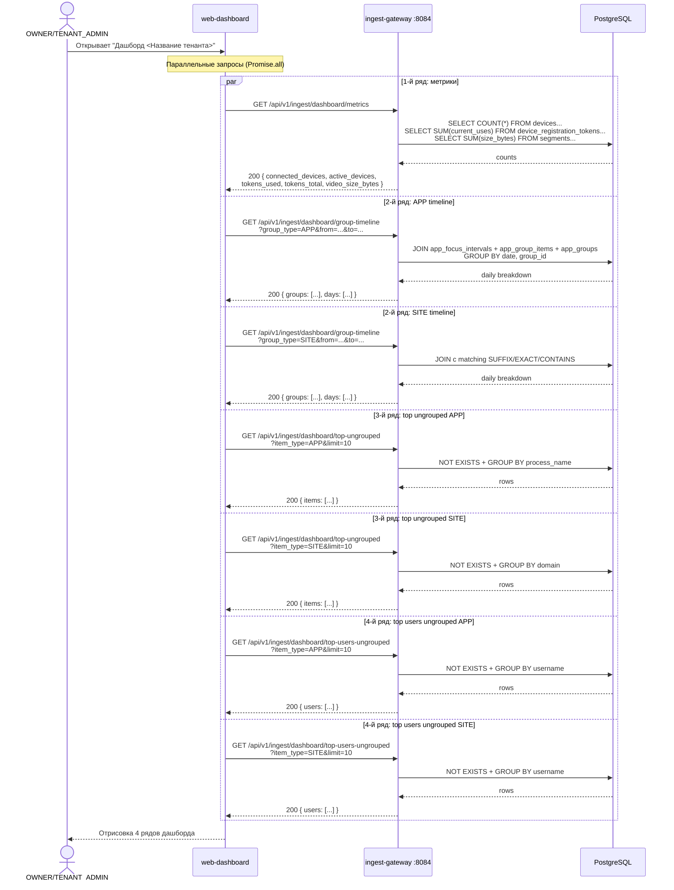
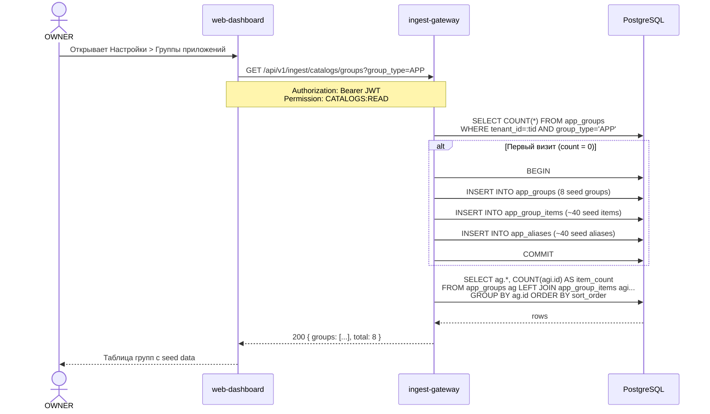
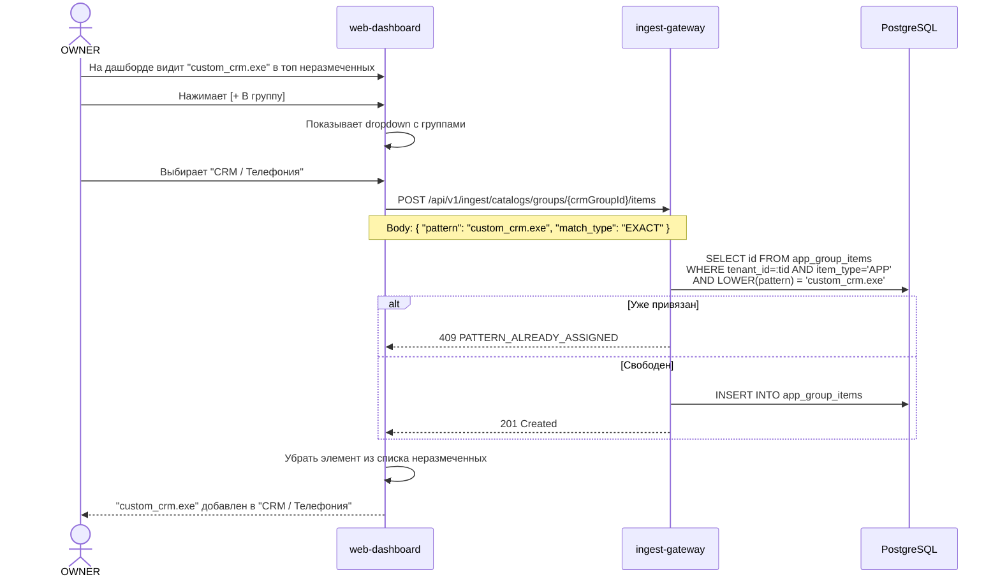

# Справочники, алиасы приложений и Дашборд -- полная спецификация

> **Версия:** 2.0
> **Дата:** 2026-03-08
> **Автор:** Системный аналитик
> **Статус:** Draft
> **Затронутые сервисы:** ingest-gateway, auth-service, control-plane (readonly), web-dashboard
> **Миграция:** V31 (ingest-gateway), V31 (auth-service)
> **Связанная спецификация:** `docs/app-groups-spec.md` (v1.0 -- базовый draft)

---

## Содержание

1. [Overview](#1-overview)
2. [Модель данных](#2-модель-данных)
3. [Seed Data](#3-seed-data)
4. [API Контракты: Справочники (ingest-gateway)](#4-api-контракты-справочники)
5. [API Контракты: Дашборд (ingest-gateway)](#5-api-контракты-дашборд)
6. [API Контракты: Метрики дашборда (cross-service)](#6-api-контракты-метрики-дашборда)
7. [Permissions](#7-permissions)
8. [Sequence Diagrams](#8-sequence-diagrams)
9. [Frontend](#9-frontend)
10. [Изменения в существующем коде](#10-изменения-в-существующем-коде)
11. [Производительность](#11-производительность)
12. [Обратная совместимость](#12-обратная-совместимость)
13. [User Stories](#13-user-stories)
14. [Декомпозиция задач](#14-декомпозиция-задач)
15. [Открытые вопросы](#15-открытые-вопросы)

---

## 1. Overview

### 1.1 Цель

Добавить три блока функциональности:

1. **Справочники** -- группы приложений, группы сайтов, алиасы для человекочитаемых имен.
2. **Дашборд** -- заменить текущую заглушку "Контрольная панель" / "Dashboard" полноценным дашбордом с 4 рядами: метрики, графики по группам, топ неразмеченных, топ пользователей по неразмеченным.
3. **Обогащение отчётов** -- в существующих отчётах по пользователям (apps, domains) показывать имя группы и display_name из алиасов.

### 1.2 Scope

**В scope:**
- Справочники групп (CRUD): app_groups, app_group_items, app_aliases
- Seed data для популярных приложений и сайтов (ленивый seed при первом визите)
- Дашборд: 4 ряда виджетов (метрики, графики групп, топ неразмеченных, топ пользователей)
- API endpoints для справочников и агрегаций дашборда
- Frontend: новые страницы справочников, полностью переработанный DashboardPage
- Permissions: CATALOGS:READ, CATALOGS:MANAGE

**Вне scope:**
- Автоматическая классификация (ML), правила "продуктивности"
- Изменение Windows/macOS агента
- playback-service, search-service

### 1.3 Ключевые архитектурные решения

| Решение | Обоснование |
|---------|-------------|
| Справочники в ingest-gateway | Справочники связаны с `app_focus_intervals` -- агрегационные запросы в одной БД, нет межсервисного вызова |
| Единая таблица `app_groups` с `group_type` (APP/SITE) | Упрощает JOIN при агрегации; groups маленькая (~10-20 строк на тенант) |
| Алиасы в отдельной таблице `app_aliases` | Алиас не привязан к группе -- независимые жизненные циклы |
| Ленивый seed при первом GET | Не нужен процесс при создании тенанта; первый GET сам создает defaults |
| Метрики дашборда -- оркестрация из frontend | Frontend параллельно запрашивает control-plane (devices, tokens) и ingest-gateway (video size, groups). Нет API Gateway, нет BFF. |
| Библиотека графиков -- recharts | Самая популярная для React. В проекте пока нет chart-библиотек; recharts -- lightweight, типизированная, stacked area из коробки |

### 1.4 Текущее состояние

**Существующие данные (ingest-gateway):**
- `app_focus_intervals` -- партиционированная таблица, содержит `process_name`, `window_title`, `domain`, `is_browser`, `duration_ms`
- `device_user_sessions` -- сессии пользователей на устройствах
- `v_tenant_users` -- VIEW агрегации по пользователям

**Существующие API (ingest-gateway):**
- `GET /api/v1/ingest/users` -- список пользователей
- `GET /api/v1/ingest/users/activity` -- активность пользователя
- `GET /api/v1/ingest/users/apps` -- отчёт по приложениям
- `GET /api/v1/ingest/users/domains` -- отчёт по доменам
- `GET /api/v1/ingest/users/worktime` -- рабочее время
- `GET /api/v1/ingest/users/timesheet` -- табель

**Существующие API (control-plane):**
- `GET /api/v1/devices` -- список устройств (status, is_active, is_deleted)

**Существующие API (auth-service):**
- `GET /api/v1/device-tokens` -- список токенов регистрации (max_uses, current_uses)

**Текущий DashboardPage.tsx:**
- Заглушка со статичными карточками "--" и текстом "Getting Started"

---

## 2. Модель данных

### 2.1 Новые таблицы (ingest-gateway)

#### 2.1.1 `app_groups`

```sql
CREATE TABLE app_groups (
    id          UUID        NOT NULL DEFAULT gen_random_uuid(),
    tenant_id   UUID        NOT NULL,
    group_type  VARCHAR(10) NOT NULL CHECK (group_type IN ('APP', 'SITE')),
    name        VARCHAR(100) NOT NULL,
    description VARCHAR(500),
    color       VARCHAR(7),        -- hex, "#3B82F6"
    sort_order  INTEGER     NOT NULL DEFAULT 0,
    is_default  BOOLEAN     NOT NULL DEFAULT false,
    created_at  TIMESTAMPTZ NOT NULL DEFAULT NOW(),
    updated_at  TIMESTAMPTZ NOT NULL DEFAULT NOW(),
    created_by  UUID,
    PRIMARY KEY (id)
);

CREATE UNIQUE INDEX idx_ag_tenant_type_name
    ON app_groups (tenant_id, group_type, LOWER(name));

CREATE INDEX idx_ag_tenant_type
    ON app_groups (tenant_id, group_type, sort_order);
```

| Поле | Тип | Constraints | Описание |
|------|-----|-------------|----------|
| `id` | UUID | PK, gen_random_uuid() | ID группы |
| `tenant_id` | UUID | NOT NULL | Тенант-владелец |
| `group_type` | VARCHAR(10) | NOT NULL, CHECK ('APP','SITE') | Тип группы |
| `name` | VARCHAR(100) | NOT NULL, UNIQUE(tenant_id, group_type, LOWER) | Название |
| `description` | VARCHAR(500) | NULL | Описание |
| `color` | VARCHAR(7) | NULL, regexp `^#[0-9A-Fa-f]{6}$` | Цвет для UI |
| `sort_order` | INTEGER | NOT NULL DEFAULT 0 | Порядок сортировки |
| `is_default` | BOOLEAN | NOT NULL DEFAULT false | Seed-группа (нельзя удалить) |
| `created_at` | TIMESTAMPTZ | NOT NULL DEFAULT NOW() | Создана |
| `updated_at` | TIMESTAMPTZ | NOT NULL DEFAULT NOW() | Обновлена |
| `created_by` | UUID | NULL | user_id создателя |

#### 2.1.2 `app_group_items`

```sql
CREATE TABLE app_group_items (
    id              UUID        NOT NULL DEFAULT gen_random_uuid(),
    tenant_id       UUID        NOT NULL,
    group_id        UUID        NOT NULL REFERENCES app_groups(id) ON DELETE CASCADE,
    item_type       VARCHAR(10) NOT NULL CHECK (item_type IN ('APP', 'SITE')),
    pattern         VARCHAR(512) NOT NULL,
    match_type      VARCHAR(10) NOT NULL DEFAULT 'EXACT'
                    CHECK (match_type IN ('EXACT', 'SUFFIX', 'CONTAINS')),
    created_at      TIMESTAMPTZ NOT NULL DEFAULT NOW(),
    PRIMARY KEY (id)
);

CREATE UNIQUE INDEX idx_agi_tenant_type_pattern
    ON app_group_items (tenant_id, item_type, LOWER(pattern));

CREATE INDEX idx_agi_group
    ON app_group_items (group_id);

CREATE INDEX idx_agi_tenant_type
    ON app_group_items (tenant_id, item_type);
```

| Поле | Тип | Constraints | Описание |
|------|-----|-------------|----------|
| `id` | UUID | PK | ID привязки |
| `tenant_id` | UUID | NOT NULL | Тенант (денормализация) |
| `group_id` | UUID | FK -> app_groups ON DELETE CASCADE | Группа |
| `item_type` | VARCHAR(10) | CHECK ('APP','SITE') | Тип |
| `pattern` | VARCHAR(512) | UNIQUE(tenant_id, item_type, LOWER) | Паттерн: process_name или domain |
| `match_type` | VARCHAR(10) | DEFAULT 'EXACT', CHECK ('EXACT','SUFFIX','CONTAINS') | Тип сопоставления |
| `created_at` | TIMESTAMPTZ | NOT NULL DEFAULT NOW() | Создана |

**Правила match_type:**
- `EXACT` -- `LOWER(pattern) = LOWER(value)`
- `SUFFIX` -- `LOWER(value) = LOWER(pattern) OR LOWER(value) LIKE '%.' || LOWER(pattern)` (для доменов: mail.google.com -> google.com)
- `CONTAINS` -- `LOWER(value) LIKE '%' || LOWER(pattern) || '%'`

#### 2.1.3 `app_aliases`

```sql
CREATE TABLE app_aliases (
    id           UUID        NOT NULL DEFAULT gen_random_uuid(),
    tenant_id    UUID        NOT NULL,
    alias_type   VARCHAR(10) NOT NULL CHECK (alias_type IN ('APP', 'SITE')),
    original     VARCHAR(512) NOT NULL,
    display_name VARCHAR(200) NOT NULL,
    icon_url     VARCHAR(1024),
    created_at   TIMESTAMPTZ NOT NULL DEFAULT NOW(),
    updated_at   TIMESTAMPTZ NOT NULL DEFAULT NOW(),
    PRIMARY KEY (id)
);

CREATE UNIQUE INDEX idx_aa_tenant_type_original
    ON app_aliases (tenant_id, alias_type, LOWER(original));

CREATE INDEX idx_aa_tenant_type
    ON app_aliases (tenant_id, alias_type);
```

| Поле | Тип | Constraints | Описание |
|------|-----|-------------|----------|
| `id` | UUID | PK | ID алиаса |
| `tenant_id` | UUID | NOT NULL | Тенант |
| `alias_type` | VARCHAR(10) | CHECK ('APP','SITE') | Тип |
| `original` | VARCHAR(512) | UNIQUE(tenant_id, alias_type, LOWER) | Исходное имя |
| `display_name` | VARCHAR(200) | NOT NULL | Отображаемое имя |
| `icon_url` | VARCHAR(1024) | NULL | URL иконки (будущее) |

**Примеры:** `chrome.exe -> "Google Chrome"`, `mail.google.com -> "Gmail"`

### 2.2 ER-диаграмма

```
app_focus_intervals (existing)
    ├── process_name  ──>  app_group_items.pattern (item_type='APP', match)
    ├── domain        ──>  app_group_items.pattern (item_type='SITE', match)
    ├── process_name  ──>  app_aliases.original (alias_type='APP')
    └── domain        ──>  app_aliases.original (alias_type='SITE')

app_groups (1) ──< app_group_items (N)   [ON DELETE CASCADE]

Нет FK к app_focus_intervals -- связь логическая (JOIN по pattern/original).
```

### 2.3 Flyway V31 (ingest-gateway)

Файл: `ingest-gateway/src/main/resources/db/migration/V31__app_groups_and_aliases.sql`

Содержит: CREATE TABLE app_groups, app_group_items, app_aliases + все индексы.
Без seed data -- seed выполняется лениво при первом GET.

### 2.4 Flyway V31 (auth-service)

Файл: `auth-service/src/main/resources/db/migration/V31__add_catalogs_permissions.sql`

```sql
-- Permissions
INSERT INTO permissions (id, code, name, resource, action, description)
VALUES
  (gen_random_uuid(), 'CATALOGS:READ', 'View Catalogs',
   'CATALOGS', 'READ', 'View app/site groups, aliases, and dashboard data'),
  (gen_random_uuid(), 'CATALOGS:MANAGE', 'Manage Catalogs',
   'CATALOGS', 'MANAGE', 'Create, update, delete app/site groups and aliases')
ON CONFLICT (code) DO NOTHING;

-- CATALOGS:READ -> SUPER_ADMIN, OWNER, TENANT_ADMIN, MANAGER, SUPERVISOR
INSERT INTO role_permissions (role_id, permission_id)
SELECT r.id, p.id FROM roles r CROSS JOIN permissions p
WHERE r.code IN ('SUPER_ADMIN','OWNER','TENANT_ADMIN','MANAGER','SUPERVISOR')
  AND p.code = 'CATALOGS:READ'
ON CONFLICT DO NOTHING;

-- CATALOGS:MANAGE -> SUPER_ADMIN, OWNER, TENANT_ADMIN
INSERT INTO role_permissions (role_id, permission_id)
SELECT r.id, p.id FROM roles r CROSS JOIN permissions p
WHERE r.code IN ('SUPER_ADMIN','OWNER','TENANT_ADMIN')
  AND p.code = 'CATALOGS:MANAGE'
ON CONFLICT DO NOTHING;
```

---

## 3. Seed Data

Подробные таблицы seed data (группы, привязки, алиасы) описаны в `docs/app-groups-spec.md` секции 3.1--3.5.

**Стратегия применения:** Ленивый seed при первом GET. Если `app_groups` для `tenant_id + group_type` пуст -- CatalogSeedService вставляет default группы, items, aliases в одной транзакции.

**APP-группы (8 штук):** Мессенджеры, Офисные приложения, Браузеры, Разработка, Системные, Мультимедиа, CRM/Телефония, Прочее.

**SITE-группы (10 штук):** Почта, Поиск, Мессенджеры, Соцсети, Облачные хранилища, Разработка, Видео/Развлечения, Новости, CRM/Бизнес, Прочее.

**Алиасы:** ~40 APP + ~15 SITE.

---

## 4. API Контракты: Справочники

Все endpoints в **ingest-gateway**, префикс `/api/v1/ingest/catalogs/`.
Nginx-маршрут `/api/ingest/` -> `ingest-gateway:8084/api/` уже настроен.

### 4.1 Группы

#### GET /api/v1/ingest/catalogs/groups

Список групп. Ленивый seed при пустом справочнике.

| Параметр | Тип | Обязат. | Default | Описание |
|----------|-----|---------|---------|----------|
| `group_type` | string | Да | - | `APP` / `SITE` |
| `tenant_id` | UUID | Нет | JWT | Для SUPER_ADMIN |

**Response 200:**
```json
{
  "groups": [
    {
      "id": "550e8400-e29b-41d4-a716-446655440000",
      "group_type": "APP",
      "name": "Мессенджеры",
      "description": "Приложения для обмена сообщениями",
      "color": "#10B981",
      "sort_order": 1,
      "is_default": true,
      "item_count": 7,
      "created_at": "2026-03-08T12:00:00Z",
      "updated_at": "2026-03-08T12:00:00Z"
    }
  ],
  "total": 8
}
```

**Permission:** `CATALOGS:READ`

#### POST /api/v1/ingest/catalogs/groups

Создание группы.

**Request:**
```json
{
  "group_type": "APP",
  "name": "VPN-клиенты",
  "description": "Приложения VPN",
  "color": "#059669",
  "sort_order": 9
}
```

**Validation:**
- `group_type` -- обязателен, IN ('APP','SITE')
- `name` -- 1-100 символов, UNIQUE(tenant_id, group_type, LOWER(name))
- `color` -- опционален, `^#[0-9A-Fa-f]{6}$`

**Response 201:** созданный объект (как в GET).
**Error 409:** `{ "error": "...", "code": "GROUP_NAME_DUPLICATE" }`
**Permission:** `CATALOGS:MANAGE`

#### PUT /api/v1/ingest/catalogs/groups/{groupId}

Обновление. Для `is_default=true` -- можно менять name, description, color, sort_order.

**Request:** `{ "name": "...", "description": "...", "color": "...", "sort_order": 1 }`
**Response 200:** обновленный объект.
**Permission:** `CATALOGS:MANAGE`

#### DELETE /api/v1/ingest/catalogs/groups/{groupId}

Каскадное удаление (items тоже удаляются). Нельзя удалить `is_default=true`.

**Response 204**
**Error 400:** `{ "error": "Cannot delete default group", "code": "DEFAULT_GROUP_UNDELETABLE" }`
**Permission:** `CATALOGS:MANAGE`

### 4.2 Привязка элементов

#### GET /api/v1/ingest/catalogs/groups/{groupId}/items

**Response 200:**
```json
{
  "items": [
    {
      "id": "uuid",
      "item_type": "APP",
      "pattern": "telegram.exe",
      "match_type": "EXACT",
      "display_name": "Telegram",
      "created_at": "2026-03-08T12:00:00Z"
    }
  ],
  "total": 7
}
```
`display_name` -- LEFT JOIN из app_aliases.
**Permission:** `CATALOGS:READ`

#### POST /api/v1/ingest/catalogs/groups/{groupId}/items

**Request:** `{ "pattern": "signal.exe", "match_type": "EXACT" }`
**Response 201**
**Error 409:** `{ "code": "PATTERN_ALREADY_ASSIGNED" }`
**Permission:** `CATALOGS:MANAGE`

#### POST /api/v1/ingest/catalogs/groups/{groupId}/items/batch

**Request:** `{ "items": [{ "pattern": "app1.exe", "match_type": "EXACT" }, ...] }`
**Response 201:** `{ "created": 2, "skipped": 0, "items": [...] }`
**Permission:** `CATALOGS:MANAGE`

#### DELETE /api/v1/ingest/catalogs/items/{itemId}

**Response 204**
**Permission:** `CATALOGS:MANAGE`

#### PUT /api/v1/ingest/catalogs/items/{itemId}/move

**Request:** `{ "target_group_id": "uuid" }`
**Response 200:** обновленный item.
**Permission:** `CATALOGS:MANAGE`

### 4.3 Алиасы

#### GET /api/v1/ingest/catalogs/aliases

| Параметр | Тип | Обязат. | Default |
|----------|-----|---------|---------|
| `alias_type` | string | Да | - |
| `page` | int | Нет | 0 |
| `size` | int | Нет | 50 (max 200) |
| `search` | string | Нет | - |

**Response 200:** пагинированный список `{ content: [...], page, size, total_elements, total_pages }`
**Permission:** `CATALOGS:READ`

#### POST /api/v1/ingest/catalogs/aliases

**Request:** `{ "alias_type": "APP", "original": "app.exe", "display_name": "My App" }`
**Error 409:** `{ "code": "ALIAS_DUPLICATE" }`
**Permission:** `CATALOGS:MANAGE`

#### PUT /api/v1/ingest/catalogs/aliases/{aliasId}

**Request:** `{ "display_name": "New Name", "icon_url": null }`
**Permission:** `CATALOGS:MANAGE`

#### DELETE /api/v1/ingest/catalogs/aliases/{aliasId}

**Response 204**
**Permission:** `CATALOGS:MANAGE`

### 4.4 Несгруппированные

#### GET /api/v1/ingest/catalogs/ungrouped

| Параметр | Тип | Обязат. | Default |
|----------|-----|---------|---------|
| `item_type` | string | Да | - |
| `from` | date | Нет | 30 дней назад |
| `to` | date | Нет | сегодня |
| `page` | int | Нет | 0 |
| `size` | int | Нет | 50 |
| `search` | string | Нет | - |

**Response 200:**
```json
{
  "content": [
    {
      "name": "unknown_app.exe",
      "display_name": null,
      "total_duration_ms": 3600000,
      "interval_count": 42,
      "user_count": 3,
      "last_seen_at": "2026-03-08T15:30:00Z"
    }
  ],
  "page": 0, "size": 50,
  "total_elements": 12, "total_pages": 1,
  "total_ungrouped_duration_ms": 7200000
}
```

**SQL-логика:** `NOT EXISTS` с matching по `app_group_items`. Подробный SQL см. `docs/app-groups-spec.md` секция 4.4.1.
**Permission:** `CATALOGS:READ`

### 4.5 Seed endpoint

#### POST /api/v1/ingest/catalogs/seed

| Параметр | Тип | Default |
|----------|-----|---------|
| `group_type` | string | оба |
| `force` | boolean | false |

**Response 200:** `{ "created_groups": 8, "created_items": 45, "created_aliases": 42, "message": "..." }`
**Permission:** `CATALOGS:MANAGE`

---

## 5. API Контракты: Дашборд

Все endpoints в **ingest-gateway**, префикс `/api/v1/ingest/dashboard/`.

### 5.1 Сводка метрик (1-й ряд)

#### GET /api/v1/ingest/dashboard/metrics

Агрегированные метрики для карточек первого ряда дашборда.

| Параметр | Тип | Обязат. | Default |
|----------|-----|---------|---------|
| `tenant_id` | UUID | Нет | JWT |

**Response 200:**
```json
{
  "connected_devices": 15,
  "total_devices": 20,
  "active_devices": 8,
  "tokens_used": 3,
  "tokens_total": 10,
  "video_size_bytes": 53687091200
}
```

**Источники данных:**
- `connected_devices`, `total_devices`, `active_devices` -- запрос к **control-plane** internal API или прямой SQL к таблице `devices` (если ingest-gateway имеет доступ к той же БД).
- `tokens_used`, `tokens_total` -- запрос к **auth-service** internal API или SQL к `device_registration_tokens`.
- `video_size_bytes` -- `SELECT COALESCE(SUM(size_bytes), 0) FROM segments WHERE tenant_id = :tid AND status = 'CONFIRMED'`

**ВАЖНО -- вариант реализации:**

Поскольку ingest-gateway НЕ имеет доступа к таблицам control-plane и auth-service (разные сервисы, одна БД, но разные схемы не используются -- все таблицы в одной БД `prg_test`/`prg_prod`), есть два варианта:

**Вариант A (рекомендуемый): Прямой SQL**
Все три сервиса используют одну БД PostgreSQL (`prg_test` / `prg_prod`). Таблицы `devices`, `device_registration_tokens`, `segments` доступны из любого сервиса. ingest-gateway может читать напрямую.

**Вариант B: Cross-service API**
- `GET /api/v1/internal/devices/stats` (control-plane, X-Internal-API-Key)
- `GET /api/v1/internal/device-tokens/stats` (auth-service, X-Internal-API-Key)
- Frontend оркестрирует параллельные запросы.

Рекомендация: **Вариант A** (прямой SQL) -- проще, быстрее, одна транзакция. Все таблицы в одной БД.

**Permission:** `CATALOGS:READ`

### 5.2 Графики по группам (2-й ряд)

#### GET /api/v1/ingest/dashboard/group-timeline

Множественный линейный график: одна линия на группу, значения по дням (относительные -- % от общего времени за день).

| Параметр | Тип | Обязат. | Default |
|----------|-----|---------|---------|
| `group_type` | string | Да | - |
| `from` | date | Да | - |
| `to` | date | Да | - |
| `timezone` | string | Нет | Europe/Moscow |
| `tenant_id` | UUID | Нет | JWT |

**Response 200:**
```json
{
  "group_type": "APP",
  "period": { "from": "2026-03-01", "to": "2026-03-08" },
  "groups": [
    { "group_id": "uuid-1", "group_name": "Браузеры", "color": "#F59E0B" },
    { "group_id": "uuid-2", "group_name": "Офисные", "color": "#3B82F6" },
    { "group_id": "uuid-3", "group_name": "Мессенджеры", "color": "#10B981" }
  ],
  "days": [
    {
      "date": "2026-03-01",
      "total_duration_ms": 28800000,
      "breakdown": [
        { "group_id": "uuid-1", "duration_ms": 14400000, "percentage": 50.0 },
        { "group_id": "uuid-2", "duration_ms": 7200000, "percentage": 25.0 },
        { "group_id": "uuid-3", "duration_ms": 3600000, "percentage": 12.5 }
      ],
      "ungrouped_duration_ms": 3600000,
      "ungrouped_percentage": 12.5
    }
  ]
}
```

**SQL (для APP):**
```sql
SELECT DATE(afi.started_at AT TIME ZONE :tz) AS d,
       ag.id AS group_id,
       SUM(afi.duration_ms) AS duration_ms
FROM app_focus_intervals afi
JOIN app_group_items agi
    ON agi.tenant_id = afi.tenant_id
    AND agi.item_type = 'APP'
    AND (
        (agi.match_type = 'EXACT' AND LOWER(agi.pattern) = LOWER(afi.process_name))
        OR (agi.match_type = 'CONTAINS' AND LOWER(afi.process_name) LIKE '%' || LOWER(agi.pattern) || '%')
    )
JOIN app_groups ag ON ag.id = agi.group_id
WHERE afi.tenant_id = :tenantId
  AND afi.started_at >= CAST(:from AS date) AT TIME ZONE :tz
  AND afi.started_at < (CAST(:to AS date) + INTERVAL '1 day') AT TIME ZONE :tz
GROUP BY d, ag.id
ORDER BY d, ag.id;
```

**Permission:** `CATALOGS:READ`

#### GET /api/v1/ingest/dashboard/group-summary

Ранжированная сводка по группам за период (для легенды и подсказок).

| Параметр | Тип | Обязат. | Default |
|----------|-----|---------|---------|
| `group_type` | string | Да | - |
| `from` | date | Да | - |
| `to` | date | Да | - |
| `tenant_id` | UUID | Нет | JWT |

**Response 200:**
```json
{
  "group_type": "APP",
  "period": { "from": "2026-03-01", "to": "2026-03-08" },
  "total_duration_ms": 86400000,
  "total_users": 15,
  "total_devices": 20,
  "groups": [
    {
      "group_id": "uuid",
      "group_name": "Браузеры",
      "color": "#F59E0B",
      "total_duration_ms": 36000000,
      "percentage": 41.67,
      "interval_count": 1200,
      "user_count": 15
    }
  ],
  "ungrouped": {
    "total_duration_ms": 5400000,
    "percentage": 6.25,
    "interval_count": 150,
    "unique_items": 8
  }
}
```

**Permission:** `CATALOGS:READ`

### 5.3 Топ неразмеченных (3-й ряд)

#### GET /api/v1/ingest/dashboard/top-ungrouped

Топ неразмеченных приложений/сайтов за период (по доле времени). Для всего тенанта.

| Параметр | Тип | Обязат. | Default |
|----------|-----|---------|---------|
| `item_type` | string | Да | APP / SITE |
| `from` | date | Нет | 24ч назад |
| `to` | date | Нет | сегодня |
| `limit` | int | Нет | 10 |
| `tenant_id` | UUID | Нет | JWT |

**Response 200:**
```json
{
  "item_type": "APP",
  "period": { "from": "2026-03-07", "to": "2026-03-08" },
  "total_ungrouped_duration_ms": 7200000,
  "items": [
    {
      "name": "custom_crm.exe",
      "display_name": null,
      "total_duration_ms": 3600000,
      "percentage": 50.0,
      "user_count": 5,
      "interval_count": 120
    },
    {
      "name": "internal_tool.exe",
      "display_name": null,
      "total_duration_ms": 1800000,
      "percentage": 25.0,
      "user_count": 3,
      "interval_count": 45
    }
  ]
}
```

**SQL (APP):**
```sql
SELECT afi.process_name AS name,
       aa.display_name,
       SUM(afi.duration_ms) AS total_duration_ms,
       COUNT(*) AS interval_count,
       COUNT(DISTINCT afi.username) AS user_count
FROM app_focus_intervals afi
LEFT JOIN app_aliases aa
    ON aa.tenant_id = afi.tenant_id AND aa.alias_type = 'APP'
    AND LOWER(aa.original) = LOWER(afi.process_name)
WHERE afi.tenant_id = :tenantId
  AND afi.started_at >= CAST(:from AS timestamptz)
  AND afi.started_at < CAST(:to AS timestamptz) + INTERVAL '1 day'
  AND NOT EXISTS (
      SELECT 1 FROM app_group_items agi
      WHERE agi.tenant_id = afi.tenant_id AND agi.item_type = 'APP'
        AND (
            (agi.match_type = 'EXACT' AND LOWER(agi.pattern) = LOWER(afi.process_name))
            OR (agi.match_type = 'CONTAINS' AND LOWER(afi.process_name) LIKE '%' || LOWER(agi.pattern) || '%')
        )
  )
GROUP BY afi.process_name, aa.display_name
ORDER BY total_duration_ms DESC
LIMIT :limit
```

**Permission:** `CATALOGS:READ`

### 5.4 Топ пользователей по неразмеченным (4-й ряд)

#### GET /api/v1/ingest/dashboard/top-users-ungrouped

Топ пользователей по времени использования неразмеченных приложений/сайтов.

| Параметр | Тип | Обязат. | Default |
|----------|-----|---------|---------|
| `item_type` | string | Да | APP / SITE |
| `from` | date | Нет | 24ч назад |
| `to` | date | Нет | сегодня |
| `limit` | int | Нет | 10 |
| `tenant_id` | UUID | Нет | JWT |

**Response 200:**
```json
{
  "item_type": "APP",
  "period": { "from": "2026-03-07", "to": "2026-03-08" },
  "users": [
    {
      "username": "air911d\\shepaland",
      "display_name": "Шепелкин А.",
      "total_ungrouped_duration_ms": 5400000,
      "total_active_duration_ms": 28800000,
      "ungrouped_percentage": 18.75,
      "top_ungrouped_items": [
        { "name": "custom_crm.exe", "duration_ms": 3000000 },
        { "name": "internal_tool.exe", "duration_ms": 1200000 }
      ]
    }
  ]
}
```

**SQL (APP):**
```sql
SELECT afi.username,
       dus.display_name,
       SUM(afi.duration_ms) AS total_ungrouped_duration_ms
FROM app_focus_intervals afi
LEFT JOIN device_user_sessions dus
    ON dus.tenant_id = afi.tenant_id AND dus.username = afi.username
WHERE afi.tenant_id = :tenantId
  AND afi.started_at >= CAST(:from AS timestamptz)
  AND afi.started_at < CAST(:to AS timestamptz) + INTERVAL '1 day'
  AND NOT EXISTS (
      SELECT 1 FROM app_group_items agi
      WHERE agi.tenant_id = afi.tenant_id AND agi.item_type = 'APP'
        AND (
            (agi.match_type = 'EXACT' AND LOWER(agi.pattern) = LOWER(afi.process_name))
            OR (agi.match_type = 'CONTAINS' AND LOWER(afi.process_name) LIKE '%' || LOWER(agi.pattern) || '%')
        )
  )
GROUP BY afi.username, dus.display_name
ORDER BY total_ungrouped_duration_ms DESC
LIMIT :limit
```

Для каждого пользователя дополнительно: общее активное время (total_active_duration_ms) и топ-3 неразмеченных (top_ungrouped_items).

**Permission:** `CATALOGS:READ`

---

## 6. API Контракты: Метрики дашборда (cross-service)

### 6.1 Подход: прямой SQL из ingest-gateway

Все 3 сервиса используют одну и ту же PostgreSQL базу. Таблица `devices` и `device_registration_tokens` доступны для чтения из ingest-gateway.

Endpoint `GET /api/v1/ingest/dashboard/metrics` выполняет следующие SQL-запросы:

```sql
-- Устройства (таблица devices в общей БД)
SELECT
  COUNT(*) FILTER (WHERE NOT is_deleted) AS total_devices,
  COUNT(*) FILTER (WHERE NOT is_deleted AND status = 'online') AS connected_devices,
  COUNT(*) FILTER (WHERE NOT is_deleted AND status IN ('online','recording')) AS active_devices
FROM devices WHERE tenant_id = :tenantId;

-- Токены (таблица device_registration_tokens в общей БД)
SELECT
  COALESCE(SUM(current_uses), 0) AS tokens_used,
  COALESCE(SUM(max_uses), 0) AS tokens_total
FROM device_registration_tokens
WHERE tenant_id = :tenantId AND is_active = true;

-- Объём видео (таблица segments в текущем сервисе)
SELECT COALESCE(SUM(size_bytes), 0) AS video_size_bytes
FROM segments WHERE tenant_id = :tenantId AND status = 'CONFIRMED';
```

**Примечание:** ingest-gateway не имеет JPA-entities для `devices` и `device_registration_tokens`, но может выполнять native SQL через EntityManager (аналогично тому, как UserActivityService уже делает native queries).

---

## 7. Permissions

### 7.1 Новые permissions

| Code | Name | Resource | Action |
|------|------|----------|--------|
| `CATALOGS:READ` | View Catalogs | CATALOGS | READ |
| `CATALOGS:MANAGE` | Manage Catalogs | CATALOGS | MANAGE |

### 7.2 Распределение по ролям

| Роль | CATALOGS:READ | CATALOGS:MANAGE |
|------|:---:|:---:|
| SUPER_ADMIN | + | + |
| OWNER | + | + |
| TENANT_ADMIN | + | + |
| MANAGER | + | - |
| SUPERVISOR | + | - |
| OPERATOR | - | - |
| VIEWER | - | - |

### 7.3 Scope-правила

- `tenant` scope -- только свой тенант (JWT `tenant_id`)
- `global` scope (SUPER_ADMIN) -- передает `tenant_id` параметром или null для всех тенантов

---

## 8. Sequence Diagrams

### 8.1 Загрузка дашборда (4 ряда)



### 8.2 Ленивый seed при первом визите на справочники



### 8.3 Добавление неразмеченного в группу



---

## 9. Frontend

### 9.1 Зависимости

Добавить в `package.json`:
```json
"recharts": "^2.12.0"
```

Recharts выбран как: React-native chart library, TypeScript поддержка, LineChart + стacked area из коробки, lightweight.

### 9.2 Layout дашборда (DashboardPage)

```
+------------------------------------------------------------------+
| Дашборд <НАЗВАНИЕ ТЕНАНТА>           Период: [from] -- [to]      |
+------------------------------------------------------------------+

РЯД 1 -- Метрики (4 карточки):
+----------------+ +----------------+ +----------------+ +----------+
| Подключено     | | В работе       | | Токены         | | Видео    |
| 15 / 20        | | 8              | | 3 / 10         | | 52.3 ГБ  |
| устройств      | | устройств      | | использовано   | |          |
+----------------+ +----------------+ +----------------+ +----------+

РЯД 2 -- Графики по группам (2 линейных графика):
+----------------------------------+ +----------------------------------+
| Приложения по группам            | | Сайты по группам                 |
|                                  | |                                  |
| (линейный график, recharts)      | | (линейный график, recharts)      |
| Каждая линия = группа (цвет)     | | Каждая линия = группа (цвет)     |
| Ось X = дни, Ось Y = %          | | Ось X = дни, Ось Y = %          |
| Легенда с цветами                | | Легенда с цветами                |
+----------------------------------+ +----------------------------------+

РЯД 3 -- Топ неразмеченных за 24ч (2 таблицы):
+----------------------------------+ +----------------------------------+
| Неразмеченные приложения (24ч)   | | Неразмеченные сайты (24ч)        |
|                                  | |                                  |
| custom_crm.exe     45.2%  5 чел | | example.com       30.1%  3 чел  |
| internal_tool.exe  23.1%  3 чел | | internal.site     22.5%  4 чел  |
| my_app.exe         12.0%  1 чел | | news.ru           10.2%  6 чел  |
| [+ В группу ▾]                  | | [+ В группу ▾]                  |
+----------------------------------+ +----------------------------------+

РЯД 4 -- Топ пользователей по неразмеченным за 24ч:
+----------------------------------+ +----------------------------------+
| Пользователи: неразм. прил.     | | Пользователи: неразм. сайты      |
|                                  | |                                  |
| Шепелкин А.   18.75% (5.4ч)     | | Иванов И.     22.1% (3.2ч)      |
| Иванов И.     12.50% (3.6ч)     | | Петров П.     15.3% (2.1ч)      |
| Петров П.      8.33% (2.4ч)     | | Шепелкин А.    8.7% (1.2ч)      |
+----------------------------------+ +----------------------------------+
```

### 9.3 Изменения в Sidebar

**Текущее** (для non-superadmin):
```
<TenantSwitcher>
  Контрольная панель     <-- ПЕРЕИМЕНОВАТЬ
  Аналитика
    Устройства
    Пользователи
  Настройки
    Устройства
    Пользователи
    Токены
    Настройки записи
```

**Новое:**
```
<TenantSwitcher>
  Дашборд                <-- ПЕРЕИМЕНОВАНО
  Аналитика
    Устройства
    Пользователи
  Настройки
    Устройства
    Пользователи
    Токены
    Настройки записи
    Группы приложений     <-- НОВОЕ
    Группы сайтов         <-- НОВОЕ
```

Sidebar.tsx изменения:
- Заменить `"Контрольная панель"` на `"Дашборд"` (название тенанта показывается в TenantSwitcher)
- В `tenantSettingsSubmenu` добавить:
  ```typescript
  { name: 'Группы приложений', href: '/catalogs/apps', icon: RectangleGroupIcon, permission: 'CATALOGS:READ' },
  { name: 'Группы сайтов', href: '/catalogs/sites', icon: GlobeAltIcon, permission: 'CATALOGS:READ' },
  ```
- В `superAdminSettingsSubmenu` -- аналогично
- В `isSettingsActive` -- добавить `location.pathname.startsWith('/catalogs')`

### 9.4 Новые страницы

| Страница | Route | Компонент | Permission |
|----------|-------|-----------|------------|
| Группы приложений | `/catalogs/apps` | `AppGroupsPage` | CATALOGS:READ |
| Группы сайтов | `/catalogs/sites` | `SiteGroupsPage` | CATALOGS:READ |
| Дашборд (обновление) | `/` | `DashboardPage` | CATALOGS:READ |

### 9.5 Новые компоненты

**Дашборд:**
| Компонент | Описание |
|-----------|----------|
| `components/dashboard/MetricsRow.tsx` | 4 карточки метрик (1-й ряд) |
| `components/dashboard/GroupTimelineChart.tsx` | Линейный график по группам (recharts LineChart) |
| `components/dashboard/TopUngroupedTable.tsx` | Таблица топ неразмеченных с кнопкой "+ В группу" |
| `components/dashboard/TopUsersUngroupedTable.tsx` | Таблица топ пользователей по неразмеченным |

**Справочники:**
| Компонент | Описание |
|-----------|----------|
| `pages/AppGroupsPage.tsx` | CRUD групп приложений + вкладка "Несгруппированные" |
| `pages/SiteGroupsPage.tsx` | CRUD групп сайтов + вкладка "Несгруппированные" |
| `components/catalogs/GroupTable.tsx` | Таблица групп с expandable rows |
| `components/catalogs/GroupItemsList.tsx` | Список элементов внутри группы |
| `components/catalogs/AddItemModal.tsx` | Модал добавления паттерна |
| `components/catalogs/CreateGroupModal.tsx` | Модал создания группы |
| `components/catalogs/EditGroupModal.tsx` | Модал редактирования |
| `components/catalogs/UngroupedTable.tsx` | Несгруппированные с пагинацией |
| `components/catalogs/AssignGroupDropdown.tsx` | Dropdown для быстрого назначения группы |

### 9.6 API client

Новый файл: `web-dashboard/src/api/catalogs.ts`

Использует `ingestApiClient` (baseURL = `/api/ingest/v1/ingest`).

```typescript
import ingestApiClient from './ingest';

// Groups
export const getGroups = (groupType: 'APP' | 'SITE') =>
  ingestApiClient.get('/catalogs/groups', { params: { group_type: groupType } });

export const createGroup = (data: CreateGroupRequest) =>
  ingestApiClient.post('/catalogs/groups', data);

export const updateGroup = (groupId: string, data: UpdateGroupRequest) =>
  ingestApiClient.put(`/catalogs/groups/${groupId}`, data);

export const deleteGroup = (groupId: string) =>
  ingestApiClient.delete(`/catalogs/groups/${groupId}`);

// Items
export const getGroupItems = (groupId: string) =>
  ingestApiClient.get(`/catalogs/groups/${groupId}/items`);

export const addGroupItem = (groupId: string, data: AddItemRequest) =>
  ingestApiClient.post(`/catalogs/groups/${groupId}/items`, data);

export const addGroupItemsBatch = (groupId: string, items: AddItemRequest[]) =>
  ingestApiClient.post(`/catalogs/groups/${groupId}/items/batch`, { items });

export const deleteGroupItem = (itemId: string) =>
  ingestApiClient.delete(`/catalogs/items/${itemId}`);

export const moveGroupItem = (itemId: string, targetGroupId: string) =>
  ingestApiClient.put(`/catalogs/items/${itemId}/move`, { target_group_id: targetGroupId });

// Aliases
export const getAliases = (aliasType: 'APP' | 'SITE', params?: Record<string, unknown>) =>
  ingestApiClient.get('/catalogs/aliases', { params: { alias_type: aliasType, ...params } });

export const createAlias = (data: CreateAliasRequest) =>
  ingestApiClient.post('/catalogs/aliases', data);

export const updateAlias = (aliasId: string, data: UpdateAliasRequest) =>
  ingestApiClient.put(`/catalogs/aliases/${aliasId}`, data);

export const deleteAlias = (aliasId: string) =>
  ingestApiClient.delete(`/catalogs/aliases/${aliasId}`);

// Ungrouped
export const getUngrouped = (itemType: 'APP' | 'SITE', params?: Record<string, unknown>) =>
  ingestApiClient.get('/catalogs/ungrouped', { params: { item_type: itemType, ...params } });

// Dashboard
export const getDashboardMetrics = () =>
  ingestApiClient.get('/dashboard/metrics');

export const getGroupTimeline = (groupType: 'APP' | 'SITE', from: string, to: string, timezone?: string) =>
  ingestApiClient.get('/dashboard/group-timeline', { params: { group_type: groupType, from, to, timezone } });

export const getGroupSummary = (groupType: 'APP' | 'SITE', from: string, to: string) =>
  ingestApiClient.get('/dashboard/group-summary', { params: { group_type: groupType, from, to } });

export const getTopUngrouped = (itemType: 'APP' | 'SITE', from?: string, to?: string, limit?: number) =>
  ingestApiClient.get('/dashboard/top-ungrouped', { params: { item_type: itemType, from, to, limit } });

export const getTopUsersUngrouped = (itemType: 'APP' | 'SITE', from?: string, to?: string, limit?: number) =>
  ingestApiClient.get('/dashboard/top-users-ungrouped', { params: { item_type: itemType, from, to, limit } });

// Seed
export const seedCatalogs = (groupType?: 'APP' | 'SITE', force?: boolean) =>
  ingestApiClient.post('/catalogs/seed', null, { params: { group_type: groupType, force } });
```

### 9.7 TypeScript типы

Новый файл: `web-dashboard/src/types/catalogs.ts`

```typescript
// Groups
export interface AppGroup {
  id: string;
  group_type: 'APP' | 'SITE';
  name: string;
  description: string | null;
  color: string | null;
  sort_order: number;
  is_default: boolean;
  item_count: number;
  created_at: string;
  updated_at: string;
}

export interface GroupListResponse {
  groups: AppGroup[];
  total: number;
}

export interface CreateGroupRequest {
  group_type: 'APP' | 'SITE';
  name: string;
  description?: string;
  color?: string;
  sort_order?: number;
}

export interface UpdateGroupRequest {
  name?: string;
  description?: string;
  color?: string;
  sort_order?: number;
}

// Items
export interface GroupItem {
  id: string;
  item_type: 'APP' | 'SITE';
  pattern: string;
  match_type: 'EXACT' | 'SUFFIX' | 'CONTAINS';
  display_name: string | null;
  created_at: string;
}

export interface GroupItemsResponse {
  items: GroupItem[];
  total: number;
}

export interface AddItemRequest {
  pattern: string;
  match_type?: 'EXACT' | 'SUFFIX' | 'CONTAINS';
}

// Aliases
export interface AppAlias {
  id: string;
  alias_type: 'APP' | 'SITE';
  original: string;
  display_name: string;
  icon_url: string | null;
  created_at: string;
  updated_at: string;
}

export interface CreateAliasRequest {
  alias_type: 'APP' | 'SITE';
  original: string;
  display_name: string;
}

export interface UpdateAliasRequest {
  display_name?: string;
  icon_url?: string | null;
}

// Ungrouped
export interface UngroupedItem {
  name: string;
  display_name: string | null;
  total_duration_ms: number;
  interval_count: number;
  user_count: number;
  last_seen_at: string;
}

export interface UngroupedResponse {
  content: UngroupedItem[];
  page: number;
  size: number;
  total_elements: number;
  total_pages: number;
  total_ungrouped_duration_ms: number;
}

// Dashboard
export interface DashboardMetrics {
  connected_devices: number;
  total_devices: number;
  active_devices: number;
  tokens_used: number;
  tokens_total: number;
  video_size_bytes: number;
}

export interface GroupTimelineResponse {
  group_type: 'APP' | 'SITE';
  period: { from: string; to: string };
  groups: Array<{ group_id: string; group_name: string; color: string }>;
  days: Array<{
    date: string;
    total_duration_ms: number;
    breakdown: Array<{ group_id: string; duration_ms: number; percentage: number }>;
    ungrouped_duration_ms: number;
    ungrouped_percentage: number;
  }>;
}

export interface GroupSummaryResponse {
  group_type: 'APP' | 'SITE';
  period: { from: string; to: string };
  total_duration_ms: number;
  total_users: number;
  total_devices: number;
  groups: Array<{
    group_id: string;
    group_name: string;
    color: string;
    total_duration_ms: number;
    percentage: number;
    interval_count: number;
    user_count: number;
  }>;
  ungrouped: {
    total_duration_ms: number;
    percentage: number;
    interval_count: number;
    unique_items: number;
  };
}

export interface TopUngroupedResponse {
  item_type: 'APP' | 'SITE';
  period: { from: string; to: string };
  total_ungrouped_duration_ms: number;
  items: Array<{
    name: string;
    display_name: string | null;
    total_duration_ms: number;
    percentage: number;
    user_count: number;
    interval_count: number;
  }>;
}

export interface TopUsersUngroupedResponse {
  item_type: 'APP' | 'SITE';
  period: { from: string; to: string };
  users: Array<{
    username: string;
    display_name: string | null;
    total_ungrouped_duration_ms: number;
    total_active_duration_ms: number;
    ungrouped_percentage: number;
    top_ungrouped_items: Array<{ name: string; duration_ms: number }>;
  }>;
}
```

### 9.8 Маршруты (App.tsx)

Добавить routes:
```tsx
<Route path="/catalogs/apps" element={<ProtectedRoute permission="CATALOGS:READ"><AppGroupsPage /></ProtectedRoute>} />
<Route path="/catalogs/sites" element={<ProtectedRoute permission="CATALOGS:READ"><SiteGroupsPage /></ProtectedRoute>} />
```

DashboardPage route остается `/` -- обновляется компонент.

---

## 10. Изменения в существующем коде

### 10.1 ingest-gateway

| Файл | Тип | Описание |
|------|-----|----------|
| `entity/AppGroup.java` | NEW | JPA entity |
| `entity/AppGroupItem.java` | NEW | JPA entity |
| `entity/AppAlias.java` | NEW | JPA entity |
| `repository/AppGroupRepository.java` | NEW | JpaRepository |
| `repository/AppGroupItemRepository.java` | NEW | JpaRepository |
| `repository/AppAliasRepository.java` | NEW | JpaRepository |
| `service/CatalogService.java` | NEW | CRUD groups, items, aliases; ungrouped; matching logic |
| `service/CatalogSeedService.java` | NEW | Seed data creation |
| `service/DashboardService.java` | NEW | Metrics, group-timeline, group-summary, top-ungrouped, top-users-ungrouped |
| `controller/CatalogController.java` | NEW | `/api/v1/ingest/catalogs/**` |
| `controller/DashboardController.java` | NEW | `/api/v1/ingest/dashboard/**` |
| `dto/request/CreateGroupRequest.java` | NEW | DTO |
| `dto/request/UpdateGroupRequest.java` | NEW | DTO |
| `dto/request/AddGroupItemRequest.java` | NEW | DTO |
| `dto/request/BatchAddGroupItemsRequest.java` | NEW | DTO |
| `dto/request/MoveItemRequest.java` | NEW | DTO |
| `dto/request/CreateAliasRequest.java` | NEW | DTO |
| `dto/request/UpdateAliasRequest.java` | NEW | DTO |
| `dto/response/GroupListResponse.java` | NEW | |
| `dto/response/GroupItemsResponse.java` | NEW | |
| `dto/response/AliasListResponse.java` | NEW | |
| `dto/response/UngroupedResponse.java` | NEW | |
| `dto/response/DashboardMetricsResponse.java` | NEW | |
| `dto/response/GroupTimelineResponse.java` | NEW | |
| `dto/response/GroupSummaryResponse.java` | NEW | |
| `dto/response/TopUngroupedResponse.java` | NEW | |
| `dto/response/TopUsersUngroupedResponse.java` | NEW | |
| `dto/response/SeedResponse.java` | NEW | |
| `V31__app_groups_and_aliases.sql` | NEW | Flyway migration |
| `dto/response/AppsReportResponse.AppItem` | MODIFY | + `groupName`, `groupColor`, `displayName` (nullable) |
| `dto/response/DomainsReportResponse.DomainItem` | MODIFY | + `groupName`, `groupColor`, `displayName` (nullable) |
| `service/UserActivityService.java` | MODIFY | Обогащение getUserApps/getUserDomains через JOIN с groups/aliases |

### 10.2 auth-service

| Файл | Тип |
|------|-----|
| `V31__add_catalogs_permissions.sql` | NEW |

Нет изменений Java-кода -- permissions загружаются динамически.

### 10.3 web-dashboard

| Файл | Тип |
|------|-----|
| `api/catalogs.ts` | NEW |
| `types/catalogs.ts` | NEW |
| `pages/AppGroupsPage.tsx` | NEW |
| `pages/SiteGroupsPage.tsx` | NEW |
| `components/dashboard/MetricsRow.tsx` | NEW |
| `components/dashboard/GroupTimelineChart.tsx` | NEW |
| `components/dashboard/TopUngroupedTable.tsx` | NEW |
| `components/dashboard/TopUsersUngroupedTable.tsx` | NEW |
| `components/catalogs/GroupTable.tsx` | NEW |
| `components/catalogs/GroupItemsList.tsx` | NEW |
| `components/catalogs/AddItemModal.tsx` | NEW |
| `components/catalogs/CreateGroupModal.tsx` | NEW |
| `components/catalogs/EditGroupModal.tsx` | NEW |
| `components/catalogs/UngroupedTable.tsx` | NEW |
| `components/catalogs/AssignGroupDropdown.tsx` | NEW |
| `pages/DashboardPage.tsx` | MODIFY -- полная переработка |
| `components/Sidebar.tsx` | MODIFY -- "Дашборд" + пункты справочников |
| `App.tsx` | MODIFY -- новые routes |
| `routes/index.tsx` | MODIFY -- обновить документацию routes |
| `package.json` | MODIFY -- + recharts |

### 10.4 nginx.conf

Не требуется. Маршрут `/api/ingest/` -> `ingest-gateway:8084/api/` уже настроен. Новые endpoints `/api/v1/ingest/catalogs/**` и `/api/v1/ingest/dashboard/**` попадают в тот же маршрут.

---

## 11. Производительность

### 11.1 Узкие места

1. **NOT EXISTS с LIKE** (ungrouped, top-ungrouped, top-users-ungrouped) -- самые тяжелые запросы.
   - Митигация: ограничение периодом (from/to), партиционирование `app_focus_intervals`, маленькая `app_group_items` (~50 строк).

2. **JOIN matching для timeline** -- для каждой строки `afi` проверяется ~50 patterns.
   - Митигация: `app_group_items` маленькая, patterns кешируются PostgreSQL.

3. **Dashboard загрузка** -- 8 параллельных запросов.
   - Митигация: все запросы readonly, PostgreSQL справится. При необходимости -- Caffeine cache (TTL 5 min) для dashboard endpoints.

### 11.2 Кеширование (Phase 2)

Если dashboard запросы > 2s на production data:
1. Caffeine in-memory cache, TTL=5 min
2. Key: `tenant_id + endpoint + params_hash`
3. Инвалидация: при изменении groups/items для tenant_id

---

## 12. Обратная совместимость

- **Модель данных:** Только новые таблицы. Нет ALTER на существующие.
- **API:** Только новые endpoints. Обогащение `/users/apps` и `/users/domains` -- новые nullable поля, не ломают клиентов.
- **Permissions:** Новые. Существующие роли не теряют доступ к текущему функционалу.
- **Frontend:** DashboardPage обновляется. Если нет данных -- показывать пустое состояние. Если нет permission CATALOGS:READ -- fallback на текущий dashboard.
- **Агент:** Никаких изменений.

---

## 13. User Stories

### US-1: Управление группами приложений
**Как** OWNER/TENANT_ADMIN, **я хочу** создавать группы приложений и привязывать exe-файлы, **чтобы** систематизировать данные об использовании.

**Acceptance Criteria:**
- [ ] Seed-группы создаются при первом визите (8 APP-групп)
- [ ] CRUD групп: создание (имя, описание, цвет), редактирование, удаление (кроме default)
- [ ] Имя уникально (case-insensitive) в рамках tenant+type
- [ ] Привязка exe: EXACT, CONTAINS
- [ ] Один exe -- одна группа (UNIQUE constraint)
- [ ] Перемещение exe между группами

### US-2: Управление группами сайтов
**Как** OWNER/TENANT_ADMIN, **я хочу** создавать группы сайтов и привязывать домены, **чтобы** категоризировать интернет-активность.

**Acceptance Criteria:**
- [ ] Seed-группы (10 SITE-групп)
- [ ] Привязка доменов: EXACT, SUFFIX (*.google.com), CONTAINS
- [ ] CRUD аналогично US-1

### US-3: Алиасы
**Как** OWNER/TENANT_ADMIN, **я хочу** задавать отображаемые имена, **чтобы** вместо "chrome.exe" видеть "Google Chrome".

**Acceptance Criteria:**
- [ ] CRUD алиасов (APP, SITE)
- [ ] Seed-алиасы для популярных приложений и сайтов
- [ ] Алиас отображается во всех отчётах и на дашборде

### US-4: Дашборд -- метрики
**Как** OWNER/TENANT_ADMIN/MANAGER, **я хочу** видеть на дашборде ключевые метрики тенанта, **чтобы** понимать состояние системы.

**Acceptance Criteria:**
- [ ] 4 карточки: подключённые/всего устройств, устройства в работе, токены использовано/всего, объём видео (ГБ)
- [ ] Данные обновляются при загрузке страницы
- [ ] Название дашборда: "Дашборд <НАЗВАНИЕ ТЕНАНТА>"

### US-5: Дашборд -- графики по группам
**Как** OWNER/TENANT_ADMIN/MANAGER, **я хочу** видеть графики распределения по группам приложений и сайтов, **чтобы** понимать структуру активности.

**Acceptance Criteria:**
- [ ] Множественный линейный график для APP (каждая линия = группа, цвет = group.color)
- [ ] Множественный линейный график для SITE
- [ ] Ось X = дни, ось Y = относительные значения (%)
- [ ] Легенда с цветами
- [ ] Выбор периода (from, to)

### US-6: Дашборд -- топ неразмеченных
**Как** OWNER/TENANT_ADMIN, **я хочу** видеть топ неразмеченных приложений и сайтов за 24ч, **чтобы** знать что нужно категоризировать.

**Acceptance Criteria:**
- [ ] Таблица: имя, доля времени (%), количество пользователей
- [ ] Отдельно для APP и SITE
- [ ] Кнопка "+ В группу" для быстрого назначения

### US-7: Дашборд -- топ пользователей по неразмеченным
**Как** OWNER/TENANT_ADMIN, **я хочу** видеть каких пользователей касаются неразмеченные приложения/сайты, **чтобы** приоритизировать категоризацию.

**Acceptance Criteria:**
- [ ] Таблица: пользователь, % неразмеченного времени, абсолютное время
- [ ] Отдельно для APP и SITE
- [ ] За последние 24ч

### US-8: Мультитенантная изоляция
**Как** SUPER_ADMIN, **я хочу** видеть справочники и дашборд любого тенанта, **чтобы** контролировать систему.

**Acceptance Criteria:**
- [ ] tenant_id параметром для SUPER_ADMIN
- [ ] Обычные пользователи -- только свой тенант
- [ ] Все таблицы изолированы по tenant_id

---

## 14. Декомпозиция задач

### 14.1 Существующие задачи в трекере (T-084 -- T-093)

Задачи T-084 -- T-093 уже созданы из предыдущей версии спецификации и покрывают: миграции, entity, seed, CRUD групп, items, алиасов, ungrouped, dashboard/summary, dashboard/timeline.

### 14.2 Новые задачи (дополнение для полного дашборда)

| # | Тип | Заголовок | Приоритет | Исполнитель |
|---|-----|-----------|-----------|-------------|
| 1 | Task | DashboardService: GET /dashboard/metrics (устройства, токены, видео) | High | Backend |
| 2 | Task | DashboardService: GET /dashboard/top-ungrouped (APP + SITE) | High | Backend |
| 3 | Task | DashboardService: GET /dashboard/top-users-ungrouped (APP + SITE) | High | Backend |
| 4 | Task | DashboardController: REST endpoints /dashboard/** | High | Backend |
| 5 | Task | Frontend: MetricsRow -- 4 карточки метрик на дашборде | High | Frontend |
| 6 | Task | Frontend: GroupTimelineChart -- recharts LineChart по группам | High | Frontend |
| 7 | Task | Frontend: TopUngroupedTable -- топ неразмеченных с "+ В группу" | High | Frontend |
| 8 | Task | Frontend: TopUsersUngroupedTable -- топ пользователей | High | Frontend |
| 9 | Task | Frontend: полная переработка DashboardPage (4 ряда) | High | Frontend |
| 10 | Task | Frontend: Sidebar -- переименование "Контрольная панель" -> "Дашборд" | Medium | Frontend |
| 11 | Task | Обогатить AppsReport и DomainsReport полями groupName, displayName | Medium | Backend |
| 12 | Task | Добавить recharts в package.json + types/catalogs.ts | Medium | Frontend |
| 13 | Task | E2E тест: дашборд metrics + group timeline + ungrouped | High | QA |
| 14 | Task | Деплой справочников + дашборда на test | High | DevOps |

---

## 15. Открытые вопросы

| # | Вопрос | Варианты | Рекомендация |
|---|--------|----------|--------------|
| 1 | Seed strategy | A) Ленивый при GET; B) Явный POST /seed; C) Оба | A -- ленивый |
| 2 | Данные метрик: прямой SQL или cross-service API? | A) SQL (одна БД); B) Internal API | A -- прямой SQL |
| 3 | Chart library | A) recharts; B) chart.js; C) visx | A -- recharts |
| 4 | Matching при агрегации | A) JOIN-time; B) INSERT-time обогащение | A -- JOIN-time (первый этап) |
| 5 | Кеширование dashboard | A) Без кеша; B) Caffeine 5 min | A -- без кеша (первый этап) |
| 6 | Вложенность "Справочники" в sidebar | A) Плоский; B) Вложенный | A -- плоский |

---

## Приложение: Коды ошибок

| Code | HTTP | Описание |
|------|------|----------|
| `GROUP_NAME_DUPLICATE` | 409 | Группа с таким именем уже существует |
| `GROUP_NOT_FOUND` | 404 | Группа не найдена |
| `DEFAULT_GROUP_UNDELETABLE` | 400 | Нельзя удалить default-группу |
| `PATTERN_ALREADY_ASSIGNED` | 409 | Паттерн уже привязан к другой группе |
| `ITEM_NOT_FOUND` | 404 | Элемент привязки не найден |
| `ITEM_TYPE_MISMATCH` | 400 | Тип элемента не совпадает с типом целевой группы |
| `ALIAS_DUPLICATE` | 409 | Алиас для этого original уже существует |
| `ALIAS_NOT_FOUND` | 404 | Алиас не найден |
| `INVALID_GROUP_TYPE` | 400 | group_type должен быть APP или SITE |
| `INVALID_MATCH_TYPE` | 400 | match_type должен быть EXACT, SUFFIX или CONTAINS |
| `INVALID_COLOR_FORMAT` | 400 | color должен быть в формате #RRGGBB |
| `INSUFFICIENT_PERMISSIONS` | 403 | Недостаточно прав |
