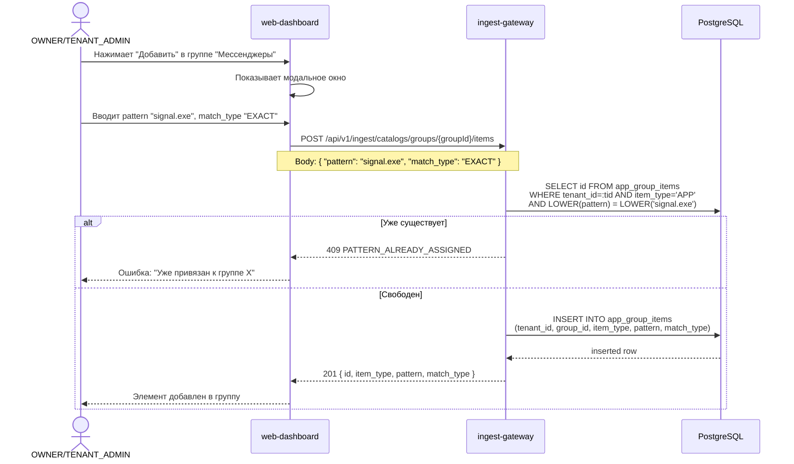
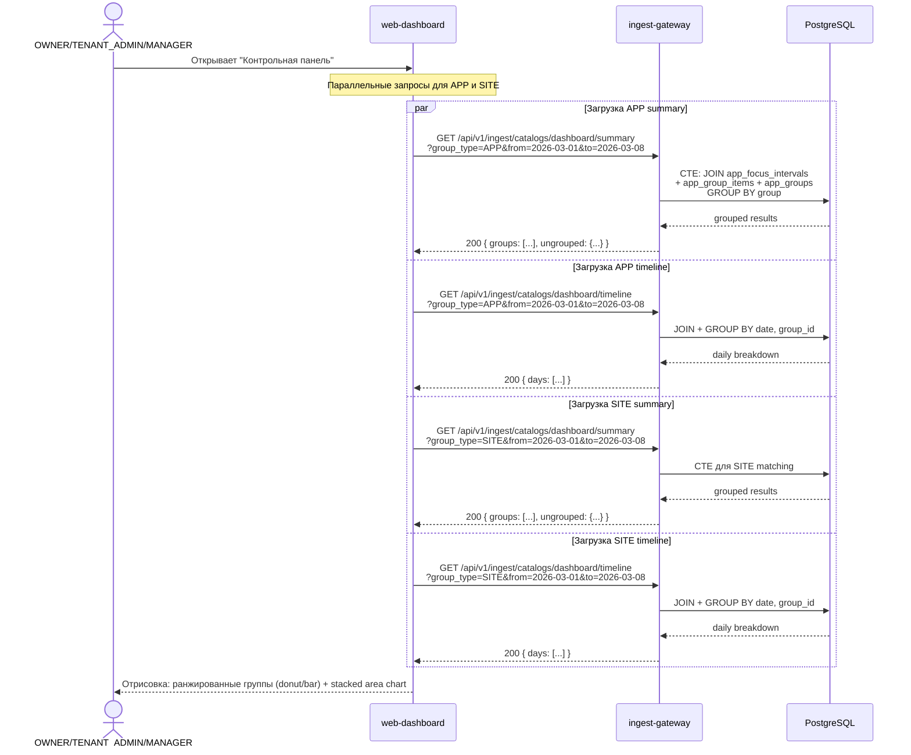
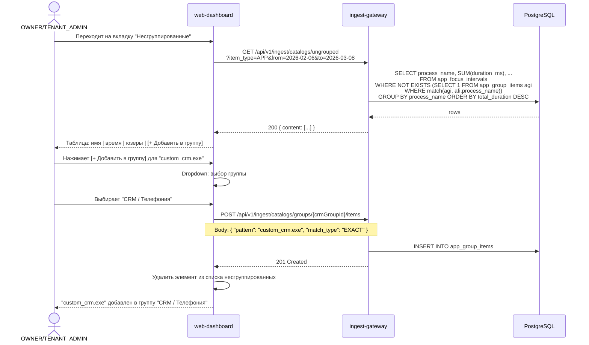

# Группировка приложений и сайтов + Контрольная панель

> **Версия:** 1.0  
> **Дата:** 2026-03-08  
> **Автор:** Системный аналитик  
> **Статус:** Draft  
> **Затронутые сервисы:** ingest-gateway, auth-service, web-dashboard  
> **Миграция:** V31 (ingest-gateway), V31 (auth-service)

---

## 1. Overview

### 1.1 Цель

Добавить справочники **групп приложений** и **групп сайтов** для категоризации данных из `app_focus_intervals`. Позволить OWNER и TENANT_ADMIN настраивать справочники, привязывать конкретные exe/домены к группам, задавать алиасы (человекочитаемые имена) для process_name. На основе справочников -- построить контрольную панель с визуализацией: ранжированные группы (%) и зональная гистограмма по дням.

### 1.2 Scope

- **В scope:** Справочники групп (CRUD), привязка exe/доменов, алиасы, seed data, контрольная панель (агрегация по всем пользователям тенанта), API, frontend
- **Вне scope:** Автоматическая классификация (ML), правила "продуктивности" (productive/unproductive), уведомления по категориям, изменение агента

### 1.3 Ключевые решения

| Решение | Обоснование |
|---------|-------------|
| Справочники в ingest-gateway, не в auth-service | Справочники напрямую связаны с данными `app_focus_intervals`, минимизируется межсервисное взаимодействие. Агрегационные запросы выполняются в одной БД. |
| Единая таблица `app_groups` с полем `group_type` (APP/SITE) | Упрощает JOIN при агрегации; groups таблица маленькая (десятки записей на тенант), нет выгоды от разделения. |
| Алиасы в отдельной таблице `app_aliases` | Алиас не привязан к группе -- exe/домен может иметь алиас, но не быть в группе. Независимые жизненные циклы. |
| Seed data через Flyway миграцию с tenant_id = NULL | Глобальные шаблоны (platform-level). При создании тенанта -- seed копируется в tenant scope. Либо при первом GET справочника -- default значения подставляются на лету. |
| Tenant-level seed при первом обращении | Не нужен отдельный процесс при создании тенанта. Когда OWNER/TENANT_ADMIN первый раз заходит в "Справочники", если нет записей для тенанта -- создаются default группы. |
| Permission `CATALOGS:READ` и `CATALOGS:MANAGE` | Новый ресурс, отделен от RECORDINGS. READ -- для просмотра и контрольной панели. MANAGE -- для CRUD групп/привязок/алиасов. |

---

## 2. Модель данных

### 2.1 Новые таблицы

#### 2.1.1 `app_groups` -- группы приложений и сайтов

```sql
CREATE TABLE app_groups (
    id          UUID        NOT NULL DEFAULT gen_random_uuid(),
    tenant_id   UUID        NOT NULL,
    group_type  VARCHAR(10) NOT NULL CHECK (group_type IN ('APP', 'SITE')),
    name        VARCHAR(100) NOT NULL,
    description VARCHAR(500),
    color       VARCHAR(7),        -- hex color for UI, e.g. "#3B82F6"
    sort_order  INTEGER     NOT NULL DEFAULT 0,
    is_default  BOOLEAN     NOT NULL DEFAULT false,  -- seed group, cannot be deleted
    created_at  TIMESTAMPTZ NOT NULL DEFAULT NOW(),
    updated_at  TIMESTAMPTZ NOT NULL DEFAULT NOW(),
    created_by  UUID,              -- user_id who created
    PRIMARY KEY (id)
);

-- Уникальность имени группы в рамках тенанта и типа
CREATE UNIQUE INDEX idx_ag_tenant_type_name
    ON app_groups (tenant_id, group_type, LOWER(name));

CREATE INDEX idx_ag_tenant_type
    ON app_groups (tenant_id, group_type, sort_order);
```

**Поля:**

| Поле | Тип | Constraints | Описание |
|------|-----|-------------|----------|
| `id` | UUID | PK, DEFAULT gen_random_uuid() | Уникальный идентификатор группы |
| `tenant_id` | UUID | NOT NULL | Тенант-владелец |
| `group_type` | VARCHAR(10) | NOT NULL, CHECK IN ('APP','SITE') | Тип: группа приложений или группа сайтов |
| `name` | VARCHAR(100) | NOT NULL, UNIQUE per tenant+type (case-insensitive) | Название группы ("Мессенджеры", "Разработка") |
| `description` | VARCHAR(500) | NULL | Описание группы |
| `color` | VARCHAR(7) | NULL | Цвет для UI (hex, "#3B82F6") |
| `sort_order` | INTEGER | NOT NULL DEFAULT 0 | Порядок сортировки |
| `is_default` | BOOLEAN | NOT NULL DEFAULT false | Seed-группа, нельзя удалить |
| `created_at` | TIMESTAMPTZ | NOT NULL DEFAULT NOW() | Дата создания |
| `updated_at` | TIMESTAMPTZ | NOT NULL DEFAULT NOW() | Дата обновления |
| `created_by` | UUID | NULL | ID пользователя-создателя |

#### 2.1.2 `app_group_items` -- привязка exe/доменов к группам

```sql
CREATE TABLE app_group_items (
    id              UUID        NOT NULL DEFAULT gen_random_uuid(),
    tenant_id       UUID        NOT NULL,
    group_id        UUID        NOT NULL REFERENCES app_groups(id) ON DELETE CASCADE,
    item_type       VARCHAR(10) NOT NULL CHECK (item_type IN ('APP', 'SITE')),
    pattern         VARCHAR(512) NOT NULL,  -- process_name for APP, domain for SITE
    match_type      VARCHAR(10) NOT NULL DEFAULT 'EXACT'
                    CHECK (match_type IN ('EXACT', 'SUFFIX', 'CONTAINS')),
    created_at      TIMESTAMPTZ NOT NULL DEFAULT NOW(),
    PRIMARY KEY (id)
);

-- Один exe/домен может быть только в одной группе в рамках тенанта
CREATE UNIQUE INDEX idx_agi_tenant_type_pattern
    ON app_group_items (tenant_id, item_type, LOWER(pattern));

CREATE INDEX idx_agi_group
    ON app_group_items (group_id);

CREATE INDEX idx_agi_tenant_type
    ON app_group_items (tenant_id, item_type);
```

**Поля:**

| Поле | Тип | Constraints | Описание |
|------|-----|-------------|----------|
| `id` | UUID | PK | Уникальный идентификатор привязки |
| `tenant_id` | UUID | NOT NULL | Тенант (денормализация для быстрых запросов) |
| `group_id` | UUID | NOT NULL, FK -> app_groups(id) ON DELETE CASCADE | Группа, к которой привязан элемент |
| `item_type` | VARCHAR(10) | NOT NULL, CHECK IN ('APP','SITE') | Тип: приложение или сайт |
| `pattern` | VARCHAR(512) | NOT NULL, UNIQUE per tenant+type (case-insensitive) | Паттерн: process_name для APP, domain для SITE |
| `match_type` | VARCHAR(10) | NOT NULL DEFAULT 'EXACT', CHECK IN ('EXACT','SUFFIX','CONTAINS') | Тип сопоставления. EXACT = точное совпадение. SUFFIX = по суффиксу домена (*.google.com). CONTAINS = подстрока. |
| `created_at` | TIMESTAMPTZ | NOT NULL DEFAULT NOW() | Дата создания |

**Примеры записей:**
- `item_type=APP, pattern="chrome.exe", match_type=EXACT` -- точное совпадение process_name
- `item_type=SITE, pattern="google.com", match_type=SUFFIX` -- все поддомены google.com (mail.google.com, docs.google.com)
- `item_type=APP, pattern="jetbrains", match_type=CONTAINS` -- все процессы содержащие "jetbrains"

#### 2.1.3 `app_aliases` -- алиасы для process_name и доменов

```sql
CREATE TABLE app_aliases (
    id          UUID        NOT NULL DEFAULT gen_random_uuid(),
    tenant_id   UUID        NOT NULL,
    alias_type  VARCHAR(10) NOT NULL CHECK (alias_type IN ('APP', 'SITE')),
    original    VARCHAR(512) NOT NULL,  -- process_name or domain
    display_name VARCHAR(200) NOT NULL, -- human-readable name
    icon_url    VARCHAR(1024),          -- optional icon URL
    created_at  TIMESTAMPTZ NOT NULL DEFAULT NOW(),
    updated_at  TIMESTAMPTZ NOT NULL DEFAULT NOW(),
    PRIMARY KEY (id)
);

-- Один оригинал может иметь только один алиас в рамках тенанта
CREATE UNIQUE INDEX idx_aa_tenant_type_original
    ON app_aliases (tenant_id, alias_type, LOWER(original));

CREATE INDEX idx_aa_tenant_type
    ON app_aliases (tenant_id, alias_type);
```

**Поля:**

| Поле | Тип | Constraints | Описание |
|------|-----|-------------|----------|
| `id` | UUID | PK | Уникальный идентификатор |
| `tenant_id` | UUID | NOT NULL | Тенант |
| `alias_type` | VARCHAR(10) | NOT NULL, CHECK IN ('APP','SITE') | Тип: приложение или сайт |
| `original` | VARCHAR(512) | NOT NULL, UNIQUE per tenant+type | Исходное имя (process_name или domain) |
| `display_name` | VARCHAR(200) | NOT NULL | Отображаемое имя |
| `icon_url` | VARCHAR(1024) | NULL | URL иконки (опционально, для будущего) |
| `created_at` | TIMESTAMPTZ | NOT NULL DEFAULT NOW() | Дата создания |
| `updated_at` | TIMESTAMPTZ | NOT NULL DEFAULT NOW() | Дата обновления |

**Примеры:**
- `alias_type=APP, original="chrome.exe", display_name="Google Chrome"`
- `alias_type=APP, original="browser.exe", display_name="Яндекс Браузер"`
- `alias_type=SITE, original="mail.google.com", display_name="Gmail"`

### 2.2 Flyway миграция V31 (ingest-gateway)

Файл: `ingest-gateway/src/main/resources/db/migration/V31__app_groups_and_aliases.sql`

```sql
-- V31__app_groups_and_aliases.sql
-- App Groups (categories), Group Items (exe/domain bindings), Aliases

-- 1. app_groups
CREATE TABLE app_groups (
    id          UUID        NOT NULL DEFAULT gen_random_uuid(),
    tenant_id   UUID        NOT NULL,
    group_type  VARCHAR(10) NOT NULL CHECK (group_type IN ('APP', 'SITE')),
    name        VARCHAR(100) NOT NULL,
    description VARCHAR(500),
    color       VARCHAR(7),
    sort_order  INTEGER     NOT NULL DEFAULT 0,
    is_default  BOOLEAN     NOT NULL DEFAULT false,
    created_at  TIMESTAMPTZ NOT NULL DEFAULT NOW(),
    updated_at  TIMESTAMPTZ NOT NULL DEFAULT NOW(),
    created_by  UUID,
    PRIMARY KEY (id)
);

CREATE UNIQUE INDEX idx_ag_tenant_type_name
    ON app_groups (tenant_id, group_type, LOWER(name));

CREATE INDEX idx_ag_tenant_type
    ON app_groups (tenant_id, group_type, sort_order);

-- 2. app_group_items
CREATE TABLE app_group_items (
    id              UUID        NOT NULL DEFAULT gen_random_uuid(),
    tenant_id       UUID        NOT NULL,
    group_id        UUID        NOT NULL REFERENCES app_groups(id) ON DELETE CASCADE,
    item_type       VARCHAR(10) NOT NULL CHECK (item_type IN ('APP', 'SITE')),
    pattern         VARCHAR(512) NOT NULL,
    match_type      VARCHAR(10) NOT NULL DEFAULT 'EXACT'
                    CHECK (match_type IN ('EXACT', 'SUFFIX', 'CONTAINS')),
    created_at      TIMESTAMPTZ NOT NULL DEFAULT NOW(),
    PRIMARY KEY (id)
);

CREATE UNIQUE INDEX idx_agi_tenant_type_pattern
    ON app_group_items (tenant_id, item_type, LOWER(pattern));

CREATE INDEX idx_agi_group
    ON app_group_items (group_id);

CREATE INDEX idx_agi_tenant_type
    ON app_group_items (tenant_id, item_type);

-- 3. app_aliases
CREATE TABLE app_aliases (
    id          UUID        NOT NULL DEFAULT gen_random_uuid(),
    tenant_id   UUID        NOT NULL,
    alias_type  VARCHAR(10) NOT NULL CHECK (alias_type IN ('APP', 'SITE')),
    original    VARCHAR(512) NOT NULL,
    display_name VARCHAR(200) NOT NULL,
    icon_url    VARCHAR(1024),
    created_at  TIMESTAMPTZ NOT NULL DEFAULT NOW(),
    updated_at  TIMESTAMPTZ NOT NULL DEFAULT NOW(),
    PRIMARY KEY (id)
);

CREATE UNIQUE INDEX idx_aa_tenant_type_original
    ON app_aliases (tenant_id, alias_type, LOWER(original));

CREATE INDEX idx_aa_tenant_type
    ON app_aliases (tenant_id, alias_type);
```

### 2.3 Flyway миграция V31 (auth-service)

Файл: `auth-service/src/main/resources/db/migration/V31__add_catalogs_permissions.sql`

```sql
-- V31__add_catalogs_permissions.sql
-- Add CATALOGS:READ and CATALOGS:MANAGE permissions

INSERT INTO permissions (id, code, name, resource, action, description)
VALUES
  (gen_random_uuid(), 'CATALOGS:READ', 'View Catalogs',
   'CATALOGS', 'READ', 'View app/site groups, aliases, and dashboard'),
  (gen_random_uuid(), 'CATALOGS:MANAGE', 'Manage Catalogs',
   'CATALOGS', 'MANAGE', 'Create, update, delete app/site groups and aliases')
ON CONFLICT (code) DO NOTHING;

-- Assign CATALOGS:READ to SUPER_ADMIN, OWNER, TENANT_ADMIN, MANAGER, SUPERVISOR
INSERT INTO role_permissions (role_id, permission_id)
SELECT r.id, p.id
FROM roles r
CROSS JOIN permissions p
WHERE r.code IN ('SUPER_ADMIN', 'OWNER', 'TENANT_ADMIN', 'MANAGER', 'SUPERVISOR')
  AND p.code = 'CATALOGS:READ'
ON CONFLICT DO NOTHING;

-- Assign CATALOGS:MANAGE to SUPER_ADMIN, OWNER, TENANT_ADMIN
INSERT INTO role_permissions (role_id, permission_id)
SELECT r.id, p.id
FROM roles r
CROSS JOIN permissions p
WHERE r.code IN ('SUPER_ADMIN', 'OWNER', 'TENANT_ADMIN')
  AND p.code = 'CATALOGS:MANAGE'
ON CONFLICT DO NOTHING;
```

### 2.4 ER-диаграмма (связи)

```
app_focus_intervals
    ├── process_name  ──── app_group_items.pattern (APP, match)
    ├── domain        ──── app_group_items.pattern (SITE, match)
    ├── process_name  ──── app_aliases.original (APP)
    └── domain        ──── app_aliases.original (SITE)

app_groups (1) ──< app_group_items (N)   [ON DELETE CASCADE]

Нет FK от app_group_items/app_aliases к app_focus_intervals.
Связь -- логическая, через JOIN по pattern/original.
```

---

## 3. Seed Data

### 3.1 Группы приложений (APP)

| Порядок | Название | Цвет | Описание |
|---------|----------|------|----------|
| 1 | Мессенджеры | #10B981 | Приложения для обмена сообщениями |
| 2 | Офисные приложения | #3B82F6 | Текстовые редакторы, таблицы, презентации |
| 3 | Браузеры | #F59E0B | Веб-браузеры |
| 4 | Разработка | #8B5CF6 | IDE, редакторы кода, терминалы |
| 5 | Системные | #6B7280 | Проводник, настройки, системные утилиты |
| 6 | Мультимедиа | #EF4444 | Видео, аудио, графика |
| 7 | CRM / Телефония | #0EA5E9 | CRM-системы, SIP-клиенты, контактный центр |
| 8 | Прочее | #9CA3AF | Несгруппированные приложения |

### 3.2 Привязка приложений (APP items)

| Группа | pattern | match_type |
|--------|---------|------------|
| **Мессенджеры** | telegram.exe | EXACT |
| | whatsapp.exe | EXACT |
| | slack.exe | EXACT |
| | teams.exe | EXACT |
| | ms-teams.exe | EXACT |
| | skype.exe | EXACT |
| | viber.exe | EXACT |
| | discord.exe | EXACT |
| **Офисные приложения** | winword.exe | EXACT |
| | excel.exe | EXACT |
| | powerpnt.exe | EXACT |
| | outlook.exe | EXACT |
| | onenote.exe | EXACT |
| | notepad.exe | EXACT |
| | wordpad.exe | EXACT |
| | acrord32.exe | EXACT |
| | acrobat.exe | EXACT |
| | 1cv8.exe | EXACT |
| | 1cv8c.exe | EXACT |
| **Браузеры** | chrome.exe | EXACT |
| | msedge.exe | EXACT |
| | firefox.exe | EXACT |
| | browser.exe | EXACT |
| | opera.exe | EXACT |
| | iexplore.exe | EXACT |
| | safari | EXACT |
| **Разработка** | code.exe | EXACT |
| | idea64.exe | EXACT |
| | devenv.exe | EXACT |
| | pycharm64.exe | EXACT |
| | webstorm64.exe | EXACT |
| | datagrip64.exe | EXACT |
| | rider64.exe | EXACT |
| | WindowsTerminal.exe | EXACT |
| | cmd.exe | EXACT |
| | powershell.exe | EXACT |
| | pwsh.exe | EXACT |
| | git-bash.exe | EXACT |
| | putty.exe | EXACT |
| | postman.exe | EXACT |
| | dbeaver.exe | EXACT |
| | jetbrains | CONTAINS |
| **Системные** | explorer.exe | EXACT |
| | taskmgr.exe | EXACT |
| | mmc.exe | EXACT |
| | control.exe | EXACT |
| | systemsettings.exe | EXACT |
| | regedit.exe | EXACT |
| | mstsc.exe | EXACT |
| | snippingtool.exe | EXACT |
| **Мультимедиа** | vlc.exe | EXACT |
| | wmplayer.exe | EXACT |
| | spotify.exe | EXACT |
| | mspaint.exe | EXACT |
| | photoshop.exe | EXACT |
| | illustrator.exe | EXACT |
| | figma.exe | EXACT |
| **CRM / Телефония** | crm | CONTAINS |
| | softphone | CONTAINS |
| | asterisk | CONTAINS |
| | zoiper.exe | EXACT |
| | xlite.exe | EXACT |
| | 3cxdesktopapp.exe | EXACT |

### 3.3 Группы сайтов (SITE)

| Порядок | Название | Цвет | Описание |
|---------|----------|------|----------|
| 1 | Почта | #3B82F6 | Почтовые сервисы |
| 2 | Поиск | #F59E0B | Поисковые системы |
| 3 | Мессенджеры | #10B981 | Веб-версии мессенджеров |
| 4 | Соцсети | #EC4899 | Социальные сети |
| 5 | Облачные хранилища | #8B5CF6 | Облачные сервисы и документы |
| 6 | Разработка | #6366F1 | Сервисы разработки |
| 7 | Видео / Развлечения | #EF4444 | Видео-хостинги, развлекательный контент |
| 8 | Новости | #F97316 | Новостные сайты |
| 9 | CRM / Бизнес | #0EA5E9 | CRM, бизнес-инструменты |
| 10 | Прочее | #9CA3AF | Несгруппированные сайты |

### 3.4 Привязка сайтов (SITE items)

| Группа | pattern | match_type |
|--------|---------|------------|
| **Почта** | mail.google.com | EXACT |
| | mail.yandex.ru | EXACT |
| | mail.ru | SUFFIX |
| | outlook.office365.com | EXACT |
| | outlook.office.com | EXACT |
| **Поиск** | google.com | EXACT |
| | google.ru | EXACT |
| | yandex.ru | EXACT |
| | ya.ru | EXACT |
| | bing.com | EXACT |
| | duckduckgo.com | EXACT |
| **Мессенджеры** | web.telegram.org | EXACT |
| | web.whatsapp.com | EXACT |
| | teams.microsoft.com | EXACT |
| | slack.com | SUFFIX |
| | discord.com | SUFFIX |
| **Соцсети** | vk.com | SUFFIX |
| | ok.ru | SUFFIX |
| | facebook.com | SUFFIX |
| | instagram.com | SUFFIX |
| | twitter.com | SUFFIX |
| | x.com | SUFFIX |
| | linkedin.com | SUFFIX |
| **Облачные хранилища** | drive.google.com | EXACT |
| | docs.google.com | EXACT |
| | sheets.google.com | EXACT |
| | disk.yandex.ru | EXACT |
| | onedrive.live.com | EXACT |
| | dropbox.com | SUFFIX |
| | notion.so | SUFFIX |
| **Разработка** | github.com | SUFFIX |
| | gitlab.com | SUFFIX |
| | stackoverflow.com | SUFFIX |
| | bitbucket.org | SUFFIX |
| | npmjs.com | SUFFIX |
| | hub.docker.com | EXACT |
| | jira | CONTAINS |
| | confluence | CONTAINS |
| **Видео / Развлечения** | youtube.com | SUFFIX |
| | rutube.ru | SUFFIX |
| | twitch.tv | SUFFIX |
| | netflix.com | SUFFIX |
| | kinopoisk.ru | SUFFIX |
| **Новости** | rbc.ru | SUFFIX |
| | lenta.ru | SUFFIX |
| | ria.ru | SUFFIX |
| | habr.com | SUFFIX |
| **CRM / Бизнес** | salesforce.com | SUFFIX |
| | bitrix24 | CONTAINS |
| | amocrm.ru | SUFFIX |
| | planfix.ru | SUFFIX |

### 3.5 Алиасы (seed)

| Тип | original | display_name |
|-----|----------|-------------|
| APP | chrome.exe | Google Chrome |
| APP | msedge.exe | Microsoft Edge |
| APP | firefox.exe | Mozilla Firefox |
| APP | browser.exe | Яндекс Браузер |
| APP | opera.exe | Opera |
| APP | telegram.exe | Telegram |
| APP | whatsapp.exe | WhatsApp |
| APP | slack.exe | Slack |
| APP | teams.exe | Microsoft Teams |
| APP | ms-teams.exe | Microsoft Teams |
| APP | skype.exe | Skype |
| APP | discord.exe | Discord |
| APP | viber.exe | Viber |
| APP | winword.exe | Microsoft Word |
| APP | excel.exe | Microsoft Excel |
| APP | powerpnt.exe | Microsoft PowerPoint |
| APP | outlook.exe | Microsoft Outlook |
| APP | onenote.exe | Microsoft OneNote |
| APP | notepad.exe | Блокнот |
| APP | code.exe | Visual Studio Code |
| APP | idea64.exe | IntelliJ IDEA |
| APP | devenv.exe | Visual Studio |
| APP | pycharm64.exe | PyCharm |
| APP | webstorm64.exe | WebStorm |
| APP | datagrip64.exe | DataGrip |
| APP | rider64.exe | JetBrains Rider |
| APP | explorer.exe | Проводник |
| APP | taskmgr.exe | Диспетчер задач |
| APP | mstsc.exe | Удаленный рабочий стол |
| APP | vlc.exe | VLC Media Player |
| APP | spotify.exe | Spotify |
| APP | figma.exe | Figma |
| APP | postman.exe | Postman |
| APP | dbeaver.exe | DBeaver |
| APP | 1cv8.exe | 1С:Предприятие |
| APP | 1cv8c.exe | 1С:Предприятие |
| APP | acrobat.exe | Adobe Acrobat |
| APP | photoshop.exe | Adobe Photoshop |
| APP | illustrator.exe | Adobe Illustrator |
| APP | zoiper.exe | Zoiper |
| APP | 3cxdesktopapp.exe | 3CX |
| SITE | mail.google.com | Gmail |
| SITE | mail.yandex.ru | Яндекс Почта |
| SITE | drive.google.com | Google Диск |
| SITE | docs.google.com | Google Документы |
| SITE | sheets.google.com | Google Таблицы |
| SITE | disk.yandex.ru | Яндекс Диск |
| SITE | web.telegram.org | Telegram Web |
| SITE | web.whatsapp.com | WhatsApp Web |
| SITE | teams.microsoft.com | Microsoft Teams |
| SITE | github.com | GitHub |
| SITE | gitlab.com | GitLab |
| SITE | stackoverflow.com | Stack Overflow |
| SITE | youtube.com | YouTube |
| SITE | habr.com | Хабр |
| SITE | bitrix24.ru | Битрикс24 |

### 3.6 Стратегия применения seed data

Seed data применяется **лениво** при первом обращении к справочникам тенанта:

1. При вызове `GET /api/v1/ingest/catalogs/groups?group_type=APP` -- если для данного `tenant_id` нет ни одной записи в `app_groups` с `group_type=APP` -- автоматически создать default группы + items + aliases для APP.
2. Аналогично для `group_type=SITE`.
3. Созданные записи помечаются `is_default=true`.
4. Пользователь может удалить всё кроме `is_default=true` групп (которые можно только переименовать).

Альтернатива: seed при первом вызове может быть слишком дорогой. Тогда seed вызывается явно через API `POST /api/v1/ingest/catalogs/seed` (только OWNER/TENANT_ADMIN). Frontend вызывает при первом визите на страницу Справочники (если groups пуст).

**Рекомендуемый подход:** Ленивый seed при первом GET. Если `app_groups` для тенанта пуст -- вставляем default и возвращаем результат. Одна транзакция, один запрос.

---

## 4. API Контракты

Все endpoints размещаются в **ingest-gateway** под префиксом `/api/v1/ingest/catalogs/`.

Nginx-маршрут: `/api/ingest/` -> `ingest-gateway:8084/api/` (уже настроен).
Полный путь из браузера: `/screenrecorder/api/ingest/v1/ingest/catalogs/...`

### 4.1 Группы -- CRUD

#### 4.1.1 GET /api/v1/ingest/catalogs/groups

Список групп для тенанта. При пустом справочнике -- автоматически создает seed.

**Query Parameters:**

| Параметр | Тип | Обязат. | Default | Описание |
|----------|-----|---------|---------|----------|
| `group_type` | string | Да | - | `APP` или `SITE` |
| `tenant_id` | UUID | Нет | JWT tenant_id | Для SUPER_ADMIN с scope=global |

**Response 200:**

```json
{
  "groups": [
    {
      "id": "uuid",
      "group_type": "APP",
      "name": "Мессенджеры",
      "description": "Приложения для обмена сообщениями",
      "color": "#10B981",
      "sort_order": 1,
      "is_default": true,
      "item_count": 7,
      "created_at": "2026-03-08T12:00:00Z",
      "updated_at": "2026-03-08T12:00:00Z"
    }
  ],
  "total": 8
}
```

**Permissions:** `CATALOGS:READ`

#### 4.1.2 POST /api/v1/ingest/catalogs/groups

Создание новой группы.

**Request Body:**

```json
{
  "group_type": "APP",
  "name": "VPN-клиенты",
  "description": "Приложения VPN",
  "color": "#059669",
  "sort_order": 9
}
```

**Validation:**
- `group_type` -- обязателен, IN ('APP', 'SITE')
- `name` -- обязателен, 1-100 символов, уникален в рамках tenant_id + group_type (case-insensitive)
- `description` -- опционален, max 500
- `color` -- опционален, regexp `^#[0-9A-Fa-f]{6}$`
- `sort_order` -- опционален, default 0

**Response 201:**

```json
{
  "id": "uuid",
  "group_type": "APP",
  "name": "VPN-клиенты",
  "description": "Приложения VPN",
  "color": "#059669",
  "sort_order": 9,
  "is_default": false,
  "item_count": 0,
  "created_at": "2026-03-08T12:00:00Z",
  "updated_at": "2026-03-08T12:00:00Z"
}
```

**Error 409:**

```json
{
  "error": "Group with name 'VPN-клиенты' already exists for this tenant and type",
  "code": "GROUP_NAME_DUPLICATE"
}
```

**Permissions:** `CATALOGS:MANAGE`

#### 4.1.3 PUT /api/v1/ingest/catalogs/groups/{groupId}

Обновление группы. Для `is_default=true` -- можно менять только name, description, color, sort_order.

**Request Body:**

```json
{
  "name": "Мессенджеры и чаты",
  "description": "Обновленное описание",
  "color": "#059669",
  "sort_order": 1
}
```

**Response 200:** Обновленный объект группы (аналогично POST).

**Error 404:** `{ "error": "Group not found", "code": "GROUP_NOT_FOUND" }`

**Permissions:** `CATALOGS:MANAGE`

#### 4.1.4 DELETE /api/v1/ingest/catalogs/groups/{groupId}

Удаление группы. Каскадно удаляет все `app_group_items` этой группы.

**Constraints:**
- Нельзя удалить группу с `is_default=true` (400, `DEFAULT_GROUP_UNDELETABLE`)

**Response 204:** No Content

**Error 400:**
```json
{
  "error": "Cannot delete default group",
  "code": "DEFAULT_GROUP_UNDELETABLE"
}
```

**Permissions:** `CATALOGS:MANAGE`

### 4.2 Привязка элементов к группам

#### 4.2.1 GET /api/v1/ingest/catalogs/groups/{groupId}/items

Список элементов (exe/доменов) привязанных к группе.

**Response 200:**

```json
{
  "items": [
    {
      "id": "uuid",
      "item_type": "APP",
      "pattern": "telegram.exe",
      "match_type": "EXACT",
      "display_name": "Telegram",
      "created_at": "2026-03-08T12:00:00Z"
    }
  ],
  "total": 7
}
```

Поле `display_name` подтягивается из `app_aliases` через LEFT JOIN.

**Permissions:** `CATALOGS:READ`

#### 4.2.2 POST /api/v1/ingest/catalogs/groups/{groupId}/items

Добавление элемента в группу.

**Request Body:**

```json
{
  "pattern": "viber.exe",
  "match_type": "EXACT"
}
```

**Validation:**
- `pattern` -- обязателен, 1-512 символов
- `match_type` -- опционален, default EXACT, IN ('EXACT', 'SUFFIX', 'CONTAINS')
- Проверка уникальности: pattern не должен быть уже привязан к другой группе в рамках tenant+type

**Response 201:**

```json
{
  "id": "uuid",
  "item_type": "APP",
  "pattern": "viber.exe",
  "match_type": "EXACT",
  "created_at": "2026-03-08T12:00:00Z"
}
```

**Error 409:**

```json
{
  "error": "Pattern 'viber.exe' is already assigned to group 'Мессенджеры'",
  "code": "PATTERN_ALREADY_ASSIGNED"
}
```

**Permissions:** `CATALOGS:MANAGE`

#### 4.2.3 POST /api/v1/ingest/catalogs/groups/{groupId}/items/batch

Пакетное добавление нескольких элементов.

**Request Body:**

```json
{
  "items": [
    { "pattern": "app1.exe", "match_type": "EXACT" },
    { "pattern": "app2.exe", "match_type": "EXACT" }
  ]
}
```

**Response 201:**

```json
{
  "created": 2,
  "skipped": 0,
  "items": [ ... ]
}
```

**Permissions:** `CATALOGS:MANAGE`

#### 4.2.4 DELETE /api/v1/ingest/catalogs/items/{itemId}

Удаление привязки элемента из группы.

**Response 204:** No Content

**Permissions:** `CATALOGS:MANAGE`

#### 4.2.5 PUT /api/v1/ingest/catalogs/items/{itemId}/move

Перемещение элемента в другую группу.

**Request Body:**

```json
{
  "target_group_id": "uuid"
}
```

**Validation:**
- `target_group_id` -- обязателен, должен существовать, должен быть того же типа (APP/SITE)

**Response 200:** Обновленный item с новым group_id.

**Permissions:** `CATALOGS:MANAGE`

### 4.3 Алиасы

#### 4.3.1 GET /api/v1/ingest/catalogs/aliases

Список алиасов для тенанта.

**Query Parameters:**

| Параметр | Тип | Обязат. | Default | Описание |
|----------|-----|---------|---------|----------|
| `alias_type` | string | Да | - | `APP` или `SITE` |
| `page` | int | Нет | 0 | Страница |
| `size` | int | Нет | 50 | Размер страницы (max 200) |
| `search` | string | Нет | - | Поиск по original или display_name (ILIKE) |
| `tenant_id` | UUID | Нет | JWT tenant_id | Для SUPER_ADMIN |

**Response 200:**

```json
{
  "content": [
    {
      "id": "uuid",
      "alias_type": "APP",
      "original": "chrome.exe",
      "display_name": "Google Chrome",
      "icon_url": null,
      "created_at": "2026-03-08T12:00:00Z",
      "updated_at": "2026-03-08T12:00:00Z"
    }
  ],
  "page": 0,
  "size": 50,
  "total_elements": 42,
  "total_pages": 1
}
```

**Permissions:** `CATALOGS:READ`

#### 4.3.2 POST /api/v1/ingest/catalogs/aliases

Создание алиаса.

**Request Body:**

```json
{
  "alias_type": "APP",
  "original": "custom_app.exe",
  "display_name": "Мое приложение"
}
```

**Response 201:** Созданный объект алиаса.

**Error 409:** `{ "error": "Alias for 'custom_app.exe' already exists", "code": "ALIAS_DUPLICATE" }`

**Permissions:** `CATALOGS:MANAGE`

#### 4.3.3 PUT /api/v1/ingest/catalogs/aliases/{aliasId}

Обновление алиаса (display_name, icon_url).

**Request Body:**

```json
{
  "display_name": "Обновленное имя",
  "icon_url": null
}
```

**Response 200:** Обновленный объект.

**Permissions:** `CATALOGS:MANAGE`

#### 4.3.4 DELETE /api/v1/ingest/catalogs/aliases/{aliasId}

Удаление алиаса.

**Response 204:** No Content

**Permissions:** `CATALOGS:MANAGE`

### 4.4 Несгруппированные элементы

#### 4.4.1 GET /api/v1/ingest/catalogs/ungrouped

Список уникальных process_name или доменов из `app_focus_intervals`, которые **не привязаны** ни к одной группе.

**Query Parameters:**

| Параметр | Тип | Обязат. | Default | Описание |
|----------|-----|---------|---------|----------|
| `item_type` | string | Да | - | `APP` или `SITE` |
| `from` | string (date) | Нет | 30 дней назад | Начало периода (YYYY-MM-DD) |
| `to` | string (date) | Нет | сегодня | Конец периода (YYYY-MM-DD) |
| `page` | int | Нет | 0 | Страница |
| `size` | int | Нет | 50 | Размер страницы |
| `search` | string | Нет | - | Фильтр по имени (ILIKE) |
| `tenant_id` | UUID | Нет | JWT tenant_id | Для SUPER_ADMIN |

**Response 200:**

```json
{
  "content": [
    {
      "name": "unknown_app.exe",
      "display_name": null,
      "total_duration_ms": 3600000,
      "interval_count": 42,
      "user_count": 3,
      "last_seen_at": "2026-03-08T15:30:00Z"
    }
  ],
  "page": 0,
  "size": 50,
  "total_elements": 12,
  "total_pages": 1,
  "total_ungrouped_duration_ms": 7200000
}
```

**SQL-логика для APP:**

```sql
SELECT afi.process_name AS name,
       aa.display_name,
       SUM(afi.duration_ms) AS total_duration_ms,
       COUNT(*) AS interval_count,
       COUNT(DISTINCT afi.username) AS user_count,
       MAX(afi.started_at) AS last_seen_at
FROM app_focus_intervals afi
LEFT JOIN app_aliases aa
    ON aa.tenant_id = afi.tenant_id
    AND aa.alias_type = 'APP'
    AND LOWER(aa.original) = LOWER(afi.process_name)
WHERE afi.tenant_id = :tenantId
  AND afi.started_at >= :from
  AND afi.started_at < :to + INTERVAL '1 day'
  AND NOT EXISTS (
      SELECT 1 FROM app_group_items agi
      WHERE agi.tenant_id = afi.tenant_id
        AND agi.item_type = 'APP'
        AND (
            (agi.match_type = 'EXACT' AND LOWER(agi.pattern) = LOWER(afi.process_name))
            OR (agi.match_type = 'CONTAINS' AND LOWER(afi.process_name) LIKE '%' || LOWER(agi.pattern) || '%')
        )
  )
GROUP BY afi.process_name, aa.display_name
ORDER BY total_duration_ms DESC
LIMIT :size OFFSET :page * :size
```

**Для SITE:**

```sql
SELECT afi.domain AS name,
       aa.display_name,
       SUM(afi.duration_ms) AS total_duration_ms,
       COUNT(*) AS interval_count,
       COUNT(DISTINCT afi.username) AS user_count,
       MAX(afi.started_at) AS last_seen_at
FROM app_focus_intervals afi
LEFT JOIN app_aliases aa
    ON aa.tenant_id = afi.tenant_id
    AND aa.alias_type = 'SITE'
    AND LOWER(aa.original) = LOWER(afi.domain)
WHERE afi.tenant_id = :tenantId
  AND afi.is_browser = true
  AND afi.domain IS NOT NULL
  AND afi.started_at >= :from
  AND afi.started_at < :to + INTERVAL '1 day'
  AND NOT EXISTS (
      SELECT 1 FROM app_group_items agi
      WHERE agi.tenant_id = afi.tenant_id
        AND agi.item_type = 'SITE'
        AND (
            (agi.match_type = 'EXACT' AND LOWER(agi.pattern) = LOWER(afi.domain))
            OR (agi.match_type = 'SUFFIX' AND (LOWER(afi.domain) = LOWER(agi.pattern) OR LOWER(afi.domain) LIKE '%.' || LOWER(agi.pattern)))
            OR (agi.match_type = 'CONTAINS' AND LOWER(afi.domain) LIKE '%' || LOWER(agi.pattern) || '%')
        )
  )
GROUP BY afi.domain, aa.display_name
ORDER BY total_duration_ms DESC
LIMIT :size OFFSET :page * :size
```

**Permissions:** `CATALOGS:READ`

### 4.5 Контрольная панель -- агрегации

#### 4.5.1 GET /api/v1/ingest/catalogs/dashboard/summary

Агрегация времени по группам за период. Для всех пользователей тенанта.

**Query Parameters:**

| Параметр | Тип | Обязат. | Default | Описание |
|----------|-----|---------|---------|----------|
| `group_type` | string | Да | - | `APP` или `SITE` |
| `from` | string (date) | Да | - | Начало (YYYY-MM-DD) |
| `to` | string (date) | Да | - | Конец (YYYY-MM-DD) |
| `tenant_id` | UUID | Нет | JWT tenant_id | Для SUPER_ADMIN |

**Response 200:**

```json
{
  "group_type": "APP",
  "period": { "from": "2026-03-01", "to": "2026-03-08" },
  "total_duration_ms": 86400000,
  "total_users": 15,
  "total_devices": 20,
  "groups": [
    {
      "group_id": "uuid",
      "group_name": "Браузеры",
      "color": "#F59E0B",
      "total_duration_ms": 36000000,
      "percentage": 41.67,
      "interval_count": 1200,
      "user_count": 15
    },
    {
      "group_id": "uuid",
      "group_name": "Офисные приложения",
      "color": "#3B82F6",
      "total_duration_ms": 21600000,
      "percentage": 25.0,
      "interval_count": 800,
      "user_count": 12
    }
  ],
  "ungrouped": {
    "total_duration_ms": 5400000,
    "percentage": 6.25,
    "interval_count": 150,
    "unique_items": 8
  }
}
```

**SQL-логика (APP):**

```sql
WITH grouped AS (
    SELECT ag.id AS group_id,
           ag.name AS group_name,
           ag.color,
           ag.sort_order,
           SUM(afi.duration_ms) AS total_duration_ms,
           COUNT(*) AS interval_count,
           COUNT(DISTINCT afi.username) AS user_count
    FROM app_focus_intervals afi
    JOIN app_group_items agi ON agi.tenant_id = afi.tenant_id
        AND agi.item_type = 'APP'
        AND (
            (agi.match_type = 'EXACT' AND LOWER(agi.pattern) = LOWER(afi.process_name))
            OR (agi.match_type = 'CONTAINS' AND LOWER(afi.process_name) LIKE '%' || LOWER(agi.pattern) || '%')
        )
    JOIN app_groups ag ON ag.id = agi.group_id
    WHERE afi.tenant_id = :tenantId
      AND afi.started_at >= CAST(:from AS date)
      AND afi.started_at < CAST(:to AS date) + INTERVAL '1 day'
    GROUP BY ag.id, ag.name, ag.color, ag.sort_order
)
SELECT * FROM grouped ORDER BY total_duration_ms DESC;
```

**Permissions:** `CATALOGS:READ`

#### 4.5.2 GET /api/v1/ingest/catalogs/dashboard/timeline

Зональная гистограмма -- разбивка времени по группам по дням.

**Query Parameters:**

| Параметр | Тип | Обязат. | Default | Описание |
|----------|-----|---------|---------|----------|
| `group_type` | string | Да | - | `APP` или `SITE` |
| `from` | string (date) | Да | - | Начало (YYYY-MM-DD) |
| `to` | string (date) | Да | - | Конец (YYYY-MM-DD) |
| `timezone` | string | Нет | Europe/Moscow | Таймзона |
| `tenant_id` | UUID | Нет | JWT tenant_id | Для SUPER_ADMIN |

**Response 200:**

```json
{
  "group_type": "APP",
  "period": { "from": "2026-03-01", "to": "2026-03-08" },
  "groups": [
    {
      "group_id": "uuid",
      "group_name": "Браузеры",
      "color": "#F59E0B"
    },
    {
      "group_id": "uuid",
      "group_name": "Офисные приложения",
      "color": "#3B82F6"
    }
  ],
  "days": [
    {
      "date": "2026-03-01",
      "weekday": "sat",
      "total_duration_ms": 0,
      "breakdown": [
        { "group_id": "uuid", "duration_ms": 0, "percentage": 0 },
        { "group_id": "uuid", "duration_ms": 0, "percentage": 0 }
      ],
      "ungrouped_duration_ms": 0
    },
    {
      "date": "2026-03-03",
      "weekday": "mon",
      "total_duration_ms": 28800000,
      "breakdown": [
        { "group_id": "uuid", "duration_ms": 14400000, "percentage": 50.0 },
        { "group_id": "uuid", "duration_ms": 7200000, "percentage": 25.0 }
      ],
      "ungrouped_duration_ms": 1800000
    }
  ]
}
```

**SQL-логика:**

```sql
SELECT DATE(afi.started_at AT TIME ZONE :tz) AS d,
       ag.id AS group_id,
       SUM(afi.duration_ms) AS duration_ms
FROM app_focus_intervals afi
JOIN app_group_items agi ON agi.tenant_id = afi.tenant_id
    AND agi.item_type = 'APP'
    AND (
        (agi.match_type = 'EXACT' AND LOWER(agi.pattern) = LOWER(afi.process_name))
        OR (agi.match_type = 'CONTAINS' AND LOWER(afi.process_name) LIKE '%' || LOWER(agi.pattern) || '%')
    )
JOIN app_groups ag ON ag.id = agi.group_id
WHERE afi.tenant_id = :tenantId
  AND afi.started_at >= CAST(:from AS date) AT TIME ZONE :tz
  AND afi.started_at < (CAST(:to AS date) + INTERVAL '1 day') AT TIME ZONE :tz
GROUP BY d, ag.id
ORDER BY d, ag.id;
```

**Permissions:** `CATALOGS:READ`

#### 4.5.3 GET /api/v1/ingest/catalogs/dashboard/top-items

Топ элементов внутри конкретной группы.

**Query Parameters:**

| Параметр | Тип | Обязат. | Default | Описание |
|----------|-----|---------|---------|----------|
| `group_id` | UUID | Да | - | ID группы |
| `from` | string (date) | Да | - | Начало |
| `to` | string (date) | Да | - | Конец |
| `limit` | int | Нет | 10 | Максимум элементов |
| `tenant_id` | UUID | Нет | JWT tenant_id | Для SUPER_ADMIN |

**Response 200:**

```json
{
  "group_id": "uuid",
  "group_name": "Браузеры",
  "period": { "from": "2026-03-01", "to": "2026-03-08" },
  "total_group_duration_ms": 36000000,
  "items": [
    {
      "name": "chrome.exe",
      "display_name": "Google Chrome",
      "total_duration_ms": 18000000,
      "percentage": 50.0,
      "interval_count": 500,
      "user_count": 14
    },
    {
      "name": "browser.exe",
      "display_name": "Яндекс Браузер",
      "total_duration_ms": 10800000,
      "percentage": 30.0,
      "interval_count": 350,
      "user_count": 8
    }
  ]
}
```

**Permissions:** `CATALOGS:READ`

### 4.6 Seed endpoint

#### 4.6.1 POST /api/v1/ingest/catalogs/seed

Явное создание seed данных для тенанта. Вызывается если хочется пересоздать defaults.

**Query Parameters:**

| Параметр | Тип | Обязат. | Default | Описание |
|----------|-----|---------|---------|----------|
| `group_type` | string | Нет | - | Если указан -- seed только для этого типа. Иначе -- оба. |
| `force` | boolean | Нет | false | Если true -- пересоздать даже если группы уже существуют (удалит только `is_default=true` и пересоздаст) |

**Response 200:**

```json
{
  "created_groups": 8,
  "created_items": 45,
  "created_aliases": 42,
  "message": "Seed data created for APP and SITE groups"
}
```

**Permissions:** `CATALOGS:MANAGE`

---

## 5. Permissions

### 5.1 Новые permissions

| Code | Name | Resource | Action | Описание |
|------|------|----------|--------|----------|
| `CATALOGS:READ` | View Catalogs | CATALOGS | READ | Просмотр справочников, алиасов, данных контрольной панели |
| `CATALOGS:MANAGE` | Manage Catalogs | CATALOGS | MANAGE | Создание, изменение, удаление групп, привязок, алиасов |

### 5.2 Распределение по ролям

| Роль | CATALOGS:READ | CATALOGS:MANAGE |
|------|:---:|:---:|
| SUPER_ADMIN | + | + |
| OWNER | + | + |
| TENANT_ADMIN | + | + |
| MANAGER | + | - |
| SUPERVISOR | + | - |
| OPERATOR | - | - |
| VIEWER | - | - |

### 5.3 Scope-правила

- Пользователь с scope `tenant` видит справочники только своего тенанта (JWT `tenant_id`).
- Пользователь с scope `global` (SUPER_ADMIN) может передать `tenant_id` параметром для просмотра/управления справочниками любого тенанта.
- OWNER видит данные контрольной панели по своему тенанту. Если OWNER управляет несколькими тенантами, frontend позволяет переключать tenant через TenantSwitcher (уже реализован).

---

## 6. Sequence Diagrams

### 6.1 Загрузка страницы "Справочники -- Группы приложений"

```mermaid
sequenceDiagram
    actor User as OWNER/TENANT_ADMIN
    participant SPA as web-dashboard
    participant IG as ingest-gateway
    participant DB as PostgreSQL

    User->>SPA: Открывает Настройки > Справочники > Группы приложений
    SPA->>IG: GET /api/v1/ingest/catalogs/groups?group_type=APP
    Note over SPA,IG: Authorization: Bearer <JWT><br/>Permission: CATALOGS:READ

    IG->>DB: SELECT COUNT(*) FROM app_groups<br/>WHERE tenant_id=:tid AND group_type='APP'
    alt Первый визит (count = 0)
        IG->>DB: BEGIN; INSERT INTO app_groups (seed);<br/>INSERT INTO app_group_items (seed);<br/>INSERT INTO app_aliases (seed); COMMIT;
    end
    IG->>DB: SELECT ag.*, COUNT(agi.id) AS item_count<br/>FROM app_groups ag LEFT JOIN app_group_items agi...<br/>WHERE ag.tenant_id=:tid AND ag.group_type='APP'<br/>GROUP BY ag.id ORDER BY ag.sort_order
    DB-->>IG: rows
    IG-->>SPA: 200 { groups: [...], total: 8 }
    SPA-->>User: Отрисовка таблицы групп
```

### 6.2 Добавление exe в группу



### 6.3 Загрузка контрольной панели



### 6.4 Просмотр несгруппированных и добавление в группу



---

## 7. Frontend

### 7.1 Новые страницы

| Страница | Route | Компонент | Permission |
|----------|-------|-----------|------------|
| Группы приложений | `/catalogs/apps` | `AppGroupsPage` | CATALOGS:READ |
| Группы сайтов | `/catalogs/sites` | `SiteGroupsPage` | CATALOGS:READ |
| Контрольная панель | `/` (DashboardPage) | `DashboardPage` (обновить) | CATALOGS:READ |

### 7.2 Изменения в Sidebar

Добавить подпункт "Справочники" в секцию "Настройки":

```
Настройки
  ├── Устройства
  ├── Пользователи
  ├── Токены
  ├── Настройки записи
  └── Справочники          <-- НОВОЕ
      ├── Группы приложений
      └── Группы сайтов
```

Либо (без вложенности, проще):

```
Настройки
  ├── Устройства
  ├── Пользователи
  ├── Токены
  ├── Настройки записи
  ├── Группы приложений     <-- НОВОЕ
  └── Группы сайтов         <-- НОВОЕ
```

**Рекомендация:** Без дополнительной вложенности (второй вариант), так как текущий sidebar уже имеет 2 уровня вложенности. Permission: `CATALOGS:READ`.

**Изменения в `Sidebar.tsx`:**

В `tenantSettingsSubmenu` добавить:
```typescript
{ name: 'Группы приложений', href: '/catalogs/apps', icon: RectangleGroupIcon, permission: 'CATALOGS:READ' },
{ name: 'Группы сайтов', href: '/catalogs/sites', icon: GlobeAltIcon, permission: 'CATALOGS:READ' },
```

В `superAdminSettingsSubmenu` добавить аналогичные пункты.

В `isSettingsActive` -- добавить `location.pathname.startsWith('/catalogs')`.

### 7.3 Страница "Группы приложений" (AppGroupsPage)

**Layout:**

```
+----------------------------------------------------------------+
| Группы приложений                          [+ Новая группа]     |
+----------------------------------------------------------------+
| Tab: [Группы] [Несгруппированные (12)]                         |
+----------------------------------------------------------------+

Tab "Группы":
+----------------------------------------------------------------+
| #  Цвет  Название              Описание         Элементов  ... |
|----------------------------------------------------------------|
| 1  ●     Мессенджеры           Сообщения            7      [v] |
|    expanded: telegram.exe, whatsapp.exe, slack.exe, ...         |
|    [+ Добавить элемент]                                        |
|----------------------------------------------------------------|
| 2  ●     Офисные приложения    MS Office            8      [v] |
|----------------------------------------------------------------|
| ...                                                            |
+----------------------------------------------------------------+

Tab "Несгруппированные":
+----------------------------------------------------------------+
| Поиск: [___________]                                           |
|----------------------------------------------------------------|
| Имя приложения        Время        Юзеров  Действие            |
|----------------------------------------------------------------|
| custom_crm.exe        12ч 30м      5       [+ В группу ▾]     |
| internal_tool.exe     8ч 15м       3       [+ В группу ▾]     |
| my_app.exe            2ч 00м       1       [+ В группу ▾]     |
+----------------------------------------------------------------+
```

**Компоненты:**

1. `AppGroupsPage` / `SiteGroupsPage` -- основная страница, tabs
2. `GroupTable` -- таблица групп с expandable rows
3. `GroupItemsList` -- список элементов внутри группы (expandable)
4. `AddItemModal` -- модальное окно добавления элемента (pattern + match_type)
5. `CreateGroupModal` -- модальное окно создания группы
6. `EditGroupModal` -- редактирование группы
7. `UngroupedTable` -- таблица несгруппированных элементов
8. `AssignGroupDropdown` -- dropdown для быстрого назначения группы

### 7.4 Контрольная панель (DashboardPage)

**Layout:**

```
+----------------------------------------------------------------+
| Контрольная панель                                              |
| Период: [2026-03-01] — [2026-03-08]                            |
+----------------------------------------------------------------+
|                                                                |
| [Tab: Приложения] [Tab: Сайты]                                 |
|                                                                |
| +---------------------------+ +------------------------------+ |
| | Распределение по группам  | | Зональная гистограмма по дням| |
| |                           | |                              | |
| | ████ Браузеры     41.7%   | |  ▓▓▓▓▓▓▓▓▓▓▓▓▓▓▓▓▓▓▓▓▓▓▓▓ | |
| | ████ Офис         25.0%   | |  ▓▓▓▓▓▓▓▓▓▓▓▓▓▓▓▓▓▓▓▓▓▓▓▓ | |
| | ████ Мессенджеры  15.0%   | |  01  02  03  04  05  06  07  | |
| | ████ Разработка    8.3%   | |                              | |
| | ████ Прочее        6.25%  | |  Stacked area chart          | |
| | ████ Несгруппир.   3.75%  | |  Каждая зона = группа        | |
| |                           | |  Цвет = group.color          | |
| +---------------------------+ +------------------------------+ |
|                                                                |
| Несгруппировано: 8 элементов, 3.75% времени                   |
| [Настроить справочники →]                                      |
+----------------------------------------------------------------+
```

**Компоненты:**

1. `DashboardSummary` -- горизонтальный bar chart или donut chart с % по группам
2. `DashboardTimeline` -- stacked area chart (recharts / chart.js) по дням
3. `UngroupedBanner` -- предупреждение о несгруппированных элементах со ссылкой на справочники

**Библиотека графиков:** Использовать recharts (если уже в проекте) или chart.js.

### 7.5 App.tsx -- новые routes

```typescript
{/* Catalogs */}
<Route
  path="/catalogs/apps"
  element={
    <ProtectedRoute permission="CATALOGS:READ">
      <AppGroupsPage />
    </ProtectedRoute>
  }
/>
<Route
  path="/catalogs/sites"
  element={
    <ProtectedRoute permission="CATALOGS:READ">
      <SiteGroupsPage />
    </ProtectedRoute>
  }
/>
```

### 7.6 API Client (axios)

Новый файл: `web-dashboard/src/api/catalogs.ts`

```typescript
import api from './axios';

// Groups
export const getGroups = (groupType: 'APP' | 'SITE') =>
  api.get('/api/ingest/v1/ingest/catalogs/groups', { params: { group_type: groupType } });

export const createGroup = (data: CreateGroupRequest) =>
  api.post('/api/ingest/v1/ingest/catalogs/groups', data);

export const updateGroup = (groupId: string, data: UpdateGroupRequest) =>
  api.put(`/api/ingest/v1/ingest/catalogs/groups/${groupId}`, data);

export const deleteGroup = (groupId: string) =>
  api.delete(`/api/ingest/v1/ingest/catalogs/groups/${groupId}`);

// Items
export const getGroupItems = (groupId: string) =>
  api.get(`/api/ingest/v1/ingest/catalogs/groups/${groupId}/items`);

export const addGroupItem = (groupId: string, data: AddItemRequest) =>
  api.post(`/api/ingest/v1/ingest/catalogs/groups/${groupId}/items`, data);

export const deleteGroupItem = (itemId: string) =>
  api.delete(`/api/ingest/v1/ingest/catalogs/items/${itemId}`);

export const moveGroupItem = (itemId: string, targetGroupId: string) =>
  api.put(`/api/ingest/v1/ingest/catalogs/items/${itemId}/move`, { target_group_id: targetGroupId });

// Aliases
export const getAliases = (aliasType: 'APP' | 'SITE', params?: AliasQueryParams) =>
  api.get('/api/ingest/v1/ingest/catalogs/aliases', { params: { alias_type: aliasType, ...params } });

export const createAlias = (data: CreateAliasRequest) =>
  api.post('/api/ingest/v1/ingest/catalogs/aliases', data);

export const updateAlias = (aliasId: string, data: UpdateAliasRequest) =>
  api.put(`/api/ingest/v1/ingest/catalogs/aliases/${aliasId}`, data);

export const deleteAlias = (aliasId: string) =>
  api.delete(`/api/ingest/v1/ingest/catalogs/aliases/${aliasId}`);

// Ungrouped
export const getUngrouped = (itemType: 'APP' | 'SITE', params?: UngroupedQueryParams) =>
  api.get('/api/ingest/v1/ingest/catalogs/ungrouped', { params: { item_type: itemType, ...params } });

// Dashboard
export const getDashboardSummary = (groupType: 'APP' | 'SITE', from: string, to: string) =>
  api.get('/api/ingest/v1/ingest/catalogs/dashboard/summary', { params: { group_type: groupType, from, to } });

export const getDashboardTimeline = (groupType: 'APP' | 'SITE', from: string, to: string, timezone?: string) =>
  api.get('/api/ingest/v1/ingest/catalogs/dashboard/timeline', { params: { group_type: groupType, from, to, timezone } });

export const getDashboardTopItems = (groupId: string, from: string, to: string, limit?: number) =>
  api.get('/api/ingest/v1/ingest/catalogs/dashboard/top-items', { params: { group_id: groupId, from, to, limit } });

// Seed
export const seedCatalogs = (groupType?: 'APP' | 'SITE', force?: boolean) =>
  api.post('/api/ingest/v1/ingest/catalogs/seed', null, { params: { group_type: groupType, force } });
```

---

## 8. Изменения в существующем коде

### 8.1 ingest-gateway

| Файл / Компонент | Изменение |
|-------------------|-----------|
| Новый: `entity/AppGroup.java` | JPA entity для `app_groups` |
| Новый: `entity/AppGroupItem.java` | JPA entity для `app_group_items` |
| Новый: `entity/AppAlias.java` | JPA entity для `app_aliases` |
| Новый: `repository/AppGroupRepository.java` | JpaRepository для app_groups |
| Новый: `repository/AppGroupItemRepository.java` | JpaRepository для app_group_items |
| Новый: `repository/AppAliasRepository.java` | JpaRepository для app_aliases |
| Новый: `service/CatalogService.java` | Бизнес-логика: CRUD, seed, matching, агрегации |
| Новый: `service/CatalogSeedService.java` | Seed data: создание default групп/items/aliases |
| Новый: `controller/CatalogController.java` | REST endpoints `/api/v1/ingest/catalogs/**` |
| Новый: `dto/request/CreateGroupRequest.java` | DTO для создания группы |
| Новый: `dto/request/UpdateGroupRequest.java` | DTO для обновления группы |
| Новый: `dto/request/AddGroupItemRequest.java` | DTO для добавления элемента |
| Новый: `dto/request/BatchAddGroupItemsRequest.java` | DTO для пакетного добавления |
| Новый: `dto/request/MoveItemRequest.java` | DTO для перемещения элемента |
| Новый: `dto/request/CreateAliasRequest.java` | DTO для создания алиаса |
| Новый: `dto/request/UpdateAliasRequest.java` | DTO для обновления алиаса |
| Новый: `dto/response/GroupListResponse.java` | Ответ со списком групп |
| Новый: `dto/response/GroupItemsResponse.java` | Ответ со списком элементов группы |
| Новый: `dto/response/AliasListResponse.java` | Ответ со списком алиасов |
| Новый: `dto/response/UngroupedResponse.java` | Ответ с несгруппированными |
| Новый: `dto/response/DashboardSummaryResponse.java` | Ответ сводки для контрольной панели |
| Новый: `dto/response/DashboardTimelineResponse.java` | Ответ timeline для контрольной панели |
| Новый: `dto/response/DashboardTopItemsResponse.java` | Ответ топ элементов в группе |
| Новый: `dto/response/SeedResponse.java` | Ответ seed |
| Новый: `V31__app_groups_and_aliases.sql` | Flyway миграция |
| Существующий: `UserActivityService.java` | Добавить в ответы `getUserApps()` и `getUserDomains()` поле `group_name` (обогащение через JOIN с `app_group_items` + `app_groups`) |
| Существующий: `AppsReportResponse.AppItem` | Добавить поля `groupName`, `groupColor`, `displayName` |
| Существующий: `DomainsReportResponse.DomainItem` | Добавить поля `groupName`, `groupColor`, `displayName` |

### 8.2 auth-service

| Файл | Изменение |
|------|-----------|
| Новый: `V31__add_catalogs_permissions.sql` | Flyway миграция: 2 permissions + role assignments |
| Нет изменений в Java-коде | Permissions загружаются динамически из БД |

### 8.3 web-dashboard

| Файл / Компонент | Изменение |
|-------------------|-----------|
| Новый: `pages/AppGroupsPage.tsx` | Страница управления группами приложений |
| Новый: `pages/SiteGroupsPage.tsx` | Страница управления группами сайтов |
| Новый: `components/catalogs/GroupTable.tsx` | Таблица групп с expandable rows |
| Новый: `components/catalogs/GroupItemsList.tsx` | Список элементов группы |
| Новый: `components/catalogs/AddItemModal.tsx` | Модал добавления элемента |
| Новый: `components/catalogs/CreateGroupModal.tsx` | Модал создания группы |
| Новый: `components/catalogs/EditGroupModal.tsx` | Модал редактирования группы |
| Новый: `components/catalogs/UngroupedTable.tsx` | Таблица несгруппированных |
| Новый: `components/catalogs/AssignGroupDropdown.tsx` | Dropdown для назначения группы |
| Новый: `components/dashboard/DashboardSummary.tsx` | Сводка по группам (bar/donut chart) |
| Новый: `components/dashboard/DashboardTimeline.tsx` | Зональная гистограмма (stacked area) |
| Новый: `components/dashboard/UngroupedBanner.tsx` | Баннер о несгруппированных |
| Новый: `api/catalogs.ts` | API клиент для справочников |
| Новый: `types/catalogs.ts` | TypeScript типы |
| Изменение: `App.tsx` | Добавить routes `/catalogs/apps`, `/catalogs/sites` |
| Изменение: `components/Sidebar.tsx` | Добавить пункты "Группы приложений", "Группы сайтов" в Settings submenu |
| Изменение: `pages/DashboardPage.tsx` | Интеграция DashboardSummary + DashboardTimeline |
| Изменение: `components/reports/AppsDomainsReport.tsx` | Показывать group_name и display_name из справочников |

### 8.4 Nginx (web-dashboard)

Не требуется изменений. Маршрут `/api/ingest/` -> `ingest-gateway:8084/api/` уже настроен.

---

## 9. Производительность

### 9.1 Узкие места

**Запрос несгруппированных (NOT EXISTS с LIKE):** Самый тяжелый запрос. Для тенанта с 10K устройств и миллионами `app_focus_intervals` за месяц -- `NOT EXISTS` с `LIKE` может быть дорогим.

**Митигация:**
1. Запрос за период (from/to) -- ограничиваем сканирование по партициям.
2. Индекс `idx_afi_tenant_user_process` уже покрывает `(tenant_id, username, process_name)`.
3. Таблица `app_group_items` маленькая (десятки записей на тенант) -- subquery будет быстрым.
4. При необходимости -- материализованный вид `ungrouped_items_mv` с ежечасным refresh.

**Запрос dashboard/summary (JOIN с LIKE matching):**
1. Также ограничен периодом.
2. `app_group_items` маленькая -- для каждой строки `afi` проверяется ~50 patterns.
3. Можно кешировать на стороне сервиса (ConcurrentHashMap с TTL 5 минут).
4. Альтернатива: обогащать `app_focus_intervals.category` при INSERT через lookup -- тогда GROUP BY category. Но это требует изменения агента или ingest pipeline.

### 9.2 Кеширование

На первом этапе -- без кеша. Если запросы dashboard/summary выполняются дольше 2 секунд на production data -- добавить:

1. In-memory cache (Caffeine) с TTL=5 min для dashboard/summary и dashboard/timeline.
2. Key: `tenant_id + group_type + from + to`.
3. Инвалидация: при любом изменении в `app_groups`, `app_group_items` для данного tenant_id.

---

## 10. Обратная совместимость

- **Модель данных:** Новые таблицы, нет изменения существующих. Полная обратная совместимость.
- **API:** Новые endpoints. Существующие API (`/users/apps`, `/users/domains`) обогащаются полями `group_name`, `group_color`, `display_name` -- все три nullable, не ломают существующих клиентов.
- **Permissions:** Новые permissions. Существующие роли не теряют доступ к текущей функциональности.
- **Frontend:** Новые страницы и компоненты. DashboardPage обновляется -- если данных справочников нет (permission отсутствует), показывать текущий dashboard как fallback.
- **Агент:** Никаких изменений агента не требуется.

---

## 11. User Stories

### US-1: Управление группами приложений
**Как** OWNER/TENANT_ADMIN, **я хочу** создавать группы приложений (категории) и привязывать к ним exe-файлы, **чтобы** систематизировать данные об использовании приложений операторами.

**Acceptance Criteria:**
- [ ] При первом визите на страницу "Группы приложений" автоматически создаются seed-группы (8 штук)
- [ ] Можно создать новую группу (имя, описание, цвет, порядок)
- [ ] Имя группы уникально в рамках тенанта (case-insensitive)
- [ ] Можно добавить exe в группу (pattern + match_type: EXACT/CONTAINS)
- [ ] Один exe может быть только в одной группе
- [ ] Можно перемещать exe между группами
- [ ] Можно удалить exe из группы
- [ ] Нельзя удалить default-группу
- [ ] Можно редактировать default-группу (имя, описание, цвет)

### US-2: Управление группами сайтов
**Как** OWNER/TENANT_ADMIN, **я хочу** создавать группы сайтов и привязывать к ним домены, **чтобы** категоризировать интернет-активность.

**Acceptance Criteria:**
- [ ] Аналогично US-1, но для доменов
- [ ] Поддерживается match_type SUFFIX для поддоменов (*.google.com)
- [ ] Seed-группы для сайтов (10 штук)

### US-3: Алиасы приложений
**Как** OWNER/TENANT_ADMIN, **я хочу** задавать отображаемые имена для exe-файлов, **чтобы** в отчетах вместо "chrome.exe" было "Google Chrome".

**Acceptance Criteria:**
- [ ] Можно создать алиас (original -> display_name)
- [ ] Алиас отображается во всех отчетах по пользователям (apps, domains)
- [ ] Seed-алиасы для популярных приложений и сайтов
- [ ] Можно редактировать и удалять алиасы

### US-4: Просмотр несгруппированных
**Как** OWNER/TENANT_ADMIN, **я хочу** видеть какие exe/домены ещё не привязаны ни к одной группе, **чтобы** полностью категоризировать все данные.

**Acceptance Criteria:**
- [ ] Вкладка "Несгруппированные" показывает уникальные process_name/domain без группы
- [ ] Для каждого элемента видно: суммарное время, количество пользователей, последнее использование
- [ ] Из этой вкладки можно быстро добавить элемент в группу (dropdown с выбором)
- [ ] Поиск по имени
- [ ] Пагинация

### US-5: Контрольная панель
**Как** OWNER/TENANT_ADMIN/MANAGER/SUPERVISOR, **я хочу** видеть сводку по группам приложений и сайтов с процентами и графиком по дням, **чтобы** понимать общую картину активности в тенанте.

**Acceptance Criteria:**
- [ ] На странице "Контрольная панель" отображается ранжированный список групп с % от общего времени
- [ ] Зональная гистограмма (stacked area chart) показывает разбивку по дням
- [ ] Переключение между "Приложения" и "Сайты"
- [ ] Выбор периода (from, to)
- [ ] Показывается доля "несгруппированных"
- [ ] Клик по группе в сводке показывает топ элементов этой группы
- [ ] Ссылка на справочники для группировки несгруппированных

### US-6: Мультитенантная изоляция
**Как** SUPER_ADMIN, **я хочу** просматривать справочники и контрольную панель для любого тенанта, **чтобы** контролировать настройки.

**Acceptance Criteria:**
- [ ] SUPER_ADMIN может передать tenant_id параметром
- [ ] Обычные пользователи видят только свой тенант
- [ ] Группы, items, aliases изолированы по tenant_id

---

## 12. Декомпозиция задач

Задачи для добавления в tracker.xlsx:

| # | Тип | Заголовок | Приоритет | Исполнитель |
|---|-----|-----------|-----------|-------------|
| 1 | Task | V31 миграция ingest-gateway: таблицы app_groups, app_group_items, app_aliases | High | Backend |
| 2 | Task | V31 миграция auth-service: permissions CATALOGS:READ, CATALOGS:MANAGE | High | Backend |
| 3 | Task | Entity + Repository: AppGroup, AppGroupItem, AppAlias | High | Backend |
| 4 | Task | CatalogSeedService: seed data для групп, items, aliases | High | Backend |
| 5 | Task | CatalogService: CRUD групп (create, update, delete, list) | High | Backend |
| 6 | Task | CatalogService: CRUD items (add, batch-add, delete, move) | High | Backend |
| 7 | Task | CatalogService: CRUD алиасов | Medium | Backend |
| 8 | Task | CatalogService: ungrouped query (NOT EXISTS + matching) | High | Backend |
| 9 | Task | CatalogService: dashboard/summary агрегация по группам | High | Backend |
| 10 | Task | CatalogService: dashboard/timeline зональная гистограмма | High | Backend |
| 11 | Task | CatalogService: dashboard/top-items топ элементов в группе | Medium | Backend |
| 12 | Task | CatalogController: REST endpoints /catalogs/** | High | Backend |
| 13 | Task | Обогатить AppsReport и DomainsReport полями groupName, displayName | Medium | Backend |
| 14 | Task | Frontend: API client catalogs.ts + TypeScript типы | High | Frontend |
| 15 | Task | Frontend: AppGroupsPage + SiteGroupsPage с CRUD | High | Frontend |
| 16 | Task | Frontend: UngroupedTable + AssignGroupDropdown | High | Frontend |
| 17 | Task | Frontend: DashboardSummary + DashboardTimeline компоненты | High | Frontend |
| 18 | Task | Frontend: обновить Sidebar + App.tsx routes | Medium | Frontend |
| 19 | Task | Frontend: интеграция dashboard на DashboardPage | High | Frontend |
| 20 | Task | Unit-тесты CatalogService + CatalogSeedService | Medium | Backend |
| 21 | Task | E2E тест: seed -> CRUD groups -> dashboard | High | QA |
| 22 | Task | Деплой App Groups на test стейджинг | High | DevOps |

---

## 13. Открытые вопросы

| # | Вопрос | Варианты | Рекомендация |
|---|--------|----------|--------------|
| 1 | Seed strategy: ленивый (при первом GET) или явный (POST /seed)? | A) Ленивый; B) Явный; C) Оба | A -- ленивый, проще UX |
| 2 | Нужна ли диаграмма Recharts или Chart.js? | A) Recharts (react-native); B) Chart.js | Проверить что уже в проекте |
| 3 | Нужна ли вложенность "Справочники" в Sidebar или плоский список? | A) Вложенный; B) Плоский | B -- плоский, меньше вложенности |
| 4 | Matching при агрегации: JOIN-time или при INSERT (обогащение)? | A) JOIN-time; B) INSERT-time | A -- JOIN-time на первом этапе; B -- оптимизация если JOIN медленный |
| 5 | Нужна ли поддержка REGEX в match_type? | A) Да; B) Нет | B -- нет, EXACT/SUFFIX/CONTAINS достаточно |
