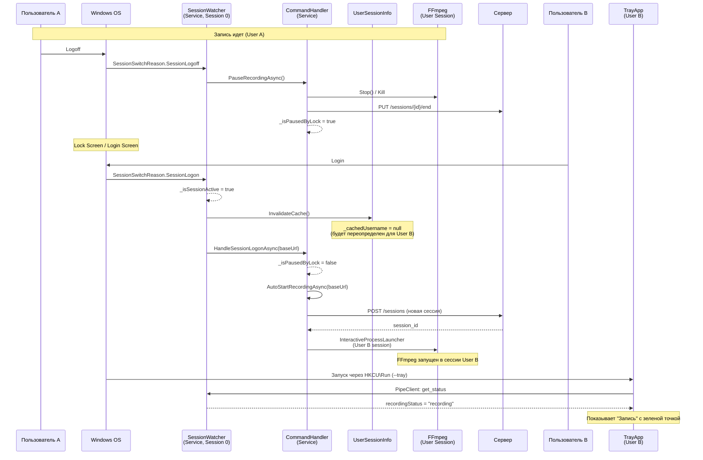
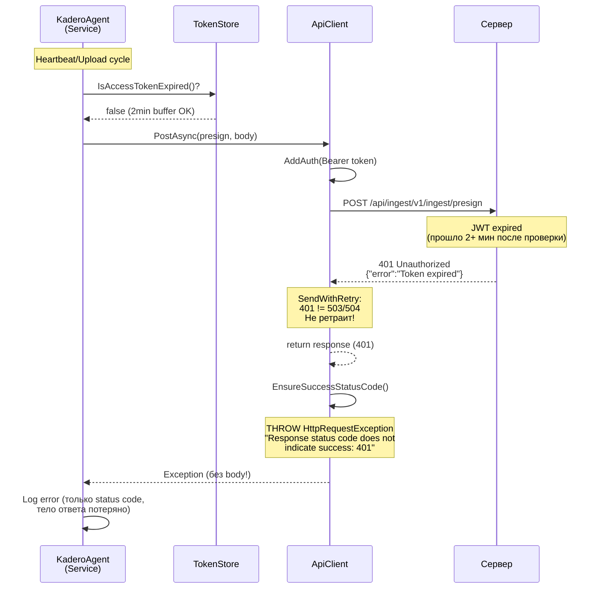
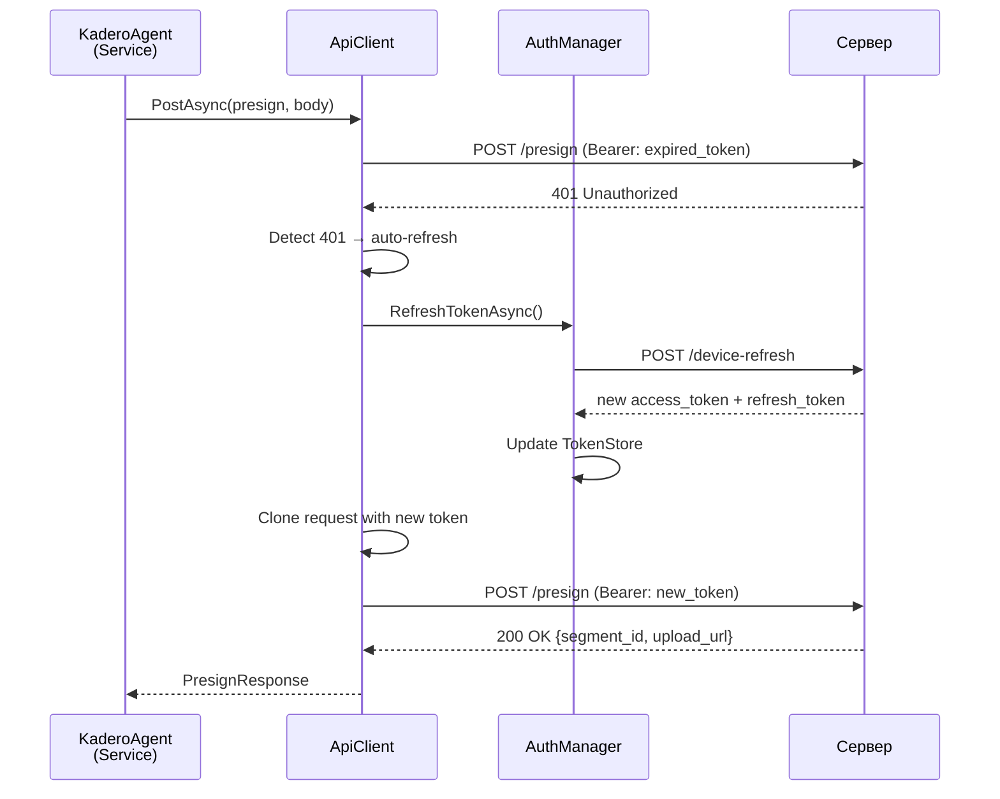

# Системный анализ багов Windows Agent: перелогин и HTTP-ошибки

**Дата:** 2026-03-08
**Аналитик:** Системный аналитик
**Компонент:** windows-agent-csharp (KaderoAgent)
**Ветка:** feature/user-activity-tracking

---

## Содержание

1. [Архитектура Windows Agent](#1-архитектура-windows-agent)
2. [Баг 1: Запись не стартует после перелогина](#2-баг-1-запись-не-стартует-после-перелогина)
3. [Баг 2: "Response status code does not indicate success"](#3-баг-2-response-status-code-does-not-indicate-success)
4. [Sequence Diagrams](#4-sequence-diagrams)
5. [План исправлений](#5-план-исправлений)
6. [Декомпозиция задач](#6-декомпозиция-задач)

---

## 1. Архитектура Windows Agent

### 1.1. Двухпроцессная модель

```
+-----------------------------+          +-----------------------------+
|   KaderoAgent.exe --service |          |   KaderoAgent.exe --tray    |
|   (Windows Service)         |          |   (Tray Process)            |
|   Session 0 / SYSTEM        |          |   User Session / Desktop    |
|                              |          |                              |
|   AgentService (main loop)   |  Named   |   TrayApplication           |
|   HeartbeatService           |  Pipe    |   TrayWindowTracker         |
|   SessionWatcher             | <------> |   PipeClient                |
|   ProcessWatcher             |          |   StatusWindow              |
|   AuditEventSink             |          |                              |
|   FocusIntervalSink          |          |                              |
|   PipeServer                 |          |                              |
|   CommandHandler             |          |                              |
|   ScreenCaptureManager       |          |                              |
|     -> FFmpeg (user session) |          |                              |
+-----------------------------+          +-----------------------------+
```

### 1.2. Жизненный цикл записи

1. **Старт службы** -> `AgentService.ExecuteAsync()`:
   - `AuthManager.InitializeAsync()` -- загрузка credentials, refresh token
   - Загрузка pending segments из SQLite, постановка в `UploadQueue`
   - `CommandHandler.AutoStartRecordingAsync()` -- если `AutoStart=true` и сессия не заблокирована

2. **AutoStartRecordingAsync** -> `StartRecording()`:
   - `SessionManager.StartSessionAsync()` -- POST `/api/ingest/v1/ingest/sessions`
   - `ScreenCaptureManager.Start()` -- запуск FFmpeg через `InteractiveProcessLauncher`
   - `UploadQueue.StartProcessing()` -- фоновый цикл загрузки сегментов
   - `WatchSegments()` -- мониторинг новых .mp4 файлов

3. **Heartbeat** (каждые 30с) -> HeartbeatService:
   - PUT `/api/cp/v1/devices/{deviceId}/heartbeat`
   - Получение pending commands (START_RECORDING, STOP_RECORDING, UPDATE_SETTINGS)
   - Применение device_settings

4. **Session switch events** -> SessionWatcher:
   - `SessionLock` -> `PauseRecordingAsync()` (stop FFmpeg, end session)
   - `SessionUnlock` -> `ResumeRecordingAsync()` (re-start recording)
   - `SessionLogon` -> только аудит-событие (запись НЕ стартуется!)
   - `SessionLogoff` -> `PauseRecordingAsync()`

### 1.3. Взаимодействие с сервером

| Операция | URL | Метод | Вызывающий |
|----------|-----|-------|-----------|
| Регистрация | `/api/v1/auth/device-login` | POST | AuthManager |
| Refresh token | `/api/v1/auth/device-refresh` | POST | AuthManager |
| Heartbeat | `/api/cp/v1/devices/{id}/heartbeat` | PUT | HeartbeatService |
| Ack command | `/api/cp/v1/devices/commands/{id}/ack` | PUT | CommandHandler |
| Create session | `/api/ingest/v1/ingest/sessions` | POST | SessionManager |
| End session | `/api/ingest/v1/ingest/sessions/{id}/end` | PUT | SessionManager |
| Presign | `/api/ingest/v1/ingest/presign` | POST | SegmentUploader |
| Upload segment | MinIO presigned URL | PUT | SegmentUploader |
| Confirm | `/api/ingest/v1/ingest/confirm` | POST | SegmentUploader |
| Audit events | `{IngestBaseUrl}/audit-events` | POST | AuditEventSink |
| Focus intervals | `{IngestBaseUrl}/activity/focus-intervals` | POST | FocusIntervalSink |
| List recordings | `/api/ingest/v1/ingest/recordings?...` | GET | SessionManager (409 recovery) |

---

## 2. Баг 1: Запись не стартует после перелогина

### 2.1. Сценарий воспроизведения

1. Пользователь A залогинен, запись идет (зеленая точка в трее)
2. Пользователь A выходит (logoff) или переключается на экран входа
3. Пользователь B входит в систему (logon)
4. В конфигураторе агента -- статус "Остановлена", запись не идет
5. Служба KaderoAgent при этом запущена (видна в services.msc)

### 2.2. Root Cause Analysis

**Корневая причина: `SessionWatcher` обрабатывает `SessionLogon` только как аудит-событие, без старта записи.**

Файл: `SessionWatcher.cs`, строки 88-96:

```csharp
case SessionSwitchReason.SessionLogon:
    _logger.LogInformation("Session LOGON");
    _isSessionActive = true;
    _sink.Publish(new AuditEvent
    {
        EventType = "SESSION_LOGON",
        Details = new Dictionary<string, object> { ["reason"] = "SessionLogon" }
    });
    break;  // <-- ПРОБЛЕМА: нет вызова StartRecording / ResumeRecording
```

Сравнение с `SessionUnlock` (строки 75-85):

```csharp
case SessionSwitchReason.SessionUnlock:
    _isSessionActive = true;
    // ...аудит...
    var creds = _credentialStore.Load();
    var baseUrl = creds?.ServerUrl?.TrimEnd('/') ?? "";
    await _commandHandler.ResumeRecordingAsync(baseUrl, CancellationToken.None);
    break;  // <-- Правильно: вызывает ResumeRecordingAsync
```

### 2.3. Цепочка событий при перелогине

```
Пользователь A залогинен, запись идет
    |
    v
SessionLogoff event
    |-> SessionWatcher.OnSessionSwitch(SessionLogoff)
    |-> _isSessionActive = false
    |-> _commandHandler.PauseRecordingAsync()  // OK: FFmpeg stop, session end
    |-> _isPausedByLock = true
    |
    v
Экран входа Windows (Lock screen)
    |
    v
Пользователь B вводит пароль
    |
    v
SessionLogon event                            <--- Новая сессия
    |-> SessionWatcher.OnSessionSwitch(SessionLogon)
    |-> _isSessionActive = true
    |-> AuditEvent "SESSION_LOGON"
    |-> break;                                 <--- СТОП! Запись не стартует!
    |
    v
Агент остается в состоянии _isPausedByLock = true
ResumeRecordingAsync не вызывается, потому что
он проверяет _isPausedByLock в начале:
    if (!_isPausedByLock) return;  // <-- Даже если бы вызвали, это бы работало
                                   // НО его вообще не вызывают при SessionLogon
```

### 2.4. Дополнительная проблема: _isPausedByLock остается true

При `SessionLogoff` -> `PauseRecordingAsync()` устанавливает `_isPausedByLock = true`.
При `SessionLogon` **нет кода**, который сбрасывает `_isPausedByLock = false`.

Даже если heartbeat доставит команду `START_RECORDING`, `CommandHandler.HandleAsync()` вызовет `StartRecording()`, который проверяет:
```csharp
private async Task StartRecording(string baseUrl, CancellationToken ct)
{
    if (_captureManager.IsRecording) return;  // пропустит, т.к. не recording
    // ... но _isPausedByLock все еще true!
    // StartRecording не проверяет _isPausedByLock, так что теоретически
    // START_RECORDING сервера сработает. Но ResumeRecordingAsync --
    // единственный метод, который сбрасывает _isPausedByLock.
}
```

Однако `AutoStartRecordingAsync` вызывается только ОДИН раз при старте `AgentService`. При перелогине `AgentService.ExecuteAsync()` уже работает (прошел await `Task.Delay(30s)` в main loop). Автостарт при перелогине не происходит.

### 2.5. Дополнительная проблема: FFmpeg и смена пользователя

Даже если бы запись стартовала:

1. **FFmpeg был запущен в сессии пользователя A** через `InteractiveProcessLauncher.LaunchInUserSession()`
2. При логофе пользователя A его Windows Session уничтожается, FFmpeg убивается ОС
3. При логоне пользователя B создается **новая Windows Session** (новый Session ID)
4. `InteractiveProcessLauncher` находит нужную сессию через `WTSEnumerateSessions` / `WTSGetActiveConsoleSessionId` -- это работает корректно для нового пользователя
5. **НО**: `UserSessionInfo._cachedUsername` содержит имя пользователя A! Метод `InvalidateCache()` **не вызывается** при `SessionLogon`

### 2.6. Дополнительная проблема: Tray Process при смене пользователя

1. Tray-процесс пользователя A завершается при логофе (процесс убивается ОС)
2. Tray-процесс пользователя B запускается через `HKCU\...\Run` (AutoStart)
3. Tray подключается к PipeServer службы по Named Pipe
4. **TrayWindowTracker** в Tray пользователя B работает корректно (новый процесс)
5. Но Tray показывает "Остановлена", потому что служба реально НЕ записывает

### 2.7. Резюме корневых причин Бага 1

| # | Причина | Файл | Строка | Критичность |
|---|---------|------|--------|-------------|
| 1 | `SessionLogon` не вызывает старт/resume записи | SessionWatcher.cs | 88-96 | **CRITICAL** -- основная причина |
| 2 | `_isPausedByLock` не сбрасывается при `SessionLogon` | CommandHandler.cs | 23 | **HIGH** -- блокирует даже ручной resume |
| 3 | `UserSessionInfo._cachedUsername` не инвалидируется при `SessionLogon` | UserSessionInfo.cs | 49 | **MEDIUM** -- аудит будет с неверным username |
| 4 | Нет обработки `ConsoleConnect/RemoteConnect` | SessionWatcher.cs | -- | **LOW** -- RDP-сценарии |

---

## 3. Баг 2: "Response status code does not indicate success"

### 3.1. Описание

Периодически в логах агента появляется:
```
System.Net.Http.HttpRequestException: Response status code does not indicate success
```

Это стандартное исключение .NET из `HttpResponseMessage.EnsureSuccessStatusCode()`.

### 3.2. Все точки вызова EnsureSuccessStatusCode

Файл `ApiClient.cs` -- единственное место, где вызывается `EnsureSuccessStatusCode()`:

```csharp
// GetAsync (строка 41)
response.EnsureSuccessStatusCode();

// PostAsync (строка 56)
response.EnsureSuccessStatusCode();

// PutAsync (строка 72)
response.EnsureSuccessStatusCode();
```

### 3.3. Retry-логика в ApiClient

`SendWithRetry` (строки 100-128) повторяет запрос при:
- `503 ServiceUnavailable`
- `504 GatewayTimeout`
- `HttpRequestException` (сетевой сбой)

Но **НЕ повторяет** при других 4xx/5xx кодах (401, 403, 404, 409, 500).

### 3.4. Анализ всех HTTP-вызовов и возможных ошибок

#### 3.4.1. Heartbeat -- PUT `/api/cp/v1/devices/{id}/heartbeat`

| Код | Причина | Вероятность |
|-----|---------|-------------|
| **401 Unauthorized** | JWT access token истек, refresh не прошел | **ВЫСОКАЯ** |
| **403 Forbidden** | Device ID mismatch (principal.deviceId != URL deviceId) | Средняя |
| **404 Not Found** | Устройство удалено или не найдено в tenant | Средняя |
| **500 Internal Server Error** | Ошибка БД control-plane | Низкая |

Обработка в `HeartbeatService.ExecuteAsync()` (строки 109-117):
```csharp
catch (Exception ex)
{
    _logger.LogError(ex, "Heartbeat failed");
    // Устанавливает status=error, но продолжает цикл
}
```
**Heartbeat проглатывает все ошибки** и продолжает работу -- это корректно.

#### 3.4.2. Create Session -- POST `/api/ingest/v1/ingest/sessions`

| Код | Причина | Вероятность |
|-----|---------|-------------|
| **401 Unauthorized** | JWT истек | **ВЫСОКАЯ** |
| **403 Forbidden** | Device ID mismatch в JWT vs request body | Средняя |
| **409 Conflict** | Уже есть активная сессия для этого устройства | **ВЫСОКАЯ** (обрабатывается) |

409 обрабатывается в `SessionManager.StartSessionAsync()` (строки 53-65) -- правильно.

Но **401 НЕ обрабатывается** -- `EnsureSuccessStatusCode` бросит исключение, которое поймается в `CommandHandler.StartRecording()`:
```csharp
catch (Exception ex)
{
    _logger.LogWarning(ex, "Failed to create server session, using local session ID");
    sessionId = Guid.NewGuid().ToString();
}
```
Это плохо -- запись стартует с локальным session ID, сегменты не смогут загрузиться.

#### 3.4.3. Presign -- POST `/api/ingest/v1/ingest/presign`

| Код | Причина | Вероятность |
|-----|---------|-------------|
| **401 Unauthorized** | JWT истек | **ВЫСОКАЯ** |
| **400 Bad Request** | Невалидные данные (session_id не существует) | Средняя |
| **404 Not Found** | Session не найдена (уже закрыта) | **ВЫСОКАЯ** после перелогина |

Обработка в `SegmentUploader.UploadSegmentAsync()` (строки 93-98):
```csharp
catch (Exception ex)
{
    _logger.LogError(ex, "Failed to upload segment {Seq}", sequenceNum);
    return false;
}
```
Возвращает `false`, сегмент сохраняется в SQLite как pending. Но **старая session_id** из мертвой записи остается в pending-данных.

#### 3.4.4. Confirm -- POST `/api/ingest/v1/ingest/confirm`

| Код | Причина | Вероятность |
|-----|---------|-------------|
| **401 Unauthorized** | JWT истек между presign и confirm | Низкая |
| **404 Not Found** | Segment ID не найден | Низкая |

#### 3.4.5. End Session -- PUT `/api/ingest/v1/ingest/sessions/{id}/end`

| Код | Причина | Вероятность |
|-----|---------|-------------|
| **401 Unauthorized** | JWT истек | Средняя |
| **404 Not Found** | Session уже закрыта или не найдена | **ВЫСОКАЯ** при перелогине |

Обработка в `SessionManager.EndSessionAsync()`:
```csharp
catch (Exception ex)
{
    _logger.LogWarning(ex, "Failed to end session on server");
}
```
Корректно проглатывается.

#### 3.4.6. Audit Events -- POST `{IngestBaseUrl}/audit-events`

| Код | Причина | Вероятность |
|-----|---------|-------------|
| **401 Unauthorized** | JWT истек | Средняя |
| **400 Bad Request** | Невалидный username или пустой device_id | Средняя |

#### 3.4.7. Focus Intervals -- POST `{IngestBaseUrl}/activity/focus-intervals`

| Код | Причина | Вероятность |
|-----|---------|-------------|
| **401 Unauthorized** | JWT истек | Средняя |
| **400 Bad Request** | Невалидный username | Средняя |

#### 3.4.8. Command ACK -- PUT `/api/cp/v1/devices/commands/{id}/ack`

| Код | Причина | Вероятность |
|-----|---------|-------------|
| **401 Unauthorized** | JWT истек | Низкая |
| **404 Not Found** | Команда не найдена | Низкая |

### 3.5. Root Cause Analysis

**Корневые причины HTTP-ошибок (по вероятности):**

#### Причина A: JWT Token Expiration Race Condition (ВЫСОКАЯ вероятность)

```
HeartbeatService вызывает EnsureValidTokenAsync() -> token годен (осталось 1m50s)
    |
    v  (через 2 минуты)
SegmentUploader вызывает EnsureValidTokenAsync() -> token годен (проверка: 2min buffer)
    но фактически access_token уже истек
    |
    v
Presign запрос с истекшим token -> 401 Unauthorized
    |
    v
EnsureSuccessStatusCode() -> HttpRequestException
```

Проблема: `TokenStore.IsAccessTokenExpired()` использует буфер 2 минуты:
```csharp
return DateTime.UtcNow >= expiry.AddMinutes(-2);
```

Но если между проверкой и реальным HTTP-запросом проходит время (очередь загрузки, сетевая задержка), токен может истечь.

Кроме того, `RefreshTokenAsync` НЕ проверяет response status code перед обновлением:
```csharp
var response = await _apiClient.PostAsync<DeviceRefreshResponse>(url, body);
// PostAsync вызовет EnsureSuccessStatusCode() -- если refresh_token истек,
// получим исключение, которое поймается в catch и вернет false
```

Если **refresh token тоже истек** (долгий простой, смена пароля на сервере), агент будет бесконечно получать 401 на каждый запрос.

#### Причина B: Stale Session ID после перелогина (ВЫСОКАЯ вероятность)

После логофа/логона:
1. `PauseRecordingAsync()` пытается закрыть сессию (может получить 404, если сервер уже закрыл)
2. Pending segments в SQLite хранят старый `session_id`
3. При попытке загрузить эти pending segments -- presign вернет ошибку (session не найдена или закрыта)

#### Причина C: IngestBaseUrl может быть пустым (СРЕДНЯЯ вероятность)

`ServerConfig.IngestBaseUrl` заполняется из `device-login` response. Если при первичной регистрации сервер не вернул `IngestBaseUrl`, или если credentials были сохранены до добавления этого поля:

```csharp
// FocusIntervalSink.FlushAsync, строки 85-91:
var baseUrl = serverConfig?.IngestBaseUrl;
if (string.IsNullOrEmpty(baseUrl))
{
    _logger.LogDebug("No ingest base URL, skipping focus interval upload");
    foreach (var item in batch) _queue.Enqueue(item);  // бесконечный re-queue!
    return;
}
```

Это не вызовет HTTP-ошибку, но приведет к бесконечному накоплению в очереди.

#### Причина D: EnsureSuccessStatusCode без деталей ответа (АРХИТЕКТУРНАЯ)

`ApiClient` вызывает `response.EnsureSuccessStatusCode()` БЕЗ предварительного логирования тела ответа. Это значит:
- В логах видно ТОЛЬКО "Response status code does not indicate success: 401 (Unauthorized)"
- Тело ответа (содержащее `{"error": "message", "code": "ERROR_CODE"}`) теряется
- Невозможно отличить "JWT expired" от "invalid device" или "permission denied"

### 3.6. Резюме корневых причин Бага 2

| # | Причина | Вероятность | Файл |
|---|---------|-------------|------|
| A | JWT race condition -- token проверен как валидный, но истекает до завершения HTTP-запроса | ВЫСОКАЯ | ApiClient.cs, TokenStore.cs |
| B | Stale session_id в pending segments после перелогина/рестарта | ВЫСОКАЯ | UploadQueue.cs, LocalDatabase |
| C | `EnsureSuccessStatusCode` без логирования response body | АРХИТЕКТ. | ApiClient.cs |
| D | SendWithRetry не обрабатывает 401 (не делает auto-refresh) | ВЫСОКАЯ | ApiClient.cs |
| E | Refresh token истечение при длительном простое | СРЕДНЯЯ | AuthManager.cs |

---

## 4. Sequence Diagrams

### 4.1. Текущий поток при перелогине (Баг 1)

```mermaid
sequenceDiagram
    participant UserA as Пользователь A
    participant WinOS as Windows OS
    participant SvcSW as SessionWatcher<br/>(Service, Session 0)
    participant SvcCH as CommandHandler<br/>(Service)
    participant FFmpeg as FFmpeg<br/>(User Session)
    participant Tray as TrayApp<br/>(User A)
    participant Server as Сервер

    Note over FFmpeg,UserA: Запись идет (User A)

    UserA->>WinOS: Logoff
    WinOS->>SvcSW: SessionSwitchReason.SessionLogoff
    SvcSW->>SvcCH: PauseRecordingAsync()
    SvcCH->>FFmpeg: Stop() / Kill
    SvcCH->>Server: PUT /sessions/{id}/end
    SvcCH-->>SvcCH: _isPausedByLock = true
    WinOS--xFFmpeg: Session destroyed (process killed by OS)
    WinOS--xTray: Session destroyed (process killed by OS)

    Note over WinOS: Lock Screen / Login Screen

    participant UserB as Пользователь B
    participant TrayB as TrayApp<br/>(User B)

    UserB->>WinOS: Login
    WinOS->>SvcSW: SessionSwitchReason.SessionLogon
    SvcSW-->>SvcSW: _isSessionActive = true
    SvcSW->>SvcSW: Publish AuditEvent(SESSION_LOGON)
    Note over SvcSW: break; <-- НЕТ вызова StartRecording!

    WinOS->>TrayB: Запуск через HKCU\Run (--tray)
    TrayB->>SvcSW: PipeClient: get_status
    SvcSW-->>TrayB: recordingStatus = "stopped"
    Note over TrayB: Показывает "Остановлена" (корректно!)

    loop Каждые 30 секунд
        SvcCH->>SvcCH: CheckAndRecoverAsync()
        Note over SvcCH: _captureManager.IsRecording = false<br/>Ничего не делает
    end

    Note over SvcCH: Запись НЕ стартует до:<br/>1) Перезапуска службы<br/>2) Команды START_RECORDING от сервера
```

### 4.2. Желаемый поток при перелогине (после исправления)



### 4.3. Поток HTTP-ошибок (Баг 2)



### 4.4. Желаемый поток с auto-refresh при 401



---

## 5. План исправлений

### 5.1. Баг 1: SessionLogon -> Start Recording

**Изменения в `SessionWatcher.cs`:**

```csharp
case SessionSwitchReason.SessionLogon:
    _logger.LogInformation("Session LOGON");
    _isSessionActive = true;

    // Invalidate cached username for new user
    _userSessionInfo.InvalidateCache();

    _sink.Publish(new AuditEvent
    {
        EventType = "SESSION_LOGON",
        Details = new Dictionary<string, object> { ["reason"] = "SessionLogon" }
    });

    // Start recording for new user session (same as unlock flow)
    {
        var creds = _credentialStore.Load();
        var baseUrl = creds?.ServerUrl?.TrimEnd('/') ?? "";
        await _commandHandler.HandleSessionLogonAsync(baseUrl, CancellationToken.None);
    }
    break;
```

**Новый метод в `CommandHandler.cs`:**

```csharp
/// <summary>
/// Handle user logon: reset pause state, update username, auto-start if configured.
/// Unlike ResumeRecordingAsync, this always attempts to start (not just after lock).
/// </summary>
public async Task HandleSessionLogonAsync(string baseUrl, CancellationToken ct)
{
    _logger.LogInformation("Handling session logon: resetting state and auto-starting");

    // Reset pause flag (Logoff sets _isPausedByLock = true via PauseRecordingAsync)
    _isPausedByLock = false;

    // Stop any stale recording (FFmpeg process from previous user is dead anyway)
    if (_captureManager.IsRecording)
    {
        _captureManager.ResetAfterCrash();
    }

    // Reset consecutive failures
    _consecutiveFailures = 0;

    // Auto-start recording for new user
    await AutoStartRecordingAsync(baseUrl, ct);
}
```

**Изменения в `SessionWatcher.cs` -- добавить зависимость `UserSessionInfo`:**

```csharp
private readonly UserSessionInfo _userSessionInfo;

public SessionWatcher(
    IAuditEventSink sink,
    CommandHandler commandHandler,
    CredentialStore credentialStore,
    UserSessionInfo userSessionInfo,  // NEW
    ILogger<SessionWatcher> logger)
{
    // ...
    _userSessionInfo = userSessionInfo;
}
```

**Изменения в `FocusIntervalSink` -- обновить username при логоне:**

В `Program.cs` или через event -- нужен механизм уведомления `FocusIntervalSink` о смене пользователя.

Вариант: добавить в `SessionWatcher.OnSessionSwitch(SessionLogon)`:
```csharp
// Update FocusIntervalSink username
var focusSink = /* inject FocusIntervalSink */;
var newUsername = _userSessionInfo.GetCurrentUsername();
focusSink.SetUsername(newUsername);
```

### 5.2. Баг 2: Улучшение обработки HTTP-ошибок

#### 5.2.1. Auto-refresh token при 401

**Изменения в `ApiClient.cs`:**

```csharp
private Func<Task>? _onTokenRefreshNeeded;

public void SetTokenRefreshCallback(Func<Task> callback) =>
    _onTokenRefreshNeeded = callback;

private async Task<HttpResponseMessage> SendWithRetry(
    HttpRequestMessage request, CancellationToken ct, int maxRetries = 3)
{
    bool tokenRefreshed = false;

    for (int i = 0; i < maxRetries; i++)
    {
        try
        {
            var clone = await CloneRequest(request);
            // Re-add auth header with potentially refreshed token
            clone.Headers.Authorization = null;
            AddAuth(clone);

            var response = await _http.SendAsync(clone, ct);

            // 401: try refresh token once, then retry
            if (response.StatusCode == HttpStatusCode.Unauthorized && !tokenRefreshed)
            {
                _logger.LogWarning("Got 401, attempting token refresh...");
                if (_onTokenRefreshNeeded != null)
                {
                    await _onTokenRefreshNeeded();
                    tokenRefreshed = true;
                    continue; // Retry with new token
                }
            }

            if (response.StatusCode != HttpStatusCode.ServiceUnavailable &&
                response.StatusCode != HttpStatusCode.GatewayTimeout)
                return response;

            _logger.LogWarning("Request to {Url} returned {Status}, retry {N}/{Max}",
                request.RequestUri, response.StatusCode, i + 1, maxRetries);
        }
        catch (HttpRequestException ex) when (i < maxRetries - 1)
        {
            _logger.LogWarning(ex, "Request failed, retry {N}/{Max}", i + 1, maxRetries);
        }

        await Task.Delay(TimeSpan.FromSeconds(Math.Pow(2, i)), ct);
    }

    throw new HttpRequestException($"Request failed after {maxRetries} retries");
}
```

**Регистрация callback в `Program.cs`:**

```csharp
// After building host, wire up token refresh
var apiClient = host.Services.GetRequiredService<ApiClient>();
var authManager = host.Services.GetRequiredService<AuthManager>();
apiClient.SetTokenRefreshCallback(() => authManager.RefreshTokenAsync().ContinueWith(_ => { }));
```

#### 5.2.2. Логирование response body при ошибках

**Изменения в `ApiClient.cs`:**

```csharp
public async Task<T?> PostAsync<T>(string url, object? body = null, CancellationToken ct = default)
{
    var request = new HttpRequestMessage(HttpMethod.Post, url);
    if (body != null)
    {
        request.Content = new StringContent(
            JsonSerializer.Serialize(body, JsonOptions), Encoding.UTF8, "application/json");
    }
    AddAuth(request);
    var response = await SendWithRetry(request, ct);

    if (!response.IsSuccessStatusCode)
    {
        var errorBody = await response.Content.ReadAsStringAsync(ct);
        _logger.LogError("HTTP {Method} {Url} failed: {StatusCode} - {Body}",
            request.Method, url, (int)response.StatusCode, errorBody);
        response.EnsureSuccessStatusCode(); // still throws, but now we logged the body
    }

    var json = await response.Content.ReadAsStringAsync(ct);
    if (string.IsNullOrWhiteSpace(json)) return default;
    return JsonSerializer.Deserialize<T>(json, JsonOptions);
}
```

Аналогично для `GetAsync` и `PutAsync`.

#### 5.2.3. Очистка stale pending segments

**Изменения в `AgentService.cs` -- при старте загрузки pending segments:**

```csharp
// Before enqueueing pending segments, validate session_id is still valid
var pending = _db.GetPendingSegments();
if (pending.Count > 0)
{
    // Group by session_id and attempt to validate
    foreach (var seg in pending)
    {
        if (File.Exists(seg.FilePath))
            await _uploadQueue.EnqueueAsync(seg);
        else
            _db.MarkSegmentUploaded(seg.FilePath); // Remove stale entry
    }
}
```

Дополнительно -- обработка 404 при presign как "session expired, discard segment":

```csharp
// In SegmentUploader.UploadSegmentAsync
catch (HttpRequestException ex) when (ex.StatusCode == HttpStatusCode.NotFound)
{
    _logger.LogWarning("Session {SessionId} not found (404), discarding segment {Seq}",
        sessionId, sequenceNum);
    return true; // Mark as "uploaded" to prevent infinite retry
}
```

---

## 6. Декомпозиция задач

### Баг 1: После перелогина запись не стартует

| # | Задача | Файлы | Приоритет |
|---|--------|-------|-----------|
| 1 | Добавить `HandleSessionLogonAsync()` в `CommandHandler`: сброс `_isPausedByLock`, вызов `AutoStartRecordingAsync` | CommandHandler.cs | Critical |
| 2 | В `SessionWatcher.OnSessionSwitch(SessionLogon)`: вызвать `HandleSessionLogonAsync` | SessionWatcher.cs | Critical |
| 3 | В `SessionWatcher.OnSessionSwitch(SessionLogon)`: инвалидировать `UserSessionInfo._cachedUsername` | SessionWatcher.cs, UserSessionInfo.cs | High |
| 4 | Обновить `FocusIntervalSink.SetUsername()` при смене пользователя | SessionWatcher.cs, FocusIntervalSink.cs | High |
| 5 | Добавить `SessionWatcher` зависимость от `UserSessionInfo` и `FocusIntervalSink` | DI Registration (Program.cs) | High |

### Баг 2: HTTP errors

| # | Задача | Файлы | Приоритет |
|---|--------|-------|-----------|
| 6 | Auto-refresh JWT при получении 401 в `ApiClient.SendWithRetry` | ApiClient.cs, Program.cs | High |
| 7 | Логирование response body при не-2xx ответах в `ApiClient` | ApiClient.cs | High |
| 8 | Обработка 404 в `SegmentUploader` как "session expired" (не ретраить) | SegmentUploader.cs | Medium |
| 9 | Очистка stale pending segments с невалидными session_id при старте | AgentService.cs, LocalDatabase.cs | Medium |

---

## Приложение: Полная карта файлов агента

```
windows-agent-csharp/src/KaderoAgent/
├── Program.cs                    -- Entry point, DI, mode selection (--service/--tray/--setup)
├── Auth/
│   ├── AuthManager.cs            -- Device register, token refresh, server config
│   ├── CredentialStore.cs        -- credentials.enc (AES encrypted), pending registration
│   └── TokenStore.cs             -- In-memory JWT access/refresh tokens
├── Audit/
│   ├── AuditEvent.cs             -- DTO: event_type, session_id, details
│   ├── AuditEventSink.cs         -- BackgroundService: buffer -> batch upload to server
│   ├── FocusInterval.cs          -- DTO: process, window, browser, domain, duration
│   ├── FocusIntervalSink.cs      -- BackgroundService: queue -> batch upload to server
│   ├── IAuditEventSink.cs        -- Interface: Publish(AuditEvent)
│   ├── BrowserDomainParser.cs    -- Parse browser window titles for domain extraction
│   ├── ProcessWatcher.cs         -- WMI: process start/stop events (debounced)
│   ├── SessionWatcher.cs         -- SystemEvents.SessionSwitch: lock/unlock/logon/logoff
│   └── UserSessionInfo.cs        -- WTS API: current username (Session 0 safe)
├── Capture/
│   ├── FfmpegProcess.cs          -- FFmpeg lifecycle (direct/interactive session)
│   ├── InteractiveProcessLauncher.cs  -- WTS/CreateProcessAsUser for Session 0
│   └── ScreenCaptureManager.cs   -- Start/Stop FFmpeg, settings, crash detection
├── Command/
│   ├── CommandHandler.cs         -- Start/Stop/Pause/Resume recording, session rotation
│   └── HeartbeatService.cs       -- Heartbeat loop, command delivery, device settings
├── Configuration/
│   ├── AgentConfig.cs            -- Local config (appsettings.json)
│   └── ServerConfig.cs           -- Server-pushed config (from device-login/heartbeat)
├── Ipc/
│   ├── ICommandExecutor.cs       -- Interface: ReconnectAsync
│   ├── IStatusProvider.cs        -- Interface: GetCurrentStatus
│   ├── PipeClient.cs             -- Named Pipe client (Tray side)
│   ├── PipeProtocol.cs           -- DTOs: PipeRequest, PipeResponse, AgentStatus
│   └── PipeServer.cs             -- Named Pipe server (Service side)
├── Service/
│   ├── AgentService.cs           -- Main loop: auth, pending upload, auto-start, maintenance
│   ├── AgentStatusProvider.cs    -- Aggregates status from all components
│   ├── AgentCommandExecutor.cs   -- Reconnect via pipe command
│   └── MetricsCollector.cs       -- CPU, memory, disk metrics
├── Storage/
│   ├── LocalDatabase.cs          -- SQLite: pending segments, audit events
│   └── SegmentFileManager.cs     -- Disk space management, old segment eviction
├── Tray/
│   ├── TrayApplication.cs        -- NotifyIcon, context menu, status polling
│   ├── TrayWindowTracker.cs      -- GetForegroundWindow polling, focus intervals via Pipe
│   ├── StatusWindow.cs           -- Glass-style status window
│   ├── SetupForm.cs              -- Registration form
│   ├── AboutDialog.cs            -- About dialog
│   ├── GlassHelper.cs            -- Acrylic/glass UI rendering
│   └── TrayIcons.cs              -- Icon resources
├── Upload/
│   ├── SegmentUploader.cs        -- Presign -> S3 PUT -> Confirm flow
│   ├── SessionManager.cs         -- Server session lifecycle (create/end, 409 recovery)
│   └── UploadQueue.cs            -- Channel-based async upload queue
└── Util/
    ├── ApiClient.cs              -- HTTP client with auth, retry, JSON serialization
    ├── AutoStartHelper.cs        -- HKCU\Run registry for tray auto-start
    ├── CryptoUtil.cs             -- AES encryption for credentials
    ├── DirectoryAclHelper.cs     -- Windows ACL for data directory
    └── HardwareId.cs             -- Machine-specific encryption key
```
