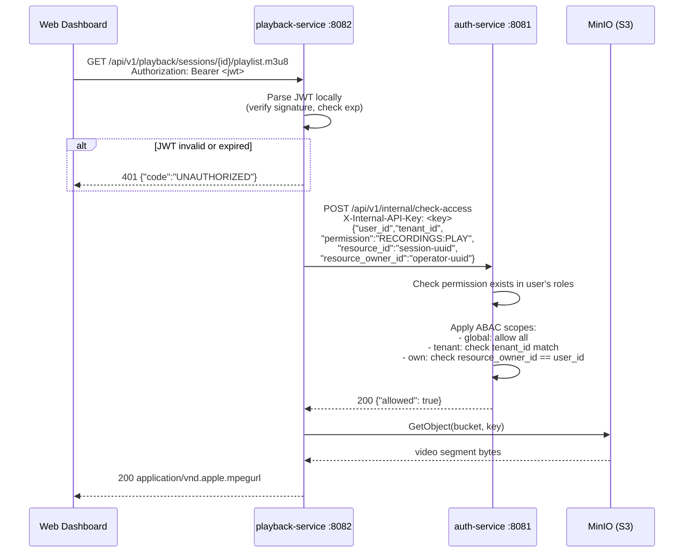
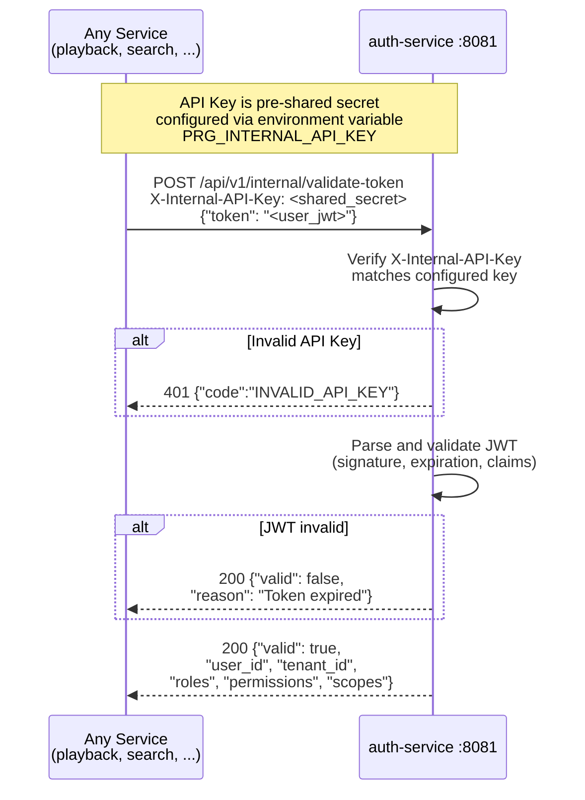

Проект полностью пуст -- нет ни одного сервиса, ни одного файла кода. Существует только `.claude/` с конфигурацией агентов и команд. Теперь у меня есть полная картина. Приступаю к формированию исчерпывающей спецификации ядра системы.

---

# СПЕЦИФИКАЦИЯ ЯДРА: auth-service + web-dashboard

## Результат анализа существующего кода

**Статус проекта: кодовая база полностью пуста.** В репозитории `/Users/alfa/Desktop/Альфа/Проекты/Запись экранов/screen-recorder` существует только директория `.claude/` с конфигурацией агентов (system-analyst, developer, devops, qa-tester, security-reviewer) и командами CI/CD-пайплайна. Никаких сервисов, миграций, Dockerfile, k8s-манифестов, фронтенд-кода нет.

**Вывод: необходимо спроектировать и реализовать ВСЕ с нуля.**

---

## 1. СТРУКТУРА ПРОЕКТА (целевая)

```
screen-recorder/
  auth-service/
    src/main/java/com/prg/auth/
      config/           # SecurityConfig, JwtConfig, NatsConfig, CorsConfig
      controller/       # AuthController, UserController, RoleController, InternalController
      dto/              # request/response DTOs
      entity/           # JPA entities
      exception/        # GlobalExceptionHandler, custom exceptions
      filter/           # JwtAuthenticationFilter
      mapper/           # Entity <-> DTO mappers
      repository/       # Spring Data JPA repositories
      security/         # JwtTokenProvider, UserDetailsServiceImpl
      service/          # AuthService, UserService, RoleService, AuditService, PermissionService
    src/main/resources/
      application.yml
      application-dev.yml
      application-test.yml
      application-prod.yml
      db/migration/     # Flyway SQL migrations
    src/test/java/com/prg/auth/
    pom.xml
    .mvn/wrapper/       # Maven wrapper
    mvnw, mvnw.cmd

  web-dashboard/
    public/
    src/
      api/              # Axios instance, auth API, user API
      components/       # Reusable UI components
      contexts/         # AuthContext
      hooks/            # useAuth, usePermissions
      layouts/          # MainLayout, AuthLayout
      pages/            # LoginPage, DashboardPage, UsersPage, RolesPage
      routes/           # Router config, ProtectedRoute
      types/            # TypeScript interfaces
      utils/            # Token storage, helpers
      App.tsx
      main.tsx
    index.html
    package.json
    vite.config.ts
    tsconfig.json
    tailwind.config.js

  deploy/
    docker/
      auth-service/Dockerfile
      web-dashboard/Dockerfile
    k8s/
      auth-service/     # Deployment, Service, ConfigMap
      web-dashboard/    # Deployment, Service, Ingress
```

---

## 2. МОДЕЛЬ ДАННЫХ PostgreSQL

### 2.1. ER-диаграмма (логическая)

```
tenants 1──< users >──< user_roles >──< roles >──< role_permissions >──< permissions
                |
                └──< refresh_tokens
                
audit_log (partitioned by created_ts, monthly RANGE)
```

### 2.2. DDL -- Flyway-миграции

**V1__create_tenants.sql**

```sql
CREATE TABLE tenants (
    id              UUID        PRIMARY KEY DEFAULT gen_random_uuid(),
    name            VARCHAR(255) NOT NULL,
    slug            VARCHAR(100) NOT NULL UNIQUE,
    is_active       BOOLEAN     NOT NULL DEFAULT TRUE,
    settings        JSONB       NOT NULL DEFAULT '{}',
    created_ts      TIMESTAMPTZ NOT NULL DEFAULT now(),
    updated_ts      TIMESTAMPTZ NOT NULL DEFAULT now()
);

CREATE INDEX idx_tenants_slug ON tenants (slug);
CREATE INDEX idx_tenants_is_active ON tenants (is_active) WHERE is_active = TRUE;

COMMENT ON TABLE tenants IS 'Организации-арендаторы платформы';
COMMENT ON COLUMN tenants.slug IS 'URL-safe идентификатор тенанта (например, company-abc)';
COMMENT ON COLUMN tenants.settings IS 'Настройки тенанта: max_users, max_retention_days, features{}';
```

**V2__create_permissions.sql**

```sql
CREATE TABLE permissions (
    id              UUID        PRIMARY KEY DEFAULT gen_random_uuid(),
    code            VARCHAR(100) NOT NULL UNIQUE,
    name            VARCHAR(255) NOT NULL,
    description     TEXT,
    resource        VARCHAR(100) NOT NULL,
    action          VARCHAR(50)  NOT NULL,
    created_ts      TIMESTAMPTZ  NOT NULL DEFAULT now()
);

CREATE INDEX idx_permissions_code ON permissions (code);
CREATE INDEX idx_permissions_resource_action ON permissions (resource, action);

COMMENT ON TABLE permissions IS 'Атомарные разрешения. Формат code: RESOURCE:ACTION (например, USERS:READ)';
```

**V3__create_roles.sql**

```sql
CREATE TABLE roles (
    id              UUID        PRIMARY KEY DEFAULT gen_random_uuid(),
    tenant_id       UUID        NOT NULL REFERENCES tenants(id) ON DELETE CASCADE,
    code            VARCHAR(100) NOT NULL,
    name            VARCHAR(255) NOT NULL,
    description     TEXT,
    is_system       BOOLEAN     NOT NULL DEFAULT FALSE,
    created_ts      TIMESTAMPTZ NOT NULL DEFAULT now(),
    updated_ts      TIMESTAMPTZ NOT NULL DEFAULT now(),

    CONSTRAINT uq_roles_tenant_code UNIQUE (tenant_id, code)
);

CREATE INDEX idx_roles_tenant_id ON roles (tenant_id);

COMMENT ON TABLE roles IS 'Роли, привязанные к тенанту. is_system=true для предустановленных ролей';
```

**V4__create_role_permissions.sql**

```sql
CREATE TABLE role_permissions (
    role_id         UUID NOT NULL REFERENCES roles(id) ON DELETE CASCADE,
    permission_id   UUID NOT NULL REFERENCES permissions(id) ON DELETE CASCADE,

    PRIMARY KEY (role_id, permission_id)
);

CREATE INDEX idx_role_permissions_permission_id ON role_permissions (permission_id);
```

**V5__create_users.sql**

```sql
CREATE TABLE users (
    id              UUID        PRIMARY KEY DEFAULT gen_random_uuid(),
    tenant_id       UUID        NOT NULL REFERENCES tenants(id) ON DELETE CASCADE,
    username        VARCHAR(255) NOT NULL,
    email           VARCHAR(255) NOT NULL,
    password_hash   VARCHAR(255) NOT NULL,
    first_name      VARCHAR(255),
    last_name       VARCHAR(255),
    is_active       BOOLEAN     NOT NULL DEFAULT TRUE,
    last_login_ts   TIMESTAMPTZ,
    created_ts      TIMESTAMPTZ NOT NULL DEFAULT now(),
    updated_ts      TIMESTAMPTZ NOT NULL DEFAULT now(),

    CONSTRAINT uq_users_tenant_username UNIQUE (tenant_id, username),
    CONSTRAINT uq_users_tenant_email UNIQUE (tenant_id, email)
);

CREATE INDEX idx_users_tenant_id ON users (tenant_id);
CREATE INDEX idx_users_tenant_active ON users (tenant_id, is_active) WHERE is_active = TRUE;
CREATE INDEX idx_users_email ON users (email);

COMMENT ON TABLE users IS 'Пользователи платформы. username и email уникальны в рамках тенанта';
```

**V6__create_user_roles.sql**

```sql
CREATE TABLE user_roles (
    user_id         UUID NOT NULL REFERENCES users(id) ON DELETE CASCADE,
    role_id         UUID NOT NULL REFERENCES roles(id) ON DELETE CASCADE,
    assigned_ts     TIMESTAMPTZ NOT NULL DEFAULT now(),
    assigned_by     UUID REFERENCES users(id),

    PRIMARY KEY (user_id, role_id)
);

CREATE INDEX idx_user_roles_role_id ON user_roles (role_id);
```

**V7__create_refresh_tokens.sql**

```sql
CREATE TABLE refresh_tokens (
    id              UUID        PRIMARY KEY DEFAULT gen_random_uuid(),
    user_id         UUID        NOT NULL REFERENCES users(id) ON DELETE CASCADE,
    tenant_id       UUID        NOT NULL REFERENCES tenants(id) ON DELETE CASCADE,
    token_hash      VARCHAR(255) NOT NULL UNIQUE,
    device_info     VARCHAR(500),
    ip_address      VARCHAR(45),
    expires_at      TIMESTAMPTZ NOT NULL,
    is_revoked      BOOLEAN     NOT NULL DEFAULT FALSE,
    created_ts      TIMESTAMPTZ NOT NULL DEFAULT now()
);

CREATE INDEX idx_refresh_tokens_user_id ON refresh_tokens (user_id);
CREATE INDEX idx_refresh_tokens_token_hash ON refresh_tokens (token_hash);
CREATE INDEX idx_refresh_tokens_expires ON refresh_tokens (expires_at) WHERE is_revoked = FALSE;

COMMENT ON TABLE refresh_tokens IS 'Refresh-токены. Хранится SHA-256 хеш, не сам токен';
```

**V8__create_audit_log_partitioned.sql**

```sql
CREATE TABLE audit_log (
    id              UUID        NOT NULL DEFAULT gen_random_uuid(),
    tenant_id       UUID        NOT NULL,
    user_id         UUID,
    action          VARCHAR(100) NOT NULL,
    resource_type   VARCHAR(100) NOT NULL,
    resource_id     UUID,
    details         JSONB       DEFAULT '{}',
    ip_address      VARCHAR(45),
    user_agent      VARCHAR(500),
    correlation_id  UUID,
    created_ts      TIMESTAMPTZ NOT NULL DEFAULT now(),

    PRIMARY KEY (id, created_ts)
) PARTITION BY RANGE (created_ts);

-- Создаём партиции на 12 месяцев вперёд (2026)
CREATE TABLE audit_log_2026_01 PARTITION OF audit_log FOR VALUES FROM ('2026-01-01') TO ('2026-02-01');
CREATE TABLE audit_log_2026_02 PARTITION OF audit_log FOR VALUES FROM ('2026-02-01') TO ('2026-03-01');
CREATE TABLE audit_log_2026_03 PARTITION OF audit_log FOR VALUES FROM ('2026-03-01') TO ('2026-04-01');
CREATE TABLE audit_log_2026_04 PARTITION OF audit_log FOR VALUES FROM ('2026-04-01') TO ('2026-05-01');
CREATE TABLE audit_log_2026_05 PARTITION OF audit_log FOR VALUES FROM ('2026-05-01') TO ('2026-06-01');
CREATE TABLE audit_log_2026_06 PARTITION OF audit_log FOR VALUES FROM ('2026-06-01') TO ('2026-07-01');
CREATE TABLE audit_log_2026_07 PARTITION OF audit_log FOR VALUES FROM ('2026-07-01') TO ('2026-08-01');
CREATE TABLE audit_log_2026_08 PARTITION OF audit_log FOR VALUES FROM ('2026-08-01') TO ('2026-09-01');
CREATE TABLE audit_log_2026_09 PARTITION OF audit_log FOR VALUES FROM ('2026-09-01') TO ('2026-10-01');
CREATE TABLE audit_log_2026_10 PARTITION OF audit_log FOR VALUES FROM ('2026-10-01') TO ('2026-11-01');
CREATE TABLE audit_log_2026_11 PARTITION OF audit_log FOR VALUES FROM ('2026-11-01') TO ('2026-12-01');
CREATE TABLE audit_log_2026_12 PARTITION OF audit_log FOR VALUES FROM ('2026-12-01') TO ('2027-01-01');

CREATE INDEX idx_audit_log_tenant_id ON audit_log (tenant_id, created_ts);
CREATE INDEX idx_audit_log_user_id ON audit_log (user_id, created_ts);
CREATE INDEX idx_audit_log_action ON audit_log (action, created_ts);
CREATE INDEX idx_audit_log_resource ON audit_log (resource_type, resource_id, created_ts);
CREATE INDEX idx_audit_log_correlation ON audit_log (correlation_id) WHERE correlation_id IS NOT NULL;

COMMENT ON TABLE audit_log IS 'Иммутабельный аудит-лог. Партиционирован по месяцам. UPDATE/DELETE запрещены триггером.';
```

**V9__create_audit_log_immutable_trigger.sql**

```sql
-- Триггер запрещает UPDATE и DELETE на audit_log
CREATE OR REPLACE FUNCTION fn_audit_log_immutable()
RETURNS TRIGGER AS $$
BEGIN
    RAISE EXCEPTION 'audit_log is immutable: % operation is not allowed', TG_OP;
    RETURN NULL;
END;
$$ LANGUAGE plpgsql;

CREATE TRIGGER trg_audit_log_no_update
    BEFORE UPDATE ON audit_log
    FOR EACH ROW EXECUTE FUNCTION fn_audit_log_immutable();

CREATE TRIGGER trg_audit_log_no_delete
    BEFORE DELETE ON audit_log
    FOR EACH ROW EXECUTE FUNCTION fn_audit_log_immutable();
```

**V10__seed_permissions.sql**

```sql
-- 27 атомарных разрешений
INSERT INTO permissions (id, code, name, resource, action) VALUES
-- Users
(gen_random_uuid(), 'USERS:CREATE',      'Create users',         'USERS',      'CREATE'),
(gen_random_uuid(), 'USERS:READ',        'View users',           'USERS',      'READ'),
(gen_random_uuid(), 'USERS:UPDATE',      'Update users',         'USERS',      'UPDATE'),
(gen_random_uuid(), 'USERS:DELETE',      'Delete users',         'USERS',      'DELETE'),
-- Roles
(gen_random_uuid(), 'ROLES:CREATE',      'Create roles',         'ROLES',      'CREATE'),
(gen_random_uuid(), 'ROLES:READ',        'View roles',           'ROLES',      'READ'),
(gen_random_uuid(), 'ROLES:UPDATE',      'Update roles',         'ROLES',      'UPDATE'),
(gen_random_uuid(), 'ROLES:DELETE',      'Delete roles',         'ROLES',      'DELETE'),
-- Devices
(gen_random_uuid(), 'DEVICES:CREATE',    'Register devices',     'DEVICES',    'CREATE'),
(gen_random_uuid(), 'DEVICES:READ',      'View devices',         'DEVICES',    'READ'),
(gen_random_uuid(), 'DEVICES:UPDATE',    'Update devices',       'DEVICES',    'UPDATE'),
(gen_random_uuid(), 'DEVICES:DELETE',    'Delete devices',       'DEVICES',    'DELETE'),
(gen_random_uuid(), 'DEVICES:COMMAND',   'Send commands',        'DEVICES',    'COMMAND'),
-- Recordings
(gen_random_uuid(), 'RECORDINGS:READ',   'View recordings',      'RECORDINGS', 'READ'),
(gen_random_uuid(), 'RECORDINGS:PLAY',   'Play recordings',      'RECORDINGS', 'PLAY'),
(gen_random_uuid(), 'RECORDINGS:DELETE', 'Delete recordings',    'RECORDINGS', 'DELETE'),
(gen_random_uuid(), 'RECORDINGS:EXPORT', 'Export recordings',    'RECORDINGS', 'EXPORT'),
-- Policies
(gen_random_uuid(), 'POLICIES:CREATE',   'Create policies',      'POLICIES',   'CREATE'),
(gen_random_uuid(), 'POLICIES:READ',     'View policies',        'POLICIES',   'READ'),
(gen_random_uuid(), 'POLICIES:UPDATE',   'Update policies',      'POLICIES',   'UPDATE'),
(gen_random_uuid(), 'POLICIES:DELETE',   'Delete policies',      'POLICIES',   'DELETE'),
(gen_random_uuid(), 'POLICIES:PUBLISH',  'Publish policies',     'POLICIES',   'PUBLISH'),
-- Audit
(gen_random_uuid(), 'AUDIT:READ',        'View audit logs',      'AUDIT',      'READ'),
-- Tenants
(gen_random_uuid(), 'TENANTS:CREATE',    'Create tenants',       'TENANTS',    'CREATE'),
(gen_random_uuid(), 'TENANTS:READ',      'View tenants',         'TENANTS',    'READ'),
(gen_random_uuid(), 'TENANTS:UPDATE',    'Update tenants',       'TENANTS',    'UPDATE'),
-- Dashboard
(gen_random_uuid(), 'DASHBOARD:VIEW',    'View dashboard',       'DASHBOARD',  'VIEW')
ON CONFLICT (code) DO NOTHING;
```

**V11__seed_system_roles.sql**

```sql
-- Функция для seed: создаёт системную роль и назначает ей permissions.
-- Вызывается для каждого тенанта при его создании (через приложение).
-- Здесь создаём шаблон: "виртуальный" tenant_id = '00000000-0000-0000-0000-000000000000' (template).

DO $$
DECLARE
    v_template_tenant UUID := '00000000-0000-0000-0000-000000000000';
    v_role_id UUID;
BEGIN
    -- Создаём template-тенант для хранения шаблонов ролей
    INSERT INTO tenants (id, name, slug, is_active)
    VALUES (v_template_tenant, 'System Template', 'system-template', FALSE)
    ON CONFLICT DO NOTHING;

    -- SUPER_ADMIN: все 27 разрешений
    INSERT INTO roles (id, tenant_id, code, name, description, is_system)
    VALUES (gen_random_uuid(), v_template_tenant, 'SUPER_ADMIN', 'Super Administrator',
            'Full system access. Cross-tenant management.', TRUE)
    RETURNING id INTO v_role_id;
    INSERT INTO role_permissions (role_id, permission_id)
    SELECT v_role_id, id FROM permissions;

    -- TENANT_ADMIN: все кроме TENANTS:CREATE
    INSERT INTO roles (id, tenant_id, code, name, description, is_system)
    VALUES (gen_random_uuid(), v_template_tenant, 'TENANT_ADMIN', 'Tenant Administrator',
            'Full access within own tenant.', TRUE)
    RETURNING id INTO v_role_id;
    INSERT INTO role_permissions (role_id, permission_id)
    SELECT v_role_id, id FROM permissions WHERE code != 'TENANTS:CREATE';

    -- MANAGER: users read, roles read, devices CRUD+command, recordings all, policies all, audit, dashboard
    INSERT INTO roles (id, tenant_id, code, name, description, is_system)
    VALUES (gen_random_uuid(), v_template_tenant, 'MANAGER', 'Manager',
            'Manages devices, policies, recordings. Read-only users/roles.', TRUE)
    RETURNING id INTO v_role_id;
    INSERT INTO role_permissions (role_id, permission_id)
    SELECT v_role_id, id FROM permissions
    WHERE code IN (
        'USERS:READ', 'ROLES:READ',
        'DEVICES:CREATE', 'DEVICES:READ', 'DEVICES:UPDATE', 'DEVICES:DELETE', 'DEVICES:COMMAND',
        'RECORDINGS:READ', 'RECORDINGS:PLAY', 'RECORDINGS:DELETE', 'RECORDINGS:EXPORT',
        'POLICIES:CREATE', 'POLICIES:READ', 'POLICIES:UPDATE', 'POLICIES:DELETE', 'POLICIES:PUBLISH',
        'AUDIT:READ', 'DASHBOARD:VIEW'
    );

    -- SUPERVISOR: devices read+command, recordings read+play+export, policies read, audit read, dashboard
    INSERT INTO roles (id, tenant_id, code, name, description, is_system)
    VALUES (gen_random_uuid(), v_template_tenant, 'SUPERVISOR', 'Supervisor',
            'Supervises operators. Views recordings, sends commands.', TRUE)
    RETURNING id INTO v_role_id;
    INSERT INTO role_permissions (role_id, permission_id)
    SELECT v_role_id, id FROM permissions
    WHERE code IN (
        'DEVICES:READ', 'DEVICES:COMMAND',
        'RECORDINGS:READ', 'RECORDINGS:PLAY', 'RECORDINGS:EXPORT',
        'POLICIES:READ', 'AUDIT:READ', 'DASHBOARD:VIEW'
    );

    -- OPERATOR: devices read (own), recordings read+play (own), dashboard
    INSERT INTO roles (id, tenant_id, code, name, description, is_system)
    VALUES (gen_random_uuid(), v_template_tenant, 'OPERATOR', 'Operator',
            'Contact center operator. Views own recordings.', TRUE)
    RETURNING id INTO v_role_id;
    INSERT INTO role_permissions (role_id, permission_id)
    SELECT v_role_id, id FROM permissions
    WHERE code IN (
        'DEVICES:READ', 'RECORDINGS:READ', 'RECORDINGS:PLAY', 'DASHBOARD:VIEW'
    );

    -- VIEWER: recordings read+play, dashboard
    INSERT INTO roles (id, tenant_id, code, name, description, is_system)
    VALUES (gen_random_uuid(), v_template_tenant, 'VIEWER', 'Viewer',
            'Read-only access to recordings and dashboard.', TRUE)
    RETURNING id INTO v_role_id;
    INSERT INTO role_permissions (role_id, permission_id)
    SELECT v_role_id, id FROM permissions
    WHERE code IN (
        'RECORDINGS:READ', 'RECORDINGS:PLAY', 'DASHBOARD:VIEW'
    );
END $$;
```

### 2.3. Матрица ролей и разрешений

| Permission / Role | SUPER_ADMIN | TENANT_ADMIN | MANAGER | SUPERVISOR | OPERATOR | VIEWER |
|---|---|---|---|---|---|---|
| **USERS:CREATE** | + | + | - | - | - | - |
| **USERS:READ** | + | + | + | - | - | - |
| **USERS:UPDATE** | + | + | - | - | - | - |
| **USERS:DELETE** | + | + | - | - | - | - |
| **ROLES:CREATE** | + | + | - | - | - | - |
| **ROLES:READ** | + | + | + | - | - | - |
| **ROLES:UPDATE** | + | + | - | - | - | - |
| **ROLES:DELETE** | + | + | - | - | - | - |
| **DEVICES:CREATE** | + | + | + | - | - | - |
| **DEVICES:READ** | + | + | + | + | + (own) | - |
| **DEVICES:UPDATE** | + | + | + | - | - | - |
| **DEVICES:DELETE** | + | + | + | - | - | - |
| **DEVICES:COMMAND** | + | + | + | + | - | - |
| **RECORDINGS:READ** | + | + | + | + | + (own) | + |
| **RECORDINGS:PLAY** | + | + | + | + | + (own) | + |
| **RECORDINGS:DELETE** | + | + | + | - | - | - |
| **RECORDINGS:EXPORT** | + | + | + | + | - | - |
| **POLICIES:CREATE** | + | + | + | - | - | - |
| **POLICIES:READ** | + | + | + | + | - | - |
| **POLICIES:UPDATE** | + | + | + | - | - | - |
| **POLICIES:DELETE** | + | + | + | - | - | - |
| **POLICIES:PUBLISH** | + | + | + | - | - | - |
| **AUDIT:READ** | + | + | + | + | - | - |
| **TENANTS:CREATE** | + | - | - | - | - | - |
| **TENANTS:READ** | + | + | - | - | - | - |
| **TENANTS:UPDATE** | + | + | - | - | - | - |
| **DASHBOARD:VIEW** | + | + | + | + | + | + |

**Пометка "(own)"**: OPERATOR видит только свои устройства и записи -- это ABAC-ограничение, реализуемое в слое сервиса через `user_id` из JWT. Пермишен даёт доступ к ресурсу, ABAC-скоуп ограничивает до собственных записей.

---

## 3. JWT-ТОКЕНЫ

### 3.1. Access Token (JWT)

- **Алгоритм**: HS256 (HMAC-SHA256) для MVP; в продакшене рекомендуется RS256
- **TTL**: 15 минут
- **Хранение**: в памяти (React state), НЕ в localStorage

**Claims (payload)**:

```json
{
  "sub": "550e8400-e29b-41d4-a716-446655440000",
  "tenant_id": "7c9e6679-7425-40de-944b-e07fc1f90ae7",
  "username": "john.doe",
  "email": "john.doe@company.com",
  "roles": ["TENANT_ADMIN"],
  "permissions": [
    "USERS:CREATE", "USERS:READ", "USERS:UPDATE", "USERS:DELETE",
    "ROLES:CREATE", "ROLES:READ", "ROLES:UPDATE", "ROLES:DELETE",
    "DEVICES:CREATE", "DEVICES:READ", "DEVICES:UPDATE", "DEVICES:DELETE", "DEVICES:COMMAND",
    "RECORDINGS:READ", "RECORDINGS:PLAY", "RECORDINGS:DELETE", "RECORDINGS:EXPORT",
    "POLICIES:CREATE", "POLICIES:READ", "POLICIES:UPDATE", "POLICIES:DELETE", "POLICIES:PUBLISH",
    "AUDIT:READ", "TENANTS:READ", "TENANTS:UPDATE", "DASHBOARD:VIEW"
  ],
  "scopes": ["tenant"],
  "iat": 1709305200,
  "exp": 1709306100,
  "iss": "prg-auth-service",
  "jti": "unique-token-id-uuid"
}
```

**Поле `scopes`**:
- `"global"` -- SUPER_ADMIN, может обращаться к любому тенанту
- `"tenant"` -- ограничен своим tenant_id
- `"own"` -- OPERATOR, ограничен собственными ресурсами (ABAC)

### 3.2. Refresh Token

- **Формат**: opaque UUID v4 (НЕ JWT)
- **TTL**: 30 дней
- **Хранение**: httpOnly, Secure, SameSite=Strict cookie
- **В БД**: хранится SHA-256 хеш токена (`token_hash`), не сам токен
- **Ротация**: при каждом /refresh старый токен ревоцируется, выдаётся новый (refresh token rotation)

---

## 4. API КОНТРАКТЫ auth-service

Базовый путь: `/api/v1`

### 4.1. Аутентификация

#### POST /api/v1/auth/login

Аутентификация пользователя. Возвращает access token в теле, refresh token в httpOnly cookie.

**Request:**
```json
{
  "username": "john.doe",
  "password": "SecureP@ss123",
  "tenant_slug": "company-abc"
}
```

| Поле | Тип | Обязательное | Валидация |
|---|---|---|---|
| username | string | да | 3-255 символов |
| password | string | да | 8-128 символов |
| tenant_slug | string | да | 3-100 символов, lowercase, alphanumeric + дефис |

**Response 200 OK:**
```json
{
  "access_token": "eyJhbGciOiJIUzI1NiIs...",
  "token_type": "Bearer",
  "expires_in": 900,
  "user": {
    "id": "550e8400-e29b-41d4-a716-446655440000",
    "username": "john.doe",
    "email": "john.doe@company.com",
    "first_name": "John",
    "last_name": "Doe",
    "tenant_id": "7c9e6679-7425-40de-944b-e07fc1f90ae7",
    "roles": ["TENANT_ADMIN"],
    "permissions": ["USERS:CREATE", "USERS:READ", "..."]
  }
}
```

**Set-Cookie header:**
```
Set-Cookie: refresh_token=<opaque-uuid>; HttpOnly; Secure; SameSite=Strict; Path=/api/v1/auth; Max-Age=2592000
```

**Ошибки:**

| HTTP | Code | Описание |
|---|---|---|
| 400 | VALIDATION_ERROR | Невалидные входные данные |
| 401 | INVALID_CREDENTIALS | Неверный username или password |
| 401 | ACCOUNT_DISABLED | Аккаунт деактивирован (is_active=false) |
| 404 | TENANT_NOT_FOUND | Тенант с данным slug не найден или деактивирован |
| 429 | TOO_MANY_REQUESTS | Превышен лимит попыток (5 за 15 мин на IP+username) |

**Формат ошибки:**
```json
{
  "error": "Invalid username or password",
  "code": "INVALID_CREDENTIALS"
}
```

---

#### POST /api/v1/auth/refresh

Обновление access token. Refresh token берётся из httpOnly cookie.

**Request:** Тело пустое. Refresh token передаётся через cookie.

**Response 200 OK:**
```json
{
  "access_token": "eyJhbGciOiJIUzI1NiIs...",
  "token_type": "Bearer",
  "expires_in": 900
}
```

Новый refresh token устанавливается через Set-Cookie (token rotation).

**Ошибки:**

| HTTP | Code | Описание |
|---|---|---|
| 401 | REFRESH_TOKEN_MISSING | Cookie не содержит refresh_token |
| 401 | REFRESH_TOKEN_EXPIRED | Refresh token истёк |
| 401 | REFRESH_TOKEN_REVOKED | Refresh token отозван (повторное использование = compromise detection) |

---

#### POST /api/v1/auth/logout

Отзыв refresh token. Требуется `Authorization: Bearer <access_token>`.

**Request:** Тело пустое. Refresh token берётся из cookie.

**Response 204 No Content**

Set-Cookie: refresh_token=; Max-Age=0 (удаление cookie)

**Ошибки:**

| HTTP | Code |
|---|---|
| 401 | UNAUTHORIZED |

---

#### POST /api/v1/auth/logout-all

Отзыв ВСЕХ refresh tokens текущего пользователя (logout со всех устройств).

**Request:** Тело пустое.

**Response 204 No Content**

---

### 4.2. Управление пользователями

Все эндпоинты требуют `Authorization: Bearer <jwt>`. Tenant isolation: пользователи видят только записи своего тенанта (из JWT `tenant_id`).

#### GET /api/v1/users

Список пользователей текущего тенанта. Пермишен: `USERS:READ`.

**Query Parameters:**

| Параметр | Тип | Default | Описание |
|---|---|---|---|
| page | int | 0 | Номер страницы (0-based) |
| size | int | 20 | Размер страницы (max 100) |
| sort | string | "created_ts,desc" | Поле и направление сортировки |
| search | string | - | Поиск по username, email, first_name, last_name (ILIKE) |
| is_active | boolean | - | Фильтр по статусу |
| role_code | string | - | Фильтр по коду роли |

**Response 200 OK:**
```json
{
  "content": [
    {
      "id": "550e8400-e29b-41d4-a716-446655440000",
      "username": "john.doe",
      "email": "john.doe@company.com",
      "first_name": "John",
      "last_name": "Doe",
      "is_active": true,
      "roles": [
        {
          "code": "TENANT_ADMIN",
          "name": "Tenant Administrator"
        }
      ],
      "last_login_ts": "2026-02-28T14:30:00Z",
      "created_ts": "2026-01-15T10:00:00Z"
    }
  ],
  "page": 0,
  "size": 20,
  "total_elements": 42,
  "total_pages": 3
}
```

---

#### GET /api/v1/users/{id}

Получение пользователя по ID. Пермишен: `USERS:READ`.

**Response 200 OK:**
```json
{
  "id": "550e8400-e29b-41d4-a716-446655440000",
  "tenant_id": "7c9e6679-7425-40de-944b-e07fc1f90ae7",
  "username": "john.doe",
  "email": "john.doe@company.com",
  "first_name": "John",
  "last_name": "Doe",
  "is_active": true,
  "roles": [
    {
      "id": "role-uuid",
      "code": "TENANT_ADMIN",
      "name": "Tenant Administrator"
    }
  ],
  "last_login_ts": "2026-02-28T14:30:00Z",
  "created_ts": "2026-01-15T10:00:00Z",
  "updated_ts": "2026-02-20T12:00:00Z"
}
```

**Ошибки:**

| HTTP | Code |
|---|---|
| 403 | ACCESS_DENIED |
| 404 | USER_NOT_FOUND |

---

#### POST /api/v1/users

Создание пользователя. Пермишен: `USERS:CREATE`.

**Request:**
```json
{
  "username": "jane.smith",
  "email": "jane.smith@company.com",
  "password": "SecureP@ss456",
  "first_name": "Jane",
  "last_name": "Smith",
  "role_ids": ["role-uuid-1"]
}
```

| Поле | Тип | Обязательное | Валидация |
|---|---|---|---|
| username | string | да | 3-255, уникален в тенанте |
| email | string | да | valid email, уникален в тенанте |
| password | string | да | 8-128, минимум 1 заглавная, 1 строчная, 1 цифра |
| first_name | string | нет | max 255 |
| last_name | string | нет | max 255 |
| role_ids | UUID[] | нет | роли должны принадлежать тому же тенанту |

**Response 201 Created:**
```json
{
  "id": "new-user-uuid",
  "username": "jane.smith",
  "email": "jane.smith@company.com",
  "first_name": "Jane",
  "last_name": "Smith",
  "is_active": true,
  "roles": [{"code": "OPERATOR", "name": "Operator"}],
  "created_ts": "2026-03-01T10:00:00Z"
}
```

**Ошибки:**

| HTTP | Code | Описание |
|---|---|---|
| 400 | VALIDATION_ERROR | Невалидные данные |
| 403 | ACCESS_DENIED | Нет пермишена USERS:CREATE |
| 409 | USERNAME_ALREADY_EXISTS | username уже занят в этом тенанте |
| 409 | EMAIL_ALREADY_EXISTS | email уже занят в этом тенанте |

---

#### PUT /api/v1/users/{id}

Обновление пользователя. Пермишен: `USERS:UPDATE`.

**Request:**
```json
{
  "email": "jane.updated@company.com",
  "first_name": "Jane",
  "last_name": "Smith-Updated",
  "is_active": true,
  "role_ids": ["role-uuid-1", "role-uuid-2"]
}
```

Все поля опциональные (partial update). Поле `password` обновляется отдельным эндпоинтом.

**Response 200 OK:** Полный объект пользователя (как GET /users/{id}).

---

#### DELETE /api/v1/users/{id}

Деактивация пользователя (soft delete: is_active = false). Пермишен: `USERS:DELETE`.

**Response 204 No Content**

---

#### PUT /api/v1/users/{id}/password

Смена пароля. Пермишен: `USERS:UPDATE` или сам пользователь меняет свой пароль.

**Request:**
```json
{
  "current_password": "OldP@ss123",
  "new_password": "NewP@ss456"
}
```

`current_password` обязателен если пользователь меняет себе. Для TENANT_ADMIN/SUPER_ADMIN при сбросе пароля другому пользователю -- `current_password` не нужен, но нужен дополнительный пермишен `USERS:UPDATE`.

**Response 204 No Content**

---

#### GET /api/v1/users/me

Получение профиля текущего пользователя. Аутентификация: любой валидный JWT.

**Response 200 OK:** Полный объект пользователя (как GET /users/{id}).

---

### 4.3. Управление ролями

#### GET /api/v1/roles

Список ролей текущего тенанта. Пермишен: `ROLES:READ`.

**Query Parameters:**

| Параметр | Тип | Default |
|---|---|---|
| page | int | 0 |
| size | int | 20 |
| is_system | boolean | - |

**Response 200 OK:**
```json
{
  "content": [
    {
      "id": "role-uuid",
      "code": "TENANT_ADMIN",
      "name": "Tenant Administrator",
      "description": "Full access within own tenant.",
      "is_system": true,
      "permissions_count": 26,
      "users_count": 2,
      "created_ts": "2026-01-15T10:00:00Z"
    }
  ],
  "page": 0,
  "size": 20,
  "total_elements": 6,
  "total_pages": 1
}
```

---

#### GET /api/v1/roles/{id}

Получение роли с полным списком пермишенов. Пермишен: `ROLES:READ`.

**Response 200 OK:**
```json
{
  "id": "role-uuid",
  "code": "MANAGER",
  "name": "Manager",
  "description": "Manages devices, policies, recordings.",
  "is_system": true,
  "permissions": [
    {
      "id": "perm-uuid",
      "code": "USERS:READ",
      "name": "View users",
      "resource": "USERS",
      "action": "READ"
    }
  ],
  "created_ts": "2026-01-15T10:00:00Z",
  "updated_ts": "2026-01-15T10:00:00Z"
}
```

---

#### POST /api/v1/roles

Создание кастомной роли. Пермишен: `ROLES:CREATE`.

**Request:**
```json
{
  "code": "QUALITY_ANALYST",
  "name": "Quality Analyst",
  "description": "Reviews recordings for quality assurance",
  "permission_ids": ["perm-uuid-1", "perm-uuid-2"]
}
```

| Поле | Тип | Обязательное | Валидация |
|---|---|---|---|
| code | string | да | 3-100, UPPER_SNAKE_CASE, уникален в тенанте |
| name | string | да | 3-255 |
| description | string | нет | max 1000 |
| permission_ids | UUID[] | да | минимум 1 пермишен |

**Response 201 Created**

---

#### PUT /api/v1/roles/{id}

Обновление кастомной роли. Системные роли (is_system=true) обновлять нельзя. Пермишен: `ROLES:UPDATE`.

**Response 200 OK**

**Ошибки:**

| HTTP | Code |
|---|---|
| 400 | SYSTEM_ROLE_IMMUTABLE |

---

#### DELETE /api/v1/roles/{id}

Удаление кастомной роли. Системные -- нельзя. Роль с назначенными пользователями -- нельзя. Пермишен: `ROLES:DELETE`.

**Ошибки:**

| HTTP | Code |
|---|---|
| 400 | SYSTEM_ROLE_IMMUTABLE |
| 409 | ROLE_HAS_USERS |

---

### 4.4. Справочник пермишенов

#### GET /api/v1/permissions

Список всех пермишенов системы. Пермишен: `ROLES:READ` (для конструктора ролей).

**Response 200 OK:**
```json
{
  "content": [
    {
      "id": "perm-uuid",
      "code": "USERS:CREATE",
      "name": "Create users",
      "resource": "USERS",
      "action": "CREATE"
    }
  ],
  "total_elements": 27
}
```

Пагинация не нужна (27 записей). Возвращается полный список.

---

### 4.5. Аудит-лог

#### GET /api/v1/audit-logs

Просмотр аудит-лога. Пермишен: `AUDIT:READ`.

**Query Parameters:**

| Параметр | Тип | Default | Описание |
|---|---|---|---|
| page | int | 0 | |
| size | int | 50 | max 200 |
| user_id | UUID | - | Фильтр по пользователю |
| action | string | - | Фильтр по действию (LOGIN, LOGOUT, USER_CREATED, ...) |
| resource_type | string | - | Фильтр по типу ресурса |
| from_ts | ISO 8601 | - | Начало периода |
| to_ts | ISO 8601 | - | Конец периода |

**Response 200 OK:**
```json
{
  "content": [
    {
      "id": "audit-uuid",
      "user_id": "user-uuid",
      "username": "john.doe",
      "action": "USER_CREATED",
      "resource_type": "USERS",
      "resource_id": "created-user-uuid",
      "details": {
        "username": "jane.smith",
        "roles": ["OPERATOR"]
      },
      "ip_address": "192.168.1.100",
      "created_ts": "2026-03-01T10:00:00Z"
    }
  ],
  "page": 0,
  "size": 50,
  "total_elements": 1250,
  "total_pages": 25
}
```

---

### 4.6. Межсервисная авторизация (Internal API)

Эти эндпоинты доступны только через `X-Internal-API-Key` header. Не требуют JWT.

#### POST /api/v1/internal/check-access

Проверка доступа пользователя к ресурсу (ABAC). Вызывается из playback-service, search-service.

**Request:**
```json
{
  "user_id": "user-uuid",
  "tenant_id": "tenant-uuid",
  "permission": "RECORDINGS:PLAY",
  "resource_type": "RECORDINGS",
  "resource_id": "recording-uuid",
  "resource_owner_id": "owner-user-uuid"
}
```

**Response 200 OK:**
```json
{
  "allowed": true,
  "reason": "User has RECORDINGS:PLAY permission with tenant scope"
}
```

**Response 200 OK (denied):**
```json
{
  "allowed": false,
  "reason": "OPERATOR can only access own recordings"
}
```

**Ошибки:**

| HTTP | Code |
|---|---|
| 401 | INVALID_API_KEY |
| 404 | USER_NOT_FOUND |

---

#### POST /api/v1/internal/validate-token

Валидация JWT. Вызывается из других сервисов для проверки токена.

**Request:**
```json
{
  "token": "eyJhbGciOiJIUzI1NiIs..."
}
```

**Response 200 OK:**
```json
{
  "valid": true,
  "user_id": "user-uuid",
  "tenant_id": "tenant-uuid",
  "roles": ["TENANT_ADMIN"],
  "permissions": ["USERS:CREATE", "..."],
  "scopes": ["tenant"]
}
```

---

### 4.7. Управление тенантами

#### POST /api/v1/tenants

Создание тенанта. Пермишен: `TENANTS:CREATE` (только SUPER_ADMIN).

**Request:**
```json
{
  "name": "Company ABC",
  "slug": "company-abc",
  "settings": {
    "max_users": 100,
    "max_retention_days": 90,
    "features": {
      "ocr_search": true,
      "export_enabled": true
    }
  },
  "admin_user": {
    "username": "admin",
    "email": "admin@company-abc.com",
    "password": "InitialP@ss123",
    "first_name": "Admin",
    "last_name": "User"
  }
}
```

При создании тенанта:
1. Создаётся запись в `tenants`
2. Копируются 6 системных ролей из template-тенанта в новый тенант (с их permission bindings)
3. Создаётся пользователь-администратор с ролью TENANT_ADMIN

**Response 201 Created:**
```json
{
  "id": "new-tenant-uuid",
  "name": "Company ABC",
  "slug": "company-abc",
  "is_active": true,
  "admin_user_id": "admin-user-uuid",
  "created_ts": "2026-03-01T10:00:00Z"
}
```

---

#### GET /api/v1/tenants

Список тенантов. SUPER_ADMIN видит все, TENANT_ADMIN видит только свой. Пермишен: `TENANTS:READ`.

---

#### PUT /api/v1/tenants/{id}

Обновление настроек тенанта. Пермишен: `TENANTS:UPDATE`.

---

### 4.8. Health & Info

#### GET /actuator/health

```json
{
  "status": "UP",
  "components": {
    "db": {"status": "UP"},
    "diskSpace": {"status": "UP"}
  }
}
```

---

### 4.9. Список событий аудита

| Действие (action) | resource_type | Когда |
|---|---|---|
| LOGIN | AUTH | Успешный вход |
| LOGIN_FAILED | AUTH | Неуспешный вход |
| LOGOUT | AUTH | Выход |
| TOKEN_REFRESHED | AUTH | Обновление токена |
| USER_CREATED | USERS | Создание пользователя |
| USER_UPDATED | USERS | Обновление пользователя |
| USER_DEACTIVATED | USERS | Деактивация пользователя |
| USER_PASSWORD_CHANGED | USERS | Смена пароля |
| ROLE_CREATED | ROLES | Создание роли |
| ROLE_UPDATED | ROLES | Обновление роли |
| ROLE_DELETED | ROLES | Удаление роли |
| USER_ROLE_ASSIGNED | ROLES | Назначение роли пользователю |
| USER_ROLE_REVOKED | ROLES | Снятие роли с пользователя |
| TENANT_CREATED | TENANTS | Создание тенанта |
| TENANT_UPDATED | TENANTS | Обновление тенанта |
| ACCESS_DENIED | AUTH | Попытка доступа без прав |

---

## 5. SEQUENCE DIAGRAMS

### 5.1. Login Flow

```mermaid
sequenceDiagram
    participant Browser as Web Dashboard
    participant Auth as auth-service :8081
    participant DB as PostgreSQL
    participant Audit as audit_log

    Browser->>Auth: POST /api/v1/auth/login<br/>{"username","password","tenant_slug"}
    Auth->>DB: SELECT * FROM tenants WHERE slug = ?<br/>AND is_active = TRUE
    DB-->>Auth: tenant record

    alt Tenant not found
        Auth-->>Browser: 404 {"code":"TENANT_NOT_FOUND"}
    end

    Auth->>DB: SELECT u.*, ur.role_id, r.code<br/>FROM users u<br/>JOIN user_roles ur ON u.id = ur.user_id<br/>JOIN roles r ON ur.role_id = r.id<br/>WHERE u.username = ? AND u.tenant_id = ?
    DB-->>Auth: user + roles

    alt User not found or inactive
        Auth->>DB: INSERT INTO audit_log (action='LOGIN_FAILED', ...)
        Auth-->>Browser: 401 {"code":"INVALID_CREDENTIALS"}
    end

    Auth->>Auth: BCrypt.verify(password, password_hash)

    alt Password mismatch
        Auth->>DB: INSERT INTO audit_log (action='LOGIN_FAILED', ...)
        Auth-->>Browser: 401 {"code":"INVALID_CREDENTIALS"}
    end

    Auth->>DB: SELECT p.code FROM role_permissions rp<br/>JOIN permissions p ON rp.permission_id = p.id<br/>WHERE rp.role_id IN (user_role_ids)
    DB-->>Auth: permissions[]

    Auth->>Auth: Generate JWT access_token<br/>(sub, tenant_id, roles, permissions, scopes, 15min)
    Auth->>Auth: Generate refresh_token (UUID v4)
    Auth->>DB: INSERT INTO refresh_tokens<br/>(user_id, tenant_id, token_hash=SHA256(token),<br/>expires_at=now()+30d)
    Auth->>DB: UPDATE users SET last_login_ts = now()<br/>WHERE id = ?
    Auth->>DB: INSERT INTO audit_log<br/>(action='LOGIN', user_id, ip_address, ...)

    Auth-->>Browser: 200 {"access_token","expires_in",<br/>"user":{...}}<br/>Set-Cookie: refresh_token=<uuid>; HttpOnly
```

### 5.2. Token Refresh Flow

```mermaid
sequenceDiagram
    participant Browser as Web Dashboard
    participant Auth as auth-service :8081
    participant DB as PostgreSQL

    Browser->>Auth: POST /api/v1/auth/refresh<br/>Cookie: refresh_token=<old_token>

    Auth->>Auth: SHA256(old_token)
    Auth->>DB: SELECT * FROM refresh_tokens<br/>WHERE token_hash = SHA256(old_token)
    DB-->>Auth: refresh_token record

    alt Token not found
        Auth-->>Browser: 401 {"code":"REFRESH_TOKEN_EXPIRED"}
    end

    alt Token revoked (is_revoked = true)
        Note over Auth,DB: Possible token theft detected!<br/>Revoke ALL user's refresh tokens
        Auth->>DB: UPDATE refresh_tokens<br/>SET is_revoked = TRUE<br/>WHERE user_id = ?
        Auth-->>Browser: 401 {"code":"REFRESH_TOKEN_REVOKED"}
    end

    alt Token expired (expires_at < now())
        Auth->>DB: UPDATE refresh_tokens<br/>SET is_revoked = TRUE WHERE id = ?
        Auth-->>Browser: 401 {"code":"REFRESH_TOKEN_EXPIRED"}
    end

    Auth->>DB: UPDATE refresh_tokens<br/>SET is_revoked = TRUE WHERE id = ?<br/>(revoke old token)

    Auth->>DB: SELECT fresh user data +<br/>roles + permissions
    DB-->>Auth: user + roles + permissions

    Auth->>Auth: Generate new JWT access_token
    Auth->>Auth: Generate new refresh_token (UUID v4)
    Auth->>DB: INSERT INTO refresh_tokens<br/>(user_id, tenant_id, token_hash=SHA256(new_token),<br/>expires_at=now()+30d)
    Auth->>DB: INSERT INTO audit_log<br/>(action='TOKEN_REFRESHED', ...)

    Auth-->>Browser: 200 {"access_token","expires_in"}<br/>Set-Cookie: refresh_token=<new_uuid>; HttpOnly
```

### 5.3. Protected Resource Access (inter-service)



### 5.4. S2S Authentication Flow



---

## 6. WEB DASHBOARD -- UI СПЕЦИФИКАЦИЯ

### 6.1. Страницы (routes)

| Route | Компонент | Доступ | Описание |
|---|---|---|---|
| `/login` | LoginPage | public | Форма входа: tenant_slug, username, password |
| `/` | DashboardPage | DASHBOARD:VIEW | Главная с метриками (заглушки до реализации других сервисов) |
| `/users` | UsersListPage | USERS:READ | Таблица пользователей с поиском, фильтрами, пагинацией |
| `/users/new` | UserCreatePage | USERS:CREATE | Форма создания пользователя |
| `/users/:id` | UserDetailPage | USERS:READ | Карточка пользователя, редактирование |
| `/roles` | RolesListPage | ROLES:READ | Таблица ролей |
| `/roles/new` | RoleCreatePage | ROLES:CREATE | Форма создания кастомной роли с чекбокс-матрицей пермишенов |
| `/roles/:id` | RoleDetailPage | ROLES:READ | Карточка роли, редактирование |
| `/audit` | AuditLogPage | AUDIT:READ | Таблица аудит-лога с фильтрами по дате, пользователю, действию |
| `/profile` | ProfilePage | authenticated | Профиль текущего пользователя, смена пароля |
| `/tenants` | TenantsPage | TENANTS:READ | Список тенантов (только SUPER_ADMIN/TENANT_ADMIN) |
| `/tenants/new` | TenantCreatePage | TENANTS:CREATE | Создание тенанта (только SUPER_ADMIN) |

### 6.2. Компоненты

**Layout:**
- `AuthLayout` -- для /login (без сайдбара)
- `MainLayout` -- для остальных: sidebar (навигация), header (user info, logout), content area

**Reusable:**
- `DataTable` -- универсальная таблица с сортировкой, пагинацией, поиском
- `PermissionGate` -- условный рендеринг по пермишену: `<PermissionGate permission="USERS:CREATE"><Button>Add User</Button></PermissionGate>`
- `ConfirmDialog` -- модальное окно подтверждения для деструктивных операций
- `StatusBadge` -- бейдж для is_active (Active/Inactive), role badges
- `LoadingSpinner` -- индикатор загрузки
- `ErrorBoundary` -- перехват ошибок рендеринга
- `Toast/Notification` -- уведомления об успешных/неуспешных операциях

**Auth:**
- `AuthContext` / `AuthProvider` -- React Context для хранения user, access_token, permissions
- `useAuth()` hook -- login(), logout(), refresh(), isAuthenticated, user
- `usePermissions()` hook -- hasPermission(code), hasAnyPermission(codes[]), hasAllPermissions(codes[])
- `ProtectedRoute` -- HOC/wrapper, редирект на /login если не авторизован; проверка пермишена на route
- Axios interceptor: автоматический refresh при 401, retry оригинального запроса

### 6.3. Навигация (sidebar)

```
[Logo] PRG Screen Recorder
---
Dashboard          (DASHBOARD:VIEW)
---
Users              (USERS:READ)
Roles              (ROLES:READ)
---
Audit Log          (AUDIT:READ)
---
Tenants            (TENANTS:READ)     -- виден только SUPER_ADMIN / TENANT_ADMIN
---
[User avatar] John Doe
  Profile
  Logout
```

Пункты навигации видны только если у пользователя есть соответствующий пермишен.

### 6.4. Login Page -- детализация

- Поля: Tenant (slug), Username, Password
- Кнопка "Sign In"
- Валидация на клиенте: все поля обязательны
- При ошибке: красный alert под формой с текстом ошибки
- При 429 (rate limit): "Too many attempts. Please try again in N minutes."
- После успешного логина: redirect на `/` (или на URL из query param `?redirect=`)
- Адаптивный: по центру экрана, макс. ширина формы 400px

---

## 7. КОНФИГУРАЦИЯ

### 7.1. auth-service application.yml (ключевые параметры)

```yaml
server:
  port: 8081

spring:
  datasource:
    url: jdbc:postgresql://${DB_HOST:172.17.0.1}:${DB_PORT:5432}/${DB_NAME:prg_dev}
    username: ${DB_USERNAME:prg_app}
    password: ${DB_PASSWORD:changeme}
  jpa:
    hibernate:
      ddl-auto: validate  # Flyway manages schema
    properties:
      hibernate:
        dialect: org.hibernate.dialect.PostgreSQLDialect
  flyway:
    enabled: true
    locations: classpath:db/migration
    baseline-on-migrate: true

prg:
  jwt:
    secret: ${JWT_SECRET:must-be-at-least-256-bits-long-secret-key-here}
    access-token-ttl: 900       # 15 minutes in seconds
    refresh-token-ttl: 2592000  # 30 days in seconds
    issuer: prg-auth-service
  security:
    internal-api-key: ${INTERNAL_API_KEY:dev-internal-key}
    bcrypt-strength: 12
    max-login-attempts: 5
    login-attempt-window: 900   # 15 minutes in seconds
  cors:
    allowed-origins: ${CORS_ORIGINS:http://localhost:3000,http://localhost:80}
```

### 7.2. web-dashboard environment

```env
VITE_API_BASE_URL=http://localhost:8081
VITE_APP_NAME=PRG Screen Recorder
```

---

## 8. USER STORIES

### US-001: Аутентификация оператора
**Как** оператор контактного центра, **я хочу** войти в систему используя свои учётные данные и код тенанта, **чтобы** получить доступ к своим записям.

**Acceptance Criteria:**
1. На странице /login есть поля: Tenant, Username, Password
2. При вводе валидных данных -- redirect на дашборд, в header отображается имя пользователя
3. При неверном пароле -- сообщение "Invalid username or password" (без уточнения что именно не так)
4. При 5 неудачных попытках за 15 минут -- блокировка на 15 минут
5. Access token хранится в памяти (не localStorage), refresh -- httpOnly cookie
6. При закрытии и открытии вкладки -- автоматический refresh через cookie

### US-002: Управление пользователями
**Как** администратор тенанта, **я хочу** создавать, просматривать, редактировать и деактивировать пользователей, **чтобы** управлять доступом к системе.

**Acceptance Criteria:**
1. Страница /users отображает таблицу с колонками: Username, Email, Name, Roles, Status, Last Login
2. Поиск по username, email, имени -- фильтрация в реальном времени (debounce 300ms)
3. При создании пользователя: обязательны username, email, password; опционально: имя, роли
4. Username и email уникальны в рамках тенанта; при конфликте -- сообщение об ошибке
5. "Удаление" = деактивация (soft delete); деактивированный пользователь не может войти
6. Администратор видит только пользователей своего тенанта

### US-003: Управление ролями
**Как** администратор тенанта, **я хочу** просматривать системные роли и создавать кастомные роли с набором разрешений, **чтобы** гибко управлять правами доступа.

**Acceptance Criteria:**
1. 6 системных ролей предустановлены и не могут быть изменены или удалены
2. Можно создать кастомную роль: указать код, имя, описание и отметить нужные пермишены в чекбокс-матрице
3. Кастомную роль можно редактировать и удалять (если нет назначенных пользователей)
4. При назначении роли пользователю -- его permissions обновляются при следующем refresh token

### US-004: Автоматическое обновление токена
**Как** пользователь системы, **я хочу** чтобы сессия автоматически продлевалась без необходимости повторного входа, **чтобы** не прерывать рабочий процесс.

**Acceptance Criteria:**
1. Access token живёт 15 минут
2. За 1 минуту до истечения -- автоматический refresh
3. При 401 ответе API -- попытка refresh и повторный запрос (Axios interceptor)
4. При невозможности обновить -- redirect на /login
5. Refresh token rotation: при каждом refresh старый токен инвалидируется

### US-005: Аудит действий
**Как** администратор/менеджер, **я хочу** просматривать лог действий пользователей, **чтобы** контролировать безопасность и выявлять инциденты.

**Acceptance Criteria:**
1. Страница /audit отображает таблицу: Time, User, Action, Resource, IP Address
2. Фильтры: диапазон дат, пользователь, тип действия
3. Записи нельзя изменить или удалить (immutable)
4. Все значимые действия (login, logout, CRUD пользователей/ролей) логируются
5. Администратор видит только аудит своего тенанта

### US-006: Межсервисная авторизация
**Как** playback-service, **я хочу** проверять права доступа пользователя к записи через auth-service, **чтобы** обеспечить tenant isolation и ABAC.

**Acceptance Criteria:**
1. Эндпоинт POST /api/v1/internal/check-access доступен только по X-Internal-API-Key
2. Проверяет: наличие пермишена, tenant isolation, ABAC-скоуп (own)
3. OPERATOR получает доступ только к своим записям (resource_owner_id == user_id)
4. Возвращает {allowed: true/false, reason: "..."}

---

## 9. ЗАВИСИМОСТИ (pom.xml -- ключевые)

```xml
<!-- auth-service -->
<parent>
    <groupId>org.springframework.boot</groupId>
    <artifactId>spring-boot-starter-parent</artifactId>
    <version>3.3.0</version>
</parent>

<properties>
    <java.version>21</java.version>
    <jjwt.version>0.12.6</jjwt.version>
</properties>

<dependencies>
    <!-- Web -->
    <dependency>
        <groupId>org.springframework.boot</groupId>
        <artifactId>spring-boot-starter-web</artifactId>
    </dependency>

    <!-- Security -->
    <dependency>
        <groupId>org.springframework.boot</groupId>
        <artifactId>spring-boot-starter-security</artifactId>
    </dependency>

    <!-- JPA + PostgreSQL -->
    <dependency>
        <groupId>org.springframework.boot</groupId>
        <artifactId>spring-boot-starter-data-jpa</artifactId>
    </dependency>
    <dependency>
        <groupId>org.postgresql</groupId>
        <artifactId>postgresql</artifactId>
        <scope>runtime</scope>
    </dependency>

    <!-- Flyway -->
    <dependency>
        <groupId>org.flywaydb</groupId>
        <artifactId>flyway-core</artifactId>
    </dependency>
    <dependency>
        <groupId>org.flywaydb</groupId>
        <artifactId>flyway-database-postgresql</artifactId>
    </dependency>

    <!-- JWT -->
    <dependency>
        <groupId>io.jsonwebtoken</groupId>
        <artifactId>jjwt-api</artifactId>
        <version>${jjwt.version}</version>
    </dependency>
    <dependency>
        <groupId>io.jsonwebtoken</groupId>
        <artifactId>jjwt-impl</artifactId>
        <version>${jjwt.version}</version>
        <scope>runtime</scope>
    </dependency>
    <dependency>
        <groupId>io.jsonwebtoken</groupId>
        <artifactId>jjwt-jackson</artifactId>
        <version>${jjwt.version}</version>
        <scope>runtime</scope>
    </dependency>

    <!-- Validation -->
    <dependency>
        <groupId>org.springframework.boot</groupId>
        <artifactId>spring-boot-starter-validation</artifactId>
    </dependency>

    <!-- Actuator (health) -->
    <dependency>
        <groupId>org.springframework.boot</groupId>
        <artifactId>spring-boot-starter-actuator</artifactId>
    </dependency>

    <!-- Lombok -->
    <dependency>
        <groupId>org.projectlombok</groupId>
        <artifactId>lombok</artifactId>
        <optional>true</optional>
    </dependency>

    <!-- Test -->
    <dependency>
        <groupId>org.springframework.boot</groupId>
        <artifactId>spring-boot-starter-test</artifactId>
        <scope>test</scope>
    </dependency>
    <dependency>
        <groupId>org.springframework.security</groupId>
        <artifactId>spring-security-test</artifactId>
        <scope>test</scope>
    </dependency>
</dependencies>
```

---

## 10. ПАКЕТНАЯ СТРУКТУРА auth-service

```
com.prg.auth
  ├── AuthServiceApplication.java
  ├── config/
  │   ├── SecurityConfig.java          # Spring Security filter chain, CORS, CSRF
  │   ├── JwtConfig.java               # JWT properties binding (@ConfigurationProperties)
  │   └── AuditConfig.java             # Async audit event publisher
  ├── controller/
  │   ├── AuthController.java          # /api/v1/auth/** (login, refresh, logout)
  │   ├── UserController.java          # /api/v1/users/**
  │   ├── RoleController.java          # /api/v1/roles/**
  │   ├── PermissionController.java    # /api/v1/permissions
  │   ├── AuditLogController.java      # /api/v1/audit-logs
  │   ├── TenantController.java        # /api/v1/tenants/**
  │   └── InternalController.java      # /api/v1/internal/** (S2S)
  ├── dto/
  │   ├── request/
  │   │   ├── LoginRequest.java
  │   │   ├── CreateUserRequest.java
  │   │   ├── UpdateUserRequest.java
  │   │   ├── ChangePasswordRequest.java
  │   │   ├── CreateRoleRequest.java
  │   │   ├── UpdateRoleRequest.java
  │   │   ├── CreateTenantRequest.java
  │   │   ├── CheckAccessRequest.java
  │   │   └── ValidateTokenRequest.java
  │   └── response/
  │       ├── LoginResponse.java
  │       ├── TokenResponse.java
  │       ├── UserResponse.java
  │       ├── UserListResponse.java
  │       ├── RoleResponse.java
  │       ├── RoleListResponse.java
  │       ├── PermissionResponse.java
  │       ├── AuditLogResponse.java
  │       ├── TenantResponse.java
  │       ├── CheckAccessResponse.java
  │       ├── ValidateTokenResponse.java
  │       ├── PageResponse.java
  │       └── ErrorResponse.java
  ├── entity/
  │   ├── Tenant.java
  │   ├── User.java
  │   ├── Role.java
  │   ├── Permission.java
  │   ├── UserRole.java                # @EmbeddedId
  │   ├── RolePermission.java          # @EmbeddedId
  │   ├── RefreshToken.java
  │   └── AuditLog.java
  ├── exception/
  │   ├── GlobalExceptionHandler.java  # @RestControllerAdvice
  │   ├── ResourceNotFoundException.java
  │   ├── DuplicateResourceException.java
  │   ├── AccessDeniedException.java
  │   ├── InvalidCredentialsException.java
  │   ├── TokenExpiredException.java
  │   └── RateLimitExceededException.java
  ├── filter/
  │   ├── JwtAuthenticationFilter.java # OncePerRequestFilter
  │   ├── InternalApiKeyFilter.java    # Filter for X-Internal-API-Key
  │   └── CorrelationIdFilter.java     # MDC correlation_id
  ├── repository/
  │   ├── TenantRepository.java
  │   ├── UserRepository.java
  │   ├── RoleRepository.java
  │   ├── PermissionRepository.java
  │   ├── RefreshTokenRepository.java
  │   └── AuditLogRepository.java
  ├── security/
  │   ├── JwtTokenProvider.java        # Generate, parse, validate JWT
  │   ├── UserPrincipal.java           # implements UserDetails
  │   └── UserDetailsServiceImpl.java  # implements UserDetailsService
  └── service/
      ├── AuthService.java             # login, refresh, logout logic
      ├── UserService.java             # CRUD users
      ├── RoleService.java             # CRUD roles
      ├── PermissionService.java       # List permissions
      ├── TenantService.java           # CRUD tenants + provisioning
      ├── AuditService.java            # Write audit log entries
      └── AccessControlService.java    # ABAC check-access logic
```

---

## 11. КЛЮЧЕВЫЕ РЕШЕНИЯ И ОБОСНОВАНИЯ

| Решение | Обоснование |
|---|---|
| Refresh token в httpOnly cookie (не localStorage) | Защита от XSS: JavaScript не имеет доступа к cookie |
| Хранение SHA-256 хеша refresh token в БД | Если БД скомпрометирована, реальные токены не утекут |
| Refresh token rotation | Если старый токен использован повторно -- значит, он украден; ревокация всех токенов пользователя |
| Permissions в JWT claims (denormalized) | Каждый сервис может проверить пермишен без обращения к auth-service; 27 пермишенов -- допустимый размер JWT |
| ABAC scopes в JWT (global/tenant/own) | Позволяет сервисам применять row-level security без запроса к auth |
| Системные роли копируются при создании тенанта | Каждый тенант получает свои экземпляры ролей; возможна кастомизация в будущем без влияния на другие тенанты |
| Template tenant (00000000...) для шаблонов ролей | Чистый способ хранить эталонные роли; не отображается в обычных запросах (is_active=false) |
| audit_log партиционирован по месяцам | Огромный объём записей (10K агентов); партиции ускоряют запросы по диапазону дат и позволяют дешёвый retention |
| Soft delete для пользователей | Сохраняем ссылочную целостность audit_log; пользователь может быть реактивирован |
| Rate limiting на login (5/15min per IP+username) | Защита от brute force; реализуется через in-memory cache (Caffeine) или Redis в будущем |

---

## 12. РИСКИ И ОТКРЫТЫЕ ВОПРОСЫ

| # | Вопрос / Риск | Рекомендация |
|---|---|---|
| 1 | Rate limiting login -- in-memory кэш не работает в кластере (несколько pod) | Для MVP -- Caffeine (in-memory). Для прода -- Redis или PostgreSQL advisory locks. |
| 2 | SUPER_ADMIN -- как создаётся первый? | Seed-миграция V12 создаёт первого SUPER_ADMIN с начальным паролем. При первом входе -- принудительная смена пароля. |
| 3 | Удаление партиций audit_log (retention) | Нужен cron job / pg_partman для автоматического создания новых и удаления старых партиций (>1 года). Вне scope ядра, но нужно планировать. |
| 4 | CORS-конфигурация для prod | Должна содержать только реальный домен SPA. Не wildcard. |
| 5 | JWT secret rotation | Текущая архитектура использует один secret. Для zero-downtime rotation нужно поддерживать kid (key ID) в JWT header и хранить несколько ключей. Phase 2. |
| 6 | NATS интеграция для аудит-событий | auth-service должен публиковать события в NATS stream AUDIT (audit.auth.*). Для MVP -- только запись в PostgreSQL. NATS publish -- phase 2. |

---

## 13. ОЦЕНКА ОБЪЁМА РЕАЛИЗАЦИИ

| Компонент | Файлов | Оценка (часы) |
|---|---|---|
| Scaffolding: pom.xml, Maven wrapper, application.yml, Dockerfile | 5 | 2 |
| Flyway-миграции (V1-V12) | 12 | 3 |
| JPA Entities + Repositories | 14 | 4 |
| Security: JWT provider, filters, SecurityConfig | 6 | 6 |
| Service layer: AuthService, UserService, RoleService, TenantService, AuditService, AccessControlService | 6 | 10 |
| Controllers + DTOs (request/response) | 18 | 6 |
| Exception handling (GlobalExceptionHandler) | 7 | 2 |
| Unit tests (services) | 6 | 6 |
| **auth-service итого** | ~74 | ~39 |
| web-dashboard scaffolding: Vite, tsconfig, tailwind, package.json | 6 | 2 |
| Auth layer: AuthContext, hooks, Axios interceptors, ProtectedRoute | 6 | 5 |
| Pages: Login, Dashboard, Users (list+create+detail), Roles (list+create+detail), Audit, Profile | 10 | 12 |
| Reusable components: DataTable, PermissionGate, Layout, Sidebar | 8 | 6 |
| **web-dashboard итого** | ~30 | ~25 |
| k8s manifests + Dockerfiles | 6 | 2 |
| **ОБЩИЙ ИТОГО** | ~110 файлов | ~66 часов |

---

Это полная спецификация ядра. Все API контракты, модель данных, sequence diagrams, UI-компоненты и миграции описаны с точными именами полей, типами, constraints и примерами значений. Спецификация готова к передаче на этап реализации. Есть ли вопросы или корректировки перед тем, как приступать к коду?
