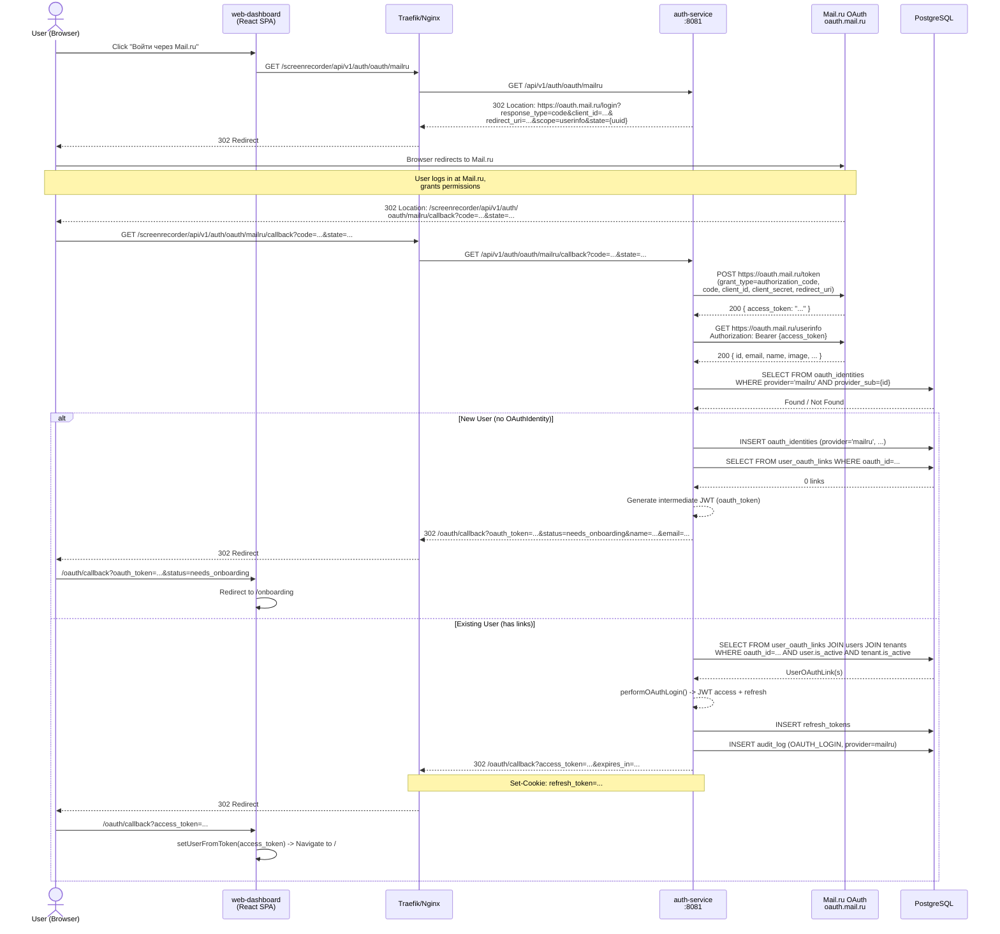
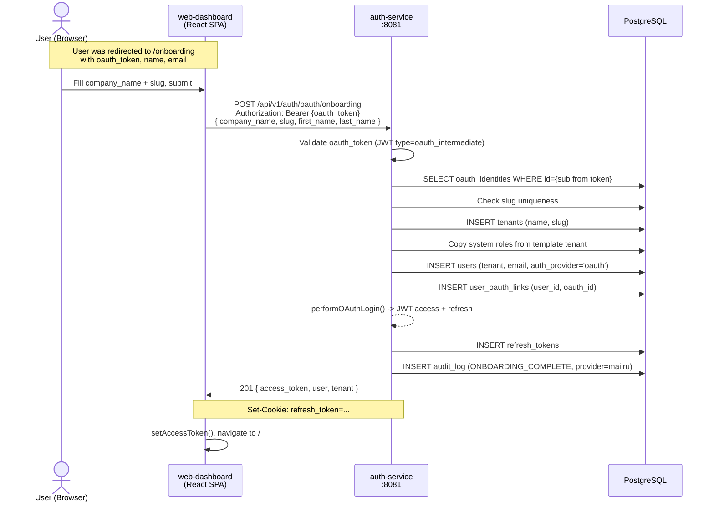

# Mail.ru OAuth -- Техническая спецификация

**Дата:** 2026-03-07  
**Автор:** Системный аналитик (Claude)  
**Статус:** Draft  
**Ветка:** feature/mailru-oauth (от feature/session-audit)  
**Связанные задачи:** T-021 -- T-030

---

## 1. Контекст и цель

В платформе Кадеро уже реализован Yandex OAuth. Необходимо добавить аналогичную интеграцию с Mail.ru OAuth 2.0, чтобы расширить возможности входа для пользователей, имеющих аккаунт Mail.ru.

### Scope

- Добавить Mail.ru как второй OAuth-провайдер (backend + frontend)
- Переиспользовать существующую инфраструктуру: `oauth_identities`, `user_oauth_links`, `OAuthService`, onboarding flow
- Новая Flyway миграция **не требуется** -- таблица `oauth_identities` уже поддерживает любой `provider`
- Все существующие процессы (onboarding, select-tenant, auto-login) работают provider-agnostic

### Ограничения

- Требуется регистрация приложения на https://oauth.mail.ru/ для получения `client_id` и `client_secret`
- Mail.ru OAuth scope: `userinfo`
- Mail.ru не поддерживает PKCE; используется стандартный Authorization Code Grant

---

## 2. Анализ существующей реализации (Yandex OAuth)

### 2.1. Компоненты (backend)

| Файл | Назначение |
|------|------------|
| `YandexOAuthConfig` | `@ConfigurationProperties(prefix = "prg.oauth.yandex")` -- endpoints + credentials |
| `YandexOAuthClient` | HTTP-клиент: `exchangeCodeForToken(code)`, `getUserInfo(accessToken)` |
| `OAuthService` | Orchestrator: `getAuthorizationUrl()`, `handleCallback()`, provider-specific mapping |
| `OAuthController` | REST: `GET /yandex`, `GET /yandex/callback`, `POST /onboarding`, `POST /select-tenant` |
| `OAuthIdentity` | JPA entity, таблица `oauth_identities` -- `provider` + `provider_sub` + email/name/avatar |
| `UserOAuthLink` | JPA entity, таблица `user_oauth_links` -- связь OAuth identity --> User |
| `SecurityConfig` | `permitAll()` на `/api/v1/auth/oauth/yandex`, `/api/v1/auth/oauth/yandex/callback` |

### 2.2. Компоненты (frontend)

| Файл | Назначение |
|------|------------|
| `LoginPage.tsx` | Кнопка "Войти через Яндекс", вызывает `getOAuthLoginUrl()` |
| `OAuthLoginPage.tsx` | Альтернативная страница с Yandex кнопкой + admin fallback |
| `OAuthCallbackPage.tsx` | Обработка callback: access_token --> auto-login, oauth_token --> onboarding |
| `api/auth.ts` | `getOAuthLoginUrl()` -- возвращает path к Yandex OAuth redirect |
| `types/auth.ts` | `OAuthCallbackResponse`, `OAuthUser`, etc. |

### 2.3. Database

Таблица `oauth_identities` (V20 миграция):
```sql
provider        VARCHAR(50) NOT NULL DEFAULT 'yandex'
provider_sub    VARCHAR(255) NOT NULL
email           VARCHAR(255) NOT NULL
name            VARCHAR(255)
avatar_url      VARCHAR(1024)
raw_attributes  JSONB NOT NULL DEFAULT '{}'
CONSTRAINT uq_oauth_provider_sub UNIQUE (provider, provider_sub)
```

Поле `provider` уже спроектировано для мультипровайдерной поддержки. UNIQUE constraint `(provider, provider_sub)` гарантирует, что `mailru` + `<mail_id>` будет уникальной записью, не конфликтуя с `yandex` + `<yandex_id>`.

### 2.4. Вывод

Архитектура **provider-agnostic** на уровне данных (таблицы, JPA entities). Однако бизнес-логика в `OAuthService` и `OAuthController` **жёстко привязана к Yandex**: вызовы `yandexClient`, Yandex-специфичный маппинг полей (`default_email`, `display_name`, `default_avatar_id`), формирование URL авторизации через `oauthConfig` (Yandex-specific).

**Стратегия:** Ввести абстракцию `OAuthProviderClient` (интерфейс) с двумя реализациями (`YandexOAuthClient`, `MailruOAuthClient`) и рефакторить `OAuthService` для маршрутизации по provider name.

---

## 3. Mail.ru OAuth 2.0 API

### 3.1. Endpoints

| Endpoint | URL |
|----------|-----|
| Authorization | `https://oauth.mail.ru/login` |
| Token Exchange | `https://oauth.mail.ru/token` |
| User Info | `https://oauth.mail.ru/userinfo` |

### 3.2. Authorization Request

```
GET https://oauth.mail.ru/login
  ?response_type=code
  &client_id={client_id}
  &redirect_uri={callback_url}
  &scope=userinfo
  &state={random_uuid}
```

### 3.3. Token Exchange

```
POST https://oauth.mail.ru/token
Content-Type: application/x-www-form-urlencoded

grant_type=authorization_code
&code={authorization_code}
&client_id={client_id}
&client_secret={client_secret}
&redirect_uri={callback_url}
```

Response:
```json
{
  "access_token": "...",
  "token_type": "bearer",
  "expires_in": 3600,
  "refresh_token": "..."
}
```

### 3.4. User Info

```
GET https://oauth.mail.ru/userinfo
Authorization: Bearer {access_token}
```

Response:
```json
{
  "id": "1234567890",
  "email": "user@mail.ru",
  "name": "Иван Иванов",
  "first_name": "Иван",
  "last_name": "Иванов",
  "nick": "ivan",
  "image": "https://filin.mail.ru/pic?d=..."
}
```

### 3.5. Маппинг полей Mail.ru --> OAuthIdentity

| Mail.ru field | OAuthIdentity field | Примечание |
|---------------|---------------------|------------|
| `id` | `provider_sub` | Уникальный ID пользователя Mail.ru |
| `email` | `email` | Основной email |
| `name` | `name` | Полное имя. Fallback: `first_name + " " + last_name` |
| `image` | `avatar_url` | URL аватара (может быть null) |
| Весь JSON | `raw_attributes` | Сохраняем полный ответ |

### 3.6. Отличия от Yandex

| Аспект | Yandex | Mail.ru |
|--------|--------|---------|
| Authorization URL | `https://oauth.yandex.ru/authorize` | `https://oauth.mail.ru/login` |
| Token URL | `https://oauth.yandex.ru/token` | `https://oauth.mail.ru/token` |
| User Info URL | `https://login.yandex.ru/info?format=json` | `https://oauth.mail.ru/userinfo` |
| Auth header format (userinfo) | `OAuth <token>` | `Bearer <token>` |
| Email field | `default_email` | `email` |
| Display name field | `display_name` | `name` |
| Avatar | `default_avatar_id` --> URL construction | `image` (ready URL) |
| Scope | (no scope needed) | `userinfo` |
| redirect_uri в token exchange | Не обязателен | Обязателен |

---

## 4. Проектирование API

### 4.1. Новые endpoints

Все по аналогии с Yandex, prefix `/api/v1/auth/oauth/mailru`:

#### 4.1.1. Initiate Mail.ru OAuth

```
GET /api/v1/auth/oauth/mailru
```

**Response:** `302 Found`  
**Location:** `https://oauth.mail.ru/login?response_type=code&client_id=...&redirect_uri=...&scope=userinfo&state=...`

**Аутентификация:** не требуется (permitAll)

#### 4.1.2. Mail.ru OAuth Callback

```
GET /api/v1/auth/oauth/mailru/callback?code={code}&state={state}
```

**Response:** `302 Found` → redirect в frontend:

| Сценарий | Redirect URL |
|----------|-------------|
| Успех (1 tenant) | `/oauth/callback?access_token=...&token_type=Bearer&expires_in=...` |
| Новый пользователь | `/oauth/callback?oauth_token=...&status=needs_onboarding&name=...&email=...` |
| Ошибка | `/login?error=...` |

**Аутентификация:** не требуется (permitAll)

#### 4.1.3. Существующие endpoints (без изменений)

- `POST /api/v1/auth/oauth/onboarding` -- уже provider-agnostic (использует oauth_token)
- `POST /api/v1/auth/oauth/select-tenant` -- уже provider-agnostic

### 4.2. OpenAPI Specification (фрагмент)

```yaml
paths:
  /api/v1/auth/oauth/mailru:
    get:
      operationId: initiateMailruOAuth
      summary: Redirect to Mail.ru authorization page
      tags: [OAuth]
      responses:
        '302':
          description: Redirect to Mail.ru authorization
          headers:
            Location:
              schema:
                type: string
                example: "https://oauth.mail.ru/login?response_type=code&client_id=abc&redirect_uri=..."

  /api/v1/auth/oauth/mailru/callback:
    get:
      operationId: handleMailruCallback
      summary: Process Mail.ru OAuth callback
      tags: [OAuth]
      parameters:
        - name: code
          in: query
          schema:
            type: string
        - name: state
          in: query
          schema:
            type: string
        - name: error
          in: query
          schema:
            type: string
      responses:
        '302':
          description: Redirect to frontend with tokens or error
          headers:
            Location:
              schema:
                type: string
```

---

## 5. Архитектура backend

### 5.1. Новые классы

#### 5.1.1. `MailruOAuthConfig`

Пакет: `com.prg.auth.config`

```java
@Data
@ConfigurationProperties(prefix = "prg.oauth.mailru")
public class MailruOAuthConfig {
    private String clientId;
    private String clientSecret;
    private String authorizeUrl = "https://oauth.mail.ru/login";
    private String tokenUrl = "https://oauth.mail.ru/token";
    private String userInfoUrl = "https://oauth.mail.ru/userinfo";
    private String callbackUrl;
    private String scope = "userinfo";
}
```

#### 5.1.2. `MailruOAuthClient`

Пакет: `com.prg.auth.service`

```java
@Slf4j
@Service
public class MailruOAuthClient {

    private final MailruOAuthConfig config;
    private final RestTemplate restTemplate;

    // exchangeCodeForToken(String code) -> String accessToken
    //   POST config.tokenUrl
    //   Content-Type: application/x-www-form-urlencoded
    //   Body: grant_type=authorization_code&code=...&client_id=...&client_secret=...&redirect_uri=...
    //   ВАЖНО: redirect_uri обязателен для Mail.ru (отличие от Yandex)

    // getUserInfo(String accessToken) -> Map<String, Object>
    //   GET config.userInfoUrl
    //   Authorization: Bearer <accessToken>
    //   ВАЖНО: Mail.ru использует "Bearer", а не "OAuth" как Yandex
}
```

### 5.2. Изменения в существующих классах

#### 5.2.1. `OAuthService`

Добавить:
- Инъекция `MailruOAuthClient` и `MailruOAuthConfig`
- Константа `PROVIDER_MAILRU = "mailru"`
- Метод `getMailruAuthorizationUrl()` -- аналог `getAuthorizationUrl()`, но с `scope=userinfo`
- Метод `handleMailruCallback(code, state, ipAddress, userAgent)` -- аналог `handleCallback()`, но:
  - Использует `mailruClient.exchangeCodeForToken(code)` и `mailruClient.getUserInfo(token)`
  - Маппинг полей: `id` -> providerSub, `email` -> email, `name` -> name (с fallback на `first_name + last_name`), `image` -> avatarUrl
  - `provider = "mailru"`
  - Дальнейшая логика (find/create OAuthIdentity, links, onboarding) -- **идентична** Yandex

**Рефакторинг (рекомендация):** Извлечь общую логику обработки callback в private метод:

```java
private OAuthCallbackResult processOAuthCallback(
    String provider,
    String providerSub,
    String email,
    String displayName,
    String avatarUrl,
    Map<String, Object> rawAttributes,
    String ipAddress,
    String userAgent
)
```

Этот метод инкапсулирует шаги 3-7 из текущего `handleCallback()`:
1. Find or create `OAuthIdentity`
2. Find active `UserOAuthLink`s
3. Return needs_onboarding / authenticated / tenant_selection

#### 5.2.2. `OAuthController`

Добавить два новых endpoint:

```java
@GetMapping("/mailru")
public ResponseEntity<Void> initiateMailruOAuth() {
    String authorizationUrl = oauthService.getMailruAuthorizationUrl();
    return ResponseEntity.status(HttpStatus.FOUND)
            .header("Location", authorizationUrl)
            .build();
}

@GetMapping("/mailru/callback")
public ResponseEntity<Void> handleMailruCallback(
        @RequestParam(required = false) String code,
        @RequestParam(required = false) String state,
        @RequestParam(required = false) String error,
        HttpServletRequest httpRequest,
        HttpServletResponse httpResponse) {
    // Полностью аналогично handleYandexCallback, но вызывает
    // oauthService.handleMailruCallback(code, state, ipAddress, userAgent)
}
```

**Рефакторинг (рекомендация):** Извлечь общий private метод `processOAuthCallback(provider, code, state, error, request, response)`.

#### 5.2.3. `SecurityConfig`

Добавить в `permitAll()`:
```java
"/api/v1/auth/oauth/mailru",
"/api/v1/auth/oauth/mailru/callback",
```

#### 5.2.4. `application.yml`

```yaml
prg:
  oauth:
    mailru:
      client-id: ${MAILRU_OAUTH_CLIENT_ID:}
      client-secret: ${MAILRU_OAUTH_CLIENT_SECRET:}
      authorize-url: https://oauth.mail.ru/login
      token-url: https://oauth.mail.ru/token
      user-info-url: https://oauth.mail.ru/userinfo
      callback-url: ${MAILRU_OAUTH_CALLBACK_URL:}
      scope: userinfo
```

### 5.3. Аудит

При OAuth login через Mail.ru, `auditService.logAction()` должен логировать `"provider": "mailru"` (а не `"yandex"`). Текущий `performOAuthLogin()` захардкожен на `PROVIDER_YANDEX` -- необходимо передавать provider как параметр.

Изменение сигнатуры:
```java
public AuthResult<LoginResponse> performOAuthLogin(
    User user, Tenant tenant, String ipAddress, String userAgent, String provider)
```

---

## 6. Database (миграции)

### 6.1. Новая миграция НЕ требуется

Таблица `oauth_identities` уже поддерживает произвольные значения `provider`:
- `provider VARCHAR(50)` -- нет CHECK constraint, любая строка до 50 символов
- UNIQUE `(provider, provider_sub)` -- гарантирует уникальность записей для каждого провайдера

Значение `provider` для Mail.ru: `"mailru"` (lowercase, без пробелов, без точек).

### 6.2. DEFAULT значение `'yandex'`

В миграции V20 стоит `DEFAULT 'yandex'` -- это не мешает, т.к. в Java-коде значение всегда задаётся явно через `identity.setProvider("mailru")`.

### 6.3. Опциональная миграция (V29)

Если решено убрать Yandex-специфичный DEFAULT:

```sql
-- V29__oauth_identities_remove_yandex_default.sql
ALTER TABLE oauth_identities ALTER COLUMN provider DROP DEFAULT;
```

Это **опционально** и не влияет на работоспособность. Рекомендуется для чистоты схемы.

---

## 7. Frontend

### 7.1. Изменения

#### 7.1.1. `api/auth.ts`

Добавить:
```typescript
export function getMailruOAuthLoginUrl(): string {
  const basePath = import.meta.env.BASE_URL.replace(/\/$/, '');
  return `${basePath}/api/v1/auth/oauth/mailru`;
}
```

#### 7.1.2. `LoginPage.tsx`

Добавить кнопку "Войти через Mail.ru" рядом с кнопкой Яндекс:

```tsx
<button
  type="button"
  onClick={() => { window.location.href = getMailruOAuthLoginUrl(); }}
  className="flex w-full items-center justify-center gap-3 rounded-lg bg-[#005FF9] px-4 py-3 text-sm font-semibold text-white shadow-sm hover:bg-[#0052D9] transition-colors"
>
  {/* Mail.ru icon SVG */}
  Войти через Mail.ru
</button>
```

Фирменный цвет Mail.ru: `#005FF9` (синий).

#### 7.1.3. `OAuthLoginPage.tsx`

Добавить кнопку Mail.ru аналогично LoginPage.

#### 7.1.4. `OAuthCallbackPage.tsx`

**Без изменений.** Callback route `/oauth/callback` уже provider-agnostic -- он оперирует `access_token` и `oauth_token` без привязки к провайдеру.

#### 7.1.5. `OnboardingPage.tsx`

**Без изменений.** Onboarding flow использует `oauth_token` (JWT intermediate), который provider-agnostic.

### 7.2. UI Layout

На `LoginPage`:
```
[Войти по паролю form]
--- или ---
[Войти по email]
--- или ---
[Войти через Яндекс]   <-- существующая кнопка (черная)
[Войти через Mail.ru]   <-- новая кнопка (синяя #005FF9)
```

Кнопки OAuth идут вертикально, каждая во всю ширину карточки, с gap-3.

---

## 8. Конфигурация развертывания

### 8.1. Kubernetes Secrets / Environment Variables

Новые env variables для auth-service deployment:

```yaml
env:
  - name: MAILRU_OAUTH_CLIENT_ID
    valueFrom:
      secretKeyRef:
        name: auth-service-secrets
        key: MAILRU_OAUTH_CLIENT_ID
  - name: MAILRU_OAUTH_CLIENT_SECRET
    valueFrom:
      secretKeyRef:
        name: auth-service-secrets
        key: MAILRU_OAUTH_CLIENT_SECRET
  - name: MAILRU_OAUTH_CALLBACK_URL
    value: "https://services-test.shepaland.ru/screenrecorder/api/v1/auth/oauth/mailru/callback"
```

### 8.2. Callback URL по средам

| Среда | Callback URL |
|-------|-------------|
| test | `https://services-test.shepaland.ru/screenrecorder/api/v1/auth/oauth/mailru/callback` |
| prod | `https://services.shepaland.ru/screenrecorder/api/v1/auth/oauth/mailru/callback` |
| local | `http://localhost:8081/api/v1/auth/oauth/mailru/callback` |

### 8.3. Регистрация приложения Mail.ru

1. Зайти на https://oauth.mail.ru/
2. Создать новое приложение
3. Указать redirect URI (callback URL)
4. Включить scope `userinfo`
5. Получить `client_id` и `client_secret`
6. Сохранить в Kubernetes Secret `auth-service-secrets`

---

## 9. Sequence Diagram

### 9.1. Mail.ru OAuth Login Flow (Happy Path)



### 9.2. Onboarding Flow (после Mail.ru OAuth, новый пользователь)



---

## 10. Security Considerations

### 10.1. State Parameter (CSRF Protection)

- `state` = `UUID.randomUUID().toString()`
- **Текущая реализация (Yandex):** state генерируется, но **не валидируется** на callback. Это потенциальная уязвимость CSRF.
- **Рекомендация:** Реализовать server-side state хранение (кэш с TTL 10 мин) и валидацию на callback. Эта задача общая для обоих провайдеров и должна быть отдельным security fix.
- **Для MVP Mail.ru:** Поведение идентично Yandex (state генерируется, но не проверяется). Вынести fix в отдельную задачу.

### 10.2. Client Secret Storage

- `client_secret` хранится в Kubernetes Secret, передается через env variable
- Никогда не передаётся клиенту (frontend)
- Используется только server-side при token exchange

### 10.3. Token Exchange -- Server-to-Server

- Token exchange происходит backend --> Mail.ru (server-to-server)
- Authorization code одноразовый, не переиспользуется

### 10.4. Redirect URI Validation

- Mail.ru валидирует `redirect_uri` на стороне провайдера
- `redirect_uri` должен точно совпадать с зарегистрированным в настройках приложения Mail.ru

### 10.5. Email Trust

- Mail.ru предоставляет верифицированный email
- Используется как `email` в `OAuthIdentity`
- **НЕ используется** для автоматической привязки к существующим аккаунтам (только через `provider + provider_sub`)

### 10.6. Scope Минимизация

- Запрашивается только `userinfo` -- минимальный scope для получения базовой информации о пользователе
- Не запрашиваются scopes для доступа к почте, контактам и т.п.

### 10.7. Открытые security-задачи (для review)

1. **State validation** -- отсутствует для обоих провайдеров (CSRF risk)
2. **Rate limiting** на OAuth callback endpoints -- предотвращение brute-force по code
3. **Logging sensitive data** -- убедиться что authorization code и tokens не попадают в логи (уровень выше DEBUG)
4. **Token response validation** -- проверять `token_type`, `expires_in` в ответе Mail.ru

---

## 11. Тестирование

### 11.1. Unit Tests

| Тест | Описание |
|------|----------|
| `MailruOAuthClientTest.exchangeCodeForToken` | Mock RestTemplate, проверка формирования запроса (включая redirect_uri) |
| `MailruOAuthClientTest.getUserInfo` | Mock RestTemplate, проверка Bearer auth header (не OAuth) |
| `MailruOAuthClientTest.exchangeCodeForToken_error` | Обработка ошибки от Mail.ru |
| `OAuthServiceTest.handleMailruCallback_newUser` | Новый пользователь --> needs_onboarding |
| `OAuthServiceTest.handleMailruCallback_existingUser` | Существующий пользователь --> authenticated |
| `OAuthServiceTest.getMailruAuthorizationUrl` | Проверка URL с scope=userinfo |

### 11.2. Integration Tests

| Тест | Описание |
|------|----------|
| `OAuthControllerIT.initiateMailruOAuth` | GET /mailru -> 302, Location содержит oauth.mail.ru |
| `OAuthControllerIT.mailruCallback_success` | Mock Mail.ru server, полный flow |
| `OAuthControllerIT.mailruCallback_error` | error parameter -> redirect to /login?error= |

### 11.3. E2E (Manual)

1. Нажать "Войти через Mail.ru"
2. Авторизоваться на Mail.ru
3. Проверить redirect обратно в приложение
4. Проверить что user создан / залогинен
5. Проверить onboarding flow для нового пользователя
6. Проверить что один email с разными провайдерами создаёт разные OAuthIdentity

---

## 12. Checklist влияния на компоненты

| Компонент | Изменение | Обратная совместимость |
|-----------|-----------|----------------------|
| `auth-service` / `MailruOAuthConfig` | Новый класс | Нет влияния |
| `auth-service` / `MailruOAuthClient` | Новый класс | Нет влияния |
| `auth-service` / `OAuthService` | Новые методы + рефакторинг provider param | Совместимо (Yandex flow не меняется) |
| `auth-service` / `OAuthController` | 2 новых endpoint | Совместимо |
| `auth-service` / `SecurityConfig` | 2 новых permitAll URL | Совместимо |
| `auth-service` / `application.yml` | Новый блок `prg.oauth.mailru` | Совместимо (все env optional) |
| `auth-service` / `performOAuthLogin()` | Новый param `provider` | Minor refactor |
| `web-dashboard` / `LoginPage.tsx` | Новая кнопка | Совместимо |
| `web-dashboard` / `OAuthLoginPage.tsx` | Новая кнопка | Совместимо |
| `web-dashboard` / `api/auth.ts` | Новая функция | Совместимо |
| `web-dashboard` / `OAuthCallbackPage.tsx` | Без изменений | -- |
| `web-dashboard` / `OnboardingPage.tsx` | Без изменений | -- |
| Database / `oauth_identities` | Без изменений (provider='mailru') | -- |
| Database / `user_oauth_links` | Без изменений | -- |
| k8s / auth-service deployment | Новые env variables | Совместимо (optional) |
| `control-plane` | Без изменений | -- |
| `ingest-gateway` | Без изменений | -- |
| `playback-service` | Без изменений | -- |
| `search-service` | Без изменений | -- |

---

## 13. Декомпозиция задач

| ID | Тип | Заголовок | Приоритет | Исполнитель |
|----|-----|-----------|-----------|-------------|
| T-021 | Task | MailruOAuthConfig: конфигурация Mail.ru OAuth | High | Backend |
| T-022 | Task | MailruOAuthClient: HTTP-клиент для Mail.ru OAuth | High | Backend |
| T-023 | Task | OAuthService: методы для Mail.ru (getMailruAuthorizationUrl, handleMailruCallback) | High | Backend |
| T-024 | Task | OAuthService: рефакторинг -- извлечь общий processOAuthCallback | Medium | Backend |
| T-025 | Task | OAuthService: передать provider в performOAuthLogin для аудита | Medium | Backend |
| T-026 | Task | OAuthController: endpoints GET /mailru и GET /mailru/callback | High | Backend |
| T-027 | Task | SecurityConfig: permitAll для /mailru и /mailru/callback | High | Backend |
| T-028 | Task | Frontend: кнопка "Войти через Mail.ru" + getMailruOAuthLoginUrl | High | Frontend |
| T-029 | Task | Kubernetes: env variables MAILRU_OAUTH_* в deployment | Medium | DevOps |
| T-030 | Task | Деплой Mail.ru OAuth на test стейджинг | High | DevOps |

---

## 14. Зависимости и порядок реализации

```
T-021 (Config) ──┐
                  ├──> T-022 (Client) ──┐
                  │                      ├──> T-023 (Service) ──┐
T-024 (Refactor) ─┤                      │                      ├──> T-026 (Controller) ──┐
T-025 (Audit fix) ┘                      │                      │                          ├──> T-030 (Deploy)
                                         │    T-027 (Security) ─┘                          │
                                         │                                                 │
                                         └──> T-028 (Frontend) ──> T-029 (K8s) ──────────┘
```

Критический путь: T-021 --> T-022 --> T-023 --> T-026 + T-027 --> T-030

---

## 15. Приложение: Регистрация приложения на Mail.ru

### Шаги:

1. Перейти на https://oauth.mail.ru/
2. Войти под аккаунтом администратора
3. Нажать "Добавить проект" / "Новое приложение"
4. Указать:
   - Название: "Кадеро" (или "Kadero Screen Recorder")
   - Тип: Web
   - Redirect URI (test): `https://services-test.shepaland.ru/screenrecorder/api/v1/auth/oauth/mailru/callback`
   - Redirect URI (prod): `https://services.shepaland.ru/screenrecorder/api/v1/auth/oauth/mailru/callback`
5. Включить scope: `userinfo`
6. Сохранить `client_id` и `client_secret`
7. Добавить в Kubernetes Secrets обеих сред

---

*Документ подготовлен для security review. Основные security concerns описаны в разделе 10.*
