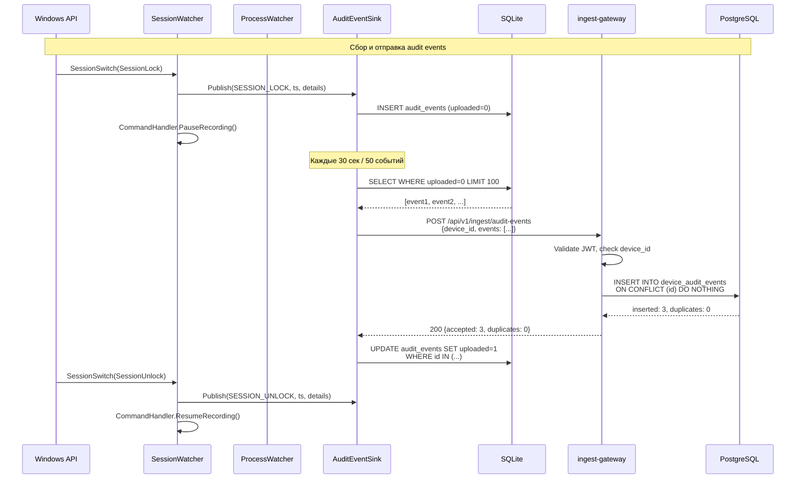
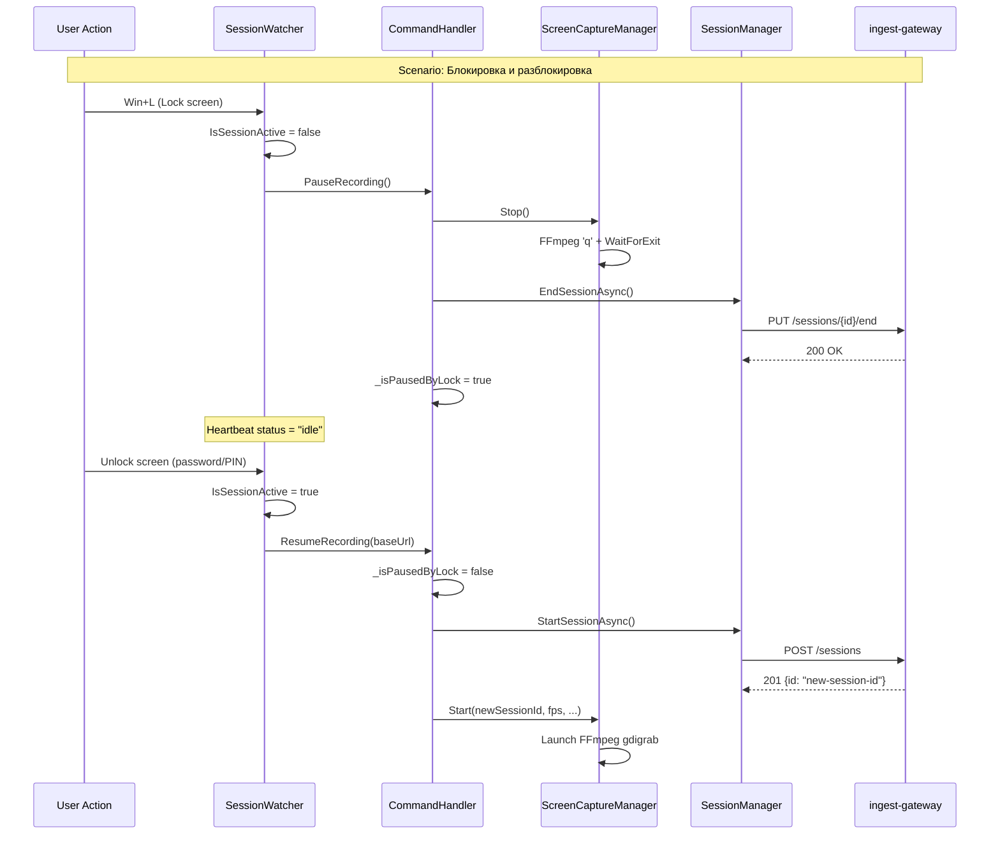
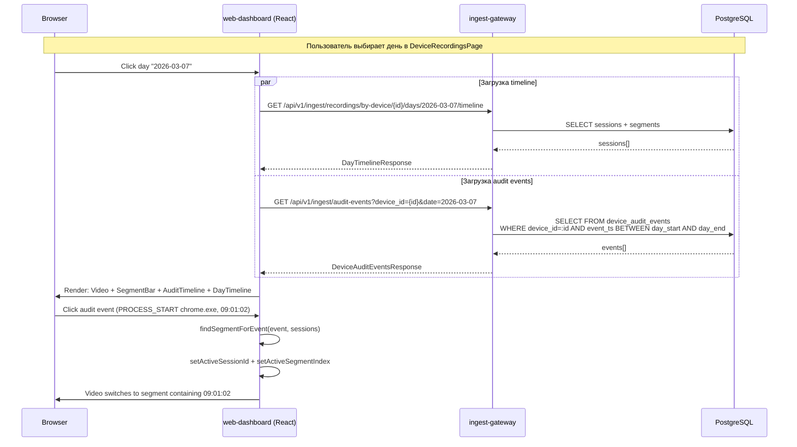
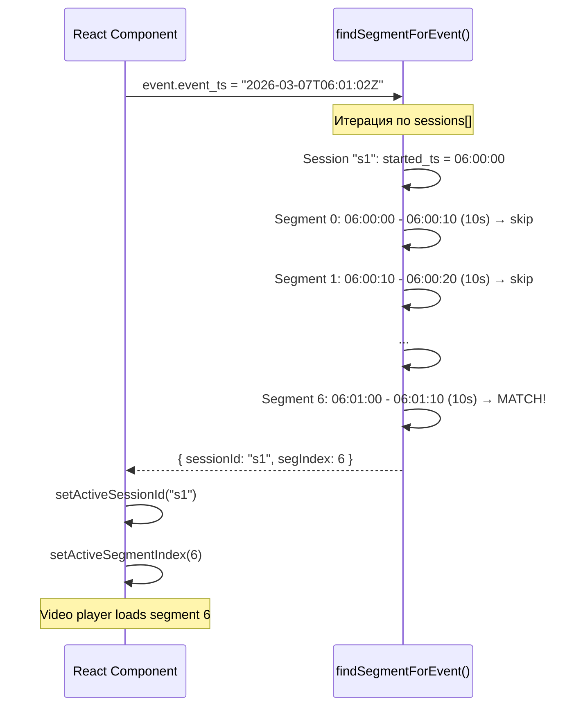

# Session-Aware Recording & User Activity Audit

**Версия:** 1.0  
**Дата:** 2026-03-07  
**Автор:** System Analyst  
**Статус:** Draft  
**Затронутые компоненты:** Windows Agent (.NET/C#), ingest-gateway (Java/Spring Boot), web-dashboard (React/TypeScript)

---

## 1. Обзор фичи

Фича состоит из трёх связанных подсистем:

1. **Session-Aware Recording** — агент записывает экран ТОЛЬКО при активной пользовательской сессии (компьютер разблокирован). При блокировке/логауте запись автоматически останавливается, при разблокировке/логине — возобновляется.

2. **User Activity Audit** — агент отслеживает и отправляет на сервер события: блокировка/разблокировка компьютера, логин/логаут, запуск/остановка приложений пользователя.

3. **Audit Timeline UI** — в web-dashboard на странице DeviceRecordingsPage отображается лента событий аудита под видеоплеером. Клик по событию переключает видео на соответствующий сегмент.

---

## 2. User Stories

### US-1: Session-Aware Recording
**Как** администратор контактного центра,  
**я хочу,** чтобы запись экрана автоматически приостанавливалась при блокировке/логауте оператора и возобновлялась при разблокировке/логине,  
**чтобы** не тратить дисковое пространство и трафик на запись заблокированного экрана.

**Acceptance Criteria:**
- AC-1.1: При блокировке экрана (Win+L) запись FFmpeg останавливается в течение 5 секунд.
- AC-1.2: Текущая recording session завершается (EndSession на сервере).
- AC-1.3: При разблокировке экрана запись возобновляется автоматически (новая session).
- AC-1.4: При логауте пользователя запись останавливается.
- AC-1.5: При логине пользователя запись возобновляется (если auto_start = true).
- AC-1.6: Heartbeat продолжает отправляться при заблокированном экране (статус = `idle`).
- AC-1.7: В PipeProtocol AgentStatus добавляется поле `session_locked: bool`.

### US-2: User Activity Audit — сбор на агенте
**Как** руководитель отдела,  
**я хочу,** чтобы агент фиксировал события блокировки/разблокировки, логина/логаута и запуска/остановки приложений оператора,  
**чтобы** видеть активность оператора за рабочий день.

**Acceptance Criteria:**
- AC-2.1: Агент генерирует событие `SESSION_LOCK` при блокировке экрана.
- AC-2.2: Агент генерирует событие `SESSION_UNLOCK` при разблокировке.
- AC-2.3: Агент генерирует событие `SESSION_LOGON` при входе пользователя.
- AC-2.4: Агент генерирует событие `SESSION_LOGOFF` при выходе пользователя.
- AC-2.5: Агент генерирует событие `PROCESS_START` при запуске приложения пользователем (исключая системные процессы).
- AC-2.6: Агент генерирует событие `PROCESS_STOP` при закрытии приложения пользователем.
- AC-2.7: Каждое событие содержит: event_type, timestamp (UTC ISO 8601), дополнительные данные (имя процесса, PID, заголовок окна).
- AC-2.8: События буферизируются локально (SQLite) и отправляются на сервер батчами.
- AC-2.9: Фильтрация системных процессов: не отслеживаются процессы из `C:\Windows\`, сервисные процессы (session 0).

### US-3: User Activity Audit — приём на сервере
**Как** бэкенд-система,  
**я хочу** принимать батчи audit events от агентов и сохранять их в PostgreSQL,  
**чтобы** обеспечить хранение и поиск событий.

**Acceptance Criteria:**
- AC-3.1: Endpoint `POST /api/v1/ingest/audit-events` принимает батч до 100 событий.
- AC-3.2: Events сохраняются в партиционированную таблицу `device_audit_events`.
- AC-3.3: Идемпотентность: повторная отправка того же event_id не создаёт дубликат.
- AC-3.4: Tenant isolation: event привязан к tenant_id из JWT.
- AC-3.5: Ответ содержит количество принятых/дедуплицированных событий.

### US-4: Audit Timeline в UI
**Как** супервайзер контактного центра,  
**я хочу** видеть ленту событий аудита (блокировки, приложения) под видеоплеером при просмотре записей,  
**чтобы** понимать контекст действий оператора в каждый момент времени.

**Acceptance Criteria:**
- AC-4.1: На странице DeviceRecordingsPage под видеоплеером отображается панель аудита.
- AC-4.2: События отображаются с иконками по типу и временными метками.
- AC-4.3: Клик по событию переключает видео на сегмент, содержащий момент этого события.
- AC-4.4: Панель аудита прокручивается горизонтально и синхронизирована с DayTimeline.
- AC-4.5: Endpoint `GET /api/v1/ingest/audit-events` возвращает события по device_id + date range.
- AC-4.6: Загрузка событий происходит при выборе дня, параллельно с загрузкой timeline.

---

## 3. Модель данных

### 3.1 Таблица `device_audit_events` (PostgreSQL)

Партиционированная по месяцам (как `segments` и `audit_log`).

```sql
-- V28__create_device_audit_events.sql

CREATE TABLE device_audit_events (
    id              UUID            NOT NULL DEFAULT gen_random_uuid(),
    created_ts      TIMESTAMPTZ     NOT NULL DEFAULT NOW(),

    tenant_id       UUID            NOT NULL,
    device_id       UUID            NOT NULL,
    session_id      UUID,                       -- recording session (nullable, запись может быть остановлена)

    event_type      VARCHAR(30)     NOT NULL
        CHECK (event_type IN (
            'SESSION_LOCK', 'SESSION_UNLOCK',
            'SESSION_LOGON', 'SESSION_LOGOFF',
            'PROCESS_START', 'PROCESS_STOP'
        )),

    event_ts        TIMESTAMPTZ     NOT NULL,   -- точное время события на клиенте (UTC)

    details         JSONB           NOT NULL DEFAULT '{}'::jsonb,
    --  Для SESSION_*:  { "windows_session_id": 1 }
    --  Для PROCESS_*:  { "process_name": "chrome.exe", "pid": 12345,
    --                     "window_title": "Google Chrome", "exe_path": "C:\\..." }

    correlation_id  UUID,                       -- для идемпотентности батчей

    PRIMARY KEY (id, created_ts)
) PARTITION BY RANGE (created_ts);

-- Месячные партиции на 2026 год
CREATE TABLE device_audit_events_2026_01 PARTITION OF device_audit_events
    FOR VALUES FROM ('2026-01-01') TO ('2026-02-01');
CREATE TABLE device_audit_events_2026_02 PARTITION OF device_audit_events
    FOR VALUES FROM ('2026-02-01') TO ('2026-03-01');
CREATE TABLE device_audit_events_2026_03 PARTITION OF device_audit_events
    FOR VALUES FROM ('2026-03-01') TO ('2026-04-01');
CREATE TABLE device_audit_events_2026_04 PARTITION OF device_audit_events
    FOR VALUES FROM ('2026-04-01') TO ('2026-05-01');
CREATE TABLE device_audit_events_2026_05 PARTITION OF device_audit_events
    FOR VALUES FROM ('2026-05-01') TO ('2026-06-01');
CREATE TABLE device_audit_events_2026_06 PARTITION OF device_audit_events
    FOR VALUES FROM ('2026-06-01') TO ('2026-07-01');
CREATE TABLE device_audit_events_2026_07 PARTITION OF device_audit_events
    FOR VALUES FROM ('2026-07-01') TO ('2026-08-01');
CREATE TABLE device_audit_events_2026_08 PARTITION OF device_audit_events
    FOR VALUES FROM ('2026-08-01') TO ('2026-09-01');
CREATE TABLE device_audit_events_2026_09 PARTITION OF device_audit_events
    FOR VALUES FROM ('2026-09-01') TO ('2026-10-01');
CREATE TABLE device_audit_events_2026_10 PARTITION OF device_audit_events
    FOR VALUES FROM ('2026-10-01') TO ('2026-11-01');
CREATE TABLE device_audit_events_2026_11 PARTITION OF device_audit_events
    FOR VALUES FROM ('2026-11-01') TO ('2026-12-01');
CREATE TABLE device_audit_events_2026_12 PARTITION OF device_audit_events
    FOR VALUES FROM ('2026-12-01') TO ('2027-01-01');

-- Индексы
-- Основной запрос: по device_id + дата (для UI timeline)
CREATE INDEX idx_dae_device_event_ts
    ON device_audit_events (device_id, event_ts DESC, created_ts);

-- Tenant isolation + время
CREATE INDEX idx_dae_tenant_event_ts
    ON device_audit_events (tenant_id, event_ts DESC, created_ts);

-- Поиск по типу события
CREATE INDEX idx_dae_device_type
    ON device_audit_events (device_id, event_type, event_ts DESC, created_ts);

-- Идемпотентность: уникальность event по id (дедупликация батчей)
CREATE UNIQUE INDEX idx_dae_id_unique
    ON device_audit_events (id, created_ts);

-- GIN индекс на details для поиска по process_name
CREATE INDEX idx_dae_details_gin
    ON device_audit_events USING GIN (details jsonb_path_ops);

COMMENT ON TABLE device_audit_events IS 'Device user activity events (lock/unlock, logon/logoff, process start/stop). Partitioned monthly.';
COMMENT ON COLUMN device_audit_events.event_ts IS 'Client-side event timestamp in UTC. Different from created_ts which is server insert time.';
COMMENT ON COLUMN device_audit_events.session_id IS 'Active recording session at event time. NULL if no recording was active.';
```

### 3.2 Таблица в локальной SQLite (агент)

Добавляется к существующей `LocalDatabase.cs`:

```sql
CREATE TABLE IF NOT EXISTS audit_events (
    id           TEXT PRIMARY KEY,       -- UUID, генерируется на агенте
    event_type   TEXT NOT NULL,
    event_ts     TEXT NOT NULL,          -- ISO 8601 UTC
    session_id   TEXT,                   -- текущая recording session
    details      TEXT NOT NULL DEFAULT '{}',  -- JSON
    uploaded     INTEGER DEFAULT 0,      -- 0 = pending, 1 = uploaded
    created_ts   TEXT DEFAULT (datetime('now'))
);

CREATE INDEX IF NOT EXISTS idx_audit_events_uploaded
    ON audit_events (uploaded, created_ts);
```

### 3.3 Связь таблиц (ER-диаграмма)

```
devices (1) ----< (N) device_audit_events
                       |
recording_sessions (1) ---< (N) device_audit_events (optional FK via session_id)
                       |
tenants (1) ----< (N) device_audit_events
```

Нет жёстких FK (как и в таблице `segments`), чтобы не блокировать INSERT-производительность при 10 000 устройств. Консистентность обеспечивается tenant_id из JWT.

---

## 4. API контракты

### 4.1 Приём audit events от агента

```
POST /api/v1/ingest/audit-events
Authorization: Bearer <device-jwt>
Content-Type: application/json
X-Correlation-ID: <uuid>
```

**Request body:**
```json
{
    "device_id": "60b50ed1-9dfd-4592-86e3-c1e2861d3942",
    "events": [
        {
            "id": "a1b2c3d4-e5f6-7890-abcd-ef1234567890",
            "event_type": "SESSION_UNLOCK",
            "event_ts": "2026-03-07T09:00:15.123Z",
            "session_id": "550e8400-e29b-41d4-a716-446655440000",
            "details": {
                "windows_session_id": 1
            }
        },
        {
            "id": "b2c3d4e5-f6a7-8901-bcde-f12345678901",
            "event_type": "PROCESS_START",
            "event_ts": "2026-03-07T09:01:02.456Z",
            "session_id": "550e8400-e29b-41d4-a716-446655440000",
            "details": {
                "process_name": "chrome.exe",
                "pid": 12345,
                "window_title": "Google Chrome",
                "exe_path": "C:\\Program Files\\Google\\Chrome\\Application\\chrome.exe"
            }
        },
        {
            "id": "c3d4e5f6-a7b8-9012-cdef-123456789012",
            "event_type": "SESSION_LOCK",
            "event_ts": "2026-03-07T12:30:00.789Z",
            "session_id": null,
            "details": {
                "windows_session_id": 1
            }
        }
    ]
}
```

**Constraints:**
| Поле | Тип | Required | Constraints |
|------|-----|----------|-------------|
| `device_id` | UUID | yes | Должен совпадать с device_id из JWT |
| `events` | array | yes | 1..100 элементов |
| `events[].id` | UUID | yes | Генерируется агентом, уникален |
| `events[].event_type` | string | yes | Enum: SESSION_LOCK, SESSION_UNLOCK, SESSION_LOGON, SESSION_LOGOFF, PROCESS_START, PROCESS_STOP |
| `events[].event_ts` | string (ISO 8601) | yes | Не в будущем (> now + 5min = reject) |
| `events[].session_id` | UUID | no | Текущая recording session, null если запись не активна |
| `events[].details` | object | yes | JSON, до 4 KB |

**Response 200 OK:**
```json
{
    "accepted": 3,
    "duplicates": 0,
    "correlation_id": "f47ac10b-58cc-4372-a567-0e02b2c3d479"
}
```

**Response 400 Bad Request:**
```json
{
    "error": "Validation failed: events[0].event_type is invalid",
    "code": "VALIDATION_ERROR"
}
```

**Response 403 Forbidden:**
```json
{
    "error": "device_id mismatch with JWT claims",
    "code": "DEVICE_MISMATCH"
}
```

**Коды ошибок:**
| HTTP | Code | Описание |
|------|------|----------|
| 200 | — | Events приняты |
| 400 | VALIDATION_ERROR | Невалидный request body |
| 401 | UNAUTHORIZED | Невалидный/просроченный JWT |
| 403 | DEVICE_MISMATCH | device_id не совпадает с JWT |
| 413 | BATCH_TOO_LARGE | Больше 100 событий в батче |
| 429 | RATE_LIMIT_EXCEEDED | Больше 10 батчей/мин с одного device |

---

### 4.2 Получение audit events для UI

```
GET /api/v1/ingest/audit-events
Authorization: Bearer <user-jwt>
```

**Query parameters:**
| Параметр | Тип | Required | Default | Описание |
|----------|-----|----------|---------|----------|
| `device_id` | UUID | yes | — | Устройство |
| `date` | string (YYYY-MM-DD) | yes | — | Дата в timezone устройства |
| `event_type` | string | no | all | Фильтр по типу (comma-separated) |
| `page` | int | no | 0 | Страница |
| `size` | int | no | 500 | Размер (max 1000) |

**Response 200 OK:**
```json
{
    "device_id": "60b50ed1-9dfd-4592-86e3-c1e2861d3942",
    "date": "2026-03-07",
    "timezone": "Europe/Moscow",
    "total_elements": 127,
    "events": [
        {
            "id": "a1b2c3d4-e5f6-7890-abcd-ef1234567890",
            "event_type": "SESSION_UNLOCK",
            "event_ts": "2026-03-07T06:00:15.123Z",
            "session_id": "550e8400-e29b-41d4-a716-446655440000",
            "details": {
                "windows_session_id": 1
            }
        },
        {
            "id": "b2c3d4e5-f6a7-8901-bcde-f12345678901",
            "event_type": "PROCESS_START",
            "event_ts": "2026-03-07T06:01:02.456Z",
            "session_id": "550e8400-e29b-41d4-a716-446655440000",
            "details": {
                "process_name": "chrome.exe",
                "pid": 12345,
                "window_title": "Google Chrome",
                "exe_path": "C:\\Program Files\\Google\\Chrome\\Application\\chrome.exe"
            }
        }
    ]
}
```

**Требуемое разрешение:** `RECORDINGS:READ`

**Коды ошибок:**
| HTTP | Code | Описание |
|------|------|----------|
| 200 | — | Events возвращены |
| 400 | VALIDATION_ERROR | Невалидные параметры |
| 401 | UNAUTHORIZED | Невалидный JWT |
| 403 | INSUFFICIENT_PERMISSIONS | Нет разрешения RECORDINGS:READ |
| 404 | DEVICE_NOT_FOUND | Устройство не найдено в tenant |

---

## 5. Архитектура компонентов

### 5.1 Windows Agent — новые модули

#### 5.1.1 `Audit/SessionWatcher.cs` — мониторинг Windows-сессии

Использует `Microsoft.Win32.SystemEvents` для отслеживания lock/unlock/logon/logoff:

```
SystemEvents.SessionSwitch += OnSessionSwitch
  SessionSwitchReason.SessionLock    → SESSION_LOCK
  SessionSwitchReason.SessionUnlock  → SESSION_UNLOCK
  SessionSwitchReason.SessionLogon   → SESSION_LOGON
  SessionSwitchReason.SessionLogoff  → SESSION_LOGOFF
```

Также использует WTS API (`WTSQuerySessionInformation`) для определения начального состояния сессии при старте агента.

**Требования к реализации:**
- Регистрируется как `BackgroundService` в DI контейнере.
- Публикует события через `IAuditEventSink` (интерфейс).
- При SESSION_LOCK вызывает `CommandHandler.PauseRecording()`.
- При SESSION_UNLOCK вызывает `CommandHandler.ResumeRecording()`.
- Потокобезопасность: все обращения к состоянию через `lock` или `SemaphoreSlim`.

#### 5.1.2 `Audit/ProcessWatcher.cs` — мониторинг процессов

Использует WMI Events (`ManagementEventWatcher`) для отслеживания запуска/остановки процессов:

```csharp
// Запуск процессов
new WqlEventQuery("SELECT * FROM __InstanceCreationEvent WITHIN 2 WHERE TargetInstance ISA 'Win32_Process'");

// Остановка процессов  
new WqlEventQuery("SELECT * FROM __InstanceDeletionEvent WITHIN 2 WHERE TargetInstance ISA 'Win32_Process'");
```

**Фильтрация:**
- Исключить процессы из `C:\Windows\` (svchost, csrss, etc.)
- Исключить Session 0 процессы (системные сервисы)
- Исключить короткоживущие процессы (< 3 сек) — debounce
- Исключить процессы без окон (фоновые worker-ы)
- Whitelist популярных приложений: chrome, firefox, edge, outlook, excel, word, 1c, teams, slack, telegram, и т.д.

**Альтернативный подход (рекомендуемый):** Вместо WMI, использовать `EnumWindows`/`SetWinEventHook` с `EVENT_OBJECT_CREATE`/`EVENT_OBJECT_DESTROY` для отслеживания только окон верхнего уровня (top-level windows). Это:
- Меньше нагрузки, чем WMI
- Автоматически фильтрует фоновые процессы
- Даёт window title

**Данные события PROCESS_START/PROCESS_STOP:**
```json
{
    "process_name": "chrome.exe",
    "pid": 12345,
    "window_title": "Почта - Google Chrome",
    "exe_path": "C:\\Program Files\\Google\\Chrome\\Application\\chrome.exe"
}
```

#### 5.1.3 `Audit/AuditEventSink.cs` — буферизация и отправка

```
IAuditEventSink
  └── AuditEventSink : BackgroundService
        - ConcurrentQueue<AuditEvent> buffer
        - Timer: каждые 30 сек / при накоплении 50 событий → flush
        - Сохраняет в SQLite (LocalDatabase) для offline tolerance
        - Отправляет батч на POST /api/v1/ingest/audit-events
        - При ошибке → retry с exponential backoff
        - При успехе → помечает uploaded = 1 в SQLite
```

#### 5.1.4 Изменения в существующих файлах

**`CommandHandler.cs` — добавить методы:**
```csharp
public async Task PauseRecording(CancellationToken ct)
{
    // Останавливает FFmpeg, завершает текущую session
    // НЕ сбрасывает auto_start (recording возобновится при unlock)
    _captureManager.Stop();
    await _sessionManager.EndSessionAsync(ct);
    _sessionStartTime = null;
    _isPausedByLock = true;
    _logger.LogInformation("Recording paused: screen locked");
}

public async Task ResumeRecording(string baseUrl, CancellationToken ct)
{
    // Возобновляет запись после unlock
    if (!_isPausedByLock) return;
    _isPausedByLock = false;
    await StartRecording(baseUrl, ct);
    _logger.LogInformation("Recording resumed: screen unlocked");
}
```

**`HeartbeatService.cs` — изменения:**
- Новый статус `idle` — компьютер заблокирован, агент работает, запись приостановлена.
- Добавить `session_locked` в heartbeat body.

**`AgentService.cs` — изменения:**
- Перед `AutoStartRecordingAsync` проверить состояние сессии через `SessionWatcher.IsSessionActive`.
- Если сессия заблокирована — не запускать запись, ждать unlock.

**`Program.cs` — DI регистрация:**
```csharp
builder.Services.AddSingleton<IAuditEventSink, AuditEventSink>();
builder.Services.AddHostedService<SessionWatcher>();
builder.Services.AddHostedService<ProcessWatcher>();
builder.Services.AddHostedService(sp => (AuditEventSink)sp.GetRequiredService<IAuditEventSink>());
```

**`PipeProtocol.cs` — дополнения AgentStatus:**
```csharp
public bool SessionLocked { get; set; }
public int AuditEventsQueued { get; set; }
```

### 5.2 ingest-gateway — новые модули

#### 5.2.1 Entity: `DeviceAuditEvent.java`

```java
@Entity
@Table(name = "device_audit_events")
@IdClass(DeviceAuditEventId.class)
@Data @Builder @NoArgsConstructor @AllArgsConstructor
public class DeviceAuditEvent {

    @Id
    private UUID id;

    @Id
    @Column(name = "created_ts", nullable = false, updatable = false)
    private Instant createdTs;

    @Column(name = "tenant_id", nullable = false)
    private UUID tenantId;

    @Column(name = "device_id", nullable = false)
    private UUID deviceId;

    @Column(name = "session_id")
    private UUID sessionId;

    @Column(name = "event_type", nullable = false, length = 30)
    private String eventType;

    @Column(name = "event_ts", nullable = false)
    private Instant eventTs;

    @JdbcTypeCode(SqlTypes.JSON)
    @Column(columnDefinition = "jsonb")
    private Map<String, Object> details;

    @Column(name = "correlation_id")
    private UUID correlationId;

    @PrePersist
    protected void onCreate() {
        if (id == null) id = UUID.randomUUID();
        if (createdTs == null) createdTs = Instant.now();
        if (details == null) details = Map.of();
    }
}
```

#### 5.2.2 DTO: Request/Response

**`SubmitAuditEventsRequest.java`:**
```java
@Data
public class SubmitAuditEventsRequest {
    @NotNull
    private UUID deviceId;

    @NotNull @Size(min = 1, max = 100)
    private List<AuditEventItem> events;
}

@Data
public class AuditEventItem {
    @NotNull
    private UUID id;

    @NotNull @Pattern(regexp = "SESSION_LOCK|SESSION_UNLOCK|SESSION_LOGON|SESSION_LOGOFF|PROCESS_START|PROCESS_STOP")
    private String eventType;

    @NotNull
    private Instant eventTs;

    private UUID sessionId;

    @NotNull
    private Map<String, Object> details;
}
```

**`SubmitAuditEventsResponse.java`:**
```java
@Data @Builder
public class SubmitAuditEventsResponse {
    private int accepted;
    private int duplicates;
    private UUID correlationId;
}
```

**`DeviceAuditEventsResponse.java`:**
```java
@Data @Builder
public class DeviceAuditEventsResponse {
    private UUID deviceId;
    private String date;
    private String timezone;
    private long totalElements;
    private List<AuditEventResponse> events;
}

@Data @Builder
public class AuditEventResponse {
    private UUID id;
    private String eventType;
    private Instant eventTs;
    private UUID sessionId;
    private Map<String, Object> details;
}
```

#### 5.2.3 Repository: `DeviceAuditEventRepository.java`

```java
public interface DeviceAuditEventRepository extends JpaRepository<DeviceAuditEvent, DeviceAuditEventId> {

    boolean existsByIdAndCreatedTsAfter(UUID id, Instant after);

    @Query("SELECT COUNT(e) > 0 FROM DeviceAuditEvent e WHERE e.id = :id")
    boolean existsEventById(@Param("id") UUID id);
}
```

Для запроса по device + date используется `EntityManager` с native SQL (как в `RecordingService.getDeviceRecordingDays`):

```java
SELECT id, event_type, event_ts, session_id, details
FROM device_audit_events
WHERE device_id = :deviceId
  AND tenant_id = :tenantId
  AND event_ts >= :dayStart::timestamptz
  AND event_ts < :dayEnd::timestamptz
ORDER BY event_ts ASC
LIMIT :lim OFFSET :off
```

#### 5.2.4 Service: `AuditEventService.java`

```java
@Service
@RequiredArgsConstructor
public class AuditEventService {

    private final DeviceAuditEventRepository repository;
    private final DeviceRepository deviceRepository;
    private final EntityManager entityManager;

    @Transactional
    public SubmitAuditEventsResponse submitEvents(
            SubmitAuditEventsRequest request,
            DevicePrincipal principal,
            UUID correlationId) {
        // 1. Validate device_id matches JWT
        // 2. Deduplicate by event.id (check exists)
        // 3. Batch insert new events
        // 4. Return accepted/duplicates count
    }

    @Transactional(readOnly = true)
    public DeviceAuditEventsResponse getEvents(
            UUID deviceId, String date,
            String eventTypeFilter,
            int page, int size,
            DevicePrincipal principal) {
        // 1. Resolve device timezone
        // 2. Calculate day boundaries in UTC
        // 3. Query events with filters
        // 4. Return paginated response
    }
}
```

#### 5.2.5 Controller: `AuditEventController.java`

```java
@RestController
@RequestMapping("/api/v1/ingest/audit-events")
@RequiredArgsConstructor
public class AuditEventController {

    private static final String PERMISSION_RECORDINGS_READ = "RECORDINGS:READ";
    private final AuditEventService auditEventService;

    @PostMapping
    public ResponseEntity<SubmitAuditEventsResponse> submitEvents(
            @Valid @RequestBody SubmitAuditEventsRequest request,
            HttpServletRequest httpRequest) {
        // device-jwt auth, no permission check (device submits own events)
        DevicePrincipal principal = getPrincipal(httpRequest);
        UUID correlationId = extractCorrelationId(httpRequest);
        var response = auditEventService.submitEvents(request, principal, correlationId);
        return ResponseEntity.ok(response);
    }

    @GetMapping
    public ResponseEntity<DeviceAuditEventsResponse> getEvents(
            @RequestParam("device_id") UUID deviceId,
            @RequestParam String date,
            @RequestParam(name = "event_type", required = false) String eventType,
            @RequestParam(defaultValue = "0") int page,
            @RequestParam(defaultValue = "500") int size,
            HttpServletRequest httpRequest) {
        // user-jwt auth, requires RECORDINGS:READ
        DevicePrincipal principal = getPrincipalWithPermission(httpRequest, PERMISSION_RECORDINGS_READ);
        var response = auditEventService.getEvents(deviceId, date, eventType, page, size, principal);
        return ResponseEntity.ok(response);
    }
}
```

### 5.3 web-dashboard — изменения

#### 5.3.1 Новые типы: `src/types/audit-event.ts`

```typescript
export interface AuditEvent {
    id: string;
    event_type: 'SESSION_LOCK' | 'SESSION_UNLOCK' | 'SESSION_LOGON' | 'SESSION_LOGOFF' | 'PROCESS_START' | 'PROCESS_STOP';
    event_ts: string;           // ISO 8601
    session_id: string | null;
    details: {
        process_name?: string;
        pid?: number;
        window_title?: string;
        exe_path?: string;
        windows_session_id?: number;
    };
}

export interface DeviceAuditEventsResponse {
    device_id: string;
    date: string;
    timezone: string;
    total_elements: number;
    events: AuditEvent[];
}
```

#### 5.3.2 API клиент: добавление в `src/api/ingest.ts`

```typescript
import type { DeviceAuditEventsResponse } from '../types/audit-event';

export async function getDeviceAuditEvents(
    deviceId: string,
    date: string,
    params?: { event_type?: string; page?: number; size?: number },
): Promise<DeviceAuditEventsResponse> {
    const response = await ingestApiClient.get<DeviceAuditEventsResponse>(
        '/audit-events',
        { params: { device_id: deviceId, date, ...params } },
    );
    return response.data;
}
```

#### 5.3.3 Компонент: `src/components/AuditEventTimeline.tsx`

Горизонтальная лента событий аудита под видеоплеером.

**Props:**
```typescript
interface AuditEventTimelineProps {
    events: AuditEvent[];
    timezone: string;
    sessions: TimelineSession[];
    onEventClick: (event: AuditEvent) => void;
    activeEventId?: string;
}
```

**Визуал:**
- Горизонтальная полоса, синхронизированная с 24-часовой шкалой DayTimeline.
- Иконки по типу события:
  - SESSION_LOCK: замок закрыт (красный)
  - SESSION_UNLOCK: замок открыт (зелёный)
  - SESSION_LOGON: пользователь + стрелка вход (синий)
  - SESSION_LOGOFF: пользователь + стрелка выход (оранжевый)
  - PROCESS_START: play (серый)
  - PROCESS_STOP: stop (серый)
- При наведении — tooltip с деталями (process_name, window_title, время).
- При клике — `onEventClick` → переключение сегмента.

#### 5.3.4 Изменения в `DeviceRecordingsPage.tsx`

Добавляется:
1. State: `auditEvents`, `auditLoading`.
2. `useEffect` на `selectedDate` — загрузка audit events параллельно с timeline.
3. Компонент `<AuditEventTimeline>` между видеоплеером и `<DayTimeline>`.
4. `handleAuditEventClick` — находит сегмент по `event_ts`, переключает видео.

**Алгоритм привязки event → segment:**
```typescript
function findSegmentForEvent(event: AuditEvent, sessions: TimelineSession[]): { sessionId: string; segIndex: number } | null {
    const eventTime = new Date(event.event_ts).getTime();

    for (const session of sessions) {
        let segStartMs = new Date(session.started_ts).getTime();

        for (let i = 0; i < session.segments.length; i++) {
            const seg = session.segments[i];
            const segEndMs = segStartMs + seg.duration_ms;

            if (eventTime >= segStartMs && eventTime < segEndMs) {
                return { sessionId: session.session_id, segIndex: i };
            }
            segStartMs = segEndMs;
        }
    }

    // Fallback: найти ближайший сегмент
    // ...
    return null;
}
```

---

## 6. Sequence Diagrams

### 6.1 Агент → Сервер: отправка audit events



### 6.2 Агент: Session-Aware Recording Flow



### 6.3 UI → Сервер: запрос и отображение audit events



### 6.4 Привязка audit event к video segment



---

## 7. Влияние на существующие компоненты

### 7.1 Windows Agent (windows-agent-csharp)

| Файл | Изменение | Риск |
|------|-----------|------|
| `Program.cs` | Регистрация 3 новых DI-сервисов | Низкий |
| `CommandHandler.cs` | Добавить `PauseRecording()`, `ResumeRecording()`, флаг `_isPausedByLock` | Средний — затрагивает state machine записи |
| `HeartbeatService.cs` | Добавить статус `idle`, поле `session_locked` | Низкий |
| `AgentService.cs` | Проверка `IsSessionActive` перед авто-стартом | Низкий |
| `AgentStatusProvider.cs` | Добавить `SessionLocked`, `AuditEventsQueued` | Низкий |
| `PipeProtocol.cs` | Добавить поля в `AgentStatus` | Низкий |
| `LocalDatabase.cs` | Добавить таблицу `audit_events`, методы CRUD | Низкий |
| `StatusWindow.cs` | Отобразить статус сессии, счётчик audit events | Низкий |

**Новые файлы:**
- `Audit/IAuditEventSink.cs` — интерфейс
- `Audit/AuditEvent.cs` — модель события
- `Audit/AuditEventSink.cs` — буферизация и отправка
- `Audit/SessionWatcher.cs` — мониторинг WTS сессии
- `Audit/ProcessWatcher.cs` — мониторинг процессов

### 7.2 ingest-gateway (Java)

| Файл | Изменение | Риск |
|------|-----------|------|
| — | Новый контроллер, сервис, entity, repository | Нет влияния на существующий код |
| `SecurityConfig.java` | URL pattern `/api/*` уже покрывает новый endpoint | Нет изменений |

**Новые файлы:**
- `entity/DeviceAuditEvent.java`
- `entity/DeviceAuditEventId.java`
- `dto/request/SubmitAuditEventsRequest.java`
- `dto/response/SubmitAuditEventsResponse.java`
- `dto/response/DeviceAuditEventsResponse.java`
- `dto/response/AuditEventResponse.java`
- `repository/DeviceAuditEventRepository.java`
- `service/AuditEventService.java`
- `controller/AuditEventController.java`

### 7.3 web-dashboard (React)

| Файл | Изменение | Риск |
|------|-----------|------|
| `pages/DeviceRecordingsPage.tsx` | Добавить state для audit events, загрузку, компонент AuditTimeline | Средний — добавление в существующий layout |
| `api/ingest.ts` | Добавить `getDeviceAuditEvents()` | Низкий |
| `types/device.ts` или новый файл | Добавить типы AuditEvent | Низкий |

**Новые файлы:**
- `types/audit-event.ts`
- `components/AuditEventTimeline.tsx`

### 7.4 Миграции (auth-service)

| Миграция | Описание |
|----------|----------|
| V28__create_device_audit_events.sql | Создание партиционированной таблицы + индексы |

### 7.5 Межсервисные контракты

Новая фича **не влияет** на существующие межсервисные контракты:
- Heartbeat (control-plane) — только добавление нового статуса `idle` (обратно совместимо).
- Ingest flow (presign → upload → confirm) — без изменений.
- Auth flow — без изменений.

---

## 8. Производительность и масштабирование

### 8.1 Оценка нагрузки (10 000 устройств)

| Метрика | Оценка |
|---------|--------|
| Audit events / устройство / день | ~200-500 (unlock/lock + ~100-300 process events) |
| Суммарно events / день | 2-5 млн |
| Размер одного event в PG | ~200 bytes (без TOAST) |
| Прирост данных / месяц | ~30 GB (device_audit_events) |
| Батчей / мин (пиковая) | ~3 300 (10k devices * 1 batch / 3 min) |
| QPS на POST endpoint | ~55 |

### 8.2 Оптимизации

1. **Партиционирование** — месячные партиции, как segments. Старые можно архивировать.
2. **Batch insert** — до 100 events за один INSERT (COPY или batch VALUES).
3. **Дедупликация** — `ON CONFLICT (id, created_ts) DO NOTHING` (используем partial unique index).
4. **Индексы** — покрывающие для основного query pattern `(device_id, event_ts)`.
5. **Агентская буферизация** — отправка батчами по 50-100 событий, не по одному.
6. **Rate limiting** — 10 батчей/мин на device (защита от бага в агенте).

### 8.3 Retention

| Среда | Retention |
|-------|-----------|
| test | 30 дней |
| prod | 90 дней (настраиваемо) |

Очистка: ежедневный cron `DELETE FROM device_audit_events WHERE created_ts < NOW() - INTERVAL '90 days'`.

---

## 9. Безопасность

| Аспект | Решение |
|--------|---------|
| Tenant isolation | `tenant_id` из JWT, проверка в каждом запросе |
| Device ownership | POST: `device_id` должен совпадать с JWT claims |
| User permissions | GET: требуется `RECORDINGS:READ` |
| Data validation | event_type enum, event_ts не в будущем, details < 4 KB |
| Rate limiting | 10 батчей/мин на device |
| PII | `exe_path` может содержать username → sanitize при хранении (необязательно) |

---

## 10. Декомпозиция задач

### Блок 1: Модель данных
- **T-001**: Миграция V28 — таблица device_audit_events с партициями и индексами
- **T-002**: Entity, DTO, Repository в ingest-gateway

### Блок 2: Backend API
- **T-003**: AuditEventService — batch submit с дедупликацией
- **T-004**: AuditEventController — POST endpoint для агента
- **T-005**: AuditEventController — GET endpoint для UI
- **T-006**: Swagger/OpenAPI аннотации

### Блок 3: Windows Agent — Session Monitoring
- **T-007**: SessionWatcher — WTS session lock/unlock/logon/logoff detection
- **T-008**: Интеграция SessionWatcher с CommandHandler (PauseRecording / ResumeRecording)
- **T-009**: Heartbeat status `idle` при заблокированном экране

### Блок 4: Windows Agent — Process Monitoring
- **T-010**: ProcessWatcher — WMI или SetWinEventHook для отслеживания процессов
- **T-011**: Фильтрация системных процессов, debounce

### Блок 5: Windows Agent — Audit Event Pipeline
- **T-012**: IAuditEventSink + AuditEventSink — буферизация, SQLite, batch upload
- **T-013**: Расширение LocalDatabase — таблица audit_events
- **T-014**: DI регистрация и интеграция в Program.cs

### Блок 6: Frontend — Audit Timeline
- **T-015**: Типы AuditEvent, API клиент getDeviceAuditEvents
- **T-016**: Компонент AuditEventTimeline
- **T-017**: Интеграция в DeviceRecordingsPage — загрузка events, привязка к сегментам

### Блок 7: Тестирование и деплой
- **T-018**: Unit-тесты backend (AuditEventService)
- **T-019**: E2E тест: агент → сервер → UI
- **T-020**: Деплой на test стейджинг

---

## 11. Приоритеты и зависимости

```
T-001 (миграция) ──→ T-002 (entity/dto) ──→ T-003 (service)
                                              ├─→ T-004 (POST endpoint)
                                              └─→ T-005 (GET endpoint) → T-006 (swagger)

T-007 (SessionWatcher) → T-008 (CommandHandler integration)
                        → T-009 (heartbeat idle)

T-010 (ProcessWatcher) → T-011 (фильтрация)

T-012 (AuditEventSink) → T-013 (SQLite) → T-014 (DI)
    depends on: T-007, T-010 (event sources)
    depends on: T-004 (POST endpoint ready)

T-015 (types/api) → T-016 (AuditTimeline) → T-017 (integration)
    depends on: T-005 (GET endpoint ready)

T-018 (tests) depends on: T-003
T-019 (e2e) depends on: all above
T-020 (deploy) depends on: T-019
```

**Критический путь:** T-001 → T-002 → T-003 → T-004 → T-012 → T-019

---

## 12. Open Questions / Риски

| # | Вопрос | Рекомендация |
|---|--------|-------------|
| Q1 | ProcessWatcher: WMI vs SetWinEventHook? | Рекомендую SetWinEventHook — меньше нагрузки, но работает только для GUI-приложений. WMI ловит ВСЕ процессы, но потребляет больше CPU. **Решение: начать с WMI + агрессивная фильтрация, если CPU > 5% — мигрировать на SetWinEventHook.** |
| Q2 | Нужно ли отслеживать смену активного окна (foreground window)? | Не входит в текущие требования. Может быть добавлено позже (EVENT_SYSTEM_FOREGROUND). |
| Q3 | Как быть с Service Mode (Session 0) — нет desktop, нет WTS events? | SessionWatcher должен обнаруживать active console session через `WTSGetActiveConsoleSessionId()`. При Session 0 — слушать WTS notifications через `WTSRegisterSessionNotification`. |
| Q4 | Retention policy: кто удаляет старые events? | Cron job / pg_cron на PostgreSQL. Или отдельная задача в control-plane. |
| Q5 | Нужно ли шифровать details (process_name, exe_path)? | Нет для MVP. В будущем — опциональное шифрование для compliance. |

