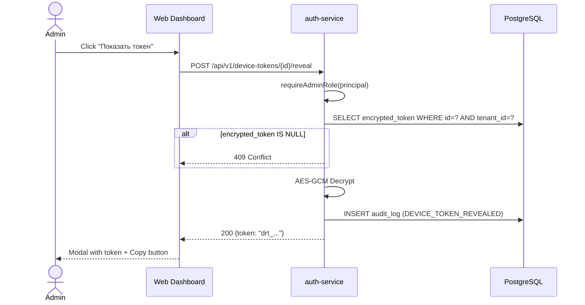
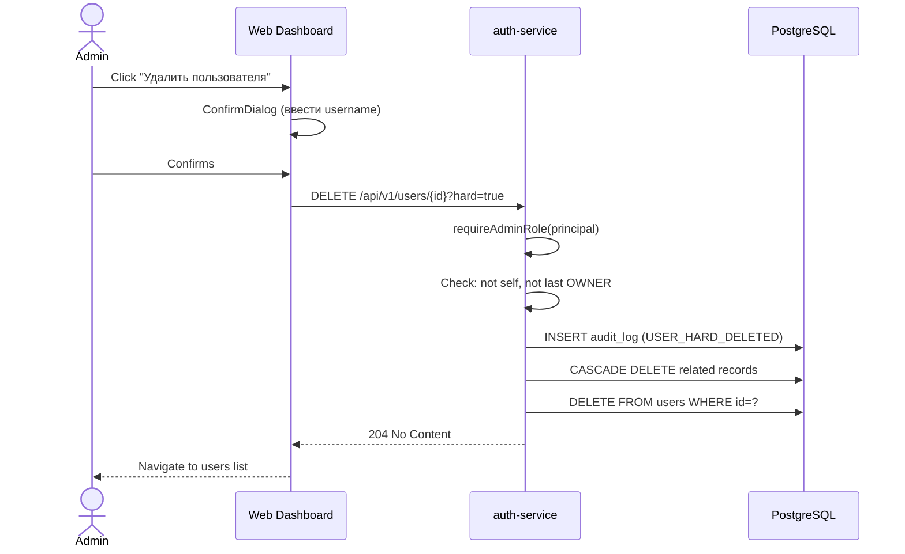

# Спецификация: Токены, Пользователи, Меню

**Дата:** 2026-03-08
**Статус:** Черновик
**Затронутые сервисы:** auth-service, web-dashboard

---

## 1. Повторный просмотр токена (Token Reveal)

### 1.1 Проблема
Сейчас raw-токен (`drt_<uuid>`) показывается один раз при создании. Хранится только SHA-256 хеш (`token_hash`). Повторный просмотр невозможен.

### 1.2 Решение
Добавить столбец `encrypted_token` (AES-256-GCM) в таблицу `device_registration_tokens`. При создании токена сохранять зашифрованное значение. Новый endpoint для расшифровки и показа.

### 1.3 Миграция V29

```sql
ALTER TABLE device_registration_tokens
ADD COLUMN encrypted_token TEXT;
```

Токены, созданные до миграции, будут иметь `encrypted_token = NULL`.

### 1.4 Backend API

**Endpoint:** `POST /api/v1/device-tokens/{id}/reveal`

**Авторизация:** Роль `OWNER`, `TENANT_ADMIN` или `SUPER_ADMIN` (проверка через `UserPrincipal.hasRole()`, не через permission).

**Response 200:**
```json
{
  "id": "uuid",
  "token": "drt_a1b2c3d4...",
  "name": "Офис Москва"
}
```

**Ошибки:**
- `403` -- роль не подходит
- `404` -- токен не найден или чужой tenant
- `409` -- `encrypted_token IS NULL` (токен создан до поддержки reveal)

**Audit event:** `DEVICE_TOKEN_REVEALED`

### 1.5 Шифрование
- Алгоритм: AES-256-GCM
- Ключ: `app.token-encryption-key` из `application.yml`
- IV: 12 байт, генерируется при создании, prepend к ciphertext
- Формат `encrypted_token`: Base64(IV + ciphertext + tag)

### 1.6 Frontend
- Кнопка "Показать токен" в колонке "Действия" таблицы `DeviceTokensListPage`
- Видна только при роли OWNER/TENANT_ADMIN/SUPER_ADMIN (хук `useAuth`, проверка `user.roles`)
- По клику: POST reveal -> модальное окно с raw-токеном и кнопкой "Копировать"

---

## 2. Удаление токена (Hard Delete)

### 2.1 Текущее поведение
`DELETE /api/v1/device-tokens/{id}` -- soft delete (деактивация, `is_active = false`).

### 2.2 Расширение
Добавить параметр `?hard=true` для физического удаления.

**Endpoint:** `DELETE /api/v1/device-tokens/{id}?hard=true`

**Авторизация:** Роль `OWNER`, `TENANT_ADMIN` или `SUPER_ADMIN`.

**Логика:**
1. Проверить роль
2. Загрузить токен, проверить tenant_id
3. Обнулить `registration_token_id` у связанных устройств (`UPDATE devices SET registration_token_id = NULL WHERE registration_token_id = ?`)
4. Физически удалить запись из `device_registration_tokens`
5. Записать audit event `DEVICE_TOKEN_HARD_DELETED`

**Response:** `204 No Content`

**Ошибки:**
- `403` -- роль не подходит
- `404` -- токен не найден

### 2.3 Frontend
- Кнопка "Удалить" рядом с "Деактивировать" в `DeviceTokensListPage`
- Видна при роли OWNER/TENANT_ADMIN/SUPER_ADMIN
- ConfirmDialog: "Вы уверены? Это действие необратимо."
- API: `deleteDeviceToken(id, { hard: true })`

---

## 3. Удаление пользователей (Hard Delete)

### 3.1 Текущее поведение
`DELETE /api/v1/users/{id}` -- soft delete (деактивация, `is_active = false`).

### 3.2 Расширение
Добавить параметр `?hard=true` для физического удаления.

**Endpoint:** `DELETE /api/v1/users/{id}?hard=true`

**Авторизация:** Роль `OWNER`, `TENANT_ADMIN` или `SUPER_ADMIN`.

**Бизнес-правила:**
- Нельзя удалить самого себя
- Нельзя удалить единственного OWNER тенанта
- SUPER_ADMIN может удалять только SUPER_ADMIN

**Каскадное удаление:**
1. `DELETE FROM user_roles WHERE user_id = ?`
2. `DELETE FROM refresh_tokens WHERE user_id = ?`
3. `DELETE FROM email_verification_codes WHERE user_id = ?`
4. `UPDATE device_registration_tokens SET created_by = NULL WHERE created_by = ?` (если FK nullable)
5. `audit_log` -- НЕ трогаем (immutable, actor_id может ссылаться на удалённого пользователя)
6. `DELETE FROM users WHERE id = ?`

**Audit event:** `USER_HARD_DELETED` (записывается ДО каскадного удаления)

**Response:** `204 No Content`

**Ошибки:**
- `403` -- роль не подходит
- `404` -- пользователь не найден
- `409` -- нельзя удалить себя / единственного OWNER

### 3.3 Frontend
- Кнопка "Удалить" на `UserDetailPage` рядом с "Deactivate"
- Видна при роли OWNER/TENANT_ADMIN/SUPER_ADMIN
- ConfirmDialog с вводом username для подтверждения
- API: `deleteUser(id, { hard: true })`

---

## 4. Реорганизация меню

### 4.1 Новая структура (tenant-scoped)

```
[ТенантСвитчер]
  Контрольная панель (/)
  > Аналитика                         [переименовано из "Архив"]
      Устройства (/archive/devices)    [URL не меняем]
      Пользователи (/archive/users)    [URL не меняем]
  > Настройки                          [новый раскрывающийся раздел]
      Устройства (/devices)
      Пользователи (/users)
      Токены (/device-tokens)
      Настройки записи (/recording-settings)

Управление
  Компании (/tenants)
  Аудит (/audit)

[внизу]
  Мой профиль (/settings)              [переименовано из "Настройки"]
```

### 4.2 Новая структура (SuperAdmin)

```
  Dashboard (/)
  > Аналитика
      Устройства (/archive/devices)
      Пользователи (/archive/users)
  > Настройки
      Users (/users)
      Roles (/roles)
      Устройства (/devices)
      Настройки записи (/recording-settings)
      Токены регистрации (/device-tokens)
  Audit Log (/audit)
  Скачать клиент (/download)
  Tenants (/tenants)

[внизу]
  Мой профиль (/settings)
```

### 4.3 Изменения
- **URL-пути НЕ меняются** -- меняется только структура навигации
- "Архив" -> "Аналитика" (переименование)
- Пункты Устройства, Пользователи, Токены, Настройки записи перемещаются внутрь раздела "Настройки"
- "Скачать клиент" убираем из меню тенант-пользователя (остаётся у SuperAdmin) или переносим в "Настройки"
- Нижний пункт "Настройки" переименовывается в "Мой профиль"
- Иконка для "Аналитика": ChartBarIcon (вместо ArchiveBoxIcon)
- Иконка для "Настройки" (раздел): Cog6ToothIcon

### 4.4 Затронутые файлы
- `web-dashboard/src/components/Sidebar.tsx`

---

## 5. Общая утилита проверки роли

### 5.1 Backend
Метод `requireAdminRole(UserPrincipal)` добавляется в контроллеры:

```java
private void requireAdminRole(UserPrincipal principal) {
    if (!principal.hasRole("OWNER") &&
        !principal.hasRole("TENANT_ADMIN") &&
        !principal.hasRole("SUPER_ADMIN")) {
        throw new AccessDeniedException("Admin role required");
    }
}
```

### 5.2 Frontend
Хелпер-функция `isAdmin(user)`:

```typescript
const ADMIN_ROLES = ['OWNER', 'TENANT_ADMIN', 'SUPER_ADMIN'];
export function isAdmin(user: User | null): boolean {
  return user?.roles?.some(r => ADMIN_ROLES.includes(r)) ?? false;
}
```

Компонент `AdminGate`:
```tsx
function AdminGate({ children }: { children: ReactNode }) {
  const { user } = useAuth();
  if (!isAdmin(user)) return null;
  return <>{children}</>;
}
```

---

## 6. Sequence Diagrams

### Token Reveal


### Hard Delete User


---

## 7. Затронутые файлы

### Backend (auth-service)
| Файл | Действие |
|-------|----------|
| `resources/db/migration/V29__add_encrypted_token.sql` | Новый |
| `entity/DeviceRegistrationToken.java` | Изменить: добавить поле `encryptedToken` |
| `service/DeviceTokenService.java` | Изменить: encrypt при создании, reveal, hard delete |
| `service/TokenEncryptionService.java` | Новый: AES-GCM encrypt/decrypt |
| `controller/DeviceTokenController.java` | Изменить: reveal endpoint, hard delete param |
| `service/UserService.java` | Изменить: hard delete user |
| `controller/UserController.java` | Изменить: hard delete param |
| `dto/response/TokenRevealResponse.java` | Новый |
| `application.yml` | Изменить: добавить `app.token-encryption-key` |

### Frontend (web-dashboard)
| Файл | Действие |
|-------|----------|
| `components/Sidebar.tsx` | Изменить: новая структура меню |
| `components/AdminGate.tsx` | Новый |
| `utils/roles.ts` | Новый: `isAdmin()` helper |
| `api/deviceTokens.ts` | Изменить: reveal + hard delete API |
| `api/users.ts` | Изменить: hard delete API |
| `pages/DeviceTokensListPage.tsx` | Изменить: кнопки reveal + delete |
| `pages/UserDetailPage.tsx` | Изменить: кнопка hard delete |
