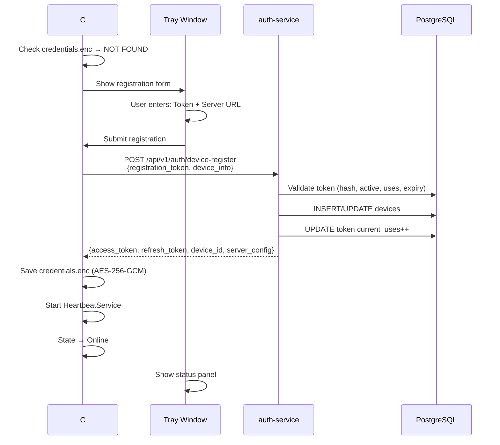
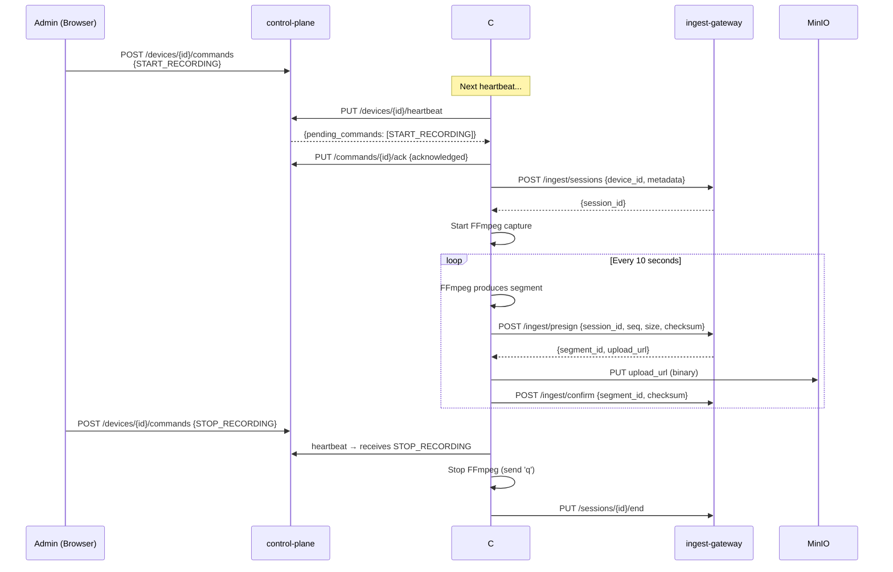

# C# Windows Agent + Download Page + Bugfixes — Техническая Спецификация

**Версия:** 1.0
**Дата:** 2026-03-03
**Ветка:** feature/csharp-agent

---

## 1. Обзор задачи

### 1.1 Scope

| # | Компонент | Описание |
|---|-----------|----------|
| 1 | **windows-agent-csharp** (новый) | C# Windows Service для записи экрана. Заменяет Java agent. |
| 2 | **web-dashboard** (расширение) | Страница "Скачать клиент" + пункт меню в sidebar |
| 3 | **web-dashboard** (расширение) | RecordingsPage: подключить к реальному API вместо mock данных |
| 4 | **web-dashboard** (bugfix) | Fix: switch-tenant приводит к разлогину |
| 5 | **web-dashboard** (bugfix) | Fix: сортировка тенантов в sidebar недетерминированна |
| 6 | **auth-service** (bugfix) | Fix: cookie path не учитывает /screenrecorder prefix |
| 7 | **auth-service** (расширение) | Endpoint для получения списка записей (recording_sessions) |
| 8 | **ingest-gateway** (расширение) | Endpoint для получения записей с пагинацией |
| 9 | Удалить | Существующий `windows-agent/` (Java) |

### 1.2 Ключевые решения

- **Язык клиента**: C# (.NET 8), self-contained publish для Windows 7+
- **Screen Capture**: FFmpeg (gdigrab), как subprocess — проверено и работает в Java agent
- **Installer**: Inno Setup 6 с bundled .NET runtime + FFmpeg
- **Windows Service**: `Microsoft.Extensions.Hosting.WindowsServices`
- **Tray UI**: WPF NotifyIcon (отдельный процесс в сессии пользователя)
- **Сборка**: на 192.168.1.135 (Windows 11, user Shepaland)
- **Тестирование**: на 192.168.1.35 (Windows 11, user Shepaland)

---

## 2. Bugfix: Switch-Tenant приводит к разлогину

### 2.1 Root Cause

**Cookie path mismatch.** Backend устанавливает refresh token cookie с `path=/api/v1/auth`. В production URL содержит prefix `/screenrecorder`, т.е. browser видит path `/screenrecorder/api/v1/auth/refresh`. Cookie path `/api/v1/auth` **не является prefix** этого URL, поэтому browser **не отправляет cookie**.

Дополнительно: `TenantSwitcher` делает `window.location.href = BASE_URL` (полная перезагрузка), что уничтожает access_token из памяти. При восстановлении сессии refresh не работает из-за отсутствующей cookie.

### 2.2 Fix (Backend — auth-service)

**Файл:** `auth-service/src/main/java/com/prg/auth/controller/AuthController.java`

```java
// БЫЛО:
private static final String COOKIE_PATH = "/api/v1/auth";

// СТАЛО:
private static final String COOKIE_PATH = "/";
```

Изменить cookie path на `/` — это безопасно, т.к. cookie HttpOnly + Secure + SameSite=Strict.

### 2.3 Fix (Frontend — TenantSwitcher)

**Файл:** `web-dashboard/src/components/TenantSwitcher.tsx`

Заменить `window.location.href` на React Router `navigate`:

```typescript
// БЫЛО:
window.location.href = import.meta.env.BASE_URL;

// СТАЛО:
navigate('/', { replace: true });
window.location.reload(); // для полного обновления state
```

Или лучше — не делать reload вообще, а обновить state через AuthContext.

---

## 3. Bugfix: Сортировка тенантов в sidebar

### 3.1 Root Cause

JPQL-запрос `findActiveLinksWithUserAndTenant` в `UserOAuthLinkRepository` не содержит `ORDER BY`. Порядок записей в результате SQL-запроса недетерминирован. Frontend `TenantSwitcher.tsx` рендерит `tenants.map(...)` без сортировки.

### 3.2 Fix (Backend — auth-service)

**Файл:** `auth-service/src/main/java/com/prg/auth/repository/UserOAuthLinkRepository.java`

```java
// БЫЛО:
@Query("SELECT uol FROM UserOAuthLink uol JOIN FETCH uol.user u JOIN FETCH u.tenant t " +
       "WHERE uol.oauthIdentity.id = :oauthId AND u.isActive = true AND t.isActive = true")

// СТАЛО (добавить ORDER BY t.createdTs ASC):
@Query("SELECT uol FROM UserOAuthLink uol JOIN FETCH uol.user u JOIN FETCH u.tenant t " +
       "WHERE uol.oauthIdentity.id = :oauthId AND u.isActive = true AND t.isActive = true " +
       "ORDER BY t.createdTs ASC")
```

Сортировка: самые давние тенанты наверху, самые новые — внизу.

### 3.3 Fix (Frontend — TenantSwitcher)

Дополнительная сортировка на фронте для случая password-юзеров:

```typescript
const sortedTenants = [...tenants].sort((a, b) =>
  new Date(a.created_ts).getTime() - new Date(b.created_ts).getTime()
);
```

---

## 4. Recordings API (новые endpoints)

### 4.1 GET /api/v1/ingest/recordings — Список записей

Добавляется в **ingest-gateway**. Доступен пользователям через nginx proxy.

**Permission:** `RECORDINGS:READ`
**Tenant isolation:** по `tenant_id` из JWT

**Query params:**

| Param | Type | Default | Description |
|-------|------|---------|-------------|
| page | int | 0 | Номер страницы |
| size | int | 20 | Размер (max 100) |
| status | string | null | Фильтр: active, completed, failed |
| device_id | UUID | null | Фильтр по устройству |
| from | ISO datetime | null | Начало периода |
| to | ISO datetime | null | Конец периода |

**Response 200:**
```json
{
  "content": [
    {
      "id": "uuid",
      "device_id": "uuid",
      "device_hostname": "DESKTOP-ABC",
      "user_id": "uuid",
      "status": "completed",
      "started_ts": "2026-03-03T10:00:00Z",
      "ended_ts": "2026-03-03T10:15:00Z",
      "segment_count": 90,
      "total_bytes": 46080000,
      "total_duration_ms": 900000,
      "metadata": {"resolution": "1920x1080", "fps": 5}
    }
  ],
  "page": 0,
  "size": 20,
  "total_elements": 42,
  "total_pages": 3
}
```

### 4.2 GET /api/v1/ingest/recordings/{id}/segments — Сегменты записи

**Permission:** `RECORDINGS:PLAY`

**Response 200:**
```json
{
  "session_id": "uuid",
  "segments": [
    {
      "id": "uuid",
      "sequence_num": 0,
      "duration_ms": 10000,
      "size_bytes": 512000,
      "status": "confirmed",
      "play_url": "/prg-segments/{tenant_id}/{device_id}/{session_id}/00000.mp4"
    }
  ]
}
```

### 4.3 nginx proxy для playback

Сегменты уже доступны через `/prg-segments/` proxy на MinIO. Для воспроизведения фронтенд будет использовать direct URL к сегментам.

---

## 5. C# Windows Agent — Архитектура

### 5.1 Структура проекта

```
windows-agent-csharp/
├── KaderoAgent.sln
├── src/
│   ├── KaderoAgent/                           # Main library
│   │   ├── KaderoAgent.csproj                 # .NET 8, self-contained
│   │   ├── Program.cs                         # Entry point
│   │   ├── AgentState.cs                      # Enum: NotAuthenticated, Online, Recording, Disconnected
│   │   ├── Configuration/
│   │   │   ├── AgentConfig.cs                 # appsettings.json + server overrides
│   │   │   └── ServerConfig.cs                # DTO from device-login response
│   │   ├── Auth/
│   │   │   ├── AuthManager.cs                 # Device login, refresh, credential store
│   │   │   ├── TokenStore.cs                  # In-memory volatile token storage
│   │   │   └── CredentialStore.cs             # AES-256-GCM encrypted persistence
│   │   ├── Capture/
│   │   │   ├── ScreenCaptureManager.cs        # FFmpeg subprocess management
│   │   │   ├── FfmpegCapture.cs               # Process wrapper for ffmpeg.exe
│   │   │   └── SegmentProducer.cs             # Watch dir → checksum → enqueue
│   │   ├── Upload/
│   │   │   ├── SegmentUploader.cs             # presign → S3 PUT → confirm
│   │   │   ├── UploadQueue.cs                 # Channel<T> + retry + offline fallback
│   │   │   └── SessionManager.cs              # Session create/end + stats
│   │   ├── Command/
│   │   │   ├── CommandHandler.cs              # Process server commands
│   │   │   └── HeartbeatService.cs            # Periodic heartbeat (BackgroundService)
│   │   ├── Storage/
│   │   │   ├── LocalDatabase.cs               # SQLite via Microsoft.Data.Sqlite
│   │   │   └── SegmentFileManager.cs          # File mgmt, eviction
│   │   ├── Service/
│   │   │   ├── AgentService.cs                # Main coordinator / state machine
│   │   │   └── MetricsCollector.cs            # CPU/RAM/disk via PerformanceCounter
│   │   ├── Tray/
│   │   │   ├── TrayApplication.cs             # WPF NotifyIcon app
│   │   │   ├── TrayIconProvider.cs            # Colored icons per state
│   │   │   └── ConfigWindow.xaml(.cs)         # WPF config window (login/status)
│   │   └── Util/
│   │       ├── ApiClient.cs                   # HttpClient wrapper, auth, retry
│   │       ├── HardwareId.cs                  # WMI → SHA-256
│   │       └── CryptoUtil.cs                  # AES-256-GCM
│   ├── KaderoAgent.Service/                   # Windows Service host
│   │   ├── KaderoAgent.Service.csproj
│   │   ├── Program.cs
│   │   └── Worker.cs                          # BackgroundService
│   └── KaderoAgent.Tray/                      # Tray UI process
│       ├── KaderoAgent.Tray.csproj
│       ├── App.xaml(.cs)
│       └── MainWindow.xaml(.cs)               # Hidden window for tray
├── installer/
│   ├── setup.iss                              # Inno Setup script
│   └── ffmpeg/                                # Bundled ffmpeg.exe
├── tests/
│   ├── KaderoAgent.Tests/
│   │   ├── Auth/AuthManagerTests.cs
│   │   ├── Upload/SegmentUploaderTests.cs
│   │   └── Command/CommandHandlerTests.cs
└── build.ps1                                  # Build + publish + package script
```

### 5.2 Целевая платформа

- **.NET 8** с `PublishSingleFile` + `SelfContained` + `win-x64`
- Для Windows 7: `RuntimeIdentifier = win-x64`, `TargetFramework = net8.0-windows`
- FFmpeg: bundled `ffmpeg.exe` (static build, ~80MB)

### 5.3 API контракт (1:1 с Java agent)

Все 9 HTTP вызовов сохраняются:

| # | Method | URL | Body format |
|---|--------|-----|-------------|
| 1 | POST | `{authUrl}/device-login` | snake_case JSON |
| 2 | POST | `{authUrl}/device-refresh` | snake_case JSON |
| 3 | PUT | `{controlUrl}/{deviceId}/heartbeat` | snake_case JSON |
| 4 | PUT | `{controlUrl}/commands/{cmdId}/ack` | snake_case JSON |
| 5 | POST | `{ingestUrl}/sessions` | snake_case JSON |
| 6 | PUT | `{ingestUrl}/sessions/{id}/end` | snake_case JSON |
| 7 | POST | `{ingestUrl}/presign` | snake_case JSON |
| 8 | PUT | `{presignedUrl}` | binary (video/mp4) |
| 9 | POST | `{ingestUrl}/confirm` | snake_case JSON |

**JSON**: `System.Text.Json` с `JsonNamingPolicy.SnakeCaseLower`

### 5.4 FFmpeg Capture

Идентично Java agent:
```
ffmpeg -f gdigrab -framerate {fps} -i desktop
  -c:v libx264 -preset ultrafast -tune zerolatency -pix_fmt yuv420p
  -b:v {bitrate} -g {gop_size}
  -f segment -segment_time {segment_duration_sec}
  -segment_format mp4 -reset_timestamps 1
  -movflags +frag_keyframe+empty_moov+default_base_moof
  -y {output_pattern}
```

### 5.5 State Machine

```
NotAuthenticated (Red) → [login OK] → Online (Yellow) → [START_RECORDING] → Recording (Green)
                                                ↑                                    ↓
                                          [STOP / restored]                   [3 HB failures]
                                                ↑                                    ↓
                                          Disconnected (Orange) ←─────────────────────
```

### 5.6 Offline Buffer

- SQLite: `pending_segments` + `agent_state` tables (идентично Java agent)
- Max buffer: 2GB (configurable), eviction oldest-first
- Retry: exponential backoff (1s, 2s, 4s), max 3 attempts → save to SQLite

### 5.7 Security

- Credentials: AES-256-GCM, key = SHA-256(hardware_id + salt)
- Hardware ID: WMI (MB serial + CPU ID + Disk serial) → SHA-256
- Файл: `%APPDATA%\Kadero\credentials.enc`

### 5.8 First Run Flow

1. Agent запускается → проверяет `credentials.enc`
2. Если нет → показывает окно с формой: **Токен организации** + **Сервер** (URL)
3. Пользователь вводит token + server URL
4. Agent вызывает `POST {server}/api/v1/auth/device-login` с token + system hostname как username
5. При успехе: сохраняет credentials, запускает heartbeat
6. При ошибке: показывает сообщение, позволяет повторить

**Важное отличие от Java agent**: Не запрашиваем username/password. Используем только registration token. Backend выполняет device-login только по token, без user credentials — нужна доработка auth-service.

### 5.9 Доработка device-login (auth-service)

Добавить возможность device-login только по registration_token (без username/password):

```java
// Новый endpoint или параметр:
POST /api/v1/auth/device-register
{
  "registration_token": "drt_...",
  "device_info": { "hostname": "...", "os_version": "...", "hardware_id": "..." }
}
```

Backend:
1. Валидирует registration_token → получает tenant_id
2. Создает device запись (или находит по hardware_id)
3. Создает системного "device user" или использует created_by из token
4. Выдает JWT с device_id claim

---

## 6. Download Page (web-dashboard)

### 6.1 Новый пункт меню

В Sidebar добавить пункт "Скачать клиент" с иконкой download. Доступен всем аутентифицированным пользователям.

**Путь:** `/download`

### 6.2 Страница загрузки

Содержимое:
- Заголовок: "Скачать клиент Кадеро"
- Карточка Windows:
  - Иконка Windows
  - "Клиент для Windows"
  - "Windows 7 и выше"
  - Кнопка "Скачать (.exe)" → ссылка на установочный файл
  - Версия, размер файла
- Инструкция по установке:
  1. Скачайте и запустите установщик
  2. Следуйте инструкциям мастера установки
  3. После установки откройте приложение из трея
  4. Введите токен регистрации (сгенерируйте в разделе "Токены регистрации")
  5. Нажмите "Подключить"

### 6.3 Хостинг installer

Installer (.exe) будет размещен в MinIO в bucket `prg-downloads` или через nginx static location. Для MVP — как static файл в web-dashboard build.

---

## 7. RecordingsPage — подключение к реальному API

### 7.1 Что нужно изменить

- Удалить `MOCK_RECORDINGS`
- Подключить к `GET /api/v1/ingest/recordings` через ingest API
- Добавить пагинацию, фильтры (статус, устройство, период)
- Добавить video player: HTML5 `<video>` с direct URL на сегменты

### 7.2 Воспроизведение записей

Для MVP: sequential playback сегментов через HTML5 video. Фронтенд получает список сегментов, формирует URL `/screenrecorder/prg-segments/{s3_key}` и воспроизводит последовательно.

---

## 8. Sequence Diagrams

### 8.1 C# Agent First Run



### 8.2 Full Recording Cycle



---

## 9. Затронутые сервисы

| Сервис | Изменения | Приоритет |
|--------|-----------|-----------|
| auth-service | Cookie path fix, ORDER BY fix, device-register endpoint | HIGH |
| ingest-gateway | Recordings list + segments endpoints | HIGH |
| web-dashboard | TenantSwitcher fix, Download page, RecordingsPage real API | HIGH |
| windows-agent (Java) | Удалить | MEDIUM |
| windows-agent-csharp | Создать полностью | HIGH |

---

## 10. Миграции БД

### V24: Нет новых миграций

Все необходимые таблицы (devices, segments, recording_sessions, device_commands, device_registration_tokens) уже существуют (V14-V19). Новых таблиц не требуется.

---

## 11. Критерии приёмки

1. **C# Agent** установлен как Windows Service на 192.168.1.35
2. Agent подключается к серверу по registration token
3. Heartbeat работает (устройство видно в UI как Online)
4. Команда START_RECORDING запускает запись
5. Сегменты загружаются в MinIO
6. На сервере >= 10 записей, доступных для просмотра
7. RecordingsPage показывает реальные записи с возможностью воспроизведения
8. Switch-tenant НЕ приводит к разлогину
9. Тенанты в sidebar отсортированы по дате создания (старые сверху)
10. Страница "Скачать клиент" доступна с установочным пакетом
