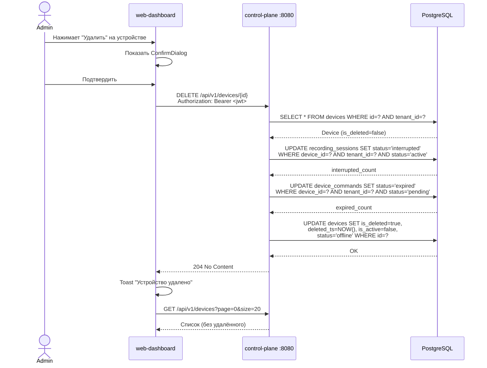
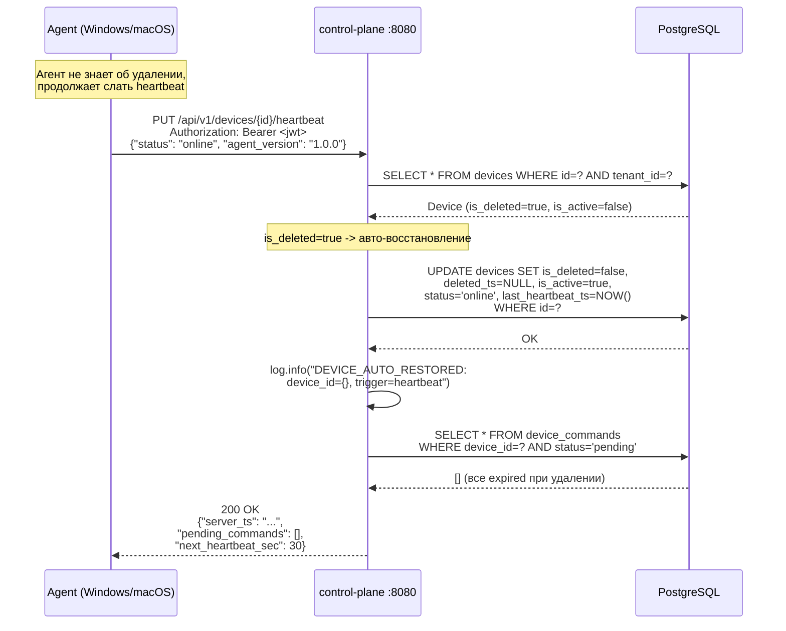
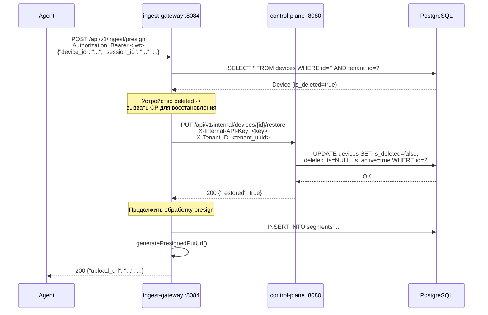
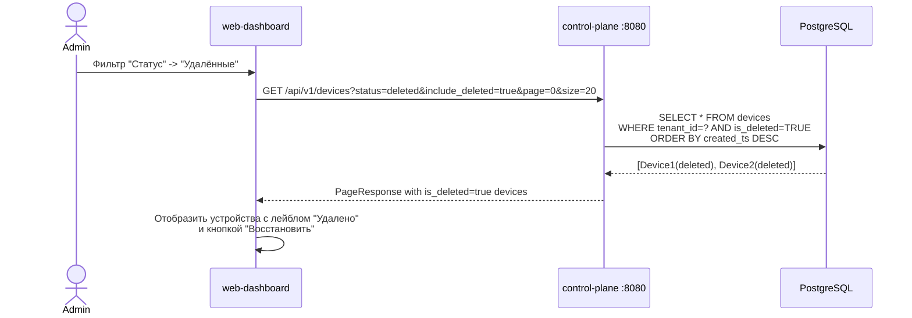
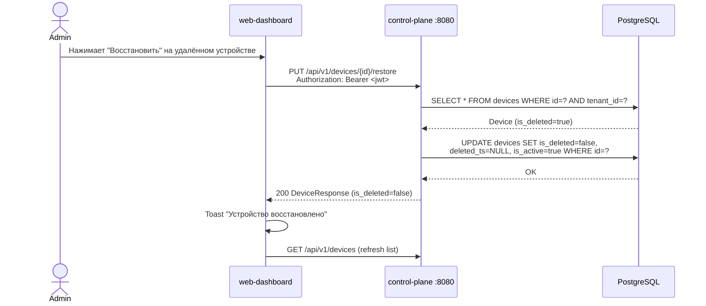
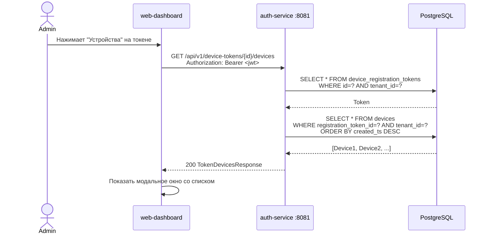

# Soft Delete устройств

**Дата**: 2026-03-05
**Статус**: Draft
**Автор**: Системный аналитик (Claude)

---

## 1. Описание проблемы

### Текущее поведение

При нажатии кнопки "Удалить" устройство (`DELETE /api/v1/devices/{id}`) выполняется метод `deactivateDevice()`, который:

1. Прерывает активные сессии записи (`status='interrupted'`)
2. Истекает ожидающие команды (`status='expired'`)
3. Ставит `is_active=false`, `status='offline'`

Проблемы:
- Кнопка "Удалить" доступна **только** для offline-устройств (фронтенд-ограничение)
- После "удаления" устройство остается в списке как offline-деактивированное
- Нет механизма скрытия удаленных устройств из основного списка
- На записях от "удаленных" устройств нет визуального отличия

### Требуемое поведение

1. Кнопку "Удалить" можно нажать для **любого** устройства (online, recording, offline, error)
2. Удаление = soft delete: `is_deleted=true, deleted_ts=NOW()`. Физическое удаление строки из БД **не** выполняется
3. Записи от удаленного устройства остаются доступны в архиве, но помечены лейблом "Компьютер удален"
4. Если агент продолжает работу (токен жив) и присылает heartbeat или сегмент -- устройство **автоматически восстанавливается** (`is_deleted=false, deleted_ts=NULL, status=online`)
5. По умолчанию удаленные устройства скрыты из списка; фильтр позволяет их увидеть

---

## 2. User Stories

### US-1: Soft Delete устройства

> Как администратор тенанта, я хочу удалить любое устройство (вне зависимости от статуса), чтобы оно больше не отображалось в списке активных устройств.

**Acceptance Criteria:**
- AC-1.1: Кнопка "Удалить" доступна для устройств с любым статусом (online, recording, offline, error)
- AC-1.2: При удалении online/recording устройства: прерываются активные сессии, истекают pending-команды, ставится `is_deleted=true, deleted_ts=NOW()`
- AC-1.3: Устройство не удаляется физически из БД
- AC-1.4: После удаления устройство не отображается в списке по умолчанию
- AC-1.5: Операция требует permission `DEVICES:DELETE`
- AC-1.6: Диалог подтверждения предупреждает: "Устройство будет скрыто. Если агент продолжает работу, устройство восстановится автоматически."
- AC-1.7: API возвращает `204 No Content`

### US-2: Фильтр удаленных устройств

> Как администратор тенанта, я хочу видеть удаленные устройства через фильтр, чтобы контролировать историю удалений.

**Acceptance Criteria:**
- AC-2.1: В фильтре статусов появляется опция "Удаленные"
- AC-2.2: При выборе "Удаленные" отображаются **только** soft-deleted устройства
- AC-2.3: Удаленные устройства визуально отличаются (красный лейбл "Удалено")
- AC-2.4: Опция "Все" по умолчанию **не** включает удаленные; для полного просмотра нужно выбрать "Все, включая удаленные"

### US-3: Лейбл "Компьютер удален" на записях

> Как пользователь, я хочу видеть на записях от удаленных устройств специальную метку, чтобы понимать, что устройство больше не активно.

**Acceptance Criteria:**
- AC-3.1: В списке записей рядом с hostname удаленного устройства отображается лейбл "Компьютер удален"
- AC-3.2: Записи остаются полностью доступны для просмотра и скачивания
- AC-3.3: Лейбл исчезает, если устройство было авто-восстановлено

### US-4: Авто-восстановление при heartbeat

> Как система, при получении heartbeat от soft-deleted устройства, я должна автоматически восстановить его, чтобы агент продолжил нормальную работу.

**Acceptance Criteria:**
- AC-4.1: При heartbeat от deleted устройства: `is_deleted=false, deleted_ts=NULL, status=<status_из_heartbeat>`
- AC-4.2: Устройство снова появляется в основном списке
- AC-4.3: В логах фиксируется `DEVICE_AUTO_RESTORED` с device_id и tenant_id

### US-5: Авто-восстановление при создании сессии/ingest

> Как система, при получении presign/confirm/create-session от soft-deleted устройства, я должна автоматически восстановить его.

**Acceptance Criteria:**
- AC-5.1: ingest-gateway при presign/confirm/create-session проверяет `is_deleted` в read-only entity
- AC-5.2: Если устройство deleted -- вызывается межсервисный эндпоинт control-plane для восстановления (`PUT /api/v1/internal/devices/{id}/restore`)
- AC-5.3: Запись данных продолжается без потерь

---

## 3. Затронутые сервисы и компоненты

### 3.1 Обзор влияния

| Сервис | Файл | Тип изменения |
|--------|------|---------------|
| **DB (Flyway)** | `V24__add_device_soft_delete.sql` | Новая миграция |
| **control-plane** | `Device.java` (entity) | Добавить поля `isDeleted`, `deletedTs` |
| **control-plane** | `DeviceService.java` | Переписать `deactivateDevice()` -> soft delete; добавить `restoreDevice()` |
| **control-plane** | `DeviceController.java` | Параметр `include_deleted` в GET; новый эндпоинт `PUT /{id}/restore` |
| **control-plane** | `DeviceRepository.java` | Обновить `findByTenantIdWithFilters()`: фильтр по `is_deleted` |
| **control-plane** | `DeviceResponse.java` | Добавить `isDeleted`, `deletedTs` |
| **control-plane** | `DeviceDetailResponse.java` | Добавить `isDeleted`, `deletedTs` |
| **control-plane** | heartbeat в `DeviceService.processHeartbeat()` | Авто-восстановление |
| **auth-service** | `Device.java` (entity) | Добавить поля `isDeleted`, `deletedTs` |
| **auth-service** | `DeviceAuthService.java` | Обработка device-login для deleted устройства |
| **ingest-gateway** | `Device.java` (read-only entity) | Добавить поле `isDeleted` |
| **ingest-gateway** | `RecordingService.java` | Передавать `is_deleted` в response |
| **ingest-gateway** | `RecordingListItemResponse.java` | Добавить поле `deviceDeleted` |
| **web-dashboard** | `DevicesListPage.tsx` | Убрать ограничение `status === 'offline'`; фильтр удаленных |
| **web-dashboard** | `DeviceDetailPage.tsx` | Показать статус "Удалено"; кнопка "Восстановить" |
| **web-dashboard** | `DeviceStatusBadge.tsx` | Новый статус `deleted` |
| **web-dashboard** | `RecordingsPage.tsx` | Лейбл "Компьютер удален" |
| **web-dashboard** | `types/device.ts` | Новые поля `is_deleted`, `deleted_ts` |
| **web-dashboard** | `api/devices.ts` | Параметр `include_deleted`; `restoreDevice()` |

### 3.2 Сервисы, НЕ затронутые изменениями

- **search-service** -- не реализован, влияние будет в будущем
- **playback-service** -- не реализован

---

## 4. Миграция БД

### V24__add_device_soft_delete.sql

```sql
-- V24: Add soft delete support for devices

-- 1. Add is_deleted flag and deleted_ts timestamp
ALTER TABLE devices
    ADD COLUMN is_deleted BOOLEAN NOT NULL DEFAULT FALSE,
    ADD COLUMN deleted_ts TIMESTAMPTZ;

-- 2. Add constraint: deleted_ts required when is_deleted=true
ALTER TABLE devices
    ADD CONSTRAINT chk_devices_deleted_ts
        CHECK (
            (is_deleted = FALSE AND deleted_ts IS NULL) OR
            (is_deleted = TRUE AND deleted_ts IS NOT NULL)
        );

-- 3. Partial index for fast filtering of non-deleted devices (default view)
CREATE INDEX idx_devices_tenant_not_deleted
    ON devices(tenant_id, created_ts DESC)
    WHERE is_deleted = FALSE;

-- 4. Partial index for listing only deleted devices
CREATE INDEX idx_devices_tenant_deleted
    ON devices(tenant_id, deleted_ts DESC)
    WHERE is_deleted = TRUE;

-- 5. Update existing tenant+status index to consider is_deleted
DROP INDEX IF EXISTS idx_devices_tenant_status;
CREATE INDEX idx_devices_tenant_status
    ON devices(tenant_id, status)
    WHERE is_deleted = FALSE;

COMMENT ON COLUMN devices.is_deleted IS 'Soft delete flag. TRUE = device hidden from default list. Auto-restored on heartbeat.';
COMMENT ON COLUMN devices.deleted_ts IS 'Timestamp of soft deletion. NULL when is_deleted=FALSE.';
```

### Обратная совместимость

- Миграция **аддитивная** (ADD COLUMN с DEFAULT). Не блокирует таблицу на долгое время.
- Все существующие устройства получат `is_deleted=FALSE, deleted_ts=NULL` -- поведение не меняется.
- Constraint `chk_devices_deleted_ts` обеспечивает целостность: нельзя поставить `is_deleted=TRUE` без `deleted_ts`.
- Индекс `idx_devices_tenant_status` пересоздается с условием `WHERE is_deleted = FALSE` -- запросы для обычного списка станут быстрее.

### Влияние на UNIQUE constraint

Текущий constraint: `UNIQUE(tenant_id, hardware_id)`. При soft delete устройства его `hardware_id` продолжает занимать уникальный слот. Это **корректное поведение**: если агент с тем же `hardware_id` повторно залогинится, device-login в auth-service найдёт существующее устройство по `findByTenantIdAndHardwareId()` и восстановит его.

---

## 5. API-изменения

### 5.1 control-plane: GET /api/v1/devices -- изменение фильтрации

**Текущий контракт:**
```
GET /api/v1/devices?page=0&size=20&status=online&search=hostname
```

**Новый контракт (обратно совместим):**
```
GET /api/v1/devices?page=0&size=20&status=online&search=hostname&include_deleted=false
```

| Параметр | Тип | Default | Описание |
|----------|-----|---------|----------|
| `page` | int | 0 | Номер страницы |
| `size` | int | 20 | Размер страницы (max 100) |
| `status` | string | null | Фильтр по статусу: `online`, `recording`, `offline`, `error`, `deleted` |
| `search` | string | null | Поиск по hostname (ILIKE) |
| `include_deleted` | boolean | false | Если `true` -- включить soft-deleted устройства в выдачу |

**Логика фильтрации:**
- `status=deleted` -- вернуть ТОЛЬКО удаленные устройства (эквивалент `is_deleted=TRUE`)
- `include_deleted=true` без `status` -- вернуть ВСЕ устройства (и удаленные, и нет)
- `include_deleted=false` (default) без `status` -- вернуть ТОЛЬКО неудалённые
- `include_deleted=false` + `status=online` -- неудалённые с status=online

**Изменение response:**

```json
{
  "content": [
    {
      "id": "550e8400-e29b-41d4-a716-446655440000",
      "tenant_id": "...",
      "hostname": "DESKTOP-ALPHA01",
      "status": "offline",
      "is_active": false,
      "is_deleted": true,
      "deleted_ts": "2026-03-05T14:30:00Z",
      "...": "..."
    }
  ],
  "page": 0,
  "size": 20,
  "total_elements": 1,
  "total_pages": 1
}
```

Новые поля в `DeviceResponse`:
- `is_deleted` (boolean) -- always present
- `deleted_ts` (string, ISO 8601, nullable) -- null если `is_deleted=false`

### 5.2 control-plane: DELETE /api/v1/devices/{id} -- изменение семантики

**Текущее поведение:** Деактивация (is_active=false, status=offline)
**Новое поведение:** Soft delete (is_deleted=true, deleted_ts=NOW(), is_active=false, status=offline) + прерывание сессий + истечение команд

Ответ остаётся `204 No Content`.

Повторный вызов DELETE для уже удалённого устройства -- идемпотентен, возвращает `204`.

### 5.3 control-plane: PUT /api/v1/devices/{id}/restore -- новый эндпоинт

```
PUT /api/v1/devices/{id}/restore
Authorization: Bearer <jwt>

Response: 200 OK
{
  "id": "550e8400-e29b-41d4-a716-446655440000",
  "hostname": "DESKTOP-ALPHA01",
  "status": "offline",
  "is_deleted": false,
  "deleted_ts": null,
  "is_active": true,
  "...": "..."
}
```

**Permission:** `DEVICES:UPDATE`

**Логика:**
- Сбрасывает `is_deleted=false, deleted_ts=NULL`
- Ставит `is_active=true`
- Если устройство не было deleted -- возвращает текущее состояние (идемпотентность)
- Возвращает обновлённый `DeviceResponse`

**Ошибки:**
- `404 DEVICE_NOT_FOUND` -- устройство не найдено в тенанте

### 5.4 control-plane: PUT /api/v1/internal/devices/{id}/restore -- межсервисный

```
PUT /api/v1/internal/devices/{id}/restore
X-Internal-API-Key: <key>
X-Tenant-ID: <tenant_uuid>

Response: 200 OK
{"restored": true}
```

Используется ingest-gateway при обнаружении `is_deleted=true` у устройства на presign/confirm/create-session.

**Авторизация:** `X-Internal-API-Key` + role `INTERNAL`

### 5.5 control-plane: PUT /api/v1/devices/{id}/heartbeat -- изменение логики

Heartbeat от soft-deleted устройства теперь вызывает авто-восстановление:

```
PUT /api/v1/devices/{id}/heartbeat
Authorization: Bearer <jwt>
Content-Type: application/json

{"status": "online", "agent_version": "1.0.0"}

Response: 200 OK
{
  "server_ts": "2026-03-05T14:35:00Z",
  "pending_commands": [],
  "next_heartbeat_sec": 30
}
```

Логика `processHeartbeat()` дополняется:

```
if (device.isDeleted) {
    device.isDeleted = false
    device.deletedTs = null
    device.isActive = true
    log.info("DEVICE_AUTO_RESTORED: device_id={}, tenant_id={}")
}
// ... existing heartbeat logic
```

### 5.6 ingest-gateway: GET /api/v1/ingest/recordings -- изменение response

Новое поле в `RecordingListItemResponse`:
- `device_deleted` (boolean) -- true если устройство, от которого запись, помечено как deleted

```json
{
  "content": [
    {
      "id": "...",
      "device_id": "...",
      "device_hostname": "DESKTOP-ALPHA01",
      "device_deleted": true,
      "status": "completed",
      "...": "..."
    }
  ]
}
```

---

## 6. Детальная логика изменений

### 6.1 control-plane: DeviceService.deactivateDevice() -> softDeleteDevice()

```java
@Transactional
public void softDeleteDevice(UUID deviceId, UUID tenantId, UUID userId,
                              String ipAddress, String userAgent) {
    Device device = findDeviceByIdAndTenant(deviceId, tenantId);

    // Idempotent: if already deleted, do nothing
    if (Boolean.TRUE.equals(device.getIsDeleted())) {
        log.info("Device already soft-deleted: id={}, tenant_id={}", deviceId, tenantId);
        return;
    }

    Instant now = Instant.now();

    // 1. Interrupt active recording sessions
    int interruptedSessions = recordingSessionRepository
            .interruptActiveSessionsByDeviceId(deviceId, tenantId, now);

    // 2. Expire pending commands
    int expiredCommands = deviceCommandRepository
            .expirePendingCommandsByDeviceId(deviceId, tenantId);

    // 3. Soft delete
    device.setIsDeleted(true);
    device.setDeletedTs(now);
    device.setIsActive(false);
    device.setStatus("offline");
    deviceRepository.save(device);

    log.info("Device soft-deleted: id={}, hostname={}, tenant_id={}, user_id={}, " +
             "interrupted_sessions={}, expired_commands={}",
            device.getId(), device.getHostname(), tenantId, userId,
            interruptedSessions, expiredCommands);
}
```

### 6.2 control-plane: DeviceService.processHeartbeat() -- авто-восстановление

Добавить в начало `processHeartbeat()`, после `findDeviceByIdAndTenant()`:

```java
// Auto-restore soft-deleted device on heartbeat
if (Boolean.TRUE.equals(device.getIsDeleted())) {
    device.setIsDeleted(false);
    device.setDeletedTs(null);
    device.setIsActive(true);
    log.info("DEVICE_AUTO_RESTORED: device_id={}, tenant_id={}, trigger=heartbeat",
            deviceId, principal.getTenantId());
}
```

### 6.3 control-plane: DeviceRepository -- обновление запроса

```java
@Query("""
        SELECT d FROM Device d
        WHERE d.tenantId = :tenantId
          AND (:status IS NULL OR (
              CASE WHEN :status = 'deleted' THEN d.isDeleted = TRUE
                   ELSE (d.status = :status AND d.isDeleted = FALSE)
              END
          ))
          AND (:includeDeleted = TRUE OR d.isDeleted = FALSE)
          AND (:search IS NULL OR LOWER(d.hostname) LIKE LOWER(CONCAT('%', CAST(:search AS string), '%')))
        ORDER BY d.createdTs DESC
        """)
Page<Device> findByTenantIdWithFilters(
        @Param("tenantId") UUID tenantId,
        @Param("status") String status,
        @Param("search") String search,
        @Param("includeDeleted") boolean includeDeleted,
        Pageable pageable);
```

### 6.4 auth-service: DeviceAuthService.deviceLogin() -- обработка deleted устройства

Текущий код при device-login находит устройство по `hardware_id`:

```java
Device device = deviceRepository.findByTenantIdAndHardwareId(tenantId, deviceInfo.getHardwareId())
        .orElse(null);
if (device != null) {
    if (!device.getIsActive()) {
        throw new DeviceDeactivatedException("Device has been deactivated.");
    }
    // update existing device...
}
```

**Изменение:** Добавить обработку `is_deleted`. Если устройство was soft-deleted -- auto-restore при повторном login:

```java
if (device != null) {
    // Auto-restore soft-deleted device on re-login
    if (Boolean.TRUE.equals(device.getIsDeleted())) {
        device.setIsDeleted(false);
        device.setDeletedTs(null);
        device.setIsActive(true);
        log.info("DEVICE_AUTO_RESTORED: device_id={}, tenant_id={}, trigger=device-login",
                device.getId(), tenantId);
        auditAction = "DEVICE_RESTORED";
    } else if (!device.getIsActive()) {
        throw new DeviceDeactivatedException("Device has been deactivated.");
    }
    // update existing device fields...
}
```

Это означает, что `is_deleted` имеет приоритет над `is_active`. Soft-deleted устройство может быть восстановлено повторным логином, но деактивированное (is_active=false, is_deleted=false) -- нет.

### 6.5 auth-service: DeviceAuthService.deviceRefresh() -- обработка deleted

```java
Device device = deviceRepository.findByIdAndTenantId(request.getDeviceId(), storedToken.getTenantId())
        .orElseThrow(() -> new ResourceNotFoundException("Device not found", "DEVICE_NOT_FOUND"));

// Auto-restore soft-deleted device on token refresh
if (Boolean.TRUE.equals(device.getIsDeleted())) {
    device.setIsDeleted(false);
    device.setDeletedTs(null);
    device.setIsActive(true);
    deviceRepository.save(device);
    log.info("DEVICE_AUTO_RESTORED: device_id={}, tenant_id={}, trigger=device-refresh",
            device.getId(), storedToken.getTenantId());
}

if (!device.getIsActive()) {
    throw new DeviceDeactivatedException("Device has been deactivated.");
}
```

### 6.6 ingest-gateway: RecordingService -- передать is_deleted

В `resolveDeviceHostnames()` помимо hostname вернуть `is_deleted`:

```java
private record DeviceInfo(String hostname, boolean deleted) {}

private Map<UUID, DeviceInfo> resolveDeviceInfo(Set<UUID> deviceIds, UUID tenantId) {
    if (deviceIds.isEmpty()) return Map.of();
    List<Device> devices = deviceRepository.findByIdInAndTenantId(deviceIds, tenantId);
    return devices.stream()
            .collect(Collectors.toMap(
                Device::getId,
                d -> new DeviceInfo(d.getHostname(), Boolean.TRUE.equals(d.getIsDeleted())),
                (a, b) -> a));
}
```

Добавить в `RecordingListItemResponse`:

```java
private Boolean deviceDeleted;
```

Обновить `toListItemResponse()`:

```java
.deviceDeleted(info != null && info.deleted())
```

### 6.7 ingest-gateway: Device (read-only entity) -- добавить поле

```java
@Column(name = "is_deleted", nullable = false)
private Boolean isDeleted;
```

---

## 7. Frontend-изменения

### 7.1 types/device.ts -- новые поля

```typescript
export interface DeviceResponse {
  // ... existing fields ...
  is_deleted: boolean;
  deleted_ts: string | null;
}
```

### 7.2 api/devices.ts -- новый параметр и метод

```typescript
export interface DevicesListParams {
  page?: number;
  size?: number;
  status?: string;
  search?: string;
  include_deleted?: boolean;  // NEW
}

// NEW: restore a soft-deleted device
export async function restoreDevice(id: string): Promise<DeviceResponse> {
  const response = await cpApiClient.put<DeviceResponse>(`/devices/${id}/restore`);
  return response.data;
}
```

### 7.3 api/ingest.ts -- новое поле Recording

```typescript
export interface Recording {
  // ... existing fields ...
  device_deleted: boolean;  // NEW
}
```

### 7.4 DevicesListPage.tsx -- изменения

**7.4.1 Убрать ограничение `status === 'offline'` для кнопки "Удалить":**

Текущий код (строка 154):
```tsx
{device.status === 'offline' && (
  <button onClick={...}>Удалить</button>
)}
```

Новый код:
```tsx
{!device.is_deleted && (
  <button onClick={...}>Удалить</button>
)}
```

**7.4.2 Добавить фильтр "Удаленные" в select:**

```tsx
<select id="deviceStatus" ...>
  <option value="">Все</option>
  <option value="online">Онлайн</option>
  <option value="recording">Запись</option>
  <option value="offline">Офлайн</option>
  <option value="error">Ошибка</option>
  <option value="deleted">Удалённые</option>        {/* NEW */}
</select>
```

**7.4.3 Передавать `include_deleted` в API:**

```tsx
const fetchDevices = useCallback(async () => {
  // ...
  const params: DevicesListParams = { page, size };
  if (search) params.search = search;
  if (statusFilter === 'deleted') {
    params.status = 'deleted';
    params.include_deleted = true;
  } else if (statusFilter) {
    params.status = statusFilter;
  }
  // ...
}, [page, size, search, statusFilter]);
```

**7.4.4 Показать лейбл "Удалено" и кнопку "Восстановить":**

В колонке "Статус":
```tsx
{
  key: 'status',
  title: 'Статус',
  render: (device) => device.is_deleted
    ? <span className="inline-flex items-center rounded-full px-2.5 py-0.5 text-xs font-medium bg-red-100 text-red-800 ring-1 ring-inset ring-red-600/20">Удалено</span>
    : <DeviceStatusBadge status={device.status} />,
},
```

В колонке "Действия" -- кнопка "Восстановить" для удалённых:
```tsx
{device.is_deleted && (
  <PermissionGate permission="DEVICES:UPDATE">
    <button onClick={() => handleRestore(device)}>Восстановить</button>
  </PermissionGate>
)}
```

**7.4.5 Обновить текст диалога подтверждения удаления:**

```
Вы уверены, что хотите удалить устройство "${hostname}"?

Устройство будет скрыто из списка. Активные сессии записи будут прерваны, ожидающие команды отменены.

Если агент продолжает работу, устройство восстановится автоматически при следующем heartbeat.
```

### 7.5 DeviceDetailPage.tsx -- изменения

**7.5.1 Заменить "Деактивировать" на "Удалить":**

Текущий код (строка 127-137):
```tsx
<PermissionGate permission="DEVICES:DELETE">
  {device.is_active && (
    <button onClick={() => setShowDeactivateDialog(true)}>Деактивировать</button>
  )}
</PermissionGate>
```

Новый код:
```tsx
<PermissionGate permission="DEVICES:DELETE">
  {!device.is_deleted ? (
    <button onClick={() => setShowDeleteDialog(true)} className="btn-danger">
      Удалить
    </button>
  ) : (
    <PermissionGate permission="DEVICES:UPDATE">
      <button onClick={() => handleRestore()} className="btn-primary">
        Восстановить
      </button>
    </PermissionGate>
  )}
</PermissionGate>
```

**7.5.2 Показать баннер на странице удаленного устройства:**

```tsx
{device.is_deleted && (
  <div className="mb-4 rounded-md bg-red-50 p-4 border border-red-200">
    <div className="flex">
      <div className="flex-shrink-0">
        <TrashIcon className="h-5 w-5 text-red-400" />
      </div>
      <div className="ml-3">
        <h3 className="text-sm font-medium text-red-800">Устройство удалено</h3>
        <p className="mt-1 text-sm text-red-700">
          Удалено {formatDateTime(device.deleted_ts)}. Если агент продолжает работу,
          устройство восстановится автоматически.
        </p>
      </div>
    </div>
  </div>
)}
```

### 7.6 RecordingsPage.tsx -- лейбл "Компьютер удален"

В списке записей, рядом с hostname:

```tsx
<div className="flex items-center gap-2">
  <p className="text-sm font-medium text-gray-900 truncate">
    {recording.device_hostname}
  </p>
  {recording.device_deleted && (
    <span className="inline-flex items-center rounded px-1.5 py-0.5 text-[10px] font-medium bg-red-100 text-red-700">
      Комп. удалён
    </span>
  )}
</div>
```

В метаданных выбранной записи:

```tsx
<div>
  <dt className="text-xs font-medium text-gray-500">Устройство</dt>
  <dd className="mt-1 text-sm text-gray-900">
    {selectedRecording.device_hostname}
    {selectedRecording.device_deleted && (
      <span className="ml-2 text-xs text-red-600">(удалено)</span>
    )}
  </dd>
</div>
```

---

## 8. Sequence Diagrams

### 8.1 Soft Delete устройства (UI -> Backend)



### 8.2 Авто-восстановление через heartbeat



### 8.3 Авто-восстановление через ingest (presign)



### 8.4 Просмотр удаленных устройств (фильтр)



### 8.5 Ручное восстановление (UI)



---

## 9. Модель состояний устройства

```
                    ┌──────────────────────────────┐
                    │        Device States          │
                    └──────────────────────────────┘

 ┌─────────┐  heartbeat   ┌─────────┐  heartbeat   ┌───────────┐
 │ offline  │─────────────>│ online  │─────────────>│ recording │
 │         <─────────────── │         │<───────────── │           │
 └────┬────┘ no heartbeat  └────┬────┘ stop_rec     └─────┬─────┘
      │                         │                          │
      │    DELETE (any state)   │    DELETE (any state)    │ DELETE
      │◄────────────────────────┤◄─────────────────────────┘
      │                         │
      ▼                         ▼
 ┌──────────────────────────────────────┐
 │          SOFT DELETED                │
 │  is_deleted=true, is_active=false    │
 │  status=offline                      │
 └──────────┬───────────────────────────┘
            │
            │  heartbeat / device-login /
            │  device-refresh / presign
            │
            ▼
 ┌──────────────────────────────────────┐
 │        AUTO-RESTORED                 │
 │  is_deleted=false, is_active=true    │
 │  status=<from heartbeat>            │
 └──────────────────────────────────────┘
```

---

## 10. Коды ошибок

| HTTP | Code | Описание |
|------|------|----------|
| 404 | `DEVICE_NOT_FOUND` | Устройство не найдено в тенанте |
| 403 | `ACCESS_DENIED` | Нет permission `DEVICES:DELETE` или `DEVICES:UPDATE` |
| 204 | -- | Успешное удаление (идемпотентно) |
| 200 | -- | Успешное восстановление |

---

## 11. Риски и ограничения

### 11.1 Race condition: heartbeat vs delete

**Сценарий:** Администратор удаляет устройство; одновременно агент шлёт heartbeat.
**Митигация:** Оба операции -- `@Transactional` с `READ_COMMITTED` isolation level. Одна из транзакций увидит результат другой. Возможные исходы:
1. Heartbeat первый -> устройство online; затем delete -> устройство deleted. **Корректно.**
2. Delete первый -> устройство deleted; затем heartbeat -> авто-восстановление. **Корректно (документированное поведение).**

### 11.2 Накопление soft-deleted устройств

При массовых удалениях таблица `devices` будет содержать "мусорные" строки. Partial index `WHERE is_deleted = FALSE` обеспечивает, что основные запросы не замедляются.

Рекомендация: в будущем добавить batch job для physical delete устройств, у которых `deleted_ts < NOW() - INTERVAL '90 days'` и нет связанных recording_sessions.

### 11.3 ingest-gateway → control-plane вызов (restore)

ingest-gateway делает синхронный HTTP-вызов к control-plane при обнаружении `is_deleted=true`. Если control-plane недоступен, ingest может вернуть ошибку агенту.

**Митигация:** Обернуть в try/catch. Если restore-вызов упал -- записать warning, но **продолжить обработку presign**. Устройство в БД всё ещё has `is_deleted=true`, но данные не потеряются. Восстановление произойдёт при следующем heartbeat или при повторном presign.

### 11.4 Обратная совместимость фронтенда

Фронтенд-версия без поддержки `is_deleted` будет получать в response поле `is_deleted`, но игнорировать его. Кнопка "Удалить" для не-offline устройств будет скрыта (старый код: `device.status === 'offline'`). Это менее удобно, но не ломается.

Рекомендация: деплоить backend и frontend одновременно.

---

## 12. Фича 2: Список устройств по токену регистрации

### 12.1 Описание

В разделе "Токены регистрации" каждый токен должен иметь кнопку "Подключённые устройства". При клике открывается модальное окно со списком устройств, зарегистрированных с использованием данного токена.

### 12.2 Существующая связь в БД

Таблица `devices` уже содержит `registration_token_id UUID REFERENCES device_registration_tokens(id)`. JPA-отношение `@ManyToOne` настроено в auth-service `Device` entity. **Миграция БД не нужна.**

### 12.3 API

#### GET /api/v1/device-tokens/{id}/devices — новый эндпоинт

```
GET /api/v1/device-tokens/{id}/devices
Authorization: Bearer <jwt>

Response: 200 OK
{
  "token_id": "550e8400-...",
  "token_name": "Production Token",
  "devices": [
    {
      "id": "660e8400-...",
      "hostname": "DESKTOP-ALPHA01",
      "os_info": "Windows 11",
      "status": "online",
      "is_active": true,
      "is_deleted": false,
      "last_heartbeat_ts": "2026-03-05T14:30:00Z",
      "created_ts": "2026-03-01T10:00:00Z"
    }
  ],
  "total_count": 1
}
```

**Permission:** `DEVICE_TOKENS:READ`

**Логика:**
- Найти токен по id + tenant_id (tenant isolation)
- Запросить `SELECT * FROM devices WHERE registration_token_id = :tokenId AND tenant_id = :tenantId ORDER BY created_ts DESC`
- Включать ВСЕ устройства (и deleted) — отображать статус каждого

**Ошибки:**
- `404 DEVICE_TOKEN_NOT_FOUND` — токен не найден в тенанте

### 12.4 Затронутые файлы

| Сервис | Файл | Изменение |
|--------|------|-----------|
| **auth-service** | `DeviceRepository.java` | Новый метод `findByRegistrationTokenIdAndTenantId()` |
| **auth-service** | `DeviceTokenService.java` | Новый метод `getDevicesByToken()` |
| **auth-service** | `DeviceTokenController.java` | Новый endpoint `GET /{id}/devices` |
| **auth-service** | `TokenDeviceResponse.java` | Новый DTO |
| **web-dashboard** | `api/deviceTokens.ts` | Новый метод `getTokenDevices()` |
| **web-dashboard** | `DeviceTokensListPage.tsx` | Кнопка + модалка |

### 12.5 Backend: auth-service

#### DeviceRepository — новый метод

```java
List<Device> findByRegistrationTokenIdAndTenantId(UUID registrationTokenId, UUID tenantId);
```

#### TokenDeviceResponse — новый DTO

```java
@Data @Builder
public class TokenDeviceResponse {
    private UUID tokenId;
    private String tokenName;
    private List<TokenDeviceItem> devices;
    private int totalCount;

    @Data @Builder
    public static class TokenDeviceItem {
        private UUID id;
        private String hostname;
        private String osInfo;
        private String status;
        private Boolean isActive;
        private Boolean isDeleted;
        private Instant lastHeartbeatTs;
        private Instant createdTs;
    }
}
```

#### DeviceTokenService — новый метод

```java
@Transactional(readOnly = true)
public TokenDeviceResponse getDevicesByToken(UUID tokenId, UUID tenantId) {
    DeviceRegistrationToken token = tokenRepository.findByIdAndTenantId(tokenId, tenantId)
            .orElseThrow(() -> new ResourceNotFoundException(
                    "Token not found: " + tokenId, "DEVICE_TOKEN_NOT_FOUND"));

    List<Device> devices = deviceRepository.findByRegistrationTokenIdAndTenantId(tokenId, tenantId);

    List<TokenDeviceResponse.TokenDeviceItem> items = devices.stream()
            .map(d -> TokenDeviceResponse.TokenDeviceItem.builder()
                    .id(d.getId())
                    .hostname(d.getHostname())
                    .osInfo(d.getOsInfo())
                    .status(d.getStatus())
                    .isActive(d.getIsActive())
                    .isDeleted(d.getIsDeleted())
                    .lastHeartbeatTs(d.getLastHeartbeatTs())
                    .createdTs(d.getCreatedTs())
                    .build())
            .toList();

    return TokenDeviceResponse.builder()
            .tokenId(token.getId())
            .tokenName(token.getName())
            .devices(items)
            .totalCount(items.size())
            .build();
}
```

#### DeviceTokenController — новый endpoint

```java
@GetMapping("/{id}/devices")
@PreAuthorize("hasAuthority('DEVICE_TOKENS:READ')")
public ResponseEntity<TokenDeviceResponse> getDevicesByToken(
        @PathVariable UUID id,
        @AuthenticationPrincipal UserPrincipal principal) {
    return ResponseEntity.ok(deviceTokenService.getDevicesByToken(id, principal.getTenantId()));
}
```

### 12.6 Frontend

#### api/deviceTokens.ts — новый метод

```typescript
export interface TokenDeviceItem {
  id: string;
  hostname: string;
  os_info: string;
  status: string;
  is_active: boolean;
  is_deleted: boolean;
  last_heartbeat_ts: string | null;
  created_ts: string;
}

export interface TokenDevicesResponse {
  token_id: string;
  token_name: string;
  devices: TokenDeviceItem[];
  total_count: number;
}

export async function getTokenDevices(tokenId: string): Promise<TokenDevicesResponse> {
  const response = await apiClient.get<TokenDevicesResponse>(`/device-tokens/${tokenId}/devices`);
  return response.data;
}
```

#### DeviceTokensListPage.tsx — кнопка и модалка

В колонке "Действия" добавить кнопку "Устройства" (иконка ComputerDesktopIcon):

```tsx
<button onClick={() => openDevicesModal(token.id)}>
  <ComputerDesktopIcon className="h-4 w-4" />
  Устройства ({token.current_uses})
</button>
```

Модальное окно (Dialog):
- Заголовок: "Устройства токена «{token_name}»"
- Таблица: hostname | ОС | Статус | Последний heartbeat | Дата регистрации
- Удалённые устройства помечены лейблом "Удалено" (красный)
- Деактивированные — "Неактивно" (серый)
- Пустое состояние: "Нет подключённых устройств"
- Кнопка "Закрыть"

### 12.7 Sequence Diagram



### 12.8 Чеклист приёмки (Фича 2)

- [ ] `GET /api/v1/device-tokens/{id}/devices` возвращает список устройств токена
- [ ] Tenant isolation: чужие токены → 404
- [ ] Включены все устройства (и deleted, и deactivated)
- [ ] Deleted устройства помечены лейблом "Удалено"
- [ ] Пустой список — корректное сообщение
- [ ] Кнопка "Устройства" видна на каждом токене
- [ ] Модалка корректно открывается/закрывается
- [ ] Permission: требуется `DEVICE_TOKENS:READ`

---

## 13. План реализации

### Фаза 1: Миграция + Backend control-plane

1. Flyway миграция `V24__add_device_soft_delete.sql`
2. `Device.java` (control-plane) — добавить поля `isDeleted`, `deletedTs`
3. `DeviceRepository.java` — обновить `findByTenantIdWithFilters()`
4. `DeviceService.java` — переписать `deactivateDevice()` → `softDeleteDevice()`; добавить `restoreDevice()`; изменить `processHeartbeat()`
5. `DeviceController.java` — параметр `include_deleted` в GET; новый PUT `/{id}/restore`; внутренний PUT `/internal/devices/{id}/restore`
6. `DeviceResponse.java`, `DeviceDetailResponse.java` — добавить поля

### Фаза 2: Backend auth-service (soft delete + token-devices API)

7. `Device.java` (auth-service) — добавить поля `isDeleted`, `deletedTs`
8. `DeviceAuthService.java` — обработка deleted в device-login и device-refresh
9. `DeviceRepository.java` (auth-service) — новый метод `findByRegistrationTokenIdAndTenantId()`
10. `TokenDeviceResponse.java` — новый DTO для ответа со списком устройств
11. `DeviceTokenService.java` — новый метод `getDevicesByToken()`
12. `DeviceTokenController.java` — новый endpoint `GET /{id}/devices`

### Фаза 3: Backend ingest-gateway

13. `Device.java` (ingest-gw, read-only) — добавить поле `isDeleted`
14. `RecordingService.java` — передавать `device_deleted` в response
15. `RecordingListItemResponse.java` — добавить поле `deviceDeleted`
16. `IngestService.java` — вызов restore при обнаружении deleted

### Фаза 4: Frontend

17. `types/device.ts` — новые поля `is_deleted`, `deleted_ts`
18. `api/devices.ts` — параметр `include_deleted`, метод `restoreDevice()`
19. `api/deviceTokens.ts` — типы `TokenDeviceItem`, `TokenDevicesResponse`, метод `getTokenDevices()`
20. `api/ingest.ts` — поле `device_deleted` в Recording
21. `DevicesListPage.tsx` — кнопка "Удалить" для любого устройства, фильтр "Удалённые", лейбл, кнопка "Восстановить"
22. `DeviceDetailPage.tsx` — баннер удалённого устройства, кнопка "Удалить"/"Восстановить"
23. `RecordingsPage.tsx` — лейбл "Компьютер удалён"
24. `DeviceTokensListPage.tsx` — кнопка "Устройства" + модалка со списком

### Фаза 5: Тестирование

25. Unit-тесты: `DeviceServiceTest` — soft delete, restore, auto-restore on heartbeat
26. Unit-тесты: `DeviceAuthServiceTest` — auto-restore on device-login
27. E2E: удалить устройство → фильтр → heartbeat → авто-восстановление
28. E2E: кнопка "Устройства" на токене → модалка → список корректен

---

## 14. Сводная таблица затронутых файлов

| # | Сервис | Файл | Фича 1 (Soft Delete) | Фича 2 (Token Devices) |
|---|--------|------|:---:|:---:|
| 1 | DB | `V24__add_device_soft_delete.sql` | ✅ | — |
| 2 | control-plane | `Device.java` | ✅ | — |
| 3 | control-plane | `DeviceRepository.java` | ✅ | — |
| 4 | control-plane | `DeviceService.java` | ✅ | — |
| 5 | control-plane | `DeviceController.java` | ✅ | — |
| 6 | control-plane | `DeviceResponse.java` | ✅ | — |
| 7 | control-plane | `DeviceDetailResponse.java` | ✅ | — |
| 8 | auth-service | `Device.java` | ✅ | — |
| 9 | auth-service | `DeviceAuthService.java` | ✅ | — |
| 10 | auth-service | `DeviceRepository.java` | — | ✅ |
| 11 | auth-service | `TokenDeviceResponse.java` (NEW) | — | ✅ |
| 12 | auth-service | `DeviceTokenService.java` | — | ✅ |
| 13 | auth-service | `DeviceTokenController.java` | — | ✅ |
| 14 | ingest-gateway | `Device.java` | ✅ | — |
| 15 | ingest-gateway | `RecordingService.java` | ✅ | — |
| 16 | ingest-gateway | `RecordingListItemResponse.java` | ✅ | — |
| 17 | ingest-gateway | `IngestService.java` | ✅ | — |
| 18 | web-dashboard | `types/device.ts` | ✅ | — |
| 19 | web-dashboard | `api/devices.ts` | ✅ | — |
| 20 | web-dashboard | `api/deviceTokens.ts` | — | ✅ |
| 21 | web-dashboard | `api/ingest.ts` | ✅ | — |
| 22 | web-dashboard | `DevicesListPage.tsx` | ✅ | — |
| 23 | web-dashboard | `DeviceDetailPage.tsx` | ✅ | — |
| 24 | web-dashboard | `RecordingsPage.tsx` | ✅ | — |
| 25 | web-dashboard | `DeviceTokensListPage.tsx` | — | ✅ |

**Итого: 25 файлов, 4 сервиса, 1 миграция**

---

## 15. Чеклист приёмки

### Фича 1: Soft Delete устройств

- [ ] `DELETE /api/v1/devices/{id}` ставит `is_deleted=true` для любого статуса
- [ ] Повторный DELETE — идемпотентен (204)
- [ ] Удалённые устройства не появляются в `GET /api/v1/devices` без `include_deleted=true`
- [ ] `GET /api/v1/devices?status=deleted&include_deleted=true` возвращает только удалённые
- [ ] `PUT /api/v1/devices/{id}/restore` восстанавливает устройство
- [ ] Heartbeat от deleted устройства — авто-восстановление
- [ ] Device-login с `hardware_id` deleted устройства — авто-восстановление
- [ ] Device-refresh для deleted устройства — авто-восстановление
- [ ] Presign для deleted устройства — авто-восстановление (через internal restore)
- [ ] В списке записей рядом с hostname deleted-устройства виден лейбл "Комп. удалён"
- [ ] Записи от deleted устройства доступны для просмотра и скачивания
- [ ] Лейбл исчезает после восстановления устройства
- [ ] В UI кнопка "Удалить" доступна для любого не-deleted устройства
- [ ] В UI фильтр "Удалённые" отображает deleted устройства с кнопкой "Восстановить"
- [ ] `DeviceDetailPage` показывает баннер для deleted-устройства
- [ ] Миграция `V24` корректно применяется на обоих стейджингах
- [ ] Все существующие устройства после миграции имеют `is_deleted=false`

### Фича 2: Список устройств по токену

- [ ] `GET /api/v1/device-tokens/{id}/devices` возвращает список устройств токена
- [ ] Tenant isolation: чужие токены → 404
- [ ] Включены все устройства (и deleted, и deactivated)
- [ ] Deleted устройства помечены лейблом "Удалено"
- [ ] Пустой список — корректное сообщение
- [ ] Кнопка "Устройства" видна на каждом токене
- [ ] Модалка корректно открывается/закрывается
- [ ] Permission: требуется `DEVICE_TOKENS:READ`
