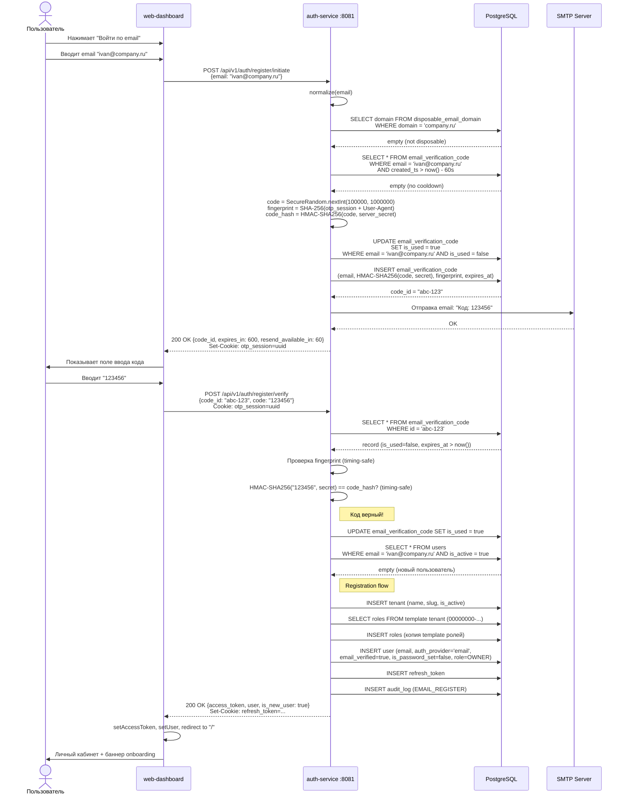
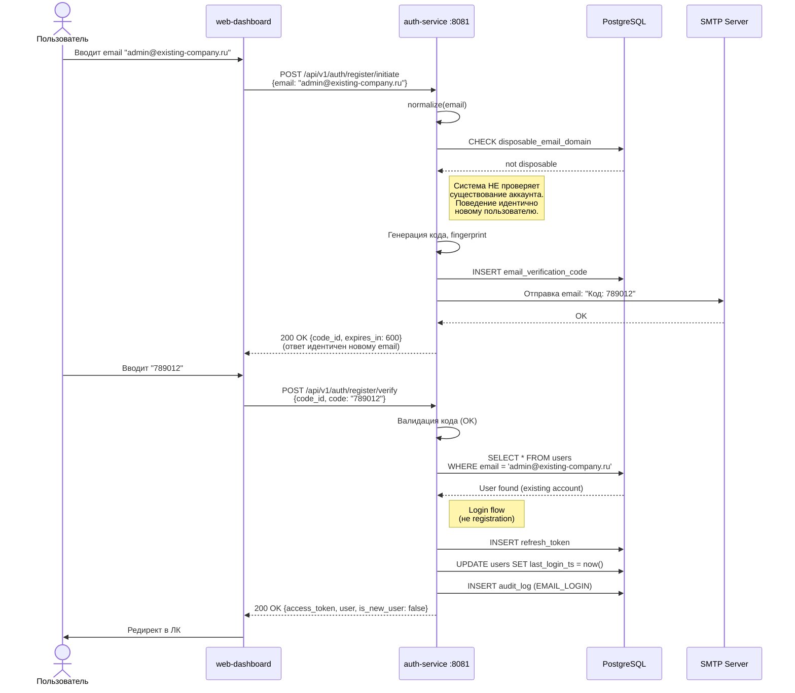
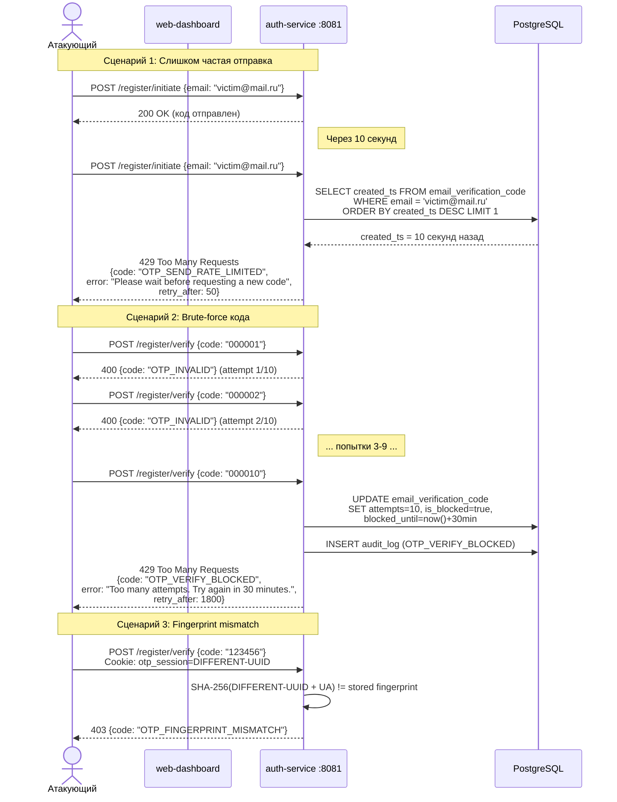
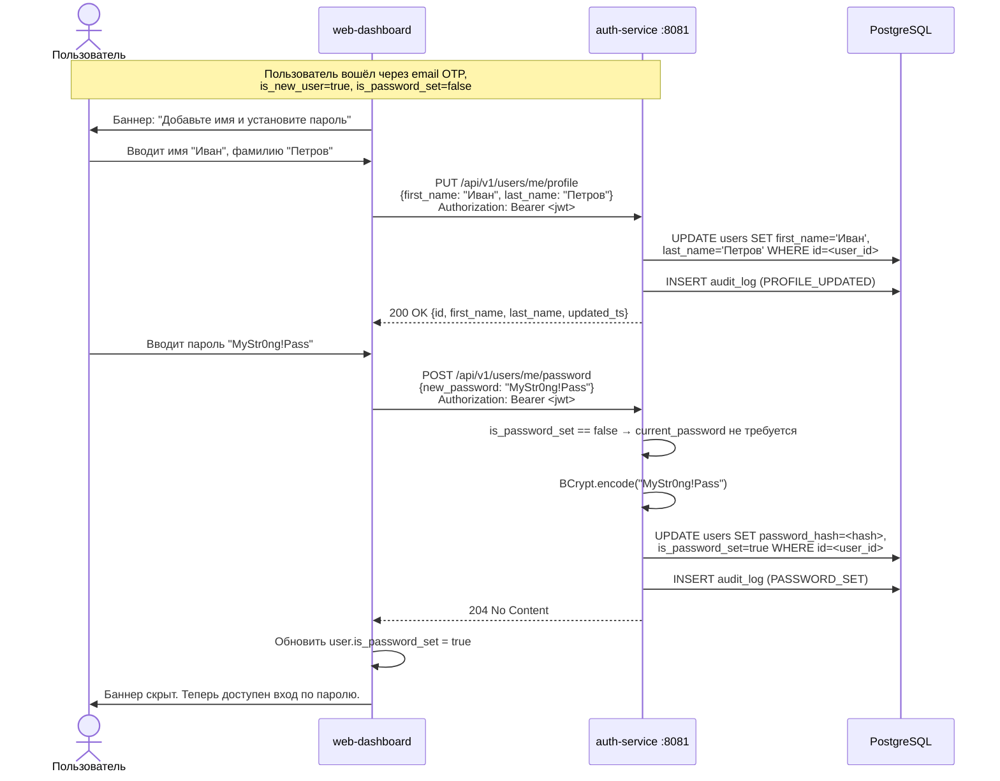

# Email-регистрация и вход по одноразовому коду (OTP)

**Дата**: 2026-03-05
**Обновлено**: 2026-03-05 (Security Audit v1 applied)
**Статус**: Draft → Security Review Passed
**Автор**: Системный аналитик (Claude)

---

## Содержание

1. [Обзор и цели](#1-обзор-и-цели)
2. [User Stories](#2-user-stories)
3. [User Flow](#3-user-flow)
4. [Модель данных](#4-модель-данных)
5. [API контракты](#5-api-контракты)
6. [Sequence Diagrams](#6-sequence-diagrams)
7. [Security](#7-security)
8. [Rate Limiting](#8-rate-limiting)
9. [Email Sending Strategy](#9-email-sending-strategy)
10. [Onboarding Flow](#10-onboarding-flow)
11. [Влияние на существующие компоненты](#11-влияние-на-существующие-компоненты)
12. [Frontend](#12-frontend)
13. [Backward Compatibility](#13-backward-compatibility)
14. [Тест-кейсы](#14-тест-кейсы)
15. [Зависимости и инфраструктура](#15-зависимости-и-инфраструктура)
16. [Rollback Plan](#16-rollback-plan)
17. [Open Questions](#17-open-questions)

---

## 1. Обзор и цели

### Проблема

Текущая система Кадеро поддерживает два способа аутентификации:

1. **Password login** — `POST /api/v1/auth/login` (username + password + optional tenant_slug)
2. **Yandex OAuth** — `GET /api/v1/auth/oauth/yandex` -> callback -> onboarding

Оба способа требуют либо предварительного создания аккаунта администратором (password), либо наличия аккаунта Яндекс (OAuth). Отсутствует возможность самостоятельной регистрации нового пользователя по email без привязки к внешнему OAuth-провайдеру.

### Цель

Реализовать третий способ аутентификации — **Email OTP (One-Time Password)**:

- Пользователь вводит email
- Получает 6-значный код на почту
- Вводит код -> получает JWT -> попадает в систему
- Прогрессивный сбор данных: сначала вход, потом onboarding (имя, пароль)

### Ценность

- Снижение барьера входа: не нужен пароль и не нужен аккаунт Яндекс
- Верифицированный email с первого входа
- Passwordless-first, но с возможностью установить пароль позже
- Консистентность с существующим OAuth-флоу (прогрессивный onboarding)

### Scope

- Регистрация нового пользователя по email + OTP
- Вход существующего пользователя по email + OTP (альтернатива паролю)
- Прогрессивный onboarding (профиль, пароль)
- Rate limiting и защита от brute-force
- Disposable email detection
- Отправка email (SMTP)
- Фронтенд: новые страницы/шаги на LoginPage

### Out of scope

- Magic links (ссылки в письме)
- SMS-верификация
- 2FA / MFA как обязательный второй фактор
- Замена существующих способов входа (password / OAuth остаются)

---

## 2. User Stories

### US-1: Регистрация по email

> Как новый пользователь, я хочу зарегистрироваться в Кадеро, указав свой email и подтвердив его кодом из письма, чтобы начать работу с платформой без необходимости создания пароля.

**Acceptance Criteria:**

- AC-1.1: На странице логина доступна кнопка/ссылка "Войти по email"
- AC-1.2: Пользователь вводит email, система отправляет 6-значный код
- AC-1.3: Пользователь вводит код, система верифицирует его
- AC-1.4: Если email не привязан к аккаунту — создается новый аккаунт, новый тенант, редирект в ЛК
- AC-1.5: Если email привязан к аккаунту — выполняется вход, редирект в ЛК
- AC-1.6: Выданный JWT содержит корректные claims (user_id, tenant_id, roles, permissions)
- AC-1.7: В audit_log записывается событие `EMAIL_REGISTER` или `EMAIL_LOGIN`

### US-2: Вход по email (существующий пользователь)

> Как существующий пользователь, я хочу войти в аккаунт по email + OTP, не вспоминая пароль, чтобы быстро получить доступ к системе.

**Acceptance Criteria:**

- AC-2.1: Пользователь с существующим аккаунтом (любой auth_provider: password, oauth, email) может войти по email + OTP
- AC-2.2: Если у пользователя несколько тенантов — автоматический вход в первый, переключение через TenantSwitcher
- AC-2.3: Система не раскрывает факт существования аккаунта (одинаковый ответ для нового и существующего email)
- AC-2.4: Вход по email OTP обновляет `last_login_ts`

### US-3: Повторная отправка кода

> Как пользователь, я хочу запросить повторную отправку кода, если письмо не пришло, с понятным таймером ожидания.

**Acceptance Criteria:**

- AC-3.1: Кнопка "Отправить повторно" доступна через 60 секунд после предыдущей отправки
- AC-3.2: Предыдущий код инвалидируется при повторной отправке
- AC-3.3: Фронтенд показывает обратный отсчет до возможности повторной отправки
- AC-3.4: Rate limit: не более 5 отправок на один email за 30 минут

### US-4: Прогрессивный onboarding

> Как зарегистрированный пользователь, я хочу по желанию заполнить профиль и установить пароль после регистрации, чтобы расширить возможности входа.

**Acceptance Criteria:**

- AC-4.1: После первого входа по email отображается опциональный баннер onboarding
- AC-4.2: Пользователь может указать имя, фамилию (PUT /api/v1/users/me/profile)
- AC-4.3: Пользователь может установить пароль (POST /api/v1/users/me/password)
- AC-4.4: После установки пароля пользователь может входить как по email OTP, так и по паролю
- AC-4.5: Onboarding не блокирует использование системы

### US-5: Защита от disposable email

> Как система, я хочу отклонять регистрацию с временных (disposable) email-адресов, чтобы предотвратить злоупотребления.

**Acceptance Criteria:**

- AC-5.1: Система проверяет домен email по списку disposable-доменов
- AC-5.2: При попытке использовать disposable email — ответ 400 с кодом `DISPOSABLE_EMAIL`
- AC-5.3: Список доменов хранится в таблице `disposable_email_domain` (начальный seed ~3000 доменов)
- AC-5.4: Проверка timing-safe: одинаковое время ответа для любого домена

### US-6: Brute-force protection

> Как система, я хочу блокировать попытки подбора OTP-кода, чтобы предотвратить несанкционированный доступ.

**Acceptance Criteria:**

- AC-6.1: Максимум 10 попыток ввода кода на один email за одну сессию верификации
- AC-6.2: После 10 неудачных попыток — блокировка ввода на 30 минут, текущий код инвалидируется
- AC-6.3: Максимум 1 отправка кода в 60 секунд на один email
- AC-6.4: Максимум 5 отправок кодов на один email за 30 минут
- AC-6.5: В audit_log фиксируются события `OTP_SEND_RATE_LIMITED`, `OTP_VERIFY_BLOCKED`

---

## 3. User Flow

### 3.1 Регистрация нового пользователя (Happy Path)

```
1. Пользователь открывает /login
2. Нажимает "Войти по email"
3. Вводит email: "ivan@company.ru"
4. Нажимает "Получить код"
   → POST /api/v1/auth/register/initiate
   → Backend: проверка disposable → генерация кода → отправка email → 200 OK
5. Получает email с кодом: "123456"
6. Вводит код на странице верификации
7. Нажимает "Подтвердить"
   → POST /api/v1/auth/register/verify
   → Backend:
     a. Валидация кода (timing-safe, не expired, attempts < 10)
     b. Email НЕ привязан к аккаунту
     c. Создаёт Tenant (auto-slug из email domain)
     d. Копирует системные роли из template tenant
     e. Создаёт User (auth_provider='email', email_verified=true, is_password_set=false)
     f. Назначает роль OWNER
     g. Генерирует JWT (access + refresh)
   → 200 OK {access_token, user, is_new_user: true}
8. Фронтенд: сохраняет токен, редирект в ЛК
9. (Опционально) Появляется баннер: "Заполните профиль и установите пароль"
```

### 3.2 Вход существующего пользователя

```
1-4. Аналогично регистрации
5-6. Аналогично регистрации
7. POST /api/v1/auth/register/verify
   → Backend:
     a. Валидация кода
     b. Email привязан к аккаунту(ам)
     c. Находит первый активный аккаунт
     d. Генерирует JWT
   → 200 OK {access_token, user, is_new_user: false}
8. Фронтенд: сохраняет токен, редирект в ЛК
```

### 3.3 Множественные тенанты

Если email привязан к аккаунтам в нескольких тенантах:

```
7. POST /api/v1/auth/register/verify
   → Backend: находит первый аккаунт, выполняет login
   → 200 OK {access_token, user, is_new_user: false}
8. Пользователь переключает тенанты через TenantSwitcher (существующий механизм)
```

---

## 4. Модель данных

### 4.1 Новая таблица: `email_verification_code`

```sql
-- V25__create_email_verification.sql

-- Таблица OTP-кодов для email-верификации
CREATE TABLE email_verification_code (
    id              UUID        PRIMARY KEY DEFAULT gen_random_uuid(),
    email           VARCHAR(255) NOT NULL,
    code_hash       VARCHAR(64)  NOT NULL,          -- HMAC-SHA256(code, server_secret) от 6-значного кода
    purpose         VARCHAR(20)  NOT NULL DEFAULT 'register',  -- 'register' | 'login'
    fingerprint     VARCHAR(255) NOT NULL,           -- SHA-256(session_cookie + User-Agent)
    attempts        INT          NOT NULL DEFAULT 0, -- кол-во попыток верификации
    max_attempts    INT          NOT NULL DEFAULT 10,
    is_used         BOOLEAN      NOT NULL DEFAULT FALSE,
    is_blocked      BOOLEAN      NOT NULL DEFAULT FALSE,
    blocked_until   TIMESTAMPTZ,                     -- время окончания блокировки
    expires_at      TIMESTAMPTZ  NOT NULL,           -- TTL кода (created_ts + 10 минут)
    created_ts      TIMESTAMPTZ  NOT NULL DEFAULT now(),

    CONSTRAINT chk_purpose CHECK (purpose IN ('register', 'login'))
);

-- Индексы
CREATE INDEX idx_evc_email_created ON email_verification_code (email, created_ts DESC);
CREATE INDEX idx_evc_email_active  ON email_verification_code (email, is_used, expires_at)
    WHERE is_used = FALSE;
CREATE INDEX idx_evc_expires       ON email_verification_code (expires_at)
    WHERE is_used = FALSE;

-- Автоматическая очистка: pg_cron или scheduled task
-- DELETE FROM email_verification_code WHERE expires_at < NOW() - INTERVAL '24 hours';

COMMENT ON TABLE email_verification_code IS 'OTP-коды для email-верификации. Хранит хеш кода, привязку к fingerprint, счётчик попыток.';
COMMENT ON COLUMN email_verification_code.code_hash IS 'HMAC-SHA256(code, server_secret) хеш 6-значного OTP-кода. Код в открытом виде не хранится. HMAC предотвращает rainbow table атаку (пространство 6-значных кодов мало для plain SHA-256).';
COMMENT ON COLUMN email_verification_code.fingerprint IS 'SHA-256(otp_session cookie + User-Agent). Привязывает код к браузерной сессии.';
COMMENT ON COLUMN email_verification_code.purpose IS 'Цель верификации: register (новый/существующий пользователь) или login (вход).';
```

### 4.2 Новая таблица: `disposable_email_domain`

```sql
-- В том же V25__create_email_verification.sql

CREATE TABLE disposable_email_domain (
    domain      VARCHAR(255) PRIMARY KEY,
    added_ts    TIMESTAMPTZ  NOT NULL DEFAULT now()
);

CREATE INDEX idx_ded_domain ON disposable_email_domain (domain);

COMMENT ON TABLE disposable_email_domain IS 'Список запрещённых (disposable) email-доменов. Seed из внешнего списка при миграции.';

-- Seed: основные disposable-домены (сокращённый набор, полный — в отдельном SQL-файле)
INSERT INTO disposable_email_domain (domain) VALUES
    ('mailinator.com'),
    ('guerrillamail.com'),
    ('tempmail.com'),
    ('throwaway.email'),
    ('yopmail.com'),
    ('10minutemail.com'),
    ('trashmail.com'),
    ('sharklasers.com'),
    ('grr.la'),
    ('guerrillamailblock.com'),
    ('tempail.com'),
    ('dispostable.com'),
    ('mailnesia.com'),
    ('maildrop.cc'),
    ('fakeinbox.com'),
    ('temp-mail.org'),
    ('mohmal.com'),
    ('getnada.com')
ON CONFLICT (domain) DO NOTHING;
-- Полный seed (~3000 доменов) выносится в V25_1__seed_disposable_domains.sql
```

### 4.3 Модификация таблицы `users`

```sql
-- В том же V25__create_email_verification.sql

-- Добавляем поля для email-регистрации
ALTER TABLE users ADD COLUMN IF NOT EXISTS email_verified BOOLEAN NOT NULL DEFAULT FALSE;
ALTER TABLE users ADD COLUMN IF NOT EXISTS is_password_set BOOLEAN NOT NULL DEFAULT TRUE;

-- Обратная совместимость: все существующие пользователи
-- password-users: email_verified=false (никогда не верифицировали), is_password_set=true
-- oauth-users: email_verified=true (email подтверждён OAuth-провайдером), is_password_set=false
UPDATE users SET email_verified = TRUE WHERE auth_provider = 'oauth';
UPDATE users SET is_password_set = FALSE WHERE password_hash IS NULL;

-- Обновляем auth_provider CHECK для нового провайдера
-- (auth_provider уже VARCHAR(20) без CHECK constraint, просто документируем)
-- Допустимые значения: 'password', 'oauth', 'email'

-- Индекс для case-insensitive поиска по email (используется в findActiveUsersByEmail)
CREATE INDEX IF NOT EXISTS idx_users_email_lower ON users (LOWER(email)) WHERE is_active = true;

COMMENT ON COLUMN users.email_verified IS 'Email подтверждён через OTP или OAuth-провайдер';
COMMENT ON COLUMN users.is_password_set IS 'Пользователь установил пароль (true для password-users, false для email/oauth без пароля)';
```

### 4.4 Диаграмма модели данных

```
┌─────────────────────────────────┐     ┌──────────────────────┐
│ email_verification_code         │     │ users (modified)      │
├─────────────────────────────────┤     ├──────────────────────┤
│ id            UUID PK           │     │ ...existing fields... │
│ email         VARCHAR(255)      │────>│ email VARCHAR(255)    │
│ code_hash     VARCHAR(64)       │     │ + email_verified BOOL │
│ purpose       VARCHAR(20)       │     │ + is_password_set BOOL│
│ fingerprint   VARCHAR(255)      │     │ auth_provider: +email │
│ attempts      INT               │     └──────────────────────┘
│ max_attempts  INT               │
│ is_used       BOOLEAN           │     ┌──────────────────────┐
│ is_blocked    BOOLEAN           │     │ disposable_email_     │
│ blocked_until TIMESTAMPTZ       │     │ domain                │
│ expires_at    TIMESTAMPTZ       │     ├──────────────────────┤
│ created_ts    TIMESTAMPTZ       │     │ domain VARCHAR PK     │
└─────────────────────────────────┘     │ added_ts TIMESTAMPTZ  │
                                        └──────────────────────┘
```

### 4.5 Решение о партиционировании

Таблица `email_verification_code` **не** партиционируется:
- Коды короткоживущие (TTL 10 минут), хранятся 24 часа максимум
- Scheduled task/pg_cron удаляет expired записи
- Объём данных незначительный даже при 10 000 агентов (пользователей-операторов значительно меньше)
- Простой индекс по `(email, created_ts DESC)` достаточен для всех запросов

---

## 5. API контракты

### Общие конвенции

- Базовый путь: `/api/v1/auth/register/*` (публичные endpoints)
- Формат: JSON, snake_case
- Ошибки: `{"error": "message", "code": "ERROR_CODE"}`
- Fingerprint: cookie `otp_session` (UUID, HttpOnly, SameSite=Strict) + User-Agent header

### 5.1 POST /api/v1/auth/register/initiate

Инициация email-верификации (отправка OTP-кода). Используется как для регистрации, так и для входа -- система не раскрывает, существует ли аккаунт.

**Авторизация:** Public (permitAll)

**Request:**

```json
{
  "email": "ivan@company.ru"
}
```

| Поле  | Тип    | Required | Constraints                                    |
|-------|--------|----------|------------------------------------------------|
| email | string | да       | @Email, max 255, lowercase, trimmed            |

**Response 200 OK:**

```json
{
  "message": "Verification code sent",
  "code_id": "a1b2c3d4-...",
  "expires_in": 600,
  "resend_available_in": 60
}
```

| Поле                | Тип    | Описание                                        |
|---------------------|--------|-------------------------------------------------|
| message             | string | Всегда одинаковое сообщение (не раскрывает факт существования аккаунта) |
| code_id             | UUID   | Идентификатор записи OTP (для resend/verify)    |
| expires_in          | int    | TTL кода в секундах (600)                       |
| resend_available_in | int    | Секунд до возможности повторной отправки (60)   |

**Response Headers:**

```
Set-Cookie: otp_session=<uuid>; HttpOnly; Secure; SameSite=Strict; Path=/; Max-Age=1800
```

Cookie `otp_session` устанавливается при первом initiate и используется для fingerprint при verify.

**Ошибки:**

| HTTP | Code                   | Описание                                          |
|------|------------------------|---------------------------------------------------|
| 400  | VALIDATION_ERROR       | Невалидный email                                  |
| 400  | DISPOSABLE_EMAIL       | Email с disposable-домена                         |
| 429  | OTP_SEND_RATE_LIMITED  | Отправка чаще 1 раза в 60 секунд или >5 за 30 мин |

**Rate Limiting:**

- 1 запрос в 60 секунд на один email (per-email cooldown)
- 5 запросов за 30 минут на один email (per-email window)
- 20 запросов за 5 минут с одного IP (per-IP burst)

**Бизнес-логика:**

1. Нормализация email: `trim().toLowerCase()` + удаление sub-addressing (`+tag` → `user@domain`), нормализация Gmail dot-trick (удаление точек в local part для gmail.com/googlemail.com)
2. Валидация формата email (RFC 5322 basic)
3. Проверка домена в `disposable_email_domain` (timing-safe: всегда выполнять SQL-запрос, даже если домен очевидно не disposable — одинаковое время ответа)
4. Проверка rate limits (email + IP)
5. Генерация 6-значного кода: `SecureRandom.nextInt(100000, 1000000)`
6. Вычисление fingerprint: `SHA-256(otp_session_cookie + ":" + User-Agent)`
7. Инвалидация всех предыдущих неиспользованных кодов для этого email (`is_used = true`)
8. Сохранение: `email_verification_code(email, HMAC-SHA256(code, server_secret), fingerprint, expires_at = now()+10m)` — **HMAC-SHA256**, не plain SHA-256 (rainbow table для 900K кодов тривиальна)
9. Отправка email через SMTP
10. Аудит: `OTP_SENT` (без tenant_id, email в details)

**Email нормализация (шаг 1):**
```java
private String normalizeEmail(String email) {
    email = email.trim().toLowerCase();
    String[] parts = email.split("@", 2);
    if (parts.length != 2) return email;
    String local = parts[0];
    String domain = parts[1];
    // Удаление sub-addressing (user+tag@domain → user@domain)
    int plusIdx = local.indexOf('+');
    if (plusIdx > 0) local = local.substring(0, plusIdx);
    // Gmail dot-trick: first.last@gmail.com == firstlast@gmail.com
    if ("gmail.com".equals(domain) || "googlemail.com".equals(domain)) {
        local = local.replace(".", "");
        domain = "gmail.com"; // googlemail.com → gmail.com
    }
    return local + "@" + domain;
}
```

**HMAC-SHA256 (шаг 8):**
```java
// server_secret — из application.yml (prg.email-otp.hmac-secret)
// Или из K8s Secret (OTP_HMAC_SECRET env var)
private String hmacSha256(String code, String secret) {
    Mac mac = Mac.getInstance("HmacSHA256");
    mac.init(new SecretKeySpec(secret.getBytes(UTF_8), "HmacSHA256"));
    byte[] hash = mac.doFinal(code.getBytes(UTF_8));
    return HexFormat.of().formatHex(hash);
}
```

**Важно:** Если email уже существует в системе — поведение endpoint абсолютно идентично (код отправляется). Timing-safe: одинаковое время ответа.

### 5.2 POST /api/v1/auth/register/verify

Проверка OTP-кода и выдача JWT.

**Авторизация:** Public (permitAll)

**Request:**

```json
{
  "code_id": "a1b2c3d4-...",
  "code": "123456"
}
```

| Поле    | Тип    | Required | Constraints           |
|---------|--------|----------|-----------------------|
| code_id | UUID   | да       | UUID записи OTP       |
| code    | string | да       | 6 цифр, @Pattern      |

**Response 200 OK (существующий пользователь):**

```json
{
  "access_token": "eyJhb...",
  "token_type": "Bearer",
  "expires_in": 900,
  "user": {
    "id": "uuid",
    "tenant_id": "uuid",
    "username": "ivan@company.ru",
    "email": "ivan@company.ru",
    "first_name": "Иван",
    "last_name": "Петров",
    "auth_provider": "email",
    "email_verified": true,
    "is_password_set": false,
    "roles": [{"code": "OWNER", "name": "Владелец"}],
    "permissions": ["DASHBOARD:VIEW", ...],
    "settings": {}
  },
  "is_new_user": false
}
```

**Response 200 OK (новый пользователь):**

```json
{
  "access_token": "eyJhb...",
  "token_type": "Bearer",
  "expires_in": 900,
  "user": {
    "id": "uuid",
    "tenant_id": "uuid",
    "username": "ivan@company.ru",
    "email": "ivan@company.ru",
    "first_name": null,
    "last_name": null,
    "auth_provider": "email",
    "email_verified": true,
    "is_password_set": false,
    "roles": [{"code": "OWNER", "name": "Владелец"}],
    "permissions": ["DASHBOARD:VIEW", ...],
    "settings": {}
  },
  "is_new_user": true
}
```

**Response Headers (при успехе):**

```
Set-Cookie: refresh_token=<uuid>; HttpOnly; Secure; SameSite=Strict; Path=/; Max-Age=2592000
```

**Ошибки:**

| HTTP | Code                    | Описание                                    |
|------|-------------------------|---------------------------------------------|
| 400  | VALIDATION_ERROR        | Невалидный формат code                      |
| 400  | OTP_EXPIRED             | Код истёк (>10 минут)                       |
| 400  | OTP_INVALID             | Неверный код                                |
| 400  | OTP_ALREADY_USED        | Код уже был использован                     |
| 403  | OTP_FINGERPRINT_MISMATCH| Код введён из другого браузера/устройства   |
| 429  | OTP_VERIFY_BLOCKED      | Превышен лимит попыток, блокировка 30 минут |
| 400  | OTP_LOGIN_NOT_ALLOWED   | OTP-вход запрещён для password-аккаунтов (используйте вход по паролю) |
| 400  | TENANT_LIMIT_REACHED    | Превышен лимит тенантов для этого email (макс. 10) |
| 404  | OTP_NOT_FOUND           | Запись кода не найдена                       |

**Бизнес-логика:**

1. Найти `email_verification_code` по `code_id` **с SELECT ... FOR UPDATE** (предотвращает race condition при параллельных verify-запросах — атакующий не может запустить 1000 параллельных verify чтобы обойти лимит attempts)
2. Проверить `is_used == false` -> иначе `OTP_ALREADY_USED`
3. Проверить `expires_at > now()` -> иначе `OTP_EXPIRED`
4. Проверить `is_blocked == false && (blocked_until IS NULL || blocked_until < now())` -> иначе `OTP_VERIFY_BLOCKED`
5. Вычислить fingerprint из cookie + User-Agent
6. Сравнить fingerprint (timing-safe `MessageDigest.isEqual`) -> иначе `OTP_FINGERPRINT_MISMATCH`
7. Инкремент `attempts` (в рамках той же транзакции)
8. Сравнить `HMAC-SHA256(code, server_secret)` с `code_hash` (timing-safe `MessageDigest.isEqual`):
   - Не совпадает:
     - Если `attempts >= max_attempts` -> `is_blocked = true, blocked_until = now() + 30m` -> `OTP_VERIFY_BLOCKED`
     - Иначе -> `OTP_INVALID`
   - Совпадает:
     - `is_used = true`
     - Поиск пользователя по normalized email:
       - **Найден** (один или несколько аккаунтов):
         - **Политика OTP-входа**: OTP-вход разрешён только для пользователей с `auth_provider IN ('email', 'oauth')`. Для `auth_provider='password'` (созданных администратором) — **вход по OTP запрещён** → возврат ошибки `400 OTP_LOGIN_NOT_ALLOWED` с сообщением "Для этого аккаунта используйте вход по паролю". Это предотвращает account takeover: если атакующий получит доступ к email администратора, он не сможет войти через OTP в аккаунт с полными правами.
         - Если разрешён → login flow (как в AuthService.login, но без пароля)
       - **Не найден** -> registration flow:
         1. Проверить лимит тенантов для email (макс. 10, см. OQ-5)
         2. Создать Tenant (name = email domain part, slug = auto-generated)
         3. Скопировать системные роли из template tenant
         4. Создать User (auth_provider='email', email_verified=true, is_password_set=false)
         5. Назначить роль OWNER
     - Сгенерировать JWT access + refresh tokens
     - Аудит: `EMAIL_REGISTER` или `EMAIL_LOGIN`
9. Вернуть LoginResponse + `is_new_user` flag

**SELECT FOR UPDATE (шаг 1):**
```java
@Lock(LockModeType.PESSIMISTIC_WRITE)
@Query("SELECT e FROM EmailVerificationCode e WHERE e.id = :id")
Optional<EmailVerificationCode> findByIdForUpdate(@Param("id") UUID id);
```
Это гарантирует атомарность: два параллельных verify-запроса не могут оба прочитать attempts=9 и оба записать attempts=10 — второй будет ждать commit первого.

### 5.3 POST /api/v1/auth/register/resend

Повторная отправка OTP-кода. Инвалидирует предыдущий код, генерирует новый.

**Авторизация:** Public (permitAll)

**Request:**

```json
{
  "code_id": "a1b2c3d4-..."
}
```

| Поле    | Тип  | Required | Constraints     |
|---------|------|----------|-----------------|
| code_id | UUID | да       | UUID записи OTP |

**Response 200 OK:**

```json
{
  "message": "Verification code sent",
  "code_id": "new-uuid-...",
  "expires_in": 600,
  "resend_available_in": 60
}
```

Ответ идентичен `initiate`. Возвращается **новый** `code_id`.

**Ошибки:**

| HTTP | Code                  | Описание                                  |
|------|-----------------------|-------------------------------------------|
| 404  | OTP_NOT_FOUND         | Исходная запись не найдена                 |
| 429  | OTP_SEND_RATE_LIMITED | Повторная отправка раньше 60 секунд       |
| 429  | OTP_SEND_LIMIT        | Превышен лимит отправок (5 за 30 мин)     |

**Бизнес-логика:**

1. Найти `email_verification_code` по `code_id`
2. Проверить fingerprint
3. Проверить cooldown 60 секунд от `created_ts` последнего кода для этого email
4. Проверить лимит отправок (5 за 30 минут для этого email)
5. Пометить старый код как `is_used = true`
6. Создать новый код (новый `code_id`, новый `code_hash`)
7. Отправить email
8. Вернуть новый `code_id`

### 5.4 GET /api/v1/users/me/profile

Получение профиля текущего пользователя (расширение существующего GET /api/v1/users/me).

**Авторизация:** Authenticated (JWT)

**Note:** Этот endpoint уже существует как `GET /api/v1/users/me`. Необходимо добавить в `UserResponse` новые поля `email_verified` и `is_password_set`. Отдельный endpoint `/me/profile` не создаётся.

**Обновлённый UserResponse:**

```json
{
  "id": "uuid",
  "tenant_id": "uuid",
  "username": "ivan@company.ru",
  "email": "ivan@company.ru",
  "first_name": null,
  "last_name": null,
  "auth_provider": "email",
  "email_verified": true,
  "is_password_set": false,
  "avatar_url": null,
  "is_active": true,
  "roles": [{"code": "OWNER", "name": "Владелец"}],
  "permissions": [...],
  "last_login_ts": "2026-03-05T10:30:00Z",
  "settings": {},
  "created_ts": "2026-03-05T10:30:00Z",
  "updated_ts": "2026-03-05T10:30:00Z"
}
```

### 5.5 PUT /api/v1/users/me/profile

Обновление профиля текущего пользователя (имя, фамилия). Onboarding-шаг.

**Авторизация:** Authenticated (JWT)

**Request:**

```json
{
  "first_name": "Иван",
  "last_name": "Петров"
}
```

| Поле       | Тип    | Required | Constraints        |
|------------|--------|----------|--------------------|
| first_name | string | нет      | max 255, trimmed   |
| last_name  | string | нет      | max 255, trimmed   |

**Response 200 OK:**

```json
{
  "id": "uuid",
  "first_name": "Иван",
  "last_name": "Петров",
  "updated_ts": "2026-03-05T10:35:00Z"
}
```

**Ошибки:**

| HTTP | Code             | Описание              |
|------|------------------|-----------------------|
| 400  | VALIDATION_ERROR | Невалидные данные     |
| 401  | UNAUTHORIZED     | Невалидный/expired JWT |

**Бизнес-логика:**

1. Получить `user_id` из JWT
2. Обновить `first_name`, `last_name` в users
3. Аудит: `PROFILE_UPDATED`

### 5.6 POST /api/v1/users/me/password

Установка пароля текущим пользователем (onboarding для email/oauth пользователей) или смена пароля.

**Авторизация:** Authenticated (JWT)

**Request (установка нового пароля, когда is_password_set=false):**

```json
{
  "new_password": "MyStr0ng!Pass"
}
```

**Request (смена пароля, когда is_password_set=true):**

```json
{
  "current_password": "OldPass123",
  "new_password": "MyStr0ng!Pass"
}
```

| Поле             | Тип    | Required                     | Constraints                     |
|------------------|--------|------------------------------|---------------------------------|
| current_password | string | только если is_password_set  | --                              |
| new_password     | string | да                           | min 8, max 128, complexity TBD  |

**Response 204 No Content**

**Ошибки:**

| HTTP | Code                  | Описание                                    |
|------|-----------------------|---------------------------------------------|
| 400  | VALIDATION_ERROR      | Пароль не соответствует требованиям          |
| 400  | CURRENT_PASSWORD_REQUIRED | is_password_set=true, но current_password не передан |
| 401  | INVALID_CURRENT_PASSWORD  | Текущий пароль неверен                    |
| 401  | UNAUTHORIZED          | Невалидный/expired JWT                       |

**Бизнес-логика:**

1. Получить `user_id` из JWT, найти User
2. Если `is_password_set == true`:
   - `current_password` обязателен
   - Проверить `passwordEncoder.matches(current_password, password_hash)`
3. Хешировать `new_password` (BCrypt)
4. Обновить `password_hash`, `is_password_set = true`
5. Если `auth_provider == 'email'`: оставить 'email' (пользователь может входить и по OTP, и по паролю)
6. Аудит: `PASSWORD_SET` или `PASSWORD_CHANGED`

### 5.7 Сводная таблица endpoints

| Method | Path                               | Auth     | Описание                         |
|--------|-------------------------------------|----------|----------------------------------|
| POST   | /api/v1/auth/register/initiate     | Public   | Отправка OTP на email            |
| POST   | /api/v1/auth/register/verify       | Public   | Проверка OTP, вход/регистрация   |
| POST   | /api/v1/auth/register/resend       | Public   | Повторная отправка OTP           |
| GET    | /api/v1/users/me                   | JWT      | Профиль (уже есть, +2 поля)     |
| PUT    | /api/v1/users/me/profile           | JWT      | Обновление имени/фамилии         |
| POST   | /api/v1/users/me/password          | JWT      | Установка/смена пароля           |

---

## 6. Sequence Diagrams

### 6.1 Регистрация нового пользователя (Happy Path)



### 6.2 Попытка регистрации существующего пользователя



### 6.3 Rate Limiting / Brute-force Protection



### 6.4 Onboarding: установка профиля и пароля



---

## 7. Security

### 7.1 OTP-код

| Параметр              | Значение                                    |
|-----------------------|---------------------------------------------|
| Длина                 | 6 цифр (100000-999999)                      |
| Генератор             | `java.security.SecureRandom`                |
| Хранение              | HMAC-SHA256(code, server_secret) — **не plain SHA-256** (rainbow table для 900K кодов тривиальна) |
| TTL                   | 10 минут                                    |
| Макс. попыток ввода   | 10                                          |
| Блокировка            | 30 минут после исчерпания попыток           |
| Одноразовость         | `is_used = true` после успешной верификации  |
| Инвалидация при resend| Старый код помечается `is_used = true`       |

### 7.2 Fingerprint

Привязка кода к браузерной сессии через:

```
fingerprint = SHA-256(otp_session_cookie + ":" + User-Agent)
```

- `otp_session` — UUID v4, генерируется сервером при `initiate`, передаётся как HttpOnly Secure cookie
- Атакующий, перехвативший email, не сможет использовать код без этого cookie
- Сравнение fingerprint: `MessageDigest.isEqual()` (timing-safe)

### 7.3 Timing-safe операции

| Операция                  | Защита                                       |
|---------------------------|----------------------------------------------|
| Хеширование code          | `HMAC-SHA256(code, server_secret)` — не plain SHA-256 (rainbow table тривиальна для 900K кодов) |
| Сравнение code_hash       | `MessageDigest.isEqual(computed, stored)`     |
| Сравнение fingerprint     | `MessageDigest.isEqual(computed, stored)`     |
| Проверка существования email | Одинаковый response для нового и существующего |
| Проверка disposable domain| **Всегда** выполнять SQL-запрос (даже для популярных доменов). Не использовать early return для не-disposable доменов — иначе timing side-channel раскроет, что домен проверяется |
| Параллельная верификация  | `SELECT ... FOR UPDATE` — предотвращает race condition на attempts counter |

### 7.4 Disposable email detection

- Таблица `disposable_email_domain` с ~3000 доменов (seed из открытого списка)
- SQL: `SELECT COUNT(*) FROM disposable_email_domain WHERE domain = :domain` — **всегда COUNT**, не EXISTS (одинаковый план запроса для любого домена, предотвращает timing-based утечку факта проверки)
- Домен извлекается: `email.substring(email.indexOf('@') + 1).toLowerCase()`
- При `count > 0` — 400 `DISPOSABLE_EMAIL`
- Список можно обновлять через SQL или будущий admin API
- **Важно**: запрос выполняется для КАЖДОГО email (не только подозрительных). Никаких early-return оптимизаций типа "если домен в whitelist — пропустить проверку" — это создаёт timing side-channel

### 7.5 Не раскрывать существование аккаунта

Endpoint `initiate` **всегда** возвращает 200 OK с одинаковым телом ответа, независимо от:
- Существует ли аккаунт с таким email
- Какой auth_provider у аккаунта
- Активен ли аккаунт

Это предотвращает email enumeration attack.

### 7.6 SecurityFilterChain

Добавить в `permitAll()`:

```java
.requestMatchers(
    "/api/v1/auth/login",
    "/api/v1/auth/refresh",
    "/api/v1/auth/device-login",
    "/api/v1/auth/device-refresh",
    "/api/v1/auth/oauth/yandex",
    "/api/v1/auth/oauth/yandex/callback",
    "/api/v1/auth/oauth/select-tenant",
    "/api/v1/auth/oauth/onboarding",
    "/api/v1/auth/register/initiate",    // NEW
    "/api/v1/auth/register/verify",      // NEW
    "/api/v1/auth/register/resend",      // NEW
    "/actuator/health",
    "/actuator/info"
).permitAll()
```

---

## 8. Rate Limiting

### 8.1 Стратегия хранения

Текущий auth-service использует `ConcurrentHashMap` для rate limiting login-попыток (in-memory, per-instance). Для OTP rate limiting применяем аналогичный подход:

- **Per-email cooldown** (60 сек между отправками): проверка по `created_ts` последнего кода в БД
- **Per-email window** (5 за 30 мин): COUNT в БД
- **Per-IP burst** (20 за 5 мин): `ConcurrentHashMap<String, List<Long>>` in-memory
- **Per-code attempts** (10 попыток): поле `attempts` в таблице `email_verification_code`

Использование БД для per-email limits гарантирует корректность при нескольких репликах auth-service.

> ⚠️ **Per-IP limit across replicas**: In-memory `ConcurrentHashMap` rate limiting для IP означает, что при 2 репликах auth-service атакующий получает удвоенный лимит (20 × 2 = 40 запросов). Это **приемлемый компромисс** на текущем этапе:
> - Per-email limits (основная защита) хранятся в БД и работают корректно
> - Per-IP — дополнительный слой, двойной лимит не критичен
> - Для production-масштаба рассмотреть: Redis rate limiting или Traefik rate limit middleware (настраивается в IngressRoute)

### 8.4 CAPTCHA (рекомендация на будущее)

На текущем этапе CAPTCHA не реализуется. Вместо неё:
- Fingerprint binding (otp_session cookie)
- Rate limiting (per-email + per-IP)
- Блокировка после 10 попыток

**Когда добавлять CAPTCHA:**
- Если зафиксирован автоматизированный abuse OTP-отправки (спам email)
- Если per-IP rate limiting недостаточен (ботнет)
- Рекомендуемое решение: reCAPTCHA v3 (invisible) на `initiate` endpoint, проверка score > 0.5

### 8.2 Сводка лимитов

| Лимит                  | Scope     | Значение    | Хранение | Ответ при превышении   |
|------------------------|-----------|-------------|----------|------------------------|
| Отправка cooldown      | per-email | 60 сек      | DB       | 429 OTP_SEND_RATE_LIMITED |
| Отправка window        | per-email | 5 / 30 мин  | DB       | 429 OTP_SEND_LIMIT     |
| IP burst               | per-IP    | 20 / 5 мин  | In-memory| 429 TOO_MANY_REQUESTS  |
| Verify attempts        | per-code  | 10          | DB       | 429 OTP_VERIFY_BLOCKED |
| Verify block duration  | per-email | 30 мин      | DB       | 429 OTP_VERIFY_BLOCKED |

### 8.3 Конфигурация (application.yml)

```yaml
prg:
  email-otp:
    code-ttl: 600              # секунд (10 минут)
    code-length: 6
    max-verify-attempts: 10
    block-duration: 1800       # секунд (30 минут)
    send-cooldown: 60          # секунд между отправками
    send-window-max: 5         # макс. отправок в window
    send-window-duration: 1800 # секунд (30 минут)
    ip-burst-max: 20           # макс. запросов с IP
    ip-burst-window: 300       # секунд (5 минут)
    hmac-secret: ${OTP_HMAC_SECRET:}  # ОБЯЗАТЕЛЬНО установить в K8s Secret (crypto-random, min 32 chars)
    max-tenants-per-email: 10  # макс. тенантов на один email
```

---

## 9. Email Sending Strategy

### 9.1 Зависимость

Добавить в `pom.xml`:

```xml
<dependency>
    <groupId>org.springframework.boot</groupId>
    <artifactId>spring-boot-starter-mail</artifactId>
</dependency>
```

### 9.2 Конфигурация SMTP

```yaml
spring:
  mail:
    host: ${SMTP_HOST:sm16.hosting.reg.ru}
    port: ${SMTP_PORT:465}
    username: ${SMTP_USERNAME:otp@shepaland.ru}
    password: ${SMTP_PASSWORD:}
    properties:
      mail:
        smtp:
          auth: true
          ssl:
            enable: true
          starttls:
            enable: false
        transport:
          protocol: smtp

prg:
  email:
    from: ${EMAIL_FROM:otp@shepaland.ru}
    from-name: ${EMAIL_FROM_NAME:Кадеро}
```

### 9.3 Email template

**Subject:** `Код подтверждения Кадеро`

> ⚠️ **Security**: OTP-код НЕ включается в Subject. Код только в теле письма. Причина: Subject виден в push-уведомлениях, email preview, логах email-серверов — утечка кода через наблюдение за экраном жертвы.

**Body (HTML):**

```html
<div style="font-family: -apple-system, BlinkMacSystemFont, 'Segoe UI', Roboto, sans-serif; max-width: 480px; margin: 0 auto; padding: 32px;">
  <div style="text-align: center; margin-bottom: 24px;">
    <h1 style="font-size: 20px; color: #1a1a1a; margin: 0;">Кадеро</h1>
  </div>

  <p style="color: #333; font-size: 16px; line-height: 1.5;">
    Ваш код подтверждения:
  </p>

  <div style="background: #f5f5f5; border-radius: 8px; padding: 20px; text-align: center; margin: 24px 0;">
    <span style="font-size: 32px; font-weight: 700; letter-spacing: 8px; color: #1a1a1a;">
      {code}
    </span>
  </div>

  <p style="color: #666; font-size: 14px; line-height: 1.5;">
    Код действует 10 минут. Если вы не запрашивали код, проигнорируйте это письмо.
  </p>

  <hr style="border: none; border-top: 1px solid #eee; margin: 24px 0;" />

  <p style="color: #999; font-size: 12px;">
    Это автоматическое сообщение от платформы Кадеро. Не отвечайте на него.
  </p>
</div>
```

### 9.4 EmailService (интерфейс)

```java
public interface EmailService {
    void sendVerificationCode(String to, String code);
}
```

Реализация через `JavaMailSender` (Spring Mail). В тестовой среде можно использовать mock или логирование кода в консоль.

### 9.5 Отказоустойчивость

- Если SMTP недоступен — endpoint `initiate` возвращает 503 `EMAIL_SERVICE_UNAVAILABLE`
- Код генерируется и сохраняется в БД **до** отправки email
- Если отправка упала — код удаляется (rollback транзакции), повторный запрос возможен сразу
- Таймаут SMTP-подключения: 5 секунд
- Таймаут отправки: 10 секунд

### 9.6 Инфраструктура email

**Решено:** SMTP-сервер хостинга reg.ru:

| Параметр | Значение |
|----------|----------|
| SMTP Host | `sm16.hosting.reg.ru` |
| SMTP IP | `31.31.196.35` |
| SMTP Port | `465` (SSL) |
| Username | `otp@shepaland.ru` |
| From | `otp@shepaland.ru` |
| From Name | `Кадеро` |

### 9.7 SPF / DKIM / DMARC (обязательно для production)

Для обеспечения доставляемости email и предотвращения спуфинга необходимо настроить DNS-записи:

| Запись | Тип | Значение | Описание |
|--------|-----|----------|----------|
| SPF | TXT | `v=spf1 redirect=_spf.yandex.net` | Разрешить Yandex отправлять email от имени домена |
| DKIM | TXT | Ключ из Yandex 360 admin panel | Подпись email для верификации подлинности |
| DMARC | TXT | `v=DMARC1; p=quarantine; rua=mailto:dmarc@kadero.ru` | Политика обработки неаутентифицированных email |

**Без SPF/DKIM**: email с кодами будут попадать в спам у большинства получателей (Gmail, Mail.ru, Outlook).

**Порядок настройки:**
1. Подключить домен kadero.ru к Yandex 360
2. Добавить SPF TXT-запись
3. Активировать DKIM в Yandex 360, добавить DKIM TXT-запись
4. Добавить DMARC TXT-запись
5. Проверить через mail-tester.com или MXToolbox

---

## 10. Onboarding Flow

### 10.1 Автоматическое создание тенанта при регистрации

При регистрации нового пользователя через email OTP система автоматически создаёт тенант:

| Поле          | Значение                                                |
|---------------|--------------------------------------------------------|
| tenant.name   | `Моя компания` (фиксированное название, пользователь может изменить позже в настройках) |
| tenant.slug   | auto-generated: `company-<random-6-chars>` (напр. `company-a3b7c1`) |
| tenant.settings | `{"session_ttl_max_days": 30}`                       |
| user.username | email (напр. ivan@company.ru)                          |
| user.email    | email                                                  |
| user.auth_provider | `email`                                           |
| user.email_verified | `true`                                           |
| user.is_password_set | `false`                                         |
| user.roles    | `OWNER`                                                |

Логика аналогична `OnboardingService.onboard()` (OAuth onboarding), но без OAuthIdentity/UserOAuthLink.

### 10.2 Прогрессивный сбор данных

Onboarding НЕ блокирует использование системы. Пользователь сразу попадает в ЛК и может:

1. Работать с системой (просматривать дашборд, настраивать устройства)
2. В любой момент заполнить профиль (PUT /api/v1/users/me/profile)
3. В любой момент установить пароль (POST /api/v1/users/me/password)

### 10.3 Onboarding Indicators (фронтенд)

Если `is_new_user == true` при первом входе или `is_password_set == false`:

- Баннер вверху страницы: "Добро пожаловать! Заполните профиль и установите пароль для дополнительной безопасности"
- Иконка "!" на пункте меню "Настройки" (badge)
- На странице Настройки: секции "Имя и фамилия" и "Установить пароль" выделены

Баннер скрывается:
- При нажатии "Позже" (хранится в `user.settings.onboarding_dismissed`)
- Автоматически, если `first_name != null && is_password_set == true`

---

## 11. Влияние на существующие компоненты

### 11.1 Обзор влияния

| Сервис/Компонент          | Файл                              | Тип изменения                        |
|---------------------------|------------------------------------|--------------------------------------|
| **DB (Flyway)**           | `V25__create_email_verification.sql` | Новая миграция                      |
| **auth-service**          | `SecurityConfig.java`             | 3 новых public endpoints             |
| **auth-service**          | `pom.xml`                         | +spring-boot-starter-mail            |
| **auth-service**          | `application.yml`                 | +mail config, +email-otp config      |
| **auth-service**          | `User.java` (entity)              | +emailVerified, +isPasswordSet       |
| **auth-service**          | `UserResponse.java` (DTO)         | +emailVerified, +isPasswordSet       |
| **auth-service**          | `UserRepository.java`             | +findByEmailAndIsActiveTrue          |
| **auth-service** (new)    | `EmailVerificationCode.java`      | Новая entity                         |
| **auth-service** (new)    | `DisposableEmailDomain.java`      | Новая entity                         |
| **auth-service** (new)    | `EmailVerificationCodeRepository` | Новый repository                     |
| **auth-service** (new)    | `DisposableEmailDomainRepository` | Новый repository                     |
| **auth-service** (new)    | `EmailOtpService.java`            | Новый сервис: initiate, verify, resend |
| **auth-service** (new)    | `EmailService.java`               | Новый сервис: отправка email         |
| **auth-service** (new)    | `EmailOtpConfig.java`             | Конфигурация OTP параметров          |
| **auth-service** (new)    | `EmailRegistrationController.java`| Новый контроллер (3 endpoints)       |
| **auth-service** (new)    | `ProfileController.java` или в `UserController.java` | profile + password endpoints |
| **auth-service** (new)    | DTO: `InitiateRequest`, `VerifyRequest`, `ResendRequest`, `InitiateResponse`, `VerifyResponse`, `UpdateProfileRequest`, `SetPasswordRequest` | Новые DTO |
| **web-dashboard**         | `LoginPage.tsx`                   | +кнопка "Войти по email", +email/OTP шаги |
| **web-dashboard** (new)   | `EmailVerifyPage.tsx` или шаг в LoginPage | Поле ввода 6-значного кода    |
| **web-dashboard**         | `auth.ts` (api client)            | +initiateEmailOtp, +verifyEmailOtp, +resendOtp |
| **web-dashboard**         | `auth.ts` (types)                 | +InitiateOtpRequest/Response, +VerifyOtpRequest/Response |
| **web-dashboard**         | `AuthContext.tsx`                  | +loginWithEmail метод                |
| **web-dashboard**         | `App.tsx`                         | Возможно новый route (или шаг в login) |
| **web-dashboard**         | `SettingsPage.tsx`                | +секция "Установить пароль", +onboarding banner |
| **web-dashboard**         | `types/auth.ts`                   | +email_verified, +is_password_set в User |
| **k8s ConfigMap**         | `configmaps.yaml` (test/prod)     | +SMTP vars, +EMAIL_FROM              |
| **k8s Secrets**           | `secrets.yaml` (test/prod)        | +SMTP_PASSWORD                       |
| **k8s NetworkPolicy**     | `network-policies.yaml`           | +auth-service egress к SMTP (port 465) |

### 11.2 Файлы, которые НЕ затрагиваются

- **control-plane** — не затрагивается (email-регистрация только в auth-service)
- **ingest-gateway** — не затрагивается
- **playback-service** — не затрагивается
- **search-service** — не затрагивается
- **macOS / Windows Agent** — не затрагиваются
- **JwtTokenProvider** — не требует изменений (JWT claims одинаковы для всех auth_provider)
- **OAuthService / OnboardingService** — не изменяются (email flow параллелен OAuth flow)

### 11.3 Совместимость с существующими auth flows

| Flow            | Влияние                                                 |
|-----------------|--------------------------------------------------------|
| Password login  | Без изменений. Пользователь с auth_provider='email' и is_password_set=true может также входить по паролю |
| OAuth login     | Без изменений. OAuth-users получат email_verified=true, is_password_set=false при миграции |
| Device login    | Без изменений                                          |
| Refresh token   | Без изменений                                          |
| TenantSwitcher  | Без изменений. Email-users с несколькими тенантами переключаются через existing switchTenant |

---

## 12. Frontend

### 12.1 Модификация LoginPage

Текущая страница `/login` содержит:
1. Форму username + password
2. Кнопку "Войти через Яндекс"

Добавляется третий способ входа между формой и Яндекс-кнопкой:

```
┌─────────────────────────────────┐
│        Имя пользователя         │
│        [_______________]        │
│        Пароль                   │
│        [_______________]        │
│        [     Войти      ]       │
│                                 │
│        ──── или ────            │
│                                 │
│   [ Войти по email ↗ ]          │  <-- НОВАЯ кнопка
│                                 │
│        ──── или ────            │
│                                 │
│   [ Войти через Яндекс ]       │
└─────────────────────────────────┘
```

При нажатии "Войти по email" LoginPage переключается в multi-step режим:

**Step 1: Ввод email**
```
┌─────────────────────────────────┐
│   Вход по email                 │
│   ← назад к выбору способа     │
│                                 │
│   Email                         │
│   [_______________]             │
│                                 │
│   [ Получить код ]              │
└─────────────────────────────────┘
```

**Step 2: Ввод кода**
```
┌─────────────────────────────────┐
│   Проверка email                │
│   Код отправлен на              │
│   ivan@company.ru               │
│                                 │
│   [_ _ _ _ _ _]                 │  <-- 6 отдельных полей
│                                 │
│   [ Подтвердить ]               │
│                                 │
│   Отправить повторно (0:48)     │
│   ← Изменить email              │
└─────────────────────────────────┘
```

### 12.2 Новые API-функции (web-dashboard/src/api/auth.ts)

```typescript
// --- Email OTP ---

export interface InitiateOtpRequest {
  email: string;
}

export interface InitiateOtpResponse {
  message: string;
  code_id: string;
  expires_in: number;
  resend_available_in: number;
}

export interface VerifyOtpRequest {
  code_id: string;
  code: string;
}

export interface VerifyOtpResponse {
  access_token: string;
  token_type: string;
  expires_in: number;
  user: User;
  is_new_user: boolean;
}

export interface ResendOtpRequest {
  code_id: string;
}

export async function initiateEmailOtp(data: InitiateOtpRequest): Promise<InitiateOtpResponse> {
  const response = await apiClient.post<InitiateOtpResponse>('/auth/register/initiate', data);
  return response.data;
}

export async function verifyEmailOtp(data: VerifyOtpRequest): Promise<VerifyOtpResponse> {
  const response = await apiClient.post<VerifyOtpResponse>('/auth/register/verify', data);
  setAccessToken(response.data.access_token);
  if (response.data.user) {
    response.data.user = normalizeUser(response.data.user);
  }
  return response.data;
}

export async function resendEmailOtp(data: ResendOtpRequest): Promise<InitiateOtpResponse> {
  const response = await apiClient.post<InitiateOtpResponse>('/auth/register/resend', data);
  return response.data;
}
```

### 12.3 Обновление типов (web-dashboard/src/types/auth.ts)

```typescript
export interface User {
  // ...existing fields...
  email_verified?: boolean;
  is_password_set?: boolean;
}
```

### 12.4 Onboarding баннер (SettingsPage)

На странице `/settings` добавить секции:

1. **"Установить пароль"** (если `is_password_set == false`)
   - Два поля: "Пароль" + "Подтвердите пароль"
   - Кнопка "Установить пароль"
   - POST /api/v1/users/me/password

2. **"Имя и фамилия"** (если `first_name == null`)
   - Поля: "Имя", "Фамилия"
   - Кнопка "Сохранить"
   - PUT /api/v1/users/me/profile

---

## 13. Backward Compatibility

### 13.1 Миграция данных

| Категория пользователей | email_verified | is_password_set | auth_provider | Комментарий |
|--------------------------|----------------|-----------------|---------------|-------------|
| Существующие password-users (superadmin, admin) | `false` | `true` | `password` (без изменений) | Могут верифицировать email через OTP позже |
| Существующие OAuth-users | `true` | `false` | `oauth` (без изменений) | Email подтверждён OAuth-провайдером |
| Новые email-users | `true` | `false` | `email` | Создаются через email OTP flow |

### 13.2 Обратная совместимость API

- Все существующие endpoints работают без изменений
- `UserResponse` получает 2 новых optional-поля — клиенты, не знающие о них, их проигнорируют (`spring.jackson.default-property-inclusion: non_null`)
- Новые endpoints (`/register/*`, `/me/profile`, `/me/password`) не конфликтуют с существующими
- `GET /api/v1/users/me` — добавлены `email_verified` и `is_password_set`, существующие клиенты не сломаются

### 13.3 Сценарий: email-user пытается войти по паролю

Если email-user установил пароль (`is_password_set=true`):
- `POST /api/v1/auth/login` с `username=ivan@company.ru` и `password=...` работает
- `findActivePasswordUsersByUsername` найдёт пользователя с `auth_provider='email'`

Нужна модификация: в `UserRepository.findActivePasswordUsersByUsername` убрать фильтр `u.authProvider = 'password'` и заменить на `u.passwordHash IS NOT NULL`:

```java
@Query("SELECT u FROM User u JOIN FETCH u.roles r JOIN FETCH r.permissions JOIN u.tenant t " +
       "WHERE u.username = :username AND u.isActive = true AND t.isActive = true " +
       "AND u.passwordHash IS NOT NULL")
List<User> findActivePasswordUsersByUsername(@Param("username") String username);
```

Это позволит email-users (и oauth-users, если они установили пароль) входить через обычный password login.

> ⚠️ **ВАЖНО — регрессия AuthService.login()**: При изменении `findActivePasswordUsersByUsername` необходимо проверить, что `AuthService.login()` продолжает корректно работать:
> 1. Метод ищет пользователей по username → теперь найдёт и email-users с паролем
> 2. Проверка password_hash `passwordEncoder.matches()` — работает без изменений
> 3. **Тест-кейс T38** покрывает этот сценарий (password login после установки пароля email-user)
> 4. Tenant selection logic (когда username существует в нескольких тенантах) — без изменений, использует тот же механизм
> 5. `findActiveUsersByUsername` (для TenantSwitcher) — **НЕ изменять**, он используется для другой цели

### 13.4 Сценарий: email коллизия между тенантами

Email уникален в рамках тенанта (`uq_users_tenant_email`). Один email может существовать в нескольких тенантах. При входе по email OTP — выбирается первый активный аккаунт (ORDER BY tenant.created_ts ASC). Переключение между тенантами — через TenantSwitcher.

Новый query в `UserRepository`:

```java
@Query("SELECT u FROM User u JOIN FETCH u.roles r JOIN FETCH r.permissions JOIN u.tenant t " +
       "WHERE LOWER(u.email) = LOWER(:email) AND u.isActive = true AND t.isActive = true " +
       "ORDER BY t.createdTs ASC")
List<User> findActiveUsersByEmail(@Param("email") String email);
```

> ⚠️ **LOWER()**: Обязательно использовать `LOWER()` в запросе — email хранится как есть (case-sensitive column), но поиск должен быть case-insensitive. Индекс: `CREATE INDEX idx_users_email_lower ON users (LOWER(email))` добавить в V25 миграцию.

---

## 14. Тест-кейсы

### 14.1 Матрица тестов: Initiate

| # | Сценарий | Email | Ожидание | HTTP | Code |
|---|----------|-------|----------|------|------|
| T1 | Новый email, валидный | ivan@company.ru | Код отправлен | 200 | — |
| T2 | Существующий email | admin@existing.ru | Код отправлен (тот же ответ) | 200 | — |
| T3 | Невалидный email | "not-an-email" | Ошибка валидации | 400 | VALIDATION_ERROR |
| T4 | Пустой email | "" | Ошибка валидации | 400 | VALIDATION_ERROR |
| T5 | Disposable email | test@mailinator.com | Отклонён | 400 | DISPOSABLE_EMAIL |
| T6 | Повторная отправка < 60 сек | ivan@company.ru | Rate limited | 429 | OTP_SEND_RATE_LIMITED |
| T7 | 6-я отправка за 30 мин | ivan@company.ru | Rate limited | 429 | OTP_SEND_LIMIT |
| T8 | IP burst (21-й запрос за 5 мин) | любой | Rate limited | 429 | TOO_MANY_REQUESTS |
| T9 | Email > 255 символов | very-long@... | Ошибка валидации | 400 | VALIDATION_ERROR |
| T10 | Email с пробелами | " ivan@co.ru " | Trimmed, код отправлен | 200 | — |
| T11 | Email UPPERCASE | IVAN@COMPANY.RU | Lowercased, код отправлен | 200 | — |

### 14.2 Матрица тестов: Verify

| # | Сценарий | Ожидание | HTTP | Code |
|---|----------|----------|------|------|
| T12 | Верный код, новый email | Регистрация + JWT | 200 | — |
| T13 | Верный код, существующий email | Вход + JWT | 200 | — |
| T14 | Неверный код (1-я попытка) | Ошибка | 400 | OTP_INVALID |
| T15 | Неверный код (10-я попытка) | Блокировка 30 мин | 429 | OTP_VERIFY_BLOCKED |
| T16 | Верный код после блокировки | Блокировка | 429 | OTP_VERIFY_BLOCKED |
| T17 | Expired код (>10 мин) | Ошибка | 400 | OTP_EXPIRED |
| T18 | Уже использованный код | Ошибка | 400 | OTP_ALREADY_USED |
| T19 | Неверный code_id | Не найден | 404 | OTP_NOT_FOUND |
| T20 | Другой fingerprint (другой браузер) | Отклонён | 403 | OTP_FINGERPRINT_MISMATCH |
| T21 | Код после resend (старый код) | Уже использован | 400 | OTP_ALREADY_USED |
| T22 | Код после resend (новый код) | Успех | 200 | — |
| T23 | Код формат не 6 цифр | Валидация | 400 | VALIDATION_ERROR |
| T24 | Email привязан к 3 тенантам | Вход в первый | 200 | — |
| T25 | Email привязан к деактивированному аккаунту | Как новый | 200 | — |

### 14.3 Матрица тестов: Resend

| # | Сценарий | Ожидание | HTTP | Code |
|---|----------|----------|------|------|
| T26 | Resend через 60+ сек | Новый код отправлен | 200 | — |
| T27 | Resend через < 60 сек | Rate limited | 429 | OTP_SEND_RATE_LIMITED |
| T28 | Resend 6-й раз за 30 мин | Rate limited | 429 | OTP_SEND_LIMIT |
| T29 | Resend с несуществующим code_id | Не найден | 404 | OTP_NOT_FOUND |
| T30 | Resend с другим fingerprint | Отклонён | 403 | OTP_FINGERPRINT_MISMATCH |

### 14.4 Матрица тестов: Profile + Password

| # | Сценарий | Ожидание | HTTP | Code |
|---|----------|----------|------|------|
| T31 | PUT /me/profile с first_name, last_name | Обновлено | 200 | — |
| T32 | PUT /me/profile без JWT | Unauthorized | 401 | UNAUTHORIZED |
| T33 | POST /me/password (is_password_set=false) без current_password | Пароль установлен | 204 | — |
| T34 | POST /me/password (is_password_set=true) без current_password | Ошибка | 400 | CURRENT_PASSWORD_REQUIRED |
| T35 | POST /me/password (is_password_set=true) с верным current_password | Пароль изменён | 204 | — |
| T36 | POST /me/password (is_password_set=true) с неверным current_password | Ошибка | 401 | INVALID_CURRENT_PASSWORD |
| T37 | POST /me/password — слишком короткий (<8 символов) | Валидация | 400 | VALIDATION_ERROR |
| T38 | Password login после установки пароля email-user | Успешный вход | 200 | — |

### 14.5 Тесты безопасности

| # | Сценарий | Ожидание |
|---|----------|----------|
| T39 | Timing: initiate с существующим email vs новым | Одинаковое время ответа (+-50ms) |
| T40 | Code enumeration: 000000-999999 brute force | Блокировка после 10 попыток |
| T41 | Parallel initiate (race condition) | Только один код валиден |
| T42 | Replay attack: повторное использование valid code | OTP_ALREADY_USED |
| T43 | Cross-session: код из одного браузера, verify из другого | OTP_FINGERPRINT_MISMATCH |
| T44 | SMTP timeout: отправка при недоступном SMTP | 503 EMAIL_SERVICE_UNAVAILABLE |
| T45 | SQL injection в email | Валидация @Email отклоняет |
| T46 | Email с sub-addressing (user+tag@gmail.com) | Нормализован до user@gmail.com, один код на оба |
| T47 | Gmail dot-trick (f.i.r.s.t@gmail.com vs first@gmail.com) | Нормализован, один код |
| T48 | OTP login для password-user (auth_provider='password') | 400 OTP_LOGIN_NOT_ALLOWED |
| T49 | OTP login для email-user (auth_provider='email') | 200 OK (разрешён) |
| T50 | OTP login для oauth-user (auth_provider='oauth') | 200 OK (разрешён) |
| T51 | Parallel verify race condition (2 concurrent requests) | Только один успех, SELECT FOR UPDATE |
| T52 | Tenant limit: 11-й тенант для одного email | 400 TENANT_LIMIT_REACHED |
| T53 | HMAC-SHA256: verify с modified code_hash в DB | OTP_INVALID (HMAC без секрета не подделать) |

---

## 15. Зависимости и инфраструктура

### 15.1 Новые Maven-зависимости

```xml
<!-- pom.xml auth-service -->
<dependency>
    <groupId>org.springframework.boot</groupId>
    <artifactId>spring-boot-starter-mail</artifactId>
</dependency>
```

Никаких других новых зависимостей не требуется. `SecureRandom`, `MessageDigest`, `javax.crypto.Mac` — стандартная Java. HMAC-SHA256 через `Mac.getInstance("HmacSHA256")`. SHA-256 для fingerprint уже реализована в `AuthService.sha256()`.

### 15.2 Новые Java-файлы (перечень)

```
auth-service/src/main/java/com/prg/auth/
├── config/
│   └── EmailOtpConfig.java                    // @ConfigurationProperties(prefix = "prg.email-otp")
├── controller/
│   └── EmailRegistrationController.java       // 3 endpoints: initiate, verify, resend
├── dto/
│   ├── request/
│   │   ├── InitiateOtpRequest.java
│   │   ├── VerifyOtpRequest.java
│   │   ├── ResendOtpRequest.java
│   │   ├── UpdateProfileRequest.java
│   │   └── SetPasswordRequest.java
│   └── response/
│       ├── InitiateOtpResponse.java
│       └── VerifyOtpResponse.java             // extends LoginResponse + is_new_user
├── entity/
│   ├── EmailVerificationCode.java
│   └── DisposableEmailDomain.java
├── repository/
│   ├── EmailVerificationCodeRepository.java
│   └── DisposableEmailDomainRepository.java
└── service/
    ├── EmailOtpService.java                   // бизнес-логика OTP
    └── EmailService.java                      // отправка email (Spring Mail)
```

### 15.3 Модифицируемые файлы

```
auth-service/
├── pom.xml                                    // +spring-boot-starter-mail
├── src/main/resources/
│   ├── application.yml                        // +spring.mail, +prg.email-otp, +prg.email
│   └── db/migration/
│       └── V25__create_email_verification.sql // новая миграция
├── src/main/java/com/prg/auth/
│   ├── config/SecurityConfig.java             // +permitAll для register/*
│   ├── entity/User.java                       // +emailVerified, +isPasswordSet
│   ├── dto/response/UserResponse.java         // +emailVerified, +isPasswordSet
│   ├── repository/UserRepository.java         // +findActiveUsersByEmail, fix findActivePasswordUsers
│   ├── controller/UserController.java         // +PUT /me/profile, +POST /me/password
│   └── service/UserService.java               // +updateProfile, +setPassword

web-dashboard/src/
├── api/auth.ts                                // +initiateEmailOtp, +verifyEmailOtp, +resendOtp
├── types/auth.ts                              // +email_verified, +is_password_set, +OTP types
├── pages/LoginPage.tsx                        // +email/OTP flow steps
├── pages/SettingsPage.tsx                     // +password section, +onboarding banner
└── contexts/AuthContext.tsx                   // +loginWithEmail method
```

### 15.4 Kubernetes / Infrastructure

| Ресурс | Изменение |
|--------|-----------|
| `configmaps.yaml` (test) | +SMTP_HOST, +SMTP_PORT, +EMAIL_FROM, +EMAIL_FROM_NAME |
| `configmaps.yaml` (prod) | +SMTP_HOST, +SMTP_PORT, +EMAIL_FROM, +EMAIL_FROM_NAME |
| `secrets.yaml` (test) | +SMTP_USERNAME, +SMTP_PASSWORD, +OTP_HMAC_SECRET (base64, crypto-random 32+ chars) |
| `secrets.yaml` (prod) | +SMTP_USERNAME, +SMTP_PASSWORD, +OTP_HMAC_SECRET (base64, crypto-random 32+ chars) |
| `network-policies.yaml` | auth-service egress: +порт 465 (SMTP SSL) для sm16.hosting.reg.ru (31.31.196.35) |

### 15.5 Очистка expired кодов

Два варианта:

**Вариант A: Spring @Scheduled (рекомендуется для старта)**

```java
@Scheduled(fixedRate = 3600000) // каждый час
public void cleanupExpiredCodes() {
    emailVerificationCodeRepository.deleteExpired(Instant.now().minus(24, ChronoUnit.HOURS));
}
```

**Вариант B: pg_cron (для production масштаба)**

```sql
SELECT cron.schedule('cleanup-otp-codes', '0 * * * *',
    $$DELETE FROM email_verification_code WHERE expires_at < NOW() - INTERVAL '24 hours'$$
);
```

---

## 16. Rollback Plan

### 16.1 Миграция базы данных

Миграция V25 добавляет:
- Таблицу `email_verification_code` (новая, нет зависимостей)
- Таблицу `disposable_email_domain` (новая, нет зависимостей)
- Колонки `email_verified`, `is_password_set` в `users`

**Rollback SQL (выполнять вручную, Flyway не поддерживает автоматический rollback):**

```sql
-- Откат V25
ALTER TABLE users DROP COLUMN IF EXISTS email_verified;
ALTER TABLE users DROP COLUMN IF EXISTS is_password_set;
DROP TABLE IF EXISTS email_verification_code;
DROP TABLE IF EXISTS disposable_email_domain;
DELETE FROM flyway_schema_history WHERE version = '25';
```

### 16.2 Обратная совместимость кода

- Если новые поля `email_verified` / `is_password_set` добавлены в UserResponse, но фронтенд откатили — поля просто игнорируются (JSON non_null)
- Если новые endpoints откатили — фронтенд показывает ошибку 404, можно скрыть кнопку "Войти по email" через feature flag
- Существующие auth flows (password, OAuth) не затрагиваются, rollback не нарушит их работу

### 16.3 Feature flag

Не реализуется. Email-регистрация включена для всех сразу после деплоя. При необходимости отключения — удалить endpoints из `permitAll()` в SecurityConfig и перезадеплоить.

---

## 17. Open Questions

| # | Вопрос | Влияние | Рекомендация |
|---|--------|---------|--------------|
| OQ-1 | Какой SMTP-сервер использовать? | Доставляемость, лимиты | **Решено:** `otp@shepaland.ru` на `sm16.hosting.reg.ru:465` (31.31.196.35) |
| OQ-2 | Нужен ли email-домен kadero.ru? | SPF/DKIM, доставляемость | Используем shepaland.ru, SPF/DKIM настроить для домена |
| OQ-3 | Имя тенанта при авто-создании: какой формат? | UX, уникальность | **Решено:** name=`Моя компания`, slug=`company-<random-6>` |
| OQ-4 | Должен ли email-user без пароля входить через `POST /auth/login`? | Обратная совместимость | Нет, только через OTP (passwordHash == null -> password login rejected) |
| OQ-5 | Максимальное количество тенантов на одного email-пользователя? | Злоупотребления | **Решено: ограничить 10 тенантами**. Проверка при регистрации: `SELECT COUNT(*) FROM users WHERE LOWER(email) = LOWER(:email) AND is_active = true`. Если >= 10 → ошибка `400 TENANT_LIMIT_REACHED`. Конфигурация: `prg.email-otp.max-tenants-per-email: 10` |
| OQ-6 | Нужен ли onboarding wizard (multi-step) или достаточно баннера? | UX complexity | Баннер + секции на странице настроек (минимальный объём фронтенда) |
| OQ-7 | Нужна ли email-нотификация о входе из нового места? | Безопасность | Отложить на следующую итерацию |
| OQ-8 | Seed disposable domains: встроить в миграцию или загружать при старте? | Размер миграции | Отдельный SQL-файл V25_1, seed ~3000 доменов |
| OQ-9 | Email-login для device-users (агентов)? | Scope | Нет, агенты входят через device-login + registration token |
| OQ-10 | Нужен ли `POST /api/v1/auth/login/email/initiate` (отдельный endpoint для входа)? | API design | Нет, `/register/initiate` и `/register/verify` обрабатывают оба случая (вход + регистрация) |

---

## Приложения

### A. Конфигурация (полная секция application.yml)

```yaml
prg:
  email-otp:
    enabled: true
    code-ttl: 600
    code-length: 6
    max-verify-attempts: 10
    block-duration: 1800
    send-cooldown: 60
    send-window-max: 5
    send-window-duration: 1800
    ip-burst-max: 20
    ip-burst-window: 300
    hmac-secret: ${OTP_HMAC_SECRET:}  # ОБЯЗАТЕЛЬНО! Crypto-random, min 32 символов
    max-tenants-per-email: 10
  email:
    from: ${EMAIL_FROM:otp@shepaland.ru}
    from-name: ${EMAIL_FROM_NAME:Кадеро}

spring:
  mail:
    host: ${SMTP_HOST:sm16.hosting.reg.ru}
    port: ${SMTP_PORT:465}
    username: ${SMTP_USERNAME:otp@shepaland.ru}
    password: ${SMTP_PASSWORD:}
    properties:
      mail:
        smtp:
          auth: true
          ssl:
            enable: true
          connectiontimeout: 5000
          timeout: 10000
          writetimeout: 10000
```

### B. Entropy кода

6-значный код (100000-999999): 900 000 возможных комбинаций.

При 10 попытках вероятность угадать: `10 / 900000 = 0.0011%` (~1 из 90 000).

При использовании fingerprint + rate limiting + блокировки — атака практически невозможна.

### C. Размер данных

При 10 000 OTP-запросов в день (пессимистичная оценка):
- Размер одной записи: ~300 байт
- Хранение 24 часа: ~3 MB
- Индексы: ~1 MB
- Нагрузка на БД: незначительная

Таблица `disposable_email_domain`:
- ~3000 записей по ~50 байт = ~150 KB
- Один запрос SELECT per initiate — 0.1ms с индексом

---

### D. Security Audit Changelog (v1, 2026-03-05)

Аудит проведён security-reviewer агентом. Все HIGH findings исправлены в спецификации.

| # | Severity | Finding | Fix в спеке |
|---|----------|---------|-------------|
| F-01 | **HIGH** | SHA-256 без salt для OTP — rainbow table для 900K кодов тривиальна | → HMAC-SHA256 с server_secret (секции 4.1, 5.1, 5.2, 7.1, 7.3) |
| F-07 | **HIGH** | Account takeover: OTP-вход для password-users даёт доступ без пароля | → OTP-вход только для auth_provider IN ('email','oauth'). Password-users → 400 OTP_LOGIN_NOT_ALLOWED (секция 5.2) |
| F-14 | **HIGH** | Регрессия findActivePasswordUsersByUsername при изменении фильтра | → Документировано: проверить AuthService.login() совместимость, добавлен тест T38 (секция 13.3) |
| F-02 | MEDIUM | Per-IP rate limit in-memory: удвоение при 2 репликах | → Документировано как приемлемый компромисс, рекомендация Redis/Traefik для production (секция 8.1) |
| F-04 | MEDIUM | Email sub-addressing bypass: user+spam@gmail.com обходит per-email лимит | → Email нормализация: strip +tag, Gmail dot-trick (секция 5.1) |
| F-06 | MEDIUM | Disposable email timing side-channel | → Всегда SQL-запрос, не EXISTS а COUNT, никаких early-return (секции 5.1, 7.3, 7.4) |
| F-08 | MEDIUM | Нет CAPTCHA — бот может спамить initiate | → Отложено, добавлена секция 8.4 с рекомендацией reCAPTCHA v3 |
| F-10 | MEDIUM | OTP-код в Subject email виден в notifications | → Убран из Subject, только в теле (секция 9.3) |
| F-12 | MEDIUM | Race condition: параллельные verify обходят attempts limit | → SELECT FOR UPDATE на email_verification_code (секция 5.2) |
| F-13 | MEDIUM | Нет лимита тенантов — DoS через создание тысяч тенантов | → max-tenants-per-email: 10, ошибка TENANT_LIMIT_REACHED (секция 5.2, OQ-5) |
| F-20 | MEDIUM | findActiveUsersByEmail без LOWER() — case-sensitive поиск | → LOWER() в запросе + индекс idx_users_email_lower (секции 4.3, 13.4) |
| F-11 | LOW | Нет SPF/DKIM/DMARC — email попадут в спам | → Добавлена секция 9.7 с инструкцией настройки DNS |
| F-15 | LOW | hmac-secret для OTP не в конфигурации | → Добавлен OTP_HMAC_SECRET в secrets.yaml и application.yml (секции 8.3, 15.4, Приложение A) |

**Новые тест-кейсы по security findings:** T46–T53 (секция 14.5)

