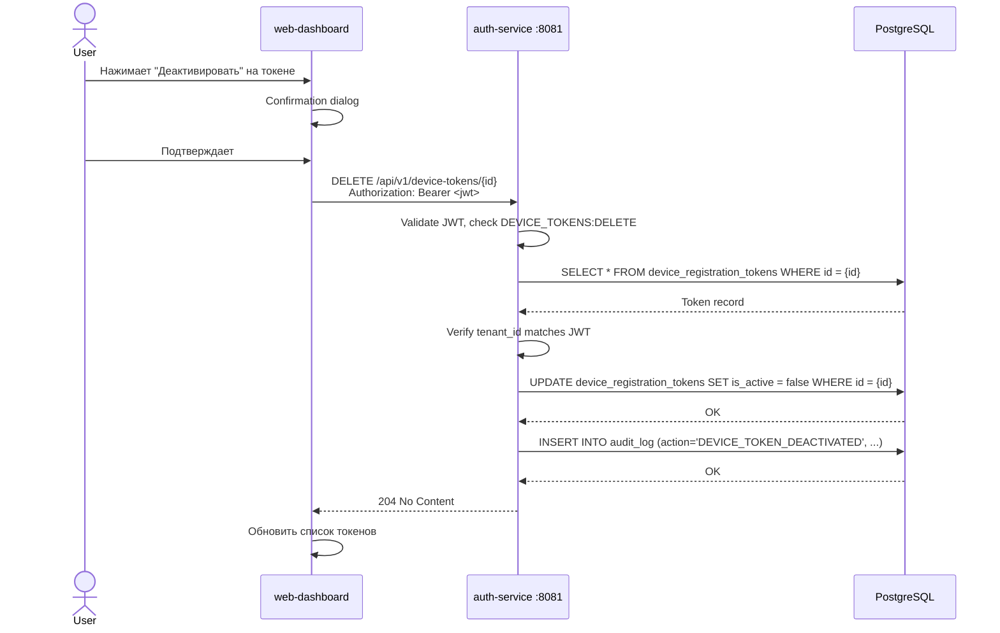
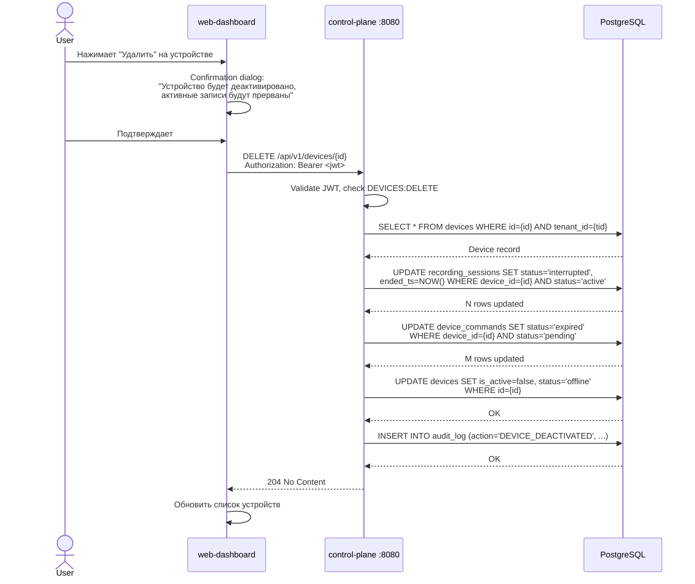
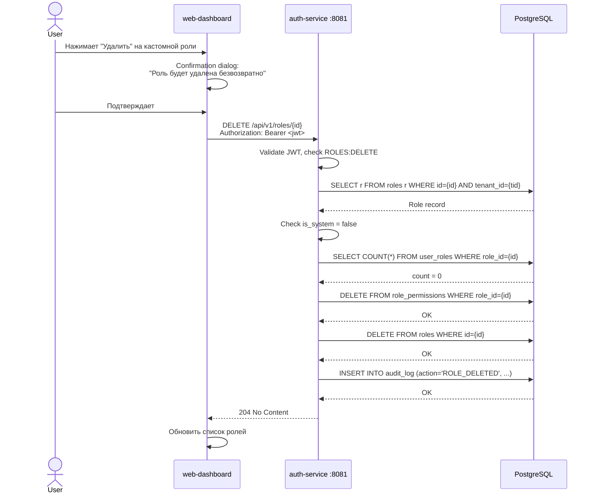
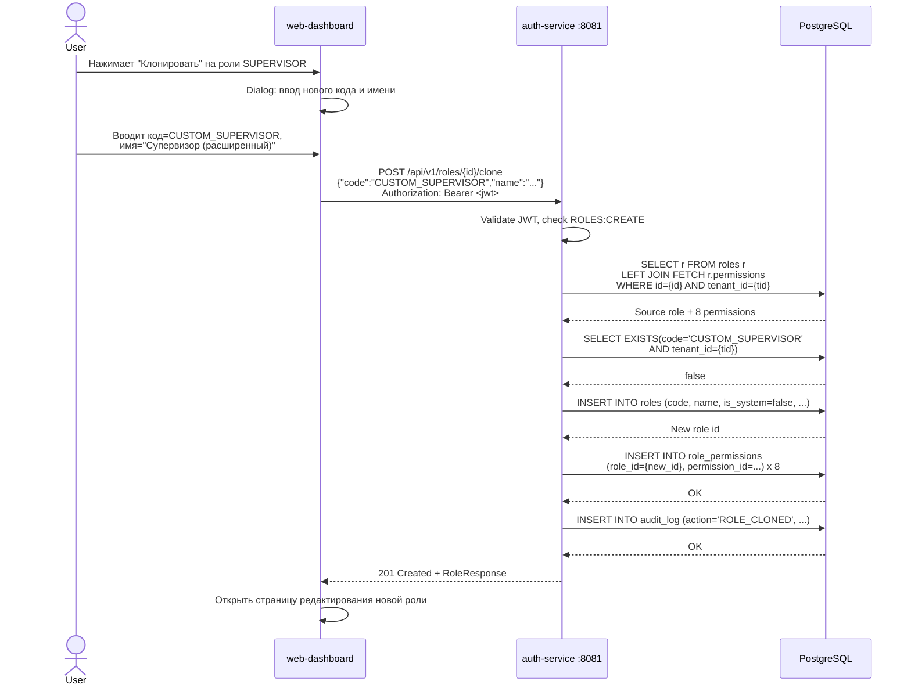
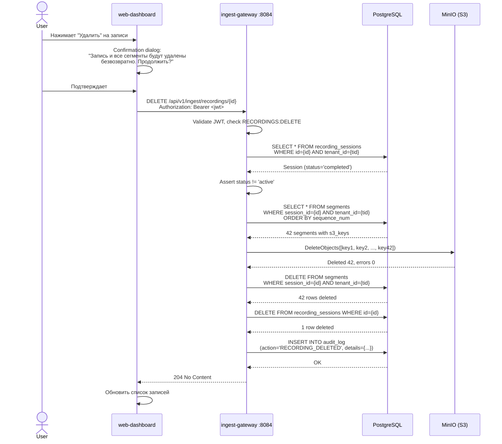
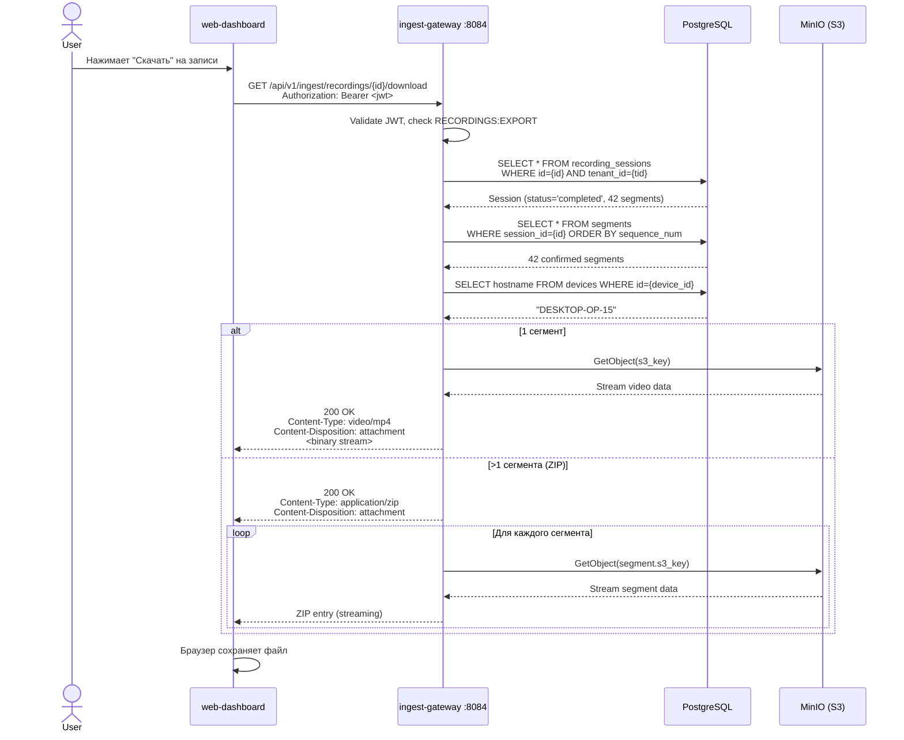

# Операции управления списками: удаление, клонирование, скачивание

| Поле | Значение |
|------|----------|
| Документ | LIST_MANAGEMENT_OPERATIONS |
| Дата | 2026-03-05 |
| Статус | DRAFT |
| Автор | System Analyst (Claude) |
| Затрагивает | auth-service, control-plane, ingest-gateway, web-dashboard |

---

## Содержание

1. [Обзор](#1-обзор)
2. [Токены регистрации -- удаление](#2-токены-регистрации----удаление)
3. [Устройства -- удаление](#3-устройства----удаление)
4. [Роли -- удаление и клонирование](#4-роли----удаление-и-клонирование)
5. [Записи -- удаление и скачивание](#5-записи----удаление-и-скачивание)
6. [Миграции БД](#6-миграции-бд)
7. [Сводная таблица API](#7-сводная-таблица-api)
8. [Межсервисное взаимодействие](#8-межсервисное-взаимодействие)

---

## 1. Обзор

### 1.1. Цель документа

Спецификация API-контрактов для операций управления списками сущностей платформы Кадеро:
- **Удаление** токенов регистрации, устройств, ролей, записей
- **Клонирование** ролей
- **Скачивание** записей

### 1.2. Общие принципы

| Принцип | Реализация |
|---------|------------|
| Tenant isolation | Все операции фильтруют по `tenant_id` из JWT. Cross-tenant доступ невозможен |
| Аудит | Каждая деструктивная операция записывается в `audit_log` |
| Идемпотентность | Повторный DELETE на уже удалённый ресурс возвращает 404, не 500 |
| Soft vs Hard delete | Определяется per-entity (см. ниже) |
| Подтверждение | Frontend отвечает за confirmation dialog. Backend не требует подтверждения |

### 1.3. Стратегия удаления по сущностям

| Сущность | Тип удаления | Обоснование |
|----------|--------------|-------------|
| Токен регистрации | **Soft delete** (deactivate) | Уже реализовано. Токены привязаны к устройствам через `registration_token_id` |
| Устройство | **Soft delete** (deactivate + status=offline) | Устройства ссылаются на recording_sessions (FK). Hard delete нарушит историю |
| Роль | **Hard delete** | Только кастомные (is_system=false). Перед удалением проверка на привязанных пользователей |
| Запись (сессия + сегменты) | **Hard delete** + удаление из S3 | Данные видео удаляются безвозвратно. Требуется подтверждение на уровне UI |

---

## 2. Токены регистрации -- удаление

### 2.1. Текущее состояние

Удаление токена регистрации **уже реализовано** как soft delete (деактивация):

| Компонент | Файл | Статус |
|-----------|------|--------|
| Controller | `DeviceTokenController.deleteMapping("/{id}")` | DONE |
| Service | `DeviceTokenService.deactivateToken()` | DONE |
| Repository | `DeviceRegistrationTokenRepository` | DONE |
| Permission | `DEVICE_TOKENS:DELETE` | DONE |
| Audit | `DEVICE_TOKEN_DEACTIVATED` | DONE |

### 2.2. API-контракт (существующий)

```
DELETE /api/v1/device-tokens/{id}
Authorization: Bearer <jwt>
Permission: DEVICE_TOKENS:DELETE
```

**Response:** `204 No Content`

**Ошибки:**

| HTTP code | Error code | Условие |
|-----------|------------|---------|
| 401 | UNAUTHORIZED | Нет/невалидный JWT |
| 403 | ACCESS_DENIED | Нет permission `DEVICE_TOKENS:DELETE` |
| 404 | TOKEN_NOT_FOUND | Токен не найден или принадлежит другому tenant |

### 2.3. Каскадные эффекты

- Устройства, зарегистрированные через этот токен, **остаются активными** (`devices.registration_token_id` -- мягкая ссылка)
- Деактивированный токен не может быть использован для новых регистраций
- Деактивация **необратима** (нет endpoint для реактивации)

### 2.4. Необходимые изменения

**Изменения не требуются** -- функциональность полностью реализована.

### 2.5. Sequence Diagram



---

## 3. Устройства -- удаление

### 3.1. Текущее состояние

Удаление устройства **частично реализовано** как soft delete (деактивация):

| Компонент | Файл | Статус |
|-----------|------|--------|
| Controller | `DeviceController.deleteMapping("/{id}")` | DONE |
| Service | `DeviceService.deactivateDevice()` | DONE, но без аудита и без завершения сессий |
| Permission | `DEVICES:DELETE` | DONE |
| Audit | Нет | **MISSING** |
| Завершение сессий | Нет | **MISSING** |

### 3.2. API-контракт (существующий, требует доработки)

```
DELETE /api/v1/devices/{id}
Authorization: Bearer <jwt>
Permission: DEVICES:DELETE
```

**Response:** `204 No Content`

**Ошибки:**

| HTTP code | Error code | Условие |
|-----------|------------|---------|
| 401 | UNAUTHORIZED | Нет/невалидный JWT |
| 403 | ACCESS_DENIED | Нет permission `DEVICES:DELETE` |
| 404 | DEVICE_NOT_FOUND | Устройство не найдено или принадлежит другому tenant |

### 3.3. Каскадные эффекты (требуется реализовать)

При деактивации устройства:

1. **Завершить активные recording sessions** устройства (status `active` -> `interrupted`, `ended_ts` = NOW())
2. **Отменить pending команды** устройства (status `pending` -> `expired`)
3. **Установить** `is_active = false`, `status = 'offline'`
4. **Записать аудит** `DEVICE_DEACTIVATED`

### 3.4. Необходимые изменения

#### 3.4.1. control-plane: DeviceService.deactivateDevice()

Текущий код:
```java
@Transactional
public void deactivateDevice(UUID deviceId, UUID tenantId) {
    Device device = findDeviceByIdAndTenant(deviceId, tenantId);
    device.setIsActive(false);
    device.setStatus("offline");
    deviceRepository.save(device);
}
```

Требуемый код:
```java
@Transactional
public void deactivateDevice(UUID deviceId, UUID tenantId, UUID userId,
                              String ipAddress, String userAgent) {
    Device device = findDeviceByIdAndTenant(deviceId, tenantId);

    // 1. Отменить pending команды
    List<DeviceCommand> pendingCommands = deviceCommandRepository
            .findPendingCommandsByDeviceIdAndTenantId(deviceId, tenantId, Instant.now());
    for (DeviceCommand cmd : pendingCommands) {
        cmd.setStatus("expired");
    }
    if (!pendingCommands.isEmpty()) {
        deviceCommandRepository.saveAll(pendingCommands);
        log.info("Expired {} pending commands for deactivated device: id={}", pendingCommands.size(), deviceId);
    }

    // 2. Деактивировать устройство
    device.setIsActive(false);
    device.setStatus("offline");
    deviceRepository.save(device);

    log.info("Device deactivated: id={}, hostname={}, tenant_id={}, expired_commands={}",
            device.getId(), device.getHostname(), tenantId, pendingCommands.size());
}
```

#### 3.4.2. control-plane: DeviceController.deactivateDevice()

Требуется передать userId, ipAddress, userAgent в сервис:
```java
@DeleteMapping("/{id}")
public ResponseEntity<Void> deactivateDevice(
        @PathVariable UUID id,
        HttpServletRequest httpRequest) {
    DevicePrincipal principal = getPrincipal(httpRequest);
    requirePermission(principal, "DEVICES:DELETE");

    deviceService.deactivateDevice(id, principal.getTenantId(),
            principal.getUserId(), getClientIp(httpRequest),
            httpRequest.getHeader("User-Agent"));
    return ResponseEntity.noContent().build();
}
```

#### 3.4.3. ingest-gateway: завершение активных сессий

**Вариант A (рекомендуемый):** control-plane делает HTTP-запрос в ingest-gateway для завершения сессий устройства.

**Вариант B:** control-plane обновляет recording_sessions напрямую (оба сервиса используют одну БД).

Рекомендуется **Вариант B**, так как NATS ещё не развёрнут, а оба сервиса работают с одной PostgreSQL. Необходимо:

1. Добавить в control-plane `RecordingSessionRepository` (read-write на `recording_sessions`):

```java
@Repository
public interface RecordingSessionRepository extends JpaRepository<RecordingSession, UUID> {
    @Modifying
    @Query("""
        UPDATE RecordingSession rs
        SET rs.status = 'interrupted', rs.endedTs = :now, rs.updatedTs = :now
        WHERE rs.deviceId = :deviceId
          AND rs.tenantId = :tenantId
          AND rs.status = 'active'
    """)
    int interruptActiveSessionsByDeviceId(
            @Param("deviceId") UUID deviceId,
            @Param("tenantId") UUID tenantId,
            @Param("now") Instant now);
}
```

2. Вызвать в `DeviceService.deactivateDevice()` перед деактивацией устройства.

#### 3.4.4. Аудит

control-plane не имеет AuditService. Два варианта:

**Вариант A (рекомендуемый):** Добавить AuditService в control-plane, пишущий напрямую в `audit_log`.

**Вариант B:** HTTP-запрос в auth-service `/api/v1/internal/audit`.

Рекомендуется **Вариант A** -- прямая запись в ту же БД, без сетевого вызова.

### 3.5. Миграции

**Миграция не требуется** -- все необходимые таблицы и колонки уже существуют.

### 3.6. Sequence Diagram



---

## 4. Роли -- удаление и клонирование

### 4.1. Текущее состояние

| Компонент | Статус | Замечание |
|-----------|--------|-----------|
| DELETE /api/v1/roles/{id} | **DONE** | Hard delete, проверка is_system и привязанных пользователей |
| Clone (POST /api/v1/roles/{id}/clone) | **MISSING** | Требуется новый endpoint |

### 4.2. Удаление роли -- API-контракт (существующий)

```
DELETE /api/v1/roles/{id}
Authorization: Bearer <jwt>
Permission: ROLES:DELETE
```

**Response:** `204 No Content`

**Ошибки:**

| HTTP code | Error code | Условие |
|-----------|------------|---------|
| 400 | SYSTEM_ROLE | `is_system = true` -- "System roles cannot be deleted" |
| 400 | ROLE_HAS_USERS | У роли есть привязанные пользователи |
| 401 | UNAUTHORIZED | Нет/невалидный JWT |
| 403 | ACCESS_DENIED | Нет permission `ROLES:DELETE` |
| 404 | ROLE_NOT_FOUND | Роль не найдена или принадлежит другому tenant |

### 4.3. Удаление роли -- каскадные эффекты

1. `role_permissions` -- записи удаляются каскадно (JPA `@ManyToMany` с `@JoinTable`)
2. `user_roles` -- если есть привязанные пользователи, удаление **блокируется** (возвращается 400 ROLE_HAS_USERS)
3. Аудит: `ROLE_DELETED` -- уже реализован

### 4.4. Удаление роли -- необходимые изменения

Функциональность полностью реализована. Замечание по качеству:

**Рекомендация:** Заменить `IllegalArgumentException` на кастомный `BusinessRuleException`, чтобы контролировать HTTP-код ответа (400 vs 500). Сейчас Spring может интерпретировать `IllegalArgumentException` по-разному.

### 4.5. Клонирование роли -- новый endpoint

#### 4.5.1. User Story

> **Как** администратор тенанта,
> **я хочу** клонировать существующую роль (включая системную) с новым кодом и именем,
> **чтобы** быстро создать модифицированную роль на основе существующей, не назначая permissions вручную.

#### 4.5.2. Acceptance Criteria

1. Endpoint `POST /api/v1/roles/{id}/clone` создаёт новую роль с копией permissions из исходной роли
2. Новая роль ВСЕГДА создаётся как `is_system = false` (кастомная)
3. Клонирование системных ролей разрешено (это основной use case)
4. При дублировании `code` в рамках tenant -- ошибка 409
5. Пользователи исходной роли НЕ переносятся в клон
6. Создаётся запись аудита `ROLE_CLONED`

#### 4.5.3. API-контракт

```
POST /api/v1/roles/{id}/clone
Authorization: Bearer <jwt>
Permission: ROLES:CREATE
Content-Type: application/json
```

**Request Body:**

```json
{
  "code": "CUSTOM_SUPERVISOR",
  "name": "Супервизор (расширенный)",
  "description": "Расширенная роль супервизора с возможностью удаления записей"
}
```

| Поле | Тип | Обязательное | Валидация | Описание |
|------|-----|-------------|-----------|----------|
| `code` | `string` | Да | `^[A-Z][A-Z0-9_]*$`, 3-100 символов | Уникальный код роли в рамках tenant |
| `name` | `string` | Да | 3-255 символов | Человекочитаемое имя |
| `description` | `string` | Нет | max 1000 символов | Описание. Если не указан, копируется из исходной роли |

**Response:** `201 Created`

```json
{
  "id": "b2c3d4e5-f6a7-8b9c-0d1e-2f3a4b5c6d7e",
  "code": "CUSTOM_SUPERVISOR",
  "name": "Супервизор (расширенный)",
  "description": "Расширенная роль супервизора с возможностью удаления записей",
  "is_system": false,
  "permissions": [
    {
      "id": "...",
      "code": "DEVICES:READ",
      "name": "View devices",
      "resource": "DEVICES",
      "action": "READ"
    }
  ],
  "permissions_count": 8,
  "users_count": 0,
  "created_ts": "2026-03-05T12:00:00Z",
  "updated_ts": "2026-03-05T12:00:00Z"
}
```

**Ошибки:**

| HTTP code | Error code | Условие |
|-----------|------------|---------|
| 400 | VALIDATION_ERROR | Невалидный код/имя |
| 401 | UNAUTHORIZED | Нет/невалидный JWT |
| 403 | ACCESS_DENIED | Нет permission `ROLES:CREATE` |
| 404 | ROLE_NOT_FOUND | Исходная роль не найдена или принадлежит другому tenant |
| 409 | ROLE_CODE_ALREADY_EXISTS | Код роли уже существует в этом tenant |

#### 4.5.4. DTO

**CloneRoleRequest.java** (новый файл):

```java
package com.prg.auth.dto.request;

import jakarta.validation.constraints.NotBlank;
import jakarta.validation.constraints.Pattern;
import jakarta.validation.constraints.Size;
import lombok.*;

@Data
@Builder
@NoArgsConstructor
@AllArgsConstructor
public class CloneRoleRequest {

    @NotBlank(message = "Role code is required")
    @Size(min = 3, max = 100, message = "Role code must be between 3 and 100 characters")
    @Pattern(regexp = "^[A-Z][A-Z0-9_]*$", message = "Role code must be UPPER_SNAKE_CASE")
    private String code;

    @NotBlank(message = "Role name is required")
    @Size(min = 3, max = 255, message = "Role name must be between 3 and 255 characters")
    private String name;

    @Size(max = 1000, message = "Description must not exceed 1000 characters")
    private String description;
}
```

#### 4.5.5. RoleService.cloneRole()

```java
@Transactional
public RoleResponse cloneRole(UUID sourceRoleId, CloneRoleRequest request, UUID tenantId,
                               UserPrincipal principal, String ipAddress, String userAgent) {
    // 1. Найти исходную роль с permissions
    Role sourceRole = roleRepository.findByIdAndTenantIdWithPermissions(sourceRoleId, tenantId)
            .orElseThrow(() -> new ResourceNotFoundException("Role not found", "ROLE_NOT_FOUND"));

    // 2. Проверить уникальность кода
    if (roleRepository.existsByTenantIdAndCode(tenantId, request.getCode())) {
        throw new DuplicateResourceException(
                "Role code already exists in this tenant", "ROLE_CODE_ALREADY_EXISTS");
    }

    // 3. Получить tenant
    Tenant tenant = tenantRepository.findById(tenantId)
            .orElseThrow(() -> new ResourceNotFoundException("Tenant not found", "TENANT_NOT_FOUND"));

    // 4. Создать клон (ВСЕГДА is_system = false)
    String description = request.getDescription() != null
            ? request.getDescription()
            : sourceRole.getDescription();

    Role clonedRole = Role.builder()
            .tenant(tenant)
            .code(request.getCode())
            .name(request.getName())
            .description(description)
            .isSystem(false)
            .permissions(new HashSet<>(sourceRole.getPermissions()))
            .build();

    clonedRole = roleRepository.save(clonedRole);

    // 5. Аудит
    auditService.logAction(tenantId, principal.getUserId(), "ROLE_CLONED", "ROLES", clonedRole.getId(),
            Map.of(
                "source_role_id", sourceRoleId.toString(),
                "source_role_code", sourceRole.getCode(),
                "new_code", clonedRole.getCode(),
                "permissions_count", clonedRole.getPermissions().size()
            ),
            ipAddress, userAgent, null);

    log.info("Role cloned: source_id={}, new_id={}, code={}, tenant_id={}",
            sourceRoleId, clonedRole.getId(), clonedRole.getCode(), tenantId);

    return toDetailResponse(clonedRole);
}
```

#### 4.5.6. RoleController -- новый endpoint

```java
@PostMapping("/{id}/clone")
public ResponseEntity<RoleResponse> cloneRole(
        @PathVariable UUID id,
        @Valid @RequestBody CloneRoleRequest request,
        @AuthenticationPrincipal UserPrincipal principal,
        HttpServletRequest httpRequest) {
    requirePermission(principal, "ROLES:CREATE");
    RoleResponse response = roleService.cloneRole(
            id, request, principal.getTenantId(), principal,
            getClientIp(httpRequest), httpRequest.getHeader("User-Agent"));
    return ResponseEntity.status(HttpStatus.CREATED).body(response);
}
```

### 4.6. Миграции

**Миграция не требуется** -- новых таблиц/колонок не нужно. Permission `ROLES:CREATE` уже существует.

### 4.7. Sequence Diagrams

#### 4.7.1. Удаление роли



#### 4.7.2. Клонирование роли



---

## 5. Записи -- удаление и скачивание

### 5.1. Текущее состояние

| Компонент | Статус |
|-----------|--------|
| GET /api/v1/ingest/recordings | DONE (список) |
| GET /api/v1/ingest/recordings/{id} | DONE (детали) |
| GET /api/v1/ingest/recordings/{id}/segments | DONE (список сегментов) |
| DELETE /api/v1/ingest/recordings/{id} | **MISSING** |
| GET /api/v1/ingest/recordings/{id}/download | **MISSING** |

### 5.2. Удаление записи

#### 5.2.1. User Story

> **Как** менеджер или администратор,
> **я хочу** удалить запись (сессию записи со всеми сегментами),
> **чтобы** освободить место в хранилище и удалить ненужные/ошибочные записи.

#### 5.2.2. Acceptance Criteria

1. Удаление **запрещено** для записей в статусе `active` (сначала нужно завершить сессию)
2. Удаляются: запись `recording_sessions`, все `segments` сессии, все объекты из MinIO
3. Если часть объектов в MinIO уже удалена -- не считать ошибкой (идемпотентность)
4. Аудит: `RECORDING_DELETED` с деталями (device_id, segment_count, total_bytes)
5. Операция необратима (hard delete)
6. Permission: `RECORDINGS:DELETE`

#### 5.2.3. API-контракт

```
DELETE /api/v1/ingest/recordings/{id}
Authorization: Bearer <jwt>
Permission: RECORDINGS:DELETE
```

**Response:** `204 No Content`

**Ошибки:**

| HTTP code | Error code | Условие |
|-----------|------------|---------|
| 400 | RECORDING_IS_ACTIVE | Запись в статусе `active` (идёт сейчас) |
| 401 | UNAUTHORIZED | Нет/невалидный JWT |
| 403 | ACCESS_DENIED | Нет permission `RECORDINGS:DELETE` |
| 404 | RECORDING_NOT_FOUND | Запись не найдена или принадлежит другому tenant |
| 500 | S3_DELETE_FAILED | Критическая ошибка при удалении из S3 (частичный сбой) |

#### 5.2.4. Каскадные эффекты

```
recording_sessions (DELETE)
  └── segments (DELETE WHERE session_id = ?)
       └── MinIO objects (DELETE s3_key для каждого сегмента)
```

**Порядок удаления:**
1. Получить список всех сегментов сессии (`s3_key`)
2. Удалить объекты из MinIO (batch delete)
3. Удалить записи из `segments` (SQL DELETE)
4. Удалить запись из `recording_sessions` (SQL DELETE)
5. Записать аудит

Если на шаге 2 часть объектов не найдена (уже удалены) -- продолжать. Если MinIO недоступен -- вернуть 500 и откатить транзакцию БД.

#### 5.2.5. Необходимые изменения

##### ingest-gateway: S3Service -- добавить метод удаления

```java
/**
 * Удаление нескольких объектов из S3 (batch).
 * Возвращает список ключей, которые не удалось удалить.
 */
public List<String> deleteObjects(List<String> s3Keys) {
    if (s3Keys.isEmpty()) return List.of();

    List<ObjectIdentifier> objectIds = s3Keys.stream()
            .map(key -> ObjectIdentifier.builder().key(key).build())
            .toList();

    Delete delete = Delete.builder()
            .objects(objectIds)
            .quiet(false)
            .build();

    DeleteObjectsResponse response = s3Client.deleteObjects(
            DeleteObjectsRequest.builder()
                    .bucket(bucket)
                    .delete(delete)
                    .build());

    List<String> failedKeys = new ArrayList<>();
    if (response.errors() != null) {
        for (S3Error error : response.errors()) {
            log.warn("Failed to delete S3 object: key={}, code={}, message={}",
                    error.key(), error.code(), error.message());
            failedKeys.add(error.key());
        }
    }

    log.info("Deleted {} objects from S3, {} failed", s3Keys.size() - failedKeys.size(), failedKeys.size());
    return failedKeys;
}
```

##### ingest-gateway: SegmentRepository -- добавить delete методы

```java
@Modifying
@Query("DELETE FROM Segment s WHERE s.sessionId = :sessionId AND s.tenantId = :tenantId")
int deleteBySessionIdAndTenantId(
        @Param("sessionId") UUID sessionId,
        @Param("tenantId") UUID tenantId);
```

##### ingest-gateway: RecordingService -- добавить deleteRecording()

```java
@Transactional
public void deleteRecording(UUID recordingId, DevicePrincipal principal,
                             String ipAddress, String userAgent) {
    // 1. Найти запись
    RecordingSession session = sessionRepository.findByIdAndTenantId(recordingId, principal.getTenantId())
            .orElseThrow(() -> new ResourceNotFoundException(
                    "Recording not found: " + recordingId, "RECORDING_NOT_FOUND"));

    // 2. Проверить, что запись не активна
    if ("active".equals(session.getStatus())) {
        throw new IllegalStateException("Cannot delete an active recording. End the session first.");
    }

    // 3. Получить все сегменты
    List<Segment> segments = segmentRepository.findBySessionIdAndTenantIdOrderBySequenceNum(
            session.getId(), principal.getTenantId());

    // 4. Удалить объекты из S3
    List<String> s3Keys = segments.stream()
            .map(Segment::getS3Key)
            .filter(key -> key != null && !key.isEmpty())
            .toList();

    if (!s3Keys.isEmpty()) {
        List<String> failedKeys = s3Service.deleteObjects(s3Keys);
        if (!failedKeys.isEmpty()) {
            log.warn("Failed to delete {} S3 objects for recording {}. Proceeding with DB cleanup.",
                    failedKeys.size(), recordingId);
            // Не блокируем удаление из БД -- осиротевшие объекты можно вычистить позже
        }
    }

    // 5. Удалить сегменты из БД
    int deletedSegments = segmentRepository.deleteBySessionIdAndTenantId(
            session.getId(), principal.getTenantId());

    // 6. Удалить сессию
    sessionRepository.delete(session);

    // 7. Аудит (через auth-service internal API или напрямую)
    log.info("Recording deleted: id={}, device_id={}, segments_deleted={}, s3_objects_deleted={}, tenant_id={}",
            recordingId, session.getDeviceId(), deletedSegments, s3Keys.size(), principal.getTenantId());
}
```

##### ingest-gateway: RecordingController -- добавить endpoint

```java
@DeleteMapping("/{id}")
public ResponseEntity<Void> deleteRecording(
        @PathVariable UUID id,
        HttpServletRequest httpRequest) {

    DevicePrincipal principal = getPrincipalWithPermission(httpRequest, "RECORDINGS:DELETE");

    log.info("Deleting recording: tenant={} recording={}", principal.getTenantId(), id);

    recordingService.deleteRecording(id, principal,
            getClientIp(httpRequest), httpRequest.getHeader("User-Agent"));
    return ResponseEntity.noContent().build();
}

private DevicePrincipal getPrincipalWithPermission(HttpServletRequest request, String permission) {
    DevicePrincipal principal = (DevicePrincipal) request.getAttribute(
            JwtValidationFilter.DEVICE_PRINCIPAL_ATTRIBUTE);
    if (principal == null) {
        throw new IllegalStateException("DevicePrincipal not found in request attributes");
    }
    if (!principal.hasPermission(permission)) {
        throw new AccessDeniedException(
                "Permission " + permission + " is required",
                "INSUFFICIENT_PERMISSIONS");
    }
    return principal;
}
```

##### ingest-gateway: Аудит

ingest-gateway не имеет AuditService. Варианты:

1. **HTTP-запрос в auth-service** `/api/v1/internal/audit` (если существует) -- увеличивает связность
2. **Прямая запись в audit_log** -- ingest-gateway работает с той же БД
3. **Только логирование** (текущий подход в ingest-gateway) -- достаточно для MVP

Рекомендуется **вариант 2** для consistency с остальной системой, с fallback на логирование при ошибке.

#### 5.2.6. Sequence Diagram -- удаление записи



### 5.3. Скачивание записи

#### 5.3.1. User Story

> **Как** менеджер или супервизор,
> **я хочу** скачать запись (все сегменты) в виде одного файла,
> **чтобы** сохранить копию локально, передать коллеге или приложить к инциденту.

#### 5.3.2. Acceptance Criteria

1. Скачивание доступно для записей в статусах `completed`, `failed`, `interrupted`
2. Скачивание **запрещено** для `active` записей
3. Если запись содержит 1 сегмент -- отдаётся файл напрямую (video/mp4)
4. Если запись содержит >1 сегмента -- два варианта:
   - **Вариант A (рекомендуемый):** Concatenated MP4 -- серверная конкатенация fMP4 сегментов в один файл
   - **Вариант B:** ZIP-архив -- каждый сегмент как отдельный файл
5. Permission: `RECORDINGS:EXPORT`
6. Имя файла: `recording_{session_id}_{hostname}_{started_ts}.mp4` (или `.zip`)
7. Для больших записей (>1 ГБ) -- стриминг (chunked transfer encoding)

#### 5.3.3. Выбор формата скачивания

**Рекомендуется Вариант A (Concatenated fMP4)**, так как:
- fMP4 сегменты проектировались для конкатенации (это свойство формата)
- Пользователь получает один видеофайл, готовый к просмотру
- Не требуется утилита для распаковки

Однако конкатенация fMP4 на сервере требует потоковой обработки. Для MVP допустим **гибридный подход**:
- 1 сегмент: отдать `video/mp4` напрямую из S3
- Несколько сегментов: отдать ZIP с файлами `00001.mp4`, `00002.mp4`, ... + метаданные `recording.json`

#### 5.3.4. API-контракт

```
GET /api/v1/ingest/recordings/{id}/download
Authorization: Bearer <jwt>
Permission: RECORDINGS:EXPORT
```

**Query Parameters:**

| Параметр | Тип | По умолчанию | Описание |
|----------|-----|-------------|----------|
| `format` | `string` | `auto` | `auto` (1 сегмент=mp4, >1=zip), `zip` (всегда zip), `mp4` (конкатенация, Phase 2) |

**Response (1 сегмент или format=mp4):**

```
HTTP/1.1 200 OK
Content-Type: video/mp4
Content-Disposition: attachment; filename="recording_abc123_DESKTOP-01_2026-03-05T10-00-00.mp4"
Content-Length: 52428800
Transfer-Encoding: chunked (для больших файлов)

<binary video data>
```

**Response (>1 сегмента, format=auto или format=zip):**

```
HTTP/1.1 200 OK
Content-Type: application/zip
Content-Disposition: attachment; filename="recording_abc123_DESKTOP-01_2026-03-05T10-00-00.zip"
Transfer-Encoding: chunked

<binary zip data>
```

**ZIP-архив содержит:**

```
recording_abc123_DESKTOP-01_2026-03-05T10-00-00/
  ├── 00001.mp4
  ├── 00002.mp4
  ├── ...
  ├── 00042.mp4
  └── recording.json
```

**recording.json:**

```json
{
  "session_id": "abc123...",
  "device_id": "def456...",
  "device_hostname": "DESKTOP-01",
  "started_ts": "2026-03-05T10:00:00Z",
  "ended_ts": "2026-03-05T10:30:00Z",
  "total_duration_ms": 1800000,
  "total_bytes": 524288000,
  "segment_count": 42,
  "segments": [
    {
      "sequence_num": 1,
      "filename": "00001.mp4",
      "duration_ms": 42857,
      "size_bytes": 12485120
    }
  ]
}
```

**Ошибки:**

| HTTP code | Error code | Условие |
|-----------|------------|---------|
| 400 | RECORDING_IS_ACTIVE | Запись в статусе `active` |
| 400 | RECORDING_NO_SEGMENTS | Нет подтверждённых сегментов |
| 401 | UNAUTHORIZED | Нет/невалидный JWT |
| 403 | ACCESS_DENIED | Нет permission `RECORDINGS:EXPORT` |
| 404 | RECORDING_NOT_FOUND | Запись не найдена или принадлежит другому tenant |
| 500 | S3_READ_FAILED | Ошибка чтения из MinIO |

#### 5.3.5. Необходимые изменения

##### ingest-gateway: S3Service -- добавить метод чтения

```java
/**
 * Получить InputStream для объекта из S3.
 * Caller отвечает за закрытие потока.
 */
public ResponseInputStream<GetObjectResponse> getObject(String key) {
    return s3Client.getObject(GetObjectRequest.builder()
            .bucket(bucket)
            .key(key)
            .build());
}
```

##### ingest-gateway: RecordingService -- добавить downloadRecording()

```java
/**
 * Стримит запись в OutputStream (ZIP для нескольких сегментов, MP4 для одного).
 */
@Transactional(readOnly = true)
public RecordingDownloadResult prepareDownload(UUID recordingId, String format, DevicePrincipal principal) {
    RecordingSession session = sessionRepository.findByIdAndTenantId(recordingId, principal.getTenantId())
            .orElseThrow(() -> new ResourceNotFoundException(
                    "Recording not found: " + recordingId, "RECORDING_NOT_FOUND"));

    if ("active".equals(session.getStatus())) {
        throw new IllegalStateException("Cannot download an active recording");
    }

    List<Segment> segments = segmentRepository.findBySessionIdAndTenantIdOrderBySequenceNum(
            session.getId(), principal.getTenantId());

    List<Segment> confirmedSegments = segments.stream()
            .filter(s -> "confirmed".equals(s.getStatus()) || "indexed".equals(s.getStatus()))
            .toList();

    if (confirmedSegments.isEmpty()) {
        throw new IllegalStateException("No confirmed segments in this recording");
    }

    // Resolve device hostname
    String hostname = deviceRepository.findById(session.getDeviceId())
            .map(Device::getHostname)
            .orElse("unknown");

    String baseFilename = buildDownloadFilename(session, hostname);

    boolean useZip;
    if ("zip".equals(format)) {
        useZip = true;
    } else if ("mp4".equals(format)) {
        useZip = false;
    } else { // auto
        useZip = confirmedSegments.size() > 1;
    }

    return RecordingDownloadResult.builder()
            .session(session)
            .segments(confirmedSegments)
            .hostname(hostname)
            .baseFilename(baseFilename)
            .useZip(useZip)
            .build();
}

private String buildDownloadFilename(RecordingSession session, String hostname) {
    String ts = session.getStartedTs().toString()
            .replace(":", "-").replace("T", "_").substring(0, 19);
    String shortId = session.getId().toString().substring(0, 8);
    return "recording_" + shortId + "_" + hostname + "_" + ts;
}
```

##### ingest-gateway: RecordingDownloadResult (новый DTO)

```java
@Data
@Builder
public class RecordingDownloadResult {
    private RecordingSession session;
    private List<Segment> segments;
    private String hostname;
    private String baseFilename;
    private boolean useZip;
}
```

##### ingest-gateway: RecordingController -- добавить endpoint

```java
@GetMapping("/{id}/download")
public void downloadRecording(
        @PathVariable UUID id,
        @RequestParam(defaultValue = "auto") String format,
        HttpServletRequest httpRequest,
        HttpServletResponse httpResponse) throws IOException {

    DevicePrincipal principal = getPrincipalWithPermission(httpRequest, "RECORDINGS:EXPORT");

    log.info("Downloading recording: tenant={} recording={} format={}",
            principal.getTenantId(), id, format);

    RecordingDownloadResult download = recordingService.prepareDownload(id, format, principal);

    if (download.isUseZip()) {
        streamAsZip(download, httpResponse);
    } else {
        streamAsMp4(download, httpResponse);
    }
}

private void streamAsMp4(RecordingDownloadResult download, HttpServletResponse response) throws IOException {
    Segment segment = download.getSegments().get(0);
    String filename = download.getBaseFilename() + ".mp4";

    response.setContentType("video/mp4");
    response.setHeader("Content-Disposition", "attachment; filename=\"" + filename + "\"");
    if (segment.getSizeBytes() != null) {
        response.setContentLengthLong(segment.getSizeBytes());
    }

    try (var s3Stream = s3Service.getObject(segment.getS3Key())) {
        s3Stream.transferTo(response.getOutputStream());
    }
}

private void streamAsZip(RecordingDownloadResult download, HttpServletResponse response) throws IOException {
    String filename = download.getBaseFilename() + ".zip";

    response.setContentType("application/zip");
    response.setHeader("Content-Disposition", "attachment; filename=\"" + filename + "\"");

    try (ZipOutputStream zipOut = new ZipOutputStream(response.getOutputStream())) {
        // Добавить recording.json
        ZipEntry metaEntry = new ZipEntry(download.getBaseFilename() + "/recording.json");
        zipOut.putNextEntry(metaEntry);
        String metadataJson = buildRecordingMetadataJson(download);
        zipOut.write(metadataJson.getBytes(StandardCharsets.UTF_8));
        zipOut.closeEntry();

        // Добавить сегменты
        for (Segment segment : download.getSegments()) {
            String segFilename = String.format("%05d.mp4", segment.getSequenceNum());
            ZipEntry segEntry = new ZipEntry(download.getBaseFilename() + "/" + segFilename);
            if (segment.getSizeBytes() != null) {
                segEntry.setSize(segment.getSizeBytes());
            }
            zipOut.putNextEntry(segEntry);

            try (var s3Stream = s3Service.getObject(segment.getS3Key())) {
                s3Stream.transferTo(zipOut);
            }
            zipOut.closeEntry();
        }
    }
}
```

#### 5.3.6. Sequence Diagram -- скачивание записи



---

## 6. Миграции БД

### 6.1. Сводка

| Миграция | Сервис | Описание | Обязательна |
|----------|--------|----------|-------------|
| V24 | auth-service | Нет новых миграций | -- |

**Новых миграций не требуется.** Все необходимые таблицы, колонки, индексы и permissions уже существуют:
- `RECORDINGS:DELETE` -- V10
- `RECORDINGS:EXPORT` -- V10
- `ROLES:CREATE` -- V10
- `ROLES:DELETE` -- V10
- `DEVICES:DELETE` -- V10
- `DEVICE_TOKENS:DELETE` -- V19

### 6.2. Партиционирование segments

При удалении записей нужно учитывать, что таблица `segments` партиционирована по `created_ts` (месячные RANGE-партиции). DELETE по `session_id` будет сканировать все партиции, если не указан `created_ts` range. Это допустимо для единичных удалений, но для массового удаления (retention policy) потребуется партиционное обрезание.

Текущий `SegmentRepository.deleteBySessionIdAndTenantId()` использует JPQL, который будет транслирован в `DELETE FROM segments WHERE session_id = ? AND tenant_id = ?`. PostgreSQL выполнит pruning по партициям если запрос включает `created_ts`, но в данном случае pruning не произойдёт. Для единичного удаления это приемлемо.

---

## 7. Сводная таблица API

### 7.1. Существующие endpoints (не требуют изменений)

| Метод | Путь | Сервис | Permission | Статус |
|-------|------|--------|------------|--------|
| `DELETE` | `/api/v1/device-tokens/{id}` | auth-service | `DEVICE_TOKENS:DELETE` | DONE |
| `DELETE` | `/api/v1/roles/{id}` | auth-service | `ROLES:DELETE` | DONE |
| `DELETE` | `/api/v1/devices/{id}` | control-plane | `DEVICES:DELETE` | DONE (доработка) |

### 7.2. Новые endpoints

| Метод | Путь | Сервис | Permission | Описание |
|-------|------|--------|------------|----------|
| `POST` | `/api/v1/roles/{id}/clone` | auth-service | `ROLES:CREATE` | Клонирование роли |
| `DELETE` | `/api/v1/ingest/recordings/{id}` | ingest-gateway | `RECORDINGS:DELETE` | Удаление записи + сегменты + S3 |
| `GET` | `/api/v1/ingest/recordings/{id}/download` | ingest-gateway | `RECORDINGS:EXPORT` | Скачивание записи (MP4/ZIP) |

### 7.3. Endpoints с доработкой

| Метод | Путь | Сервис | Изменение |
|-------|------|--------|-----------|
| `DELETE` | `/api/v1/devices/{id}` | control-plane | Каскад: interrupt sessions, expire commands, аудит |

---

## 8. Межсервисное взаимодействие

### 8.1. Текущая архитектура (без NATS)

Все сервисы работают с одной БД PostgreSQL. Межсервисное взаимодействие ограничено:
- `auth-service` <-> `control-plane`: JWT validation (через общий JWT secret)
- `auth-service` <-> `ingest-gateway`: JWT validation
- `control-plane` -> `recording_sessions`: прямой SQL доступ (одна БД)

### 8.2. Влияние новых операций

| Операция | Межсервисное взаимодействие | Решение |
|----------|---------------------------|---------|
| Delete device | control-plane должен обновить recording_sessions | Прямой SQL (одна БД) |
| Delete recording | ingest-gateway удаляет из PostgreSQL + MinIO | Локально в сервисе |
| Download recording | ingest-gateway читает из PostgreSQL + MinIO | Локально в сервисе |
| Clone role | auth-service, полностью локально | Нет межсервисного |

### 8.3. Аудит из разных сервисов

| Сервис | AuditService | Решение |
|--------|-------------|---------|
| auth-service | Есть (AuditService.java) | Используется |
| control-plane | **Нет** | Добавить AuditService (прямая запись в audit_log) |
| ingest-gateway | **Нет** | Добавить AuditService (прямая запись в audit_log) |

**Требуется:** Создать `AuditService` в control-plane и ingest-gateway, аналогичный auth-service. Класс entity `AuditLog` уже описан миграцией V8, нужно дублировать entity и repository.

### 8.4. Последовательность реализации

| Фаза | Задачи | Приоритет |
|------|--------|-----------|
| **Phase 1** | Клонирование ролей (auth-service) | HIGH |
| **Phase 2** | Удаление записей + S3 cleanup (ingest-gateway) | HIGH |
| **Phase 3** | Скачивание записей (ingest-gateway) | HIGH |
| **Phase 4** | Доработка удаления устройств (control-plane) | MEDIUM |
| **Phase 5** | AuditService в control-plane и ingest-gateway | MEDIUM |

---

## Appendix A: Файлы для изменения

### auth-service

| Файл | Действие | Описание |
|------|----------|----------|
| `dto/request/CloneRoleRequest.java` | CREATE | DTO для клонирования роли |
| `service/RoleService.java` | MODIFY | Добавить `cloneRole()` |
| `controller/RoleController.java` | MODIFY | Добавить `POST /{id}/clone` |

### control-plane

| Файл | Действие | Описание |
|------|----------|----------|
| `entity/RecordingSession.java` | CREATE | Entity для recording_sessions (write) |
| `repository/RecordingSessionRepository.java` | CREATE | Метод `interruptActiveSessionsByDeviceId()` |
| `service/DeviceService.java` | MODIFY | Доработать `deactivateDevice()`: interrupt sessions, expire commands |
| `controller/DeviceController.java` | MODIFY | Передать userId, ip, userAgent в сервис |
| `service/AuditService.java` | CREATE | Прямая запись в audit_log |
| `entity/AuditLog.java` | CREATE | Entity для audit_log |
| `repository/AuditLogRepository.java` | CREATE | JPA repository |

### ingest-gateway

| Файл | Действие | Описание |
|------|----------|----------|
| `service/S3Service.java` | MODIFY | Добавить `deleteObjects()`, `getObject()` |
| `repository/SegmentRepository.java` | MODIFY | Добавить `deleteBySessionIdAndTenantId()` |
| `service/RecordingService.java` | MODIFY | Добавить `deleteRecording()`, `prepareDownload()` |
| `controller/RecordingController.java` | MODIFY | Добавить `DELETE /{id}`, `GET /{id}/download` |
| `dto/response/RecordingDownloadResult.java` | CREATE | Внутренний DTO для download |
| `service/AuditService.java` | CREATE | Прямая запись в audit_log |
| `entity/AuditLog.java` | CREATE | Entity для audit_log |
| `repository/AuditLogRepository.java` | CREATE | JPA repository |

---

## Appendix B: Аудит-события

| Событие | Сервис | resource_type | details |
|---------|--------|---------------|---------|
| `DEVICE_TOKEN_DEACTIVATED` | auth-service | DEVICE_TOKENS | `{name}` |
| `DEVICE_DEACTIVATED` | control-plane | DEVICES | `{hostname, interrupted_sessions, expired_commands}` |
| `ROLE_DELETED` | auth-service | ROLES | `{code}` |
| `ROLE_CLONED` | auth-service | ROLES | `{source_role_id, source_role_code, new_code, permissions_count}` |
| `RECORDING_DELETED` | ingest-gateway | RECORDINGS | `{device_id, device_hostname, segment_count, total_bytes, s3_objects_deleted}` |
| `RECORDING_DOWNLOADED` | ingest-gateway | RECORDINGS | `{device_id, format, segment_count, total_bytes}` |

---

## Appendix C: Permissions matrix

| Permission | SUPER_ADMIN | OWNER | TENANT_ADMIN | MANAGER | SUPERVISOR | OPERATOR | VIEWER |
|-----------|:-----------:|:-----:|:------------:|:-------:|:----------:|:--------:|:------:|
| `DEVICE_TOKENS:DELETE` | V | V | V | V | -- | -- | -- |
| `DEVICES:DELETE` | V | V | V | V | -- | -- | -- |
| `ROLES:DELETE` | V | V | V | -- | -- | -- | -- |
| `ROLES:CREATE` (clone) | V | V | V | -- | -- | -- | -- |
| `RECORDINGS:DELETE` | V | V | V | V | -- | -- | -- |
| `RECORDINGS:EXPORT` (download) | V | V | V | V | V | -- | -- |
