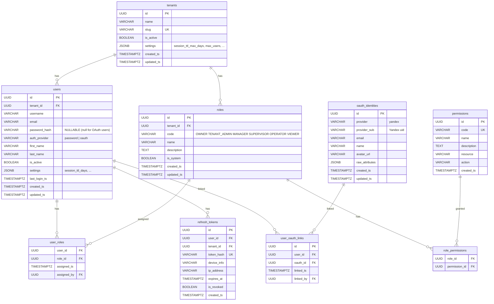
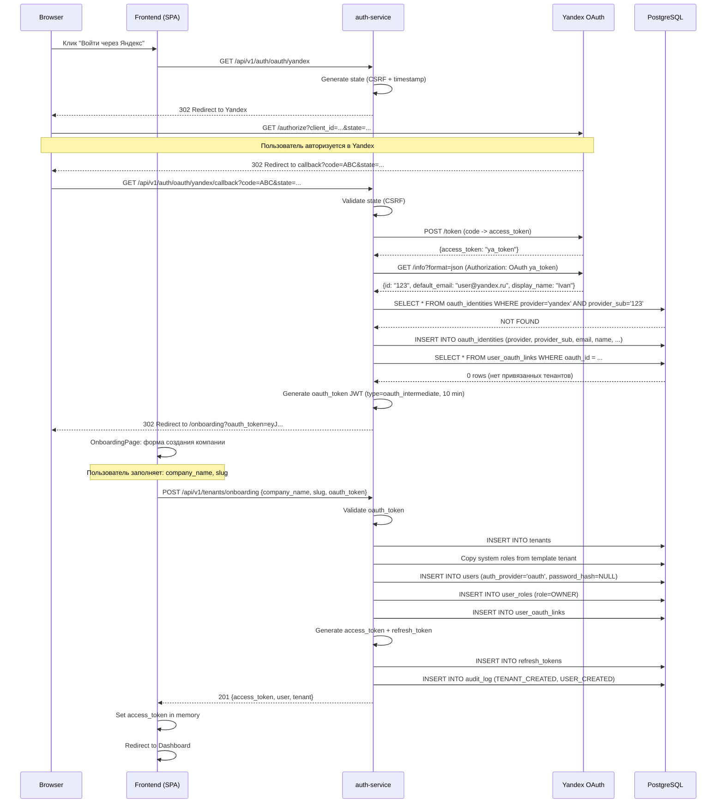
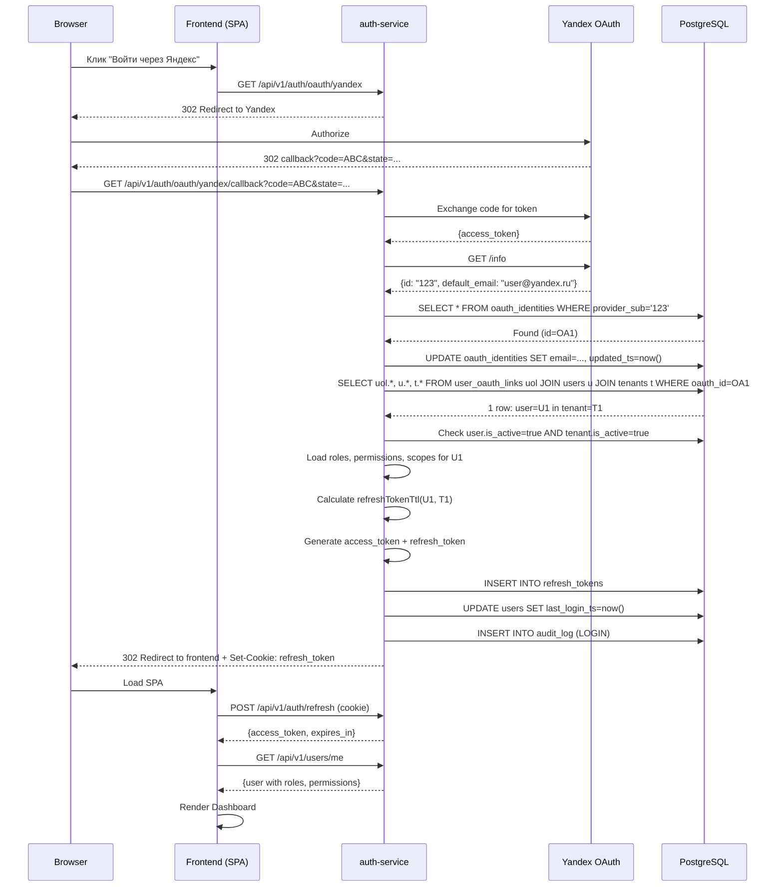
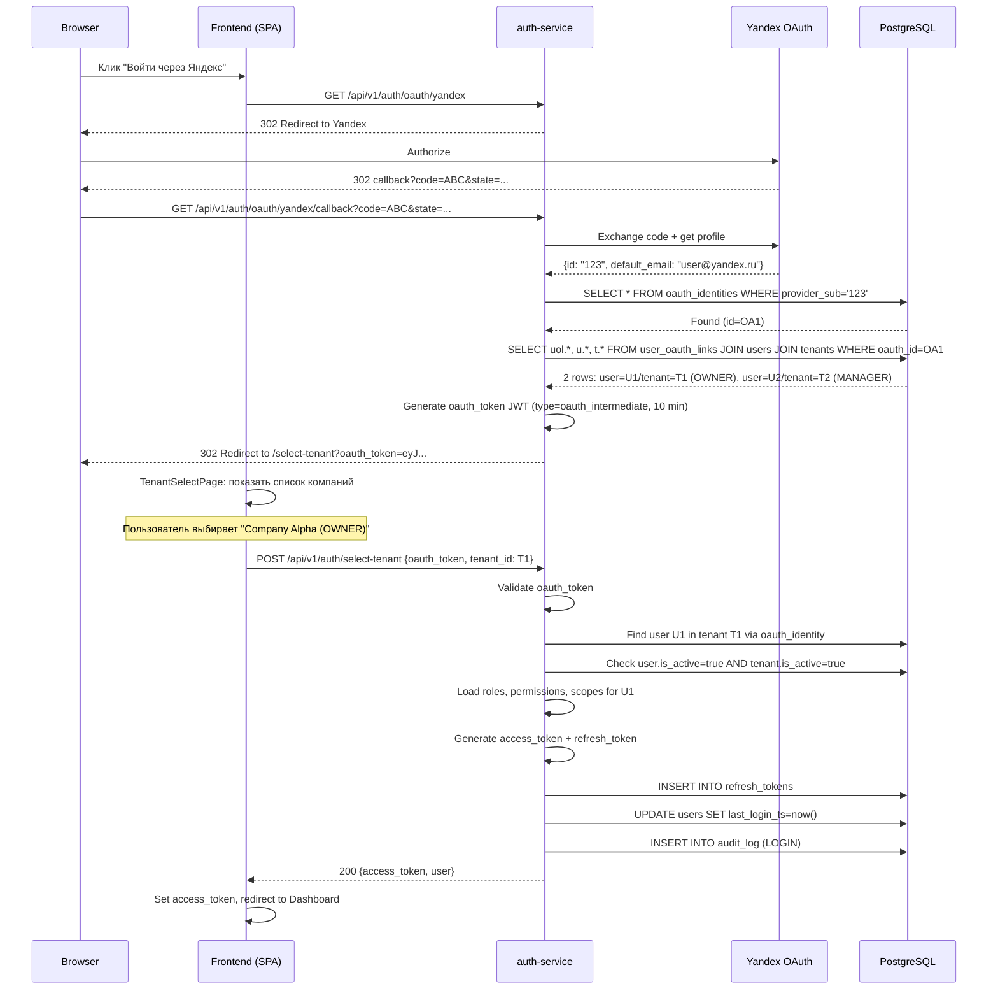
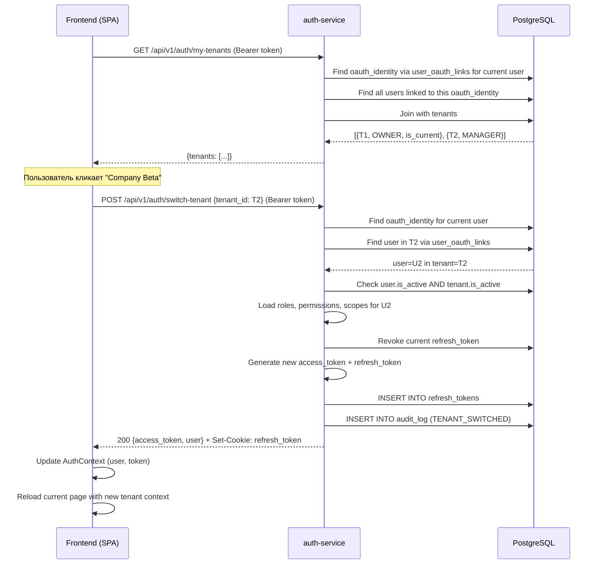
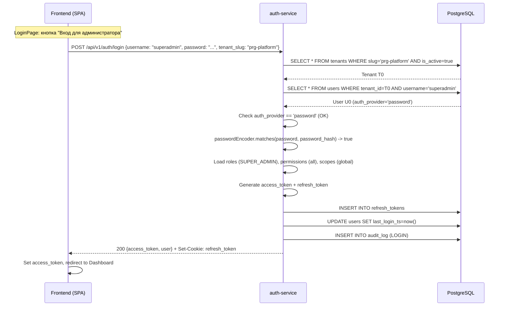
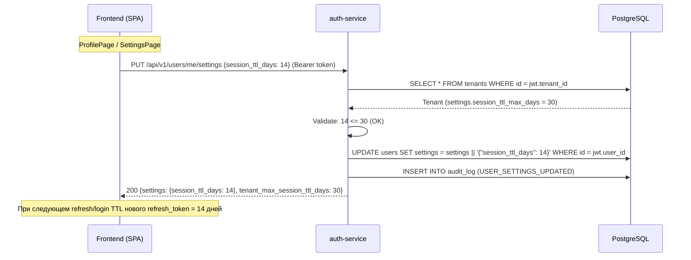
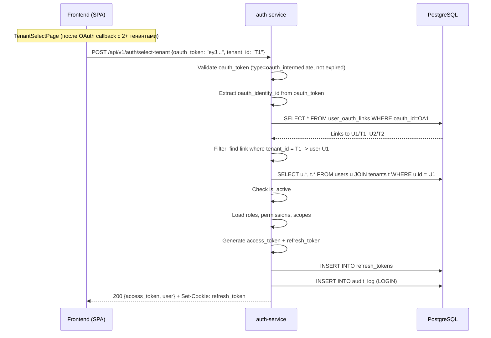

# OAuth-авторизация и перестройка ролевой модели PRG Screen Recorder

**Статус:** DRAFT
**Дата:** 2026-03-03
**Автор:** System Analyst (Claude)

---

## Оглавление

1. [Обзор изменений](#1-обзор-изменений)
2. [Flyway-миграции (SQL)](#2-flyway-миграции-sql)
3. [Обновленная модель данных (ER-диаграмма)](#3-обновленная-модель-данных-er-диаграмма)
4. [Ролевая модель](#4-ролевая-модель)
5. [API-контракты](#5-api-контракты)
6. [Sequence-диаграммы](#6-sequence-диаграммы)
7. [Frontend-изменения](#7-frontend-изменения)
8. [Конфигурация](#8-конфигурация)
9. [Затронутые сервисы](#9-затронутые-сервисы)
10. [Миграция данных и обратная совместимость](#10-миграция-данных-и-обратная-совместимость)
11. [Тест-план](#11-тест-план)

---

## 1. Обзор изменений

### 1.1. Принятые архитектурные решения

| # | Решение | Описание |
|---|---------|----------|
| 1 | OAuth-only логин | Обычные пользователи логинятся ТОЛЬКО через Yandex OAuth. Password-логин остается ТОЛЬКО для `superadmin` |
| 2 | Мультитенантная OAuth-идентичность | Один Yandex-аккаунт может быть привязан к нескольким тенантам. Для каждого тенанта создается отдельная запись `users`, связанная через `oauth_identities` |
| 3 | Двухуровневый TTL сессий | Тенант задает максимальный TTL (`tenants.settings.session_ttl_max_days`), пользователь выбирает свой TTL в пределах максимума (`users.settings.session_ttl_days`). Дефолт: 30 дней. Влияет на `refresh_token.expires_at` |
| 4 | Роль OWNER | Новая роль `OWNER` --- все права `TENANT_ADMIN` + управление тенантом (настройки, transfer ownership, удаление). Один OWNER на тенант |

### 1.2. Что меняется

- **Новые таблицы:** `oauth_identities`, `user_oauth_links`
- **Изменяемые таблицы:** `users` (password_hash nullable, auth_provider, settings), `tenants` (settings defaults)
- **Новая роль:** `OWNER` (is_system=true, добавляется в template tenant и все существующие тенанты)
- **Новые permissions:** `TENANTS:DELETE`, `TENANTS:TRANSFER_OWNERSHIP`
- **Новые endpoints:** 6 endpoints OAuth + tenant selection + settings
- **Изменяемые endpoints:** login, user create/update
- **Новые frontend-страницы:** LoginPage (полная переделка), TenantSelectPage, OnboardingPage, SettingsPage

---

## 2. Flyway-миграции (SQL)

### 2.1. V20__create_oauth_identities.sql

```sql
-- V20: OAuth identity management tables
-- oauth_identities: хранит связь Yandex-аккаунта с одним или несколькими user-записями
-- user_oauth_links: M:N связь между users и oauth_identities (один OAuth => много тенантов)

CREATE TABLE oauth_identities (
    id              UUID        PRIMARY KEY DEFAULT gen_random_uuid(),
    provider        VARCHAR(50) NOT NULL DEFAULT 'yandex',
    provider_sub    VARCHAR(255) NOT NULL,
    email           VARCHAR(255) NOT NULL,
    name            VARCHAR(255),
    avatar_url      VARCHAR(1024),
    raw_attributes  JSONB       NOT NULL DEFAULT '{}',
    created_ts      TIMESTAMPTZ NOT NULL DEFAULT now(),
    updated_ts      TIMESTAMPTZ NOT NULL DEFAULT now(),

    CONSTRAINT uq_oauth_provider_sub UNIQUE (provider, provider_sub)
);

CREATE INDEX idx_oauth_identities_email ON oauth_identities (email);
CREATE INDEX idx_oauth_identities_provider_sub ON oauth_identities (provider, provider_sub);

COMMENT ON TABLE oauth_identities IS 'Внешние OAuth-идентичности. Один Yandex-аккаунт = одна запись, даже если привязан к нескольким тенантам';
COMMENT ON COLUMN oauth_identities.provider IS 'OAuth-провайдер: yandex';
COMMENT ON COLUMN oauth_identities.provider_sub IS 'Уникальный ID пользователя у провайдера (Yandex uid)';
COMMENT ON COLUMN oauth_identities.raw_attributes IS 'Полный JSON ответа userinfo от провайдера';

-- Связующая таблица: какая OAuth-идентичность привязана к какому user-аккаунту (в каком тенанте)
CREATE TABLE user_oauth_links (
    id              UUID        PRIMARY KEY DEFAULT gen_random_uuid(),
    user_id         UUID        NOT NULL REFERENCES users(id) ON DELETE CASCADE,
    oauth_id        UUID        NOT NULL REFERENCES oauth_identities(id) ON DELETE CASCADE,
    linked_ts       TIMESTAMPTZ NOT NULL DEFAULT now(),
    linked_by       UUID        REFERENCES users(id),

    CONSTRAINT uq_user_oauth UNIQUE (user_id, oauth_id)
);

CREATE INDEX idx_user_oauth_links_oauth_id ON user_oauth_links (oauth_id);
CREATE INDEX idx_user_oauth_links_user_id ON user_oauth_links (user_id);

COMMENT ON TABLE user_oauth_links IS 'Связь user <-> oauth_identity. Один OAuth может быть привязан к нескольким users (в разных тенантах)';
```

### 2.2. V21__add_owner_role_and_permissions.sql

```sql
-- V21: Add OWNER role and new tenant management permissions

-- 1. Добавляем новые permissions
INSERT INTO permissions (id, code, name, description, resource, action, created_ts) VALUES
    (gen_random_uuid(), 'TENANTS:DELETE', 'Delete tenants',
     'Permanently delete a tenant and all its data', 'TENANTS', 'DELETE', NOW()),
    (gen_random_uuid(), 'TENANTS:TRANSFER_OWNERSHIP', 'Transfer tenant ownership',
     'Transfer OWNER role to another user', 'TENANTS', 'TRANSFER_OWNERSHIP', NOW())
ON CONFLICT (code) DO NOTHING;

-- 2. Создаем роль OWNER в template tenant
DO $$
DECLARE
    v_template_tenant UUID := '00000000-0000-0000-0000-000000000000';
    v_role_id UUID;
BEGIN
    -- OWNER: ВСЕ permissions кроме TENANTS:CREATE (создание новых тенантов -- только SUPER_ADMIN)
    INSERT INTO roles (id, tenant_id, code, name, description, is_system)
    VALUES (gen_random_uuid(), v_template_tenant, 'OWNER', 'Tenant Owner',
            'Full access within own tenant including tenant settings and ownership transfer. One per tenant.', TRUE)
    RETURNING id INTO v_role_id;

    INSERT INTO role_permissions (role_id, permission_id)
    SELECT v_role_id, id FROM permissions
    WHERE code NOT IN ('TENANTS:CREATE')
    ON CONFLICT DO NOTHING;

    -- Добавляем новые permissions в SUPER_ADMIN (template)
    INSERT INTO role_permissions (role_id, permission_id)
    SELECT r.id, p.id
    FROM roles r, permissions p
    WHERE r.tenant_id = v_template_tenant
      AND r.code = 'SUPER_ADMIN'
      AND p.code IN ('TENANTS:DELETE', 'TENANTS:TRANSFER_OWNERSHIP')
    ON CONFLICT DO NOTHING;
END $$;

-- 3. Создаем OWNER роль во всех существующих рабочих тенантах (не template)
DO $$
DECLARE
    v_template_tenant UUID := '00000000-0000-0000-0000-000000000000';
    v_tenant RECORD;
    v_new_role_id UUID;
    v_template_owner_role_id UUID;
BEGIN
    -- Находим template OWNER
    SELECT id INTO v_template_owner_role_id
    FROM roles WHERE tenant_id = v_template_tenant AND code = 'OWNER';

    IF v_template_owner_role_id IS NULL THEN
        RAISE EXCEPTION 'Template OWNER role not found';
    END IF;

    FOR v_tenant IN
        SELECT id FROM tenants
        WHERE id != v_template_tenant AND is_active = TRUE
    LOOP
        -- Создаем OWNER роль в тенанте (если еще нет)
        INSERT INTO roles (id, tenant_id, code, name, description, is_system)
        SELECT gen_random_uuid(), v_tenant.id, 'OWNER', 'Tenant Owner',
               'Full access within own tenant including tenant settings and ownership transfer. One per tenant.', TRUE
        WHERE NOT EXISTS (
            SELECT 1 FROM roles WHERE tenant_id = v_tenant.id AND code = 'OWNER'
        )
        RETURNING id INTO v_new_role_id;

        -- Копируем permissions
        IF v_new_role_id IS NOT NULL THEN
            INSERT INTO role_permissions (role_id, permission_id)
            SELECT v_new_role_id, rp.permission_id
            FROM role_permissions rp
            WHERE rp.role_id = v_template_owner_role_id
            ON CONFLICT DO NOTHING;
        END IF;

        -- Добавляем новые permissions в SUPER_ADMIN и TENANT_ADMIN ролей тенанта
        INSERT INTO role_permissions (role_id, permission_id)
        SELECT r.id, p.id
        FROM roles r, permissions p
        WHERE r.tenant_id = v_tenant.id
          AND r.code = 'SUPER_ADMIN'
          AND p.code IN ('TENANTS:DELETE', 'TENANTS:TRANSFER_OWNERSHIP')
        ON CONFLICT DO NOTHING;
    END LOOP;
END $$;
```

### 2.3. V22__session_ttl_settings.sql

```sql
-- V22: Add session TTL settings defaults to tenants

-- Устанавливаем дефолтные настройки session_ttl_max_days для всех тенантов
UPDATE tenants
SET settings = settings || '{"session_ttl_max_days": 30}'::jsonb
WHERE NOT (settings ? 'session_ttl_max_days');

COMMENT ON COLUMN tenants.settings IS 'Настройки тенанта: max_users, max_retention_days, features{}, session_ttl_max_days (default 30)';
```

### 2.4. V23__users_oauth_support.sql

```sql
-- V23: Make password_hash nullable, add auth_provider and settings columns to users

-- 1. Делаем password_hash nullable (OAuth-пользователи не имеют пароля)
ALTER TABLE users ALTER COLUMN password_hash DROP NOT NULL;

-- 2. Добавляем auth_provider (password | oauth)
ALTER TABLE users ADD COLUMN auth_provider VARCHAR(20) NOT NULL DEFAULT 'password';

-- 3. Добавляем settings JSONB (для пользовательских настроек, включая session_ttl_days)
ALTER TABLE users ADD COLUMN settings JSONB NOT NULL DEFAULT '{}';

-- 4. Устанавливаем auth_provider = 'password' для всех существующих пользователей
-- (уже сделано через DEFAULT, но для ясности)
UPDATE users SET auth_provider = 'password' WHERE auth_provider IS NULL;

-- 5. Создаем индекс для поиска по auth_provider
CREATE INDEX idx_users_auth_provider ON users (auth_provider);

-- 6. Partial unique constraint: email уникален в рамках тенанта (уже есть uq_users_tenant_email)
-- Для OAuth-пользователей username генерируется из email, поэтому существующий constraint достаточен.

COMMENT ON COLUMN users.auth_provider IS 'Способ аутентификации: password (legacy/superadmin) или oauth';
COMMENT ON COLUMN users.settings IS 'Пользовательские настройки: session_ttl_days и пр.';
```

---

## 3. Обновленная модель данных (ER-диаграмма)



### Ключевые связи

- `oauth_identities` 1:N `user_oauth_links`: один Yandex-аккаунт может быть в нескольких тенантах
- `users` 1:N `user_oauth_links`: один user связан с одним OAuth (в рамках тенанта)
- `users.password_hash`: NULL для OAuth-пользователей, NOT NULL для `auth_provider = 'password'`
- `users.auth_provider`: `password` (superadmin, legacy) или `oauth` (Yandex)

---

## 4. Ролевая модель

### 4.1. Полная таблица ролей

| Роль | Scope | Описание | Ограничения |
|------|-------|----------|-------------|
| `SUPER_ADMIN` | global | Полный доступ ко всей системе. Кросс-тенантное управление | Только password-логин. Только тенант `default`/`prg-platform` |
| `OWNER` | tenant | Владелец компании. Все права внутри тенанта + управление настройками тенанта и transfer ownership | Ровно один на тенант. Создается при onboarding |
| `TENANT_ADMIN` | tenant | Администратор тенанта. Управление пользователями, ролями, устройствами, политиками | Не может менять настройки тенанта и передавать ownership |
| `MANAGER` | tenant | Управление устройствами, политиками, записями. Чтение пользователей/ролей | --- |
| `SUPERVISOR` | tenant | Наблюдение за операторами. Просмотр записей, команды устройствам | --- |
| `OPERATOR` | own | Оператор контактного центра. Просмотр только своих записей | Scope `own` --- доступ только к собственным ресурсам |
| `VIEWER` | tenant | Только просмотр записей и дашборда | --- |

### 4.2. Матрица permissions по ролям

| Permission | SUPER_ADMIN | OWNER | TENANT_ADMIN | MANAGER | SUPERVISOR | OPERATOR | VIEWER |
|------------|:-----------:|:-----:|:------------:|:-------:|:----------:|:--------:|:------:|
| **USERS** | | | | | | | |
| USERS:CREATE | V | V | V | - | - | - | - |
| USERS:READ | V | V | V | V | - | - | - |
| USERS:UPDATE | V | V | V | - | - | - | - |
| USERS:DELETE | V | V | V | - | - | - | - |
| **ROLES** | | | | | | | |
| ROLES:CREATE | V | V | V | - | - | - | - |
| ROLES:READ | V | V | V | V | - | - | - |
| ROLES:UPDATE | V | V | V | - | - | - | - |
| ROLES:DELETE | V | V | V | - | - | - | - |
| **DEVICES** | | | | | | | |
| DEVICES:CREATE | V | V | V | V | - | - | - |
| DEVICES:READ | V | V | V | V | V | V | - |
| DEVICES:UPDATE | V | V | V | V | - | - | - |
| DEVICES:DELETE | V | V | V | V | - | - | - |
| DEVICES:COMMAND | V | V | V | V | V | - | - |
| **RECORDINGS** | | | | | | | |
| RECORDINGS:READ | V | V | V | V | V | V | V |
| RECORDINGS:PLAY | V | V | V | V | V | V | V |
| RECORDINGS:DELETE | V | V | V | V | - | - | - |
| RECORDINGS:EXPORT | V | V | V | V | V | - | - |
| RECORDINGS:MANAGE | V | V | V | V | V | - | - |
| **POLICIES** | | | | | | | |
| POLICIES:CREATE | V | V | V | V | - | - | - |
| POLICIES:READ | V | V | V | V | V | - | - |
| POLICIES:UPDATE | V | V | V | V | - | - | - |
| POLICIES:DELETE | V | V | V | V | - | - | - |
| POLICIES:PUBLISH | V | V | V | V | - | - | - |
| **AUDIT** | | | | | | | |
| AUDIT:READ | V | V | V | V | V | - | - |
| **TENANTS** | | | | | | | |
| TENANTS:CREATE | V | - | - | - | - | - | - |
| TENANTS:READ | V | V | V | - | - | - | - |
| TENANTS:UPDATE | V | V | - | - | - | - | - |
| TENANTS:DELETE | V | V | - | - | - | - | - |
| TENANTS:TRANSFER_OWNERSHIP | V | V | - | - | - | - | - |
| **DEVICE_TOKENS** | | | | | | | |
| DEVICE_TOKENS:CREATE | V | V | V | V | - | - | - |
| DEVICE_TOKENS:READ | V | V | V | V | V | - | - |
| DEVICE_TOKENS:DELETE | V | V | V | V | - | - | - |
| **DASHBOARD** | | | | | | | |
| DASHBOARD:VIEW | V | V | V | V | V | V | V |

### 4.3. Scope-модель

| Scope | Описание | Кто получает |
|-------|----------|--------------|
| `global` | Доступ ко всем тенантам, все ресурсы | SUPER_ADMIN |
| `tenant` | Доступ ко всем ресурсам внутри своего тенанта | OWNER, TENANT_ADMIN, MANAGER, SUPERVISOR, VIEWER |
| `own` | Доступ только к собственным ресурсам | OPERATOR |

Обновленная логика `determineScopesForRoles`:

```java
private List<String> determineScopesForRoles(List<String> roles) {
    if (roles.contains("SUPER_ADMIN")) return List.of("global");
    if (roles.contains("OPERATOR")) return List.of("own");
    return List.of("tenant");
}
```

Порядок приоритета ролей (при наличии нескольких): `SUPER_ADMIN` > `OWNER` > `TENANT_ADMIN` > `MANAGER` > `SUPERVISOR` > `OPERATOR` > `VIEWER`. Scope определяется по наивысшей роли.

---

## 5. API-контракты

### 5.1. Новые endpoints

#### 5.1.1. GET /api/v1/auth/oauth/yandex

**Описание:** Инициирует OAuth-поток. Перенаправляет браузер на страницу авторизации Yandex.

**Авторизация:** permitAll

**Query Parameters:**

| Параметр | Тип | Обязательный | Описание |
|----------|-----|:---:|----------|
| `redirect_uri` | string | Нет | URL для редиректа после авторизации. По умолчанию: `{frontend_base_url}/oauth/callback` |

**Response:** HTTP 302 Redirect

```
Location: https://oauth.yandex.ru/authorize?response_type=code&client_id={YANDEX_CLIENT_ID}&redirect_uri={callback_url}&state={csrf_state}
```

**State-параметр:** Генерируется сервером, сохраняется в HttpSession (или signed cookie). Содержит:
- CSRF-token (random UUID)
- redirect_uri (если передан)
- timestamp

**Коды ошибок:**

| HTTP | Code | Когда |
|------|------|-------|
| 500 | `OAUTH_CONFIG_ERROR` | Yandex OAuth client_id не настроен |

---

#### 5.1.2. GET /api/v1/auth/oauth/yandex/callback

**Описание:** Обрабатывает callback от Yandex OAuth. Обменивает authorization code на access token, получает профиль пользователя, находит/создает oauth_identity, определяет тенанты.

**Авторизация:** permitAll

**Query Parameters (от Yandex):**

| Параметр | Тип | Обязательный | Описание |
|----------|-----|:---:|----------|
| `code` | string | Да | Authorization code от Yandex |
| `state` | string | Да | CSRF state |

**Логика:**

1. Валидировать `state` (CSRF protection)
2. Обменять `code` на Yandex access_token через POST `https://oauth.yandex.ru/token`
3. Получить профиль через GET `https://login.yandex.ru/info?format=json` с Yandex access_token
4. Найти `oauth_identities` по `(provider='yandex', provider_sub=yandex_uid)`
5. Если не найден --- создать `oauth_identities` запись
6. Обновить `email`, `name`, `avatar_url`, `raw_attributes` в `oauth_identities`
7. Найти все `user_oauth_links` для этой `oauth_identity` -> получить список `users` -> получить список `tenants`
8. Зависит от количества привязанных тенантов:
   - **0 тенантов:** Вернуть `oauth_token` (временный JWT, 10 мин) + `needs_onboarding: true`
   - **1 тенант:** Автоматически войти, вернуть access_token + refresh_token cookie + user
   - **2+ тенантов:** Вернуть `oauth_token` (временный JWT, 10 мин) + `tenants[]` для выбора

**Response (0 тенантов --- нужен onboarding):**

HTTP 302 Redirect на `{frontend_base_url}/onboarding?oauth_token={token}`

Или, если `Accept: application/json`:

```json
HTTP 200
{
  "status": "needs_onboarding",
  "oauth_token": "eyJ...",
  "oauth_token_expires_in": 600,
  "oauth_user": {
    "email": "user@yandex.ru",
    "name": "Ivan Petrov",
    "avatar_url": "https://avatars.yandex.net/..."
  }
}
```

**Response (1 тенант --- автовход):**

HTTP 302 Redirect на `{frontend_base_url}/` с refresh_token cookie.

Или, если `Accept: application/json`:

```json
HTTP 200
{
  "status": "authenticated",
  "access_token": "eyJ...",
  "token_type": "Bearer",
  "expires_in": 900,
  "user": {
    "id": "550e8400-e29b-41d4-a716-446655440001",
    "tenant_id": "550e8400-e29b-41d4-a716-446655440002",
    "username": "user@yandex.ru",
    "email": "user@yandex.ru",
    "first_name": "Ivan",
    "last_name": "Petrov",
    "is_active": true,
    "auth_provider": "oauth",
    "roles": [{"code": "MANAGER", "name": "Manager"}],
    "permissions": ["DEVICES:READ", "RECORDINGS:READ", "..."]
  }
}
```

**Response (2+ тенантов --- выбор):**

HTTP 302 Redirect на `{frontend_base_url}/select-tenant?oauth_token={token}`

Или, если `Accept: application/json`:

```json
HTTP 200
{
  "status": "tenant_selection_required",
  "oauth_token": "eyJ...",
  "oauth_token_expires_in": 600,
  "tenants": [
    {
      "id": "550e8400-e29b-41d4-a716-446655440002",
      "name": "Company Alpha",
      "slug": "company-alpha",
      "role": "OWNER"
    },
    {
      "id": "550e8400-e29b-41d4-a716-446655440003",
      "name": "Company Beta",
      "slug": "company-beta",
      "role": "MANAGER"
    }
  ]
}
```

**`oauth_token` JWT claims:**

```json
{
  "sub": "<oauth_identity_id>",
  "type": "oauth_intermediate",
  "email": "user@yandex.ru",
  "name": "Ivan Petrov",
  "provider": "yandex",
  "provider_sub": "123456789",
  "iat": 1709510400,
  "exp": 1709511000
}
```

**Коды ошибок:**

| HTTP | Code | Когда |
|------|------|-------|
| 400 | `OAUTH_INVALID_STATE` | Невалидный или истекший state |
| 400 | `OAUTH_CODE_EXCHANGE_FAILED` | Yandex отверг authorization code |
| 403 | `OAUTH_USER_DISABLED` | Все user-записи для данного OAuth деактивированы |
| 500 | `OAUTH_PROVIDER_ERROR` | Ошибка связи с Yandex API |

---

#### 5.1.3. GET /api/v1/auth/my-tenants

**Описание:** Возвращает список тенантов, к которым привязан текущий OAuth-пользователь. Используется для tenant switching.

**Авторизация:** authenticated (JWT)

**Response:**

```json
HTTP 200
{
  "tenants": [
    {
      "id": "550e8400-e29b-41d4-a716-446655440002",
      "name": "Company Alpha",
      "slug": "company-alpha",
      "role": "OWNER",
      "is_current": true
    },
    {
      "id": "550e8400-e29b-41d4-a716-446655440003",
      "name": "Company Beta",
      "slug": "company-beta",
      "role": "MANAGER",
      "is_current": false
    }
  ]
}
```

**Логика:**
1. Из JWT получить `user_id` + `tenant_id`
2. Найти `user_oauth_links` для `user_id` -> получить `oauth_identity_id`
3. Найти все `user_oauth_links` для этой `oauth_identity` -> получить все `users` -> получить тенанты
4. Отметить текущий тенант (`is_current`)

**Для password-пользователей (superadmin):** Вернуть только текущий тенант.

**Коды ошибок:**

| HTTP | Code | Когда |
|------|------|-------|
| 401 | `UNAUTHORIZED` | Невалидный/отсутствующий JWT |

---

#### 5.1.4. POST /api/v1/auth/switch-tenant

**Описание:** Переключение на другой тенант. Создает новый access_token + refresh_token для указанного тенанта.

**Авторизация:** authenticated (JWT)

**Request:**

```json
{
  "tenant_id": "550e8400-e29b-41d4-a716-446655440003"
}
```

**Логика:**
1. Из JWT получить `user_id` текущего пользователя
2. Найти `oauth_identity` привязанную к текущему `user_id`
3. Проверить, что в `user_oauth_links` есть запись для этой `oauth_identity` + user в целевом `tenant_id`
4. Получить user-запись в целевом тенанте
5. Проверить, что user и тенант активны
6. Revoke текущий refresh_token
7. Сгенерировать новые access_token + refresh_token для user в целевом тенанте
8. Audit: `TENANT_SWITCHED`

**Response:**

```json
HTTP 200
{
  "access_token": "eyJ...",
  "token_type": "Bearer",
  "expires_in": 900,
  "user": {
    "id": "550e8400-e29b-41d4-a716-446655440010",
    "tenant_id": "550e8400-e29b-41d4-a716-446655440003",
    "username": "user@yandex.ru",
    "email": "user@yandex.ru",
    "first_name": "Ivan",
    "last_name": "Petrov",
    "is_active": true,
    "auth_provider": "oauth",
    "roles": [{"code": "MANAGER", "name": "Manager"}],
    "permissions": ["DEVICES:READ", "RECORDINGS:READ", "..."]
  }
}
```

Set-Cookie: refresh_token (HttpOnly, Secure, SameSite=Strict)

**Коды ошибок:**

| HTTP | Code | Когда |
|------|------|-------|
| 400 | `INVALID_TENANT` | tenant_id не указан |
| 403 | `TENANT_ACCESS_DENIED` | Пользователь не привязан к этому тенанту |
| 403 | `ACCOUNT_DISABLED` | User или тенант деактивированы |
| 403 | `PASSWORD_USER_CANNOT_SWITCH` | Password-пользователь не может переключать тенанты |
| 404 | `TENANT_NOT_FOUND` | Тенант не найден |

---

#### 5.1.5. POST /api/v1/tenants/onboarding

**Описание:** Создание первой компании для нового OAuth-пользователя. Доступен только пользователям с `oauth_token` (промежуточный JWT, полученный после OAuth callback, когда у пользователя 0 тенантов).

**Авторизация:** oauth_token (промежуточный JWT с `type: oauth_intermediate`)

**Request:**

```json
{
  "company_name": "ООО Рога и Копыта",
  "slug": "roga-i-kopyta",
  "first_name": "Иван",
  "last_name": "Петров"
}
```

**Валидация:**

| Поле | Тип | Обязательный | Constraints |
|------|-----|:---:|-------------|
| `company_name` | string | Да | min 2, max 255 |
| `slug` | string | Да | min 3, max 100, pattern `^[a-z][a-z0-9-]*$` |
| `first_name` | string | Нет | max 255 |
| `last_name` | string | Нет | max 255 |

**Логика:**
1. Валидировать `oauth_token` (проверить `type: oauth_intermediate`, не истек)
2. Из `oauth_token` получить `oauth_identity_id`, `email`, `name`
3. Проверить уникальность `slug`
4. Создать `tenant` со стандартными `settings` (включая `session_ttl_max_days: 30`)
5. Скопировать системные роли из template tenant
6. Создать `user` в новом тенанте (`auth_provider: oauth`, `password_hash: NULL`, `username: email`)
7. Назначить роль `OWNER`
8. Создать `user_oauth_links` запись
9. Сгенерировать access_token + refresh_token
10. Audit: `TENANT_CREATED`, `USER_CREATED`

**Response:**

```json
HTTP 201
{
  "access_token": "eyJ...",
  "token_type": "Bearer",
  "expires_in": 900,
  "tenant": {
    "id": "550e8400-e29b-41d4-a716-446655440099",
    "name": "ООО Рога и Копыта",
    "slug": "roga-i-kopyta"
  },
  "user": {
    "id": "550e8400-e29b-41d4-a716-446655440100",
    "tenant_id": "550e8400-e29b-41d4-a716-446655440099",
    "username": "user@yandex.ru",
    "email": "user@yandex.ru",
    "first_name": "Иван",
    "last_name": "Петров",
    "is_active": true,
    "auth_provider": "oauth",
    "roles": [{"code": "OWNER", "name": "Tenant Owner"}],
    "permissions": ["USERS:CREATE", "USERS:READ", "..."]
  }
}
```

Set-Cookie: refresh_token (HttpOnly, Secure, SameSite=Strict)

**Коды ошибок:**

| HTTP | Code | Когда |
|------|------|-------|
| 400 | `VALIDATION_ERROR` | Невалидные поля |
| 401 | `INVALID_OAUTH_TOKEN` | Невалидный/истекший oauth_token |
| 409 | `SLUG_ALREADY_EXISTS` | Slug уже занят |
| 409 | `OAUTH_ALREADY_LINKED` | Этот OAuth-аккаунт уже привязан к тенанту |

---

#### 5.1.6. PUT /api/v1/users/me/settings

**Описание:** Обновление пользовательских настроек (session TTL и пр.).

**Авторизация:** authenticated (JWT)

**Request:**

```json
{
  "session_ttl_days": 14
}
```

**Валидация:**

| Поле | Тип | Обязательный | Constraints |
|------|-----|:---:|-------------|
| `session_ttl_days` | integer | Нет | min 1, max `tenants.settings.session_ttl_max_days` (default 30) |

**Логика:**
1. Из JWT получить `user_id`, `tenant_id`
2. Загрузить тенант, проверить `session_ttl_max_days`
3. Валидировать: `session_ttl_days <= tenant.settings.session_ttl_max_days`
4. Обновить `users.settings`
5. Audit: `USER_SETTINGS_UPDATED`

**Response:**

```json
HTTP 200
{
  "settings": {
    "session_ttl_days": 14
  },
  "tenant_max_session_ttl_days": 30
}
```

**Коды ошибок:**

| HTTP | Code | Когда |
|------|------|-------|
| 400 | `TTL_EXCEEDS_TENANT_MAX` | `session_ttl_days` > `tenant.session_ttl_max_days` |
| 400 | `VALIDATION_ERROR` | Невалидное значение |
| 401 | `UNAUTHORIZED` | Невалидный JWT |

---

#### 5.1.7. POST /api/v1/tenants/{id}/transfer-ownership

**Описание:** Передача роли OWNER другому пользователю тенанта.

**Авторизация:** authenticated + permission `TENANTS:TRANSFER_OWNERSHIP`

**Request:**

```json
{
  "new_owner_user_id": "550e8400-e29b-41d4-a716-446655440050"
}
```

**Логика:**
1. Проверить, что текущий пользователь --- OWNER данного тенанта (или SUPER_ADMIN)
2. Проверить, что `new_owner_user_id` существует в этом тенанте и активен
3. Снять роль `OWNER` с текущего пользователя
4. Назначить текущему пользователю роль `TENANT_ADMIN`
5. Снять текущую роль с нового владельца (если есть)
6. Назначить роль `OWNER` новому владельцу
7. Audit: `OWNERSHIP_TRANSFERRED`

**Response:**

```json
HTTP 200
{
  "message": "Ownership transferred successfully",
  "previous_owner_id": "550e8400-e29b-41d4-a716-446655440001",
  "new_owner_id": "550e8400-e29b-41d4-a716-446655440050"
}
```

**Коды ошибок:**

| HTTP | Code | Когда |
|------|------|-------|
| 400 | `CANNOT_TRANSFER_TO_SELF` | Передача самому себе |
| 403 | `NOT_OWNER` | Текущий пользователь не OWNER и не SUPER_ADMIN |
| 404 | `USER_NOT_FOUND` | Целевой пользователь не найден в тенанте |
| 404 | `TENANT_NOT_FOUND` | Тенант не найден |

---

### 5.2. Изменяемые endpoints

#### 5.2.1. POST /api/v1/auth/login (ИЗМЕНЕН)

**Было:** Обязательные поля: `username`, `password`, `tenant_slug`.

**Стало:** Только для superadmin. `tenant_slug` становится опциональным (по умолчанию `prg-platform`).

**Request:**

```json
{
  "username": "superadmin",
  "password": "Admin@12345",
  "tenant_slug": "prg-platform"
}
```

Если `tenant_slug` не указан, используется `prg-platform`.

**Дополнительная валидация:**
- Если `user.auth_provider == 'oauth'` --- вернуть ошибку `OAUTH_USER_PASSWORD_LOGIN_DENIED` с сообщением "Пожалуйста, используйте вход через Яндекс"
- Если `user.auth_provider == 'password'` --- стандартная password-проверка

**Новые коды ошибок:**

| HTTP | Code | Когда |
|------|------|-------|
| 403 | `OAUTH_USER_PASSWORD_LOGIN_DENIED` | OAuth-пользователь пытается войти по паролю |

**Изменения в `LoginRequest.java`:**
- `tenantSlug`: убрать `@NotBlank`, сделать опциональным с default `prg-platform`

---

#### 5.2.2. POST /api/v1/users (ИЗМЕНЕН)

**Изменение:** Добавление OAuth-пользователя в тенант (приглашение по email).

**Request (приглашение OAuth-пользователя):**

```json
{
  "email": "newuser@yandex.ru",
  "first_name": "Анна",
  "last_name": "Сидорова",
  "role_ids": ["550e8400-e29b-41d4-a716-446655440020"],
  "auth_provider": "oauth"
}
```

**Request (создание password-пользователя, только для SUPER_ADMIN):**

```json
{
  "username": "operator1",
  "email": "operator1@company.com",
  "password": "SecurePass123",
  "first_name": "Петр",
  "last_name": "Иванов",
  "role_ids": ["550e8400-e29b-41d4-a716-446655440025"],
  "auth_provider": "password"
}
```

**Логика для `auth_provider: oauth`:**
1. `password` не требуется, `password_hash` = NULL
2. `username` генерируется из `email` (email до @, или полный email, если коллизия)
3. Создать запись `users` с `auth_provider = 'oauth'`
4. Если существует `oauth_identities` с таким email --- создать `user_oauth_links`
5. Если не существует --- `user_oauth_links` будет создан при первом OAuth-входе этого пользователя

**Валидация:**
- `auth_provider` допускает `password` или `oauth`. По умолчанию `oauth`
- Для `auth_provider: password` --- `password` обязателен, создавать может только SUPER_ADMIN
- Для `auth_provider: oauth` --- `password` не принимается
- Нельзя создать пользователя с ролью `OWNER` (назначается только при onboarding или transfer)
- Нельзя создать пользователя с ролью `SUPER_ADMIN` (только миграция)

**Изменения в `CreateUserRequest.java`:**

```java
@Data
public class CreateUserRequest {
    private String username;           // опционально для OAuth
    @NotBlank @Email
    private String email;
    private String password;           // обязательно только для auth_provider=password
    private String firstName;
    private String lastName;
    private List<UUID> roleIds;
    private String authProvider = "oauth"; // "password" | "oauth"
}
```

---

#### 5.2.3. GET /api/v1/users/me (ИЗМЕНЕН)

**Изменение:** Добавлено поле `auth_provider` и `settings` в ответ.

**Response:**

```json
HTTP 200
{
  "id": "550e8400-e29b-41d4-a716-446655440001",
  "tenant_id": "550e8400-e29b-41d4-a716-446655440002",
  "username": "user@yandex.ru",
  "email": "user@yandex.ru",
  "first_name": "Ivan",
  "last_name": "Petrov",
  "is_active": true,
  "auth_provider": "oauth",
  "avatar_url": "https://avatars.yandex.net/...",
  "settings": {
    "session_ttl_days": 14
  },
  "roles": [
    {"id": "...", "code": "OWNER", "name": "Tenant Owner"}
  ],
  "permissions": ["USERS:CREATE", "USERS:READ", "..."],
  "last_login_ts": "2026-03-03T10:00:00Z",
  "created_ts": "2026-03-01T10:00:00Z",
  "updated_ts": "2026-03-03T10:00:00Z"
}
```

**Новые поля в `UserResponse`:**

| Поле | Тип | Описание |
|------|-----|----------|
| `auth_provider` | string | `password` или `oauth` |
| `avatar_url` | string | URL аватара из Yandex (null для password-пользователей) |
| `settings` | object | Пользовательские настройки (`session_ttl_days` и пр.) |

---

### 5.3. Refresh Token TTL --- динамический

Текущая реализация использует статический `jwtConfig.getRefreshTokenTtl()` (2592000 сек = 30 дней).

**Новая логика (`AuthService.calculateRefreshTokenTtl`):**

```java
private long calculateRefreshTokenTtl(User user, Tenant tenant) {
    // 1. Tenant max
    int tenantMaxDays = 30; // default
    if (tenant.getSettings() != null && tenant.getSettings().containsKey("session_ttl_max_days")) {
        tenantMaxDays = ((Number) tenant.getSettings().get("session_ttl_max_days")).intValue();
    }

    // 2. User preference (capped by tenant max)
    int userDays = tenantMaxDays; // default = tenant max
    if (user.getSettings() != null && user.getSettings().containsKey("session_ttl_days")) {
        userDays = ((Number) user.getSettings().get("session_ttl_days")).intValue();
    }

    int effectiveDays = Math.min(userDays, tenantMaxDays);
    return (long) effectiveDays * 24 * 60 * 60; // в секундах
}
```

Этот метод вызывается в `login()`, `refresh()`, `switchTenant()`, `onboarding()`.

---

## 6. Sequence-диаграммы

### 6.1. OAuth Login --- Новый пользователь (Onboarding)



### 6.2. OAuth Login --- Существующий пользователь, 1 компания



### 6.3. OAuth Login --- Существующий пользователь, несколько компаний



### 6.4. Switch Tenant



### 6.5. Superadmin Password Login



### 6.6. Session TTL Configuration



### 6.7. POST /api/v1/auth/select-tenant (вход после OAuth callback с выбором тенанта)



**Примечание:** Endpoint `POST /api/v1/auth/select-tenant` обрабатывает ДВА сценария:
1. **Первичный выбор тенанта** (после OAuth callback): передается `oauth_token` (промежуточный JWT)
2. **Переключение тенанта** (в рамках текущей сессии): передается обычный Bearer JWT

Различие определяется по наличию `oauth_token` в body:
- Если `oauth_token` присутствует --- это первичный вход, валидируется промежуточный JWT
- Если `oauth_token` отсутствует --- это switch, валидируется Bearer JWT из Authorization header

---

## 7. Frontend-изменения

### 7.1. Новые страницы и компоненты

| Файл | Описание |
|------|----------|
| `src/pages/OAuthLoginPage.tsx` | Основная страница логина: кнопка "Войти через Яндекс" + ссылка "Вход для администратора" |
| `src/pages/AdminLoginPage.tsx` | Страница password-логина для superadmin (текущая LoginPage, упрощенная) |
| `src/pages/TenantSelectPage.tsx` | Выбор тенанта (карточки компаний, при 2+ тенантах) |
| `src/pages/OnboardingPage.tsx` | Создание первой компании (форма: company_name, slug) |
| `src/pages/OAuthCallbackPage.tsx` | Обработка callback (перехват redirect, парсинг oauth_token, маршрутизация) |
| `src/pages/SettingsPage.tsx` | Настройки: session TTL slider, tenant info (для OWNER/TENANT_ADMIN) |
| `src/components/TenantSwitcher.tsx` | Dropdown для переключения тенанта (в header MainLayout) |
| `src/components/UserAvatar.tsx` | Аватар пользователя (из Yandex или инициалы) |

### 7.2. Изменяемые файлы

| Файл | Изменение |
|------|-----------|
| `src/pages/LoginPage.tsx` | Переименовать в `AdminLoginPage.tsx`, убрать поле tenant_slug (или сделать скрытым с дефолтом) |
| `src/pages/ProfilePage.tsx` | Добавить секцию "Session Settings" (TTL slider), убрать "Change Password" для OAuth-пользователей |
| `src/contexts/AuthContext.tsx` | Добавить: `switchTenant()`, `currentTenant`, `tenants[]`, `oauthLogin()` |
| `src/components/Sidebar.tsx` | Добавить группировку меню (секции), tenant switcher |
| `src/components/ProtectedRoute.tsx` | Без изменений (работает по permissions из JWT) |
| `src/App.tsx` | Добавить новые routes |
| `src/api/auth.ts` | Добавить: `oauthLogin()`, `selectTenant()`, `switchTenant()`, `getMyTenants()`, `onboarding()` |
| `src/api/client.ts` | Без изменений |
| `src/types/auth.ts` | Добавить новые типы |
| `src/routes/index.tsx` | Обновить route map |
| `src/layouts/MainLayout.tsx` | Добавить TenantSwitcher в header |
| `src/layouts/AuthLayout.tsx` | Без изменений (обертка для public pages) |

### 7.3. Обновленная маршрутизация

```
PUBLIC (AuthLayout):
  /login                    -> OAuthLoginPage (кнопка "Войти через Яндекс" + ссылка admin login)
  /login/admin              -> AdminLoginPage (username + password, для superadmin)
  /oauth/callback           -> OAuthCallbackPage (обработка Yandex callback)
  /select-tenant            -> TenantSelectPage (выбор компании)
  /onboarding               -> OnboardingPage (создание первой компании)

PROTECTED (MainLayout):
  /                         -> DashboardPage
  /settings                 -> SettingsPage (session TTL, tenant info)
  /users                    -> UsersListPage
  /users/new                -> UserCreatePage
  /users/:id                -> UserDetailPage
  /roles                    -> RolesListPage
  /roles/new                -> RoleCreatePage
  /roles/:id                -> RoleDetailPage
  /devices                  -> DevicesListPage
  /devices/:id              -> DeviceDetailPage
  /device-tokens            -> DeviceTokensListPage
  /device-tokens/create     -> DeviceTokenCreatePage
  /audit                    -> AuditLogPage
  /tenants                  -> TenantsPage (только SUPER_ADMIN)
  /tenants/new              -> TenantCreatePage (только SUPER_ADMIN)
  /profile                  -> ProfilePage
```

### 7.4. Обновленный Sidebar

```typescript
// Sidebar navigation structure
const navigation: NavItem[] = [
  // --- Main ---
  { name: 'Dashboard', href: '/', icon: HomeIcon, permission: 'DASHBOARD:VIEW' },

  // --- Operations (Мониторинг) ---
  { name: 'Устройства', href: '/devices', icon: ComputerDesktopIcon, permission: 'DEVICES:READ' },
  { name: 'Токены регистрации', href: '/device-tokens', icon: KeyIcon, permission: 'DEVICE_TOKENS:READ' },

  // --- Administration (Управление) ---
  { name: 'Users', href: '/users', icon: UsersIcon, permission: 'USERS:READ' },
  { name: 'Roles', href: '/roles', icon: ShieldCheckIcon, permission: 'ROLES:READ' },

  // --- System (Система) --- только SUPER_ADMIN / OWNER ---
  { name: 'Settings', href: '/settings', icon: CogIcon, permission: 'TENANTS:UPDATE' },
  { name: 'Audit Log', href: '/audit', icon: DocumentTextIcon, permission: 'AUDIT:READ' },
  { name: 'Tenants', href: '/tenants', icon: BuildingOfficeIcon, permission: 'TENANTS:CREATE' },
];
```

Пункт "Tenants" виден только пользователям с permission `TENANTS:CREATE` (только SUPER_ADMIN). Пункт "Settings" виден пользователям с `TENANTS:UPDATE` (OWNER, SUPER_ADMIN).

### 7.5. TenantSwitcher компонент

Расположение: в header MainLayout, рядом с аватаром пользователя.

```
[Company Alpha (OWNER) v]  [Ivan Petrov] [Logout]
```

Dropdown показывает все тенанты текущего пользователя. Клик по другому тенанту вызывает `POST /api/v1/auth/switch-tenant`.

Для password-пользователей (superadmin) TenantSwitcher не показывается.

### 7.6. Новые TypeScript-типы

```typescript
// src/types/auth.ts --- дополнения

export interface OAuthCallbackResponse {
  status: 'authenticated' | 'tenant_selection_required' | 'needs_onboarding';
  access_token?: string;
  token_type?: string;
  expires_in?: number;
  user?: User;
  oauth_token?: string;
  oauth_token_expires_in?: number;
  oauth_user?: OAuthUser;
  tenants?: TenantPreview[];
}

export interface OAuthUser {
  email: string;
  name: string;
  avatar_url: string | null;
}

export interface TenantPreview {
  id: string;
  name: string;
  slug: string;
  role: string;
  is_current?: boolean;
}

export interface OnboardingRequest {
  company_name: string;
  slug: string;
  first_name?: string;
  last_name?: string;
}

export interface OnboardingResponse {
  access_token: string;
  token_type: string;
  expires_in: number;
  tenant: TenantPreview;
  user: User;
}

export interface SwitchTenantRequest {
  tenant_id: string;
  oauth_token?: string;
}

export interface UserSettings {
  session_ttl_days?: number;
}

export interface UpdateSettingsRequest {
  session_ttl_days?: number;
}

export interface UpdateSettingsResponse {
  settings: UserSettings;
  tenant_max_session_ttl_days: number;
}

// Updated User type
export interface User {
  id: string;
  tenant_id: string;
  username: string;
  email: string;
  first_name: string | null;
  last_name: string | null;
  is_active: boolean;
  auth_provider: 'password' | 'oauth';
  avatar_url: string | null;
  settings: UserSettings;
  roles: RoleBrief[];    // changed from string[]
  permissions: string[];
  last_login_ts: string | null;
  created_ts: string;
  updated_ts?: string;
}

export interface RoleBrief {
  id: string;
  code: string;
  name: string;
}
```

### 7.7. Новые API-функции

```typescript
// src/api/auth.ts --- дополнения

export function getOAuthLoginUrl(): string {
  const basePath = import.meta.env.BASE_URL.replace(/\/$/, '');
  return `${basePath}/api/v1/auth/oauth/yandex`;
}

export async function selectTenant(data: SwitchTenantRequest): Promise<LoginResponse> {
  const response = await apiClient.post<LoginResponse>('/auth/select-tenant', data);
  setAccessToken(response.data.access_token);
  return response.data;
}

export async function switchTenant(tenantId: string): Promise<LoginResponse> {
  const response = await apiClient.post<LoginResponse>('/auth/switch-tenant', {
    tenant_id: tenantId,
  });
  setAccessToken(response.data.access_token);
  return response.data;
}

export async function getMyTenants(): Promise<{ tenants: TenantPreview[] }> {
  const response = await apiClient.get<{ tenants: TenantPreview[] }>('/auth/my-tenants');
  return response.data;
}

export async function onboarding(
  data: OnboardingRequest,
  oauthToken: string
): Promise<OnboardingResponse> {
  const response = await apiClient.post<OnboardingResponse>('/tenants/onboarding', data, {
    headers: { Authorization: `Bearer ${oauthToken}` },
  });
  setAccessToken(response.data.access_token);
  return response.data;
}

export async function updateMySettings(data: UpdateSettingsRequest): Promise<UpdateSettingsResponse> {
  const response = await apiClient.put<UpdateSettingsResponse>('/users/me/settings', data);
  return response.data;
}
```

### 7.8. Обновленный AuthContext

```typescript
interface AuthContextValue {
  user: User | null;
  isAuthenticated: boolean;
  isLoading: boolean;
  login: (credentials: LoginRequest) => Promise<void>;     // password login (superadmin)
  logout: () => Promise<void>;
  refreshToken: () => Promise<void>;
  switchTenant: (tenantId: string) => Promise<void>;        // NEW
  currentTenantId: string | null;                           // NEW
  authProvider: 'password' | 'oauth' | null;                // NEW
}
```

---

## 8. Конфигурация

### 8.1. application.yml (auth-service)

Добавить секцию OAuth:

```yaml
prg:
  jwt:
    secret: ${JWT_SECRET}
    access-token-ttl: 900              # 15 min
    refresh-token-ttl: 2592000         # 30 days (fallback default, overridden by tenant/user settings)
    issuer: prg-auth-service
  security:
    internal-api-key: ${INTERNAL_API_KEY}
    bcrypt-strength: 12
    max-login-attempts: 5
    login-attempt-window: 900
  oauth:
    yandex:
      client-id: ${YANDEX_OAUTH_CLIENT_ID}
      client-secret: ${YANDEX_OAUTH_CLIENT_SECRET}
      authorize-url: https://oauth.yandex.ru/authorize
      token-url: https://oauth.yandex.ru/token
      user-info-url: https://login.yandex.ru/info?format=json
      callback-url: ${YANDEX_OAUTH_CALLBACK_URL:}
    intermediate-token-ttl: 600        # 10 min (для oauth_token промежуточного JWT)
  frontend:
    base-url: ${FRONTEND_BASE_URL:http://localhost:3000}
```

### 8.2. Новый ConfigurationProperties класс

```java
@Data
@ConfigurationProperties(prefix = "prg.oauth.yandex")
public class YandexOAuthConfig {
    private String clientId;
    private String clientSecret;
    private String authorizeUrl = "https://oauth.yandex.ru/authorize";
    private String tokenUrl = "https://oauth.yandex.ru/token";
    private String userInfoUrl = "https://login.yandex.ru/info?format=json";
    private String callbackUrl;
}
```

### 8.3. ConfigMap changes (test)

Файл: `deploy/k8s/envs/test/configmaps.yaml`

Добавить в `auth-service-config`:

```yaml
data:
  # ... existing fields ...
  YANDEX_OAUTH_CALLBACK_URL: "https://services-test.shepaland.ru/screenrecorder/api/v1/auth/oauth/yandex/callback"
  FRONTEND_BASE_URL: "https://services-test.shepaland.ru/screenrecorder"
```

### 8.4. ConfigMap changes (prod)

Файл: `deploy/k8s/envs/prod/configmaps.yaml`

Добавить в `auth-service-config`:

```yaml
data:
  # ... existing fields ...
  YANDEX_OAUTH_CALLBACK_URL: "https://services.shepaland.ru/screenrecorder/api/v1/auth/oauth/yandex/callback"
  FRONTEND_BASE_URL: "https://services.shepaland.ru/screenrecorder"
```

### 8.5. Secret changes (test)

Файл: `deploy/k8s/envs/test/secrets.yaml`

Добавить в `auth-service-secret`:

```yaml
data:
  # ... existing fields ...
  YANDEX_OAUTH_CLIENT_ID: <base64 encoded>
  YANDEX_OAUTH_CLIENT_SECRET: <base64 encoded>
```

### 8.6. Secret changes (prod)

Файл: `deploy/k8s/envs/prod/secrets.yaml`

Аналогично test.

### 8.7. Регистрация приложения в Yandex OAuth

1. Перейти на https://oauth.yandex.ru/client/new
2. Название: "PRG Screen Recorder (test)" / "PRG Screen Recorder (prod)"
3. Redirect URI:
   - test: `https://services-test.shepaland.ru/screenrecorder/api/v1/auth/oauth/yandex/callback`
   - prod: `https://services.shepaland.ru/screenrecorder/api/v1/auth/oauth/yandex/callback`
4. Scopes: `login:email`, `login:info`, `login:avatar`
5. Сохранить `client_id` и `client_secret`

---

## 9. Затронутые сервисы

### 9.1. auth-service (ОСНОВНЫЕ ИЗМЕНЕНИЯ)

#### Новые Java-файлы

| Файл | Описание |
|------|----------|
| `config/YandexOAuthConfig.java` | ConfigurationProperties для Yandex OAuth |
| `config/FrontendConfig.java` | ConfigurationProperties: `prg.frontend.base-url` |
| `controller/OAuthController.java` | Endpoints: `/oauth/yandex`, `/oauth/yandex/callback` |
| `dto/request/SelectTenantRequest.java` | Request DTO для select/switch tenant |
| `dto/request/OnboardingRequest.java` | Request DTO для onboarding |
| `dto/request/UpdateUserSettingsRequest.java` | Request DTO для user settings |
| `dto/request/TransferOwnershipRequest.java` | Request DTO для transfer ownership |
| `dto/response/OAuthCallbackResponse.java` | Response DTO для OAuth callback |
| `dto/response/MyTenantsResponse.java` | Response DTO для my-tenants |
| `dto/response/OnboardingResponse.java` | Response DTO для onboarding |
| `dto/response/UserSettingsResponse.java` | Response DTO для user settings |
| `entity/OAuthIdentity.java` | JPA entity |
| `entity/UserOAuthLink.java` | JPA entity |
| `repository/OAuthIdentityRepository.java` | JPA repository |
| `repository/UserOAuthLinkRepository.java` | JPA repository |
| `service/OAuthService.java` | Бизнес-логика OAuth: Yandex token exchange, user info, tenant resolution |
| `service/OnboardingService.java` | Бизнес-логика onboarding (может быть частью TenantService) |
| `service/YandexOAuthClient.java` | HTTP-клиент для Yandex API (RestTemplate/WebClient) |

#### Изменяемые Java-файлы

| Файл | Изменение |
|------|-----------|
| `config/SecurityConfig.java` | Добавить permitAll для OAuth endpoints: `/api/v1/auth/oauth/**`, `/api/v1/tenants/onboarding`, `/api/v1/auth/select-tenant` |
| `controller/AuthController.java` | Добавить endpoints: `getMyTenants()`, `switchTenant()`, `selectTenant()` |
| `controller/UserController.java` | Добавить `PUT /me/settings`. Обновить createUser для OAuth |
| `controller/TenantController.java` | Добавить `POST /{id}/transfer-ownership` |
| `dto/request/LoginRequest.java` | Сделать `tenantSlug` опциональным (убрать @NotBlank, default "prg-platform") |
| `dto/request/CreateUserRequest.java` | Добавить `authProvider`, сделать `password` опциональным |
| `dto/response/UserResponse.java` | Добавить `authProvider`, `avatarUrl`, `settings` |
| `dto/response/LoginResponse.java` | Без изменений |
| `entity/User.java` | Добавить `authProvider`, `settings` (JSONB). Сделать `passwordHash` nullable |
| `repository/UserRepository.java` | Добавить `findByEmail(String email)` для поиска по email при OAuth |
| `security/JwtTokenProvider.java` | Добавить метод `generateOAuthIntermediateToken()`, добавить `auth_provider` claim в access token |
| `security/UserPrincipal.java` | Добавить `authProvider` поле |
| `service/AuthService.java` | Обновить `login()`: проверка auth_provider. Обновить `calculateRefreshTokenTtl()`. Добавить `switchTenant()` |
| `service/TenantService.java` | Добавить `transferOwnership()`. Обновить `createTenant()` для OAuth onboarding |
| `service/UserService.java` | Обновить `createUser()` для OAuth-пользователей |
| `AuthServiceApplication.java` | Добавить `@ConfigurationPropertiesScan` для новых config classes |

#### Миграции

| Файл | Описание |
|------|----------|
| `V20__create_oauth_identities.sql` | Таблицы oauth_identities, user_oauth_links |
| `V21__add_owner_role_and_permissions.sql` | Роль OWNER, permissions TENANTS:DELETE, TENANTS:TRANSFER_OWNERSHIP |
| `V22__session_ttl_settings.sql` | Default session_ttl_max_days в tenants.settings |
| `V23__users_oauth_support.sql` | password_hash nullable, auth_provider, settings columns |

### 9.2. web-dashboard (ЗНАЧИТЕЛЬНЫЕ ИЗМЕНЕНИЯ)

Детально описано в разделе 7.

### 9.3. control-plane (МИНИМАЛЬНЫЕ ИЗМЕНЕНИЯ)

| Что | Изменение |
|-----|-----------|
| Internal API calls | Без изменений. control-plane вызывает auth-service `/api/v1/internal/check-access` --- формат CheckAccessRequest/Response не меняется |
| JWT parsing | Если control-plane парсит JWT --- добавить поддержку claim `auth_provider` (optional, для информации) |
| Heartbeat/Commands | Без изменений. Device auth (`device-login`, `device-refresh`) не затрагивается |

**Вывод:** control-plane не требует изменений кода. Роль OWNER не влияет на device/command логику.

### 9.4. ingest-gateway (БЕЗ ИЗМЕНЕНИЙ)

Ingest-gateway валидирует JWT через auth-service internal API. Формат JWT расширяется (новый claim `auth_provider`), но ingest-gateway не использует это поле. Изменений не требуется.

### 9.5. nginx (МИНИМАЛЬНЫЕ ИЗМЕНЕНИЯ)

Файл: `deploy/docker/web-dashboard/nginx.conf`

Изменений конфигурации не требуется: все новые OAuth-эндпоинты начинаются с `/api/v1/auth/...`, а маршрут `location /api/` уже проксирует всё на auth-service.

Единственное уточнение --- если Yandex OAuth callback приходит на URL, который начинается с `/api/v1/auth/oauth/yandex/callback`, он будет корректно проксироваться на auth-service через существующий `location /api/`.

---

## 10. Миграция данных и обратная совместимость

### 10.1. Обратная совместимость

| Компонент | Совместимость | Описание |
|-----------|:---:|-----------|
| Password login | СОХРАНЕНА | `POST /api/v1/auth/login` продолжает работать для superadmin |
| Device login | СОХРАНЕНА | `POST /api/v1/auth/device-login` не затрагивается |
| Device refresh | СОХРАНЕНА | `POST /api/v1/auth/device-refresh` не затрагивается |
| Internal API | СОХРАНЕНА | `/api/v1/internal/*` не затрагивается |
| Existing users | СОХРАНЕНА | Все существующие пользователи получат `auth_provider = 'password'` (DEFAULT в миграции) |
| Existing roles | СОХРАНЕНА | Существующие роли не изменяются. OWNER добавляется как новая роль |
| JWT format | СОВМЕСТИМА | Добавляется optional claim `auth_provider`. Старые JWT без этого claim продолжают работать |
| Refresh tokens | СОХРАНЕНА | Существующие refresh_tokens не затрагиваются |

### 10.2. Порядок деплоя

1. **Deploy миграции** (V20-V23) --- выполняются автоматически Flyway при старте auth-service
2. **Deploy auth-service** с новым кодом
3. **Deploy web-dashboard** с обновленным SPA
4. **Настроить Yandex OAuth** credentials в k8s secrets
5. **Верифицировать** password login superadmin (должен работать без изменений)
6. **Верифицировать** OAuth flow

### 10.3. Rollback plan

Если нужен откат:
1. Откатить auth-service и web-dashboard на предыдущую версию
2. Миграции V20-V23 не ломают существующую функциональность (только добавляют таблицы/колонки)
3. Flyway не откатывает миграции автоматически. При необходимости --- ручной SQL:

```sql
-- ROLLBACK (только при критической необходимости)
DROP TABLE IF EXISTS user_oauth_links;
DROP TABLE IF EXISTS oauth_identities;
ALTER TABLE users ALTER COLUMN password_hash SET NOT NULL;
ALTER TABLE users DROP COLUMN IF EXISTS auth_provider;
ALTER TABLE users DROP COLUMN IF EXISTS settings;
-- Роль OWNER и permissions можно оставить (не мешают)
```

### 10.4. Назначение OWNER для существующих тенантов

После деплоя V21 в каждом тенанте будет создана роль OWNER, но ни один пользователь не будет иметь эту роль. Нужно вручную (или отдельной миграцией) назначить OWNER текущим TENANT_ADMIN'ам.

**Опция A: Автоматическая миграция (V24, опциональная):**

```sql
-- V24 (optional): Promote first TENANT_ADMIN to OWNER in each tenant
DO $$
DECLARE
    v_template_tenant UUID := '00000000-0000-0000-0000-000000000000';
    v_tenant RECORD;
    v_owner_role_id UUID;
    v_admin_role_id UUID;
    v_first_admin_user_id UUID;
BEGIN
    FOR v_tenant IN
        SELECT id FROM tenants WHERE id != v_template_tenant AND is_active = TRUE
    LOOP
        SELECT id INTO v_owner_role_id FROM roles WHERE tenant_id = v_tenant.id AND code = 'OWNER';
        SELECT id INTO v_admin_role_id FROM roles WHERE tenant_id = v_tenant.id AND code = 'TENANT_ADMIN';

        IF v_owner_role_id IS NOT NULL AND v_admin_role_id IS NOT NULL THEN
            -- Find first TENANT_ADMIN by creation date
            SELECT ur.user_id INTO v_first_admin_user_id
            FROM user_roles ur
            JOIN users u ON u.id = ur.user_id
            WHERE ur.role_id = v_admin_role_id AND u.tenant_id = v_tenant.id AND u.is_active = TRUE
            ORDER BY ur.assigned_ts ASC
            LIMIT 1;

            IF v_first_admin_user_id IS NOT NULL THEN
                -- Remove TENANT_ADMIN role
                DELETE FROM user_roles WHERE user_id = v_first_admin_user_id AND role_id = v_admin_role_id;
                -- Assign OWNER role
                INSERT INTO user_roles (user_id, role_id, assigned_ts)
                VALUES (v_first_admin_user_id, v_owner_role_id, NOW())
                ON CONFLICT DO NOTHING;
            END IF;
        END IF;
    END LOOP;
END $$;
```

**Опция B: Ручное назначение** через API или SQL после деплоя.

Рекомендация: **Опция A** --- включить V24 в деплой.

---

## 11. Тест-план

### 11.1. Unit-тесты (auth-service)

| # | Тест | Класс |
|---|------|-------|
| 1 | OAuth Yandex token exchange --- success | `YandexOAuthClientTest` |
| 2 | OAuth Yandex token exchange --- invalid code | `YandexOAuthClientTest` |
| 3 | OAuth callback --- new user, 0 tenants -> needs_onboarding | `OAuthServiceTest` |
| 4 | OAuth callback --- existing user, 1 tenant -> auto-login | `OAuthServiceTest` |
| 5 | OAuth callback --- existing user, 2+ tenants -> tenant_selection_required | `OAuthServiceTest` |
| 6 | OAuth callback --- all users disabled -> OAUTH_USER_DISABLED | `OAuthServiceTest` |
| 7 | Onboarding --- create tenant + user + OWNER role | `OnboardingServiceTest` |
| 8 | Onboarding --- duplicate slug -> 409 | `OnboardingServiceTest` |
| 9 | Onboarding --- expired oauth_token -> 401 | `OnboardingServiceTest` |
| 10 | Switch tenant --- success | `AuthServiceTest` |
| 11 | Switch tenant --- user not linked to target tenant -> 403 | `AuthServiceTest` |
| 12 | Switch tenant --- password user -> 403 | `AuthServiceTest` |
| 13 | Password login --- auth_provider=oauth -> 403 | `AuthServiceTest` |
| 14 | Password login --- superadmin, no tenant_slug -> default prg-platform | `AuthServiceTest` |
| 15 | Session TTL --- user setting capped by tenant max | `AuthServiceTest` |
| 16 | Session TTL --- update settings -> refresh token with new TTL | `AuthServiceTest` |
| 17 | Transfer ownership --- success | `TenantServiceTest` |
| 18 | Transfer ownership --- not OWNER -> 403 | `TenantServiceTest` |
| 19 | Transfer ownership --- self -> 400 | `TenantServiceTest` |
| 20 | Create user --- auth_provider=oauth, no password -> OK | `UserServiceTest` |
| 21 | Create user --- auth_provider=password by non-SUPER_ADMIN -> 403 | `UserServiceTest` |
| 22 | Create user --- role=OWNER -> 400 (cannot assign OWNER directly) | `UserServiceTest` |
| 23 | JWT --- oauth_intermediate token generation/validation | `JwtTokenProviderTest` |
| 24 | JWT --- auth_provider claim in access token | `JwtTokenProviderTest` |

### 11.2. Integration-тесты

| # | Сценарий |
|---|----------|
| 1 | Full OAuth flow: Yandex -> callback -> onboarding -> dashboard |
| 2 | Full OAuth flow: Yandex -> callback -> auto-login (1 tenant) |
| 3 | Full OAuth flow: Yandex -> callback -> select-tenant (2+ tenants) |
| 4 | Tenant switch: authenticated -> switch -> verify new JWT claims |
| 5 | Session TTL: set user TTL -> login -> verify refresh_token.expires_at |
| 6 | Transfer ownership: OWNER -> transfer -> verify roles swapped |
| 7 | Backward compatibility: password login superadmin still works |
| 8 | Backward compatibility: device-login still works |

### 11.3. Frontend E2E-тесты

| # | Сценарий |
|---|----------|
| 1 | OAuth login button -> redirect to Yandex |
| 2 | Admin login link -> admin login form -> superadmin login |
| 3 | Onboarding page -> fill form -> redirect to dashboard |
| 4 | Tenant selector -> switch tenant -> page reloads with new context |
| 5 | Settings page -> change TTL -> save -> success toast |
| 6 | Profile page -> OAuth user -> no "Change Password" section |
| 7 | Profile page -> password user -> "Change Password" visible |

---

## Приложение A: Yandex OAuth API Reference

### Token exchange

```
POST https://oauth.yandex.ru/token
Content-Type: application/x-www-form-urlencoded

grant_type=authorization_code&code={CODE}&client_id={ID}&client_secret={SECRET}
```

Response:
```json
{
  "access_token": "y0_AgAAAABq...",
  "token_type": "bearer",
  "expires_in": 31536000
}
```

### User info

```
GET https://login.yandex.ru/info?format=json
Authorization: OAuth y0_AgAAAABq...
```

Response:
```json
{
  "id": "123456789",
  "login": "user123",
  "client_id": "abc",
  "display_name": "Иван Петров",
  "real_name": "Иван Петров",
  "first_name": "Иван",
  "last_name": "Петров",
  "sex": "male",
  "default_email": "user@yandex.ru",
  "emails": ["user@yandex.ru"],
  "default_avatar_id": "0/0-0",
  "is_avatar_empty": false,
  "psuid": "1.AAceCg..."
}
```

Avatar URL: `https://avatars.yandex.net/get-yapic/{default_avatar_id}/islands-200`

---

## Приложение B: SecurityConfig --- обновленные permit rules

```java
.authorizeHttpRequests(auth -> auth
    .requestMatchers(
        // Existing permitAll
        "/api/v1/auth/login",
        "/api/v1/auth/refresh",
        "/api/v1/auth/device-login",
        "/api/v1/auth/device-refresh",
        // NEW: OAuth endpoints
        "/api/v1/auth/oauth/**",
        // NEW: Onboarding (authenticated via oauth_token in body, not Bearer)
        "/api/v1/tenants/onboarding",
        // NEW: Select tenant after OAuth (authenticated via oauth_token in body)
        "/api/v1/auth/select-tenant",
        // Actuator
        "/actuator/health",
        "/actuator/info"
    ).permitAll()
    .requestMatchers("/api/v1/internal/**").hasRole("INTERNAL")
    .anyRequest().authenticated()
)
```

Важно: `/api/v1/tenants/onboarding` и `/api/v1/auth/select-tenant` --- permitAll на уровне Spring Security, но **внутри контроллера проверяется oauth_token (промежуточный JWT)** или Bearer JWT. Это необходимо, потому что при первичном OAuth-входе у пользователя еще нет стандартного Bearer JWT.

---

## Приложение C: Глоссарий

| Термин | Описание |
|--------|----------|
| `oauth_identity` | Запись внешнего OAuth-аккаунта (Yandex). Один на Yandex-аккаунт, может быть связана с несколькими users |
| `user_oauth_link` | Связь между `users` и `oauth_identities`. Создается при onboarding, приглашении или первом входе |
| `oauth_token` | Промежуточный JWT (type=oauth_intermediate), выданный после OAuth callback. TTL 10 мин. Используется для onboarding и tenant selection |
| `auth_provider` | Способ аутентификации пользователя: `password` (superadmin) или `oauth` (Yandex) |
| `session_ttl_days` | Время жизни сессии (refresh_token) в днях. Настраивается на уровне тенанта (max) и пользователя |
| `OWNER` | Роль владельца тенанта. Один на тенант. Расширенные права по сравнению с TENANT_ADMIN |
| `transfer ownership` | Операция передачи роли OWNER другому пользователю. Текущий OWNER понижается до TENANT_ADMIN |
