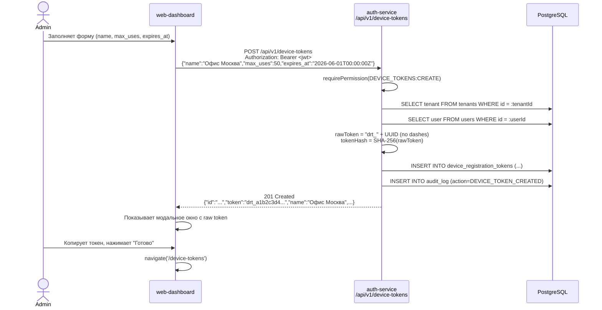
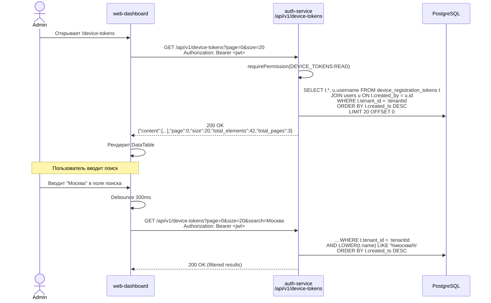
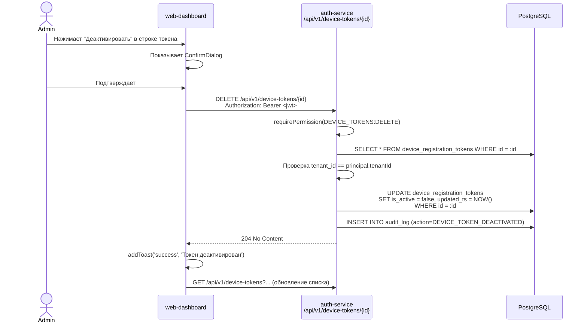

# Device Registration Tokens -- CRUD спецификация

| Поле | Значение |
|------|----------|
| Документ | REGISTRATION_TOKENS_CRUD |
| Дата | 2026-03-02 |
| Статус | DRAFT |
| Автор | System Analyst (Claude) |
| Затрагивает | auth-service, web-dashboard |

---

## 1. Текущее состояние

### 1.1. Модель данных (PostgreSQL)

Таблица `device_registration_tokens` создана миграцией `V14`:

| Колонка | Тип | Constraints | Описание |
|---------|-----|-------------|----------|
| `id` | `UUID` | PK, DEFAULT gen_random_uuid() | Первичный ключ |
| `tenant_id` | `UUID` | NOT NULL, FK → tenants(id) | Tenant isolation |
| `token_hash` | `VARCHAR(255)` | NOT NULL, UNIQUE | SHA-256 хэш raw-токена |
| `name` | `VARCHAR(255)` | NOT NULL | Человекочитаемое имя |
| `max_uses` | `INTEGER` | NULLABLE | NULL = безлимитный |
| `current_uses` | `INTEGER` | NOT NULL, DEFAULT 0 | Счётчик использований |
| `expires_at` | `TIMESTAMPTZ` | NULLABLE | NULL = бессрочный |
| `is_active` | `BOOLEAN` | NOT NULL, DEFAULT TRUE | Статус активности |
| `created_by` | `UUID` | NOT NULL, FK → users(id) | Кто создал |
| `created_ts` | `TIMESTAMPTZ` | NOT NULL, DEFAULT NOW() | Время создания |
| `updated_ts` | `TIMESTAMPTZ` | NOT NULL, DEFAULT NOW() | Время обновления |

**Индексы:**
- `idx_drt_tenant_id` -- `(tenant_id)`
- `idx_drt_token_hash` -- `(token_hash)`
- `idx_drt_active` -- `(tenant_id, is_active) WHERE is_active = TRUE` (partial)

### 1.2. Permissions (из V10 + V19)

| Permission code | Назначение | Роли |
|-----------------|------------|------|
| `DEVICE_TOKENS:CREATE` | Создание токенов | SUPER_ADMIN, TENANT_ADMIN, MANAGER |
| `DEVICE_TOKENS:READ` | Просмотр токенов | SUPER_ADMIN, TENANT_ADMIN, MANAGER, SUPERVISOR |
| `DEVICE_TOKENS:DELETE` | Деактивация токенов | SUPER_ADMIN, TENANT_ADMIN, MANAGER |

> **Замечание:** Permission `DEVICE_TOKENS:UPDATE` отсутствует. Это сознательное решение -- токены immutable по содержанию (name, maxUses, expiresAt не изменяемы после создания). Единственная мутация -- деактивация через DELETE.

### 1.3. Существующие backend-эндпоинты

| Метод | Путь | Permission | Контроллер | Статус |
|-------|------|------------|------------|--------|
| `POST` | `/api/v1/device-tokens` | `DEVICE_TOKENS:CREATE` | DeviceTokenController.createToken | **Реализован** |
| `GET` | `/api/v1/device-tokens` | `DEVICE_TOKENS:READ` | DeviceTokenController.getTokens | **Реализован** (пагинация) |
| `DELETE` | `/api/v1/device-tokens/{id}` | `DEVICE_TOKENS:DELETE` | DeviceTokenController.deactivateToken | **Реализован** (soft delete) |

### 1.4. Существующие frontend-страницы

| Компонент | Путь | Статус |
|-----------|------|--------|
| `DeviceTokensListPage.tsx` | `/device-tokens` | **Реализован** |
| `DeviceTokenCreatePage.tsx` | `/device-tokens/create` | **Реализован** |
| `deviceTokens.ts` (API) | -- | **Реализован** (getDeviceTokens, createDeviceToken, deleteDeviceToken) |

Роутинг (`App.tsx`), сайдбар (`Sidebar.tsx`), типы (`types/device.ts`) -- все настроены.

### 1.5. Существующий DeviceTokenResponse (backend DTO)

```java
public class DeviceTokenResponse {
    private UUID id;
    private String token;       // raw token -- только при создании
    private String name;
    private Integer maxUses;
    private Integer currentUses;
    private Instant expiresAt;
    private Boolean isActive;
    private Instant createdTs;
}
```

Jackson сериализует в snake_case (`application.yml: property-naming-strategy: SNAKE_CASE`), поэтому JSON-ответ содержит: `is_active`, `max_uses`, `current_uses`, `expires_at`, `created_ts`.

---

## 2. Выявленные проблемы и пробелы

### 2.1. Backend -- расхождения DTO с фронтендом

| # | Проблема | Severity |
|---|----------|----------|
| B1 | **`created_by` отсутствует в DeviceTokenResponse (backend)**. Frontend-тип `DeviceTokenResponse` объявляет поле `created_by: string`, но бэкенд не возвращает его. На UI поле нигде не отображается, поэтому пока нет runtime-ошибки, но контракт нарушен. | Medium |
| B2 | **`token_preview` отсутствует в DeviceTokenResponse (backend)**. Frontend-тип объявляет `token_preview?: string` и рендерит его в колонке "Токен" таблицы. Бэкенд не возвращает это поле. В UI отображается fallback `****`. | Medium |
| B3 | **Нет фильтрации по статусу (is_active)**. GET /device-tokens возвращает все токены (и активные, и деактивированные) без возможности фильтрации. Для Devices и Users фильтры есть. | Low |
| B4 | **Нет поиска по имени**. Для Devices и Users есть search, для токенов -- нет. | Low |
| B5 | **Нет GET /device-tokens/{id}** (получение одного токена). Не критично, т.к. UI не имеет страницы детализации, но для API completeness не хватает. | Low |

### 2.2. Frontend -- незначительные issues

| # | Проблема | Severity |
|---|----------|----------|
| F1 | Колонка "Токен" в таблице показывает `****` вместо осмысленного preview, потому что бэкенд не отдаёт `token_preview`. | Medium |
| F2 | Нет фильтров (по статусу is_active, по имени). Устройства и пользователи имеют фильтры. | Low |
| F3 | Нет колонки "Создал" (created_by) в таблице. Для аудита полезно видеть, кто создал токен. | Low |

---

## 3. Спецификация доработок

### 3.1. Backend: обновление DeviceTokenResponse

**Файл:** `auth-service/src/main/java/com/prg/auth/dto/response/DeviceTokenResponse.java`

Добавить два поля:

```java
public class DeviceTokenResponse {
    private UUID id;
    private String token;           // raw token -- ТОЛЬКО при создании, иначе null
    private String tokenPreview;    // НОВОЕ: первые 8 символов raw-токена ("drt_xxxx")
    private String name;
    private Integer maxUses;
    private Integer currentUses;
    private Instant expiresAt;
    private Boolean isActive;
    private String createdByUsername; // НОВОЕ: username создателя
    private Instant createdTs;
}
```

**JSON-сериализация** (snake_case):
```json
{
  "id": "550e8400-e29b-41d4-a716-446655440000",
  "token": null,
  "token_preview": "drt_a1b2",
  "name": "Офис Москва",
  "max_uses": 50,
  "current_uses": 12,
  "expires_at": "2026-06-01T00:00:00Z",
  "is_active": true,
  "created_by_username": "admin",
  "created_ts": "2026-03-01T10:00:00Z"
}
```

> **Проектное решение по token_preview:** Хранить preview в БД не нужно. Вместо этого использовать первые 8 символов `token_hash` как визуальный идентификатор (хэш уникален). Формат: `drt_` + первые 4 hex-символа хэша. Это безопасно, т.к. по 4 символам хэша восстановить токен невозможно.

**Файл:** `auth-service/src/main/java/com/prg/auth/service/DeviceTokenService.java`

Обновить метод `toResponse()`:

```java
private DeviceTokenResponse toResponse(DeviceRegistrationToken token, String rawToken) {
    return DeviceTokenResponse.builder()
            .id(token.getId())
            .token(rawToken)
            .tokenPreview("drt_" + token.getTokenHash().substring(0, 4))
            .name(token.getName())
            .maxUses(token.getMaxUses())
            .currentUses(token.getCurrentUses())
            .expiresAt(token.getExpiresAt())
            .isActive(token.getIsActive())
            .createdByUsername(token.getCreatedBy().getUsername())
            .createdTs(token.getCreatedTs())
            .build();
}
```

> **Внимание:** при вызове `token.getCreatedBy().getUsername()` на LAZY-загрузке может быть `LazyInitializationException`, если сессия уже закрыта. Метод вызывается внутри `@Transactional`, поэтому проблемы нет. Однако для GET (list) нужно убедиться, что `@Transactional(readOnly = true)` сохранён и JPA-сессия открыта на момент маппинга. Текущий код корректен -- маппинг происходит внутри `getTokens()`, который `@Transactional(readOnly = true)`.

> **Альтернатива (более производительная):** добавить `@EntityGraph` или JOIN FETCH в репозиторий, чтобы избежать N+1 запросов при листинге. Рекомендуемый подход:
> ```java
> @Query("SELECT t FROM DeviceRegistrationToken t JOIN FETCH t.createdBy WHERE t.tenant.id = :tenantId")
> Page<DeviceRegistrationToken> findByTenantIdWithCreatedBy(@Param("tenantId") UUID tenantId, Pageable pageable);
> ```

---

### 3.2. Backend: фильтрация GET /device-tokens

**Текущая сигнатура:**
```
GET /api/v1/device-tokens?page=0&size=20
```

**Новая сигнатура:**
```
GET /api/v1/device-tokens?page=0&size=20&search=офис&is_active=true
```

| Параметр | Тип | Default | Описание |
|----------|-----|---------|----------|
| `page` | int | 0 | Номер страницы (0-based) |
| `size` | int | 20 | Размер страницы (max 100) |
| `search` | String | null | Поиск по name (ILIKE %search%) |
| `is_active` | Boolean | null | Фильтр по статусу (null = все) |

**Контроллер (изменения):**

```java
@GetMapping
public ResponseEntity<PageResponse<DeviceTokenResponse>> getTokens(
        @AuthenticationPrincipal UserPrincipal principal,
        @RequestParam(defaultValue = "0") int page,
        @RequestParam(defaultValue = "20") int size,
        @RequestParam(required = false) String search,
        @RequestParam(name = "is_active", required = false) Boolean isActive) {
    requirePermission(principal, "DEVICE_TOKENS:READ");
    PageResponse<DeviceTokenResponse> response = deviceTokenService.getTokens(
            principal, page, size, search, isActive);
    return ResponseEntity.ok(response);
}
```

**Репозиторий (новый метод):**

```java
@Query("""
    SELECT t FROM DeviceRegistrationToken t
    JOIN FETCH t.createdBy
    WHERE t.tenant.id = :tenantId
      AND (:search IS NULL OR LOWER(t.name) LIKE LOWER(CONCAT('%', CAST(:search AS string), '%')))
      AND (:isActive IS NULL OR t.isActive = :isActive)
    """)
Page<DeviceRegistrationToken> findByTenantIdFiltered(
    @Param("tenantId") UUID tenantId,
    @Param("search") String search,
    @Param("isActive") Boolean isActive,
    Pageable pageable);
```

> **Замечание:** Используется `CAST(:search AS string)` для корректной работы nullable String-параметра в PostgreSQL (аналогично исправлению из UserRepository).

---

### 3.3. Backend: GET /device-tokens/{id} (новый эндпоинт)

Для полноты API и возможного будущего UI детализации.

**Спецификация:**

```
GET /api/v1/device-tokens/{id}
Authorization: Bearer <jwt>
Permission: DEVICE_TOKENS:READ
```

**Response 200:**
```json
{
  "id": "550e8400-e29b-41d4-a716-446655440000",
  "token": null,
  "token_preview": "drt_a1b2",
  "name": "Офис Москва",
  "max_uses": 50,
  "current_uses": 12,
  "expires_at": "2026-06-01T00:00:00Z",
  "is_active": true,
  "created_by_username": "admin",
  "created_ts": "2026-03-01T10:00:00Z"
}
```

**Response 404:**
```json
{
  "error": "Device registration token not found",
  "code": "TOKEN_NOT_FOUND"
}
```

**Tenant isolation:** Если `token.tenant_id != principal.tenantId`, вернуть 404 (не 403), чтобы не раскрывать существование ресурса другого тенанта (defense in depth, аналогично текущей реализации в `deactivateToken`).

**Контроллер:**

```java
@GetMapping("/{id}")
public ResponseEntity<DeviceTokenResponse> getToken(
        @PathVariable UUID id,
        @AuthenticationPrincipal UserPrincipal principal) {
    requirePermission(principal, "DEVICE_TOKENS:READ");
    DeviceTokenResponse response = deviceTokenService.getToken(id, principal);
    return ResponseEntity.ok(response);
}
```

**Сервис:**

```java
@Transactional(readOnly = true)
public DeviceTokenResponse getToken(UUID tokenId, UserPrincipal principal) {
    DeviceRegistrationToken token = tokenRepository.findById(tokenId)
            .orElseThrow(() -> new ResourceNotFoundException(
                "Device registration token not found", "TOKEN_NOT_FOUND"));

    if (!token.getTenant().getId().equals(principal.getTenantId())) {
        throw new ResourceNotFoundException(
            "Device registration token not found", "TOKEN_NOT_FOUND");
    }

    return toResponse(token, null);
}
```

---

### 3.4. Сводная таблица API-эндпоинтов (целевое состояние)

| Метод | Путь | Permission | Статус | Описание |
|-------|------|------------|--------|----------|
| `POST` | `/api/v1/device-tokens` | `DEVICE_TOKENS:CREATE` | Существует | Создание токена, возврат raw token |
| `GET` | `/api/v1/device-tokens` | `DEVICE_TOKENS:READ` | **Доработать** | Список с пагинацией + фильтры |
| `GET` | `/api/v1/device-tokens/{id}` | `DEVICE_TOKENS:READ` | **Новый** | Получение одного токена по ID |
| `DELETE` | `/api/v1/device-tokens/{id}` | `DEVICE_TOKENS:DELETE` | Существует | Soft delete (деактивация) |

> **Решение не добавлять PUT/PATCH:** Регистрационные токены являются immutable по своей природе. Изменение `name` не критично, изменение `max_uses` или `expires_at` после создания может нарушить security assumptions (расширение лимита задним числом). Если нужно изменить параметры -- деактивировать старый и создать новый.

---

### 3.5. Коды ошибок

| HTTP | Code | Ситуация |
|------|------|----------|
| 400 | `VALIDATION_ERROR` | Невалидные поля (name пусто, maxUses < 1, expiresAt в прошлом) |
| 401 | `UNAUTHORIZED` | Отсутствует/невалидный JWT |
| 403 | `ACCESS_DENIED` | Нет permission (DEVICE_TOKENS:CREATE/READ/DELETE) |
| 404 | `TOKEN_NOT_FOUND` | Токен не найден или принадлежит другому тенанту |
| 404 | `TENANT_NOT_FOUND` | Тенант пользователя не найден (внутренняя ошибка) |
| 404 | `USER_NOT_FOUND` | Пользователь-создатель не найден (внутренняя ошибка) |
| 500 | `INTERNAL_ERROR` | Непредвиденная ошибка |

---

### 3.6. Frontend: обновление типов

**Файл:** `web-dashboard/src/types/device.ts`

```typescript
export interface DeviceTokenResponse {
  id: string;
  token?: string;               // raw token -- только при создании
  token_preview?: string;        // "drt_xxxx" -- визуальный идентификатор
  name: string;
  max_uses: number | null;
  current_uses: number;
  expires_at: string | null;
  is_active: boolean;
  created_by_username?: string;  // НОВОЕ (заменяет created_by: string)
  created_ts: string;
}
```

> **Breaking change:** поле `created_by: string` (UUID) заменяется на `created_by_username: string` (username). Поскольку текущий бэкенд вообще не отдаёт `created_by`, это не является реальным breaking change -- фронтенд получал `undefined`.

---

### 3.7. Frontend: обновление API-клиента

**Файл:** `web-dashboard/src/api/deviceTokens.ts`

```typescript
import apiClient from './client';
import type { DeviceTokenResponse, CreateDeviceTokenRequest } from '../types/device';
import type { PageResponse } from '../types/common';

export interface DeviceTokensListParams {
  page?: number;
  size?: number;
  search?: string;       // НОВОЕ
  is_active?: boolean;   // НОВОЕ
}

export async function getDeviceTokens(
  params?: DeviceTokensListParams
): Promise<PageResponse<DeviceTokenResponse>> {
  const response = await apiClient.get<PageResponse<DeviceTokenResponse>>(
    '/device-tokens', { params }
  );
  return response.data;
}

// НОВАЯ функция
export async function getDeviceToken(id: string): Promise<DeviceTokenResponse> {
  const response = await apiClient.get<DeviceTokenResponse>(`/device-tokens/${id}`);
  return response.data;
}

export async function createDeviceToken(
  data: CreateDeviceTokenRequest
): Promise<DeviceTokenResponse> {
  const response = await apiClient.post<DeviceTokenResponse>('/device-tokens', data);
  return response.data;
}

export async function deleteDeviceToken(id: string): Promise<void> {
  await apiClient.delete(`/device-tokens/${id}`);
}
```

---

### 3.8. Frontend: обновление DeviceTokensListPage

Добавить:
1. Фильтр по статусу (`is_active`)
2. Поиск по имени (`search`)
3. Колонку "Создал" (`created_by_username`)
4. Отображение `token_preview` вместо `****`

**Файл:** `web-dashboard/src/pages/DeviceTokensListPage.tsx`

#### 3.8.1. Новые состояния:

```typescript
// Filters
const [search, setSearch] = useState('');
const [searchInput, setSearchInput] = useState('');
const [statusFilter, setStatusFilter] = useState<string>('');

// Debounce search input
useEffect(() => {
  const timer = setTimeout(() => {
    setSearch(searchInput);
    setPage(0);
  }, 300);
  return () => clearTimeout(timer);
}, [searchInput]);
```

#### 3.8.2. Обновление fetchTokens:

```typescript
const fetchTokens = useCallback(async () => {
  setLoading(true);
  try {
    const params: DeviceTokensListParams = { page, size };
    if (search) params.search = search;
    if (statusFilter !== '') params.is_active = statusFilter === 'active';

    const data = await getDeviceTokens(params);
    setTokens(data.content);
    setTotalElements(data.total_elements);
    setTotalPages(data.total_pages);
  } catch {
    addToast('error', 'Не удалось загрузить токены');
  } finally {
    setLoading(false);
  }
}, [page, size, search, statusFilter, addToast]);
```

#### 3.8.3. Фильтры в JSX (перед таблицей):

```tsx
{/* Filters */}
<div className="mt-6 flex flex-col gap-4 sm:flex-row sm:items-end">
  {/* Search */}
  <div className="flex-1">
    <label htmlFor="tokenSearch" className="label">Поиск</label>
    <div className="relative mt-1">
      <div className="pointer-events-none absolute inset-y-0 left-0 flex items-center pl-3">
        <MagnifyingGlassIcon className="h-5 w-5 text-gray-400" aria-hidden="true" />
      </div>
      <input
        id="tokenSearch"
        type="text"
        placeholder="Поиск по имени..."
        value={searchInput}
        onChange={(e) => setSearchInput(e.target.value)}
        className="input-field pl-10"
      />
    </div>
  </div>

  {/* Status filter */}
  <div className="sm:w-48">
    <label htmlFor="tokenStatus" className="label">Статус</label>
    <select
      id="tokenStatus"
      value={statusFilter}
      onChange={(e) => {
        setStatusFilter(e.target.value);
        setPage(0);
      }}
      className="input-field mt-1"
    >
      <option value="">Все</option>
      <option value="active">Активные</option>
      <option value="inactive">Деактивированные</option>
    </select>
  </div>
</div>
```

#### 3.8.4. Обновление колонок таблицы:

```typescript
const columns: Column<DeviceTokenResponse>[] = [
  {
    key: 'name',
    title: 'Имя',
    render: (token) => (
      <span className="font-medium text-gray-900">{token.name}</span>
    ),
  },
  {
    key: 'token_preview',
    title: 'Токен',
    render: (token) => (
      <code className="rounded bg-gray-100 px-2 py-0.5 text-xs font-mono text-gray-700">
        {token.token_preview || '****'}
      </code>
    ),
  },
  {
    key: 'current_uses',
    title: 'Использований',
    render: (token) => (
      <span className="text-gray-900">
        {token.current_uses}
        {token.max_uses !== null ? ` / ${token.max_uses}` : ''}
      </span>
    ),
  },
  {
    key: 'expires_at',
    title: 'Срок действия',
    render: (token) => {
      if (!token.expires_at) return <span className="text-gray-500">Бессрочный</span>;
      const isExpired = new Date(token.expires_at) < new Date();
      return (
        <span className={isExpired ? 'text-red-600' : 'text-gray-900'}>
          {formatDateTime(token.expires_at)}
          {isExpired && ' (истёк)'}
        </span>
      );
    },
  },
  {
    key: 'is_active',
    title: 'Статус',
    render: (token) => (
      <StatusBadge
        active={token.is_active}
        activeText="Активен"
        inactiveText="Деактивирован"
      />
    ),
  },
  {
    key: 'created_by_username',
    title: 'Создал',
    render: (token) => (
      <span className="text-gray-700">{token.created_by_username || '--'}</span>
    ),
  },
  {
    key: 'actions',
    title: 'Действия',
    render: (token) => (
      <PermissionGate permission="DEVICE_TOKENS:DELETE">
        {token.is_active && (
          <button
            type="button"
            onClick={(e) => {
              e.stopPropagation();
              setDeactivateTarget(token);
            }}
            className="text-sm text-red-600 hover:text-red-800"
          >
            Деактивировать
          </button>
        )}
      </PermissionGate>
    ),
  },
];
```

Изменение: колонка "Максимум" убрана, вместо неё счётчик использований показывает формат "12 / 50" (current / max). Если max_uses = null, показывается просто "12".

---

## 4. Миграция БД

Новая Flyway-миграция **НЕ требуется**. Все необходимые колонки уже существуют в таблице `device_registration_tokens`. Изменения касаются только DTO и контроллера.

---

## 5. Sequence Diagrams

### 5.1. Создание токена (текущий flow, без изменений)



### 5.2. Получение списка (целевой flow с фильтрами)



### 5.3. Деактивация токена (текущий flow, без изменений)



---

## 6. Список задач на реализацию

### 6.1. Backend (auth-service)

| # | Задача | Файл | Приоритет |
|---|--------|------|-----------|
| BE-1 | Добавить поля `tokenPreview`, `createdByUsername` в `DeviceTokenResponse` | dto/response/DeviceTokenResponse.java | High |
| BE-2 | Обновить `toResponse()` в `DeviceTokenService` для маппинга новых полей | service/DeviceTokenService.java | High |
| BE-3 | Добавить метод `findByTenantIdFiltered()` с JOIN FETCH + search + isActive в репозиторий | repository/DeviceRegistrationTokenRepository.java | High |
| BE-4 | Обновить `getTokens()` в сервисе для передачи параметров фильтрации | service/DeviceTokenService.java | High |
| BE-5 | Добавить параметры `search`, `is_active` в контроллер `getTokens()` | controller/DeviceTokenController.java | High |
| BE-6 | Добавить эндпоинт `getToken(id)` -- GET /device-tokens/{id} | controller/DeviceTokenController.java | Medium |
| BE-7 | Добавить метод `getToken(id, principal)` в сервис | service/DeviceTokenService.java | Medium |

### 6.2. Frontend (web-dashboard)

| # | Задача | Файл | Приоритет |
|---|--------|------|-----------|
| FE-1 | Обновить тип `DeviceTokenResponse`: заменить `created_by` на `created_by_username` | types/device.ts | High |
| FE-2 | Обновить `DeviceTokensListParams`: добавить `search`, `is_active` | api/deviceTokens.ts | High |
| FE-3 | Добавить функцию `getDeviceToken(id)` | api/deviceTokens.ts | Low |
| FE-4 | Добавить фильтры (search input + status select) в DeviceTokensListPage | pages/DeviceTokensListPage.tsx | High |
| FE-5 | Добавить колонку "Создал" в таблицу | pages/DeviceTokensListPage.tsx | Medium |
| FE-6 | Объединить колонки "Использований" и "Максимум" в одну "Использований" ("12 / 50") | pages/DeviceTokensListPage.tsx | Low |

---

## 7. Влияние на другие компоненты

| Компонент | Влияние |
|-----------|---------|
| **control-plane** | Нет. Не использует device_registration_tokens. |
| **ingest-gateway** | Нет. |
| **playback-service** | Нет. |
| **search-service** | Нет. |
| **Windows Agent** | Нет. Агент использует raw-токен для device-login, API токенов не вызывает. |
| **Flyway-миграции** | Нет новых миграций. Все колонки уже в БД. |
| **NATS** | Нет. Токены не публикуют событий (можно добавить в будущем). |
| **OpenSearch** | Нет. |

---

## 8. Тест-кейсы (acceptance criteria)

### UC-1: Просмотр списка токенов (обновлённый)

**Как** TENANT_ADMIN, **я хочу** видеть список регистрационных токенов с превью токена и именем создателя, **чтобы** контролировать выданные токены.

**Acceptance criteria:**
- [ ] Таблица показывает колонки: Имя, Токен (preview), Использований, Срок действия, Статус, Создал, Действия
- [ ] Колонка "Токен" отображает `token_preview` (например, "drt_a1b2"), а не "****"
- [ ] Колонка "Создал" отображает username создателя
- [ ] Колонка "Использований" показывает "current / max" или просто "current" если max = null
- [ ] Пагинация работает: page, size, totalElements, totalPages
- [ ] Сортировка по умолчанию: по дате создания DESC

### UC-2: Фильтрация по статусу

**Как** MANAGER, **я хочу** фильтровать токены по статусу (активные / деактивированные), **чтобы** быстро находить нужные.

**Acceptance criteria:**
- [ ] Присутствует выпадающий список со значениями: Все / Активные / Деактивированные
- [ ] При выборе "Активные" -- GET ?is_active=true -- показываются только active
- [ ] При выборе "Деактивированные" -- GET ?is_active=false -- показываются только inactive
- [ ] При выборе "Все" -- параметр is_active не отправляется
- [ ] Фильтр сбрасывает страницу на 0

### UC-3: Поиск по имени

**Как** TENANT_ADMIN, **я хочу** искать токены по имени, **чтобы** быстро находить нужный среди многих.

**Acceptance criteria:**
- [ ] Присутствует поле поиска с placeholder "Поиск по имени..."
- [ ] Поиск выполняется с debounce 300ms
- [ ] Поиск регистронезависимый (ILIKE)
- [ ] При вводе текста страница сбрасывается на 0
- [ ] Пустое поле -- показать все токены (параметр search не отправляется)

### UC-4: Создание токена (без изменений)

**Как** TENANT_ADMIN, **я хочу** создать регистрационный токен, **чтобы** распространить его на устройства для автоматической регистрации.

**Acceptance criteria:**
- [ ] Форма содержит поля: Имя (обязательное), Макс. использований (опциональное), Срок действия (опциональное)
- [ ] После создания показывается модальное окно с raw-токеном и кнопкой копирования
- [ ] Предупреждение: "Сохраните токен! Он больше не будет показан"
- [ ] После закрытия модалки -- redirect на /device-tokens
- [ ] Запись в audit_log с action=DEVICE_TOKEN_CREATED

### UC-5: Деактивация токена (без изменений)

**Как** MANAGER, **я хочу** деактивировать регистрационный токен, **чтобы** предотвратить дальнейшую регистрацию устройств с этим токеном.

**Acceptance criteria:**
- [ ] Кнопка "Деактивировать" отображается только для активных токенов
- [ ] Кнопка видна только пользователям с permission DEVICE_TOKENS:DELETE
- [ ] Показывается диалог подтверждения с именем токена
- [ ] После подтверждения -- DELETE /device-tokens/{id} -- 204
- [ ] Список обновляется автоматически
- [ ] Toast "Токен деактивирован"
- [ ] Запись в audit_log с action=DEVICE_TOKEN_DEACTIVATED

### UC-6: Получение одного токена по ID (новый)

**Как** разработчик API, **я хочу** получить детали конкретного токена, **чтобы** использовать их в интеграциях.

**Acceptance criteria:**
- [ ] GET /api/v1/device-tokens/{id} возвращает 200 с данными токена
- [ ] Поле `token` всегда null (raw token не хранится)
- [ ] Если токен не найден или принадлежит другому тенанту -- 404 TOKEN_NOT_FOUND
- [ ] Требуется permission DEVICE_TOKENS:READ

---

## 9. Открытые вопросы

| # | Вопрос | Варианты | Рекомендация |
|---|--------|----------|--------------|
| Q1 | Нужен ли UI для детализации одного токена (DeviceTokenDetailPage)? | (a) Нет, достаточно таблицы. (b) Да, с историей использования | (a) -- на данном этапе достаточно таблицы. Detail page можно добавить позже, когда появится связь tokens -> devices (какие устройства зарегистрированы этим токеном). |
| Q2 | Нужна ли возможность "реактивации" деактивированного токена? | (a) Нет. (b) Да, PATCH с is_active=true | (a) -- принцип immutability. Создать новый токен проще и безопаснее. |
| Q3 | Нужно ли добавить событие NATS при создании/деактивации токена? | (a) Нет. (b) Да, events.device_tokens.created / events.device_tokens.deactivated | (b) -- для будущей интеграции с search-service и аудитом в реальном времени. Но это отдельная задача. |
| Q4 | Нужна ли валидация `expiresAt > now()` на бэкенде? | (a) Нет, фронтенд валидирует. (b) Да, серверная валидация | (b) -- фронтенд-валидация не заменяет серверную. Добавить проверку в сервисе. |
