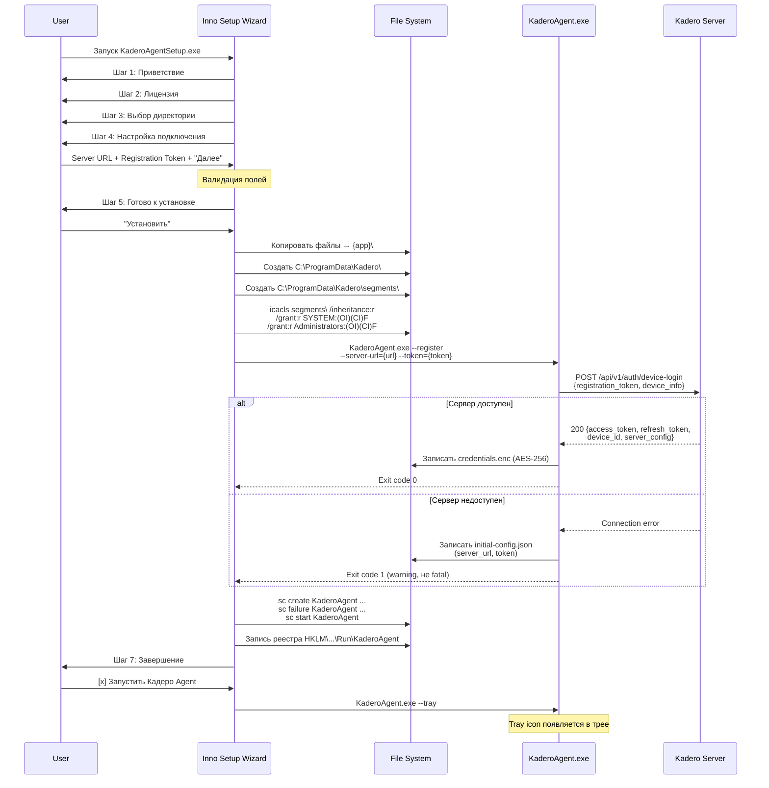
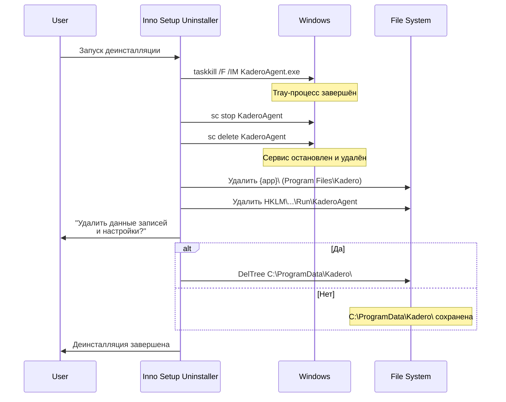
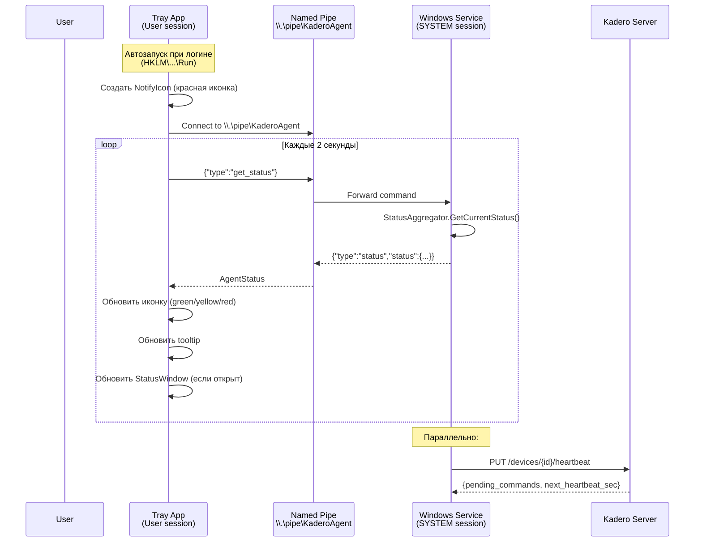
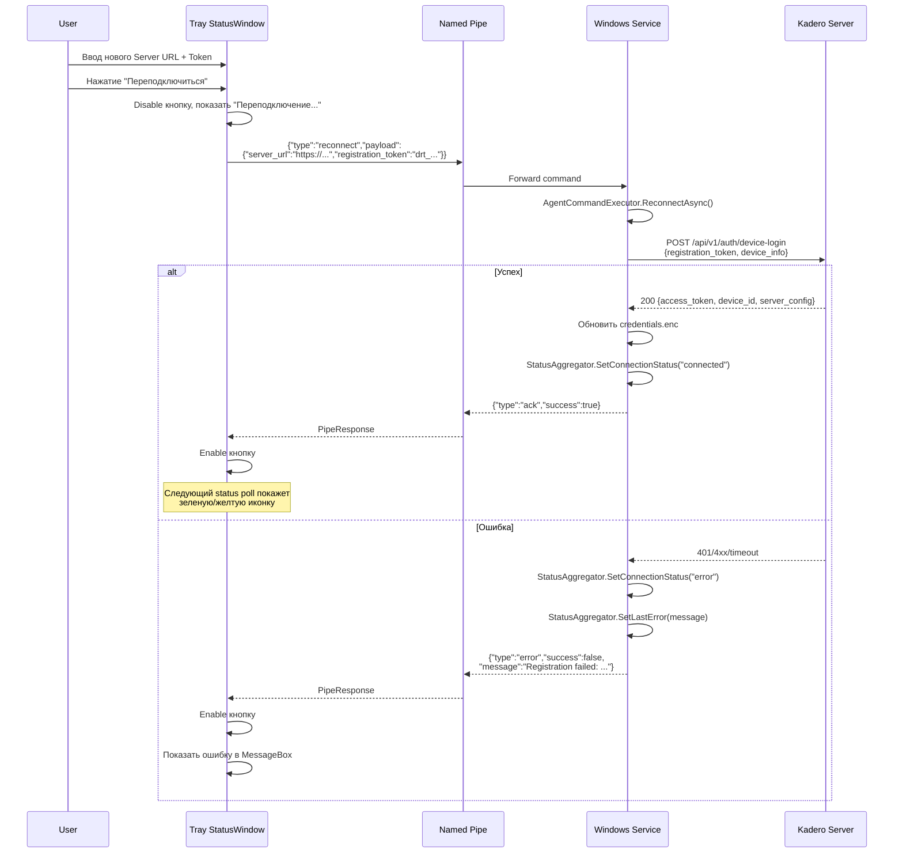
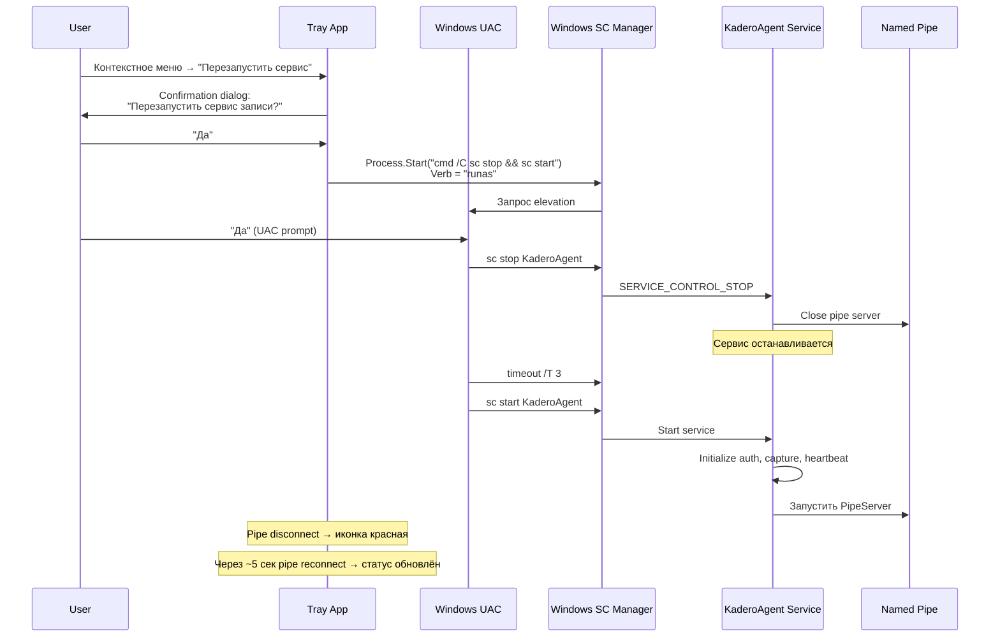

# Windows Agent: Инсталлятор с UI-визардом и Tray-приложение

| Поле | Значение |
|------|----------|
| Документ | WINDOWS_AGENT_UI |
| Дата | 2026-03-05 |
| Статус | DRAFT |
| Автор | System Analyst (Claude) |
| Затрагивает | windows-agent-csharp (KaderoAgent) |
| Серверные изменения | Не требуются |

---

## Содержание

1. [Обзор](#1-обзор)
2. [Архитектура решения](#2-архитектура-решения)
3. [Feature 1: Инсталлятор с UI-визардом](#3-feature-1-инсталлятор-с-ui-визардом)
4. [Feature 2: Tray-приложение](#4-feature-2-tray-приложение)
5. [Протокол Named Pipe](#5-протокол-named-pipe)
6. [Формат конфигурационных файлов](#6-формат-конфигурационных-файлов)
7. [NTFS ACL для защиты буфера](#7-ntfs-acl-для-защиты-буфера)
8. [Изменения в существующих компонентах](#8-изменения-в-существующих-компонентах)
9. [Sequence Diagrams](#9-sequence-diagrams)
10. [User Stories и Acceptance Criteria](#10-user-stories-и-acceptance-criteria)
11. [Структура файлов проекта](#11-структура-файлов-проекта)
12. [Сборка и выпуск](#12-сборка-и-выпуск)
13. [Риски и ограничения](#13-риски-и-ограничения)
14. [Чеклист реализации](#14-чеклист-реализации)

---

## 1. Обзор

### 1.1. Цель документа

Техническая спецификация двух доработок Windows-агента Кадеро:

1. **Инсталлятор с UI-визардом** -- Inno Setup скрипт с полным визардом установки, включая шаг настройки подключения, защиту буфера записей NTFS ACL, автозагрузку tray-приложения.
2. **Tray-приложение** -- WinForms NotifyIcon с окном статуса, контекстным меню, цветовой индикацией состояния и коммуникацией с Windows Service через Named Pipe.

### 1.2. Текущее состояние

| Компонент | Текущее | Целевое |
|-----------|---------|---------|
| Инсталлятор | Базовый Inno Setup без визарда конфигурации | Полный визард: приветствие, лицензия, путь, настройка подключения, прогресс |
| SetupForm | Простая форма (server URL, token, connect) | Не используется напрямую (логика перемещена в инсталлятор + tray) |
| TrayApplication | Заглушка с минимальным меню | Полнофункциональное tray-приложение с Named Pipe IPC |
| Буфер segments/ | Обычная директория, доступная пользователю | NTFS ACL: SYSTEM + Administrators only |
| config.json | Нет (appsettings.json + credentials.enc) | Дополнительный shared config для IPC |
| Named Pipe | Нет | `\\.\pipe\KaderoAgent` -- bidirectional JSON protocol |

### 1.3. Принципы

| Принцип | Описание |
|---------|----------|
| Разделение процессов | Service работает как SYSTEM в Session 0; Tray работает как пользователь в интерактивной сессии |
| Backward compatibility | Режимы `--service`, `--register`, `--setup` продолжают работать |
| Graceful degradation | Если Named Pipe недоступен, tray показывает "Нет связи с сервисом" |
| Один источник конфигурации | `credentials.enc` остается единственным persistent store; shared config -- кеш для tray |
| Минимум привилегий | Tray работает от имени обычного пользователя; для restart service требуется elevation |

---

## 2. Архитектура решения

### 2.1. Процессная модель

```
┌──────────────────────────────────────────────────────────┐
│  Session 0 (SYSTEM)                                      │
│  ┌────────────────────────────────────────────────────┐  │
│  │  KaderoAgent.exe --service                         │  │
│  │  (Windows Service: "KaderoAgent")                  │  │
│  │                                                    │  │
│  │  ┌──────────────┐  ┌───────────────┐              │  │
│  │  │ AgentService  │  │ HeartbeatSvc  │              │  │
│  │  └──────────────┘  └───────────────┘              │  │
│  │  ┌──────────────┐  ┌───────────────┐              │  │
│  │  │ CaptureManager│ │ UploadQueue   │              │  │
│  │  └──────────────┘  └───────────────┘              │  │
│  │  ┌──────────────────────────────────┐              │  │
│  │  │ PipeServer (\\.\pipe\KaderoAgent)│              │  │
│  │  └──────────────────────────────────┘              │  │
│  └────────────────────────────────────────────────────┘  │
└──────────────────────────────────────────────────────────┘
         │ Named Pipe (JSON over stream)
         ▼
┌──────────────────────────────────────────────────────────┐
│  Session 1+ (User)                                       │
│  ┌────────────────────────────────────────────────────┐  │
│  │  KaderoAgent.exe --tray                            │  │
│  │  (NotifyIcon в System Tray)                        │  │
│  │                                                    │  │
│  │  ┌──────────────┐  ┌───────────────┐              │  │
│  │  │ TrayApp       │  │ PipeClient    │              │  │
│  │  └──────────────┘  └───────────────┘              │  │
│  │  ┌──────────────┐  ┌───────────────┐              │  │
│  │  │ StatusWindow  │  │ AboutDialog   │              │  │
│  │  └──────────────┘  └───────────────┘              │  │
│  └────────────────────────────────────────────────────┘  │
└──────────────────────────────────────────────────────────┘
```

### 2.2. Файловая структура на диске

```
C:\Program Files\Kadero\            ← установлен инсталлятором
├── KaderoAgent.exe                  ← единый бинарник (service + tray + setup + register)
├── ffmpeg.exe                       ← FFmpeg для захвата экрана
├── appsettings.json                 ← дефолтная конфигурация
├── LICENSE.txt                      ← лицензионное соглашение
└── unins000.exe                     ← деинсталлятор Inno Setup

C:\ProgramData\Kadero\              ← данные приложения
├── credentials.enc                  ← зашифрованные креды (AES-256, ключ=SHA256(HardwareId))
├── status.json                      ← shared status file (plaintext, read-only для tray)
├── agent.db                         ← SQLite (pending segments, state)
├── logs\                            ← лог-файлы
│   ├── service-2026-03-05.log
│   └── tray-2026-03-05.log
└── segments\                        ← буфер записей [NTFS ACL: SYSTEM+Admins only]
    └── <session-id>\
        ├── segment_00000.mp4
        └── segment_00001.mp4
```

### 2.3. Режимы запуска KaderoAgent.exe

| Флаг | Описание | Процесс | Сессия |
|------|----------|---------|--------|
| `--service` | Windows Service mode | SCM | Session 0 (SYSTEM) |
| `--tray` | Tray application mode | Explorer autorun | Session 1+ (User) |
| `--setup` | Setup form (legacy) | Interactive | Session 1+ (User) |
| `--register --server-url=... --token=...` | Headless registration | CLI | Any |
| (none) | Если нет credentials -- показать setup form, иначе -- запустить как foreground service | Interactive | Session 1+ |

Новый режим `--tray` добавляется в `Program.cs`. Остальные режимы сохраняются для обратной совместимости.

---

## 3. Feature 1: Инсталлятор с UI-визардом

### 3.1. Шаги визарда

| # | Страница | Описание | Обязательность |
|---|----------|----------|----------------|
| 1 | **Приветствие** | "Добро пожаловать в мастер установки Кадеро Agent" с логотипом | Стандартная |
| 2 | **Лицензионное соглашение** | Текст лицензии, чекбокс "Я принимаю условия" | Стандартная |
| 3 | **Выбор директории** | По умолчанию `{commonpf}\Kadero`. Validate: путь доступен для записи | Стандартная |
| 4 | **Настройка подключения** | Custom page: Server URL + Registration Token | Кастомная |
| 5 | **Готово к установке** | Сводка параметров | Стандартная |
| 6 | **Прогресс** | Индикатор прогресса | Стандартная |
| 7 | **Завершение** | Чекбокс "Запустить сервис", чекбокс "Показать tray-приложение" | Стандартная |

### 3.2. Кастомная страница "Настройка подключения"

Поля:

| Поле | Тип | Валидация | Значение по умолчанию |
|------|-----|-----------|-----------------------|
| Server URL | TNewEdit | Обязательное. Regex: `^https?://.+`. При потере фокуса -- проверка URL format | `https://` |
| Registration Token | TNewEdit | Обязательное. MinLength=10. Placeholder: `drt_...` | (пусто) |

Валидация при нажатии "Далее":
- Оба поля заполнены
- Server URL соответствует формату URL
- Registration Token не пуст

Примечание: проверка доступности сервера НЕ выполняется на этапе инсталляции (сервис сделает это при старте). Это сознательное решение: инсталляция может происходить до настройки сети.

### 3.3. Действия при установке (полный список)

Порядок выполнения:

```
1. Копирование файлов
   ├── KaderoAgent.exe → {app}\
   ├── ffmpeg.exe → {app}\
   ├── appsettings.json → {app}\
   └── LICENSE.txt → {app}\

2. Создание директорий данных
   ├── C:\ProgramData\Kadero\
   ├── C:\ProgramData\Kadero\logs\
   └── C:\ProgramData\Kadero\segments\

3. Настройка NTFS ACL на segments\ (см. раздел 7)
   └── icacls: SYSTEM:F, Administrators:F, остальные -- remove

4. Сохранение initial config
   └── Записать server_url и registration_token в status.json
       (credentials.enc будет создан сервисом при первом device-login)

5. Регистрация Windows Service
   ├── sc create KaderoAgent binPath="..." start=auto
   └── sc failure KaderoAgent reset=86400 actions=restart/60000/restart/120000/restart/300000

6. Добавление tray в автозагрузку
   └── HKLM\SOFTWARE\Microsoft\Windows\CurrentVersion\Run
       "KaderoAgent" = "\"{app}\KaderoAgent.exe\" --tray"

7. Первичная регистрация устройства (silent, через --register)
   └── KaderoAgent.exe --register --server-url={url} --token={token}
       (если не удалось -- warning, сервис попробует при старте)

8. Запуск сервиса
   └── sc start KaderoAgent

9. Запуск tray-приложения
   └── KaderoAgent.exe --tray (nowait, в контексте текущего пользователя)
```

### 3.4. Действия при деинсталляции

```
1. Остановка tray-приложения
   └── taskkill /F /IM KaderoAgent.exe (только tray-процесс)

2. Остановка и удаление Windows Service
   ├── sc stop KaderoAgent
   └── sc delete KaderoAgent

3. Удаление из автозагрузки
   └── Удалить ключ HKLM\...\Run\KaderoAgent

4. Удаление файлов программы
   └── {app}\ -- удаляется полностью

5. Данные пользователя (опциональный диалог)
   └── Вопрос: "Удалить данные записей и настройки?"
       ├── Да → DelTree C:\ProgramData\Kadero (всё)
       └── Нет → оставить C:\ProgramData\Kadero\
```

### 3.5. Inno Setup скрипт (ключевые секции)

```pascal
; === setup.iss ===

[Setup]
AppName=Kadero Agent
AppVersion=1.0.0
AppPublisher=Kadero
AppPublisherURL=https://kadero.ru
DefaultDirName={commonpf}\Kadero
DefaultGroupName=Kadero
OutputBaseFilename=KaderoAgentSetup
Compression=lzma2
SolidCompression=yes
PrivilegesRequired=admin
ArchitecturesInstallIn64BitMode=x64compatible
LicenseFile=LICENSE.txt
WizardStyle=modern
SetupIconFile=kadero.ico
UninstallDisplayIcon={app}\KaderoAgent.exe
; Prevent running installer when already installed + running
AppMutex=KaderoAgentSetup

[Languages]
Name: "russian"; MessagesFile: "compiler:Languages\Russian.isl"

[Files]
Source: "publish\*"; DestDir: "{app}"; Flags: ignoreversion recursesubdirs
Source: "ffmpeg\ffmpeg.exe"; DestDir: "{app}"; Flags: ignoreversion
Source: "LICENSE.txt"; DestDir: "{app}"; Flags: ignoreversion

[Dirs]
Name: "{commonappdata}\Kadero"
Name: "{commonappdata}\Kadero\logs"
Name: "{commonappdata}\Kadero\segments"

[Icons]
Name: "{group}\Kadero Agent"; Filename: "{app}\KaderoAgent.exe"; Parameters: "--tray"
Name: "{group}\Удалить Kadero Agent"; Filename: "{uninstallexe}"

[Registry]
; Tray autorun (HKLM -- для всех пользователей)
Root: HKLM; Subkey: "SOFTWARE\Microsoft\Windows\CurrentVersion\Run"; \
  ValueType: string; ValueName: "KaderoAgent"; \
  ValueData: """{app}\KaderoAgent.exe"" --tray"; Flags: uninsdeletevalue

[Run]
; Установка NTFS ACL на segments
Filename: "icacls.exe"; Parameters: """{commonappdata}\Kadero\segments"" /inheritance:r /grant:r ""NT AUTHORITY\SYSTEM:(OI)(CI)F"" /grant:r ""BUILTIN\Administrators:(OI)(CI)F"""; \
  Flags: runhidden; StatusMsg: "Настройка прав доступа..."

; Регистрация устройства (silent, может не удаться -- ok)
Filename: "{app}\KaderoAgent.exe"; \
  Parameters: "--register --server-url={code:GetServerUrl} --token={code:GetRegToken}"; \
  Flags: runhidden waituntilterminated; StatusMsg: "Регистрация устройства..."

; Создание и запуск Windows Service
Filename: "sc.exe"; Parameters: "create KaderoAgent binPath= ""{app}\KaderoAgent.exe --service"" DisplayName= ""Kadero Screen Recorder"" start= auto"; \
  Flags: runhidden; StatusMsg: "Создание сервиса..."
Filename: "sc.exe"; Parameters: "failure KaderoAgent reset= 86400 actions= restart/60000/restart/120000/restart/300000"; \
  Flags: runhidden
Filename: "sc.exe"; Parameters: "start KaderoAgent"; \
  Flags: runhidden; StatusMsg: "Запуск сервиса..."

; Запуск tray (postinstall)
Filename: "{app}\KaderoAgent.exe"; Parameters: "--tray"; \
  Description: "Запустить Кадеро Agent"; \
  Flags: postinstall nowait skipifsilent shellexec

[UninstallRun]
; Убить tray-процесс
Filename: "taskkill.exe"; Parameters: "/F /IM KaderoAgent.exe"; Flags: runhidden
; Ожидание завершения
Filename: "timeout.exe"; Parameters: "/T 2 /NOBREAK"; Flags: runhidden
; Остановить и удалить сервис
Filename: "sc.exe"; Parameters: "stop KaderoAgent"; Flags: runhidden
Filename: "sc.exe"; Parameters: "delete KaderoAgent"; Flags: runhidden

[Code]
var
  ConnectionPage: TWizardPage;
  ServerUrlEdit: TNewEdit;
  RegTokenEdit: TNewEdit;

// Getter functions for [Run] parameters
function GetServerUrl(Param: String): String;
begin
  Result := ServerUrlEdit.Text;
end;

function GetRegToken(Param: String): String;
begin
  Result := RegTokenEdit.Text;
end;

procedure InitializeWizard();
var
  ServerLabel, TokenLabel: TNewStaticText;
begin
  // Кастомная страница "Настройка подключения"
  ConnectionPage := CreateCustomPage(
    wpSelectDir,
    'Настройка подключения',
    'Укажите адрес сервера Кадеро и токен регистрации устройства'
  );

  ServerLabel := TNewStaticText.Create(ConnectionPage);
  ServerLabel.Parent := ConnectionPage.Surface;
  ServerLabel.Caption := 'Адрес сервера:';
  ServerLabel.Top := 0;
  ServerLabel.Left := 0;

  ServerUrlEdit := TNewEdit.Create(ConnectionPage);
  ServerUrlEdit.Parent := ConnectionPage.Surface;
  ServerUrlEdit.Top := 20;
  ServerUrlEdit.Left := 0;
  ServerUrlEdit.Width := ConnectionPage.SurfaceWidth;
  ServerUrlEdit.Text := 'https://';

  TokenLabel := TNewStaticText.Create(ConnectionPage);
  TokenLabel.Parent := ConnectionPage.Surface;
  TokenLabel.Caption := 'Токен регистрации:';
  TokenLabel.Top := 60;
  TokenLabel.Left := 0;

  RegTokenEdit := TNewEdit.Create(ConnectionPage);
  RegTokenEdit.Parent := ConnectionPage.Surface;
  RegTokenEdit.Top := 80;
  RegTokenEdit.Left := 0;
  RegTokenEdit.Width := ConnectionPage.SurfaceWidth;
end;

function NextButtonClick(CurPageID: Integer): Boolean;
var
  ServerUrl: String;
begin
  Result := True;

  if CurPageID = ConnectionPage.ID then
  begin
    ServerUrl := Trim(ServerUrlEdit.Text);

    if ServerUrl = '' then
    begin
      MsgBox('Укажите адрес сервера.', mbError, MB_OK);
      Result := False;
      Exit;
    end;

    if (Pos('http://', LowerCase(ServerUrl)) <> 1) and
       (Pos('https://', LowerCase(ServerUrl)) <> 1) then
    begin
      MsgBox('Адрес сервера должен начинаться с http:// или https://', mbError, MB_OK);
      Result := False;
      Exit;
    end;

    if Trim(RegTokenEdit.Text) = '' then
    begin
      MsgBox('Укажите токен регистрации.', mbError, MB_OK);
      Result := False;
      Exit;
    end;
  end;
end;

// Деинсталляция: спросить про данные
procedure CurUninstallStepChanged(CurUninstallStep: TUninstallStep);
begin
  if CurUninstallStep = usPostUninstall then
  begin
    if MsgBox('Удалить данные записей и настройки Кадеро?'#13#13 +
              'Директория: ' + ExpandConstant('{commonappdata}\Kadero'),
              mbConfirmation, MB_YESNO) = IDYES then
    begin
      DelTree(ExpandConstant('{commonappdata}\Kadero'), True, True, True);
    end;
  end;
end;

// Проверка что сервис не запущен перед деинсталляцией
function InitializeUninstall(): Boolean;
begin
  Result := True;
end;
```

### 3.6. Silent Install

Для массового развертывания (GPO, SCCM) поддерживается silent-режим:

```batch
KaderoAgentSetup.exe /VERYSILENT /SUPPRESSMSGBOXES /NORESTART ^
  /SERVERURL=https://services.shepaland.ru/screenrecorder ^
  /REGTOKEN=drt_abc123def456
```

Для передачи параметров в silent mode добавляется в `[Code]`:

```pascal
function InitializeSetup(): Boolean;
var
  SilentUrl, SilentToken: String;
begin
  Result := True;
  // Silent mode parameters via /SERVERURL= and /REGTOKEN=
  SilentUrl := ExpandConstant('{param:SERVERURL|}');
  SilentToken := ExpandConstant('{param:REGTOKEN|}');
  // Will be used in GetServerUrl/GetRegToken if set
end;

function GetServerUrl(Param: String): String;
var
  SilentUrl: String;
begin
  SilentUrl := ExpandConstant('{param:SERVERURL|}');
  if SilentUrl <> '' then
    Result := SilentUrl
  else
    Result := ServerUrlEdit.Text;
end;

function GetRegToken(Param: String): String;
var
  SilentToken: String;
begin
  SilentToken := ExpandConstant('{param:REGTOKEN|}');
  if SilentToken <> '' then
    Result := SilentToken
  else
    Result := RegTokenEdit.Text;
end;
```

---

## 4. Feature 2: Tray-приложение

### 4.1. Точка входа

Новый режим `--tray` в `Program.cs`:

```csharp
// Program.cs additions
if (args.Contains("--tray"))
{
    Application.EnableVisualStyles();
    Application.SetCompatibleTextRenderingDefault(false);
    Application.SetHighDpiMode(HighDpiMode.SystemAware);

    var trayApp = new KaderoAgent.Tray.TrayApplication();
    Application.Run(trayApp);
    return;
}
```

Tray-приложение НЕ использует DI-контейнер сервиса, а создает свой минимальный набор зависимостей. Всё общение с сервисом -- через Named Pipe.

### 4.2. Класс TrayApplication (полная реализация)

```
KaderoAgent.Tray/
├── TrayApplication.cs      ← ApplicationContext, NotifyIcon, меню
├── StatusWindow.cs          ← Form: статус, параметры, настройки
├── AboutDialog.cs           ← Form: версия, сборка
├── TrayIcons.cs             ← Embedded resource icons (green, yellow, red, anim)
└── PipeClient.cs            ← Named Pipe клиент
```

#### 4.2.1. TrayApplication.cs

```csharp
namespace KaderoAgent.Tray;

public class TrayApplication : ApplicationContext
{
    private readonly NotifyIcon _trayIcon;
    private readonly PipeClient _pipeClient;
    private readonly System.Windows.Forms.Timer _statusTimer;
    private readonly System.Windows.Forms.Timer _animTimer;
    private StatusWindow? _statusWindow;
    private AgentStatus _currentStatus = new();
    private int _animFrame = 0;

    // Menu items (need reference to update text)
    private ToolStripMenuItem _statusMenuItem = null!;
    private ToolStripMenuItem _reconnectMenuItem = null!;
    private ToolStripMenuItem _restartServiceMenuItem = null!;

    public TrayApplication()
    {
        _pipeClient = new PipeClient();

        _trayIcon = new NotifyIcon
        {
            Icon = TrayIcons.Red,  // начинаем с красной -- нет связи
            Text = "Кадеро Agent — подключение...",
            Visible = true,
            ContextMenuStrip = CreateContextMenu()
        };

        _trayIcon.DoubleClick += OnTrayDoubleClick;

        // Опрос статуса каждые 2 секунды
        _statusTimer = new System.Windows.Forms.Timer { Interval = 2000 };
        _statusTimer.Tick += OnStatusTimerTick;
        _statusTimer.Start();

        // Анимация иконки (для состояния "переподключение")
        _animTimer = new System.Windows.Forms.Timer { Interval = 500 };
        _animTimer.Tick += OnAnimTimerTick;

        // Первый запрос статуса
        _ = RequestStatusAsync();
    }

    private ContextMenuStrip CreateContextMenu()
    {
        var menu = new ContextMenuStrip();

        var openItem = new ToolStripMenuItem("Открыть Кадеро");
        openItem.Click += OnTrayDoubleClick;
        openItem.Font = new Font(openItem.Font, FontStyle.Bold); // default action -- bold
        menu.Items.Add(openItem);

        _statusMenuItem = new ToolStripMenuItem("Статус: Неизвестно") { Enabled = false };
        menu.Items.Add(_statusMenuItem);

        menu.Items.Add(new ToolStripSeparator());

        _reconnectMenuItem = new ToolStripMenuItem("Переподключиться");
        _reconnectMenuItem.Click += async (_, _) => await SendCommandAsync("reconnect");
        menu.Items.Add(_reconnectMenuItem);

        _restartServiceMenuItem = new ToolStripMenuItem("Перезапустить сервис");
        _restartServiceMenuItem.Click += OnRestartService;
        menu.Items.Add(_restartServiceMenuItem);

        menu.Items.Add(new ToolStripSeparator());

        var aboutItem = new ToolStripMenuItem("О программе");
        aboutItem.Click += (_, _) =>
        {
            using var dlg = new AboutDialog();
            dlg.ShowDialog();
        };
        menu.Items.Add(aboutItem);

        var exitItem = new ToolStripMenuItem("Выход");
        exitItem.Click += (_, _) =>
        {
            _trayIcon.Visible = false;
            _statusTimer.Stop();
            _animTimer.Stop();
            _pipeClient.Dispose();
            Application.Exit();
        };
        menu.Items.Add(exitItem);

        return menu;
    }

    private void OnTrayDoubleClick(object? sender, EventArgs e)
    {
        if (_statusWindow == null || _statusWindow.IsDisposed)
        {
            _statusWindow = new StatusWindow(_pipeClient, _currentStatus);
        }

        _statusWindow.UpdateStatus(_currentStatus);
        _statusWindow.Show();
        _statusWindow.BringToFront();
    }

    private async void OnStatusTimerTick(object? sender, EventArgs e)
    {
        await RequestStatusAsync();
    }

    private async Task RequestStatusAsync()
    {
        var status = await _pipeClient.GetStatusAsync();
        if (status != null)
        {
            _currentStatus = status;
            UpdateTrayIcon(status);
            UpdateMenuStatus(status);
            _statusWindow?.UpdateStatus(status);
        }
        else
        {
            // Pipe not connected
            _currentStatus = new AgentStatus { ConnectionStatus = "pipe_error" };
            _trayIcon.Icon = TrayIcons.Red;
            _trayIcon.Text = "Кадеро Agent — нет связи с сервисом";
            _statusMenuItem.Text = "Статус: Нет связи с сервисом";
        }
    }

    private void UpdateTrayIcon(AgentStatus status)
    {
        switch (status.ConnectionStatus)
        {
            case "connected" when status.RecordingStatus == "recording":
                _trayIcon.Icon = TrayIcons.Green;
                _trayIcon.Text = $"Кадеро Agent — Запись ({status.SessionDuration})";
                _animTimer.Stop();
                break;

            case "connected":
                _trayIcon.Icon = TrayIcons.Yellow;
                _trayIcon.Text = "Кадеро Agent — Подключен, запись остановлена";
                _animTimer.Stop();
                break;

            case "reconnecting":
                _animTimer.Start();  // мерцание
                _trayIcon.Text = "Кадеро Agent — Переподключение...";
                break;

            default:  // disconnected, error, etc.
                _trayIcon.Icon = TrayIcons.Red;
                _trayIcon.Text = "Кадеро Agent — Нет подключения";
                _animTimer.Stop();
                break;
        }
    }

    private void OnAnimTimerTick(object? sender, EventArgs e)
    {
        // Мерцание: чередование yellow/transparent
        _animFrame = (_animFrame + 1) % 2;
        _trayIcon.Icon = _animFrame == 0 ? TrayIcons.Yellow : TrayIcons.YellowDim;
    }

    private void UpdateMenuStatus(AgentStatus status)
    {
        var text = status.RecordingStatus switch
        {
            "recording" => "Статус: Запись",
            "stopped" => "Статус: Остановлена",
            "waiting" => "Статус: Ожидание",
            _ => $"Статус: {status.RecordingStatus}"
        };
        _statusMenuItem.Text = text;
    }

    private async Task SendCommandAsync(string command)
    {
        await _pipeClient.SendCommandAsync(new PipeCommand { Type = command });
    }

    private void OnRestartService(object? sender, EventArgs e)
    {
        var result = MessageBox.Show(
            "Перезапустить сервис записи?\n\nТекущая запись будет прервана.",
            "Перезапуск сервиса",
            MessageBoxButtons.YesNo,
            MessageBoxIcon.Warning
        );

        if (result == DialogResult.Yes)
        {
            try
            {
                // Требуется elevation -- запускаем sc.exe через runas
                var psi = new System.Diagnostics.ProcessStartInfo
                {
                    FileName = "cmd.exe",
                    Arguments = "/C sc stop KaderoAgent && timeout /T 3 /NOBREAK && sc start KaderoAgent",
                    Verb = "runas",  // UAC prompt
                    UseShellExecute = true,
                    WindowStyle = System.Diagnostics.ProcessWindowStyle.Hidden
                };
                System.Diagnostics.Process.Start(psi);
            }
            catch (System.ComponentModel.Win32Exception)
            {
                // User cancelled UAC
            }
        }
    }
}
```

#### 4.2.2. StatusWindow.cs

```csharp
namespace KaderoAgent.Tray;

public class StatusWindow : Form
{
    private readonly PipeClient _pipeClient;

    // Status indicators
    private Label _connectionIndicator = null!;
    private Label _connectionLabel = null!;
    private Label _recordingIndicator = null!;
    private Label _recordingLabel = null!;

    // Read-only parameters
    private Label _fpsValue = null!;
    private Label _qualityValue = null!;
    private Label _segmentDurationValue = null!;
    private Label _heartbeatValue = null!;

    // Editable fields
    private TextBox _serverUrlBox = null!;
    private TextBox _tokenBox = null!;

    // Buttons
    private Button _reconnectBtn = null!;
    private Button _closeBtn = null!;

    // Metrics
    private Label _cpuValue = null!;
    private Label _memoryValue = null!;
    private Label _diskValue = null!;
    private Label _queuedValue = null!;

    public StatusWindow(PipeClient pipeClient, AgentStatus initialStatus)
    {
        _pipeClient = pipeClient;
        InitializeComponent();
        UpdateStatus(initialStatus);
    }

    private void InitializeComponent()
    {
        Text = "Кадеро Agent — Состояние";
        Size = new Size(480, 580);
        StartPosition = FormStartPosition.CenterScreen;
        FormBorderStyle = FormBorderStyle.FixedDialog;
        MaximizeBox = false;
        MinimizeBox = false;
        ShowInTaskbar = false;
        Icon = TrayIcons.AppIcon;

        var y = 15;
        var leftCol = 20;
        var rightCol = 180;
        var width = 430;

        // === Секция: Состояние ===
        AddSectionHeader("Состояние", ref y);

        _connectionIndicator = AddIndicator(leftCol, y);
        _connectionLabel = AddLabel("Подключение: проверка...", leftCol + 25, y, width - 25);
        y += 28;

        _recordingIndicator = AddIndicator(leftCol, y);
        _recordingLabel = AddLabel("Запись: проверка...", leftCol + 25, y, width - 25);
        y += 35;

        // === Секция: Параметры записи ===
        AddSectionHeader("Параметры записи", ref y);

        AddLabel("FPS:", leftCol, y, 140);
        _fpsValue = AddLabel("—", rightCol, y, 200);
        y += 24;

        AddLabel("Качество:", leftCol, y, 140);
        _qualityValue = AddLabel("—", rightCol, y, 200);
        y += 24;

        AddLabel("Длительность сегмента:", leftCol, y, 140);
        _segmentDurationValue = AddLabel("—", rightCol, y, 200);
        y += 24;

        AddLabel("Интервал heartbeat:", leftCol, y, 140);
        _heartbeatValue = AddLabel("—", rightCol, y, 200);
        y += 35;

        // === Секция: Метрики ===
        AddSectionHeader("Метрики", ref y);

        AddLabel("CPU:", leftCol, y, 140);
        _cpuValue = AddLabel("—", rightCol, y, 200);
        y += 24;

        AddLabel("Память:", leftCol, y, 140);
        _memoryValue = AddLabel("—", rightCol, y, 200);
        y += 24;

        AddLabel("Диск (свободно):", leftCol, y, 140);
        _diskValue = AddLabel("—", rightCol, y, 200);
        y += 24;

        AddLabel("Сегментов в очереди:", leftCol, y, 140);
        _queuedValue = AddLabel("—", rightCol, y, 200);
        y += 35;

        // === Секция: Настройки подключения ===
        AddSectionHeader("Настройки подключения", ref y);

        AddLabel("Адрес сервера:", leftCol, y, width);
        y += 20;
        _serverUrlBox = new TextBox { Location = new(leftCol, y), Size = new(width, 25) };
        Controls.Add(_serverUrlBox);
        y += 32;

        AddLabel("Токен регистрации:", leftCol, y, width);
        y += 20;
        _tokenBox = new TextBox { Location = new(leftCol, y), Size = new(width, 25), PlaceholderText = "drt_..." };
        Controls.Add(_tokenBox);
        y += 40;

        // Buttons
        _reconnectBtn = new Button
        {
            Text = "Переподключиться",
            Location = new(leftCol, y),
            Size = new(150, 35),
            BackColor = Color.FromArgb(0, 120, 215),
            ForeColor = Color.White,
            FlatStyle = FlatStyle.Flat
        };
        _reconnectBtn.Click += OnReconnect;
        Controls.Add(_reconnectBtn);

        _closeBtn = new Button
        {
            Text = "Закрыть",
            Location = new(width + leftCol - 100, y),
            Size = new(100, 35)
        };
        _closeBtn.Click += (_, _) => Hide(); // скрыть, не закрыть
        Controls.Add(_closeBtn);
    }

    public void UpdateStatus(AgentStatus status)
    {
        if (InvokeRequired)
        {
            Invoke(() => UpdateStatus(status));
            return;
        }

        // Connection
        _connectionIndicator.BackColor = status.ConnectionStatus switch
        {
            "connected" => Color.LimeGreen,
            "reconnecting" => Color.Orange,
            _ => Color.Red
        };
        _connectionLabel.Text = status.ConnectionStatus switch
        {
            "connected" => "Подключение: Подключен к серверу",
            "reconnecting" => "Подключение: Переподключение...",
            "disconnected" => "Подключение: Отключен",
            "pipe_error" => "Подключение: Нет связи с сервисом",
            _ => $"Подключение: {status.ConnectionStatus}"
        };

        // Recording
        _recordingIndicator.BackColor = status.RecordingStatus switch
        {
            "recording" => Color.LimeGreen,
            "stopped" => Color.Gray,
            "waiting" => Color.Orange,
            _ => Color.Gray
        };
        _recordingLabel.Text = status.RecordingStatus switch
        {
            "recording" => $"Запись: Активна ({status.SessionDuration})",
            "stopped" => "Запись: Остановлена",
            "waiting" => "Запись: Ожидание команды",
            _ => $"Запись: {status.RecordingStatus}"
        };

        // Parameters
        _fpsValue.Text = status.CaptureFps > 0 ? $"{status.CaptureFps} fps" : "—";
        _qualityValue.Text = status.Quality switch
        {
            "low" => "Низкое (300 kbps)",
            "medium" => "Среднее (800 kbps)",
            "high" => "Высокое (1500 kbps)",
            _ => status.Quality ?? "—"
        };
        _segmentDurationValue.Text = status.SegmentDurationSec > 0
            ? $"{status.SegmentDurationSec} сек" : "—";
        _heartbeatValue.Text = status.HeartbeatIntervalSec > 0
            ? $"{status.HeartbeatIntervalSec} сек" : "—";

        // Metrics
        _cpuValue.Text = $"{status.CpuPercent:F1}%";
        _memoryValue.Text = $"{status.MemoryMb:F0} MB";
        _diskValue.Text = $"{status.DiskFreeGb:F1} GB";
        _queuedValue.Text = $"{status.SegmentsQueued}";

        // Settings
        if (!_serverUrlBox.Focused && !string.IsNullOrEmpty(status.ServerUrl))
            _serverUrlBox.Text = status.ServerUrl;
        if (!_tokenBox.Focused && !string.IsNullOrEmpty(status.RegistrationToken))
            _tokenBox.Text = status.RegistrationToken;
    }

    private async void OnReconnect(object? sender, EventArgs e)
    {
        _reconnectBtn.Enabled = false;
        _reconnectBtn.Text = "Переподключение...";

        try
        {
            await _pipeClient.SendCommandAsync(new PipeCommand
            {
                Type = "reconnect",
                Payload = new Dictionary<string, string>
                {
                    ["server_url"] = _serverUrlBox.Text.Trim(),
                    ["registration_token"] = _tokenBox.Text.Trim()
                }
            });
        }
        finally
        {
            _reconnectBtn.Enabled = true;
            _reconnectBtn.Text = "Переподключиться";
        }
    }

    protected override void OnFormClosing(FormClosingEventArgs e)
    {
        // Hide вместо Close (чтобы не уничтожать форму)
        if (e.CloseReason == CloseReason.UserClosing)
        {
            e.Cancel = true;
            Hide();
        }
    }

    // --- Helper methods ---

    private void AddSectionHeader(string text, ref int y)
    {
        var label = new Label
        {
            Text = text,
            Location = new(20, y),
            AutoSize = true,
            Font = new Font(Font.FontFamily, 9.5f, FontStyle.Bold)
        };
        Controls.Add(label);
        y += 22;

        var separator = new Label
        {
            Location = new(20, y),
            Size = new(430, 1),
            BorderStyle = BorderStyle.Fixed3D
        };
        Controls.Add(separator);
        y += 8;
    }

    private Label AddIndicator(int x, int y)
    {
        var indicator = new Label
        {
            Location = new(x, y + 2),
            Size = new(14, 14),
            BackColor = Color.Gray
        };
        // Круглая форма
        var path = new System.Drawing.Drawing2D.GraphicsPath();
        path.AddEllipse(0, 0, 14, 14);
        indicator.Region = new Region(path);
        Controls.Add(indicator);
        return indicator;
    }

    private Label AddLabel(string text, int x, int y, int width)
    {
        var label = new Label
        {
            Text = text,
            Location = new(x, y),
            Size = new(width, 20),
            AutoSize = false
        };
        Controls.Add(label);
        return label;
    }
}
```

#### 4.2.3. AboutDialog.cs

```csharp
namespace KaderoAgent.Tray;

public class AboutDialog : Form
{
    public AboutDialog()
    {
        Text = "О программе";
        Size = new Size(350, 220);
        StartPosition = FormStartPosition.CenterParent;
        FormBorderStyle = FormBorderStyle.FixedDialog;
        MaximizeBox = false;
        MinimizeBox = false;
        ShowInTaskbar = false;

        var y = 20;

        var nameLabel = new Label
        {
            Text = "Кадеро Agent",
            Location = new(20, y),
            AutoSize = true,
            Font = new Font(Font.FontFamily, 14f, FontStyle.Bold)
        };
        Controls.Add(nameLabel);
        y += 35;

        var version = typeof(AboutDialog).Assembly.GetName().Version?.ToString() ?? "1.0.0";
        var versionLabel = new Label
        {
            Text = $"Версия: {version}",
            Location = new(20, y),
            AutoSize = true
        };
        Controls.Add(versionLabel);
        y += 25;

        var buildLabel = new Label
        {
            Text = $"Сборка: {File.GetLastWriteTime(Application.ExecutablePath):yyyy-MM-dd HH:mm}",
            Location = new(20, y),
            AutoSize = true
        };
        Controls.Add(buildLabel);
        y += 25;

        var deviceIdLabel = new Label
        {
            Text = $"Device ID: {KaderoAgent.Util.HardwareId.Generate()[..16]}...",
            Location = new(20, y),
            AutoSize = true,
            ForeColor = Color.Gray
        };
        Controls.Add(deviceIdLabel);
        y += 40;

        var closeBtn = new Button
        {
            Text = "ОК",
            Location = new(125, y),
            Size = new(100, 30),
            DialogResult = DialogResult.OK
        };
        Controls.Add(closeBtn);
        AcceptButton = closeBtn;
    }
}
```

#### 4.2.4. TrayIcons.cs

```csharp
using System.Drawing;
using System.Drawing.Drawing2D;

namespace KaderoAgent.Tray;

/// <summary>
/// Программно генерируемые иконки для tray.
/// Каждая — 16x16 пикселей с цветным кругом внутри.
/// В production рекомендуется заменить на .ico из embedded resources.
/// </summary>
public static class TrayIcons
{
    private static Icon? _green;
    private static Icon? _yellow;
    private static Icon? _yellowDim;
    private static Icon? _red;
    private static Icon? _appIcon;

    public static Icon Green => _green ??= CreateIcon(Color.LimeGreen);
    public static Icon Yellow => _yellow ??= CreateIcon(Color.Gold);
    public static Icon YellowDim => _yellowDim ??= CreateIcon(Color.FromArgb(128, Color.Gold));
    public static Icon Red => _red ??= CreateIcon(Color.OrangeRed);
    public static Icon AppIcon => _appIcon ??= CreateIcon(Color.DodgerBlue);

    private static Icon CreateIcon(Color color)
    {
        using var bmp = new Bitmap(16, 16);
        using var g = Graphics.FromImage(bmp);
        g.SmoothingMode = SmoothingMode.AntiAlias;
        g.Clear(Color.Transparent);

        // Фон: тёмный круг
        using var bgBrush = new SolidBrush(Color.FromArgb(40, 40, 40));
        g.FillEllipse(bgBrush, 0, 0, 15, 15);

        // Внутренний цветной круг
        using var brush = new SolidBrush(color);
        g.FillEllipse(brush, 3, 3, 9, 9);

        return Icon.FromHandle(bmp.GetHicon());
    }
}
```

### 4.3. Иконки в трее -- состояния

| Состояние | Цвет | ConnectionStatus | RecordingStatus | Tooltip |
|-----------|------|------------------|-----------------|---------|
| Запись идёт | Зеленый | `connected` | `recording` | "Кадеро Agent -- Запись (HH:MM:SS)" |
| Подключен, нет записи | Желтый | `connected` | `stopped` / `waiting` | "Кадеро Agent -- Подключен, запись остановлена" |
| Нет подключения | Красный | `disconnected` / `error` | любой | "Кадеро Agent -- Нет подключения" |
| Переподключение | Мерцающий желтый | `reconnecting` | любой | "Кадеро Agent -- Переподключение..." |
| Нет связи с сервисом | Красный | `pipe_error` | — | "Кадеро Agent -- Нет связи с сервисом" |

---

## 5. Протокол Named Pipe

### 5.1. Общие сведения

| Параметр | Значение |
|----------|----------|
| Pipe name | `\\.\pipe\KaderoAgent` |
| Направление | Duplex (bidirectional) |
| Формат сообщений | JSON lines (каждое сообщение = одна строка JSON, завершается `\n`) |
| Encoding | UTF-8 |
| Security | PipeSecurity: LocalSystem (FullControl), Authenticated Users (ReadWrite) |
| Max instances | 5 (для нескольких RDP-сессий) |
| Buffer size | 4096 bytes |
| Timeout (connect) | 5000 ms |

### 5.2. Модель данных

#### AgentStatus (Service → Tray)

```csharp
namespace KaderoAgent.Ipc;

/// <summary>
/// Статус агента, отправляемый из Service в Tray по запросу.
/// Сериализуется в JSON.
/// </summary>
public class AgentStatus
{
    // Connection
    public string ConnectionStatus { get; set; } = "unknown";
    // Values: "connected", "disconnected", "reconnecting", "error"

    public string? ServerUrl { get; set; }
    public string? RegistrationToken { get; set; }
    public string? DeviceId { get; set; }
    public string? LastHeartbeatTs { get; set; }     // ISO 8601
    public string? LastErrorMessage { get; set; }

    // Recording
    public string RecordingStatus { get; set; } = "stopped";
    // Values: "recording", "stopped", "waiting"

    public string? CurrentSessionId { get; set; }
    public string? SessionDuration { get; set; }     // "HH:MM:SS"
    public string? RecordingStartedTs { get; set; }  // ISO 8601

    // Parameters (from ServerConfig)
    public int CaptureFps { get; set; }
    public string? Quality { get; set; }
    public int SegmentDurationSec { get; set; }
    public int HeartbeatIntervalSec { get; set; }

    // Metrics
    public double CpuPercent { get; set; }
    public double MemoryMb { get; set; }
    public double DiskFreeGb { get; set; }
    public int SegmentsQueued { get; set; }
    public long TotalSegmentsUploaded { get; set; }
    public long TotalBytesUploaded { get; set; }
}
```

#### PipeCommand (Tray → Service)

```csharp
namespace KaderoAgent.Ipc;

/// <summary>
/// Команда из Tray в Service.
/// </summary>
public class PipeCommand
{
    public string Type { get; set; } = "";
    // Values: "get_status", "reconnect", "update_settings"

    public Dictionary<string, string>? Payload { get; set; }
}
```

#### PipeResponse (Service → Tray)

```csharp
namespace KaderoAgent.Ipc;

/// <summary>
/// Ответ из Service в Tray на команду.
/// </summary>
public class PipeResponse
{
    public string Type { get; set; } = "";
    // Values: "status", "ack", "error"

    public AgentStatus? Status { get; set; }
    public string? Message { get; set; }
    public bool Success { get; set; }
}
```

### 5.3. Протокол обмена

Каждое сообщение -- одна строка JSON, завершающаяся символом `\n`. Клиент (Tray) отправляет команду, сервер (Service) отвечает.

#### Запрос статуса

```
→ {"type":"get_status"}\n
← {"type":"status","success":true,"status":{"connection_status":"connected","recording_status":"recording","capture_fps":5,...}}\n
```

#### Переподключение с новыми настройками

```
→ {"type":"reconnect","payload":{"server_url":"https://example.com","registration_token":"drt_abc"}}\n
← {"type":"ack","success":true,"message":"Reconnecting with new settings"}\n
```

#### Переподключение без изменения настроек

```
→ {"type":"reconnect"}\n
← {"type":"ack","success":true,"message":"Reconnecting"}\n
```

#### Ошибка

```
→ {"type":"unknown_command"}\n
← {"type":"error","success":false,"message":"Unknown command: unknown_command"}\n
```

### 5.4. PipeServer (в составе Service)

```csharp
namespace KaderoAgent.Ipc;

using System.IO.Pipes;
using System.Security.AccessControl;
using System.Security.Principal;
using System.Text;
using System.Text.Json;
using Microsoft.Extensions.Hosting;
using Microsoft.Extensions.Logging;

/// <summary>
/// Named Pipe сервер, работающий как BackgroundService внутри Windows Service.
/// Принимает подключения от tray-приложений, отвечает на запросы статуса и команды.
/// </summary>
public class PipeServer : BackgroundService
{
    private const string PipeName = "KaderoAgent";
    private const int MaxInstances = 5;
    private const int BufferSize = 4096;

    private readonly IStatusProvider _statusProvider;
    private readonly ICommandExecutor _commandExecutor;
    private readonly ILogger<PipeServer> _logger;

    public PipeServer(IStatusProvider statusProvider, ICommandExecutor commandExecutor,
        ILogger<PipeServer> logger)
    {
        _statusProvider = statusProvider;
        _commandExecutor = commandExecutor;
        _logger = logger;
    }

    protected override async Task ExecuteAsync(CancellationToken ct)
    {
        _logger.LogInformation("Named Pipe server starting on \\\\.\\pipe\\{Pipe}", PipeName);

        while (!ct.IsCancellationRequested)
        {
            try
            {
                var pipeSecurity = CreatePipeSecurity();

                var pipe = NamedPipeServerStreamAcl.Create(
                    PipeName,
                    PipeDirection.InOut,
                    MaxInstances,
                    PipeTransmissionMode.Byte,
                    PipeOptions.Asynchronous,
                    BufferSize,
                    BufferSize,
                    pipeSecurity);

                await pipe.WaitForConnectionAsync(ct);
                _logger.LogDebug("Pipe client connected");

                // Handle connection in background, accept next
                _ = HandleConnectionAsync(pipe, ct);
            }
            catch (OperationCanceledException) { break; }
            catch (Exception ex)
            {
                _logger.LogError(ex, "Pipe server error");
                await Task.Delay(1000, ct);
            }
        }
    }

    private async Task HandleConnectionAsync(NamedPipeServerStream pipe, CancellationToken ct)
    {
        try
        {
            using (pipe)
            {
                using var reader = new StreamReader(pipe, Encoding.UTF8);
                using var writer = new StreamWriter(pipe, Encoding.UTF8) { AutoFlush = true };

                while (pipe.IsConnected && !ct.IsCancellationRequested)
                {
                    var line = await reader.ReadLineAsync(ct);
                    if (line == null) break;  // client disconnected

                    var command = JsonSerializer.Deserialize<PipeCommand>(line,
                        new JsonSerializerOptions { PropertyNamingPolicy = JsonNamingPolicy.SnakeCaseLower });

                    if (command == null) continue;

                    var response = await ProcessCommandAsync(command);
                    var json = JsonSerializer.Serialize(response,
                        new JsonSerializerOptions { PropertyNamingPolicy = JsonNamingPolicy.SnakeCaseLower });

                    await writer.WriteLineAsync(json);
                }
            }
        }
        catch (IOException) { /* client disconnected */ }
        catch (Exception ex)
        {
            _logger.LogError(ex, "Error handling pipe client");
        }
    }

    private async Task<PipeResponse> ProcessCommandAsync(PipeCommand command)
    {
        switch (command.Type)
        {
            case "get_status":
                return new PipeResponse
                {
                    Type = "status",
                    Success = true,
                    Status = _statusProvider.GetCurrentStatus()
                };

            case "reconnect":
                return await _commandExecutor.ReconnectAsync(command.Payload);

            case "update_settings":
                return await _commandExecutor.UpdateSettingsAsync(command.Payload);

            default:
                return new PipeResponse
                {
                    Type = "error",
                    Success = false,
                    Message = $"Unknown command: {command.Type}"
                };
        }
    }

    private static PipeSecurity CreatePipeSecurity()
    {
        var security = new PipeSecurity();

        // SYSTEM -- full control
        security.AddAccessRule(new PipeAccessRule(
            new SecurityIdentifier(WellKnownSidType.LocalSystemSid, null),
            PipeAccessRights.FullControl,
            AccessControlType.Allow));

        // Administrators -- full control
        security.AddAccessRule(new PipeAccessRule(
            new SecurityIdentifier(WellKnownSidType.BuiltinAdministratorsSid, null),
            PipeAccessRights.FullControl,
            AccessControlType.Allow));

        // Authenticated Users -- read/write (для tray-процесса обычного пользователя)
        security.AddAccessRule(new PipeAccessRule(
            new SecurityIdentifier(WellKnownSidType.AuthenticatedUserSid, null),
            PipeAccessRights.ReadWrite,
            AccessControlType.Allow));

        return security;
    }
}
```

### 5.5. PipeClient (в составе Tray)

```csharp
namespace KaderoAgent.Tray;

using System.IO.Pipes;
using System.Text;
using System.Text.Json;
using KaderoAgent.Ipc;

/// <summary>
/// Named Pipe клиент для связи с Windows Service.
/// Поддерживает persistent connection с auto-reconnect.
/// </summary>
public class PipeClient : IDisposable
{
    private const string PipeName = "KaderoAgent";
    private const int ConnectTimeoutMs = 3000;

    private NamedPipeClientStream? _pipe;
    private StreamReader? _reader;
    private StreamWriter? _writer;
    private readonly SemaphoreSlim _lock = new(1, 1);

    private static readonly JsonSerializerOptions JsonOpts = new()
    {
        PropertyNamingPolicy = JsonNamingPolicy.SnakeCaseLower,
        PropertyNameCaseInsensitive = true
    };

    public bool IsConnected => _pipe?.IsConnected == true;

    public async Task<AgentStatus?> GetStatusAsync()
    {
        try
        {
            var response = await SendAsync(new PipeCommand { Type = "get_status" });
            return response?.Status;
        }
        catch
        {
            Disconnect();
            return null;
        }
    }

    public async Task<PipeResponse?> SendCommandAsync(PipeCommand command)
    {
        try
        {
            return await SendAsync(command);
        }
        catch
        {
            Disconnect();
            return null;
        }
    }

    private async Task<PipeResponse?> SendAsync(PipeCommand command)
    {
        await _lock.WaitAsync();
        try
        {
            await EnsureConnectedAsync();

            var json = JsonSerializer.Serialize(command, JsonOpts);
            await _writer!.WriteLineAsync(json);

            var responseLine = await _reader!.ReadLineAsync();
            if (responseLine == null) return null;

            return JsonSerializer.Deserialize<PipeResponse>(responseLine, JsonOpts);
        }
        finally
        {
            _lock.Release();
        }
    }

    private async Task EnsureConnectedAsync()
    {
        if (_pipe?.IsConnected == true) return;

        Disconnect();

        _pipe = new NamedPipeClientStream(".", PipeName, PipeDirection.InOut,
            PipeOptions.Asynchronous);

        await _pipe.ConnectAsync(ConnectTimeoutMs);

        _reader = new StreamReader(_pipe, Encoding.UTF8);
        _writer = new StreamWriter(_pipe, Encoding.UTF8) { AutoFlush = true };
    }

    private void Disconnect()
    {
        _reader?.Dispose();
        _writer?.Dispose();
        _pipe?.Dispose();
        _reader = null;
        _writer = null;
        _pipe = null;
    }

    public void Dispose()
    {
        Disconnect();
        _lock.Dispose();
    }
}
```

### 5.6. Интерфейсы IStatusProvider и ICommandExecutor

```csharp
namespace KaderoAgent.Ipc;

/// <summary>
/// Интерфейс для получения текущего статуса агента.
/// Реализуется в AgentService (или отдельном StatusAggregator).
/// </summary>
public interface IStatusProvider
{
    AgentStatus GetCurrentStatus();
}

/// <summary>
/// Интерфейс для выполнения команд от tray-приложения.
/// Реализуется в CommandHandler или отдельном классе.
/// </summary>
public interface ICommandExecutor
{
    Task<PipeResponse> ReconnectAsync(Dictionary<string, string>? settings);
    Task<PipeResponse> UpdateSettingsAsync(Dictionary<string, string>? settings);
}
```

---

## 6. Формат конфигурационных файлов

### 6.1. credentials.enc (существующий, без изменений)

Формат: AES-256-CBC encrypted JSON. Ключ шифрования = SHA256(HardwareId).

```json
{
  "server_url": "https://services-test.shepaland.ru/screenrecorder",
  "device_id": "550e8400-e29b-41d4-a716-446655440000",
  "refresh_token": "eyJhbGciOi...",
  "access_token": "eyJhbGciOi...",
  "server_config": {
    "heartbeat_interval_sec": 30,
    "segment_duration_sec": 10,
    "capture_fps": 5,
    "quality": "medium",
    "ingest_base_url": "https://...",
    "control_plane_base_url": "https://..."
  }
}
```

Класс: `KaderoAgent.Auth.StoredCredentials` (без изменений).

### 6.2. status.json (новый)

Plaintext JSON, обновляется сервисом каждые 5 секунд. Tray-приложение может читать этот файл как fallback, если Named Pipe недоступен.

Путь: `C:\ProgramData\Kadero\status.json`

```json
{
  "connection_status": "connected",
  "recording_status": "recording",
  "device_id": "550e8400-e29b-41d4-a716-446655440000",
  "server_url": "https://services-test.shepaland.ru/screenrecorder",
  "last_heartbeat_ts": "2026-03-05T14:32:00Z",
  "capture_fps": 5,
  "quality": "medium",
  "segment_duration_sec": 10,
  "heartbeat_interval_sec": 30,
  "current_session_id": "a1b2c3d4-...",
  "recording_started_ts": "2026-03-05T14:00:00Z",
  "cpu_percent": 12.3,
  "memory_mb": 85.0,
  "disk_free_gb": 150.2,
  "segments_queued": 0,
  "total_segments_uploaded": 432,
  "agent_version": "1.0.0",
  "updated_ts": "2026-03-05T14:32:05Z"
}
```

Класс:

```csharp
namespace KaderoAgent.Ipc;

/// <summary>
/// Периодически сохраняет status.json для fallback-чтения tray-приложением.
/// </summary>
public class StatusFileWriter
{
    private readonly string _filePath;
    private readonly IStatusProvider _statusProvider;
    private static readonly JsonSerializerOptions JsonOpts = new()
    {
        PropertyNamingPolicy = JsonNamingPolicy.SnakeCaseLower,
        WriteIndented = true
    };

    public StatusFileWriter(string dataPath, IStatusProvider statusProvider)
    {
        _filePath = Path.Combine(dataPath, "status.json");
        _statusProvider = statusProvider;
    }

    public void Write()
    {
        var status = _statusProvider.GetCurrentStatus();
        var json = JsonSerializer.Serialize(status, JsonOpts);
        // Атомарная запись: tmp → rename
        var tmp = _filePath + ".tmp";
        File.WriteAllText(tmp, json, Encoding.UTF8);
        File.Move(tmp, _filePath, overwrite: true);
    }
}
```

### 6.3. appsettings.json (изменения)

Добавляется секция `Ipc`:

```json
{
  "Logging": {
    "LogLevel": {
      "Default": "Information",
      "Microsoft": "Warning"
    }
  },
  "Agent": {
    "ServerUrl": "",
    "HeartbeatIntervalSec": 30,
    "SegmentDurationSec": 10,
    "CaptureFps": 5,
    "Quality": "medium",
    "FfmpegPath": "ffmpeg.exe"
  },
  "Ipc": {
    "PipeName": "KaderoAgent",
    "StatusFileIntervalSec": 5,
    "MaxPipeInstances": 5
  }
}
```

### 6.4. Хранение server_url и registration_token для инсталлятора

После ввода на шаге "Настройка подключения" инсталлятор передает значения агенту через `--register` CLI. Отдельный config-файл для этих значений не нужен:

1. Инсталлятор вызывает `KaderoAgent.exe --register --server-url=... --token=...`
2. `AuthManager.RegisterAsync()` делает device-login
3. Результат (токены, device_id, server_config) сохраняется в `credentials.enc`
4. status.json обновляется сервисом при старте

Если регистрация не удалась (сервер недоступен), значения записываются в `initial-config.json`:

```json
{
  "server_url": "https://...",
  "registration_token": "drt_..."
}
```

Сервис при старте проверяет наличие `initial-config.json` и пытается зарегистрироваться, если `credentials.enc` ещё не создан.

---

## 7. NTFS ACL для защиты буфера

### 7.1. Требование

Директория `C:\ProgramData\Kadero\segments\` должна быть доступна ТОЛЬКО для:
- `NT AUTHORITY\SYSTEM` (Full Control) -- сервис записывает сегменты
- `BUILTIN\Administrators` (Full Control) -- для диагностики

Обычный пользователь Windows НЕ должен иметь доступа к содержимому буфера. Это предотвращает:
- Случайное удаление записей пользователем
- Чтение видеозаписей напрямую (bypass сервера)
- Модификацию сегментов (подмена видео)

### 7.2. Реализация через Inno Setup

```pascal
[Run]
Filename: "icacls.exe"; \
  Parameters: """{commonappdata}\Kadero\segments"" /inheritance:r /grant:r ""NT AUTHORITY\SYSTEM:(OI)(CI)F"" /grant:r ""BUILTIN\Administrators:(OI)(CI)F"""; \
  Flags: runhidden; \
  StatusMsg: "Настройка прав доступа к буферу записей..."
```

Расшифровка icacls параметров:

| Параметр | Значение |
|----------|----------|
| `/inheritance:r` | Remove all inherited ACEs (убрать наследование от ProgramData) |
| `/grant:r` | Replace existing grant (не добавлять, а заменить) |
| `(OI)` | Object Inherit -- наследование для файлов в директории |
| `(CI)` | Container Inherit -- наследование для поддиректорий |
| `F` | Full Control |

### 7.3. Программная реализация (в C#, при создании директории)

Для случаев, когда инсталлятор не был использован (ручная установка), сервис проверяет и устанавливает ACL при старте:

```csharp
namespace KaderoAgent.Storage;

using System.Security.AccessControl;
using System.Security.Principal;

public static class DirectoryAclHelper
{
    /// <summary>
    /// Устанавливает NTFS ACL на директорию segments:
    /// SYSTEM=FullControl, Administrators=FullControl, все остальные -- убраны.
    /// </summary>
    public static void SecureSegmentsDirectory(string segmentsPath)
    {
        Directory.CreateDirectory(segmentsPath);

        var dirInfo = new DirectoryInfo(segmentsPath);
        var security = dirInfo.GetAccessControl();

        // Отключить наследование, удалить унаследованные правила
        security.SetAccessRuleProtection(isProtected: true, preserveInheritance: false);

        // Удалить все существующие правила
        foreach (FileSystemAccessRule rule in security.GetAccessRules(true, true, typeof(SecurityIdentifier)))
        {
            security.RemoveAccessRule(rule);
        }

        // SYSTEM -- Full Control (с наследованием на подпапки и файлы)
        security.AddAccessRule(new FileSystemAccessRule(
            new SecurityIdentifier(WellKnownSidType.LocalSystemSid, null),
            FileSystemRights.FullControl,
            InheritanceFlags.ContainerInherit | InheritanceFlags.ObjectInherit,
            PropagationFlags.None,
            AccessControlType.Allow));

        // Administrators -- Full Control
        security.AddAccessRule(new FileSystemAccessRule(
            new SecurityIdentifier(WellKnownSidType.BuiltinAdministratorsSid, null),
            FileSystemRights.FullControl,
            InheritanceFlags.ContainerInherit | InheritanceFlags.ObjectInherit,
            PropagationFlags.None,
            AccessControlType.Allow));

        dirInfo.SetAccessControl(security);
    }
}
```

Вызов в `SegmentFileManager` или `AgentService` при инициализации:

```csharp
// В AgentService.ExecuteAsync(), перед началом записи:
var segmentsPath = Path.Combine(_config.Value.DataPath, "segments");
DirectoryAclHelper.SecureSegmentsDirectory(segmentsPath);
```

### 7.4. Верификация

Проверить ACL можно командой:

```batch
icacls "C:\ProgramData\Kadero\segments"
```

Ожидаемый вывод:

```
C:\ProgramData\Kadero\segments NT AUTHORITY\SYSTEM:(OI)(CI)(F)
                                BUILTIN\Administrators:(OI)(CI)(F)
```

Никаких других записей (Users, Everyone, Authenticated Users) быть не должно.

---

## 8. Изменения в существующих компонентах

### 8.1. Program.cs

Добавить режим `--tray`:

```csharp
// === ADDITIONS TO Program.cs ===

// 1. New mode: --tray
if (args.Contains("--tray"))
{
    Application.EnableVisualStyles();
    Application.SetCompatibleTextRenderingDefault(false);
    Application.SetHighDpiMode(HighDpiMode.SystemAware);

    var trayApp = new KaderoAgent.Tray.TrayApplication();
    Application.Run(trayApp);
    return;
}

// 2. In --service mode: register PipeServer as BackgroundService
if (args.Contains("--service"))
{
    builder.Services.AddSingleton<IStatusProvider, StatusAggregator>();
    builder.Services.AddSingleton<ICommandExecutor, AgentCommandExecutor>();
    builder.Services.AddHostedService<PipeServer>();
    builder.Services.AddHostedService<StatusFileWriterService>();

    builder.Services.AddWindowsService(options =>
    {
        options.ServiceName = "KaderoAgent";
    });
}
```

### 8.2. AgentService.cs

Добавить реализацию `IStatusProvider`:

```csharp
namespace KaderoAgent.Service;

using KaderoAgent.Auth;
using KaderoAgent.Capture;
using KaderoAgent.Configuration;
using KaderoAgent.Ipc;
using KaderoAgent.Upload;

/// <summary>
/// Агрегирует статус из всех компонентов агента.
/// </summary>
public class StatusAggregator : IStatusProvider
{
    private readonly AuthManager _authManager;
    private readonly CredentialStore _credentialStore;
    private readonly ScreenCaptureManager _captureManager;
    private readonly UploadQueue _uploadQueue;
    private readonly SessionManager _sessionManager;
    private readonly MetricsCollector _metrics;

    private string _connectionStatus = "disconnected";
    private string? _lastError;
    private DateTime? _recordingStarted;
    private long _totalSegmentsUploaded;
    private long _totalBytesUploaded;

    // Setters for HeartbeatService to report connection state
    public void SetConnectionStatus(string status) => _connectionStatus = status;
    public void SetLastError(string? error) => _lastError = error;
    public void SetRecordingStarted(DateTime? ts) => _recordingStarted = ts;
    public void IncrementUploaded(long bytes)
    {
        Interlocked.Increment(ref _totalSegmentsUploaded);
        Interlocked.Add(ref _totalBytesUploaded, bytes);
    }

    public StatusAggregator(AuthManager authManager, CredentialStore credentialStore,
        ScreenCaptureManager captureManager, UploadQueue uploadQueue,
        SessionManager sessionManager, MetricsCollector metrics)
    {
        _authManager = authManager;
        _credentialStore = credentialStore;
        _captureManager = captureManager;
        _uploadQueue = uploadQueue;
        _sessionManager = sessionManager;
        _metrics = metrics;
    }

    public AgentStatus GetCurrentStatus()
    {
        var creds = _credentialStore.Load();

        var recordingStatus = _captureManager.IsRecording ? "recording" :
            (_authManager.IsAuthenticated ? "waiting" : "stopped");

        string? sessionDuration = null;
        if (_recordingStarted.HasValue)
        {
            var elapsed = DateTime.UtcNow - _recordingStarted.Value;
            sessionDuration = elapsed.ToString(@"hh\:mm\:ss");
        }

        return new AgentStatus
        {
            ConnectionStatus = _connectionStatus,
            ServerUrl = creds?.ServerUrl,
            DeviceId = _authManager.DeviceId,
            LastErrorMessage = _lastError,

            RecordingStatus = recordingStatus,
            CurrentSessionId = _sessionManager.CurrentSessionId,
            SessionDuration = sessionDuration,
            RecordingStartedTs = _recordingStarted?.ToString("O"),

            CaptureFps = _authManager.ServerConfig?.CaptureFps ?? 5,
            Quality = _authManager.ServerConfig?.Quality ?? "medium",
            SegmentDurationSec = _authManager.ServerConfig?.SegmentDurationSec ?? 10,
            HeartbeatIntervalSec = _authManager.ServerConfig?.HeartbeatIntervalSec ?? 30,

            CpuPercent = _metrics.GetCpuUsage(),
            MemoryMb = _metrics.GetMemoryUsageMb(),
            DiskFreeGb = _metrics.GetDiskFreeGb(),
            SegmentsQueued = _uploadQueue.QueuedCount,
            TotalSegmentsUploaded = _totalSegmentsUploaded,
            TotalBytesUploaded = _totalBytesUploaded
        };
    }
}
```

### 8.3. HeartbeatService.cs

Добавить обновление connection status через `StatusAggregator`:

```csharp
// В HeartbeatService.ExecuteAsync():
// После успешного heartbeat:
_statusAggregator?.SetConnectionStatus("connected");
_statusAggregator?.SetLastError(null);

// В catch блоке:
_statusAggregator?.SetConnectionStatus("disconnected");
_statusAggregator?.SetLastError(ex.Message);
```

### 8.4. CommandHandler.cs

Добавить обновление recording started timestamp:

```csharp
// В StartRecording():
_statusAggregator?.SetRecordingStarted(DateTime.UtcNow);

// В StopRecording():
_statusAggregator?.SetRecordingStarted(null);
```

### 8.5. AgentCommandExecutor (новый класс)

```csharp
namespace KaderoAgent.Service;

using KaderoAgent.Auth;
using KaderoAgent.Ipc;

/// <summary>
/// Обрабатывает команды от tray-приложения (через Named Pipe).
/// </summary>
public class AgentCommandExecutor : ICommandExecutor
{
    private readonly AuthManager _authManager;
    private readonly CredentialStore _credentialStore;
    private readonly ILogger<AgentCommandExecutor> _logger;

    public AgentCommandExecutor(AuthManager authManager, CredentialStore credentialStore,
        ILogger<AgentCommandExecutor> logger)
    {
        _authManager = authManager;
        _credentialStore = credentialStore;
        _logger = logger;
    }

    public async Task<PipeResponse> ReconnectAsync(Dictionary<string, string>? settings)
    {
        try
        {
            if (settings != null)
            {
                var serverUrl = settings.GetValueOrDefault("server_url");
                var token = settings.GetValueOrDefault("registration_token");

                if (!string.IsNullOrEmpty(serverUrl) && !string.IsNullOrEmpty(token))
                {
                    _logger.LogInformation("Re-registering with new settings: {Url}", serverUrl);
                    await _authManager.RegisterAsync(serverUrl, token);
                }
            }
            else
            {
                // Просто re-auth с существующими credentials
                await _authManager.InitializeAsync();
            }

            return new PipeResponse
            {
                Type = "ack",
                Success = true,
                Message = "Reconnected successfully"
            };
        }
        catch (Exception ex)
        {
            _logger.LogError(ex, "Reconnect failed");
            return new PipeResponse
            {
                Type = "error",
                Success = false,
                Message = $"Reconnect failed: {ex.Message}"
            };
        }
    }

    public async Task<PipeResponse> UpdateSettingsAsync(Dictionary<string, string>? settings)
    {
        // Зарезервировано для будущих настроек (FPS, quality и т.д.)
        return new PipeResponse
        {
            Type = "ack",
            Success = true,
            Message = "Settings updated"
        };
    }
}
```

### 8.6. SegmentFileManager.cs

Добавить вызов `DirectoryAclHelper.SecureSegmentsDirectory()` при инициализации:

```csharp
public SegmentFileManager(IOptions<AgentConfig> config, ILogger<SegmentFileManager> logger)
{
    _config = config;
    _logger = logger;

    // Secure segments directory at startup
    var segmentsPath = Path.Combine(_config.Value.DataPath, "segments");
    try
    {
        DirectoryAclHelper.SecureSegmentsDirectory(segmentsPath);
        _logger.LogInformation("Segments directory secured: {Path}", segmentsPath);
    }
    catch (Exception ex)
    {
        _logger.LogWarning(ex, "Failed to set ACL on segments directory (running as non-SYSTEM?)");
    }
}
```

### 8.7. KaderoAgent.csproj

Добавить NuGet-пакет для Named Pipe ACL (поддержка PipeSecurity в .NET 8):

```xml
<ItemGroup>
    <!-- existing -->
    <PackageReference Include="Microsoft.Extensions.Hosting" Version="8.0.0" />
    <PackageReference Include="Microsoft.Extensions.Hosting.WindowsServices" Version="8.0.0" />
    <PackageReference Include="Microsoft.Extensions.Http" Version="8.0.0" />
    <PackageReference Include="Microsoft.Data.Sqlite" Version="8.0.0" />
    <PackageReference Include="System.Management" Version="8.0.0" />
    <!-- new -->
    <PackageReference Include="System.IO.Pipes.AccessControl" Version="5.0.0" />
</ItemGroup>
```

### 8.8. StatusFileWriterService (новый BackgroundService)

```csharp
namespace KaderoAgent.Ipc;

using Microsoft.Extensions.Hosting;
using Microsoft.Extensions.Options;
using KaderoAgent.Configuration;

/// <summary>
/// Периодически записывает status.json на диск.
/// </summary>
public class StatusFileWriterService : BackgroundService
{
    private readonly StatusFileWriter _writer;
    private readonly int _intervalMs;

    public StatusFileWriterService(IStatusProvider statusProvider, IOptions<AgentConfig> config)
    {
        _writer = new StatusFileWriter(config.Value.DataPath, statusProvider);
        _intervalMs = 5000; // каждые 5 секунд
    }

    protected override async Task ExecuteAsync(CancellationToken ct)
    {
        while (!ct.IsCancellationRequested)
        {
            try { _writer.Write(); } catch { }
            await Task.Delay(_intervalMs, ct);
        }
    }
}
```

---

## 9. Sequence Diagrams

### 9.1. Установка агента



### 9.2. Деинсталляция



### 9.3. Запуск Tray-приложения и получение статуса



### 9.4. Переподключение через Tray



### 9.5. Перезапуск сервиса через Tray



---

## 10. User Stories и Acceptance Criteria

### US-1: Установка агента через визард

> Как администратор рабочей станции, я хочу установить Кадеро Agent через графический инсталлятор с вводом адреса сервера и токена, чтобы не использовать командную строку для начальной настройки.

**Acceptance Criteria:**

- AC-1.1: Инсталлятор запускается, требует права администратора
- AC-1.2: Визард содержит шаги: приветствие, лицензия, путь установки, настройка подключения, прогресс, завершение
- AC-1.3: На шаге "Настройка подключения" есть поля "Адрес сервера" (обязательное, валидация URL) и "Токен регистрации" (обязательное)
- AC-1.4: При нажатии "Далее" с пустыми полями отображается сообщение об ошибке
- AC-1.5: При нажатии "Далее" с невалидным URL (без http/https) отображается сообщение об ошибке
- AC-1.6: После установки создана директория `C:\ProgramData\Kadero\segments\` с ACL: SYSTEM:F, Administrators:F
- AC-1.7: Windows Service "KaderoAgent" создан, тип запуска -- автоматический
- AC-1.8: В `HKLM\SOFTWARE\Microsoft\Windows\CurrentVersion\Run` создана запись "KaderoAgent"
- AC-1.9: Сервис запущен после установки (если выбран чекбокс)
- AC-1.10: Tray-приложение запущено после установки (если выбран чекбокс)
- AC-1.11: Если сервер недоступен при установке -- warning, установка продолжается
- AC-1.12: Повторная установка поверх существующей корректно обновляет файлы

### US-2: Silent-установка для массового развертывания

> Как IT-администратор, я хочу устанавливать агент через GPO/SCCM с параметрами командной строки, чтобы автоматизировать развертывание на сотни рабочих станций.

**Acceptance Criteria:**

- AC-2.1: `KaderoAgentSetup.exe /VERYSILENT /SERVERURL=... /REGTOKEN=...` устанавливает агент без UI
- AC-2.2: Exit code 0 при успешной установке
- AC-2.3: Все действия (файлы, сервис, ACL, реестр) выполняются как при обычной установке
- AC-2.4: Если `/SERVERURL` или `/REGTOKEN` не указаны -- установка проходит, но регистрация пропущена

### US-3: Деинсталляция агента

> Как администратор, я хочу полностью удалить Кадеро Agent, чтобы освободить ресурсы рабочей станции.

**Acceptance Criteria:**

- AC-3.1: Деинсталлятор останавливает tray-процесс
- AC-3.2: Деинсталлятор останавливает и удаляет Windows Service
- AC-3.3: Удалены файлы из `Program Files\Kadero\`
- AC-3.4: Удалена запись из автозагрузки
- AC-3.5: Диалог "Удалить данные записей?" -- при "Да" удаляется `C:\ProgramData\Kadero\`, при "Нет" -- сохраняется
- AC-3.6: После деинсталляции нет процессов KaderoAgent.exe

### US-4: Tray-иконка с цветовой индикацией

> Как оператор контактного центра, я хочу видеть иконку в трее, чтобы понимать, идёт ли запись и подключен ли агент к серверу.

**Acceptance Criteria:**

- AC-4.1: При логине пользователя иконка автоматически появляется в system tray
- AC-4.2: Зеленая иконка -- запись идёт, подключен к серверу
- AC-4.3: Желтая иконка -- подключен, запись остановлена
- AC-4.4: Красная иконка -- нет подключения к серверу
- AC-4.5: Мерцающая желтая иконка -- идёт переподключение
- AC-4.6: Tooltip показывает текстовый статус
- AC-4.7: Иконка обновляется не реже чем каждые 2 секунды

### US-5: Окно статуса агента

> Как оператор, я хочу посмотреть детальный статус агента (запись, параметры, метрики), чтобы убедиться, что всё работает.

**Acceptance Criteria:**

- AC-5.1: Двойной клик на иконке в трее открывает окно статуса
- AC-5.2: Окно показывает: статус подключения (индикатор + текст), статус записи (индикатор + текст)
- AC-5.3: Окно показывает read-only параметры: FPS, качество, длительность сегмента, heartbeat interval
- AC-5.4: Окно показывает метрики: CPU, память, свободный диск, сегментов в очереди
- AC-5.5: Окно показывает редактируемые поля: адрес сервера, токен регистрации
- AC-5.6: Кнопка "Переподключиться" отправляет команду сервису, обновляет настройки
- AC-5.7: Кнопка "Закрыть" скрывает окно (не выход из приложения)
- AC-5.8: Если Named Pipe недоступен -- окно показывает "Нет связи с сервисом"

### US-6: Контекстное меню tray-иконки

> Как оператор, я хочу через контекстное меню быстро переподключить агент или перезапустить сервис.

**Acceptance Criteria:**

- AC-6.1: Правый клик на иконке открывает контекстное меню
- AC-6.2: Пункт "Открыть Кадеро" -- открывает окно статуса
- AC-6.3: Пункт "Статус: [текст]" -- отображает текущий статус, disabled (нельзя кликнуть)
- AC-6.4: Пункт "Переподключиться" -- отправляет reconnect через pipe
- AC-6.5: Пункт "Перезапустить сервис" -- `sc stop` + `sc start` через UAC elevation
- AC-6.6: Пункт "О программе" -- диалог с версией и сборкой
- AC-6.7: Пункт "Выход" -- закрывает tray-приложение, сервис продолжает работать

### US-7: Защита буфера записей

> Как администратор информационной безопасности, я хочу, чтобы обычный пользователь не имел доступа к буферу видеозаписей на диске, чтобы предотвратить подмену или удаление записей.

**Acceptance Criteria:**

- AC-7.1: Директория `C:\ProgramData\Kadero\segments\` имеет ACL: SYSTEM:F, Administrators:F
- AC-7.2: Обычный пользователь (Users) не может просмотреть содержимое директории
- AC-7.3: Обычный пользователь не может скопировать или удалить файлы из директории
- AC-7.4: ACL устанавливается инсталлятором при установке
- AC-7.5: ACL проверяется и восстанавливается сервисом при каждом запуске
- AC-7.6: Подпапки и новые файлы наследуют ACL родительской директории

### US-8: Named Pipe коммуникация

> Как разработчик, я хочу, чтобы tray-приложение (User session) надёжно обменивалось данными с Windows Service (SYSTEM session) через Named Pipe.

**Acceptance Criteria:**

- AC-8.1: Pipe `\\.\pipe\KaderoAgent` создаётся сервисом при старте
- AC-8.2: Tray подключается к pipe автоматически, с auto-reconnect при разрыве
- AC-8.3: Протокол: JSON lines (одна строка JSON на сообщение, разделитель `\n`)
- AC-8.4: Pipe доступен для Authenticated Users (ReadWrite)
- AC-8.5: Поддержка до 5 одновременных подключений (несколько RDP-сессий)
- AC-8.6: При отключении pipe tray показывает "Нет связи с сервисом" (красная иконка)
- AC-8.7: Latency запроса get_status менее 100ms

---

## 11. Структура файлов проекта

### 11.1. Итоговая структура после реализации

```
windows-agent-csharp/
├── KaderoAgent.sln
├── build.ps1
├── src/KaderoAgent/
│   ├── KaderoAgent.csproj
│   ├── Program.cs                     ← MODIFIED: добавлен --tray mode, PipeServer DI
│   ├── appsettings.json               ← MODIFIED: добавлена секция Ipc
│   │
│   ├── Configuration/
│   │   ├── AgentConfig.cs             ← unchanged
│   │   └── ServerConfig.cs            ← unchanged
│   │
│   ├── Auth/
│   │   ├── AuthManager.cs             ← unchanged
│   │   ├── CredentialStore.cs         ← unchanged
│   │   └── TokenStore.cs              ← unchanged
│   │
│   ├── Capture/
│   │   ├── ScreenCaptureManager.cs    ← unchanged
│   │   ├── FfmpegProcess.cs           ← unchanged
│   │   └── InteractiveProcessLauncher.cs ← unchanged
│   │
│   ├── Upload/
│   │   ├── SegmentUploader.cs         ← unchanged
│   │   ├── UploadQueue.cs             ← unchanged
│   │   └── SessionManager.cs          ← unchanged
│   │
│   ├── Command/
│   │   ├── HeartbeatService.cs        ← MODIFIED: обновление StatusAggregator
│   │   └── CommandHandler.cs          ← MODIFIED: обновление StatusAggregator
│   │
│   ├── Storage/
│   │   ├── LocalDatabase.cs           ← unchanged
│   │   ├── SegmentFileManager.cs      ← MODIFIED: вызов SecureSegmentsDirectory
│   │   └── DirectoryAclHelper.cs      ← NEW: NTFS ACL helper
│   │
│   ├── Service/
│   │   ├── AgentService.cs            ← unchanged
│   │   ├── MetricsCollector.cs        ← unchanged
│   │   ├── StatusAggregator.cs        ← NEW: IStatusProvider implementation
│   │   └── AgentCommandExecutor.cs    ← NEW: ICommandExecutor implementation
│   │
│   ├── Ipc/                           ← NEW directory
│   │   ├── AgentStatus.cs             ← NEW: status DTO
│   │   ├── PipeCommand.cs             ← NEW: command DTO
│   │   ├── PipeResponse.cs            ← NEW: response DTO
│   │   ├── PipeServer.cs              ← NEW: Named Pipe server (BackgroundService)
│   │   ├── IStatusProvider.cs         ← NEW: interface
│   │   ├── ICommandExecutor.cs        ← NEW: interface
│   │   ├── StatusFileWriter.cs        ← NEW: status.json writer
│   │   └── StatusFileWriterService.cs ← NEW: BackgroundService wrapper
│   │
│   ├── Tray/
│   │   ├── TrayApplication.cs         ← REWRITTEN: full tray implementation
│   │   ├── StatusWindow.cs            ← NEW: status/settings form
│   │   ├── AboutDialog.cs             ← NEW: about dialog
│   │   ├── TrayIcons.cs               ← NEW: icon generation
│   │   ├── PipeClient.cs              ← NEW: Named Pipe client
│   │   └── SetupForm.cs               ← unchanged (legacy, kept for --setup)
│   │
│   └── Util/
│       ├── ApiClient.cs               ← unchanged
│       ├── HardwareId.cs              ← unchanged
│       └── CryptoUtil.cs              ← unchanged
│
└── installer/
    ├── setup.iss                      ← REWRITTEN: full wizard with custom pages
    ├── LICENSE.txt                     ← NEW: license text
    ├── kadero.ico                     ← NEW: installer icon
    └── ffmpeg/
        └── ffmpeg.exe
```

### 11.2. Новые файлы (сводка)

| Файл | Строк (оценка) | Описание |
|------|-----------------|----------|
| `Ipc/AgentStatus.cs` | 35 | DTO статуса агента |
| `Ipc/PipeCommand.cs` | 12 | DTO команды от tray |
| `Ipc/PipeResponse.cs` | 12 | DTO ответа от сервиса |
| `Ipc/PipeServer.cs` | 120 | Named Pipe server (BackgroundService) |
| `Ipc/IStatusProvider.cs` | 8 | Интерфейс получения статуса |
| `Ipc/ICommandExecutor.cs` | 10 | Интерфейс выполнения команд |
| `Ipc/StatusFileWriter.cs` | 30 | Запись status.json |
| `Ipc/StatusFileWriterService.cs` | 25 | BackgroundService для status.json |
| `Service/StatusAggregator.cs` | 80 | Агрегация статуса |
| `Service/AgentCommandExecutor.cs` | 60 | Обработка pipe-команд |
| `Storage/DirectoryAclHelper.cs` | 40 | NTFS ACL helper |
| `Tray/TrayApplication.cs` | 200 | Tray application (rewrite) |
| `Tray/StatusWindow.cs` | 250 | Окно статуса |
| `Tray/AboutDialog.cs` | 50 | Диалог "О программе" |
| `Tray/TrayIcons.cs` | 40 | Генерация иконок |
| `Tray/PipeClient.cs` | 80 | Named Pipe клиент |
| `installer/setup.iss` | 180 | Inno Setup скрипт (rewrite) |
| **Итого** | **~1230** | |

### 11.3. Модифицированные файлы (сводка)

| Файл | Изменения |
|------|-----------|
| `Program.cs` | +20 строк: режим `--tray`, DI для Ipc-сервисов |
| `appsettings.json` | +5 строк: секция `Ipc` |
| `KaderoAgent.csproj` | +1 строка: PackageReference Pipes.AccessControl |
| `Command/HeartbeatService.cs` | +8 строк: обновление StatusAggregator |
| `Command/CommandHandler.cs` | +4 строки: обновление StatusAggregator |
| `Storage/SegmentFileManager.cs` | +10 строк: вызов DirectoryAclHelper |

---

## 12. Сборка и выпуск

### 12.1. Обновленный build.ps1

```powershell
# Build script for KaderoAgent
$ErrorActionPreference = "Stop"

Write-Host "Building KaderoAgent..." -ForegroundColor Green

# Clean
if (Test-Path installer/publish) {
    Remove-Item -Recurse -Force installer/publish
}

# Publish
dotnet publish src/KaderoAgent/KaderoAgent.csproj `
    -c Release `
    -r win-x64 `
    --self-contained `
    -p:PublishSingleFile=true `
    -p:IncludeNativeLibrariesForSelfExtract=true `
    -o installer/publish

Write-Host "Build complete. Output in installer/publish/" -ForegroundColor Green

# Verify ffmpeg
if (-not (Test-Path installer/ffmpeg/ffmpeg.exe)) {
    Write-Host "WARNING: ffmpeg.exe not found in installer/ffmpeg/" -ForegroundColor Yellow
    Write-Host "Download from https://ffmpeg.org/download.html" -ForegroundColor Yellow
}

# Verify license
if (-not (Test-Path installer/LICENSE.txt)) {
    Write-Host "WARNING: LICENSE.txt not found in installer/" -ForegroundColor Yellow
}

# Build installer
$iscc = "C:\Program Files (x86)\Inno Setup 6\ISCC.exe"
if (Test-Path $iscc) {
    Write-Host "Building installer..." -ForegroundColor Green
    & $iscc installer/setup.iss
    if ($LASTEXITCODE -eq 0) {
        Write-Host "Installer created: installer/Output/KaderoAgentSetup.exe" -ForegroundColor Green
    } else {
        Write-Host "Installer build failed!" -ForegroundColor Red
        exit 1
    }
} else {
    Write-Host "Inno Setup 6 not found at $iscc" -ForegroundColor Yellow
    Write-Host "Install from https://jrsoftware.org/isdl.php" -ForegroundColor Yellow
}
```

### 12.2. Артефакт

Финальный артефакт: `installer/Output/KaderoAgentSetup.exe` (~50-70 MB, self-contained .NET + FFmpeg).

---

## 13. Риски и ограничения

### 13.1. Технические риски

| # | Риск | Вероятность | Влияние | Митигация |
|---|------|------------|---------|-----------|
| R1 | FFmpeg захват экрана из Session 0 требует `CreateProcessAsUser` | Высокая | Высокое | Уже реализовано в `InteractiveProcessLauncher.cs`. Если пользователь не залогинен -- запись невозможна |
| R2 | Named Pipe ACL может блокировать подключение tray в некоторых конфигурациях AD | Средняя | Среднее | Fallback на status.json файл; PipeSecurity включает AuthenticatedUserSid |
| R3 | Антивирусы/EDR могут блокировать Named Pipe с custom-именем | Низкая | Высокое | Документировать исключения для pipe `KaderoAgent`; при блокировке -- fallback на status.json |
| R4 | RDP-сессии: несколько пользователей одновременно | Средняя | Среднее | Pipe поддерживает до 5 инстансов; каждая сессия получает свой tray-процесс |
| R5 | UAC для перезапуска сервиса может быть отключен/заблокирован GPO | Средняя | Низкое | Показать сообщение "Недостаточно прав" при Win32Exception |
| R6 | `icacls.exe` может отсутствовать в stripped Windows | Очень низкая | Среднее | Дублировать ACL установку в C# коде (`DirectoryAclHelper`) |
| R7 | Inno Setup Custom Pages не поддерживают DPI scaling в 100% случаев | Средняя | Низкое | Использовать `WizardStyle=modern`; тестировать на 125%/150% DPI |
| R8 | `System.IO.Pipes.AccessControl` требует дополнительный NuGet-пакет | Низкая | Низкое | `NamedPipeServerStreamAcl.Create` доступен через `System.IO.Pipes.AccessControl` 5.0.0 |

### 13.2. Ограничения

| # | Ограничение | Описание |
|---|-------------|----------|
| L1 | Одно устройство = один агент | Не поддерживается запуск нескольких агентов на одной машине |
| L2 | Только x64 Windows | Self-contained publish для `win-x64` |
| L3 | Нет обновления "на лету" | Обновление требует повторного запуска инсталлятора (переустановка поверх). Auto-update не реализуется в этой итерации |
| L4 | Tray = информационный | Tray не может управлять записью напрямую (start/stop). Управление -- только через сервер (heartbeat commands) |
| L5 | Один pipe name | Все инстансы агента на машине используют один pipe `KaderoAgent` |
| L6 | status.json -- eventual consistency | Файл обновляется раз в 5 секунд; pipe -- real-time (2 сек polling) |
| L7 | Нет encryption на pipe | Данные в Named Pipe передаются plaintext. Приемлемо: pipe локальный, ACL ограничивает доступ |

### 13.3. Зависимости

| Зависимость | Версия | Назначение |
|-------------|--------|------------|
| .NET 8.0 Runtime | Включен (self-contained) | Runtime |
| FFmpeg | 6.x+ | Захват экрана |
| Inno Setup 6 | 6.2+ | Сборка инсталлятора |
| System.IO.Pipes.AccessControl | 5.0.0 (NuGet) | PipeSecurity ACL |
| Windows 10/11 x64 | | Целевая ОС |

---

## 14. Чеклист реализации

### Phase 1: IPC-слой (Named Pipe)

- [ ] Создать `Ipc/` директорию с DTO (`AgentStatus`, `PipeCommand`, `PipeResponse`)
- [ ] Реализовать `IStatusProvider` и `ICommandExecutor` интерфейсы
- [ ] Реализовать `PipeServer` (BackgroundService)
- [ ] Реализовать `StatusAggregator` (IStatusProvider)
- [ ] Реализовать `AgentCommandExecutor` (ICommandExecutor)
- [ ] Реализовать `StatusFileWriter` + `StatusFileWriterService`
- [ ] Зарегистрировать в DI (Program.cs)
- [ ] Модифицировать `HeartbeatService` -- обновление connection status
- [ ] Модифицировать `CommandHandler` -- обновление recording status

### Phase 2: Tray-приложение

- [ ] Реализовать `PipeClient`
- [ ] Реализовать `TrayIcons`
- [ ] Переписать `TrayApplication` с полным функционалом
- [ ] Реализовать `StatusWindow`
- [ ] Реализовать `AboutDialog`
- [ ] Добавить режим `--tray` в Program.cs
- [ ] Тестировать: запуск tray отдельно от service, подключение по pipe

### Phase 3: NTFS ACL

- [ ] Реализовать `DirectoryAclHelper`
- [ ] Интегрировать в `SegmentFileManager`
- [ ] Верифицировать ACL на тестовой машине

### Phase 4: Инсталлятор

- [ ] Создать `LICENSE.txt`
- [ ] Создать `kadero.ico`
- [ ] Переписать `setup.iss` с полным визардом
- [ ] Добавить custom page "Настройка подключения"
- [ ] Добавить silent install параметры
- [ ] Добавить деинсталляцию с опцией сохранения данных
- [ ] Обновить `build.ps1`
- [ ] Тестировать: установка, деинсталляция, переустановка, silent install

### Phase 5: Интеграционное тестирование

- [ ] Service + Tray: запуск, получение статуса, reconnect
- [ ] Инсталлятор: полный цикл install/uninstall
- [ ] NTFS ACL: проверка из-под обычного пользователя
- [ ] RDP: два пользователя одновременно
- [ ] Тестирование на Windows 10 и Windows 11
- [ ] Тестирование silent install
