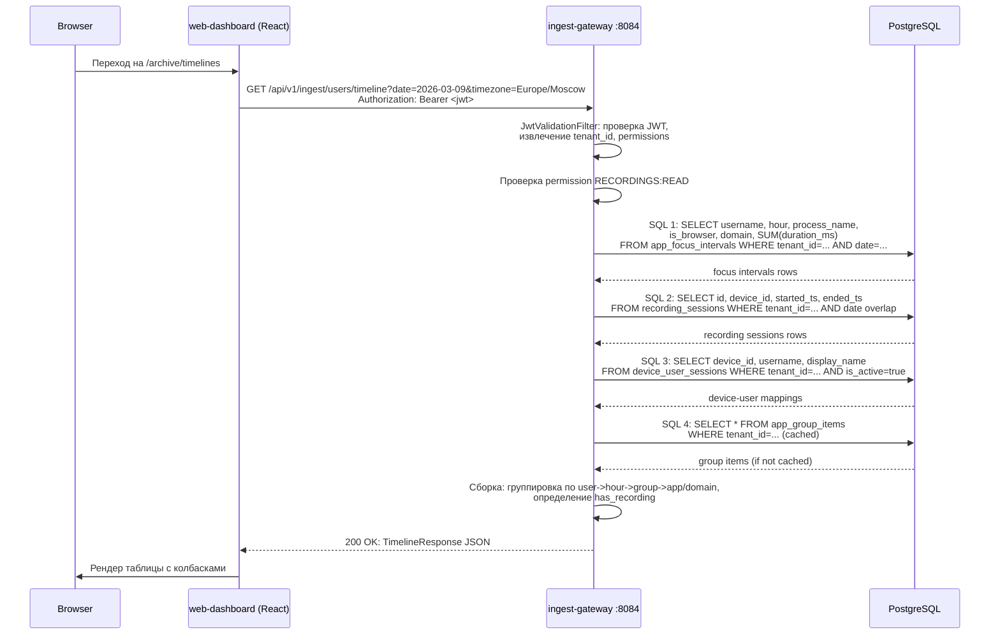
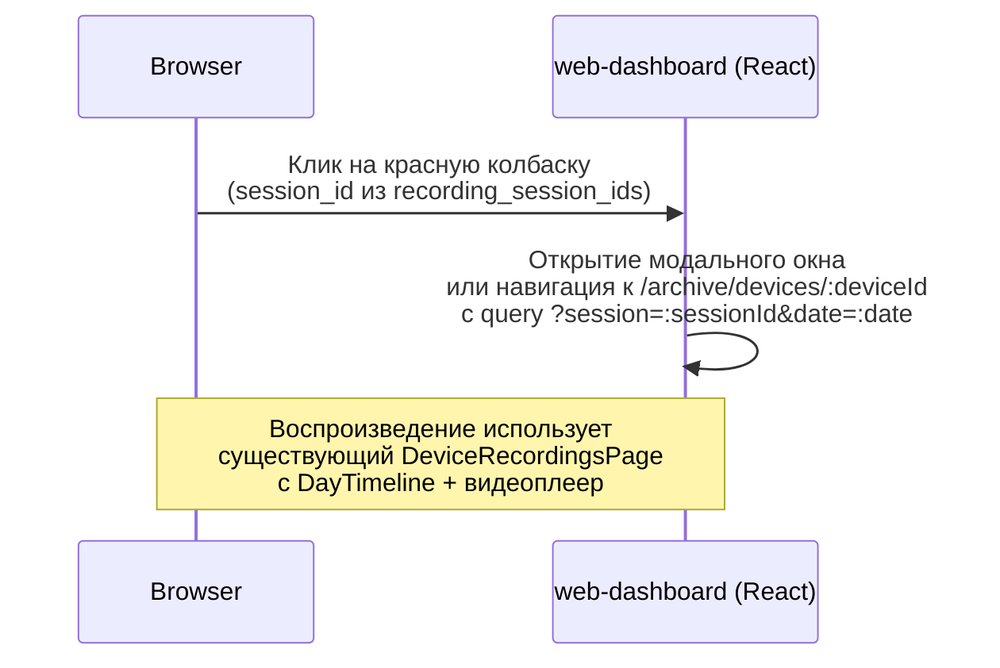

# Таймлайны активности пользователей + Favicon + Удаление Mail.ru OAuth

> **Версия:** 1.0
> **Дата:** 2026-03-09
> **Автор:** Системный аналитик
> **Статус:** Draft
> **Задача:** #20
> **Затронутые сервисы:** ingest-gateway, auth-service, web-dashboard
> **Миграция:** не требуется (используем существующие таблицы)

---

## Содержание

1. [Overview](#1-overview)
2. [Часть 1: Таймлайны активности пользователей](#2-часть-1-таймлайны-активности-пользователей)
3. [Модель данных](#3-модель-данных)
4. [API контракты](#4-api-контракты)
5. [Sequence Diagrams](#5-sequence-diagrams)
6. [Frontend: компонентная структура](#6-frontend-компонентная-структура)
7. [Часть 2: Sidebar spacing](#7-часть-2-sidebar-spacing)
8. [Часть 3: Favicon](#8-часть-3-favicon)
9. [Часть 4: Удаление Mail.ru OAuth](#9-часть-4-удаление-mailru-oauth)
10. [User Stories](#10-user-stories)
11. [Декомпозиция задач](#11-декомпозиция-задач)
12. [Риски и открытые вопросы](#12-риски-и-открытые-вопросы)

---

## 1. Overview

### 1.1 Цель

Четыре независимых изменения:

1. **Таймлайны** -- новая страница "Аналитика > Таймлайны" с иерархическим отображением активности пользователей по часам за выбранный период.
2. **Sidebar spacing** -- увеличить отступ между пунктом меню и его первым подпунктом.
3. **Favicon** -- заменить дефолтный vite.svg на брендовый Кадеро favicon.png.
4. **Удаление Mail.ru OAuth** -- полная очистка кода Mail.ru OAuth из auth-service и web-dashboard.

### 1.2 Scope

**В scope:**
- Новый backend endpoint `GET /api/v1/ingest/users/timeline` (ingest-gateway)
- Новая фронтенд-страница `TimelinesPage` + компоненты
- Маршрут `/archive/timelines` в React Router
- Подпункт "Таймлайны" в Sidebar (раздел "Аналитика")
- CSS-фикс sidebar spacing
- Замена favicon
- Удаление Mail.ru OAuth из auth-service (6 файлов) и web-dashboard (4 файла)

**Вне scope:**
- Yandex OAuth (не трогать)
- Новые миграции БД (все нужные таблицы уже есть)
- Изменения в Windows/macOS агентах
- Playback-service / search-service

---

## 2. Часть 1: Таймлайны активности пользователей

### 2.1 Визуальная концепция

Страница "Таймлайны" представляет собой таблицу:
- **Горизонтальная ось** -- часы дня (0:00 -- 24:00)
- **Вертикальная ось** -- пользователи (1-й уровень), группы приложений (2-й уровень), приложения (3-й уровень), группы сайтов/сайты (4-й уровень для браузеров)
- **Период** -- выбор конкретного дня из календаря; навигация "вперед/назад". По умолчанию -- сегодня.
- **Точность** -- 1 час (24 колонки)

### 2.2 Иерархия раскрытия

```
Уровень 1: Пользователь (username)
   |-- [серая колбаска] = период активности (focus intervals без записи)
   |-- [красная колбаска] = период активности + есть видеозапись (recording_sessions overlap)
   |
   |-- Уровень 2: Группа приложений (app_groups, group_type=APP)
   |     |-- Уровень 3: Конкретное приложение (process_name)
   |
   |-- Уровень 2: "Браузеры" (специальная группа: is_browser=true)
         |-- Уровень 3: Группа сайтов (app_groups, group_type=SITE)
               |-- Уровень 4: Конкретный сайт (domain)
```

### 2.3 Цветовая схема колбасок

| Состояние | Цвет | CSS class |
|-----------|------|-----------|
| Активность (только focus intervals) | Серый | `bg-gray-400` |
| Активность + видеозапись | Красный | `bg-red-600` |
| Активная (live) сессия | Красный + пульсация | `bg-red-600 animate-pulse` |

### 2.4 Интерактивность

- **Клик на пользователя** (строка) -- раскрывает/сворачивает 2-й уровень (группы приложений)
- **Клик на группу приложений** -- раскрывает/сворачивает 3-й уровень (конкретные приложения)
- **Клик на "Браузеры"** -- раскрывает группы сайтов (3-й уровень), клик на группу сайтов -- конкретные домены (4-й уровень)
- **Клик на красную колбаску** -- открывает модальное окно воспроизведения видеозаписи (ссылка на `DeviceRecordingsPage` с конкретной сессией)

---

## 3. Модель данных

### 3.1 Существующие таблицы (миграция НЕ требуется)

Все необходимые данные уже есть:

| Таблица | Назначение для таймлайнов |
|---------|---------------------------|
| `app_focus_intervals` | Основной источник -- интервалы фокуса с `process_name`, `is_browser`, `domain`, `started_at`, `ended_at`, `duration_ms` |
| `recording_sessions` | Для определения, есть ли видеозапись в конкретный час (`started_ts`, `ended_ts`, `device_id`, `tenant_id`) |
| `device_user_sessions` | Список пользователей tenant (`username`, `display_name`, `device_id`) |
| `app_groups` | Группы приложений (`group_type=APP`) и группы сайтов (`group_type=SITE`) |
| `app_group_items` | Привязка `process_name` / `domain` к группам (`pattern`, `match_type`) |
| `v_tenant_users` | View для списка пользователей с агрегацией |

### 3.2 Связь focus intervals с recording sessions

Для определения "красной колбаски" (есть видеозапись) необходимо проверить пересечение:

```sql
-- Для конкретного пользователя, дня и часа:
-- focus_interval.started_at попадает в час H..H+1
-- И существует recording_session с тем же device_id,
-- у которого started_ts <= конец часа AND (ended_ts IS NULL OR ended_ts >= начало часа)
```

### 3.3 Привязка приложений к группам

Используется таблица `app_group_items`:
- `match_type = 'EXACT'`: `process_name = pattern` (case-insensitive)
- `match_type = 'SUFFIX'`: `process_name ILIKE '%' || pattern`
- `match_type = 'CONTAINS'`: `process_name ILIKE '%' || pattern || '%'`

Если process_name не привязан ни к одной группе -- он попадает в "Неразмеченные".

---

## 4. API контракты

### 4.1 GET /api/v1/ingest/users/timeline

Новый endpoint в `UserActivityController` (ingest-gateway).

**Назначение:** Возвращает почасовую агрегацию активности всех пользователей tenant за указанный день с информацией о наличии видеозаписей.

**Request:**

```
GET /api/v1/ingest/users/timeline?date=2026-03-09&timezone=Europe/Moscow
Authorization: Bearer <jwt>
```

| Параметр | Тип | Обязательный | Default | Описание |
|----------|-----|-------------|---------|----------|
| `date` | string (YYYY-MM-DD) | нет | сегодня | День для отображения |
| `timezone` | string | нет | `Europe/Moscow` | Таймзона для агрегации по часам |
| `tenant_id` | UUID | нет | из JWT | Для SUPER_ADMIN с scope=global |

**Response (200 OK):**

```json
{
  "date": "2026-03-09",
  "timezone": "Europe/Moscow",
  "users": [
    {
      "username": "air911d\\shepaland",
      "display_name": "Шепелкин Алексей",
      "device_ids": ["64b4d56e-da7a-4ef5-b1b4-f1921c9969f1"],
      "hours": [
        {
          "hour": 9,
          "total_duration_ms": 3540000,
          "has_recording": true,
          "recording_session_ids": ["a1b2c3d4-..."],
          "app_groups": [
            {
              "group_id": "g1-uuid",
              "group_name": "Офисные",
              "color": "#4CAF50",
              "duration_ms": 2400000,
              "apps": [
                {
                  "process_name": "WINWORD.EXE",
                  "duration_ms": 1800000,
                  "has_recording": true
                },
                {
                  "process_name": "EXCEL.EXE",
                  "duration_ms": 600000,
                  "has_recording": true
                }
              ]
            },
            {
              "group_id": null,
              "group_name": "Браузеры",
              "color": "#2196F3",
              "duration_ms": 1140000,
              "is_browser_group": true,
              "site_groups": [
                {
                  "group_id": "sg1-uuid",
                  "group_name": "Рабочие сайты",
                  "color": "#009688",
                  "duration_ms": 900000,
                  "sites": [
                    {
                      "domain": "jira.company.ru",
                      "duration_ms": 600000,
                      "has_recording": true
                    },
                    {
                      "domain": "confluence.company.ru",
                      "duration_ms": 300000,
                      "has_recording": true
                    }
                  ]
                },
                {
                  "group_id": null,
                  "group_name": "Неразмеченные",
                  "color": "#9E9E9E",
                  "duration_ms": 240000,
                  "sites": [
                    {
                      "domain": "stackoverflow.com",
                      "duration_ms": 240000,
                      "has_recording": true
                    }
                  ]
                }
              ]
            },
            {
              "group_id": null,
              "group_name": "Неразмеченные",
              "color": "#9E9E9E",
              "duration_ms": 0,
              "apps": []
            }
          ]
        },
        {
          "hour": 10,
          "total_duration_ms": 1200000,
          "has_recording": false,
          "recording_session_ids": [],
          "app_groups": []
        }
      ]
    }
  ]
}
```

**Response TypeScript типы:**

```typescript
interface TimelineResponse {
  date: string;
  timezone: string;
  users: TimelineUser[];
}

interface TimelineUser {
  username: string;
  display_name: string | null;
  device_ids: string[];
  hours: TimelineHour[];
}

interface TimelineHour {
  hour: number; // 0-23
  total_duration_ms: number;
  has_recording: boolean;
  recording_session_ids: string[];
  app_groups: TimelineAppGroup[];
}

interface TimelineAppGroup {
  group_id: string | null; // null для "Неразмеченные" и "Браузеры"
  group_name: string;
  color: string;
  duration_ms: number;
  is_browser_group?: boolean; // true для виртуальной группы "Браузеры"
  apps?: TimelineApp[]; // для обычных групп
  site_groups?: TimelineSiteGroup[]; // для browser_group
}

interface TimelineApp {
  process_name: string;
  duration_ms: number;
  has_recording: boolean;
}

interface TimelineSiteGroup {
  group_id: string | null;
  group_name: string;
  color: string;
  duration_ms: number;
  sites: TimelineSite[];
}

interface TimelineSite {
  domain: string;
  duration_ms: number;
  has_recording: boolean;
}
```

**Ошибки:**

| Код | code | Описание |
|-----|------|----------|
| 400 | `INVALID_DATE` | Невалидный формат даты |
| 400 | `INVALID_TIMEZONE` | Невалидная таймзона |
| 401 | `UNAUTHORIZED` | Нет/невалидный JWT |
| 403 | `INSUFFICIENT_PERMISSIONS` | Нет пермишена `RECORDINGS:READ` |

**Permissions:** `RECORDINGS:READ`

### 4.2 Производительность endpoint

Для 10,000 устройств с ~50 пользователями на тенант, запрос за 1 день:

**SQL-стратегия:** Выполнить 3 запроса:

1. **Focus intervals агрегация по пользователю + часу:**
```sql
SELECT 
    username,
    EXTRACT(HOUR FROM started_at AT TIME ZONE :tz) AS hour,
    process_name,
    is_browser,
    domain,
    SUM(duration_ms) AS total_duration_ms
FROM app_focus_intervals
WHERE tenant_id = :tenantId
  AND started_at >= CAST(:date AS date) AT TIME ZONE :tz
  AND started_at < (CAST(:date AS date) + INTERVAL '1 day') AT TIME ZONE :tz
GROUP BY username, hour, process_name, is_browser, domain
ORDER BY username, hour, total_duration_ms DESC;
```

2. **Recording sessions за день:**
```sql
SELECT 
    rs.id AS session_id,
    rs.device_id,
    rs.started_ts,
    rs.ended_ts
FROM recording_sessions rs
WHERE rs.tenant_id = :tenantId
  AND rs.started_ts < (CAST(:date AS date) + INTERVAL '1 day') AT TIME ZONE :tz
  AND (rs.ended_ts IS NULL OR rs.ended_ts >= CAST(:date AS date) AT TIME ZONE :tz)
  AND rs.status IN ('active', 'completed');
```

3. **Маппинг device -> username:**
```sql
SELECT device_id, username, display_name
FROM device_user_sessions
WHERE tenant_id = :tenantId AND is_active = true;
```

**Сборка в Java:** Сервис выполняет 3 запроса, затем в памяти:
- Группирует focus intervals по пользователю -> час -> process_name/domain
- Для каждого часа определяет наличие recording_session (пересечение device_id + временной интервал)
- Привязывает process_name к app_groups через app_group_items (с кэшированием маппинга)
- Привязывает domain к site_groups через app_group_items (group_type=SITE)

**Индексы:** Используются существующие:
- `idx_afi_tenant_user_started` -- для запроса 1
- Индекс на `recording_sessions(tenant_id, started_ts)` -- для запроса 2
- `idx_dus_device_user_active` -- для запроса 3

**Оценка времени:** < 500ms для 50 пользователей, ~2000 focus intervals за день.

### 4.3 Кэширование маппинга групп

Маппинг `process_name -> group` и `domain -> site_group` кэшируется на уровне сервиса:
- Загрузка всех `app_group_items` для tenant при первом вызове
- Инвалидация при изменении каталогов (по tenant_id)
- TTL: 5 минут (приемлемо для справочных данных)

---

## 5. Sequence Diagrams

### 5.1 Загрузка страницы таймлайнов



### 5.2 Клик на красную колбаску (воспроизведение)



---

## 6. Frontend: компонентная структура

### 6.1 Новые файлы

```
web-dashboard/src/
├── pages/
│   └── TimelinesPage.tsx              -- Страница таймлайнов
├── components/
│   └── timelines/
│       ├── TimelineTable.tsx           -- Основная таблица
│       ├── TimelineRow.tsx             -- Строка пользователя (Level 1)
│       ├── TimelineBar.tsx             -- Колбаска активности (серая/красная)
│       ├── TimelineAppGroupRow.tsx     -- Строка группы приложений (Level 2)
│       ├── TimelineAppRow.tsx          -- Строка приложения (Level 3)
│       ├── TimelineSiteGroupRow.tsx    -- Строка группы сайтов (Level 3 для браузеров)
│       ├── TimelineSiteRow.tsx         -- Строка сайта (Level 4)
│       └── TimelineDatePicker.tsx      -- Выбор даты + навигация
├── api/
│   └── user-activity.ts               -- +функция getTimeline()
├── types/
│   └── user-activity.ts               -- +типы Timeline*
```

### 6.2 TimelinesPage.tsx

```
┌──────────────────────────────────────────────────────────────┐
│  Таймлайны                              [< 08.03] [09.03] [>]│
├──────────────────────────────────────────────────────────────┤
│  Пользователь  │ 00 01 02 03 04 05 06 07 08 09 10 ... 23   │
│  ─────────────────────────────────────────────────────────── │
│  ▶ shepaland   │        [====][========████═══]              │
│    Офисные     │             [██████]                        │
│      WINWORD   │             [████]                          │
│      EXCEL     │                  [██]                       │
│    Браузеры    │                      [████]                 │
│      Рабочие   │                      [███]                  │
│        jira.co │                      [██]                   │
│      Неразм.   │                          [█]                │
│  ▶ ivanov      │                [═══════]                    │
│  ...           │                                             │
└──────────────────────────────────────────────────────────────┘

Легенда: ═══ серый (активность), ███ красный (есть видеозапись)
```

### 6.3 Компонент TimelineBar

Колбаска отображается как `div` с абсолютным позиционированием внутри ячейки часа:
- Ширина пропорциональна `duration_ms / 3600000` (доля часа)
- Серый если `has_recording = false`
- Красный если `has_recording = true`
- При `total_duration_ms > 0` для часа -- колбаска занимает весь час (для упрощения визуализации на уровне часов)

### 6.4 Интеграция с роутингом

**App.tsx:**
```tsx
<Route path="/archive/timelines" element={<TimelinesPage />} />
```

**Sidebar.tsx** -- добавить в `archiveSubmenu`:
```tsx
const archiveSubmenu: NavItem[] = [
  { name: 'Устройства', href: '/archive/devices', icon: ComputerDesktopIcon },
  { name: 'Пользователи', href: '/archive/users', icon: UserGroupIcon },
  { name: 'Таймлайны', href: '/archive/timelines', icon: ClockIcon },  // NEW
];
```

### 6.5 API функция

**api/user-activity.ts** -- новая функция:
```typescript
export async function getTimeline(
  date: string,
  timezone?: string,
): Promise<TimelineResponse> {
  const { data } = await ingestApiClient.get<TimelineResponse>('/users/timeline', {
    params: { date, timezone: timezone ?? 'Europe/Moscow' },
  });
  return data;
}
```

---

## 7. Часть 2: Sidebar spacing

### 7.1 Проблема

В `Sidebar.tsx` отступ между заголовком раскрывающегося меню ("Аналитика", "Настройки") и первым подпунктом меньше, чем отступ между подпунктами.

### 7.2 Причина

В компоненте `NavList` используется `space-y-1` для списка подпунктов, но между кнопкой-заголовком и `<NavList>` нет аналогичного отступа.

### 7.3 Решение

Добавить `mt-1` (или `pt-1`) к блоку подменю, чтобы верхний отступ совпадал с `space-y-1`:

**Текущий код (строки 188-190, 323-325):**
```tsx
{isArchiveExpanded && (
  <NavList items={archiveSubmenu} onClick={handleClick} indent />
)}
```

**Исправленный код:**
```tsx
{isArchiveExpanded && (
  <div className="mt-1">
    <NavList items={archiveSubmenu} onClick={handleClick} indent />
  </div>
)}
```

Аналогично для `isSettingsExpanded` блоков (строки 212-214, 347-349).

### 7.4 Затрагиваемый файл

- `web-dashboard/src/components/Sidebar.tsx` -- 4 места (2x Аналитика, 2x Настройки, для SuperAdmin и OAuth layout)

---

## 8. Часть 3: Favicon

### 8.1 Текущее состояние

- `web-dashboard/index.html` строка 5: `<link rel="icon" type="image/svg+xml" href="/vite.svg" />`
- `web-dashboard/public/vite.svg` -- дефолтный Vite логотип
- `assets/favicon.png` -- брендовый значок Кадеро (красная буква "К" на чёрном фоне)

### 8.2 Решение

1. Скопировать `assets/favicon.png` в `web-dashboard/public/favicon.png`
2. Изменить `web-dashboard/index.html`:

```html
<!-- Было: -->
<link rel="icon" type="image/svg+xml" href="/vite.svg" />

<!-- Стало: -->
<link rel="icon" type="image/png" href="/screenrecorder/favicon.png" />
```

Важно: путь должен содержать `base` (`/screenrecorder/`), так как Vite `base: '/screenrecorder/'`.

Альтернативный вариант -- использовать относительный путь или template literal:
```html
<link rel="icon" type="image/png" href="favicon.png" />
```
Vite автоматически добавит `base` при сборке для файлов в `public/`.

3. Удалить `web-dashboard/public/vite.svg` (необязательно, но чисто).

### 8.3 Затрагиваемые файлы

- `web-dashboard/index.html`
- `web-dashboard/public/favicon.png` (новый файл, копия из `assets/favicon.png`)
- `web-dashboard/public/vite.svg` (удалить)

---

## 9. Часть 4: Удаление Mail.ru OAuth

### 9.1 Инвентаризация кода Mail.ru

#### auth-service (Java backend)

| Файл | Описание | Действие |
|------|----------|----------|
| `auth-service/src/main/java/com/prg/auth/config/MailruOAuthConfig.java` | ConfigurationProperties для Mail.ru | **Удалить файл** |
| `auth-service/src/main/java/com/prg/auth/service/MailruOAuthClient.java` | REST-клиент для Mail.ru API | **Удалить файл** |
| `auth-service/src/main/java/com/prg/auth/service/OAuthService.java` | Содержит `MailruOAuthClient` dependency, `PROVIDER_MAILRU`, `getMailruAuthorizationUrl()`, `handleMailruCallback()` | **Удалить** зависимость и Mail.ru методы |
| `auth-service/src/main/java/com/prg/auth/controller/OAuthController.java` | Содержит `MailruOAuthConfig` dependency, endpoints `/mailru`, `/mailru/callback` | **Удалить** Mail.ru endpoints и dependency |
| `auth-service/src/main/java/com/prg/auth/config/SecurityConfig.java` | Строки 59-60: permit `/api/v1/auth/oauth/mailru` и `/api/v1/auth/oauth/mailru/callback` | **Удалить** эти 2 строки |
| `auth-service/src/main/resources/application.yml` | Строки 93-101: блок `mailru:` с client-id, client-secret, urls, enabled | **Удалить** блок |
| `auth-service/src/test/java/com/prg/auth/service/MailruOAuthClientTest.java` | Unit-тест | **Удалить файл** |
| `auth-service/src/test/java/com/prg/auth/service/OAuthServiceTest.java` | Может содержать Mail.ru тесты | **Удалить** Mail.ru тесты, оставить Yandex |

#### web-dashboard (React frontend)

| Файл | Описание | Действие |
|------|----------|----------|
| `web-dashboard/src/api/auth.ts` | Функция `getMailruOAuthLoginUrl()` (строки 70-73) | **Удалить** функцию |
| `web-dashboard/src/pages/LoginPage.tsx` | Импорт `getMailruOAuthLoginUrl`, функция `handleMailruLogin`, кнопка "Войти через Mail.ru" (строки 4, 221-223, 472-482) | **Удалить** импорт, функцию, кнопку |
| `web-dashboard/src/pages/OAuthLoginPage.tsx` | Импорт `getMailruOAuthLoginUrl`, функция `handleMailruLogin`, кнопка "Войти через Mail.ru" (строки 2, 21-23, 55-65) | **Удалить** импорт, функцию, кнопку |
| `web-dashboard/src/components/catalogs/AddItemModal.tsx` | Ложное срабатывание grep -- "mail.ru" в примере email-адреса | **Не трогать** |

#### Конфигурация деплоя

| Файл | Описание | Действие |
|------|----------|----------|
| Kubernetes secrets/env | `MAILRU_OAUTH_CLIENT_ID`, `MAILRU_OAUTH_CLIENT_SECRET`, `MAILRU_OAUTH_CALLBACK_URL`, `MAILRU_OAUTH_ENABLED` | **Удалить** из k8s manifests |

### 9.2 Детальный план удаления

#### 9.2.1 OAuthService.java -- изменения

**Удалить:**
- Поле `private final MailruOAuthClient mailruClient;` (строка 39)
- Поле `private final MailruOAuthConfig mailruOAuthConfig;` (строка 46)
- Константу `public static final String PROVIDER_MAILRU = "mailru";` (строка 52)
- Метод `getMailruAuthorizationUrl()` (строки 75-83)
- Метод `handleMailruCallback()` (строки 122-149)

**Оставить:**
- `PROVIDER_YANDEX`
- `getAuthorizationUrl()` (Yandex)
- `handleCallback()` (Yandex)
- Все общие методы: `processOAuthCallback()`, `performOAuthLogin()`, `generateOAuthIntermediateToken()`, etc.

#### 9.2.2 OAuthController.java -- изменения

**Удалить:**
- Поле `private final MailruOAuthConfig mailruOAuthConfig;` (строка 43)
- Весь блок "Mail.ru OAuth" (строки 82-122): endpoints `initiateMailruOAuth()` и `handleMailruCallback()`
- В `processOAuthCallback()` (строка 161-163): убрать ветку `if ("mailru".equals(provider))`

**Упростить `processOAuthCallback()`:**
```java
// Было:
if ("mailru".equals(provider)) {
    result = oauthService.handleMailruCallback(code, state, ipAddress, userAgent);
} else {
    result = oauthService.handleCallback(code, state, ipAddress, userAgent);
}

// Стало:
result = oauthService.handleCallback(code, state, ipAddress, userAgent);
```

Параметр `provider` в `processOAuthCallback` можно убрать (всегда "yandex"), или оставить для расширяемости.

#### 9.2.3 SecurityConfig.java -- изменения

Удалить 2 строки из permitAll:
```java
"/api/v1/auth/oauth/mailru",
"/api/v1/auth/oauth/mailru/callback",
```

#### 9.2.4 application.yml -- изменения

Удалить блок:
```yaml
    mailru:
      client-id: ${MAILRU_OAUTH_CLIENT_ID:}
      client-secret: ${MAILRU_OAUTH_CLIENT_SECRET:}
      authorize-url: https://oauth.mail.ru/login
      token-url: https://oauth.mail.ru/token
      user-info-url: https://oauth.mail.ru/userinfo
      callback-url: ${MAILRU_OAUTH_CALLBACK_URL:}
      scope: userinfo
      enabled: ${MAILRU_OAUTH_ENABLED:false}
```

### 9.3 Обратная совместимость

- Существующие пользователи с `provider='mailru'` в `oauth_identities` останутся в БД, но не смогут войти через Mail.ru
- Их `UserOAuthLink` записи останутся, но поскольку endpoint удалён, новых OAuth-логинов через Mail.ru не будет
- Если пользователь вошёл только через Mail.ru и не имеет другого способа входа -- он потеряет доступ. Это ожидаемое поведение (Mail.ru OAuth так и не прошёл модерацию o2.mail.ru)
- Миграция БД НЕ требуется -- данные в `oauth_identities` безвредны

### 9.4 Задача в трекере

T-029 ("Kubernetes: env variables MAILRU_OAUTH_*") -- пометить как `Cancelled`.

---

## 10. User Stories

### US-1: Таймлайны -- просмотр общей активности
**Как** администратор тенанта, **я хочу** видеть почасовую активность всех пользователей за день, **чтобы** быстро оценить присутствие и загруженность сотрудников.

**Acceptance Criteria:**
- [ ] Страница доступна по маршруту `/archive/timelines`
- [ ] Подпункт "Таймлайны" виден в Sidebar > Аналитика
- [ ] По умолчанию показывается сегодняшний день
- [ ] Есть навигация "назад/вперед" по дням и выбор даты
- [ ] Каждый пользователь -- отдельная строка с 24 часовыми слотами
- [ ] Серые колбаски = активность без записи, красные = с записью

### US-2: Таймлайны -- иерархическое раскрытие
**Как** администратор, **я хочу** кликнуть на строку пользователя и увидеть группы приложений, **чтобы** понять чем занимался сотрудник.

**Acceptance Criteria:**
- [ ] Клик на пользователя раскрывает Level 2: группы приложений
- [ ] Клик на группу раскрывает Level 3: конкретные приложения
- [ ] Для браузеров Level 3: группы сайтов, Level 4: конкретные домены
- [ ] Неразмеченные приложения/сайты показываются в группе "Неразмеченные"

### US-3: Таймлайны -- навигация к видеозаписи
**Как** администратор, **я хочу** кликнуть на красную колбаску и посмотреть видеозапись, **чтобы** увидеть что именно делал сотрудник.

**Acceptance Criteria:**
- [ ] Клик на красную колбаску открывает модальное окно или переходит на DeviceRecordingsPage
- [ ] Передаётся session_id и дата для автоматического позиционирования
- [ ] Если recording_session_ids пуст (серая колбаска) -- клик не открывает видео

### US-4: Sidebar spacing
**Как** пользователь, **я хочу** чтобы отступы в меню были одинаковыми, **чтобы** интерфейс выглядел аккуратно.

**Acceptance Criteria:**
- [ ] Отступ между "Аналитика" и первым подпунктом "Устройства" равен отступу между "Устройства" и "Пользователи"
- [ ] Аналогично для "Настройки" и его подпунктов
- [ ] Работает для обоих layouts (SuperAdmin и OAuth user)

### US-5: Favicon
**Как** пользователь, **я хочу** видеть иконку Кадеро во вкладке браузера, **чтобы** легко найти нужную вкладку.

**Acceptance Criteria:**
- [ ] Во вкладке браузера отображается красная "К" на чёрном фоне
- [ ] Файл favicon.png корректно загружается и на test, и на prod (с path `/screenrecorder/`)
- [ ] Дефолтный vite.svg больше не отображается

### US-6: Удаление Mail.ru OAuth
**Как** разработчик, **я хочу** убрать неработающий Mail.ru OAuth, **чтобы** упростить кодовую базу и убрать мёртвый код.

**Acceptance Criteria:**
- [ ] Кнопка "Войти через Mail.ru" убрана со страниц LoginPage и OAuthLoginPage
- [ ] Backend endpoints `/api/v1/auth/oauth/mailru` и `/mailru/callback` удалены
- [ ] Файлы MailruOAuthConfig.java, MailruOAuthClient.java, MailruOAuthClientTest.java удалены
- [ ] SecurityConfig не содержит Mail.ru paths в permitAll
- [ ] application.yml не содержит блок `mailru:`
- [ ] Yandex OAuth продолжает работать без изменений
- [ ] Приложение компилируется без ошибок

---

## 11. Декомпозиция задач

### Backend (ingest-gateway)

| ID | Тип | Заголовок | Приоритет | Описание |
|----|-----|-----------|-----------|----------|
| T-142 | Task | Backend: endpoint GET /users/timeline в UserActivityController | High | Новый endpoint для почасовой агрегации активности пользователей с иерархией групп приложений/сайтов |
| T-143 | Task | Backend: TimelineService с SQL-агрегацией и кэшированием маппинга групп | High | Сервис с 3 SQL-запросами + in-memory сборка + кэш app_group_items |
| T-144 | Task | Backend: DTO TimelineResponse + вложенные модели | Medium | Java records/classes для ответа endpoint |

### Backend (auth-service)

| ID | Тип | Заголовок | Приоритет | Описание |
|----|-----|-----------|-----------|----------|
| T-145 | Task | Удалить Mail.ru OAuth из auth-service | High | Удалить MailruOAuthConfig, MailruOAuthClient, endpoints в OAuthController, методы в OAuthService, SecurityConfig paths, application.yml блок, тесты |

### Frontend (web-dashboard)

| ID | Тип | Заголовок | Приоритет | Описание |
|----|-----|-----------|-----------|----------|
| T-146 | Task | Frontend: страница TimelinesPage + компоненты таймлайна | High | TimelineTable, TimelineRow, TimelineBar, иерархические подуровни, DatePicker |
| T-147 | Task | Frontend: типы Timeline* + API функция getTimeline() | High | TypeScript типы и axios-вызов |
| T-148 | Task | Frontend: маршрут /archive/timelines + подпункт Sidebar | Medium | Route в App.tsx, NavItem в Sidebar archiveSubmenu |
| T-149 | Task | Frontend: модальное окно воспроизведения при клике на красную колбаску | Medium | Навигация к DeviceRecordingsPage или встроенный modal с видеоплеером |
| T-150 | Task | Frontend: sidebar spacing -- увеличить отступ между пунктом и первым подпунктом | Low | Добавить mt-1 к подменю Аналитика и Настройки (4 места) |
| T-151 | Task | Frontend: заменить favicon на Кадеро | Low | Копировать favicon.png в public/, обновить index.html, удалить vite.svg |
| T-152 | Task | Frontend: удалить Mail.ru OAuth из LoginPage, OAuthLoginPage, auth.ts | High | Убрать кнопки "Войти через Mail.ru", функцию getMailruOAuthLoginUrl, импорты |

### Тестирование

| ID | Тип | Заголовок | Приоритет | Описание |
|----|-----|-----------|-----------|----------|
| T-153 | Task | Тестирование: проверка endpoint /users/timeline с реальными данными | High | Функциональный тест на test-стейджинге |
| T-154 | Task | Тестирование: Yandex OAuth после удаления Mail.ru | High | Убедиться что Yandex OAuth по-прежнему работает |

---

## 12. Риски и открытые вопросы

### 12.1 Решённые вопросы

| Вопрос | Решение |
|--------|---------|
| Нужна ли новая миграция? | Нет -- все таблицы уже есть (V29, V31) |
| Как определить наличие записи в часе? | JOIN recording_sessions по device_id + временному пересечению |
| Как привязать process_name к группе? | Через app_group_items (загрузка всех items для tenant, кэш 5мин) |

### 12.2 Открытые вопросы

| # | Вопрос | Влияние | Предложение |
|---|--------|---------|-------------|
| 1 | При клике на красную колбаску -- открывать модальное окно или навигировать на DeviceRecordingsPage? | UX | Навигация на `/archive/devices/:deviceId?session=:sessionId&date=:date` -- проще в реализации, переиспользует существующий плеер |
| 2 | Если у пользователя несколько устройств, показывать суммарно или раздельно? | UX/API | Суммарно на уровне пользователя, device_ids в ответе для навигации к записи. При наличии записи на нескольких устройствах -- recording_session_ids содержит все ID |
| 3 | Лимит пользователей на странице? | Performance | Первые 50 пользователей, пагинация не нужна (tenant обычно имеет 20-50 пользователей). При необходимости добавить scroll |
| 4 | Нужен ли поиск по пользователям на странице таймлайнов? | UX | V1 без поиска, добавить в V2 при необходимости |
| 5 | Favicon -- нужна ли также apple-touch-icon и другие размеры? | Полнота | V1 только favicon.png, расширить позже |

### 12.3 Зависимости

- Таймлайны зависят от справочников (app_groups, V31 миграция) -- должна быть применена на test
- Таймлайны зависят от focus intervals (V29 миграция) -- уже применена на test
- Удаление Mail.ru OAuth независимо от остальных задач
- Favicon и sidebar spacing независимы

### 12.4 Порядок реализации

1. **Favicon** (T-136) -- минимальные изменения, деплоить сразу
2. **Sidebar spacing** (T-135) -- минимальные изменения
3. **Удаление Mail.ru OAuth** (T-130, T-137) -- независимо от таймлайнов
4. **Backend timeline endpoint** (T-127, T-128, T-129) -- основная работа
5. **Frontend таймлайны** (T-131, T-132, T-133, T-134) -- после backend
6. **Тестирование** (T-138, T-139)
