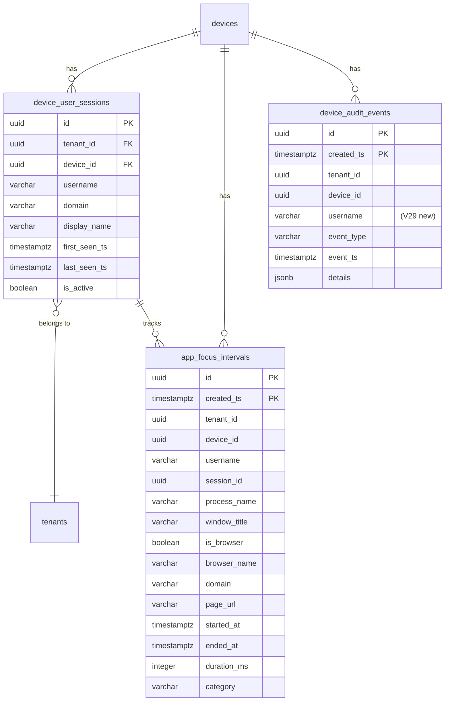
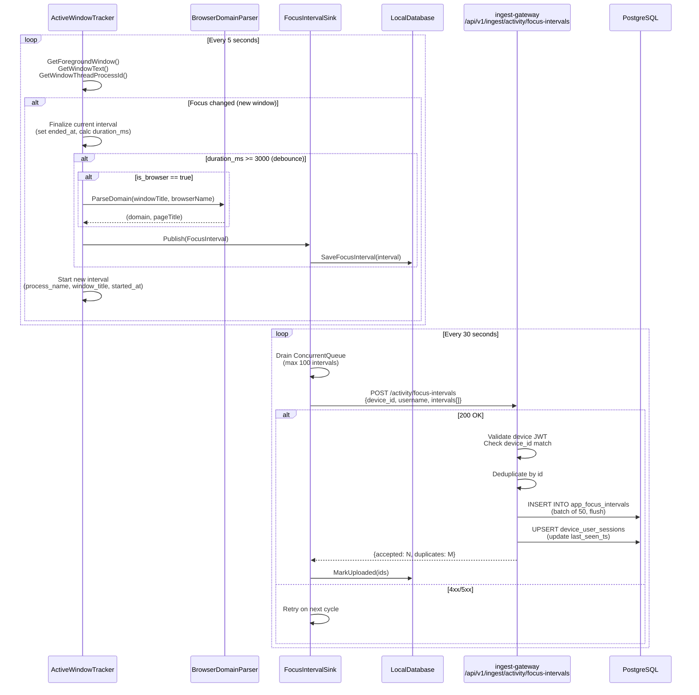
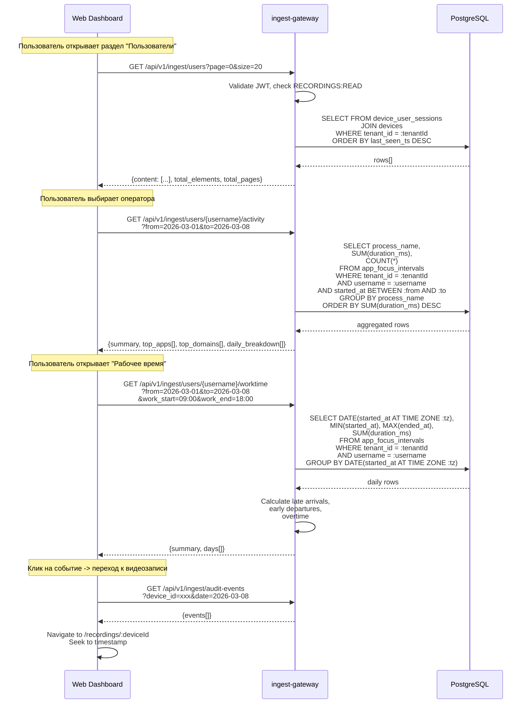
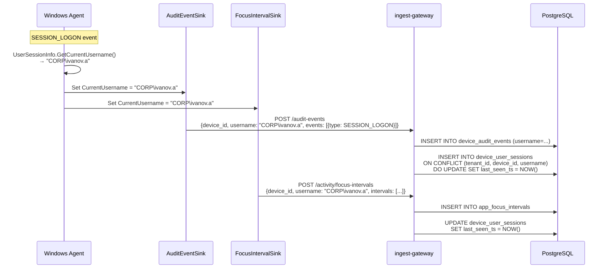

# User Activity Tracking -- техническая спецификация

> **Версия:** 1.0  
> **Дата:** 2026-03-08  
> **Автор:** Системный аналитик  
> **Статус:** Draft  
> **Затронутые сервисы:** windows-agent-csharp, ingest-gateway, web-dashboard  
> **Миграция:** V29  

---

## 1. Overview

### 1.1 Цель

Расширить платформу Кадеро системой обогащения данных для мониторинга активности операторов контактного центра. Система должна собирать:

1. **Имя пользователя Windows** -- кто залогинен на устройстве
2. **Активное приложение в фокусе** -- какое окно/приложение активно, с длительностью
3. **Посещаемые веб-домены через браузеры** -- какие сайты посещает оператор (парсинг из заголовка окна браузера)

Собранные данные используются для построения аналитических отчетов в Web UI: рабочее время, время по приложениям, время по доменам, табель учета.

### 1.2 Scope

- **В scope:** Сбор данных агентом, хранение в PostgreSQL, API для аналитики, новые страницы Web UI
- **Вне scope:** MITM-перехват трафика, анализ содержимого страниц, DLP, мониторинг нажатий клавиш

### 1.3 Ключевые решения

| Решение | Обоснование |
|---------|-------------|
| Отдельная таблица `app_focus_intervals` вместо расширения `device_audit_events` | Фокус-события генерируются непрерывно с высокой частотой (каждые 5--15 сек). Смешивание с редкими audit-событиями (lock/unlock/process) создаст дисбаланс и усложнит запросы. Отдельная таблица позволяет независимое партиционирование и оптимальные индексы для агрегатных запросов. |
| Интервальная модель (started_at + ended_at + duration_ms) вместо парных событий FOCUS_START/FOCUS_END | Упрощает агрегатные запросы (SUM, GROUP BY). Агент вычисляет интервал локально -- если связь потеряна, интервал сохраняется в SQLite и отправляется позже. Парные события требовали бы серверного join, что дорого при 10 000 устройств. |
| Поле `username` добавляется в `SubmitAuditEventsRequest` (top-level) И в `app_focus_intervals` | Username не меняется в рамках сессии. Передача на уровне батча (а не на каждом событии) экономит трафик. В таблице хранится денормализованно для быстрых запросов без JOIN. |
| Домены извлекаются из заголовка окна браузера, а не через сетевой перехват | Нулевой overhead, не требует прав администратора сверх уже имеющихся. Покрывает 90%+ реальных сценариев. Ненадежность парсинга документирована в секции рисков. |
| Отдельная таблица `device_user_sessions` для привязки username к устройству и периоду | Позволяет строить аналитику "по пользователю" без сканирования всех событий. |

---

## 2. Data Model (DDL)

### 2.1 Миграция V29

Файл: `auth-service/src/main/resources/db/migration/V29__user_activity_tracking.sql`

```sql
-- V29__user_activity_tracking.sql
-- User activity tracking: focus intervals, browser domains, device user sessions

-- =====================================================
-- 2.1.1 Таблица device_user_sessions
-- Связывает Windows username с device_id и периодом
-- =====================================================

CREATE TABLE device_user_sessions (
    id              UUID            NOT NULL DEFAULT gen_random_uuid(),
    tenant_id       UUID            NOT NULL,
    device_id       UUID            NOT NULL REFERENCES devices(id),
    username        VARCHAR(256)    NOT NULL,  -- Windows username (DOMAIN\user или user@domain)
    domain          VARCHAR(256),              -- Windows domain (WORKGROUP, CORP.LOCAL, etc.)
    display_name    VARCHAR(512),              -- Full display name (if available)
    first_seen_ts   TIMESTAMPTZ     NOT NULL DEFAULT NOW(),
    last_seen_ts    TIMESTAMPTZ     NOT NULL DEFAULT NOW(),
    is_active       BOOLEAN         NOT NULL DEFAULT true,
    created_ts      TIMESTAMPTZ     NOT NULL DEFAULT NOW(),
    updated_ts      TIMESTAMPTZ     NOT NULL DEFAULT NOW(),

    PRIMARY KEY (id)
);

-- Unique constraint: one active record per device+username
CREATE UNIQUE INDEX idx_dus_device_user_active
    ON device_user_sessions (tenant_id, device_id, username)
    WHERE is_active = true;

-- Query by tenant+username (for user list page)
CREATE INDEX idx_dus_tenant_username
    ON device_user_sessions (tenant_id, username, last_seen_ts DESC);

-- Query by tenant (for paginated user list)
CREATE INDEX idx_dus_tenant_last_seen
    ON device_user_sessions (tenant_id, last_seen_ts DESC);


-- =====================================================
-- 2.1.2 Таблица app_focus_intervals (партиционированная)
-- Непрерывный трекинг активного окна
-- =====================================================

CREATE TABLE app_focus_intervals (
    id              UUID            NOT NULL DEFAULT gen_random_uuid(),
    created_ts      TIMESTAMPTZ     NOT NULL DEFAULT NOW(),
    tenant_id       UUID            NOT NULL,
    device_id       UUID            NOT NULL,
    username        VARCHAR(256)    NOT NULL,
    session_id      UUID,                      -- recording session ID (nullable)

    -- Application info
    process_name    VARCHAR(512)    NOT NULL,   -- e.g. "chrome.exe", "1cv8.exe"
    window_title    VARCHAR(2048)   NOT NULL DEFAULT '',

    -- Browser-specific (null for non-browser apps)
    is_browser      BOOLEAN         NOT NULL DEFAULT false,
    browser_name    VARCHAR(100),               -- "Chrome", "Firefox", "Edge", "Opera", etc.
    domain          VARCHAR(512),               -- extracted domain: "google.com", "mail.ru"
    page_url        VARCHAR(4096),              -- full URL (optional, from title if available)

    -- Time interval
    started_at      TIMESTAMPTZ     NOT NULL,
    ended_at        TIMESTAMPTZ,               -- null = still in focus
    duration_ms     INTEGER         NOT NULL DEFAULT 0
        CHECK (duration_ms >= 0),

    -- Categorization (for future use: productive/unproductive/neutral)
    category        VARCHAR(50)     NOT NULL DEFAULT 'uncategorized',

    correlation_id  UUID,

    PRIMARY KEY (id, created_ts)
) PARTITION BY RANGE (created_ts);

-- Monthly partitions for 2026 (March onwards since V29 deploys in March 2026)
CREATE TABLE app_focus_intervals_2026_03 PARTITION OF app_focus_intervals FOR VALUES FROM ('2026-03-01') TO ('2026-04-01');
CREATE TABLE app_focus_intervals_2026_04 PARTITION OF app_focus_intervals FOR VALUES FROM ('2026-04-01') TO ('2026-05-01');
CREATE TABLE app_focus_intervals_2026_05 PARTITION OF app_focus_intervals FOR VALUES FROM ('2026-05-01') TO ('2026-06-01');
CREATE TABLE app_focus_intervals_2026_06 PARTITION OF app_focus_intervals FOR VALUES FROM ('2026-06-01') TO ('2026-07-01');
CREATE TABLE app_focus_intervals_2026_07 PARTITION OF app_focus_intervals FOR VALUES FROM ('2026-07-01') TO ('2026-08-01');
CREATE TABLE app_focus_intervals_2026_08 PARTITION OF app_focus_intervals FOR VALUES FROM ('2026-08-01') TO ('2026-09-01');
CREATE TABLE app_focus_intervals_2026_09 PARTITION OF app_focus_intervals FOR VALUES FROM ('2026-09-01') TO ('2026-10-01');
CREATE TABLE app_focus_intervals_2026_10 PARTITION OF app_focus_intervals FOR VALUES FROM ('2026-10-01') TO ('2026-11-01');
CREATE TABLE app_focus_intervals_2026_11 PARTITION OF app_focus_intervals FOR VALUES FROM ('2026-11-01') TO ('2026-12-01');
CREATE TABLE app_focus_intervals_2026_12 PARTITION OF app_focus_intervals FOR VALUES FROM ('2026-12-01') TO ('2027-01-01');

-- Indexes for app_focus_intervals

-- Primary query: user activity by date range
CREATE INDEX idx_afi_tenant_user_started
    ON app_focus_intervals (tenant_id, username, started_at DESC, created_ts);

-- Device-specific queries (existing device recordings page)
CREATE INDEX idx_afi_device_started
    ON app_focus_intervals (device_id, started_at DESC, created_ts);

-- App usage analytics: group by process_name
CREATE INDEX idx_afi_tenant_user_process
    ON app_focus_intervals (tenant_id, username, process_name, started_at DESC, created_ts);

-- Domain analytics: group by domain (only for browser intervals)
CREATE INDEX idx_afi_tenant_user_domain
    ON app_focus_intervals (tenant_id, username, domain, started_at DESC, created_ts)
    WHERE is_browser = true;

-- Deduplication
CREATE UNIQUE INDEX idx_afi_id_unique
    ON app_focus_intervals (id, created_ts);


-- =====================================================
-- 2.1.3 Расширение device_audit_events
-- Добавить новые event_type, расширить CHECK constraint
-- =====================================================

-- Расширить CHECK constraint на event_type для поддержки новых типов.
-- PostgreSQL не поддерживает ALTER ... DROP/ADD CHECK на партиционированных таблицах через ALTER CONSTRAINT.
-- Стратегия: DROP старый CHECK, ADD новый.

ALTER TABLE device_audit_events DROP CONSTRAINT IF EXISTS device_audit_events_event_type_check;

ALTER TABLE device_audit_events ADD CONSTRAINT device_audit_events_event_type_check
    CHECK (event_type IN (
        'SESSION_LOCK', 'SESSION_UNLOCK',
        'SESSION_LOGON', 'SESSION_LOGOFF',
        'PROCESS_START', 'PROCESS_STOP',
        'USER_LOGON', 'USER_LOGOFF'
    ));

-- Добавить колонку username в device_audit_events (опционально, для обогащения)
ALTER TABLE device_audit_events ADD COLUMN IF NOT EXISTS username VARCHAR(256);

-- Index для запросов по username в device_audit_events
CREATE INDEX IF NOT EXISTS idx_dae_tenant_username
    ON device_audit_events (tenant_id, username, event_ts DESC, created_ts);


-- =====================================================
-- 2.1.4 Вьюха для быстрого получения списка пользователей
-- =====================================================

CREATE OR REPLACE VIEW v_tenant_users AS
SELECT
    dus.tenant_id,
    dus.username,
    dus.display_name,
    dus.domain AS windows_domain,
    ARRAY_AGG(DISTINCT dus.device_id) AS device_ids,
    COUNT(DISTINCT dus.device_id) AS device_count,
    MIN(dus.first_seen_ts) AS first_seen_ts,
    MAX(dus.last_seen_ts) AS last_seen_ts,
    BOOL_OR(dus.is_active) AS is_active
FROM device_user_sessions dus
GROUP BY dus.tenant_id, dus.username, dus.display_name, dus.domain;
```

### 2.2 ER-диаграмма (Mermaid)



### 2.3 Оценка объема данных

| Параметр | Значение |
|----------|----------|
| Кол-во устройств | 10 000 |
| Средняя длительность фокуса на окне | 30 сек |
| Средний рабочий день | 8 часов |
| Записей фокуса на устройство в день | ~960 |
| Всего записей фокуса в день | ~9 600 000 |
| Размер записи (средний) | ~300 байт |
| Объем данных фокуса в день | ~2.7 GB |
| Объем данных фокуса в месяц | ~60 GB |
| Рекомендуемое хранение | 6 месяцев (360 GB) |

---

## 3. API Contracts

### 3.1 Расширение POST /api/v1/ingest/audit-events

Добавить поле `username` на уровне запроса (top-level).

#### Request (обновленный)

```
POST /api/v1/ingest/audit-events
Authorization: Bearer <device_jwt>
Content-Type: application/json
X-Correlation-ID: <uuid> (optional)
```

```json
{
  "device_id": "64b4d56e-da7a-4ef5-b1b4-f1921c9969f1",
  "username": "CORP\\ivanov.a",
  "events": [
    {
      "id": "a1b2c3d4-e5f6-7890-abcd-ef1234567890",
      "event_type": "SESSION_UNLOCK",
      "event_ts": "2026-03-08T09:00:00Z",
      "session_id": "11111111-2222-3333-4444-555555555555",
      "details": {
        "reason": "SessionUnlock"
      }
    }
  ]
}
```

**Изменения:**
- `username` (string, optional, max 256) -- Windows username залогиненного пользователя. Формат: `DOMAIN\user` или `user@domain` или просто `user`.
- Поле `event_type` regexp расширяется: добавить `USER_LOGON`, `USER_LOGOFF`.

#### Response (без изменений)

```json
{
  "accepted": 1,
  "duplicates": 0,
  "correlation_id": "aaaaaaaa-bbbb-cccc-dddd-eeeeeeeeeeee"
}
```

**Обратная совместимость:** Поле `username` опционально. Агенты старых версий без этого поля продолжат работать.

---

### 3.2 Новый endpoint: POST /api/v1/ingest/activity/focus-intervals

Батч-отправка интервалов фокуса от агента.

```
POST /api/v1/ingest/activity/focus-intervals
Authorization: Bearer <device_jwt>
Content-Type: application/json
X-Correlation-ID: <uuid> (optional)
```

#### Request

```json
{
  "device_id": "64b4d56e-da7a-4ef5-b1b4-f1921c9969f1",
  "username": "CORP\\ivanov.a",
  "intervals": [
    {
      "id": "f1e2d3c4-b5a6-7890-abcd-ef1234567890",
      "process_name": "chrome.exe",
      "window_title": "Google - Google Chrome",
      "is_browser": true,
      "browser_name": "Chrome",
      "domain": "google.com",
      "page_url": null,
      "started_at": "2026-03-08T09:00:15Z",
      "ended_at": "2026-03-08T09:02:45Z",
      "duration_ms": 150000,
      "session_id": "11111111-2222-3333-4444-555555555555"
    },
    {
      "id": "a2b3c4d5-e6f7-8901-bcde-f12345678901",
      "process_name": "1cv8.exe",
      "window_title": "1С:Предприятие - Бухгалтерия",
      "is_browser": false,
      "browser_name": null,
      "domain": null,
      "page_url": null,
      "started_at": "2026-03-08T09:02:45Z",
      "ended_at": "2026-03-08T09:15:30Z",
      "duration_ms": 765000,
      "session_id": "11111111-2222-3333-4444-555555555555"
    }
  ]
}
```

| Поле | Тип | Required | Описание |
|------|-----|----------|----------|
| device_id | UUID | yes | ID устройства (должен совпадать с JWT) |
| username | string | yes | Windows username (max 256 chars) |
| intervals | array | yes | 1..100 интервалов фокуса |
| intervals[].id | UUID | yes | Идемпотентный ключ |
| intervals[].process_name | string | yes | Имя процесса (max 512) |
| intervals[].window_title | string | no | Заголовок окна (max 2048) |
| intervals[].is_browser | boolean | yes | Признак браузера |
| intervals[].browser_name | string | no | Название браузера (max 100) |
| intervals[].domain | string | no | Домен из заголовка (max 512) |
| intervals[].page_url | string | no | URL страницы (max 4096) |
| intervals[].started_at | ISO 8601 | yes | Начало фокуса |
| intervals[].ended_at | ISO 8601 | no | Конец фокуса (null = активен) |
| intervals[].duration_ms | integer | yes | Длительность в мс (>= 0) |
| intervals[].session_id | UUID | no | ID записывающей сессии |

#### Response

```json
{
  "accepted": 2,
  "duplicates": 0,
  "correlation_id": "aaaaaaaa-bbbb-cccc-dddd-eeeeeeeeeeee"
}
```

#### HTTP Status Codes

| Code | Описание |
|------|----------|
| 200 | Успешно |
| 400 | Ошибка валидации (невалидный JSON, missing required fields, intervals > 100) |
| 401 | Невалидный или просроченный JWT |
| 403 | device_id mismatch с JWT |
| 422 | started_at/ended_at в будущем (>5 мин) или duration_ms отрицательный |
| 429 | Rate limit exceeded |
| 500 | Internal server error |

---

### 3.3 GET /api/v1/ingest/users -- Список пользователей устройств

Возвращает список уникальных Windows-пользователей, обнаруженных агентами в тенанте.

```
GET /api/v1/ingest/users?page=0&size=20&search=ivanov&sort_by=last_seen_ts&sort_dir=desc
Authorization: Bearer <user_jwt>
```

**Требуемый permission:** `RECORDINGS:READ`

#### Query Parameters

| Параметр | Тип | Default | Описание |
|----------|-----|---------|----------|
| page | int | 0 | Номер страницы (0-based) |
| size | int | 20 | Размер страницы (max 100) |
| search | string | null | Поиск по username/display_name (ILIKE) |
| is_active | boolean | null | Фильтр: только активные / только неактивные |
| sort_by | string | `last_seen_ts` | Поле сортировки: `username`, `last_seen_ts`, `first_seen_ts`, `device_count` |
| sort_dir | string | `desc` | Направление: `asc`, `desc` |

#### Response

```json
{
  "content": [
    {
      "username": "CORP\\ivanov.a",
      "display_name": "Иванов Алексей",
      "windows_domain": "CORP",
      "device_count": 2,
      "device_ids": [
        "64b4d56e-da7a-4ef5-b1b4-f1921c9969f1",
        "87c3e21a-f4b5-4812-9a3e-c1d234567890"
      ],
      "devices": [
        {
          "device_id": "64b4d56e-da7a-4ef5-b1b4-f1921c9969f1",
          "hostname": "AIR911D",
          "status": "recording",
          "is_active": true
        }
      ],
      "first_seen_ts": "2026-02-15T08:30:00Z",
      "last_seen_ts": "2026-03-08T14:25:00Z",
      "is_active": true,
      "today_summary": {
        "total_active_ms": 21600000,
        "first_activity_ts": "2026-03-08T09:00:15Z",
        "last_activity_ts": "2026-03-08T14:25:00Z"
      }
    }
  ],
  "page": 0,
  "size": 20,
  "total_elements": 42,
  "total_pages": 3
}
```

---

### 3.4 GET /api/v1/ingest/users/{username}/activity -- Сводка активности

```
GET /api/v1/ingest/users/CORP%5Civanov.a/activity?from=2026-03-01&to=2026-03-08
Authorization: Bearer <user_jwt>
```

**Требуемый permission:** `RECORDINGS:READ`

**Важно:** username в URL должен быть URL-encoded (`\` = `%5C`, `@` = `%40`).

#### Query Parameters

| Параметр | Тип | Required | Описание |
|----------|-----|----------|----------|
| from | date (YYYY-MM-DD) | yes | Начало периода (включительно) |
| to | date (YYYY-MM-DD) | yes | Конец периода (включительно) |
| device_id | UUID | no | Фильтр по устройству |

#### Response

```json
{
  "username": "CORP\\ivanov.a",
  "display_name": "Иванов Алексей",
  "period": {
    "from": "2026-03-01",
    "to": "2026-03-08"
  },
  "summary": {
    "total_active_ms": 172800000,
    "total_days_active": 6,
    "avg_daily_active_ms": 28800000,
    "total_sessions": 12,
    "total_focus_intervals": 4320,
    "unique_apps": 15,
    "unique_domains": 28
  },
  "top_apps": [
    {
      "process_name": "1cv8.exe",
      "window_title_sample": "1С:Предприятие - Бухгалтерия",
      "total_duration_ms": 72000000,
      "percentage": 41.7,
      "interval_count": 1200
    },
    {
      "process_name": "chrome.exe",
      "window_title_sample": "CRM - Google Chrome",
      "total_duration_ms": 43200000,
      "percentage": 25.0,
      "interval_count": 1440
    }
  ],
  "top_domains": [
    {
      "domain": "work-crm.com",
      "browser_name": "Chrome",
      "total_duration_ms": 36000000,
      "percentage": 83.3,
      "visit_count": 450
    },
    {
      "domain": "mail.ru",
      "browser_name": "Chrome",
      "total_duration_ms": 3600000,
      "percentage": 8.3,
      "visit_count": 120
    }
  ],
  "daily_breakdown": [
    {
      "date": "2026-03-08",
      "first_activity_ts": "2026-03-08T08:55:00Z",
      "last_activity_ts": "2026-03-08T17:05:00Z",
      "total_active_ms": 28800000,
      "session_count": 2,
      "device_ids": ["64b4d56e-da7a-4ef5-b1b4-f1921c9969f1"]
    }
  ]
}
```

---

### 3.5 GET /api/v1/ingest/users/{username}/worktime -- Рабочее время

```
GET /api/v1/ingest/users/CORP%5Civanov.a/worktime?from=2026-03-01&to=2026-03-08&work_start=09:00&work_end=18:00&timezone=Europe/Moscow
Authorization: Bearer <user_jwt>
```

**Требуемый permission:** `RECORDINGS:READ`

#### Query Parameters

| Параметр | Тип | Required | Default | Описание |
|----------|-----|----------|---------|----------|
| from | date | yes | -- | Начало периода |
| to | date | yes | -- | Конец периода |
| device_id | UUID | no | all | Фильтр по устройству |
| work_start | time (HH:mm) | no | 09:00 | Начало рабочего дня |
| work_end | time (HH:mm) | no | 18:00 | Конец рабочего дня |
| timezone | string | no | Europe/Moscow | Часовой пояс для расчетов |

#### Response

```json
{
  "username": "CORP\\ivanov.a",
  "period": { "from": "2026-03-01", "to": "2026-03-08" },
  "work_schedule": { "start": "09:00", "end": "18:00", "timezone": "Europe/Moscow" },
  "summary": {
    "total_work_days": 6,
    "total_expected_ms": 194400000,
    "total_actual_ms": 172800000,
    "total_overtime_ms": 0,
    "total_undertime_ms": 21600000,
    "avg_start_time": "09:05",
    "avg_end_time": "17:55",
    "late_arrivals": 2,
    "early_departures": 1
  },
  "days": [
    {
      "date": "2026-03-08",
      "weekday": "Пт",
      "is_workday": true,
      "first_activity_ts": "2026-03-08T09:15:00+03:00",
      "last_activity_ts": "2026-03-08T17:50:00+03:00",
      "total_active_ms": 28800000,
      "work_hours_ms": 30900000,
      "idle_ms": 2100000,
      "is_late": true,
      "late_minutes": 15,
      "is_early_leave": true,
      "early_leave_minutes": 10,
      "overtime_ms": 0,
      "status": "present"
    }
  ]
}
```

Значения `status`: `present` | `absent` | `partial` | `weekend` | `holiday`.

---

### 3.6 GET /api/v1/ingest/users/{username}/apps -- Время по приложениям

```
GET /api/v1/ingest/users/CORP%5Civanov.a/apps?from=2026-03-08&to=2026-03-08&page=0&size=50
Authorization: Bearer <user_jwt>
```

**Требуемый permission:** `RECORDINGS:READ`

#### Query Parameters

| Параметр | Тип | Required | Default | Описание |
|----------|-----|----------|---------|----------|
| from | date | yes | -- | Начало периода |
| to | date | yes | -- | Конец периода |
| device_id | UUID | no | all | Фильтр по устройству |
| page | int | no | 0 | Страница |
| size | int | no | 50 | Размер (max 200) |
| sort_by | string | no | total_duration_ms | Сортировка: `total_duration_ms`, `process_name`, `interval_count` |
| sort_dir | string | no | desc | Направление |

#### Response

```json
{
  "username": "CORP\\ivanov.a",
  "period": { "from": "2026-03-08", "to": "2026-03-08" },
  "total_tracked_ms": 28800000,
  "content": [
    {
      "process_name": "1cv8.exe",
      "display_name": "1С:Предприятие",
      "is_browser": false,
      "total_duration_ms": 14400000,
      "percentage": 50.0,
      "interval_count": 240,
      "first_seen_ts": "2026-03-08T09:05:00Z",
      "last_seen_ts": "2026-03-08T16:45:00Z",
      "window_titles_sample": [
        "1С:Предприятие - Бухгалтерия",
        "1С:Предприятие - Управление торговлей"
      ]
    },
    {
      "process_name": "chrome.exe",
      "display_name": "Google Chrome",
      "is_browser": true,
      "total_duration_ms": 7200000,
      "percentage": 25.0,
      "interval_count": 480,
      "first_seen_ts": "2026-03-08T09:10:00Z",
      "last_seen_ts": "2026-03-08T17:00:00Z",
      "window_titles_sample": [
        "CRM - Google Chrome",
        "Gmail - Google Chrome"
      ],
      "top_domains": [
        { "domain": "work-crm.com", "duration_ms": 5400000, "percentage": 75.0 },
        { "domain": "gmail.com", "duration_ms": 1800000, "percentage": 25.0 }
      ]
    }
  ],
  "page": 0,
  "size": 50,
  "total_elements": 15,
  "total_pages": 1
}
```

---

### 3.7 GET /api/v1/ingest/users/{username}/domains -- Время по доменам

```
GET /api/v1/ingest/users/CORP%5Civanov.a/domains?from=2026-03-08&to=2026-03-08&page=0&size=50
Authorization: Bearer <user_jwt>
```

**Требуемый permission:** `RECORDINGS:READ`

#### Query Parameters

| Параметр | Тип | Required | Default | Описание |
|----------|-----|----------|---------|----------|
| from | date | yes | -- | Начало периода |
| to | date | yes | -- | Конец периода |
| device_id | UUID | no | all | Фильтр по устройству |
| browser_name | string | no | all | Фильтр по браузеру |
| page | int | no | 0 | Страница |
| size | int | no | 50 | Размер (max 200) |
| sort_by | string | no | total_duration_ms | Сортировка |
| sort_dir | string | no | desc | Направление |

#### Response

```json
{
  "username": "CORP\\ivanov.a",
  "period": { "from": "2026-03-08", "to": "2026-03-08" },
  "total_browser_ms": 7200000,
  "content": [
    {
      "domain": "work-crm.com",
      "browser_name": "Chrome",
      "total_duration_ms": 5400000,
      "percentage": 75.0,
      "visit_count": 45,
      "avg_visit_duration_ms": 120000,
      "first_visit_ts": "2026-03-08T09:10:00Z",
      "last_visit_ts": "2026-03-08T16:50:00Z",
      "page_titles_sample": [
        "Клиенты - CRM",
        "Отчеты - CRM"
      ]
    }
  ],
  "page": 0,
  "size": 50,
  "total_elements": 8,
  "total_pages": 1
}
```

---

### 3.8 GET /api/v1/ingest/users/{username}/timesheet -- Табель

```
GET /api/v1/ingest/users/CORP%5Civanov.a/timesheet?month=2026-03&work_start=09:00&work_end=18:00&timezone=Europe/Moscow
Authorization: Bearer <user_jwt>
```

**Требуемый permission:** `RECORDINGS:READ`

#### Query Parameters

| Параметр | Тип | Required | Default | Описание |
|----------|-----|----------|---------|----------|
| month | string (YYYY-MM) | yes | -- | Месяц табеля |
| device_id | UUID | no | all | Фильтр по устройству |
| work_start | time (HH:mm) | no | 09:00 | Начало рабочего дня |
| work_end | time (HH:mm) | no | 18:00 | Конец рабочего дня |
| timezone | string | no | Europe/Moscow | Часовой пояс |

#### Response

```json
{
  "username": "CORP\\ivanov.a",
  "display_name": "Иванов Алексей",
  "month": "2026-03",
  "work_schedule": { "start": "09:00", "end": "18:00", "timezone": "Europe/Moscow" },
  "summary": {
    "work_days_in_month": 22,
    "days_present": 18,
    "days_absent": 2,
    "days_partial": 2,
    "total_expected_hours": 176.0,
    "total_actual_hours": 152.5,
    "total_overtime_hours": 3.5,
    "avg_arrival_time": "09:08",
    "avg_departure_time": "17:52"
  },
  "days": [
    {
      "date": "2026-03-01",
      "weekday": "Пн",
      "is_workday": true,
      "status": "present",
      "arrival_time": "08:55",
      "departure_time": "18:05",
      "total_hours": 8.5,
      "active_hours": 7.8,
      "idle_hours": 0.7,
      "is_late": false,
      "is_early_leave": false,
      "overtime_hours": 0.08
    },
    {
      "date": "2026-03-02",
      "weekday": "Вт",
      "is_workday": true,
      "status": "absent",
      "arrival_time": null,
      "departure_time": null,
      "total_hours": 0,
      "active_hours": 0,
      "idle_hours": 0,
      "is_late": false,
      "is_early_leave": false,
      "overtime_hours": 0
    }
  ]
}
```

---

## 4. Windows Agent Changes

### 4.1 Новые классы

#### 4.1.1 `ActiveWindowTracker` -- трекинг активного окна

**Файл:** `windows-agent-csharp/src/KaderoAgent/Audit/ActiveWindowTracker.cs`

**Ответственность:**
- Polling активного окна каждые 5 секунд через WinAPI `GetForegroundWindow()` + `GetWindowText()` + `GetWindowThreadProcessId()`
- При смене фокуса -- завершает текущий интервал (вычисляет duration_ms) и начинает новый
- Определяет, является ли процесс браузером (по имени: chrome.exe, msedge.exe, firefox.exe, opera.exe, browser.exe)
- Для браузеров -- парсит домен из заголовка окна
- Отправляет завершенные интервалы в `FocusIntervalSink`

**WinAPI P/Invoke:**

```csharp
[DllImport("user32.dll")]
static extern IntPtr GetForegroundWindow();

[DllImport("user32.dll", SetLastError = true, CharSet = CharSet.Unicode)]
static extern int GetWindowText(IntPtr hWnd, StringBuilder lpString, int nMaxCount);

[DllImport("user32.dll")]
static extern uint GetWindowThreadProcessId(IntPtr hWnd, out uint lpdwProcessId);
```

**Ключевые параметры:**
- Poll interval: 5 сек (настраиваемый)
- Минимальный интервал для отправки: 3 сек (debounce мелькания окон)
- Max window title length: 2048 символов

**Фильтры (игнорируемые окна):**
- Пустой заголовок
- Desktop Window (класс "Progman", "WorkerW")
- Сам KaderoAgent
- Системный трей

#### 4.1.2 `BrowserDomainParser` -- извлечение домена из заголовка

**Файл:** `windows-agent-csharp/src/KaderoAgent/Audit/BrowserDomainParser.cs`

**Ответственность:**
- Статический класс с методом `ParseDomain(string windowTitle, string browserName) -> (string? domain, string? pageTitle)`
- Паттерны по браузерам:

| Браузер | Формат заголовка | Regex паттерн |
|---------|------------------|---------------|
| Chrome | `<title> - Google Chrome` | `^(.+?)\\s*[-\u2013\u2014]\\s*Google Chrome$` |
| Edge | `<title> - Microsoft Edge` или `<title> \u200B\u2014 Microsoft\u200B Edge` | `^(.+?)\\s*[-\u2013\u2014\u200B]\\s*Microsoft\\s*\u200B?\\s*Edge$` |
| Firefox | `<title> - Mozilla Firefox` или `<title> \u2014 Mozilla Firefox` | `^(.+?)\\s*[-\u2013\u2014]\\s*Mozilla Firefox$` |
| Opera | `<title> - Opera` | `^(.+?)\\s*[-\u2013\u2014]\\s*Opera$` |
| Yandex Browser | `<title> - Yandex` или `<title> \u2014 Яндекс Браузер` | `^(.+?)\\s*[-\u2013\u2014]\\s*(Yandex\|Яндекс\\s*Браузер)$` |

- Извлечение домена из page title: ищет паттерн URL-like подстроки или берет первый домен-подобный фрагмент
- Heuristic: если title содержит ` - ` (дефис-разделитель), домен часто в правой части перед именем браузера, а page title -- слева

#### 4.1.3 `FocusIntervalSink` -- батчинг и отправка интервалов

**Файл:** `windows-agent-csharp/src/KaderoAgent/Audit/FocusIntervalSink.cs`

**Ответственность:**
- Аналог `AuditEventSink`, но для интервалов фокуса
- `ConcurrentQueue<FocusInterval>` + SQLite persistence
- Flush каждые 30 сек или при достижении 50 интервалов
- POST на `{IngestBaseUrl}/activity/focus-intervals`
- Retry с exponential backoff при ошибках
- Batch size: max 100

**Модель данных (C#):**

```csharp
public class FocusInterval
{
    public string Id { get; set; } = Guid.NewGuid().ToString();
    public string ProcessName { get; set; } = "";
    public string WindowTitle { get; set; } = "";
    public bool IsBrowser { get; set; }
    public string? BrowserName { get; set; }
    public string? Domain { get; set; }
    public string? PageUrl { get; set; }
    public DateTime StartedAt { get; set; }
    public DateTime? EndedAt { get; set; }
    public int DurationMs { get; set; }
    public string? SessionId { get; set; }
}
```

#### 4.1.4 `UserSessionInfo` -- получение имени пользователя Windows

**Файл:** `windows-agent-csharp/src/KaderoAgent/Audit/UserSessionInfo.cs`

**Ответственность:**
- Получение текущего имени пользователя Windows при запуске и при SESSION_LOGON/SESSION_UNLOCK
- Методы:
  - `GetCurrentUsername()` -> `"DOMAIN\username"` -- через `Environment.UserDomainName + "\\" + Environment.UserName`
  - `GetDisplayName()` -> `"Иванов Алексей"` -- через `System.DirectoryServices.AccountManagement` (если доступен) или WMI `Win32_UserAccount`
  - `GetSessionUsername()` -> username текущей Windows-сессии через WTSQuerySessionInformation

**Выбор метода:**
- Для Windows Service (session 0): `WTSQuerySessionInformation` с active console session ID
- Для интерактивного процесса: `Environment.UserName`

**WinAPI для Service:**

```csharp
[DllImport("wtsapi32.dll")]
static extern bool WTSQuerySessionInformation(
    IntPtr hServer, int sessionId, WTS_INFO_CLASS wtsInfoClass,
    out IntPtr ppBuffer, out int pBytesReturned);

[DllImport("kernel32.dll")]
static extern uint WTSGetActiveConsoleSessionId();
```

### 4.2 Изменения в существующих классах

#### 4.2.1 `AuditEvent.cs` -- без изменений

Модель не меняется. Username передается на уровне батча в `AuditEventSink`.

#### 4.2.2 `AuditEventSink.cs` -- добавить username

**Изменения:**
- Добавить свойство `public string? CurrentUsername { get; set; }` (устанавливается из `UserSessionInfo`)
- В методе `UploadBatch` -- добавить `username` в body:

```csharp
var body = new
{
    device_id = deviceId,
    username = CurrentUsername,  // NEW
    events = events.Select(e => new { ... }).ToList()
};
```

#### 4.2.3 `SessionWatcher.cs` -- добавить username в details

**Изменения:**
- При SESSION_LOGON и SESSION_UNLOCK -- вызывать `UserSessionInfo.GetCurrentUsername()` и обновлять `AuditEventSink.CurrentUsername` и `FocusIntervalSink.CurrentUsername`
- Добавить username в details событий SESSION_LOGON:

```csharp
Details = new Dictionary<string, object>
{
    ["reason"] = "SessionLogon",
    ["username"] = UserSessionInfo.GetCurrentUsername()  // NEW
}
```

#### 4.2.4 `Program.cs` -- регистрация новых сервисов

```csharp
// Activity tracking
builder.Services.AddSingleton<UserSessionInfo>();
builder.Services.AddSingleton<BrowserDomainParser>();
builder.Services.AddSingleton<FocusIntervalSink>();
builder.Services.AddSingleton<ActiveWindowTracker>();
builder.Services.AddHostedService(sp => sp.GetRequiredService<FocusIntervalSink>());
builder.Services.AddHostedService(sp => sp.GetRequiredService<ActiveWindowTracker>());
```

#### 4.2.5 `LocalDatabase.cs` -- новая таблица для offline persistence

Добавить таблицу `focus_intervals` в SQLite:

```sql
CREATE TABLE IF NOT EXISTS focus_intervals (
    id TEXT PRIMARY KEY,
    process_name TEXT NOT NULL,
    window_title TEXT,
    is_browser INTEGER NOT NULL DEFAULT 0,
    browser_name TEXT,
    domain TEXT,
    started_at TEXT NOT NULL,
    ended_at TEXT,
    duration_ms INTEGER NOT NULL DEFAULT 0,
    session_id TEXT,
    uploaded INTEGER NOT NULL DEFAULT 0,
    created_at TEXT NOT NULL DEFAULT (datetime('now'))
);
CREATE INDEX IF NOT EXISTS idx_fi_uploaded ON focus_intervals(uploaded);
```

---

## 5. Sequence Diagrams

### 5.1 Поток сбора фокус-данных (Agent -> Server)



### 5.2 Поток аналитики (Web UI -> Server)



### 5.3 Поток обновления device_user_sessions



---

## 6. Web UI Changes

### 6.1 Навигация -- изменения в Sidebar

**Текущее состояние:**
- Пункт "Архив записей" ведет на `/recordings` (DeviceGridPage)

**Целевое состояние:**
- Пункт "Архив" с подменю:
  - "Устройства" -> `/recordings` (существующий DeviceGridPage)
  - "Пользователи" -> `/activity/users` (новый UserActivityListPage)

**Файл:** `web-dashboard/src/components/Sidebar.tsx`

Изменения в `tenantScopedNavigation` и `superAdminNavigation`:
- Удалить текущий пункт `{ name: 'Архив записей', href: '/recordings', icon: FilmIcon }`
- Добавить раскрывающуюся группу "Архив" с двумя подпунктами

### 6.2 Новые страницы

#### 6.2.1 `UserActivityListPage.tsx` -- `/activity/users`

Список пользователей устройств (Windows users) для тенанта.

**UI:**
- Заголовок: "Пользователи"
- Поиск по username/display_name
- Таблица: username, display_name, device_count, last_seen_ts, today summary
- Клик -> переход на `/activity/users/:username`
- Пагинация

#### 6.2.2 `UserActivityDetailPage.tsx` -- `/activity/users/:username`

Страница пользователя с табами-отчетами.

**Табы:**
1. **Обзор** -- сводка активности (top apps, top domains, daily breakdown)
2. **Рабочее время** -- приход/уход, опоздания, ранние уходы
3. **Приложения** -- детальная таблица с временем по каждому приложению
4. **Веб-сайты** -- детальная таблица с временем по каждому домену
5. **Табель** -- календарная сетка за месяц

Каждый таб загружает данные через соответствующий API endpoint.

**Навигация к видеозаписи:** В таблицах приложений/доменов -- ссылка-иконка "Смотреть запись", которая ведет на `/recordings/:deviceId` с query-параметром `?ts=<timestamp>` для перехода к нужному моменту.

#### 6.2.3 `TimesheetReport.tsx` -- компонент табеля

Календарная сетка за месяц:
- Колонки: дата, день недели, приход, уход, часы, сверхурочные, статус
- Цветовая индикация: зеленый (норма), желтый (опоздание/ранний уход), красный (отсутствие)
- Итоговая строка: сумма часов за месяц

### 6.3 Новые маршруты (App.tsx)

```tsx
{/* Activity / User Monitoring */}
<Route path="/activity/users" element={
  <ProtectedRoute permission="RECORDINGS:READ">
    <UserActivityListPage />
  </ProtectedRoute>
} />
<Route path="/activity/users/:username" element={
  <ProtectedRoute permission="RECORDINGS:READ">
    <UserActivityDetailPage />
  </ProtectedRoute>
} />
```

### 6.4 Новые API-клиенты (web-dashboard/src/api/)

**Файл:** `web-dashboard/src/api/activity.ts`

```typescript
// User Activity API
export async function getActivityUsers(params?: {
  page?: number; size?: number; search?: string;
  is_active?: boolean; sort_by?: string; sort_dir?: string;
}): Promise<UserListResponse>;

export async function getUserActivity(
  username: string, params: { from: string; to: string; device_id?: string }
): Promise<UserActivityResponse>;

export async function getUserWorktime(
  username: string, params: { from: string; to: string; work_start?: string; work_end?: string; timezone?: string }
): Promise<UserWorktimeResponse>;

export async function getUserApps(
  username: string, params: { from: string; to: string; page?: number; size?: number }
): Promise<UserAppsResponse>;

export async function getUserDomains(
  username: string, params: { from: string; to: string; page?: number; size?: number; browser_name?: string }
): Promise<UserDomainsResponse>;

export async function getUserTimesheet(
  username: string, params: { month: string; work_start?: string; work_end?: string; timezone?: string }
): Promise<UserTimesheetResponse>;
```

### 6.5 Новые TypeScript типы

**Файл:** `web-dashboard/src/types/activity.ts`

Типы для всех response-моделей API (UserListResponse, UserActivityResponse, UserWorktimeResponse, UserAppsResponse, UserDomainsResponse, UserTimesheetResponse и вложенные типы).

---

## 7. Affected Files -- полный список

### 7.1 Новые файлы

| Файл | Описание |
|------|----------|
| `auth-service/src/main/resources/db/migration/V29__user_activity_tracking.sql` | Миграция: таблицы, индексы, вьюха |
| `ingest-gateway/src/main/java/com/prg/ingest/entity/AppFocusInterval.java` | JPA entity для app_focus_intervals |
| `ingest-gateway/src/main/java/com/prg/ingest/entity/DeviceUserSession.java` | JPA entity для device_user_sessions |
| `ingest-gateway/src/main/java/com/prg/ingest/repository/AppFocusIntervalRepository.java` | Repository |
| `ingest-gateway/src/main/java/com/prg/ingest/repository/DeviceUserSessionRepository.java` | Repository |
| `ingest-gateway/src/main/java/com/prg/ingest/dto/request/SubmitFocusIntervalsRequest.java` | Request DTO |
| `ingest-gateway/src/main/java/com/prg/ingest/dto/request/FocusIntervalItem.java` | Interval item DTO |
| `ingest-gateway/src/main/java/com/prg/ingest/dto/response/UserListResponse.java` | Response DTO |
| `ingest-gateway/src/main/java/com/prg/ingest/dto/response/UserActivityResponse.java` | Response DTO |
| `ingest-gateway/src/main/java/com/prg/ingest/dto/response/UserWorktimeResponse.java` | Response DTO |
| `ingest-gateway/src/main/java/com/prg/ingest/dto/response/UserAppsResponse.java` | Response DTO |
| `ingest-gateway/src/main/java/com/prg/ingest/dto/response/UserDomainsResponse.java` | Response DTO |
| `ingest-gateway/src/main/java/com/prg/ingest/dto/response/UserTimesheetResponse.java` | Response DTO |
| `ingest-gateway/src/main/java/com/prg/ingest/service/FocusIntervalService.java` | Бизнес-логика: submit интервалов |
| `ingest-gateway/src/main/java/com/prg/ingest/service/UserActivityService.java` | Бизнес-логика: аналитические запросы |
| `ingest-gateway/src/main/java/com/prg/ingest/service/DeviceUserSessionService.java` | Логика upsert user sessions |
| `ingest-gateway/src/main/java/com/prg/ingest/controller/FocusIntervalController.java` | REST: POST /activity/focus-intervals |
| `ingest-gateway/src/main/java/com/prg/ingest/controller/UserActivityController.java` | REST: GET /users/*, аналитика |
| `windows-agent-csharp/src/KaderoAgent/Audit/ActiveWindowTracker.cs` | Трекер активного окна |
| `windows-agent-csharp/src/KaderoAgent/Audit/BrowserDomainParser.cs` | Парсер доменов из заголовков |
| `windows-agent-csharp/src/KaderoAgent/Audit/FocusInterval.cs` | Модель интервала фокуса |
| `windows-agent-csharp/src/KaderoAgent/Audit/FocusIntervalSink.cs` | Батчинг и отправка интервалов |
| `windows-agent-csharp/src/KaderoAgent/Audit/UserSessionInfo.cs` | Получение Windows username |
| `web-dashboard/src/pages/UserActivityListPage.tsx` | Страница списка пользователей |
| `web-dashboard/src/pages/UserActivityDetailPage.tsx` | Страница детальной аналитики |
| `web-dashboard/src/components/TimesheetReport.tsx` | Компонент табеля |
| `web-dashboard/src/components/AppUsageChart.tsx` | Диаграмма использования приложений |
| `web-dashboard/src/components/DomainUsageChart.tsx` | Диаграмма посещения доменов |
| `web-dashboard/src/components/WorktimeSummary.tsx` | Компонент сводки рабочего времени |
| `web-dashboard/src/api/activity.ts` | API клиент для аналитики |
| `web-dashboard/src/types/activity.ts` | TypeScript типы |

### 7.2 Изменяемые файлы

| Файл | Изменения |
|------|-----------|
| `ingest-gateway/.../dto/request/SubmitAuditEventsRequest.java` | Добавить поле `username` (String, optional) |
| `ingest-gateway/.../dto/request/AuditEventItem.java` | Расширить regex `event_type`: добавить `USER_LOGON\|USER_LOGOFF` |
| `ingest-gateway/.../entity/DeviceAuditEvent.java` | Добавить поле `username` (String, length=256) |
| `ingest-gateway/.../service/AuditEventService.java` | В `submitEvents()`: сохранять username, вызывать `DeviceUserSessionService.upsert()` |
| `ingest-gateway/.../controller/AuditEventController.java` | Без изменений в сигнатуре (username приходит через body) |
| `windows-agent-csharp/.../Audit/AuditEventSink.cs` | Добавить свойство `CurrentUsername`, отправлять в body |
| `windows-agent-csharp/.../Audit/SessionWatcher.cs` | При logon/unlock -- обновлять CurrentUsername |
| `windows-agent-csharp/.../Storage/LocalDatabase.cs` | Добавить таблицу focus_intervals в SQLite schema |
| `windows-agent-csharp/.../Program.cs` | Регистрация новых DI сервисов |
| `web-dashboard/src/App.tsx` | Добавить маршруты /activity/users |
| `web-dashboard/src/components/Sidebar.tsx` | Переделать "Архив записей" -> "Архив" с подменю |
| `web-dashboard/src/types/audit-event.ts` | Добавить `USER_LOGON`, `USER_LOGOFF` в AuditEventType; добавить `username` в AuditEvent |
| `deploy/docker/web-dashboard/nginx.conf` | Добавить proxy для /api/ingest/v1/ingest/activity/ (уже покрывается /api/ingest/) |

---

## 8. Risks and Mitigations

### 8.1 Нагрузка на PostgreSQL

**Риск:** 10 000 устройств x ~960 записей/день = ~9.6M записей/день в app_focus_intervals.

**Митигации:**
1. **Партиционирование по месяцам** -- уже заложено в V29. Queries попадают в нужную партицию через pruning по created_ts.
2. **Batch insert** -- агент отправляет пачками по 50-100, сервер flush каждые 50 через EntityManager.
3. **Индексы покрывающие** -- все основные запросы используют composite-индексы (tenant_id, username, started_at) без необходимости обращения к heap.
4. **Connection pooling** -- HikariCP с pool size = 20 на ingest-gateway (2 реплики = 40 connections).
5. **Агрегатные запросы** -- для отчетов рабочего времени и табеля используются SUM/GROUP BY, которые эффективно работают по индексам.

**Рекомендация:** при >5000 активных устройств рассмотреть materialized views для daily_summary или перенести аналитику в отдельную read-replica.

### 8.2 Парсинг заголовков браузера -- ненадежность

**Риск:** Формат заголовка окна зависит от версии браузера, локализации, активных расширений, режима инкогнито.

**Примеры проблем:**
- Incognito/InPrivate: может не содержать URL/title
- Расширения: могут менять заголовок окна
- Локализация: "Google Chrome" vs "Google Хром" (редко, но возможно)
- Pinned tabs: заголовок может быть укорочен

**Митигации:**
1. **Fallback:** если домен не распознан -- `domain = null`, `is_browser = true`, `browser_name` заполнен. Данные все равно полезны (время в браузере без детализации по доменам).
2. **Extensible parsing:** `BrowserDomainParser` -- отдельный класс, легко обновить regex без изменения остальной логики.
3. **Manual browser list:** Список процессов-браузеров в конфигурации, не захардкожен.
4. **Metrics:** Логировать % успешного парсинга в heartbeat metrics для мониторинга качества.

### 8.3 Username с разных устройств

**Риск:** Один оператор может работать на нескольких устройствах. Или разные операторы могут логиниться на одно устройство посменно.

**Митигация:** Таблица `device_user_sessions` связывает username + device_id с временным интервалом. API `/users/{username}/activity` агрегирует данные со всех устройств пользователя. Фильтр по `device_id` доступен для каждого endpoint.

### 8.4 Timing skew (рассинхронизация времени)

**Риск:** Часы устройства могут расходиться с серверными. Интервалы `started_at` + `duration_ms` могут не совпадать с `ended_at`.

**Митигация:**
1. Сервер уже проверяет `event_ts < now + 5min` для audit events -- аналогичная проверка для focus intervals.
2. `duration_ms` вычисляется на агенте как `(ended_at - started_at).TotalMilliseconds` -- даже при скошенных абсолютных временах, длительность будет корректной.
3. Heartbeat уже передает `server_ts` -- агент может корректировать drift (future improvement).

### 8.5 Privacy / GDPR / ТК РФ

**Риск:** Трекинг веб-доменов и заголовков окон может содержать персональные данные.

**Митигации:**
1. **Tenant isolation** -- все данные строго изолированы по tenant_id.
2. **Retention policy** -- рекомендуемый срок хранения 6 месяцев, после чего автоматическое удаление (DROP PARTITION).
3. **Фильтрация** -- можно добавить blacklist доменов/приложений, которые не трекаются (future).
4. **Compliance** -- работодатель обязан уведомить сотрудника о мониторинге (ст. 86 ТК РФ). Это вне scope технической реализации.

### 8.6 Объем трафика от агента

**Риск:** Дополнительный сетевой трафик от focus intervals.

**Оценка:**
- 960 интервалов/день x ~300 байт = ~280 KB/день на устройство
- Batch POST каждые 30 сек: ~16 запросов/день (960 / 60 интервалов за 30 мин)
- С учетом HTTP overhead: ~500 KB/день на устройство
- 10 000 устройств: ~5 GB/день суммарно

**Вывод:** Незначительно по сравнению с видеосегментами (~100 MB/день на устройство).

---

## 9. Декомпозиция на задачи

Задачи для трекера (tracker.xlsx) по порядку реализации:

| # | Тип | Заголовок | Приоритет | Исполнитель |
|---|-----|-----------|-----------|-------------|
| 1 | Task | V29 миграция: таблицы device_user_sessions, app_focus_intervals, расширение device_audit_events | High | Backend |
| 2 | Task | Entity AppFocusInterval + DeviceUserSession (JPA, partitioned) | High | Backend |
| 3 | Task | DTO: SubmitFocusIntervalsRequest, FocusIntervalItem, аналитические response-модели | High | Backend |
| 4 | Task | FocusIntervalService: batch submit с дедупликацией и upsert user sessions | High | Backend |
| 5 | Task | FocusIntervalController: POST /activity/focus-intervals | High | Backend |
| 6 | Task | Расширение AuditEventService: сохранение username, upsert device_user_sessions | Medium | Backend |
| 7 | Task | UserActivityService: агрегатные запросы (activity, worktime, apps, domains, timesheet) | High | Backend |
| 8 | Task | UserActivityController: GET endpoints для аналитики (/users, /users/{username}/*) | High | Backend |
| 9 | Task | Swagger/OpenAPI аннотации для новых endpoints | Low | Backend |
| 10 | Task | Agent: UserSessionInfo -- получение Windows username (WTS API + Environment) | High | Agent |
| 11 | Task | Agent: BrowserDomainParser -- парсинг домена из заголовка окна браузера | High | Agent |
| 12 | Task | Agent: ActiveWindowTracker -- polling GetForegroundWindow каждые 5 сек | High | Agent |
| 13 | Task | Agent: FocusInterval модель + FocusIntervalSink (батчинг, SQLite, upload) | High | Agent |
| 14 | Task | Agent: интеграция -- username в AuditEventSink, регистрация DI в Program.cs | Medium | Agent |
| 15 | Task | Agent: расширение LocalDatabase -- таблица focus_intervals в SQLite | Medium | Agent |
| 16 | Task | Frontend: TypeScript типы для activity API (types/activity.ts) | High | Frontend |
| 17 | Task | Frontend: API клиент activity.ts | High | Frontend |
| 18 | Task | Frontend: Sidebar -- "Архив" с подменю "Устройства" и "Пользователи" | Medium | Frontend |
| 19 | Task | Frontend: UserActivityListPage -- список пользователей устройств | High | Frontend |
| 20 | Task | Frontend: UserActivityDetailPage -- страница с табами отчетов | High | Frontend |
| 21 | Task | Frontend: компонент TimesheetReport -- табель за месяц | Medium | Frontend |
| 22 | Task | Frontend: компоненты AppUsageChart, DomainUsageChart | Medium | Frontend |
| 23 | Task | Frontend: маршруты в App.tsx для /activity/users | Medium | Frontend |
| 24 | Task | Unit-тесты FocusIntervalService | Medium | Backend |
| 25 | Task | Unit-тесты UserActivityService | Medium | Backend |
| 26 | Task | Unit-тесты BrowserDomainParser (все браузеры, edge cases) | Medium | Agent |
| 27 | Task | E2E тест: agent -> focus intervals -> server -> UI отчеты | High | QA |
| 28 | Task | Деплой User Activity Tracking на test стейджинг | High | DevOps |

---

## 10. Open Questions

1. **Категоризация приложений.** Поле `category` в `app_focus_intervals` зарезервировано для будущей классификации (productive/unproductive/neutral). Нужен ли справочник категорий уже в V29 или отложить до следующей итерации?

2. **Расписание рабочего дня.** Текущая спецификация передает `work_start`/`work_end` как query-параметры. Нужно ли хранить расписание per-user или per-tenant в БД?

3. **Права доступа к аналитике.** Текущая спецификация использует `RECORDINGS:READ`. Нужен ли отдельный permission `ACTIVITY:READ` для более гранулярного контроля доступа?

4. **Retention policy.** Как реализовать автоматическое удаление старых данных? Cron-задача по DROP PARTITION или отдельный scheduled job?

5. **Blacklist приложений/доменов.** Нужна ли возможность исключить определенные приложения или домены из трекинга (например, мессенджеры, личная почта)?

---

## Appendix A: Список браузеров для распознавания

| Process Name | Browser Name | Заголовок включает |
|-------------|-------------|-------------------|
| chrome.exe | Chrome | "Google Chrome", "- Chrome" |
| msedge.exe | Edge | "Microsoft Edge", "Microsoft​ Edge" |
| firefox.exe | Firefox | "Mozilla Firefox" |
| opera.exe | Opera | "Opera" |
| browser.exe | Yandex Browser | "Яндекс Браузер", "Yandex" |
| vivaldi.exe | Vivaldi | "Vivaldi" |
| brave.exe | Brave | "Brave" |
| iexplore.exe | Internet Explorer | "Internet Explorer" |

## Appendix B: Примеры парсинга заголовков

| Window Title | Extracted Page Title | Extracted Domain |
|-------------|---------------------|------------------|
| `Почта Mail.ru - Google Chrome` | Почта Mail.ru | mail.ru |
| `GitHub - shepaland/screen-recorder - Google Chrome` | GitHub - shepaland/screen-recorder | github.com |
| `Новая вкладка - Google Chrome` | Новая вкладка | null (special page) |
| `CRM Система | Клиенты - Google Chrome` | CRM Система \| Клиенты | null (no domain in title) |
| `google.com/search?q=test - Google Chrome` | google.com/search?q=test | google.com |
| `Входящие (5) - user@mail.ru - Mozilla Firefox` | Входящие (5) - user@mail.ru | mail.ru |

**Стратегия извлечения домена из page title:**
1. Проверить, начинается ли title с URL-like строки (`scheme://domain` или `domain.tld/`)
2. Искать домен-подобные подстроки: regex `[a-zA-Z0-9][-a-zA-Z0-9]*\.[a-zA-Z]{2,}` 
3. Среди найденных -- выбрать первый, исключив распространенные false positives (`e.g.`, `i.e.`, `vs.com`)
4. Если ничего не найдено -- `domain = null`
