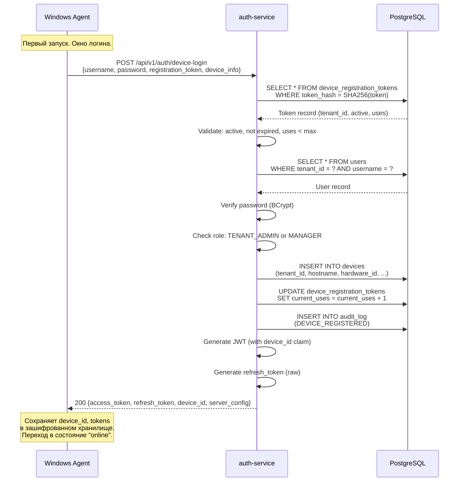
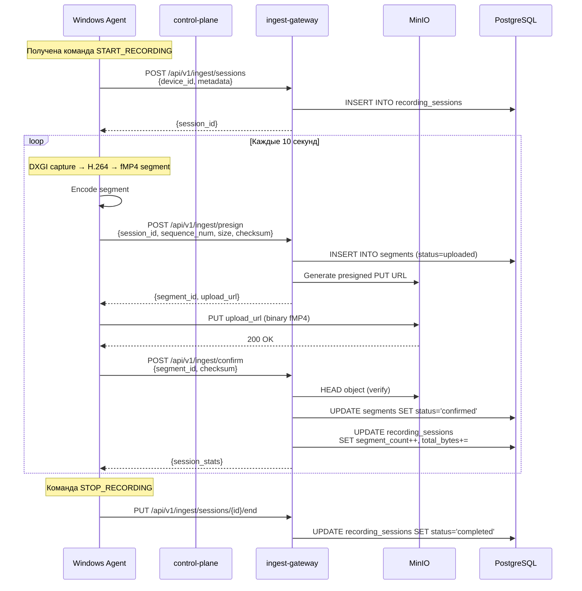
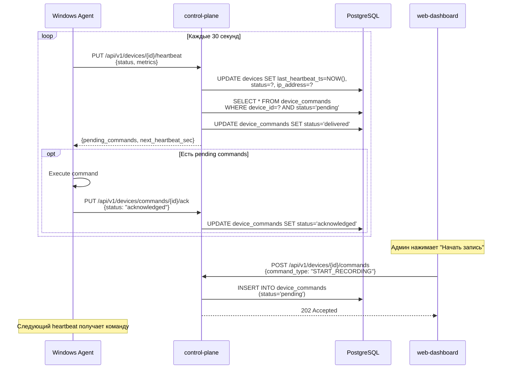
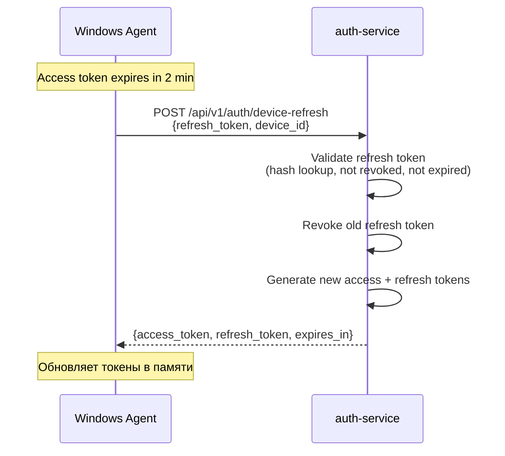

# Windows Screen Recorder Agent - Техническая Спецификация

**Версия:** 1.0
**Дата:** 2026-03-01
**Ветка:** feature/windows-agent

---

## 1. Обзор

### 1.1 Назначение

Windows-приложение для записи экрана операторов контактного центра. Полностью управляется с сервера. Работает как Windows Service с System Tray UI.

### 1.2 Scope

| Компонент | Описание |
|-----------|----------|
| **auth-service** (расширение) | Device registration tokens, device login endpoint |
| **control-plane** (новый сервис) | Устройства CRUD, heartbeat, NATS commands, политики записи |
| **ingest-gateway** (новый сервис) | Presigned URL, upload confirm, MinIO интеграция |
| **windows-agent** (новый) | Screen capture (DXGI+MF), fMP4, upload, tray UI, Windows Service |
| **web-dashboard** (расширение) | Генерация registration tokens, страница устройств |

### 1.3 Ключевые решения

- **Screen Capture**: DXGI Desktop Duplication + MediaFoundation H.264 (нативный C++, вызов из Java через JNI)
- **Организационный токен**: Отдельный registration token, генерируется администратором в UI
- **Service Wrapper**: Inno Setup + sc.exe для регистрации Windows Service
- **Сборка/тестирование**: На машине 192.168.1.135 (Windows)

---

## 2. Архитектура

### 2.1 Общая диаграмма

```
┌─────────────────────────────────────────────────────────────────┐
│                     Windows Desktop                              │
│  ┌──────────────────┐    ┌─────────────────────────────────┐    │
│  │  Tray UI (Java)  │◄──►│   Agent Service (Java)          │    │
│  │  - Status icon   │    │   - AuthManager                 │    │
│  │  - Config window │    │   - ScreenCaptureManager (JNI)  │    │
│  │  - Stats display │    │   - SegmentUploader             │    │
│  └──────────────────┘    │   - CommandHandler              │    │
│                          │   - HeartbeatScheduler          │    │
│                          │   - LocalBufferManager (SQLite) │    │
│                          └────────┬────────────────────────┘    │
└───────────────────────────────────┼─────────────────────────────┘
                                    │ HTTPS
                    ┌───────────────┼───────────────┐
                    │               │               │
              ┌─────▼─────┐  ┌─────▼──────┐  ┌─────▼──────┐
              │ auth-svc   │  │ control-   │  │ ingest-    │
              │ :8081      │  │ plane :8080│  │ gw :8084   │
              └─────┬──────┘  └─────┬──────┘  └─────┬──────┘
                    │               │               │
              ┌─────▼───────────────▼───────────────▼──────┐
              │              PostgreSQL :5432               │
              │     devices | sessions | segments          │
              └────────────────────────────────────────────┘
                                    │
              ┌─────────────────────▼──────────────────────┐
              │          MinIO (S3) — video segments       │
              └────────────────────────────────────────────┘
```

### 2.2 Потоки данных

**Registration Flow:**
```
Agent → POST /api/v1/auth/device-login (username, password, registration_token)
     → auth-service validates credentials + token
     → auth-service creates device record → returns device_id + JWT
     → Agent stores device_id + credentials locally (encrypted)
```

**Recording Flow:**
```
Agent → POST /api/v1/ingest/presign (device_id, segment_metadata)
     → ingest-gateway → returns presigned S3 URL
Agent → PUT presigned_url (fMP4 segment binary)
     → MinIO stores segment
Agent → POST /api/v1/ingest/confirm (segment_id, checksum)
     → ingest-gateway → updates PostgreSQL, publishes NATS event
```

**Command Flow:**
```
control-plane → POST /api/v1/devices/{id}/command (START/STOP/UPDATE_POLICY)
             → Agent polls GET /api/v1/devices/{id}/commands?after={last_seq}
             → Agent executes command, reports status
```

**Heartbeat Flow:**
```
Agent → PUT /api/v1/devices/{id}/heartbeat (status, metrics)
     → control-plane → updates device status, last_heartbeat_ts
     → Returns: pending commands (piggyback)
```

---

## 3. Модель данных (новые таблицы)

### 3.1 device_registration_tokens

Токены для регистрации устройств. Генерируются администратором в UI.

```sql
-- V14__create_device_registration_tokens.sql
CREATE TABLE device_registration_tokens (
    id              UUID PRIMARY KEY DEFAULT gen_random_uuid(),
    tenant_id       UUID NOT NULL REFERENCES tenants(id),
    token_hash      VARCHAR(255) NOT NULL UNIQUE,  -- SHA-256 хеш
    name            VARCHAR(255) NOT NULL,          -- человекочитаемое имя
    max_uses        INTEGER,                        -- NULL = unlimited
    current_uses    INTEGER NOT NULL DEFAULT 0,
    expires_at      TIMESTAMPTZ,                    -- NULL = never expires
    is_active       BOOLEAN NOT NULL DEFAULT TRUE,
    created_by      UUID NOT NULL REFERENCES users(id),
    created_ts      TIMESTAMPTZ NOT NULL DEFAULT NOW(),
    updated_ts      TIMESTAMPTZ NOT NULL DEFAULT NOW()
);

CREATE INDEX idx_drt_tenant_id ON device_registration_tokens(tenant_id);
CREATE INDEX idx_drt_token_hash ON device_registration_tokens(token_hash);
CREATE INDEX idx_drt_active ON device_registration_tokens(tenant_id, is_active)
    WHERE is_active = TRUE;
```

### 3.2 devices

Реестр устройств (агентов).

```sql
-- V15__create_devices.sql
CREATE TABLE devices (
    id                  UUID PRIMARY KEY DEFAULT gen_random_uuid(),
    tenant_id           UUID NOT NULL REFERENCES tenants(id),
    user_id             UUID REFERENCES users(id),          -- оператор, если привязан
    registration_token_id UUID REFERENCES device_registration_tokens(id),

    hostname            VARCHAR(255) NOT NULL,
    os_version          VARCHAR(255),
    agent_version       VARCHAR(50),
    hardware_id         VARCHAR(255),                       -- уникальный hardware fingerprint

    status              VARCHAR(20) NOT NULL DEFAULT 'offline',
    -- offline | online | recording | error

    last_heartbeat_ts   TIMESTAMPTZ,
    last_recording_ts   TIMESTAMPTZ,

    ip_address          VARCHAR(45),

    settings            JSONB NOT NULL DEFAULT '{}',
    -- { "capture_fps": 5, "segment_duration_sec": 10, "quality": "medium" }

    is_active           BOOLEAN NOT NULL DEFAULT TRUE,

    created_ts          TIMESTAMPTZ NOT NULL DEFAULT NOW(),
    updated_ts          TIMESTAMPTZ NOT NULL DEFAULT NOW(),

    UNIQUE(tenant_id, hardware_id)
);

CREATE INDEX idx_devices_tenant_id ON devices(tenant_id);
CREATE INDEX idx_devices_tenant_status ON devices(tenant_id, status);
CREATE INDEX idx_devices_user_id ON devices(user_id);
CREATE INDEX idx_devices_heartbeat ON devices(last_heartbeat_ts)
    WHERE status != 'offline';
```

### 3.3 recording_sessions

Сессии записи.

```sql
-- V16__create_recording_sessions.sql
CREATE TABLE recording_sessions (
    id              UUID PRIMARY KEY DEFAULT gen_random_uuid(),
    tenant_id       UUID NOT NULL REFERENCES tenants(id),
    device_id       UUID NOT NULL REFERENCES devices(id),
    user_id         UUID REFERENCES users(id),

    status          VARCHAR(20) NOT NULL DEFAULT 'active',
    -- active | completed | failed | interrupted

    started_ts      TIMESTAMPTZ NOT NULL DEFAULT NOW(),
    ended_ts        TIMESTAMPTZ,

    segment_count   INTEGER NOT NULL DEFAULT 0,
    total_bytes     BIGINT NOT NULL DEFAULT 0,
    total_duration_ms BIGINT NOT NULL DEFAULT 0,

    metadata        JSONB NOT NULL DEFAULT '{}',
    -- { "resolution": "1920x1080", "fps": 5, "codec": "h264" }

    created_ts      TIMESTAMPTZ NOT NULL DEFAULT NOW(),
    updated_ts      TIMESTAMPTZ NOT NULL DEFAULT NOW()
);

CREATE INDEX idx_rs_tenant_id ON recording_sessions(tenant_id);
CREATE INDEX idx_rs_device_id ON recording_sessions(device_id);
CREATE INDEX idx_rs_tenant_status ON recording_sessions(tenant_id, status);
CREATE INDEX idx_rs_started ON recording_sessions(started_ts);
```

### 3.4 segments (партиционированная)

Видео-сегменты (fMP4).

```sql
-- V17__create_segments_partitioned.sql
CREATE TABLE segments (
    id              UUID NOT NULL,
    created_ts      TIMESTAMPTZ NOT NULL DEFAULT NOW(),

    tenant_id       UUID NOT NULL,
    device_id       UUID NOT NULL,
    session_id      UUID NOT NULL,

    sequence_num    INTEGER NOT NULL,           -- порядковый номер в сессии

    s3_bucket       VARCHAR(255) NOT NULL,
    s3_key          VARCHAR(1024) NOT NULL,     -- {tenant_id}/{device_id}/{session_id}/{seq}.mp4

    size_bytes      BIGINT NOT NULL,
    duration_ms     INTEGER NOT NULL,
    checksum_sha256 VARCHAR(64) NOT NULL,

    status          VARCHAR(20) NOT NULL DEFAULT 'uploaded',
    -- uploaded | confirmed | indexed | failed

    metadata        JSONB NOT NULL DEFAULT '{}',
    -- { "resolution": "1920x1080", "fps": 5, "codec": "h264", "keyframe_count": 1 }

    PRIMARY KEY (id, created_ts)
) PARTITION BY RANGE (created_ts);

-- Месячные партиции на 2026
CREATE TABLE segments_2026_01 PARTITION OF segments
    FOR VALUES FROM ('2026-01-01') TO ('2026-02-01');
CREATE TABLE segments_2026_02 PARTITION OF segments
    FOR VALUES FROM ('2026-02-01') TO ('2026-03-01');
CREATE TABLE segments_2026_03 PARTITION OF segments
    FOR VALUES FROM ('2026-03-01') TO ('2026-04-01');
CREATE TABLE segments_2026_04 PARTITION OF segments
    FOR VALUES FROM ('2026-04-01') TO ('2026-05-01');
CREATE TABLE segments_2026_05 PARTITION OF segments
    FOR VALUES FROM ('2026-05-01') TO ('2026-06-01');
CREATE TABLE segments_2026_06 PARTITION OF segments
    FOR VALUES FROM ('2026-06-01') TO ('2026-07-01');
CREATE TABLE segments_2026_07 PARTITION OF segments
    FOR VALUES FROM ('2026-07-01') TO ('2026-08-01');
CREATE TABLE segments_2026_08 PARTITION OF segments
    FOR VALUES FROM ('2026-08-01') TO ('2026-09-01');
CREATE TABLE segments_2026_09 PARTITION OF segments
    FOR VALUES FROM ('2026-09-01') TO ('2026-10-01');
CREATE TABLE segments_2026_10 PARTITION OF segments
    FOR VALUES FROM ('2026-10-01') TO ('2026-11-01');
CREATE TABLE segments_2026_11 PARTITION OF segments
    FOR VALUES FROM ('2026-11-01') TO ('2026-12-01');
CREATE TABLE segments_2026_12 PARTITION OF segments
    FOR VALUES FROM ('2026-12-01') TO ('2027-01-01');

CREATE INDEX idx_segments_tenant ON segments(tenant_id, created_ts);
CREATE INDEX idx_segments_device ON segments(device_id, created_ts);
CREATE INDEX idx_segments_session ON segments(session_id, sequence_num);
CREATE INDEX idx_segments_status ON segments(status, created_ts);
CREATE INDEX idx_segments_s3_key ON segments(s3_key);
```

### 3.5 device_commands

Очередь команд для устройств (HTTP-fallback, без NATS).

```sql
-- V18__create_device_commands.sql
CREATE TABLE device_commands (
    id              UUID PRIMARY KEY DEFAULT gen_random_uuid(),
    tenant_id       UUID NOT NULL REFERENCES tenants(id),
    device_id       UUID NOT NULL REFERENCES devices(id),

    command_type    VARCHAR(50) NOT NULL,
    -- START_RECORDING | STOP_RECORDING | UPDATE_SETTINGS | RESTART_AGENT | UNREGISTER

    payload         JSONB NOT NULL DEFAULT '{}',

    status          VARCHAR(20) NOT NULL DEFAULT 'pending',
    -- pending | delivered | acknowledged | failed | expired

    created_by      UUID REFERENCES users(id),
    delivered_ts    TIMESTAMPTZ,
    acknowledged_ts TIMESTAMPTZ,
    expires_at      TIMESTAMPTZ,

    created_ts      TIMESTAMPTZ NOT NULL DEFAULT NOW()
);

CREATE INDEX idx_dc_device_pending ON device_commands(device_id, status, created_ts)
    WHERE status = 'pending';
CREATE INDEX idx_dc_tenant ON device_commands(tenant_id, created_ts);
```

### 3.6 Новые permissions

```sql
-- V19__add_device_token_permissions.sql
INSERT INTO permissions (id, code, name, description, resource, action, created_ts)
VALUES
    (gen_random_uuid(), 'DEVICE_TOKENS:CREATE', 'Create Device Registration Tokens',
     'Generate registration tokens for device enrollment', 'DEVICE_TOKENS', 'CREATE', NOW()),
    (gen_random_uuid(), 'DEVICE_TOKENS:READ', 'View Device Registration Tokens',
     'View existing registration tokens', 'DEVICE_TOKENS', 'READ', NOW()),
    (gen_random_uuid(), 'DEVICE_TOKENS:DELETE', 'Revoke Device Registration Tokens',
     'Deactivate registration tokens', 'DEVICE_TOKENS', 'DELETE', NOW()),
    (gen_random_uuid(), 'RECORDINGS:MANAGE', 'Manage Recording Sessions',
     'Start/stop recording sessions on devices', 'RECORDINGS', 'MANAGE', NOW());

-- Назначить пермишены ролям в template-тенанте
-- SUPER_ADMIN, TENANT_ADMIN, MANAGER получают DEVICE_TOKENS:*
-- SUPER_ADMIN, TENANT_ADMIN, MANAGER, SUPERVISOR получают RECORDINGS:MANAGE
```

---

## 4. API Контракты

### 4.1 auth-service (расширение)

#### POST /api/v1/auth/device-login

Аутентификация агента при первом запуске. Создаёт запись в `devices`.

**Request:**
```json
{
    "username": "admin",
    "password": "Admin@12345",
    "registration_token": "tok_a1b2c3d4e5f6...",
    "device_info": {
        "hostname": "DESKTOP-ABC123",
        "os_version": "Windows 11 Pro 23H2",
        "agent_version": "1.0.0",
        "hardware_id": "MB-xxxx-CPU-yyyy-DISK-zzzz"
    }
}
```

**Response 200:**
```json
{
    "access_token": "eyJhbGciOiJIUzI1NiJ9...",
    "refresh_token": "rt_a1b2c3d4...",
    "token_type": "Bearer",
    "expires_in": 900,
    "device_id": "uuid",
    "device_status": "online",
    "user": { ... },
    "server_config": {
        "heartbeat_interval_sec": 30,
        "segment_duration_sec": 10,
        "capture_fps": 5,
        "quality": "medium",
        "ingest_base_url": "https://ingest.example.com",
        "control_plane_base_url": "https://cp.example.com"
    }
}
```

**Errors:**
| Code | HTTP | Описание |
|------|------|----------|
| INVALID_CREDENTIALS | 401 | Неверный логин/пароль |
| INVALID_REGISTRATION_TOKEN | 401 | Токен невалиден, expired, или лимит использований |
| TENANT_NOT_FOUND | 404 | Тенант не найден (по токену) |
| DEVICE_ALREADY_REGISTERED | 409 | hardware_id уже зарегистрирован в этом тенанте |
| ACCOUNT_DISABLED | 403 | Пользователь или тенант деактивирован |

**Логика:**
1. Валидировать registration_token (hash → lookup → check active, expiry, uses)
2. Извлечь tenant_id из токена
3. Валидировать username + password в контексте этого тенанта
4. Проверить: пользователь имеет роль TENANT_ADMIN или MANAGER
5. Создать запись в `devices` (или обновить, если hardware_id уже есть)
6. Инкрементировать `current_uses` у registration token
7. Сгенерировать JWT с дополнительным claim `device_id`
8. Вернуть refresh_token в body (не cookie!) — для desktop-приложения
9. Audit log: DEVICE_REGISTERED

#### POST /api/v1/auth/device-refresh

Обновление JWT для агента (по raw refresh token в body, не cookie).

**Request:**
```json
{
    "refresh_token": "rt_a1b2c3d4...",
    "device_id": "uuid"
}
```

**Response 200:**
```json
{
    "access_token": "eyJhbGciOiJIUzI1NiJ9...",
    "refresh_token": "rt_new_token...",
    "token_type": "Bearer",
    "expires_in": 900
}
```

#### Device Registration Tokens Management

**POST /api/v1/device-tokens** — Создать токен
Permission: `DEVICE_TOKENS:CREATE`

**Request:**
```json
{
    "name": "Офис продаж - март 2026",
    "max_uses": 50,
    "expires_at": "2026-04-01T00:00:00Z"
}
```

**Response 201:**
```json
{
    "id": "uuid",
    "token": "drt_a1b2c3d4e5f6g7h8i9j0...",
    "name": "Офис продаж - март 2026",
    "max_uses": 50,
    "current_uses": 0,
    "expires_at": "2026-04-01T00:00:00Z",
    "is_active": true,
    "created_ts": "2026-03-01T10:00:00Z"
}
```

> **Важно:** Полный токен (`token`) возвращается ТОЛЬКО при создании. В последующих GET-запросах — только первые 8 символов + маска.

**GET /api/v1/device-tokens** — Список токенов
Permission: `DEVICE_TOKENS:READ`

**DELETE /api/v1/device-tokens/{id}** — Деактивировать токен
Permission: `DEVICE_TOKENS:DELETE`

---

### 4.2 control-plane (новый сервис, порт 8080)

#### Devices

**GET /api/v1/devices** — Список устройств тенанта
Permission: `DEVICES:READ`

**Response 200:**
```json
{
    "content": [
        {
            "id": "uuid",
            "hostname": "DESKTOP-ABC123",
            "os_version": "Windows 11 Pro 23H2",
            "agent_version": "1.0.0",
            "status": "recording",
            "last_heartbeat_ts": "2026-03-01T10:05:00Z",
            "last_recording_ts": "2026-03-01T10:04:55Z",
            "ip_address": "192.168.1.100",
            "user": { "id": "uuid", "username": "operator1", "first_name": "Ivan" },
            "is_active": true,
            "created_ts": "2026-02-15T08:00:00Z"
        }
    ],
    "total_elements": 150,
    "total_pages": 8,
    "page": 0,
    "size": 20
}
```

**GET /api/v1/devices/{id}** — Детали устройства
Permission: `DEVICES:READ`

**PUT /api/v1/devices/{id}** — Обновить настройки устройства
Permission: `DEVICES:UPDATE`

**DELETE /api/v1/devices/{id}** — Деактивировать устройство
Permission: `DEVICES:DELETE`

#### Heartbeat

**PUT /api/v1/devices/{id}/heartbeat** — Heartbeat от агента
Auth: JWT (device owner)

**Request:**
```json
{
    "status": "recording",
    "agent_version": "1.0.0",
    "metrics": {
        "cpu_percent": 12.5,
        "memory_mb": 256,
        "disk_free_gb": 45.2,
        "upload_speed_kbps": 1500,
        "segments_queued": 2,
        "recording_duration_sec": 3600,
        "segments_sent": 360,
        "bytes_sent": 184320000
    }
}
```

**Response 200:**
```json
{
    "server_ts": "2026-03-01T10:05:30Z",
    "pending_commands": [
        {
            "id": "uuid",
            "command_type": "UPDATE_SETTINGS",
            "payload": { "capture_fps": 10 },
            "created_ts": "2026-03-01T10:04:00Z"
        }
    ],
    "next_heartbeat_sec": 30
}
```

#### Commands

**POST /api/v1/devices/{id}/commands** — Отправить команду устройству
Permission: `DEVICES:COMMAND`

**Request:**
```json
{
    "command_type": "START_RECORDING",
    "payload": {}
}
```

**PUT /api/v1/devices/commands/{commandId}/ack** — Подтверждение выполнения
Auth: JWT (device owner)

**Request:**
```json
{
    "status": "acknowledged",
    "result": { "message": "Recording started" }
}
```

---

### 4.3 ingest-gateway (новый сервис, порт 8084)

#### Presign

**POST /api/v1/ingest/presign** — Получить presigned URL для загрузки
Auth: JWT (device)

**Request:**
```json
{
    "device_id": "uuid",
    "session_id": "uuid",
    "sequence_num": 42,
    "size_bytes": 512000,
    "duration_ms": 10000,
    "checksum_sha256": "abc123...",
    "content_type": "video/mp4",
    "metadata": {
        "resolution": "1920x1080",
        "fps": 5,
        "codec": "h264"
    }
}
```

**Response 200:**
```json
{
    "segment_id": "uuid",
    "upload_url": "https://minio.example.com/prg-segments/tenant_id/device_id/session_id/00042.mp4?X-Amz-...",
    "upload_method": "PUT",
    "upload_headers": {
        "Content-Type": "video/mp4"
    },
    "expires_in_sec": 300
}
```

#### Confirm

**POST /api/v1/ingest/confirm** — Подтвердить загрузку
Auth: JWT (device)

**Request:**
```json
{
    "segment_id": "uuid",
    "checksum_sha256": "abc123..."
}
```

**Response 200:**
```json
{
    "segment_id": "uuid",
    "status": "confirmed",
    "session_stats": {
        "segment_count": 42,
        "total_bytes": 21504000,
        "total_duration_ms": 420000
    }
}
```

#### Sessions

**POST /api/v1/ingest/sessions** — Создать сессию записи
Auth: JWT (device)

**Request:**
```json
{
    "device_id": "uuid",
    "metadata": {
        "resolution": "1920x1080",
        "fps": 5,
        "codec": "h264"
    }
}
```

**Response 201:**
```json
{
    "session_id": "uuid",
    "status": "active",
    "started_ts": "2026-03-01T10:00:00Z"
}
```

**PUT /api/v1/ingest/sessions/{id}/end** — Завершить сессию
Auth: JWT (device)

---

## 5. Sequence Diagrams

### 5.1 Device Registration (первый запуск)



### 5.2 Recording Flow (непрерывная запись)



### 5.3 Heartbeat + Command Delivery



### 5.4 Token Refresh (фоновый процесс)



---

## 6. Windows Agent — Архитектура

### 6.1 Структура проекта

```
windows-agent/
├── pom.xml                          # Maven, Java 21
├── src/
│   ├── main/
│   │   ├── java/com/prg/agent/
│   │   │   ├── AgentApplication.java         # Entry point
│   │   │   ├── config/
│   │   │   │   ├── AgentConfig.java           # Конфигурация из файла + сервера
│   │   │   │   └── CryptoConfig.java          # AES-256 для хранения credentials
│   │   │   ├── auth/
│   │   │   │   ├── AuthManager.java           # Login, token refresh, credential storage
│   │   │   │   └── TokenStore.java            # Encrypted token persistence
│   │   │   ├── capture/
│   │   │   │   ├── ScreenCaptureManager.java  # Управление записью
│   │   │   │   ├── NativeBridge.java          # JNI мост к C++ DLL
│   │   │   │   └── SegmentWriter.java         # fMP4 сборка из raw frames
│   │   │   ├── upload/
│   │   │   │   ├── SegmentUploader.java       # Presign → PUT → Confirm
│   │   │   │   ├── UploadQueue.java           # Очередь загрузки с retry
│   │   │   │   └── SessionManager.java        # Управление recording sessions
│   │   │   ├── command/
│   │   │   │   ├── CommandHandler.java        # Обработка серверных команд
│   │   │   │   └── HeartbeatScheduler.java    # Периодический heartbeat
│   │   │   ├── storage/
│   │   │   │   ├── LocalBuffer.java           # SQLite для offline буферизации
│   │   │   │   └── SegmentFileManager.java    # Управление локальными файлами
│   │   │   ├── ui/
│   │   │   │   ├── TrayManager.java           # System Tray integration
│   │   │   │   ├── TrayIconProvider.java      # Цветные иконки по статусу
│   │   │   │   ├── ConfigWindow.java          # Окно конфигуратора (Swing)
│   │   │   │   ├── LoginPanel.java            # Панель логина (до auth)
│   │   │   │   └── StatusPanel.java           # Панель статуса (после auth)
│   │   │   ├── service/
│   │   │   │   ├── AgentService.java          # Координатор всех компонентов
│   │   │   │   └── MetricsCollector.java      # CPU, RAM, disk metrics
│   │   │   └── util/
│   │   │       ├── HttpClient.java            # HTTP с retry и auth
│   │   │       └── HardwareId.java            # Генерация hardware fingerprint
│   │   ├── resources/
│   │   │   ├── agent.properties               # Дефолтная конфигурация
│   │   │   ├── icons/                         # Tray иконки (red, orange, yellow, green)
│   │   │   │   ├── tray_red.png
│   │   │   │   ├── tray_orange.png
│   │   │   │   ├── tray_yellow.png
│   │   │   │   └── tray_green.png
│   │   │   └── logback.xml
│   │   └── native/                            # C++ код для DXGI + MediaFoundation
│   │       ├── CMakeLists.txt
│   │       ├── include/
│   │       │   └── screen_capture.h
│   │       └── src/
│   │           ├── screen_capture.cpp          # DXGI Desktop Duplication
│   │           ├── h264_encoder.cpp            # MediaFoundation H.264
│   │           ├── fmp4_muxer.cpp              # fMP4 muxing
│   │           └── jni_bridge.cpp              # JNI exports
│   └── test/
│       └── java/com/prg/agent/
│           ├── auth/AuthManagerTest.java
│           ├── upload/SegmentUploaderTest.java
│           └── command/CommandHandlerTest.java
├── installer/
│   ├── setup.iss                    # Inno Setup script
│   ├── service-wrapper.bat          # Скрипт регистрации службы
│   └── uninstall-service.bat        # Скрипт удаления службы
└── native-build/
    └── build.bat                    # Сборка C++ DLL
```

### 6.2 Состояния агента

```
┌──────────┐    login OK     ┌────────────┐   server OK   ┌───────────┐
│ NOT_AUTH │ ──────────────► │ CONNECTING │ ────────────► │  ONLINE   │
│  (RED)   │                 │  (ORANGE)  │               │ (YELLOW)  │
└──────────┘                 └────────────┘               └─────┬─────┘
     ▲                            ▲                             │
     │ logout/                    │ connection                  │ START_RECORDING
     │ credentials invalid        │ lost                        ▼
     │                            │                       ┌───────────┐
     │                            └────────────────────── │ RECORDING │
     │                                                    │  (GREEN)  │
     └──────────────────────────────────────────────────  └───────────┘
                          fatal error
```

### 6.3 Tray Icon & Menu

**Состояния иконки:**

| Состояние | Цвет | Tooltip | Описание |
|-----------|------|---------|----------|
| NOT_AUTHENTICATED | Красный | "PRG Recorder: Требуется вход" | Нет сохранённых credentials |
| DISCONNECTED | Оранжевый | "PRG Recorder: Нет подключения к серверу" | Credentials есть, но сервер недоступен |
| ONLINE | Жёлтый | "PRG Recorder: Подключён (не записывает)" | Heartbeat OK, запись не ведётся |
| RECORDING | Зелёный | "PRG Recorder: Запись (HH:MM:SS)" | Активная запись |

**Контекстное меню:**

```
┌─────────────────────────────────┐
│ ● Статус: Запись ведётся        │  (цветной индикатор + текст)
│ ─────────────────────────────── │
│ Открыть конфигуратор...         │  → открывает ConfigWindow
│ Открыть лог-файл               │  → открывает текущий лог в Notepad
│ ─────────────────────────────── │
│ PRG Recorder v1.0.0             │  (disabled, информационный)
│ ─────────────────────────────── │
│ Выход                           │  (только если разрешено политикой)
└─────────────────────────────────┘
```

### 6.4 Окно конфигуратора

#### До логина (LoginPanel)

```
┌─────────────────────────────────────────┐
│         PRG Screen Recorder             │
│                                         │
│  Токен организации:                     │
│  ┌─────────────────────────────────┐    │
│  │ drt_a1b2c3d4...                 │    │
│  └─────────────────────────────────┘    │
│                                         │
│  Имя пользователя:                     │
│  ┌─────────────────────────────────┐    │
│  │ admin                           │    │
│  └─────────────────────────────────┘    │
│                                         │
│  Пароль:                                │
│  ┌─────────────────────────────────┐    │
│  │ ••••••••                        │    │
│  └─────────────────────────────────┘    │
│                                         │
│         ┌──────────────────┐            │
│         │   Войти          │            │
│         └──────────────────┘            │
│                                         │
│  ┌─────────────────────────────────┐    │
│  │ Ошибка: Неверный логин или     │    │
│  │ пароль                          │    │
│  └─────────────────────────────────┘    │
└─────────────────────────────────────────┘
```

#### После логина (StatusPanel)

```
┌─────────────────────────────────────────┐
│         PRG Screen Recorder             │
│                                         │
│  Подключение                            │
│  ├ Сервер: https://cp.example.com       │
│  ├ Тенант: Acme Corp                    │
│  ├ Устройство: DESKTOP-ABC123           │
│  └ Статус: ● Запись ведётся             │
│                                         │
│  Статистика записи                      │
│  ├ Время записи:    02:15:33 (онлайн)   │
│  ├ Отправлено чанков: 813               │
│  └ Отправлено данных: 412.5 МБ          │
│                                         │
│  Связь с сервером                       │
│  ├ Последний heartbeat: 10 сек назад    │
│  └ Последняя отправка:  3 сек назад     │
│                                         │
│  ┌──────────────────────────────────┐   │
│  │  Открыть файл логов             │   │
│  └──────────────────────────────────┘   │
└─────────────────────────────────────────┘
```

### 6.5 Screen Capture (C++ / JNI)

**DXGI Desktop Duplication API:**
- Захват кадров рабочего стола через IDXGIOutputDuplication
- Аппаратное ускорение (GPU → GPU texture copy)
- Настраиваемый FPS (по умолчанию 5 FPS)

**MediaFoundation H.264 Encoder:**
- Аппаратный кодек через MFT (Media Foundation Transform)
- Профиль: Baseline (для совместимости)
- Битрейт: adaptive (300-1500 kbps в зависимости от quality)
- Keyframe interval: каждые 2 секунды

**fMP4 Muxer:**
- Формат: Fragmented MP4 (ISO BMFF)
- Каждый сегмент: init segment + moof + mdat
- Длительность сегмента: 10 секунд (настраивается с сервера)
- Совместимость с HLS (для playback-service)

**JNI Interface:**
```java
public class NativeBridge {
    static { System.loadLibrary("prg_capture"); }

    public static native long createCapture(int fps, int quality, String outputPath);
    public static native boolean startCapture(long handle);
    public static native boolean stopCapture(long handle);
    public static native String getLastSegmentPath(long handle);
    public static native void destroyCapture(long handle);
    public static native String getLastError(long handle);
    public static native CaptureMetrics getMetrics(long handle);
}
```

### 6.6 Offline буферизация

При потере связи с сервером:
1. Запись продолжается
2. fMP4 сегменты сохраняются локально в `%APPDATA%/PRG/segments/`
3. SQLite хранит метаданные: `local_segments(id, session_id, seq_num, file_path, size, created_ts, uploaded)`
4. При восстановлении связи — фоновая отправка буфера в порядке очереди
5. Максимальный размер буфера: 2 ГБ (настраивается), по достижении — удаляются старейшие

### 6.7 Windows Service

**Архитектура: Service + Tray процесс**

```
Windows Service (SYSTEM account)
  └─ Java Agent Process (recording, upload, heartbeat)
      └─ spawns: Tray Process (user session, interactive desktop)
          └─ Swing UI (tray icon, config window)
          └─ Communicates with Agent via local socket/pipe
```

**Inno Setup installer:**
- Устанавливает JRE 21 (embedded) + Agent JAR + native DLL + FFmpeg
- Регистрирует Windows Service через `sc.exe create`
- Настраивает автозапуск (Automatic start)
- Добавляет tray launcher в `HKCU\...\Run`

**service-wrapper.bat:**
```batch
sc create PRGScreenRecorder ^
    binPath= "\"C:\Program Files\PRG\jre\bin\java.exe\" -jar \"C:\Program Files\PRG\agent.jar\" --service" ^
    DisplayName= "PRG Screen Recorder" ^
    start= auto ^
    description= "PRG Screen Recorder Agent - captures and uploads screen recordings"
sc failure PRGScreenRecorder reset= 86400 actions= restart/60000/restart/120000/restart/300000
```

---

## 7. Серверные сервисы — Ключевые детали

### 7.1 control-plane (порт 8080)

**Стек:** Java 21, Spring Boot 3.x, Spring Data JPA, Spring Web

**Зависимости:**
- PostgreSQL (devices, device_commands)
- auth-service (validate-token, check-access)
- NATS JetStream (опционально, V2)

**Security:** JWT-авторизация через auth-service internal API
- Каждый запрос → `POST /api/v1/internal/validate-token`
- Проверка permissions через `POST /api/v1/internal/check-access`

**Endpoints summary:**
| Method | Path | Permission |
|--------|------|------------|
| GET | /api/v1/devices | DEVICES:READ |
| GET | /api/v1/devices/{id} | DEVICES:READ |
| PUT | /api/v1/devices/{id} | DEVICES:UPDATE |
| DELETE | /api/v1/devices/{id} | DEVICES:DELETE |
| PUT | /api/v1/devices/{id}/heartbeat | Device JWT |
| POST | /api/v1/devices/{id}/commands | DEVICES:COMMAND |
| PUT | /api/v1/devices/commands/{id}/ack | Device JWT |
| GET | /api/v1/devices/{id}/commands | Device JWT |

### 7.2 ingest-gateway (порт 8084)

**Стек:** Java 21, Spring Boot 3.x, Spring WebFlux (reactive), AWS S3 SDK

**Зависимости:**
- MinIO (S3-совместимое хранилище)
- PostgreSQL (segments, recording_sessions)
- auth-service (validate-token)

**S3 Structure:**
```
prg-segments/
  {tenant_id}/
    {device_id}/
      {session_id}/
        init.mp4              # Initialization segment
        00001.mp4             # Fragment 1
        00002.mp4             # Fragment 2
        ...
```

**Endpoints summary:**
| Method | Path | Auth |
|--------|------|------|
| POST | /api/v1/ingest/sessions | Device JWT |
| PUT | /api/v1/ingest/sessions/{id}/end | Device JWT |
| POST | /api/v1/ingest/presign | Device JWT |
| POST | /api/v1/ingest/confirm | Device JWT |

---

## 8. Затронутые сервисы и зависимости

### 8.1 Граф зависимостей

```
web-dashboard ──► auth-service ◄── control-plane
                      ▲                 ▲
                      │                 │
              windows-agent ──────────────
                      │
                      ▼
              ingest-gateway ──► MinIO
```

### 8.2 Порядок реализации

1. **auth-service** (расширение) — device-login, device-refresh, device-tokens CRUD
2. **Flyway миграции** — V14-V19 (в auth-service, применяются на все среды)
3. **control-plane** (новый) — devices API, heartbeat, commands
4. **ingest-gateway** (новый) — presign, confirm, MinIO
5. **web-dashboard** (расширение) — страница device tokens, страница devices
6. **windows-agent** (новый) — tray UI, auth, capture, upload
7. **Installer** (Inno Setup) — установочный пакет

### 8.3 Инфраструктурные зависимости

| Компонент | Требуется | Статус |
|-----------|-----------|--------|
| PostgreSQL 16 | Для всех сервисов | Развёрнут |
| MinIO | Для ingest-gateway | Нужно развернуть/проверить |
| NATS JetStream | V2 (не MVP) | Отложено |
| OpenSearch | Для search-service (не в scope) | Отложено |

---

## 9. Конфигурация и развёртывание

### 9.1 Docker-образы

| Сервис | Image | Port |
|--------|-------|------|
| control-plane | prg-control-plane:latest | 8080 |
| ingest-gateway | prg-ingest-gateway:latest | 8084 |

### 9.2 k8s ресурсы (новые)

**control-plane:**
- Deployment (2 replicas)
- Service (ClusterIP:8080)
- ConfigMap (DB_HOST, AUTH_SERVICE_URL, etc.)
- Secret (DB_PASSWORD, INTERNAL_API_KEY)

**ingest-gateway:**
- Deployment (2 replicas)
- Service (ClusterIP:8084)
- ConfigMap (DB_HOST, S3_ENDPOINT, S3_BUCKET, AUTH_SERVICE_URL)
- Secret (DB_PASSWORD, S3_ACCESS_KEY, S3_SECRET_KEY, INTERNAL_API_KEY)

### 9.3 Windows Agent build (на 192.168.1.135)

```powershell
# Требования на билд-машине:
# - Java 21 JDK
# - Maven 3.9+
# - Visual Studio 2022 (C++ workload) — для native DLL
# - CMake 3.25+
# - Inno Setup 6.x
# - Git

# Сборка native DLL
cd windows-agent/native-build
cmake -B build -S ../src/main/native -G "Visual Studio 17 2022"
cmake --build build --config Release

# Сборка Java
cd windows-agent
mvnw.cmd clean package -DskipTests

# Сборка installer
"C:\Program Files (x86)\Inno Setup 6\ISCC.exe" installer/setup.iss
# Output: installer/Output/PRGScreenRecorderSetup.exe
```

---

## 10. Риски и ограничения

| Риск | Уровень | Митигация |
|------|---------|-----------|
| DXGI не работает в Session 0 (service) | HIGH | Tray process в сессии пользователя запускает capture, передаёт данные service |
| Нет NATS в MVP | MEDIUM | HTTP polling через heartbeat. NATS добавим в V2 |
| Rate limiting in-memory в auth-service | LOW | Для MVP приемлемо. Redis в V2 |
| MinIO не развёрнут | MEDIUM | Проверить/развернуть перед тестированием |
| Нативный C++ код — сложность отладки | HIGH | Тщательное логирование в DLL, fallback на Java Robot API |
| Hardware ID коллизии | LOW | Комбинация MB serial + CPU id + disk serial |
